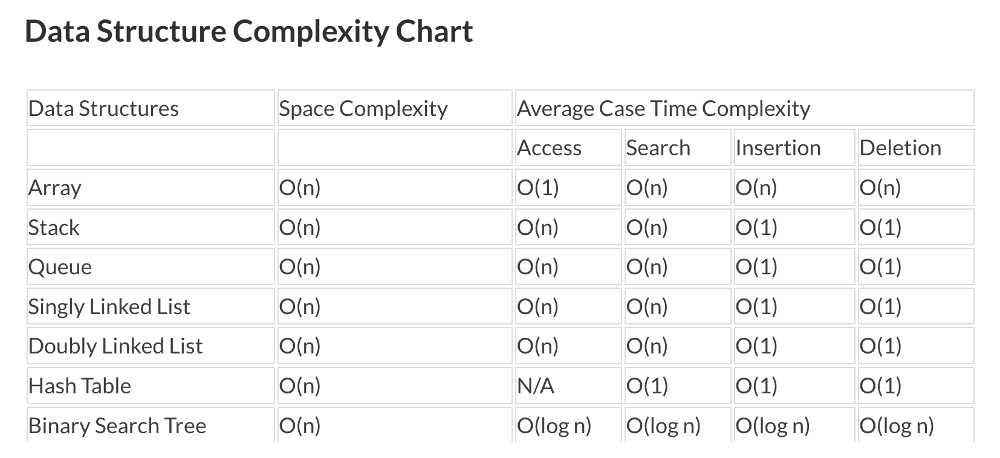
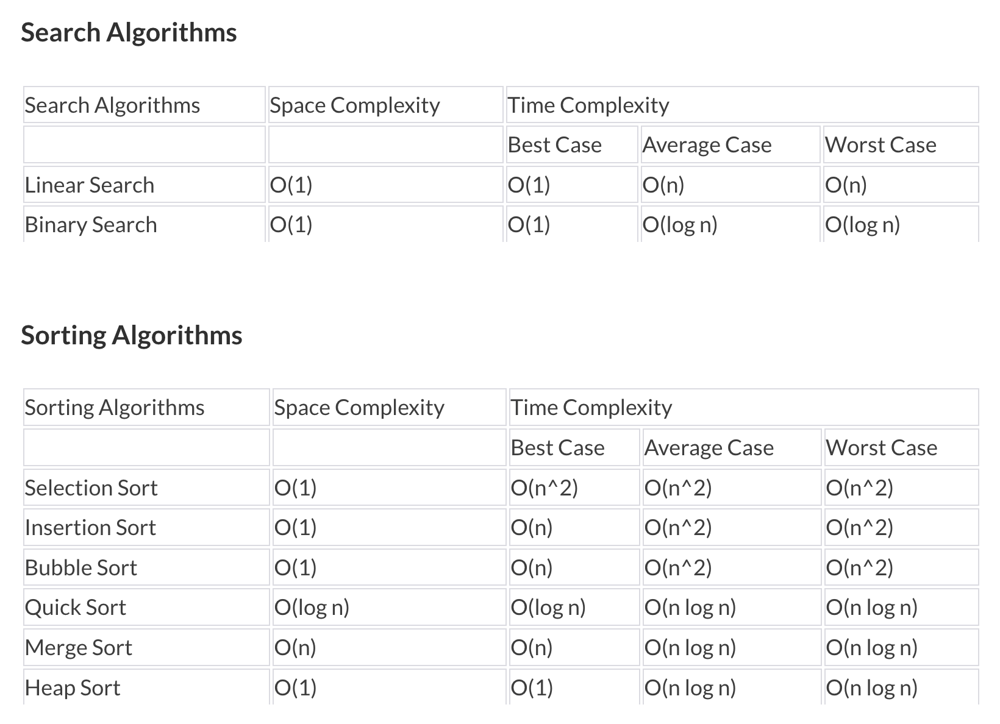
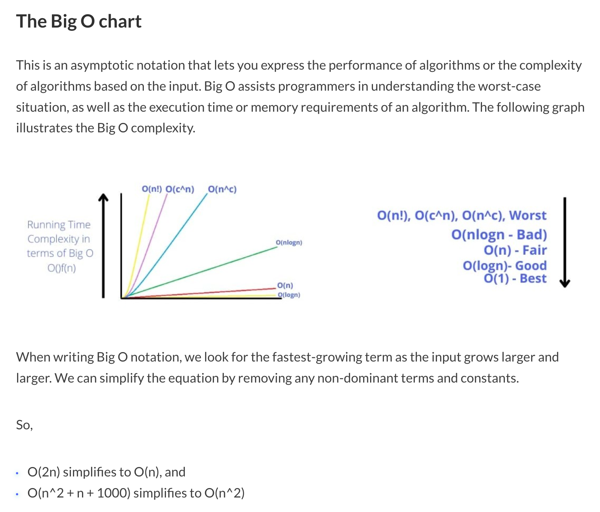
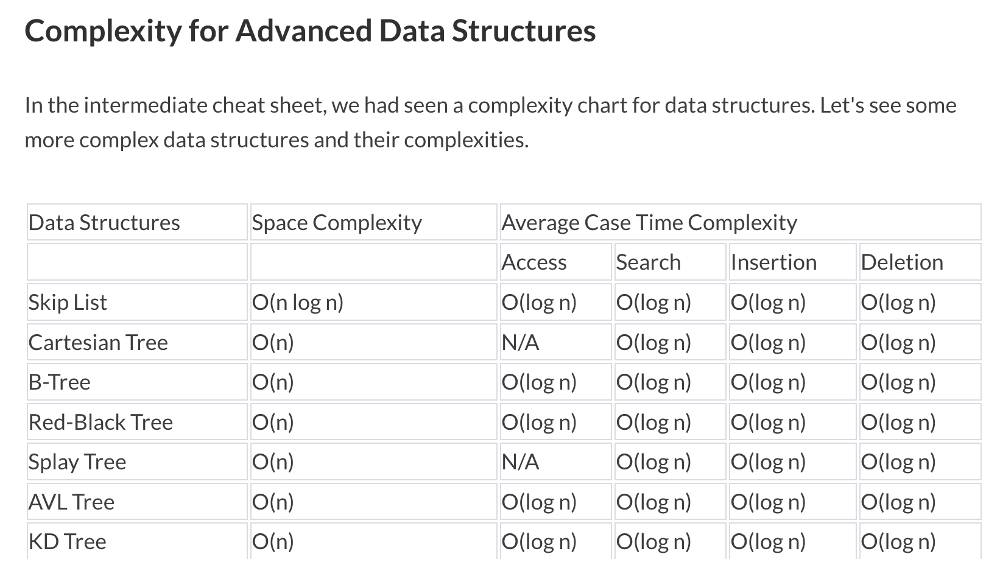

# Big O Notation
+ Big O Notation is a metric for determining an algorithm's efficiency. Put simply, it gives an estimate of how long it takes your code to run on different sets of inputs. You can also see it as a way to measure how effectively your code scales as your input size increases. Big O is known as the algorithm's upper bound as it analyses the worst-case scenario.

+ `Time complexity`: A function's time complexity measures how long it takes to execute in terms of computational steps. It is not a measure of the actual time taken to run an algorithm, instead, it is a measure of how the time taken scales with change in the input length. As a result, the size and magnitude of the processed data have a significant impact. Moreover, It also aids in defining an algorithm's usefulness and evaluating its performance.
+ `Space Complexity`: The space complexity of a function measures the amount of memory your code uses. The overall amount of memory or space utilized by an algorithm/program, including the space of input values for execution, is called space complexity. To determine space complexity, simply compute how much space the variables in an algorithm/a program take up. People usually confuse auxiliary space with space complexity. Auxiliary space is not the equivalent of space complexity, but it’s a part of it. Auxiliary space is just the temporary or extra space, whereas space complexity also includes space used by input values.

## Time and Space Complexities
+ `Constant: O(1)`
  + When there is no dependence on the input size n, an algorithm is said to have a constant time of order O(1).
    + ```
      def example_function(lst):
        print("First element of list: ", lst[0])
      ```
      + The function above will require only one execution step whether the above array contains 1, 100 or 1000 elements. As a result, the function is in constant time with time complexity O(1).

+ `Linear time: O(n)`
  + Linear time is achieved when the running time of an algorithm increases linearly with the length of the input. This means that when a function runs for or iterates over an input size of n, it is said to have a time complexity of order O(n).
    + ```
      def example_function(lst, size):
        for i in range(size):
          print("Element at index", i, " has value: ", lst[i])
      ```
      + The above function will take O(n) time (or "linear time") to complete, where n is the number of entries in the array. The function will print 10 times if the given array has 10 entries, and 100 times if the array has 100 entries. Note: Even if you iterate over half the array, the runtime still depends on the input size, so it will be considered O(n).

+ `Logarithmic time: O(n log n)`
  + When the size of the input data decreases in each step by a certain factor, an algorithm will have logarithmic time complexity. This means as the input size grows, the number of operations that need to be executed grows comparatively much slower. To better understand log n, let’s think of finding a word in a dictionary. If you want to find a word with the letter “p”, you can go through every alphabet and try finding the word, which is linear time O(n). Another route you can take is to open the book to the exact center page. If the word on the center page comes before “p”, you look for the word in the right half. Otherwise, you look in the left half. In this example, you are reducing your input size by half every time, so the number of operations you will need to perform significantly reduces compared to going through every letter. Thus you will have a time complexity of O(log (n)).
    + ```
      def binarySearch(lst, x):
          low = 0
          high = len(lst)-1
          # Repeat until the pointers low and high meet each other
          while low <= high:

              mid = low + (high - low)//2

              if lst[mid] == x:
                  return mid

              elif lst[mid] < x:
                  low = mid + 1

              else:
                  high = mid - 1

          return -1
      ```
      + The Binary Search method takes a sorted list of elements and searches through it for the element x. This is how the algorithm works:
        1. Find the list's midpoint.
        2. Compare the target to the middle.
        3. We've located our goal if our value and the target match.
        4. If our value is lesser than the target, we focus on the list with values ranging from the middle plus one to the highest.
        5. If our value is greater than the target, we focus on the list starting with the smallest value and ending with the midpoint minus one.
        6. Continue until we locate the target or till we reach the last element, which indicates that the element is not present in the list.
        7. With every iteration, the size of our search list shrinks by half. Therefore traversing and finding an entry in the list takes O(log(n)) time.

+ `Quadratic time: O(n^2)`
  + The performance of a quadratic time complexity algorithm is directly related to the squared size of the input data collection. You will encounter such time complexity in programs when you perform several iterations on data sets.
    + ```
      def quadratic_function(lst, size):
          for i in range(size):
              for j in range(size):
                  print("Iteration : " i, "Element of list at ", j, " is ", lst[j])
      ```
      + We have two nested loops in the example above. If the array has n items, the outer loop will execute n times, and the inner loop will execute n times for each iteration of the outer loop, resulting in n^2 prints. If the size of the array is 10, then the loop runs 10x10 times. So the function ten will print 100 times. As a result, this function will take O(n^2) time to complete.

+ `Exponential time: 2^(n)`
  + With each addition to the input (n), the growth rate doubles, and the algorithm iterates across all subsets of the input elements. When an input unit is increased by one, the number of operations executed is doubled.
    + ```
      def fibonacci(n):
          if (n <= 1):
              return 1
          else:
              return fibonacci(n - 2) + fibonacci(n - 1)
      ```
      + In the above example, we use recursion to calculate the Fibonacci sequence. The algorithm O(2^n) specifies a growth rate that doubles every time the input data set is added. An O(2^n) function's exponential growth curve starts shallow and then rises rapidly.

+ `Factorial time: O(n!)`





## Calculating Complexity
+ To determine the time complexity of our code, we must examine it line by line, taking note of the following factors:
  + Assignments, bits, and math operators are all basic operations.
  + Loops and nested loops
  + Recursions and function invocations

+ Dropping the Constants
  + Whenever you calculate the Big O complexity of any algorithm, you can throw out or ignore the constants.
    + ```
      def print_twice(lst, size):
        print("First Print")
        for i in range(size):
            print("Element at index", i, " has value: ", lst[i])

        print("Second Print")
        for i in range(size):
            print("Element at index", i, " has value: ", lst[i])
      ```
      + This is O(2n), which simplifies to just O(n).

    + ```
      def example_printing(lst, size):
        print("First Element is: ", lst[0])

        print("Printing first half of list)
        for i in range(size//2):
            print("Element at index", i, " has value: ", lst[i])

        print("Printing Entire list")
        for i in range(size):
            print("Element at index", i, " has value: ", lst[i])
      ```
      + This is O(1 + n/2 + 100), which simplifies to just O(n). When n grows arbitrarily large, we look for the big O notation. Adding 100 or dividing by two drops dramatically as n grows larger.

+ Base of Logarithm in Big O
  + It makes no difference what the logarithm base is in Big-O complexity analysis; they are asymptotically the same or differ by just a constant factor.
    + `Thus, O(log2 n) = O(log10 n) = O(log n).`


