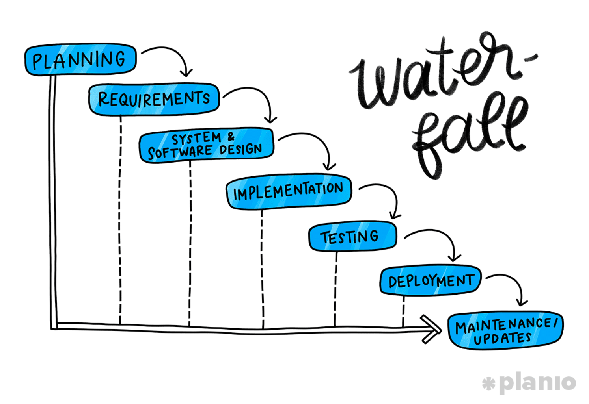
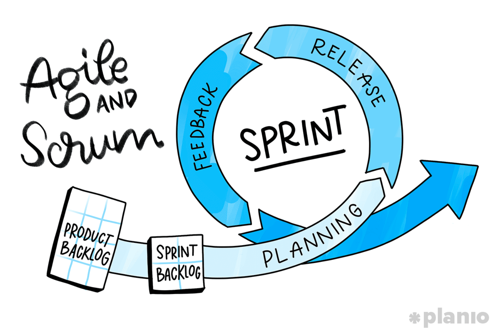
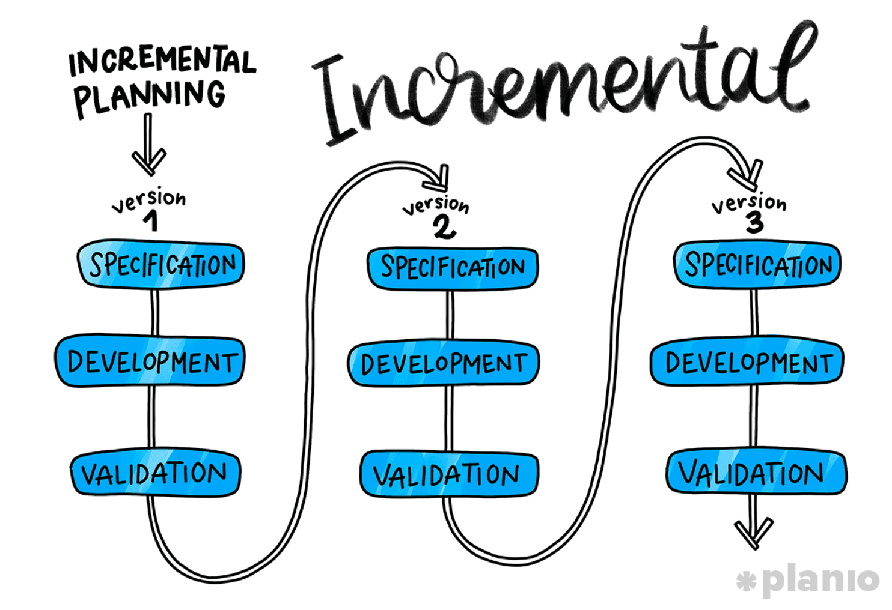
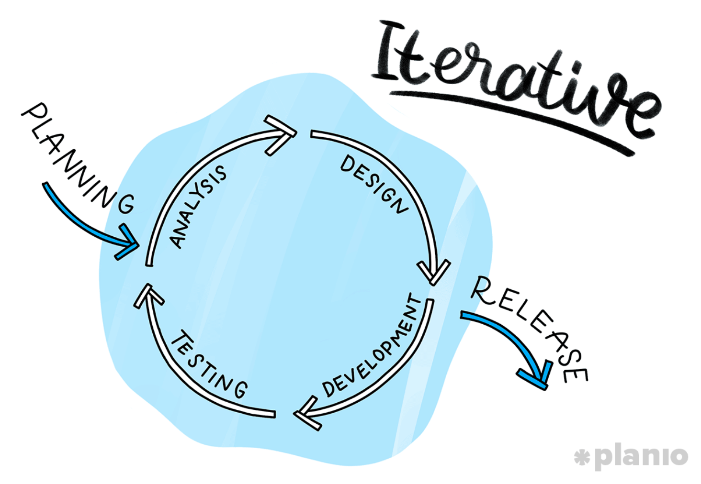
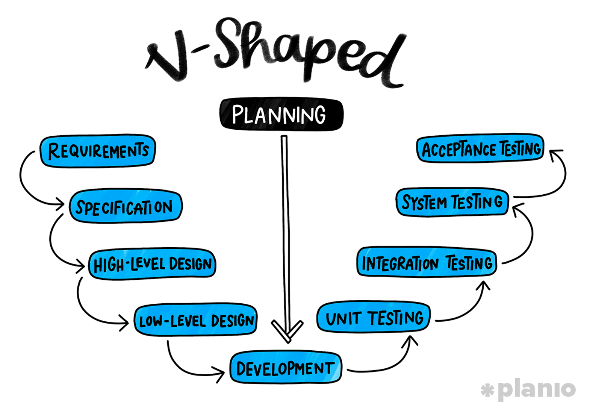
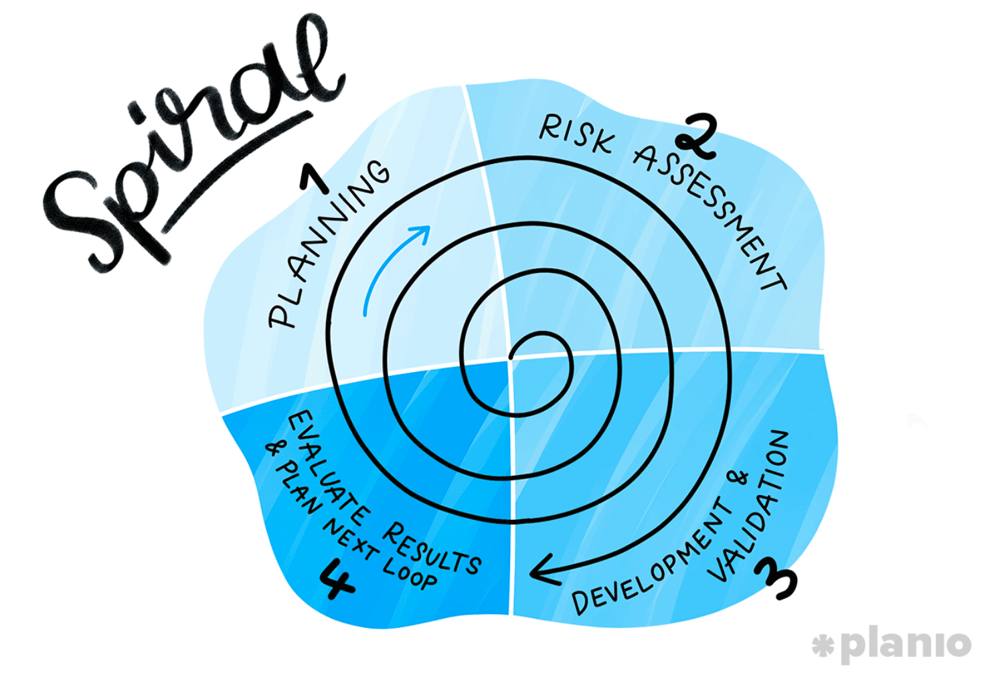

# Software Development Processes

---

## Seven Stages of Software Development Lifecycle (SDLC)
### 1. Analysis and Planning
+ Once a customer or stakeholder has requested a project, the first step of the SDLC is planning. This usually means looking into:
  + Alignment: How does this project connect to your company’s larger mission and goals?
  + Resource availability and allocation: Do you have the people and tools you need to take this on? Or do you need to hire a new development team?
  + Project scheduling: How does this project fit within your company’s goals and other tasks?
  + Cost estimation: How much is it going to cost?
+ The planning phase ensures you’re starting off on the right foot. So try to make sure you include all of the departments that are going to be impacted by this project, including project managers, developers, operations, security, and key stakeholders.
+ At the end of the planning phase, you should have enough information to put together a high-level scope of work (SOW)—a plan that details what’s being built, why, and how you see it coming together.

### 2. Requirements
+ The next step is to understand the technical requirements of this project. Every piece of software—whether it’s an app, website redesign, or new feature—needs to solve a customer problem.
+ As you move on from the planning phase and continue to fill out the SOW, ask questions about the specifics around this project, such as:
  + What problem does this solve?
  + Who’s going to use it and why?
  + What sort of data input/output is needed?
  + Will you need to integrate with other tools or APIs?
  + How will you handle security/privacy?
+ Once your development team gets the answers to these questions, they can start to scope out technical requirements, testing terms, and decide on a technology stack. This phase is also where you might start sprint planning (if you’re using an Agile software development process) or break down large tasks into more actionable steps.

### 3. Design and Prototyping
+ With the requirements in place, it’s time to start designing what this software will look like and how it will function. We’re not talking about aesthetics here, but functionality and flow.
+ Depending on the software development process you’re following, this phase of the SDLC might mean you create simple wireframes to show how interactions will work in the software, or make more full-fledged prototypes using a tool like Marvel or InVision to test with users. Alternatively, you might decide you need more user feedback and do a design sprint to quickly get a feature or idea in front of your users.
+ However you choose to tackle it, this stage helps your team and your client—whether a customer or stakeholder—validate ideas and get valuable feedback before you commit your ideas to code.

### 4. Software Development
+ With everyone onboard with the software’s proposed functionality and design, it’s time to build it according to the requirements and SOW.
+ This phase is obviously the hardest and potentially riskiest stage of the SDLC (and each of the software development processes we’ll discuss below handle it differently.) However, whether you’re working in Agile sprints, building out an MVP, or using the more traditional waterfall method, the goal here is to stick to the SOW, avoid scope creep, and build clean, efficient software.

### 5. Testing
+ As your team is developing the software, you’ll most likely be simultaneously testing, tracking, and fixing bugs. However, once the features are complete and the product is deemed ready to go, you’ll need to do another round of more in-depth testing. This could mean releasing the product to a small group of beta testers or using UX tools to track how users interact with it.
+ While testing could be another long stage of the SDLC, it’s important to make sure you’re not shipping buggy software to real customers. As we wrote in our guide to bug tracking tools and workflows, bugs can kill your reputation, make you lose revenue, and, worst of all, take up hours of development time that could’ve been put towards building new features.

### 6. Deployment
+ With the heavy lifting (and coding) out of the way, it’s time to launch your software to all of your users. What we’re talking about here is pushing your code into production. Not coming up with and implementing a go-to-market strategy (that’s more up to your sales and marketing teams).
+ In most companies, this step should be pretty much automated using a continuous deployment model or Application Release Automation (ARA) tool.

### 7. Maintenance and Updates
+ The SDLC isn’t over once your software is in the wild. It’s a “lifecycle”, remember? The ending of one phase is just the beginning of another, and that goes for post-launch as well.
+ Requirements and customer needs are always evolving. And as people begin to use your software, they’ll undoubtedly find bugs, request new features, and ask for more or different functionality. (Not to mention the basic upkeep and maintenance of your application or software to ensure uptime and customer satisfaction.)
+ All of these requests need to flow back into your product backlog of task list so they can be prioritized and become part of your product roadmap.

---

## Five Software Development Processes
### 1. Waterfall

+ What it is:
  + The Waterfall software development process (also known as the “linear sequential model” or “Classic lifecycle model”) is one of the oldest and most traditional models for building software. In its most basic form, you can think of the Waterfall method as following each step of the SDLC in sequence–you have to finish each one sequentially before moving on. However, in most practical applications the phases overlap slightly, with feedback and information being passed between them.
  + Some people also like to call this a “plan-driven” process as in order to complete a project, you first need to know everything that needs to be done and in what order. Hence the name “Waterfall” as each section flows into the next one.
+ Phases:
  + Planning
  + Requirements
  + System and software design
  + Implementation
  + Testing
  + Deployment
  + Maintenance/Updates
+ Who it's for:
  + Teams with rigid structures and documentation needs.
  + Due to its rigid structure and big up-front planning time, the Waterfall software development process works best when your goals, requirements, and technology stack are unlikely to radically change during the development process (such as during shorter one-off projects).
  + In more practical terms, the Waterfall process is best suited for larger organizations (like government agencies) that require sign-offs and documentation on all requirements and scope before a project starts.
+ Who it's not for:
  + If you’re testing a new product, need user feedback mid-stream, or want to be more dynamic in your development process, following the Waterfall development process probably isn’t right for you.
  + While straightforward, this process’s biggest drawback is that it lacks flexibility. You won’t be creating and testing MVPs or prototypes and changing your mind along the way. And because of this, unless your scope is tightly written, you might end up committing to the wrong path without knowing it until launch day.

### 2. Agile and Scrum

+ What it is:
  + The Agile software development process (and its most popular methodology, Scrum) opt for an iterative and dynamic approach to development.
  + As opposed to the Waterfall process’ strict, sequential flow, in Agile, cross-functional teams work in “Sprints” of 2 weeks to 2 months to build and release usable software to customers for feedback.
  + Agile is all about moving fast, releasing often, and responding to the real needs of your users, even if it goes against what’s in your initial plan. This means you don’t need a full list of requirements and a complete SOW before starting work. Instead, you’re essentially moving in one direction with the understanding that you’ll change course along the way.
  + There’s a lot more to Agile than just this (which we cover in this Guide to implementing Agile and Scrum). However, here’s a simple example of how it might look in practice. Let’s say you’re building a new feature for one of your products that could have X, Y, and Z features. Rather than spend months building everything, you would spend 2-4 weeks creating the bare minimum that is both useful and usable (in what’s called an “Agile Sprint”) and then release it to your customers.
+ Phases:
  + Product Backlog
  + Sprint backlog
  + Sprint (Design & Develop)
  + Release working software
  + Feedback and validation (add to backlog)
  + Plan next sprint
+ Who it's for:
  + Dynamic teams doing continuous updates to products.
  + Thanks to its dynamic and user-focused nature, Agile is the software development process favored by most startups and technology companies testing new products or doing continuous updates to long-standing ones.
  + As it becomes easier to do small releases and gather user feedback, Agile allows companies to move faster and test theories without risking their entire livelihood on a major release their users hate. Also, as testing takes place after each small iteration, it’s easier to track bugs or roll back to a previous product version if something more serious is broken.
+ Who it's not for:
  + Team's with extremely tight budgets and timelines.
  + On the flipside, Agile’s dynamic nature means projects can easily go over their initial timeframe or budget, create conflicts with existing architecture, or get derailed by mismanagement. This means it’s not the best choice for risk-averse or resource-strapped teams.
  + Additionally, using Agile and Scrum takes dedication and a solid understanding of the underlying process to pull off properly. Which is why it’s important to have at least one dedicated Scrum master on your team to make sure sprints and milestones are being hit and the project doesn’t stall out.

### 3. Incremental and Iterative
+ What it is:
  + The incremental and iterative software development processes are a middle-ground between the structure and upfront planning of the Waterfall process and the flexibility of Agile.
  + While both follow the idea of creating small bits of software and exposing them to users for feedback, they differ in what you create during each release.

  + In the Incremental software development process, each “incremental” increase of the product adds a simple form of a new function or feature. Think of it like coming up with an overall plan, building an MVP with only the core functionality, and then adding features based on feedback.

  + In the Iterative software development process, however, each version you release includes a version of all your planned features. Think of it like building a v0.1 with the most simple version of each feature and then upgrading it across the board in v0.2, v0.3, and so on.
+ Incremental Phases:
  + Increment Planning
    + Specifications
    + Development
    + Validation
  + Repeat for each version
+ Iterative Phases:
  + Analysis
  + Design
  + Development
  + Testing (Repeat these until you’re ready to release)
+ Who it's for:
  + Teams with clear requirement who want more flexibility than the Waterfall method provides.
  + Both of these add a certain level of flexibility to your software development process without throwing an overall plan out the window, making them ideal for large projects with defined scopes (or teams with less risk tolerance).
  + With the incremental process, you get early feedback on your core feature, which can help you validate your business case right away. Whereas the iterative approach gives users an early look at what the full product could be so you’re able to get better and more focused feedback.
  + In both cases, you’re talking to users early on about what they actually want, which can save you tons of time, money, and headaches than if you waited until later in the development cycle.
+ Who it's not for:
  + Team's without a clear long-term technology plan.
  + Unfortunately, trying to add structure to a flexible approach has its own issues. Maybe your company’s goals, procedures, or technologies change over time, making previous iterations useless or broken. Or perhaps your codebase gets messy and bloated due to adding functionality without looking for efficiencies.
  + Additionally, both of these models (and the iterative approach especially) require heavy planning and architecture-building early on. Meaning they aren’t ideal for smaller projects or teams who are still testing out use-cases and trying to find product-market fit.
+ What’s the difference between Incremental, Iterative, and Agile?
  + If you just read the last few sections, you might be curious about the difference between the incremental, iterative, and Agile software development processes. While they are pretty similar, there are a few key differences.
  + Each increment in the incremental approach builds a complete feature. While in iterative, you’re building small portions of all features.
  + Agile, on the other hand, combines aspects of both approaches. In each Agile sprint, you build a small portion of each feature, one at a time, and then gradually add functionality and new features over time.

### 4. V-Shaped

+ What it is:
  + The V-shaped software development process is a take on the classic Waterfall method that makes up for its biggest downfall: A lack of testing.
  + Rather than work sequentially through the development process and save all your testing for the end, each stage of the V-shaped process is followed by a strict “validation and verification” step where requirements are tested before moving on.
+ Phases:
  + Requirements
  + Specifications
  + High-level design
  + Low-level design
  + Development
  + Unit testing
  + Integration testing
  + System testing
  + Acceptance testing
+ Who it's for:
  + Teams working on smaller projects with a tight scope.
  + The V-shaped software development process is great if you’ve got a small project with relatively clear (and static) requirements and scope. Instead of running the risk of following a plan only to find issues at the very end, it provides ample opportunities to test along the way.
+ Who it's not for:
  + Teams who want more flexibility and early input from users.
  + Even the best-laid plans often go astray. And the downsides of this process are basically the inverse of its positive features.
  + First, there’s a lack of control due to the fact that you’re following a rigid structure and testing schedule. Without early input and feedback from your users, you still run the risk of building the wrong software for your business case. And finally, if you’re building anything beyond a simple, small project, it’s nearly impossible to create a specific enough development plan beforehand.

### 5. Spiral

+ What it is:
  + The Spiral software development process combines the V-shaped process’ focus on testing and risk assessment with the incremental nature of Iterative, Incremental, and Agile.
  + Once a plan is in place for a specific iteration or milestone, the next step is to do an in-depth risk analysis to identify errors or areas of excessive risk. For example, let’s say as part of your plan you come up with a feature that hasn’t been validated with customers. Rather than just add it to your current milestone, you might build out a prototype to test with users before moving into the full development phase. After each milestone has been completed, the scope expands further out (like a spiral) and you start with planning and another risk assessment.
+ Phases:
  + Planning
  + Risk Assessment
  + Development and validation
  + Evaluate results and plan next “loop”
+ Who it's for:
  + Risk-averse teams working on large projects.
  + Obviously, the core purpose of a process like this is to reduce risk. If you’re working on a large or critical project that requires a high level of documentation and validation along the way, following a path like this might make sense. It’s also beneficial if a customer isn’t totally sure about the requirements and is expecting major edits during the product’s development.
+ Who it's not for:
  + Most people.
  + While fantastic in theory, the spiral software development process is rarely actually put into practice due to the time and costs associated with taking such a calculated approach. Instead, it’s mostly used as an example of how to think critically about an iterative approach to development.

---

## Summary
+ Processes and plans are just guesses
+ When you’re in the early stages of building out a new piece of software, it can feel like the paths laid out in front of you are endless. But instead of being overwhelmed, take a second and remember that every software development process and method comes down to four basic principles:
  1. Understand it: Know what you want to build and why.
  2. Build it: Design and develop working software.
  3. Test it: Give it to users to try and gather feedback.
  4. Evolve it: Use that feedback to make it better.
