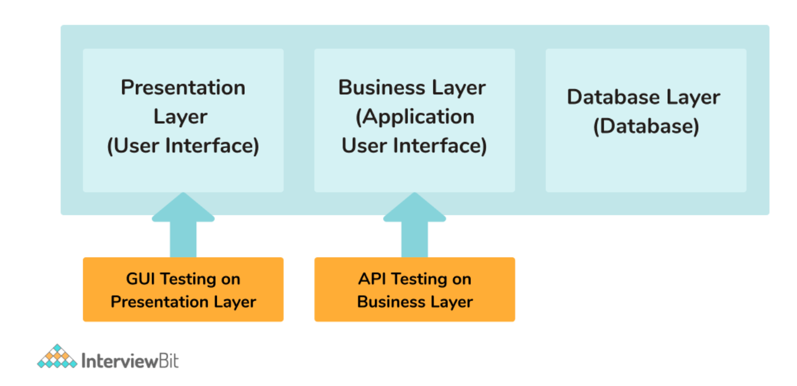
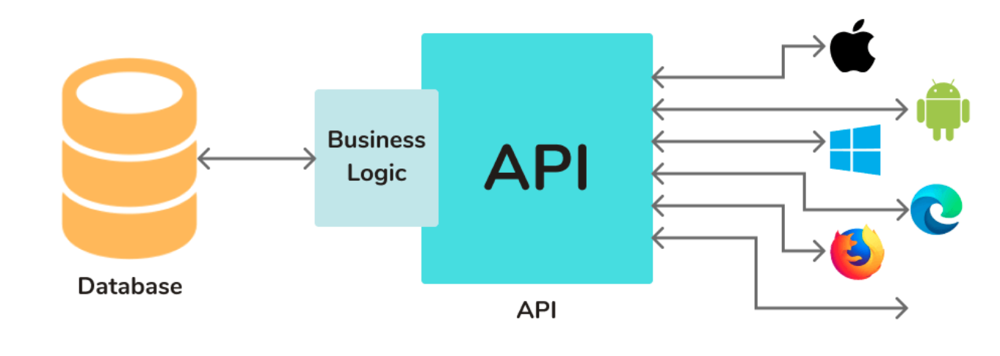
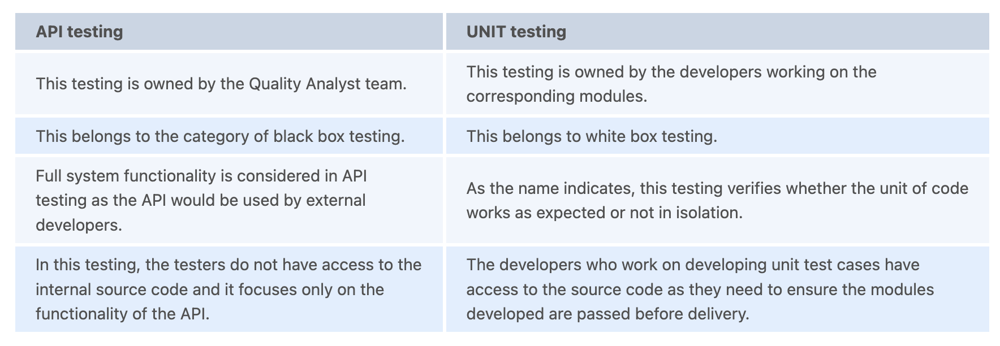
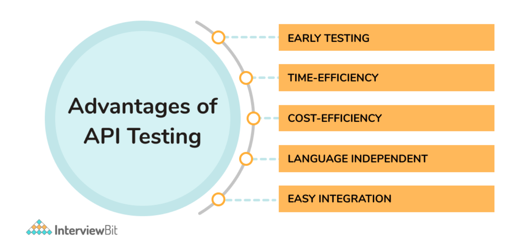
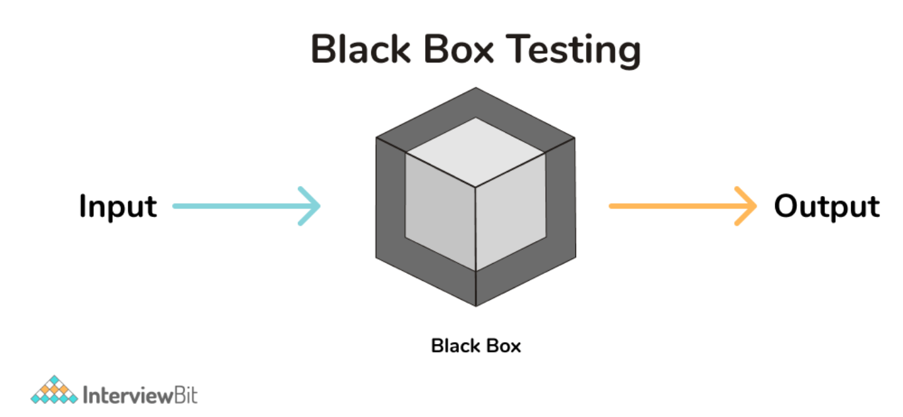

# API Testing Interview Questions

---

## Background
API testing is a category of software testing that helps test systems defined as APIs (Application Programming Interfaces) in terms of functionalities, performance, reliability, security, and various other parameters. This testing helps test the business logic of applications quickly and more effectively and helps identify bugs/defects in the functionality of the application at the business logic layer of the software application architecture as shown below:

---

1. What is API testing?
   + API testing: is a category of software integration testing that deals with the testing of Application Programming Interfaces (APIs) directly. It deals with checking if the APIs developed work as expected in terms of reliability, functionality, security, and performance of the business logic covered by the applications.

2. What is Application Programming Interface (API)?
   + Application Programming Interface (API): useful for communication between different software systems. It facilitates data exchange between systems located in different remote places. They are nothing but a collection of functions that are executable by other functions of the software application.

3. How do APIs work?
   + The general workflow of API is that it takes a request, processes it which might involve data validation, database interaction, data processing, and then the resultant of this is sent back to the source. APIs provide an abstraction to the internal business logic as they are not exposed to the world.
     

4. What are the different types of API testing?
   + Functional Testing
   + Unit Testing
   + Load Testing
   + Security Testing
   + UI Testing
   + Interoperability and WS compliance Testing
   + Penetration Testing (Pen Test)
   + Fuzz Testing.

5. What protocols can be tested using API Testing?
   + HTTP
   + REST
   + SOAP
   + JMS
   + UDDI

6. What are the most commonly used tools for API testing?
   + The most popularly used tool in the market is PostMan. This tool helps to create manual and automated test cases for testing the APIs in a well-designed manner. Apart from this, there are different tools like JMeter, Parasoft SOAtest, SoapUI, Apigee, API fortress, JUnit, etc.

7. What are the differences between API Testing and Unit Testing?
  

8. What are the advantages of API Testing?
   + Core Functionality Testing: This kind of testing provides access to the entire system without the need for a user interface. The functionalities of the application would be evaluated end-to-end without the need for GUI (Graphical User Interface) which helps in detecting issues that can prove to be bigger at the time of GUI testing.
   + Time and Cost Effectiveness: This is usually less time-consuming when compared to GUI testing. It also requires less code for testing the functionalities thereby making it easier to set up and get faster access to test coverage. It also results in effective cost savings for the project.
   + Language-Independent: The data transfer between the test platform to the applications is done utilizing XML or JSON and is completely independent of the languages used in developing the systems. The test automation suite can be developed in any language.
   + Ease of Integration with GUI: API testing provides highly flexible test suites that help in easier integration with the GUI tests. For instance, before the GUI test cases are initiated, employing API test cases, we can create sample users that can act as an initial base for the GUI tests.
   

9.  What is the approach followed in API Testing?
    + Firstly, write required test cases for testing the APIs by making use of different testing techniques like equivalence class, boundary value analysis etc that helps to verify the functionalities.
    + Clearly define the scope and functionality of the APIs.
    + Define the different input parameters that you want to test the API with.
    + Verify the test cases by passing the input parameters.
    + Compare the results of the different test cases based on their expected behavior.
    + Also subject the API to different conditions depending on the description of the functionality.

10. What needs to be verified in API testing?
    + Data accuracy of the actual response with the expected response.
    + HTTP status codes of the resultant API.
    + Response time of the API.
    + Error codes if the APIs are expected to throw an error.
    + Authorization Details
    + Test non-functional specifications of the applications like security, performance, availability etc.

11. What are the best practices that need to be followed for writing test cases?
    + We need to write test cases that correspond with the perspective of end-users.
    + Steps defined in the test cases needs to be simple so that anyone can replicate the steps.
    + Ensure that the test cases are reusable.
    + Define and set the priority of test cases.
    + Provide a valid description, test input parameters, test data, expected outcome after running the test cases so that we can compare the actual outcomes of the test cases with the expected ones.
    + Make sure to develop test cases that cover negative test scenarios too.
    + Naming conventions need to be properly followed while developing test cases.
    + Review them regularly and update them as and when the functionality gets updated.

12. What do you understand by Black Box Testing?
    + Black Box Testing: is one of the methods in software testing where the testers evaluate the software functionality without the knowledge of the internal source code. This ideology can be applied in every branch of testing such as unit testing, integration testing, system testing and acceptance testing.
      

13. Define Test Data.
    + Test data: is the input data used by the testers to execute their test cases. This data can be prepared either manually or by making use of tools. For instance, to test the login functionality of an application, testers would need input data such as username and password which constitutes the test data.

14. Define test coverage.
    + Test coverage: is a measure that signifies the amount of testing performed by making use of our test cases. It can be either functional testing or non-functional testing of the application. This provides a fair idea about what the testers need to cover in their test cases.

15. Does the API tester need to have coding knowledge to perform API testing?
    + API testing covers manual and automated testing. Manual testing does not require a tester to know to code. We just need API request details, headers, payload, credentials and know how to use the tools required to test the system. But in the case of automated testing, a tester needs to know how to code to automate test cases and develop a sophisticated optimised test suite.

16. What is the process of API Specification Review?
    + API Specification Review: is the first and foremost step of documentation of the API testing needs and requirements. It should clearly state the purpose of the API, the application workflow and its features along with all other required details which could possibly help to plan the API testing process smoothly.

17. What is Latency in API testing?
    + Latency: refers to the response time or the delay taken by the request to reach the server. We need to ensure that the latency involved in reaching the server is minimum as higher the latency, greater is the impact in the application’s speed and performance.

18. What do you understand by Throughput in Performance testing?
    + Throughput: refers to the number of transactions per second that an application can handle under the influence of lot of users (load). The API needs to ensure that required throughput is met before it is deployed on production. We can identify this by performing the Load Testing of the APIs. We can do this by identifying multiple transactions of different priorities and check how many requests are successfully passed in acceptable time governed by the SLAs (Service Level Agreements) defined by us.

19. How do you document an API functionality? What are the tools available for achieving the same?
    + API documentation represents any description of the functionality of the API. Since this documentation will be used by external developers, we need to follow some best practices. They are:
      + Plan what needs to be shown in your documentation.
      + Do not exclude any fundamental sections of the API functionality.
      + Use simple words by avoiding technical jargon.
      + Include various interactive examples and resources to understand the API functionality clearly.
      + Consistently maintain the documentation as and when the functionality gets updated.
    + Some of the popular tools used for achieving API documentation are:
      + JavaDoc
      + Doxygen
      + OpenAPI
      + Redoc
      + Swagger UI

20. What is the most important difference between API testing and UI testing?
    + UI testing: represents testing by using Graphical User Interface. The main area of focus in this is to test the look and feel of the software application by focusing on how the application is feasible for the end-users, do the functionalities of all the items shown on the UI screen - images, fonts, buttons, layouts etc are appearing properly as expected.
    + API testing: ensures the testing of communication of data between various software systems. It mostly falls under the validation of back-end functionality.

21. What are the major blockers or challenges faced while performing API testing?
    + Proper Parameter Selection
    + Proper Parameter Combination
    + Knowing which API needs to be called in what sequence
    + Proper knowledge of output verification
    + Knowing what are the proper input values that needs to be provided to the API inputs.

22. What are the principles that need to be followed while performing API Testing?
    + Optimal Testing: Since it is not possible to test anything exhaustively, there needs to be at least some optimal amount of testing depending on the risk assessment performed on the application.
    + Defect Clustering: This represents the clustering of modules containing most defects. As a general rule, almost 80% of the defects are found in 20% of the application modules. These risky modules can be identified by following this approach.
    However this principle has a problem. We might have to perform API testing repeatedly on the application which might be obstructive to finding new bugs.
    + Pesticide Paradox: This paradox states that if the testers use the same test cases repeatedly, then they would not be capable of finding new bugs over a period of time. Hence, the testers need to be fully equipped by reviewing and revising the test cases regularly. New test cases are more effective in finding new bugs. However, no amount of testing can ensure that the product is 100% bug-free.
    + Presence of defects: Another principle of testing is that the aim of testing should be the presence of bugs and not the absence of defects. The goal of testing is to reduce the probability of finding undiscovered bugs. In case 0 defects are found, yet we cannot fully claim that our software is 100% bug-free.
    + Error absence fallacy: There can be an increased possibility of software being unusable even if it is 99% bug-free which can be wrong. The main focus of software testing is to ensure that the software addresses the business requirements correctly. This principle states that even if we identify and fix the defects if the software does not fulfil the business requirements, then the system is unusable.
    + Early Testing: This principle states that it is easier to fix bugs early in the software development lifecycle. Hence, it is recommended to start testing the application as early as possible.
    + Context Dependent Testing: The way we test an application depending on the type of the system. We use different techniques, methodologies and test cases to test the applications depending on the type. For example, the way we test e-commerce applications is different from the way we test online streaming applications.

23. What are the different bugs that can be found in API testing?
    + Duplicate or missing API functionality
    + Failure to handle negative test cases
    + Failure to handle a sudden spike in load or stress
    + Reliability of the application behavior
    + Failure to handle requests securely
    + Unused flags
    + Unimplemented errors
    + Poor Performance
    + Issues in Multi-threading
    + Improper error responses
    + Improper status codes

24. Define Test API.
    + Test API: refers to a set of APIs or library utilities that helps developers to create automated test cases for testing .NET or WIN 32 systems. It has a set of basic data building blocks, data types, data structures etc.

25. What is Payload?
    + Payload: is the most common term used in the case of REST APIs. It refers to the actual data sent to the server in the API request in different formats like JSON, XML etc.

26. What is Run Scope?
    + Run Scope: is an API testing tool that is typically a web application supporting an easier user interface platform to test back-end services.

27. What is the importance of caching mechanism?
    + Caching mechanism: is the practice of storing data temporarily to retrieve data for repeated requests. This increases the performance of the system by obtaining the data from the cached copy instead of hitting the database and getting the original data.

28. Why is automated API testing useful?
    + Automated testing is useful in the long run as it helps to maximize the test coverage of the applications in a shorter period of time meaning it helps to test large test sets very easily and quickly. It enables parallel execution and helps to reduce human-generated errors in testing. It saves the time required to test applications thereby saving the overall cost.

29. What do you understand by Input injection?
    + Input injection: is the act of simulating inputs for testing APIs. It can be simulated in different ways:
      + Direct Method Invocation
      + Accessibility interface invocation
      + Low-level input simulation
      + Device driver simulation
      + Robot Simulation.

30. What do you understand by the test environment for API?
    + `Test Environment`: is an environment that helps test the APIs developed by providing a feature to send requests and get the responses from the server. It is similar to the production environment where the Quality Analyst has enough data to perform their functionality testing. In a test environment, we can have a test database, a localized gateway, a server and a load balancer.

31. Is it possible to hack API while testing?
    + Yes, it is possible. This is because we are sending requests over the internet which mostly follows HTTP protocol. This protocol is text-based and is easier to read. Hence, it is required to perform security testing of the APIs to ensure safer systems.

32. How should we test the API security?
    + Authentication: Whether the identity of the end-user is correct.
    + Authorization: Whether the user is allowed to access the resource.
    + We can also validate whether the TLS or the SSL certificate used over the HTTPS protocol is valid or not.

33. What do you understand by Big Bang Approach in testing?
    + Big Bang Approach: is the approach of combining all modules at once and then performing verification of the functionality after the individual modules are tested. It belongs to the category of integration testing of the applications.

34. How do you perform API Load Testing?
    + Load Testing is a category of Performance Testing that is used for checking an application’s capability to perform under various user loads.
    + This is done for identifying bottlenecks in performance before the application becomes live.
    + It is done by simulating many users hitting the API at the same time or in other words, artificial traffic is simulated to identify if the application is capable of handling the load by maintaining consistency in the response times and not impacting the functionality.
    + One such tool to perform Load Testing is JMeter. It provides flexibility to create a test plan, define the thread groups and record test scripts to simulate artificial load to the API. It finally provides a feature to visualize the result of load testing done. For more information about using JMeter, you can refer here.
