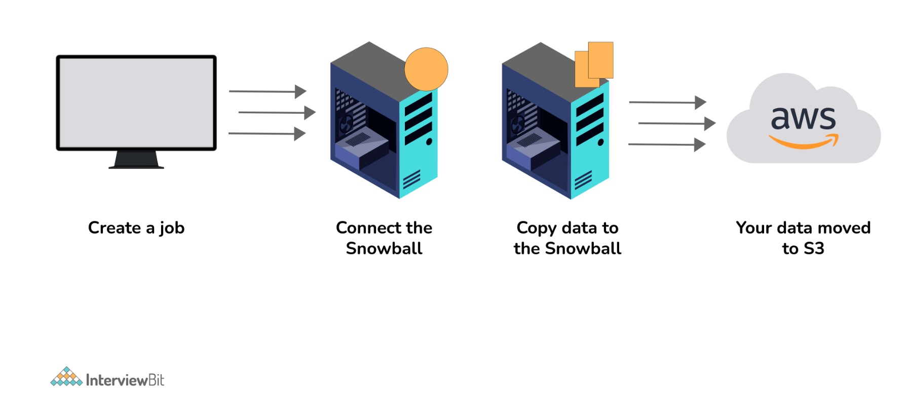
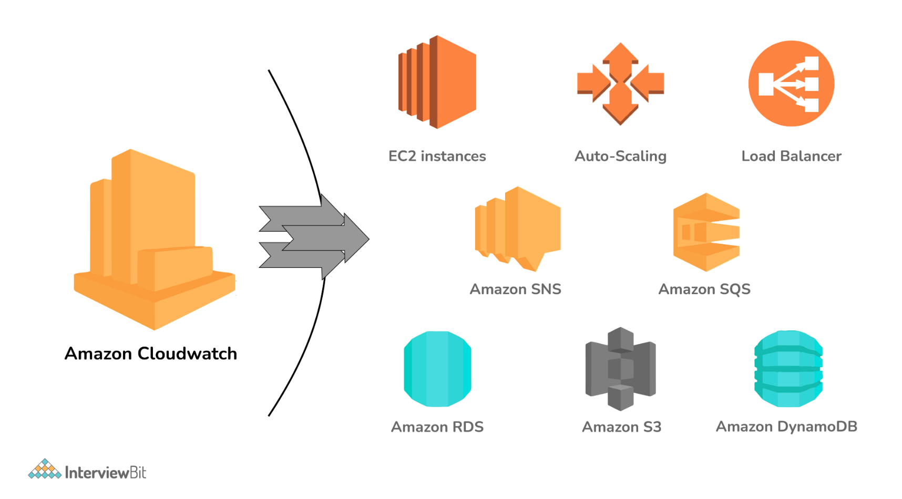
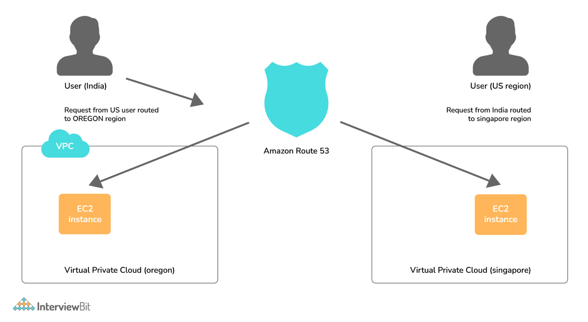

# Amazon Web Services (AWS) Interview Questions

---

1. What is EC2?
   + EC2, a Virtual Machine in the cloud on which you have OS-level control. You can run this cloud server whenever you want and can be used when you need to deploy your own servers in the cloud, similar to your on-premises servers, and when you want to have full control over the choice of hardware and the updates on the machine.

2. What is SnowBall?
   + SnowBall is a small application that enables you to transfer terabytes of data inside and outside of the AWS environment.
   

3. What is CloudWatch?
   + CloudWatch helps you to monitor AWS environments like EC2, RDS Instances, and CPU utilization. It also triggers alarms depending on various metrics.
   

4. What is Elastic Transcoder?
   + Elastic Transcoder is an AWS Service Tool that helps you in changing a video’s format and resolution to support various devices like tablets, smartphones, and laptops of different resolutions.

5. What do you understand by VPC?
   + VPC stands for Virtual Private Cloud. It allows you to customize your networking configuration. VPC is a network that is logically isolated from other networks in the cloud. It allows you to have your private IP Address range, internet gateways, subnets, and security groups.

6. DNS and Load Balancer Services come under which type of Cloud Service?
   + DNS and Load Balancer are a part of IaaS-Storage Cloud Service.

7. What are the Storage Classes available in Amazon S3?
   + Storage Classes available with Amazon S3 are:
     + Amazon S3 Standard
     + Amazon S3 Standard-Infrequent Access
     + Amazon S3 Reduced Redundancy Storage
     + Amazon Glacier

8. Explain what T2 instances are?
   + T2 Instances are designed to provide moderate baseline performance and the capability to burst to higher performance as required by the workload.

9.  What are Key-Pairs in AWS?
    + Key-Pairs are secure login information for your Virtual Machines. To connect to the instances, you can use Key-Pairs which contain a Public Key and a Private Key.

10. How many Subnets can you have per VPC?
    + You can have 200 Subnets per VPC.

11. List different types of Cloud Services.
    + Different types of Cloud Services are:
      + Software as a Service (SaaS)
      + Data as a Service (DaaS)
      + Platform as a Service (PaaS)
      + Infrastructure as a Service (IaaS)

12. Explain what S3 is?
    + S3 stands for Simple Storage Service. You can use the S3 interface to store and retrieve any amount of data, at any time and from anywhere on the web. For S3, the payment model is “pay as you go”.

13. How does Amazon Route 53 provide high availability and low latency?
    + Amazon Route 53 uses the following to provide high availability and low latency:
      + `Globally Distributed Servers` - Amazon is a global service and consequently has DNS Servers globally. Any customer creating a query from any part of the world gets to reach a DNS Server local to them that provides low latency.
      + `Dependency` - Route 53 provides a high level of dependability required by critical applications.
      + `Optimal Locations` - Route 53 serves the requests from the nearest data center to the client sending the request. AWS has data-centers across the world. The data can be cached on different data-centers located in different regions of the world depending on the requirements and the configuration chosen. Route 53 enables any server in any data-center which has the required data to respond. This way, it enables the nearest server to serve the client request, thus reducing the time taken to serve.
      
        + As can be seen in the above image, the requests coming from a user in India are served from the Singapore Server, while the requests coming from a user in the US are routed to Oregon region.

14. How can you send a request to Amazon S3?
    + Amazon S3 is a REST Service, and you can send a request by using the REST API or the AWS SDK wrapper libraries that wrap the underlying Amazon S3 REST API.

15. What does AMI include?
    + A template for the root volume for the instance.
    + Launch permissions to decide which AWS accounts can avail the AMI to launch instances.
    + A block device mapping that determines the volumes to attach to the instance when it is launched.

16. What are the different types of Instances?
    + Compute Optimized
    + Memory-Optimized
    + Storage Optimized
    + Accelerated Computing
    + General Purpose

17. What is the relation between the Availability Zone and Region?
    + An AWS Availability Zone is a physical location where an Amazon data center is located. On the other hand, an AWS Region is a collection or group of Availability Zones or Data Centers.
    + This setup helps your services to be more available as you can place your VMs in different data centers within an AWS Region. If one of the data centers fails in a Region, the client requests still get served from the other data centers located in the same Region. This arrangement, thus, helps your service to be available even if a Data Center goes down.

18. How do you monitor Amazon VPC?
    + CloudWatch
    + VPC Flow Logs

19. What are the different types of EC2 instances based on their costs?
    + The three types of EC2 instances based on the costs are:
      + `On-Demand Instance`: These instances are prepared as and when needed. Whenever you feel the need for a new EC2 instance, you can go ahead and create an on-demand instance. It is cheap for the short-time but not when taken for the long term.
      + `Spot Instance`: These types of instances can be bought through the bidding model. These are comparatively cheaper than On-Demand Instances.
      + `Reserved Instance`: On AWS, you can create instances that you can reserve for a year or so. These types of instances are especially useful when you know in advance that you will be needing an instance for the long term. In such cases, you can create a reserved instance and save heavily on costs.

20. What do you understand by stopping and terminating an EC2 Instance?
    + Stopping an EC2 instance means to shut it down as you would normally do on your Personal Computer. This will not delete any volumes attached to the instance and the instance can be started again when needed.
    + On the other hand, terminating an instance is equivalent to deleting an instance. All the volumes attached to the instance get deleted and it is not possible to restart the instance if needed at a later point in time.

21. What are the consistency models for modern DBs offered by AWS?
    + `Eventual Consistency`: It means that the data will be consistent eventually, but may not be immediate. This will serve the client requests faster, but chances are that some of the initial read requests may read the stale data. This type of consistency is preferred in systems where data need not be real-time. For example, if you don’t see the recent tweets on Twitter or recent posts on Facebook for a couple of seconds, it is acceptable.
    + `Strong Consistency`: It provides an immediate consistency where the data will be consistent across all the DB Servers immediately. Accordingly. This model may take some time to make the data consistent and subsequently start serving the requests again. However, in this model, it is guaranteed that all the responses will always have consistent data.

22. What is Geo-Targeting in CloudFront?
    + Geo-Targeting enables the creation of customized content based on the geographic location of the user. This allows you to serve the content which is more relevant to a user. For example, using Geo-Targeting, you can show the news related to local body elections to a user sitting in India, which you may not want to show to a user sitting in the US. Similarly, the news related to Baseball Tournament can be more relevant to a user sitting in the US, and not so relevant for a user sitting in India.

23. What are the advantages of AWS IAM?
    + AWS IAM enables an administrator to provide granular level access to different users and groups. Different users and user groups may need different levels of access to different resources created. With IAM, you can create roles with specific access-levels and assign the roles to the users.
    + It also allows you to provide access to the resources to users and applications without creating the IAM Roles, which is known as Federated Access.

24. What do you understand by a Security Group?
    + When you create an instance in AWS, you may or may not want that instance to be accessible from the public network. Moreover, you may want that instance to be accessible from some networks and not from others.
    + Security Groups are a type of rule-based Virtual Firewall using which you can control access to your instances. You can create rules defining the Port Numbers, Networks, or protocols from which you want to allow access or deny access.

25. What are Spot Instances and On-Demand Instances?
    + When AWS creates EC2 instances, there are some blocks of computing capacity and processing power left unused. AWS releases these blocks as Spot Instances. Spot Instances run whenever capacity is available. These are a good option if you are flexible about when your applications can run and if your applications can be interrupted.
    + On the other hand, On-Demand Instances can be created as and when needed. The prices of such instances are static. Such instances will always be available unless you explicitly terminate them.

26. Explain Connection Draining.
    + Connection Draining is a feature provided by AWS which enables your servers which are either going to be updated or removed, to serve the current requests.
    + If Connection Draining is enabled, the Load Balancer will allow an outgoing instance to complete the current requests for a specific period but will not send any new request to it. Without Connection Draining, an outgoing instance will immediately go off and the requests pending on that instance will error out.

27. What is a Stateful and a Stateless Firewall?
    + A Stateful Firewall is the one that maintains the state of the rules defined. It requires you to define only inbound rules. Based on the inbound rules defined, it automatically allows the outbound traffic to flow.
    + On the other hand, a Stateless Firewall requires you to explicitly define rules for inbound as well as outbound traffic.
    + For example, if you allow inbound traffic from Port 80, a Stateful Firewall will allow outbound traffic to Port 80, but a Stateless Firewall will not do so.

28. What is a Power User Access in AWS?
    + An Administrator User will be similar to the owner of the AWS Resources. He can create, delete, modify or view the resources and also grant permissions to other users for the AWS Resources.
    + A Power User Access provides Administrator Access without the capability to manage the users and permissions. In other words, a user with Power User Access can create, delete, modify or see the resources, but he cannot grant permissions to other users.

29. What is an Instance Store Volume and an EBS Volume?
    + An Instance Store Volume is temporary storage that is used to store the temporary data required by an instance to function. The data is available as long as the instance is running. As soon as the instance is turned off, the Instance Store Volume gets removed and the data gets deleted.
    + On the other hand, an EBS Volume represents a persistent storage disk. The data stored in an EBS Volume will be available even after the instance is turned off.

30. What are Recovery Time Objective and Recovery Point Objective in AWS?
    + `Recovery Time Objective`: It is the maximum acceptable delay between the interruption of service and restoration of service. This translates to an acceptable time window when the service can be unavailable.
    + `Recover Point Objective`: It is the maximum acceptable amount of time since the last data restore point. It translates to the acceptable amount of data loss which lies between the last recovery point and the interruption of service.

31. Is there a way to upload a file that is greater than 100 Megabytes in Amazon S3?
    + Yes, it is possible by using the Multipart Upload Utility from AWS. With the Multipart Upload Utility, larger files can be uploaded in multiple parts that are uploaded independently. You can also decrease upload time by uploading these parts in parallel. After the upload is done, the parts are merged into a single object or file to create the original file from which the parts were created.

32. Can you change the Private IP Address of an EC2 instance while it is running or in a stopped state?
    + No, a Private IP Address of an EC2 instance cannot be changed. When an EC2 instance is launched, a private IP Address is assigned to that instance at the boot time. This private IP Address is attached to the instance for its entire lifetime and can never be changed.

33. What is the use of lifecycle hooks is Autoscaling?
    + Lifecycle hooks are used for Auto-scaling to put an additional wait time to a scale-in or a scale-out event.

34. What are the policies that you can set for your user’s passwords?
    + Following are the policies that can be set for user’s passwords:
      + You can set a minimum length of the password.
      + You can ask the users to add at least one number or special character to the password.
      + Assigning the requirements of particular character types, including uppercase letters, lowercase letters, numbers, and non-alphanumeric characters.
      + You can enforce automatic password expiration, prevent the reuse of old passwords, and request for a password reset upon their next AWS sign-in.
      + You can have the AWS users contact an account administrator when the user has allowed the password to expire.

35. What is "AWS Lambda"?
35. Is there a programming language that AWS Lambda is not compatible with?
35. What are the procedures for entering EC2?
35. What are the constraints that AWS lambda function imposes?
35. Which capabilities of AWS lambda contribute to the automation of the deployment process?
35. What is the maximum execution time allowed for an AWS Lambda function to be customised?
35. What are the available frameworks for the serverless approach?
35. For instance, how can Amazon Elastic Compute Cloud (AWS Lambda) guarantee the safety of my programmes?
35. How long may a lambda function in AWS be allowed to run before it is considered a DDOS attack?
35. What is meant by the term "auto-scaling"?
35. What are your thoughts on the concept of payments that have no downtime?
35. Is there access available to the servers that AWS lambda uses by the general public?
35. Kindly clarify what the EC2 services are?
35. What do you think about the idea of using packages with AWS lambda?
35. What is "AMI" in AWS Lambda?
35. What are the limits of the availability of lambda functions on Amazon Web Services?
35. What are the various storage choices that are available through Amazon?
35. Is there a maximum limit that has been predetermined and that needs to be adhered to in any way?
35. What exactly is meant by the term "elastic blocker" when referring to AWS lambda?
35. How can we automate apps that do not require a server?
35. How do I build my first serverless app?
35. What is SQS and what does it perform in relation to AWS lambda?
35. What actions should I take to fix my app that does not require a server?
35.  If adjustments are made to the code or configuration, will the AWS lambda-based function still be accessible after these changes have been made?
35. Is there a limit to the number of AWS lambda functions that can run in parallel at the same time?
35. What will happen if the total amount of my execution goes beyond the normal limit?
35. What is a Serverless Application?
35. How might we benefit if we did away with the requirement of having a server?
35. What exactly are the drawbacks of deciding to follow the road of serverless computing?
35. What is the main difference between an anonymous class and a lambda function?
35. What exactly does it mean to have anything "automated" when it comes to deployment?
35. How does AWS lambda facilitate deployment automation?
35. What are the procedures for entering EC2?
35. Explain the many different serverless frameworks that are available.
35. Why exactly should someone take into consideration implementing a serverless strategy?
35. If a microservice or a small service fails, is it possible to debug and repair it?
35. Is there any other potential downside to using the serverless method? Do you have any ideas or suggestions?
35. Is there a particular explanation for why utilizing Lambda results in greater levels of efficiency?
35. How long may a Lambda function be allowed to run before it is considered a successful distributed denial of service attack?
35. Tell me more about the zero-downtime deployment.
35. How could you possibly manage exceedingly intricate querying capabilities if you did not have a warehouse? Which database would you check first given the circumstances of the situation?
35. What advantages does AWS Lambda have over its rival technologies, such as Google Cloud Functions and Microsoft Azure Functions?
35. Serverless computing is something you might be able to explain if you're familiar with Amazon Web Services.
36. What kinds of storage options does Amazon provide its customers with?
37. In your perspective, is there a link between Instance and AMI?
37. What are the best practices for maximizing Lambda's security?
37. In the context of Lambda, what precisely does it mean to speak of elastic blockage storage?
37. What is one simple way that the efficiency of your AWS Lambda deployment might be improved?
37. What is your level of expertise in the craft of AMI construction?
37. Is it possible to scale Lambda vertically?
37. What are your thoughts on Configuration Management?
37. What is SQS in Lambda. In what way does it function?
37. How well versed are you in Lambda Expression?
37. Where can I find more information about the Final Variables and Effectively Final Variables of Lambda?
37. Where exactly is the functionality that Lambda was designed for?
37. What is "Serverless App"?
37. In what ways are anonymous classes and Lambda functions distinct from one another?
37. Is code allowed to be paused in Lambda Expression without a label?
38. In what ways does the coding that governs AWS Lambda functions impose limitations?
38. What kinds of computer programmes can be run on Amazon Web Services' Lambda?
38. How exactly does one go about automating a serverless app's processes?
38. What happens when the maximum number of executions that can take place on an account has been reached?
38. An application that does not need a server in order to execute is referred to as serverless.
38. What exactly is the Lambda architecture of AWS?
38. What are some of the ways in which a serverless architecture might be useful?
38. How do I begin using a serverless application?
38. What are the factors that decide how AWS Lambda is charged?

