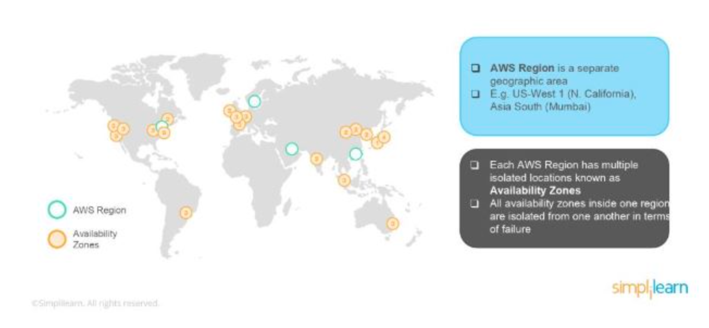

# Amazon Web Services (AWS) Interview Questions

---

1. What is EC2?
   + `EC2`: a Virtual Machine in the cloud on which you have OS-level control. You can run this cloud server whenever you want and can be used when you need to deploy your own servers in the cloud, similar to your on-premises servers, and when you want to have full control over the choice of hardware and the updates on the machine.

2. What is SnowBall?
   + `SnowBall`: a small application that enables you to transfer terabytes of data inside and outside of the AWS environment.
   

3. What is CloudWatch?
   + `CloudWatch`: helps you to monitor AWS environments like EC2, RDS Instances, and CPU utilization. It also triggers alarms depending on various metrics.
   

4. What is Elastic Transcoder?
   + `Elastic Transcoder`: an AWS Service Tool that helps you in changing a video’s format and resolution to support various devices like tablets, smartphones, and laptops of different resolutions.

5. What do you understand by Virtual Private Cloud (VPC)?
   + `Virtual Private Cloud (VPC)`: allows you to customize your networking configuration. VPC is a network that is logically isolated from other networks in the cloud. It allows you to have your private IP Address range, internet gateways, subnets, and security groups.

6. DNS and Load Balancer Services come under which type of Cloud Service?
   + DNS and Load Balancer are a part of IaaS-Storage Cloud Service.

7. What are the Storage Classes available in Amazon S3?
   + Amazon S3 Standard
   + Amazon S3 Standard-Infrequent Access
   + Amazon S3 Reduced Redundancy Storage
   + Amazon Glacier

8. Explain what T2 instances are?
   + `T2 Instances`: designed to provide moderate baseline performance and the capability to burst to higher performance as required by the workload.

9.  What are Key-Pairs in AWS?
    + `Key-Pairs`: secure login information for your Virtual Machines. To connect to the instances, you can use Key-Pairs which contain a Public Key and a Private Key.

10. How many Subnets can you have per VPC?
    + You can have 200 Subnets per VPC.

11. List different types of Cloud Services.
      + Software as a Service (SaaS)
      + Data as a Service (DaaS)
      + Platform as a Service (PaaS)
      + Infrastructure as a Service (IaaS)

12. Explain what Simple Storage Service (S3) is?
    + `Simple Storage Service (S3)`: used to store and retrieve any amount of data, at any time and from anywhere on the web. For S3, the payment model is “pay as you go”.

13. How does Amazon Route 53 provide high availability and low latency?
    + Amazon Route 53 uses the following to provide high availability and low latency:
      + `Globally Distributed Servers`: Amazon is a global service and consequently has DNS Servers globally. Any customer creating a query from any part of the world gets to reach a DNS Server local to them that provides low latency.
      + `Dependency`: provides a high level of dependability required by critical applications.
      + `Optimal Locations`: serves the requests from the nearest data center to the client sending the request. AWS has data-centers across the world. The data can be cached on different data-centers located in different regions of the world depending on the requirements and the configuration chosen. Route 53 enables any server in any data-center which has the required data to respond. This way, it enables the nearest server to serve the client request, thus reducing the time taken to serve.
      
        + As can be seen in the above image, the requests coming from a user in India are served from the Singapore Server, while the requests coming from a user in the US are routed to Oregon region.

14. How can you send a request to Amazon S3?
    + Amazon S3 is a REST Service, and you can send a request by using the REST API or the AWS SDK wrapper libraries that wrap the underlying Amazon S3 REST API.

15. What does Amazon Machine Image (AMI) include?
    + A template for the root volume for the instance.
    + Launch permissions to decide which AWS accounts can avail the AMI to launch instances.
    + A block device mapping that determines the volumes to attach to the instance when it is launched.

16. What are the different types of Instances?
    + Compute Optimized
    + Memory-Optimized
    + Storage Optimized
    + Accelerated Computing
    + General Purpose

17. What is the relation between the Availability Zone and Region?
    + `AWS Availability Zone`: a physical location where an Amazon data center is located.
    + `AWS Region`: a collection or group of Availability Zones or Data Centers.
    + This setup helps your services to be more available as you can place your VMs in different data centers within an AWS Region. If one of the data centers fails in a Region, the client requests still get served from the other data centers located in the same Region. This arrangement, thus, helps your service to be available even if a Data Center goes down.

18. How do you monitor Amazon VPC?
    + CloudWatch
    + VPC Flow Logs

19. What are the different types of EC2 instances based on their costs?
      + `On-Demand Instance`: prepared as and when needed. Whenever you feel the need for a new EC2 instance, you can go ahead and create an on-demand instance. It is cheap for the short-time but not when taken for the long term.
      + `Spot Instance`: can be bought through the bidding model. These are comparatively cheaper than On-Demand Instances.
      + `Reserved Instance`: On AWS, you can create instances that you can reserve for a year or so. These types of instances are especially useful when you know in advance that you will be needing an instance for the long term. In such cases, you can create a reserved instance and save heavily on costs.

20. What do you understand by stopping and terminating an EC2 Instance?
    + `Stopping`: an EC2 instance means to shut it down as you would normally do on your Personal Computer. This will not delete any volumes attached to the instance and the instance can be started again when needed.
    + `Terminating`: equivalent to deleting an instance. All the volumes attached to the instance get deleted and it is not possible to restart the instance if needed at a later point in time.

21. What are the consistency models for modern DBs offered by AWS?
    + `Eventual Consistency`: the data will be consistent eventually, but may not be immediate. This will serve the client requests faster, but chances are that some of the initial read requests may read the stale data. This type of consistency is preferred in systems where data need not be real-time. For example, if you don’t see the recent tweets on Twitter or recent posts on Facebook for a couple of seconds, it is acceptable.
    + `Strong Consistency`: provides an immediate consistency where the data will be consistent across all the DB Servers immediately. Accordingly. This model may take some time to make the data consistent and subsequently start serving the requests again. However, in this model, it is guaranteed that all the responses will always have consistent data.

22. What is Geo-Targeting in CloudFront?
    + `Geo-Targeting`: enables the creation of customized content based on the geographic location of the user. This allows you to serve the content which is more relevant to a user. For example, using Geo-Targeting, you can show the news related to local body elections to a user sitting in India, which you may not want to show to a user sitting in the US. Similarly, the news related to Baseball Tournament can be more relevant to a user sitting in the US, and not so relevant for a user sitting in India.

23. What are the advantages of AWS IAM?
    + AWS IAM enables an administrator to provide granular level access to different users and groups. Different users and user groups may need different levels of access to different resources created. With IAM, you can create roles with specific access-levels and assign the roles to the users.
    + It also allows you to provide access to the resources to users and applications without creating the IAM Roles, which is known as Federated Access.

24. What do you understand by a Security Group?
    + When you create an instance in AWS, you may or may not want that instance to be accessible from the public network. Moreover, you may want that instance to be accessible from some networks and not from others.
    + `Security Groups`: a type of rule-based Virtual Firewall using which you can control access to your instances. You can create rules defining the Port Numbers, Networks, or protocols from which you want to allow access or deny access.

25. What are Spot Instances and On-Demand Instances?
    + `Spot Instances`: When AWS creates EC2 instances, there are some blocks of computing capacity and processing power left unused. AWS releases these blocks as Spot Instances. Spot Instances run whenever capacity is available. These are a good option if you are flexible about when your applications can run and if your applications can be interrupted.
    + `On-Demand Instances`: can be created as and when needed. The prices of such instances are static. Such instances will always be available unless you explicitly terminate them.

26. Explain Connection Draining.
    + `Connection Draining`: a feature provided by AWS which enables your servers which are either going to be updated or removed, to serve the current requests.
      + If Connection Draining is enabled, the Load Balancer will allow an outgoing instance to complete the current requests for a specific period but will not send any new request to it. Without Connection Draining, an outgoing instance will immediately go off and the requests pending on that instance will error out.

27. What is a Stateful and a Stateless Firewall?
    + `Stateful Firewall`: maintains the state of the rules defined. It requires you to define only inbound rules. Based on the inbound rules defined, it automatically allows the outbound traffic to flow.
    + `Stateless Firewall`: requires you to explicitly define rules for inbound as well as outbound traffic.
    + For example, if you allow inbound traffic from Port 80, a Stateful Firewall will allow outbound traffic to Port 80, but a Stateless Firewall will not do so.

28. What is a Power User Access in AWS?
    + An Administrator User will be similar to the owner of the AWS Resources. He can create, delete, modify or view the resources and also grant permissions to other users for the AWS Resources.
    + `Power User Access`: provides Administrator Access without the capability to manage the users and permissions. In other words, a user with Power User Access can create, delete, modify or see the resources, but he cannot grant permissions to other users.

29. What is an Instance Store Volume and an EBS Volume?
    + `Instance Store Volume`: temporary storage that is used to store the temporary data required by an instance to function. The data is available as long as the instance is running. As soon as the instance is turned off, the Instance Store Volume gets removed and the data gets deleted.
    + `EBS Volume`: represents a persistent storage disk. The data stored in an EBS Volume will be available even after the instance is turned off.

30. What are Recovery Time Objective and Recovery Point Objective in AWS?
    + `Recovery Time Objective`: maximum acceptable delay between the interruption of service and restoration of service. This translates to an acceptable time window when the service can be unavailable.
    + `Recover Point Objective`: maximum acceptable amount of time since the last data restore point. It translates to the acceptable amount of data loss which lies between the last recovery point and the interruption of service.

31. Is there a way to upload a file that is greater than 100 Megabytes in Amazon S3?
    + Yes, it is possible by using the Multipart Upload Utility from AWS. With the Multipart Upload Utility, larger files can be uploaded in multiple parts that are uploaded independently. You can also decrease upload time by uploading these parts in parallel. After the upload is done, the parts are merged into a single object or file to create the original file from which the parts were created.

32. Can you change the Private IP Address of an EC2 instance while it is running or in a stopped state?
    + No, a Private IP Address of an EC2 instance cannot be changed. When an EC2 instance is launched, a private IP Address is assigned to that instance at the boot time. This private IP Address is attached to the instance for its entire lifetime and can never be changed.

33. What is the use of lifecycle hooks in Autoscaling?
    + Lifecycle hooks are used for Auto-scaling to put an additional wait time to a scale-in or a scale-out event.

34. What are the policies that you can set for your user’s passwords?
      + You can set a minimum length of the password.
      + You can ask the users to add at least one number or special character to the password.
      + Assigning the requirements of particular character types, including uppercase letters, lowercase letters, numbers, and non-alphanumeric characters.
      + You can enforce automatic password expiration, prevent the reuse of old passwords, and request for a password reset upon their next AWS sign-in.
      + You can have the AWS users contact an account administrator when the user has allowed the password to expire.

35. What is "AWS Lambda"?
    + `AWS Lambda`: a software service platform offered by Amazon Web Services, is an example of this type of platform. Lambda enables serverless computing in specific scenarios. Events generated by AWS can be used to initiate the execution of code in any application.
    + You have access to a wide range of AWS services, including the Amazon Simple Storage Service (S3) for storing files, the Amazon DynamoDB for updating tables, the Amazon API Gateway for gaining access, and many more. AWS Lambda frees developers from the burden of configuring and managing software servers, allowing them to focus on writing and running their programmes.

36. Is there a programming language that AWS Lambda is not compatible with?
    + AWS Lambda allows for the use of the following programming languages: C#, .NET, Node.js, Javascript, Java (version 8), and Go. These programming languages already have their libraries and other built-in features set up and ready to go.

37. What are the procedures for entering EC2?
    + Users are able to connect to EC2 with either a command-line interface or a web-based interface. A further benefit of using AWS lambda is that it equips Windows power shells with the necessary tools.

38. What are the constraints that AWS lambda function imposes?
    + AWS Lambda imposes only a few light constraints on the kinds of things that may be done with an operating system and the kinds of programming languages that can be used with it. You cannot simply cease doing things like creating instances, tracking phone calls, or blocking incoming network connections.
    + These activities are not possible. While you're doing it, you should disable things like the system debugger and any TCP ports (More than 25 traffic available to measure the anti-spam). When it comes to establishing connections with the wider world, IP/TCP sockets are an extremely handy tool.

39. Which capabilities of AWS lambda contribute to the automation of the deployment process?
    + A diverse range of environments is available for use with AWS Lambda. You can use these configurations to retrieve the appropriate data and user credentials in the event that you need to make modifications to your deployment packages, but do not have access to the original packages.
    + Aliases are something that can be used with AWS Lambda, which is a serverless technique. This is something that is already common information. It is not difficult to take into account the many AWS Lambda variants throughout the pre-production phase and the development of an application.
    + As a consequence of this, the Lambda function can be considered for testing without seriously affecting the user code when it is being run in production. It is not important how you do the work as long as you follow the plan and do it in the correct sequence.

40. What is the maximum execution time allowed for an AWS Lambda function to be customised?
    + The entirety of the execution will be finished within three hundred seconds of the first user call being made to AWS lambda. The length of timeouts can be customized anywhere from 1 and 300 seconds, with 3 seconds serving as the default value.

41. What are the available frameworks for the serverless approach?
    + There are currently a number of powerful serverless frameworks available. They provide outstanding customer service, an open-source whisk, and capabilities for Microsoft Azure, all of which contribute to their product's high level of user-friendliness.
    + During the process of constructing a cloud infrastructure, the concept of serverless application software is only taken into consideration. The AWS Lambda Application Programming Interface (API) makes scripting a snap, which in turn makes complicated processes more manageable and reliable.

42. For instance, how can Amazon Elastic Compute Cloud (AWS Lambda) guarantee the safety of my programmes?
    + The user codes for AWS Lambda can be saved in Amazon S3, and after that, they can be encrypted by following the necessary steps. During the processing, additional tests on the data's integrity are performed by using AWS Lambda.

43. How long may a lambda function in AWS be allowed to run before it is considered a DDOS attack?
    + DDOS attacks are possible with AWS lambda, but you only have five minutes to complete the process.

44. What is meant by the term "auto-scaling"?
    + `Auto-scaling`: a function of the Amazon web service that enables users to start new instances of a service and carry out any necessary configuration chores without having to manually interfere.
      
    + This function enables users to save time and effort. You are free to relax and see how the installation is carried out while keeping a close check on the threshold and key performance indicators as they appear in real-time. In other circumstances, all that is required of you is to cross the threshold in order to instantly begin the work and any instances related to it. This entails no additional horizontal disruption.

45. What are your thoughts on the concept of payments that have no downtime?
    + For deployment purposes, Lambda on AWS often makes use of instance functions. In addition, if the programmes are exceptionally difficult to understand, the AWS lambda framework can be segmented into more manageable parts. In reality, the application is inaccessible online while it is doing a process because that takes some amount of time. The finished thing turned out quite well.

46. Is there access available to the servers that AWS lambda uses by the general public?
    + The answer is not positive, to put it succinctly. With the release of AWS Lambda, it is now possible to use the cloud computing infrastructure to carry out activities without requiring any input from the user. In addition to this, there is no way to access the Lambda infrastructure. Because of the way that this arrangement is configured, Lambda is able to perform preventative maintenance, check its health, and update its security measures.

47. Kindly clarify what the EC2 services are?
    + AWS Lambda requires scalable computational capabilities so that it can process user data in the cloud. Managing EC2 is just as easy as managing any other online service, and all of the same measures for network security should be taken. Using this strategy, configuring capacity and working with EC2 with as little effort as feasible is achievable.

48. What do you think about the idea of using packages with AWS lambda?
    + In AWS Lambda, it is very natural for user-created packages as well as NPM packages to be utilized efficiently.

49. What is Amazon Machine Image (AMI) in AWS Lambda?
    + `Amazon Machine Image (AMI)` is referred to by its acronym, AMI, and is utilized rather commonly in Lambda-based processing. In its most basic form, it is a starting point that has commonly used software such as an operating system, an application server, and potentially some extra programs already installed on it.
    + The duplicate in the cloud can be created because it already has several copies and can handle running multiple instances at the same time. In addition, the Amazon Machine image can be used to run a virtual server that is hosted in the cloud.

50. What are the limits of the availability of lambda functions on Amazon Web Services?
    + The lambda application hosted on Amazon Web Services makes use of redundancy and replication to ensure that your lambda and Amazon services continue to run without interruption. In addition, the management of Amazon Lambda's downtime and maintenance windows is incorporated into this offering.

51. What are the various storage choices that are available through Amazon?
    + Amazon Lambda is designed to work with a broad range of storage alternatives, but the most important thing to keep in mind is that every one of these choices offers the highest possible level of dependability and productivity. There is no logical impediment to employing both of them in tandem. Access can also be gained without the use of a guide or assistant.
    + I'll only list a few, but one of them is Elastic Block Storage (EBS), which is a method for storing data that utilizes block-level storage. If separate storage is required, this product, which comes with built-in encryption features, is one option that could be considered. The subsequent type is known as an EC2 instance, and it operates very similarly to a storage disc that is directly connected to the host computer.
    + This form of storage is designed for use over a relatively short period of time, as the name suggests. After some time has gone by, the user has the opportunity to consider whether or not the financial investment in good storage is worthwhile. The user data will continue to be valid so long as the instances themselves continue to be valid. The next option is for adding storage, which is effectively the user's root storage and can be utilized for running instances.
    + This will almost always include data pertaining to the boot instance. Following that, Amazon Simple Storage Service (S3) -> is another type of AWS lambda storage that enables users to store an unlimited quantity of data at an affordable cost.

52. Is there a maximum limit that has been predetermined and that needs to be adhered to in any way?
    + The account level is the only place where the default limit for AWS lambda is enforced. At the functional level, there is no limit that is predetermined.

53. What exactly is meant by the term "elastic blocker" when referring to AWS lambda?
    + Users can make use of the elastic storage, which is effectively a digital file cabinet, in order to get started with the networking-related responsibilities that need to be completed. The user does not need to be concerned about the possibility of data loss due to a damaged disc as long as the RAID array is in good health.
    + The storage in question also supports the process of allocating and provisioning memory space. On occasion, a connection can be made between this and the application programming interface that exists on a node that serves a specific purpose.

54. How can we automate apps that do not require a server?
    + Following the completion of the serverless application development with AWS Lambda, the automated procedure is then released, and the application is then deployed. Because of this, the serverless application can be deployed with the help of the AWS code pipeline, a continuous form of service delivery that enables the required modeling, data visualization, and automation of activities.
    + Automated code deployment for lambda-based applications is also on the roadmap for AWS code deployment. This enables the user to coordinate deployments in accordance with best practice application methodologies, such as a canary deployment and a linear deployment, which helps verify that the newly created deployment programme is safe, reliable, and fit for use at an industrial level.

55. How do I build my first serverless app?
    + In order to get started with serverless applications, you will need to access the AWS Lambda dashboard and save the blueprint. This file's original version will be downloaded, and it should include both an AWS Sam file (which the programme refers to as an AWS resource) and a ZIP file (which mostly included the function code). With the assistance of the AWS Cloud Formation commands, you will be able to successfully complete tasks such as documenting your serverless apps and deploying them.

56. What is Simple Queue Service (SQS) and what does it perform in relation to AWS lambda?
    + Simple Queue Service (SQS): A way of sharing data between various hosts on a local network and network endpoints is what the Simple Queue Service (SQS) in AWS lambda is all about. SQS makes it possible for applications to communicate with one another and provides users with access to lambda's many different functions.
    + It makes no difference which functional components you make use of because they are all connected to one another. As a consequence of this, a failure mechanism is no longer required, and the ability of individual elements to communicate with one another has been significantly improved.

57. What actions should I take to fix my app that does not require a server?
    + AWS x-ray can be used to activate an AWS lambda function for tracking by first providing x-ray access to lambda functional roles for execution and then setting the function's "mode of code tracing" to active.
    + When a user activates X-RAY for lambda functional components, the system starts recording various amounts of information, including the amount of time spent on each lambda service, the overall amount of time spent on all lambda services, the duration of each functional execution, and more. There are X-ray software development kits (SDKs) available right now for both Node.js and Java.

58.  If adjustments are made to the code or configuration, will the AWS lambda-based function still be accessible after these changes have been made?
     + If you're wondering whether or not an update to an AWS lambda function will cause a brief interval (less than a minute) during which requests can be fulfilled by either the old or new version of the lambda functions, the answer is yes. If you're wondering whether or not an update to an AWS lambda function will cause a brief interval (less than a minute), the answer is yes.

59. Is there a limit to the number of AWS lambda functions that can run in parallel at the same time?
    + Because the AWS lambda application was designed to work only on certain instances of functional codes, the answer is "no." In addition, there is a default safety threshold in AWS lambda for a specific number of consecutive executions for each subscription. This barrier is based on the number of executions.
    + You will be able to save your most important resources for the times when they are required the most if you restrict the number of times that a single AWS function can execute a lambda in succession.

60. What will happen if the total amount of my execution goes beyond the normal limit?
    + The AWS Lambda functions are called in real time whenever the threshold is exceeded, and the threshold error is returned (429 errors –code). A substantial quantity of traffic may be handled by Lambda functions for 15–30 minutes at a time, and they can be run asynchronously in order to fulfil their primary objectives. The operation will come to a close by filtering out and slowing down upcoming events.
    + After the AWS lambda function that manages the configuration has suppressed it, the storage tool will no longer be able to get it to respond to Amazon S3 events. The vast bulk of the events is supplied by Amazon Kinesis, Amazon DynamoDB, and the data that has been deprecated. The fact that Amazon Kinesis and Amazon DB events preserve data for more than twenty-four hours makes them extremely useful.

61. What is a Serverless Application?
    + `Serverless Applications`: lambda-based, which means that they are made up of functions that are triggered into action in response to particular events. Every one of the functional events, such as an item being uploaded to Amazon S3, an Amazon SNS message being received, or an API request being made, will activate one or more functions in the default serverless application.
    + These methods can function independently, making use of other Amazon Web Services (AWS) technologies such as DynamoDB tables and S3 buckets. The most popular kind of serverless application is called a function.

62. How might we benefit if we did away with the requirement of having a server?
    + The following is a list of the primary advantages of using the Serverless method:
    + To get things started, the uncomplicated procedures of the Serverless technique provide a quicker time to market and an increase in revenue.
    + The user is only charged for the code while it is being compiled, and by increasing earnings, many expenses can be avoided.
    + You are able to simply manage the smaller applications that make up the larger program, and you have the appropriate infrastructure in place to back it up.

63. What exactly are the drawbacks of deciding to follow the road of serverless computing?
    + There are advantages and disadvantages to utilizing each component of AWS lambda, and these aspects change according to the type of work that is being carried out.
    + In the serverless paradigm, scalability is totally dependent on the vendor, therefore there is an increased chance for outages. Additionally, the serverless model has a higher failure rate.
    + The elimination of functionality and the introduction of new limitations are two examples of common issues. In addition, the serverless method of Amazon Web Services does not make use of any specialized hardware in any way.
    + Problems are frequently brought about by the blunders made by the customer.

64. What is the main difference between an anonymous class and a lambda function?
    + The fundamental difference is in the emphasis that is placed on a number of different phrases. Keywords are utilized by lambda functions so that they can successfully resolve the functional classes. On the other hand, keywords are employed in order to resolve the anonymous functional class within the anonymous class.

65. What exactly does it mean to have anything "automated" when it comes to deployment?
    + It operates in a manner not dissimilar to how the code of other languages does. Although this did not completely get rid of all of the problems, it did greatly cut down on them. The most enjoyable aspect is establishing a pipeline, which can be done rapidly if one has gained sufficient experience and expertise.
    + Automated Deployment helps businesses ensure the best quality and most optimal results possible by removing the need for human intervention, which is a requirement for manual deployment.

66. How does AWS lambda facilitate deployment automation?
    + You are able to use environment-specific variables when working with AWS lambda. They are able to be used for either data or a variety of credentials while the deployment package is being modified. Aliases are also compatible with this strategy despite the fact that it does not require a server. In point of fact, some of the areas, such as theatrical production and development, are quite straightforward to consider. This makes it easy to think about different testing approaches without actually affecting the code that is now being run. Because the destination is known in advance, it is possible to make rapid headway.

67. What are the procedures for entering EC2?
    + There is a command line interface (CLI) as well as a web interface that can be used for this. In addition, Windows is equipped with Powershell tools that make the procedure much simpler.

68. Explain the many different serverless frameworks that are available.
    + There are a variety of frameworks available, with serverless being one of the most powerful. Because it offers such remarkable assistance for Lambda and open whisk operations in addition to azure functions, it is without a doubt the very best of the very best.
    + When expanding a cloud infrastructure, a simple alternative is to use something called the Serverless Application Model. Using this way, scripting API updates are made incredibly simple, and the best part is that the process can be completed quickly and reliably.

69. Why exactly should someone take into consideration implementing a serverless strategy?
    + The first advantage of utilizing this approach is the simplified nature of its workings. This, in turn, makes it possible to bring products to market more quickly and increase revenue. Because clients are only charged for using the coupon code when it is actually being used, significant cost reductions are possible, which can then be put to greater use.
    + In addition, the most important aspects of the programme can be easily controlled with very little effort. In addition, there is no need for ancillary facilities as they are not required. The fact that customers do not need to be concerned about the servers actually running the code is the most significant feature.

70. If a microservice or a small service fails, is it possible to debug and repair it?
    + It's not impossible by any stretch of the imagination. You are able to complete the task even when the corresponding function is being carried out and the appropriate actions are being performed.

71. Is there any other potential downside to using the serverless method? Do you have any ideas or suggestions?
    + When we use any particular tool, the advantages and disadvantages that we encounter are, of course, dependent on the specific circumstances. In the case of the serverless technique, this is likewise the case. It should come as no surprise that the vendor will incur additional downtime and financial losses as a consequence of instances in which their control over the serverless solution is constrained.
    + The restrictions of the system and the reduction in functionality are two more issues that need to be addressed. In addition, there is no access to specialized hardware while using the serverless method. As a consequence of this, there are multiple moments where performance and security become impediments to one another. When clients make mistakes, it's possible that they'll produce problems for the business. When transitioning to Google Cloud Functions, you will need to use the newly released deployment and monitoring tools.

72. Is there a particular explanation for why utilizing Lambda results in greater levels of efficiency?
    + This is the case for a number of different reasons. In one scenario, it is possible to save everything in the local memory of the server. One further advantage is that there is no negative impact on performance as a result of putting the data directly in the database. In addition, there is not much complexity involved in testing. Integration testing can simply be made more effective by utilizing a variety of different providers.

73. How long may a Lambda function be allowed to run before it is considered a successful distributed denial of service attack?
    + There is a 5-minute time limit.

74. Tell me more about the zero-downtime deployment.
    + When considering deployments, functions are the typical unit of analysis that is used. When a task is very challenging, AWS Lambda will break it down into a series of simpler steps. In this scenario, the app will continue to operate in its offline mode over this entire period of time. Despite the fact that this might be the case, the results are typically adequate.

75. How could you possibly manage exceedingly intricate querying capabilities if you did not have a warehouse? Which database would you check first given the circumstances of the situation?
    + In light of the shortcomings of other options, such as ElasticCache, the Amazon Relational Database Service is an option that makes sense to go with. RDS makes the configuration and administration of every operation easier to perform. In addition to this, it is compatible with all modern electronic devices.

76. What advantages does AWS Lambda have over its rival technologies, such as Google Cloud Functions and Microsoft Azure Functions?
    + It is easy to integrate AWS Lambda with other AWS services, Lambda functions can be triggered by a wide range of events, and it can be used for a wide range of purposes, including back-end tasks, data processing, and real-time stream processing, to name a few. These are just a few of the many reasons why AWS Lambda is superior to the solutions offered by competing cloud providers. There are several downsides associated with Lambda, including its high cost, fuzziness in debugging, and complexity in management.

77. Serverless computing is something you might be able to explain if you're familiar with Amazon Web Services.
    + The client just needs to pay for the actual amount of processing time they make use of, as the cloud service provider is responsible for managing the server. There is no requirement for any upfront costs or minimum contract lengths. In the paradigm of cloud computing that is most prevalent today, the customer is responsible for paying for a set amount of server time regardless of whether or not they actually make use of that time.

78. What kinds of storage options does Amazon provide its customers with?
    + For instance, Amazon provides customers with a diverse range of storage options, all of which rank among the very best in terms of dependability and effectiveness. You are free to combine them if you so like. It is also possible to acquire access to one's own volition. The first kind of storage is called EBS, and it uses a format that is block-level. When you require encrypted storage in addition to segregated storage, this is an excellent option to take into consideration.
    + The EC2 Instance store is the next type, and it is similar to a hard disc in that it is tied directly to the host PC. It is a terrific option that should be explored for your needs in the short term. It is only when the instance is operational that the data stored on this storage will be reliable. If the same is deleted, then the data would be gone. When we talk about "Adding Storage," we're referring to a distinct category of storage. When the root storage device is initially created, an instance is started up automatically. Data relating to boot instances are frequently included in it.
    + Amazon Simple Storage Service (S3) is yet another storage option, and it is well-known for being an affordable alternative that can store any quantity of data. This feature is one of its most appealing selling points.

79. In your perspective, is there a link between Instance and AMI?
    + It is correct to say that they are connected. In terms of the different arguments that can be sent to the query API, Lambda scores highly. Even the most complicated requests, such as HTTP, can be readily controlled and processed.

80. What are the best practices for maximizing Lambda's security?
    + Lambda provides access to some of the most cutting-edge security options that are currently available. Utilize a system that manages identity access. This would be beneficial in terms of managing access to the resources that are available. In addition to this, privilege can be utilized to increase one's access privileges. There is the option to refuse access to hosts that are not trusted or authorized to use the system. To ensure that everyone is able to keep up with the hectic pace, the security team has established regulations that can be modified over time.

81. In the context of Lambda, what precisely does it mean to speak of elastic blockage storage?
    + The term "virtual storage area network" (VSAN) refers to a logical subnetwork that is contained within a larger "physical storage area network" (SAN). Because of the capabilities of isolation provided by virtual storage area networks, when a problem occurs in one logical partition of a storage area network, it is possible to address it with minimal impact on the remainder of the network. This is because of the fact that a storage area network is composed of multiple logical partitions (VSANs).
    + It is very much like a VSAN, which stands for virtual storage area network, with the exception that it is utilized to kick off activities. Users of a RAID system do not need to be concerned about the loss of their data in the event that a disc in the RAID fails because the system is able to handle failures in a gracious manner. The provisioning and allocation of storage space is also something that can be done using Elastic Block Storage. Another method is to link it up to the application programming interface (API).

82. What is one simple way that the efficiency of your AWS Lambda deployment might be improved?
    + The RAID software that comes along with Linux makes accomplishing this task simple. An additional advantage is that the level of safety might be improved in an uncomplicated way.

83. What is your level of expertise in the craft of AMI construction?
    + Launching a new virtual machine (VM) from an Amazon Machine Image that has been verified as being reliable is the first step. After it is finished, you can move on to installing packages and any other components that are required. It is not recommended at this time to add sensitive information due to potential security risks. The subsequent action, which is to enter the required login information to create a database account, is now complete. It is possible to simply expand it up to any level you require, based on the amount of data that you need to store within it.

84. Is it possible to scale Lambda vertically?
    + This is not only possible but also one of the most compelling arguments in favour of utilizing AWS Lambda. To put it another way, if you ever need to spin up a considerably larger instance, you should definitely give this some thought. You are free to put one that you are currently using on hold if you need to do so. In addition to this, you need to disconnect the same from the server. The operation can move forward once the ID of the newly added device has been documented. 

85. What are your thoughts on Configuration Management?
    + It is the traditional method for handling system administration and web activities. In the case of Lambda, the procedure is simple. This method is used to create widespread automation. It's possible to set up and manage a wide variety of jobs with confidence. There are ways to easily avoid many problems.

86. What is SQS in Lambda. In what way does it function?
    + Simply said, SQS is just a method wherein hosts and connectors can exchange and pass on data with one another. Lambda's many parts can be opened up to the outside world, allowing for inter-part communication. Different functional components can be easily linked together. With this method, many potential points of failure are removed, and parts may communicate with one another without issue.

87. How well versed are you in Lambda Expression?
    + When it comes to drafting concise code, they are typically taken into consideration. This is because they are generally used as anonymous means for this reason. Improved developer efficiency and more stable code can be achieved with little extra work. They serve an unnamed purpose.

88. Where can I find more information about the Final Variables and Effectively Final Variables of Lambda?
    + Once they have been allocated, changes to Final Variables are not allowed under any circumstances. When they are in their more malleable early stage, we say that they have essentially variable characteristics. They do not currently have a value associated with them.
    + Effective variables are utilized because many scenarios require the outcome to be unrestricted; as a result, many circumstances ask for the outcome to be unrestricted. They are useful in testing in their own right. It is possible to use Effective Variables to endow final variables with a wide variety of additional properties by employing this technique. The majority of the time, Lambda's local expressions are final.

89. Where exactly is the functionality that Lambda was designed for?
    + Reading data from the Internet of Things devices, monitoring the responses of sensors, and reacting to user clicks on a website are just some of the possible applications for AWS Lambda. However, the availability covers a far wider range of topics than just this one particular element. Lambda is versatile enough to serve a wide range of additional functions as well. Lambda makes it possible to automate the process of provisioning back-end services.

90. What is "Serverless App"?
    + `Serverless App`: nothing more than a collection of Lambda processes that were developed to do a few tasks. It's called Node. Js-compatible.

91. In what ways are anonymous classes and Lambda functions distinct from one another?
    + One significant difference is in the utilization of keywords. The term "this" in Lambda refers to the class that is currently being evaluated, whereas in Anonymous Class it refers to the anonymous class itself.

92. Is code allowed to be paused in Lambda Expression without a label?
    + Yes, it is a code suspension, but there is no obvious designation attached to it.

93. In what ways does the coding that governs AWS Lambda functions impose limitations?
    + The utilization of the operating system as well as common languages are kept to a minimum thanks to Lambda. In order to combat spam, the traffic on TCP port 25 has been disabled. Additionally, incoming network connections and trace calls, which are used as a troubleshooting method, have also been disabled. Outgoing connections are something that can be supported by IP/TCP sockets.

94. What kinds of computer programs can be run on Amazon Web Services' Lambda?
    + Using AWS Lambda, you can easily automate a wide range of different processes that take place in the cloud. For example, AWS Lambda can be utilized to gain access to and change data stored in Amazon DynamoDB so that it can be used in the development of mobile back-ends.
    + Other activities, such as reporting and auditing of API calls made to any Amazon Web Service, can also be carried out in the cloud with the assistance of AWS Lambda. These activities include handlers that modify and compress objects when they are uploaded to Amazon S3, serverless processing of streaming data using Amazon Kinesis, and so on.

95. How exactly does one go about automating a serverless app's processes?
    + A serverless application's release process can be automated with the help of AWS CodePipeline and AWS CodeDeploy, which are both services offered by Amazon Web Services (AWS). The CodePipeline offers a continuous delivery solution that models, visualizes, and automates the necessary actions in order to make it possible to release serverless applications.
    + The Lambda-based applications supported by CodeDeploy now have access to an automated deployment engine. It gives you the ability to set up substantial barriers to ensure that the newly deployed application is safe, reliable, and fit for industrial use. Additionally, it enables you to organize deployments in accordance with best-practice methodologies such as canary and linear deployment.

96. What happens when the maximum number of executions that can take place on an account has been reached?
    + When the threshold is reached, synchronous calls to AWS Lambda functions result in the receipt of an error stating that the threshold has been reached (429 error- code). Asynchronously called Lambda functions to have to be able to withstand regular traffic spikes for fifteen to thirty minutes before they are required to begin rejecting and throttling incoming events.
    + If the Lambda function is being called in response to rejected Amazon S3 events, Amazon S3 may keep the events for up to 24 hours and try to process them again during that time. The events from the Amazon Kinesis and Amazon DynamoDB streams will be retried in the case that the Lambda function does not succeed or the data does not expire at the appropriate time. Amazon Kinesis and Amazon DynamoDB Streams are used to store the data for a full day each respectively.

97. An application that does not need a server in order to execute is referred to as serverless.
    + Lambda-based applications, commonly referred to as serverless applications, are constructed using functions that react to events as they occur. By default, a serverless application is made up of one or more of these functions that are activated in response to events such as an object being uploaded to Amazon S3, a message being delivered via Amazon SNS, or a call being made to an API.
    + These routines are able to operate on their own or make use of other data sources like Amazon S3 buckets or DynamoDB tables. Either way, they are versatile. The most popular kind of serverless application is called a function.

98. What exactly is the Lambda architecture of AWS?
    + `Lambda architecture`: a software platform that does away with the requirement for servers (AWS). Users upload to AWS Lambda what are known as functions, which are miniature, self-contained applications that are created in one of the supported programming languages and runtimes. The service is then responsible for running these functions.
    
    + AWS Lambda is a common choice among developers when it comes to hosting code for serverless apps. In most cases, a complete Serverless stack will have the following components:
      + computer-based service; service delivered by a computer
      + one that saves data, or a service for managing databases; and
      + service that functions as a gateway for requests sent via HTTP.
    + A significant portion of the computing service offered by AWS can now be satisfied thanks to Lambda. Additionally, it is compatible with a wide range of other services that AWS provides, and in conjunction with API Gateway, DynamoDB, and RDS, it forms the basis for serverless solutions that may be implemented on AWS. Due to its compatibility with a large number of programming languages and runtime environments, Lambda can be of service to a diverse group of developers working with Serverless architectures.

99. What are some of the ways in which a serverless architecture might be useful?
     + Every possibility includes perks and drawbacks, which vary widely according to the specifics of the work that needs to be done. This is likewise the case for the method that does not require a server. Because the vendor retains full control over their maximum capacity when using this strategy, some situations may result in an increase in the amount of downtime experienced as well as monetary losses.
     + The limitations of the technology and its declining functionality are two more issues to consider. Not to mention, the approach that does not require a server does not require the use of any specialized hardware. As a direct consequence of this, enhancing performance while simultaneously enhancing security has emerged as a key challenge on many levels. It is also possible for issues to develop as a direct result of the customer's own carelessness. When shifting to Google Cloud functions, the only option left is to create new deployments and make use of monitoring tools that were developed expressly for it. There is no longer any other option.

100. How do I begin using a serverless application?
     + It is necessary to go to the administration portal of the AWS Lambda service in order to obtain a blueprint before beginning work with the service. The downloaded package will include both a file with an AWS SAM extension (which is used to define AWS resources in the application) and a file with a.ZIP extension (which contains the code for the function).
     + Simply download the program that does not require a server, and then package and run it by following the instructions provided by AWS CloudFormation. In order to obtain additional information, please consult the handbook.

101. What are the factors that decide how AWS Lambda is charged?
     + When you use AWS Lambda, you are only going to be charged for the resources that you actually put to use. The total number of requests made to your functions and the total amount of time that your code is in execution will be used to determine the amount of money that you are responsible for paying. Even in the case of test invokes from the console, if Lambda begins running as a result of receiving an event notification or invoking a function, it will have registered a request. This is true even if the console is used to test invokes.

102. Define and explain the three basic types of cloud services and the AWS products that are built based on them?
     + `Computing`: These include EC2, Elastic Beanstalk, Lambda, Auto-Scaling, and Lightsat.
     + `Storage`: These include S3, Glacier, Elastic Block Storage, Elastic File System.
     + `Networking`: These include VPC, Amazon CloudFront, Route53

103. What is the relation between the Availability Zone and Region?
     + AWS regions are separate geographical areas, like the US-West 1 (North California) and Asia South (Mumbai). On the other hand, availability zones are the areas that are present inside the regions. These are generally isolated zones that can replicate themselves whenever required.
     

104. What is auto-scaling?
     + `Auto-scaling`: a function that allows you to provision and launch new instances whenever there is a demand. It allows you to automatically increase or decrease resource capacity in relation to the demand.

105. What is geo-targeting in CloudFront?
     + `Geo-Targeting`: a concept where businesses can show personalized content to their audience based on their geographic location without changing the URL. This helps you create customized content for the audience of a specific geographical area, keeping their needs in the forefront.

106. What are the steps involved in a CloudFormation Solution?
    
    + Create or use an existing CloudFormation template using JSON or YAML format.
    + Save the code in an S3 bucket, which serves as a repository for the code.
    + Use AWS CloudFormation to call the bucket and create a stack on your template.
    + CloudFormation reads the file and understands the services that are called, their order, the relationship between the services, and provisions the services one after the other.

107. How do you upgrade or downgrade a system with near-zero downtime?
     + Open EC2 console
     + Choose Operating System AMI
     + Launch an instance with the new instance type
     + Install all the updates
     + Install applications
     + Test the instance to see if it’s working
     + If working, deploy the new instance and replace the older instance
     + Once it’s deployed, you can upgrade or downgrade the system with near-zero downtime.

108. What are the tools and techniques that you can use in AWS to identify if you are paying more than you should be, and how to correct it?
     + `Check the Top Services Table`: a dashboard in the cost management console that shows you the top five most used services. This will let you know how much money you are spending on the resources in question.
     + `Cost Explorer`: There are cost explorer services available that will help you to view and analyze your usage costs for the last 13 months. You can also get a cost forecast for the upcoming three months.
     + `AWS Budgets`: allows you to plan a budget for the services. Also, it will enable you to check if the current plan meets your budget and the details of how you use the services.
     + `Cost Allocation Tags`: helps in identifying the resource that has cost more in a particular month. It lets you organize your resources and cost allocation tags to keep track of your AWS costs.

109. Is there any other alternative tool to log into the cloud environment other than console?
     + Putty
     + AWS CLI for Linux
     + AWS CLI for Windows
     + AWS CLI for Windows CMD
     + AWS SDK
     + Eclipse

110. What services can be used to create a centralized logging solution?
     + The essential services that you can use are Amazon CloudWatch Logs, store them in Amazon S3, and then use Amazon Elastic Search to visualize them. You can use Amazon Kinesis Firehose to move the data from Amazon S3 to Amazon ElasticSearch.
     

111. What are the native AWS Security logging capabilities?
     + Most of the AWS services have their logging options. Also, some of them have an account level logging, like in AWS CloudTrail, AWS Config, and others. Let’s take a look at two services in specific:
       + `AWS CloudTrail`: a service that provides a history of the AWS API calls for every account. It lets you perform security analysis, resource change tracking, and compliance auditing of your AWS environment as well. The best part about this service is that it enables you to configure it to send notifications via AWS SNS when new logs are delivered.
       + `AWS Config`: helps understand the configuration changes that happen in your environment. This service provides an AWS inventory that includes configuration history, configuration change notification, and relationships between AWS resources. It can also be configured to send information via AWS SNS when new logs are delivered.

112. What is a DDoS attack, and what services can minimize them?
     + `DDoS`: a cyber-attack in which the perpetrator accesses a website and creates multiple sessions so that the other legitimate users cannot access the service. The native tools that can help you deny the DDoS attacks on your AWS services are:
       + AWS Shield
       + AWS WAF
       + Amazon Route53
       + Amazon CloudFront
       + ELB
       + VPC
     

113. You are trying to provide a service in a particular region, but you do not see the service in that region. Why is this happening, and how do you fix it?
     + Not all Amazon AWS services are available in all regions. When Amazon initially launches a new service, it doesn’t get immediately published in all the regions. They start small and then slowly expand to other regions. So, if you don’t see a specific service in your region, chances are the service hasn’t been published in your region yet. However, if you want to get the service that is not available, you can switch to the nearest region that provides the services.

114. How do you set up a system to monitor website metrics in real-time in AWS?
     + Amazon CloudWatch helps you to monitor the application status of various AWS services and custom events. It helps you to monitor:
       + State changes in Amazon EC2
       + Auto-scaling lifecycle events
       + Scheduled events
       + AWS API calls
       + Console sign-in events
     

115. What are the different types of virtualization in AWS, and what are the differences between them?
     + `Hardware Virtual Machine (HVM)`: a fully virtualized hardware, where all the virtual machines act separate from each other. These virtual machines boot by executing a master boot record in the root block device of your image.
     + `Paravirtualization (PV)`: Paravirtualization-GRUB is the bootloader that boots the PV AMIs. The PV-GRUB chain loads the kernel specified in the menu.
     + `Paravirtualization on HVM`: PV on HVM helps operating systems take advantage of storage and network I/O available through the host.

116. Name some of the AWS services that are not region-specific
     + IAM
     + Route 53
     + Web Application Firewall
     + CloudFront

117. What are the differences between NAT Gateways and NAT Instances?
     + While both NAT Gateways and NAT Instances serve the same function, they still have some key differences.
     

118. What is CloudWatch?
     + `CloudWatch`: Helps in monitoring the AWS environments like CPU utilization, EC2, Amazon RDS instances, Amazon SQS, S3, Load Balancer, SNS, etc.
     + Depending on multiple metrics, it participates in triggering alarms.

119. What is an Elastic Transcoder?
     + `Elastic Transcoder`: To support multiple devices with various resolutions like laptops, tablets, and smartphones, we need to change the resolution and format of the video. Elastic Transcoder is a media transcoding in the cloud that exactly lets us do the needful. It is easy to use, cost-effective, and highly scalable for businesses and developers.

120. With specified private IP addresses, can an Amazon Elastic Compute Cloud (EC2) instance be launched? If so, which Amazon service makes it possible?
     + Yes. Utilizing VPC makes it possible (Virtual Private Cloud).

121. Define Amazon EC2 regions and availability zones?
     + `Availability zones`: are geographically separate locations. As a result, failure in one zone has no effect on EC2 instances in other zones.
     + `Regions`: they may have one or more availability zones. This configuration also helps to reduce latency and costs.

122. Explain Amazon EC2 root device volume?
     + The image that will be used to boot an EC2 instance is stored on the root device drive. This occurs when an Amazon AMI runs a new EC2 instance. And this root device volume is supported by EBS or an instance store. In general, the root device data on Amazon EBS is not affected by the lifespan of an EC2 instance.

123. Mention the different types of instances in  Amazon EC2 and explain its features.
     + `General Purpose Instances`: used to compute a range of workloads and aid in the allocation of processing, memory, and networking resources.
     + `Compute Optimized Instances`: ideal for compute-intensive applications. They can handle  batch processing workloads, high-performance web servers, machine learning inference, and various other tasks.
     + `Memory Optimized`: process workloads that handle massive datasets in memory and deliver them quickly.
     + `Accelerated Computing`: aids in the execution of floating-point number calculations, data pattern matching, and graphics processing. These functions are carried out using hardware accelerators.
     + `Storage Optimised`: handle tasks that require sequential read and write access to big data sets on local storage.

124. Will your standby RDS be launched in the same availability zone as your primary?
     + No, standby instances are launched in different availability zones than the primary, resulting in physically separate infrastructures. This is because the entire purpose of standby instances is to prevent infrastructure failure. As a result, if the primary instance fails, the backup instance will assist in recovering all of the data.

125. What is the difference between a Spot Instance, an On-demand Instance, and a Reserved Instance?
     + `Spot instances`: are unused EC2 instances that users can use at a reduced cost.
     + `On-demand instances`: you must pay for computing resources without making long-term obligations.
     + `Reserved instances`: allow you to specify attributes such as instance type, platform, tenancy, region, and availability zone. Reserved instances offer significant reductions and capacity reservations when instances in certain availability zones are used.

126. How would you address a situation in which the relational database engine frequently collapses when traffic to your RDS instances increases, given that the RDS instance replica is not promoted as the master instance?
     + A larger RDS instance type is required for handling significant quantities of traffic, as well as producing manual or automated snapshots to recover data if the RDS instance fails.

127. What do you understand by 'changing' in Amazon EC2?
     + To make limit administration easier for customers, Amazon EC2 now offers the option to switch from the current 'instance count-based limitations' to the new 'vCPU Based restrictions.' As a result, when launching a combination of instance types based on demand, utilization is measured in terms of the number of vCPUs.

128. Define Snapshots in Amazon Lightsail?
     + `Snapshots`: The point-in-time backups of EC2 instances, block storage drives, and databases. They can be produced manually or automatically at any moment. Your resources can always be restored using snapshots, even after they have been created. These resources will also perform the same tasks as the original ones from which the snapshots were made.

129. On an EC2 instance, an application of yours is active. Once the CPU usage on your instance hits 80%, you must reduce the load on it. What strategy do you use to complete the task?
     + It can be accomplished by setting up an autoscaling group to deploy additional instances, when an EC2 instance's CPU use surpasses 80% and by allocating traffic across instances via the creation of an application load balancer and the designation of EC2 instances as target instances.

130. Multiple Linux Amazon EC2 instances running a web application for a firm are being used, and data is being stored on Amazon EBS volumes. The business is searching for a way to provide storage that complies with atomicity, consistency, isolation, and durability while also increasing the application's resilience in the event of a breakdown (ACID). What steps should a solutions architect take to fulfill these demands?
     + AWS Auto Scaling groups can create an application load balancer that spans many availability zones. Mount a target on each instance and save data on Amazon EFS.

131. Your business prefers to use its email address and domain to send and receive compliance emails. What service do you recommend to implement it easily and budget-friendly?
     + This can be accomplished by using Amazon Simple Email Service (Amazon SES), a cloud-based email-sending service.

132. Describe Simple Email Service (SES).
     + Simple Email Service (SES): allows you to send bulk emails to customers swiftly at a minimal cost.

133. Describe Platform as a Service (PaaS).
     + `Platform as a Service (PaaS)`: supports the operation of multiple cloud platforms, primarily for the development, testing, and  oversight of the operation of the program.

134. How many S3 buckets can be created?
     + Up to 100 buckets can be created by default.

135. What is the maximum limit of elastic IPs anyone can produce?
     + A maximum of five elastic IP addresses can be generated per location and AWS account.

136. When Would You Prefer Provisioned IOPS over Standard Rds Storage?
     + You would use Provisioned IOPS when you have batch-oriented workloads. Provisioned IOPS delivers high IO rates, but it is also expensive. However, batch processing workloads do not require manual intervention.

137. How Do Amazon Rds, Dynamodb, and Redshift Differ from Each Other?
     + `Amazon RDS`: a database management service for relational databases. It manages patching, upgrading, and data backups automatically. It’s a database management service for structured data only.
     + `DynamoDB`: a NoSQL database service for dealing with unstructured data. Redshift is a data warehouse product used in data analysis.

138. What Are the Benefits of AWS’s Disaster Recovery?
     + Businesses use cloud computing in part to enable faster disaster recovery of critical IT systems without the cost of a second physical site. The AWS cloud supports many popular disaster recovery architectures ranging from small customer workload data center failures to environments that enable rapid failover at scale. With data centers all over the world, AWS provides a set of cloud-based disaster recovery services that enable rapid recovery of your IT infrastructure and data.

139. How can you add an existing instance to a new Auto Scaling group?
     + Open EC2 console
     + Select your instance under Instances
     + Choose Actions -> Instance Settings -> Attach to Auto Scaling Group
     + Select a new Auto Scaling group
     + Attach this group to the Instance
     + Edit the Instance if needed
     + Once done, you can successfully add the instance to a new Auto Scaling group

140. What are the factors to consider while migrating to Amazon Web Services?
     + `Operational Costs`: These include the cost of infrastructure, ability to match demand and supply, transparency, and others.
     + Workforce Productivity
     + Cost avoidance
     + Operational resilience
     + Business agility

141. What is Recovery Time Objective (RTO) and Recovery Point Objective (RPO) in AWS?
     + `Recovery Time Objective (RTO)`: the maximum time your business or organization is willing to wait for a recovery to complete in the wake of an outage.
     + `Recovery Point Objective (RPO)`: the maximum amount of data loss your company is willing to accept as measured in time.

142. If you would like to transfer vast amounts of data, which is the best option among Snowball, Snowball Edge, and Snowmobile?
     + AWS Snowball is basically a data transport solution for moving high volumes of data into and out of a specified AWS region. On the other hand, AWS Snowball Edge adds additional computing functions apart from providing a data transport solution. The snowmobile is an exabyte-scale migration service that allows you to transfer data up to 100 PB.

143. Explain what T2 instances are?
     + `T2 Instances`: are intended to give the ability to burst to a higher performance whenever the workload demands it and also provide a moderate baseline performance to the CPU.T2 instances are General Purpose instance types and are low in cost as well. They are usually used wherever workloads do not consistently or often use the CPU

144. What are the advantages of AWS IAM?
     + AWS IAM allows an administrator to provide multiple users and groups with granular access. Various user groups and users may require varying levels of access to the various resources that have been developed. We may assign roles to users and create roles with defined access levels using IAM.
     + It further gives us Federated Access, which allows us to grant applications and users access to resources without having to create IAM Roles.

145. Explain Connection Draining
     + `Connection Draining`: an AWS service that allows us to serve current requests on the servers that are either being decommissioned or updated.
       + By enabling this Connection Draining, we let the Load Balancer make an outgoing instance finish its existing requests for a set length of time before sending it any new requests. A departing instance will immediately go off if Connection Draining is not enabled, and all pending requests will fail.

146. What is Power User Access in AWS?
     + The AWS Resources owner is identical to an Administrator User. The Administrator User can build, change, delete, and inspect resources, as well as grant permissions to other AWS users.
     + Administrator Access without the ability to control users and permissions is provided to a Power User. A Power User Access user cannot provide permissions to other users but has the ability to modify, remove, view, and create resources.

## EC2 Questions

---

147. What is Amazon Elastic Compute Cloud (EC2)?
     + `Elastic Compute Cloud (EC2)`: provides scalable computing capacity. Using Amazon EC2 eliminates the need to invest in hardware, leading to faster development and deployment of applications. You can use Amazon EC2 to launch as many or as few virtual servers as needed, configure security and networking, and manage storage. It can scale up or down to handle changes in requirements, reducing the need to forecast traffic. EC2 provides virtual computing environments called “instances.”

148. What Are Some of the Security Best Practices for Amazon EC2?
     + Security best practices for Amazon EC2 include using Identity and Access Management (IAM) to control access to AWS resources; restricting access by only allowing trusted hosts or networks to access ports on an instance; only opening up those permissions you require, and disabling password-based logins for instances launched from your AMI.

149. Can S3 Be Used with EC2 Instances, and If Yes, How?
     + Amazon S3 can be used for instances with root devices backed by local instance storage. That way, developers have access to the same highly scalable, reliable, fast, inexpensive data storage infrastructure that Amazon uses to run its own global network of websites. To execute systems in the Amazon EC2 environment, developers load Amazon Machine Images (AMIs) into Amazon S3 and then move them between Amazon S3 and Amazon EC2.
     + Amazon EC2 and Amazon S3 are two of the best-known web services that make up AWS.

150. What is the difference between stopping and terminating an EC2 instance?
     + While you may think that both stopping and terminating are the same, there is a difference. When you stop an EC2 instance, it performs a normal shutdown on the instance and moves to a stopped state. However, when you terminate the instance, it is transferred to a stopped state, and the EBS volumes attached to it are deleted and can never be recovered.

151. What are the different types of EC2 instances based on their costs?
     + `On-demand Instance`: cheap for a short time but not when taken for the long term
     + `Spot Instance`: less expensive than the on-demand instance and can be bought through bidding.
     + `Reserved Instance`: If you are planning to use an instance for a year or more, then this is the right one for you.

152. How do you set up SSH agent forwarding so that you do not have to copy the key every time you log in?
     + Go to your PuTTY Configuration
     + Go to the category SSH -> Auth
     + Enable SSH agent forwarding to your instance
       

153. What are Solaris and AIX operating systems? Are they available with AWS?
     + `Solaris`: an operating system that uses SPARC processor architecture, which is not supported by the public cloud currently.
     + `AIX`: an operating system that runs only on Power CPU and not on Intel, which means that you cannot create AIX instances in EC2.
     + Since both the operating systems have their limitations, they are not currently available with AWS.

154. How do you configure CloudWatch to recover an EC2 instance?
     + Create an Alarm using Amazon CloudWatch
     + In the Alarm, go to Define Alarm -> Actions tab
     + Choose Recover this instance option
       

155. What are the common types of AMI designs?
       + Fully Baked AMI
       + Just Enough Baked AMI (JeOS AMI)
       + Hybrid AMI

156. What are Key-Pairs in AWS?
     + `Key-Pairs`: are password-protected login credentials for the Virtual Machines that are used to prove our identity while connecting the Amazon EC2 instances. The Key-Pairs are made up of a Private Key and a Public Key which lets us connect to the instances.

## S3 Questions

---

157. What is Amazon Simple Storage Service (S3)?
     + `Amazon Simple Storage Service (S3)`: Amazon S3 is the most supported storage platform available. S3 is object storage that can store and retrieve any amount of data from anywhere. Despite that versatility, it is practically unlimited as well as cost-effective because it is storage available on demand. In addition to these benefits, it offers unprecedented levels of durability and availability. Amazon S3 helps to manage data for cost optimization, access control, and compliance.

158. How can you recover/login to an EC2 instance for which you have lost the key?
     + Verify that the EC2Config service is running
     + Detach the root volume for the instance
     + Attach the volume to a temporary instance
     + Modify the configuration file
     + Restart the original instance

159. What are some critical differences between AWS S3 and EBS?
  

160. How do you allow a user to gain access to a specific bucket?
     + Categorize your instances
     + Define how authorized users can manage specific servers.
     + Lockdown your tags
     + Attach your policies to IAM users

161. How can you monitor S3 cross-region replication to ensure consistency without actually checking the bucket?
  

162. What is SnowBall?
     + SnowBall: used to transfer terabytes of data outside and inside of the AWS environment.
     + Data transferring using SnowBall is done in the following ways:
       + A job is created.
       + The SnowBall application is connected.
       + The data is copied into the SnowBall application.
       + Data is then moved to the AWS S3.

163. What are the Storage Classes available in Amazon S3?
     + Amazon S3 Glacier Instant Retrieval storage class
     + Amazon S3 Glacier Flexible Retrieval (Formerly S3 Glacier) storage class
     + Amazon S3 Glacier Deep Archive (S3 Glacier Deep Archive)
     + S3 Outposts storage class
     + Amazon S3 Standard-Infrequent Access (S3 Standard-IA)
     + Amazon S3 One Zone-Infrequent Access (S3 One Zone-IA)
     + Amazon S3 Standard (S3 Standard)
     + Amazon S3 Reduced Redundancy Storage
     + Amazon S3 Intelligent-Tiering (S3 Intelligent-Tiering)

## VPC Questions

---

164. What Is Amazon Virtual Private Cloud (VPC) and Why Is It Used?
     + `Virtual Private Cloud (VPC)`: the best way of connecting to your cloud resources from your own data center. Once you connect your datacenter to the VPC in which your instances are present, each instance is assigned a private IP address that can be accessed from your data center. That way, you can access your public cloud resources as if they were on your own private network.

165. VPC is not resolving the server through DNS. What might be the issue, and how can you fix it?
     + To fix this problem, you need to enable the DNS hostname resolution, so that the problem resolves itself.

166. How do you connect multiple sites to a VPC?
     + If you have multiple VPN connections, you can provide secure communication between sites using the AWS VPN CloudHub. Here’s a diagram that will show you how to connect various sites to a VPC:
       

167. Name and explain some security products and features available in VPC?
     + `Security groups`: acts as a firewall for the EC2 instances, controlling inbound and outbound traffic at the instance level.
     + `Network access control lists`: acts as a firewall for the subnets, controlling inbound and outbound traffic at the subnet level.
     + `Flow logs`: capture the inbound and outbound traffic from the network interfaces in your VPC.

168. How do you monitor Amazon VPC?
     + CloudWatch and CloudWatch logs
     + VPC Flow Logs

169. How many Subnets can you have per VPC?
     + We can have up to 200 Subnets per Amazon Virtual Private Cloud (VPC).

## CloudFormation Questions

---

170. How is AWS CloudFormation different from AWS Elastic Beanstalk?
     + `AWS CloudFormation`: helps you provision and describe all of the infrastructure resources that are present in your cloud environment. On the other hand, AWS Elastic Beanstalk provides an environment that makes it easy to deploy and run applications in the cloud. AWS CloudFormation supports the infrastructure needs of various types of applications, like legacy applications and existing enterprise applications.
     + `AWS Elastic Beanstalk`: is combined with the developer tools to help you manage the lifecycle of your applications.

171. What are the elements of an AWS CloudFormation template?
     + `AWS CloudFormation templates`: are YAML or JSON formatted text files that are comprised of five essential elements, they are:
       + Template parameters
       + Output values
       + Data tables
       + Resources
       + File format version

172. What happens when one of the resources in a stack cannot be created successfully?
     + If the resource in the stack cannot be created, then the CloudFormation automatically rolls back and terminates all the resources that were created in the CloudFormation template. This is a handy feature when you accidentally exceed your limit of Elastic IP addresses or don’t have access to an EC2 AMI.
     

## Elastic Block Storage Questions

---

173. How can you automate EC2 backup using EBS?
     + Use the following steps in order to automate EC2 backup using EBS:
       + Get the list of instances and connect to AWS through API to list the Amazon EBS volumes that are attached locally to the instance.
       + List the snapshots of each volume, and assign a retention period of the snapshot. Later on, create a snapshot of each volume.
       + Make sure to remove the snapshot if it is older than the retention period.

174. What is the difference between EBS and Instance Store?
     + `EBS`: a kind of permanent storage in which the data can be restored at a later point. When you save data in the EBS, it stays even after the lifetime of the EC2 instance.
     + `Instance Store`: temporary storage that is physically attached to a host machine. With an Instance Store, you cannot detach one instance and attach it to another. Unlike in EBS, data in an Instance Store is lost if any instance is stopped or terminated.

175. Can you take a backup of EFS like EBS, and if yes, how?
     + Yes, you can use the EFS-to-EFS backup solution to recover from unintended changes or deletion in Amazon EFS. Follow these steps:
       + Sign in to the AWS Management Console
       + Click the launch EFS-to-EFS-restore button
       + Use the region selector in the console navigation bar to select region
       + Verify if you have chosen the right template on the Select Template page
       + Assign a name to your solution stack
       + Review the parameters for the template and modify them if necessary

176. How do you auto-delete old snapshots?
     + As per procedure and best practices, take snapshots of the EBS volumes on Amazon S3.
     + Use AWS Ops Automator to handle all the snapshots automatically.
     + This allows you to create, copy, and delete Amazon EBS snapshots.
     

## Elastic Load Balancing Questions

---

177. What are the different types of load balancers in AWS?
     + `Application Load Balancer`: Used if you need flexible application management and TLS termination.
     + `Network Load Balancer`: Used if you require extreme performance and static IPs for your applications.
     + `Classic Load Balancer`: Used if your application is built within the EC2 Classic network

## Security Questions

---

178. What Is Identity and Access Management (IAM) and How Is It Used?
     + `Identity and Access Management (IAM)`: a web service for securely controlling access to AWS services. IAM lets you manage users, security credentials such as access keys, and permissions that control which AWS resources users and applications can access.

179. How can you use AWS WAF in monitoring your AWS applications?
     + `AWS Web Application Firewall (WAF)`: protects your web applications from web exploitations. It helps you control the traffic flow to your applications. With WAF, you can also create custom rules that block common attack patterns. It can be used for three cases: allow all requests, prevent all requests, and count all requests for a new policy.

180. What are the different AWS IAM categories that you can control?
     + Create and manage IAM users
     + Create and manage IAM groups
     + Manage the security credentials of the users
     + Create and manage policies to grant access to AWS services and resources

181. What are the policies that you can set for your users’ passwords?
     + You can set a minimum length of the password, or you can ask the users to add at least one number or special characters in it.
     + You can assign requirements of particular character types, including uppercase letters, lowercase letters, numbers, and non-alphanumeric characters.
     + You can enforce automatic password expiration, prevent reuse of old passwords, and request for a password reset upon their next AWS sign in.
     + You can have the AWS users contact an account administrator when the user has allowed the password to expire.

182. What is the difference between an IAM role and an IAM user?
     + An IAM role is an IAM entity that defines a set of permissions for making AWS service requests, while an IAM user has permanent long-term credentials and is used to interact with the AWS services directly.
     + In the IAM role, trusted entities, like IAM users, applications, or an AWS service, assume roles whereas the IAM user has full access to all the AWS IAM functionalities.

183. What are the managed policies in AWS IAM?
     + There are two types of managed policies: one that is managed by you and one that is managed by AWS. They are IAM resources that express permissions using IAM policy language. You can create, edit, and manage them separately from the IAM users, groups, and roles to which they are attached.

184. Can you give an example of an IAM policy and a policy summary?
     + Here’s an example of an IAM policy to grant access to add, update, and delete objects from a specific folder.
       
     + Here’s an example of a policy summary:
       

185. How does AWS IAM help your business?
     + Manage IAM users and their access: AWS IAM provides secure resource access to multiple users
     + Manage access for federated users: AWS allows you to provide secure access to resources in your AWS account to your employees and applications without creating IAM roles

## Route 53 Questions

---

186. What Is Amazon Route 53?
     + `Amazon Route 53`: scalable and highly available Domain Name System (DNS). The name refers to TCP or UDP port 53, where DNS server requests are addressed.

187. What Is Cloudtrail and How Do Cloudtrail and Route 53 Work Together?
     + `CloudTrail`: a service that captures information about every request sent to the Amazon Route 53 API by an AWS account, including requests that are sent by IAM users. CloudTrail saves log files of these requests to an Amazon S3 bucket. CloudTrail captures information about all requests. You can use information in the CloudTrail log files to determine which requests were sent to Amazon Route 53, the IP address that the request was sent from, who sent the request, when it was sent, and more.

188. What is the difference between Latency Based Routing and Geo DNS?
     + `Geo Based DNS routing`: takes decisions based on the geographic location of the request.
     + `Latency Based Routing`: utilizes latency measurements between networks and AWS data centers. Latency Based Routing is used when you want to give your customers the lowest latency possible.
     + `Geo Based routing`: is used when you want to direct the customer to different websites based on the country or region they are browsing from.

189. What is the difference between a Domain and a Hosted Zone?
     + `Domain`: a collection of data describing a self-contained administrative and technical unit. For example, www.simplilearn.com is a domain and a general DNS concept.
     + `Hosted zone`: a container that holds information about how you want to route traffic on the internet for a specific domain. For example, lms.simplilearn.com is a hosted zone.

190. How does Amazon Route 53 provide high availability and low latency?
     + `Globally Distributed Servers`: Amazon is a global service and consequently has DNS services globally. Any customer creating a query from any part of the world gets to reach a DNS server local to them that provides low latency.
     + `Dependency`: provides a high level of dependability required by critical applications
     + `Optimal Locations`: uses a global anycast network to answer queries from the optimal position automatically.

## Config Questions

---

191. How does AWS config work with AWS CloudTrail?
     + `AWS CloudTrail`: records user API activity on your account and allows you to access information about the activity. Using CloudTrail, you can get full details about API actions such as the identity of the caller, time of the call, request parameters, and response elements.
     + `AWS Config`: records point-in-time configuration details for your AWS resources as Configuration Items (CIs).
     + You can use a CI to ascertain what your AWS resource looks like at any given point in time. Whereas, by using CloudTrail, you can quickly answer who made an API call to modify the resource. You can also use Cloud Trail to detect if a security group was incorrectly configured.

192. Can AWS Config aggregate data across different AWS accounts?
     + Yes, you can set up AWS Config to deliver configuration updates from different accounts to one S3 bucket, once the appropriate IAM policies are applied to the S3 bucket.

## Database Questions

---

193. How are reserved instances different from on-demand DB instances?
     + Reserved instances and on-demand instances are the same when it comes to function. They only differ in how they are billed.
     + Reserved instances are purchased as one-year or three-year reservations, and in return, you get very low hourly based pricing when compared to the on-demand cases that are billed on an hourly basis.

194. Which type of scaling would you recommend for RDS and why?
       + `Vertical scaling`: lets you vertically scale up your master database with the press of a button. A database can only be scaled vertically, and there are 18 different instances in which you can resize the RDS.
       + `Horizontal scaling`: is good for replicas. These are read-only replicas that can only be done through Amazon Aurora.

195. What is a maintenance window in Amazon RDS? Will your DB instance be available during maintenance events?
     + `RDS maintenance window`: lets you decide when DB instance modifications, database engine version upgrades, and software patching have to occur. The automatic scheduling is done only for patches that are related to security and durability. By default, there is a 30-minute value assigned as the maintenance window and the DB instance will still be available during these events though you might observe a minimal effect on performance.

196. What are the consistency models in DynamoDB?
     + `Eventual Consistency Model`: which maximizes your read throughput. However, it might not reflect the results of a recently completed write. Fortunately, all the copies of data usually reach consistency within a second.
     + `Strong Consistency Model`: This model has a delay in writing the data, but it guarantees that you will always see the updated data every time you read it.

197. What type of query functionality does DynamoDB support?
     + DynamoDB supports GET/PUT operations by using a user-defined primary key. It provides flexible querying by letting you query on non-primary vital attributes using global secondary indexes and local secondary indexes.
