# Bootstrap Interview Questions

---

1. What are the advantages of Bootstrap?
   + Bootstrap is simple to use and anyone with a basic understanding of HTML and CSS can get started.
   + Features that adapt to phones, tablets, and desktops: Bootstrap's responsive CSS adapts to phones, tablets, and desktops.
   + A mobile-first strategy: Mobile-first styles are built into the Bootstrap framework.
   + Bootstrap 4 is compatible with all modern browsers, including Chrome, Firefox, Internet Explorer 10+, Edge, Safari, and Opera.

2. What is a Bootstrap Container, and how does it work?
   + Bootstrap Container: a handy class that generates a central region on the page where we can put our site content. The bootstrap .container has the advantage of being responsive and containing all of our other HTML code. Containers are used to pad the content within them, and there are two types of containers:
     + The .container class creates a fixed-width container that is responsive.
     + The .container-fluid class creates a full-width container that spans the entire viewport width.
     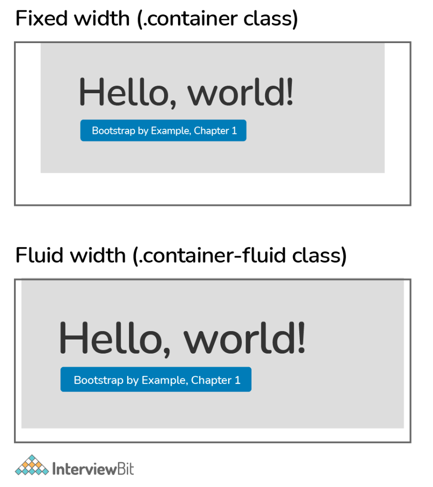

3. What are the default Bootstrap text settings?
   + The default font size in Bootstrap 4 is 16px, with a line-height of 1.5.
   + The default font family is "Helvetica Neue," which includes Helvetica, Arial, and other sans-serif fonts.
   + Margin-top: 0 and margin-bottom: 1rem are also set on all `<p>` elements (16px by default).

4. What do you know about the Bootstrap Grid System?
   + `Bootstrap Grid System`: a mobile-first, responsive grid system that scales up to 12 columns as the device or viewport size grows. Predefined classes for quick layout options and powerful mix-ins for creating successful semantic layouts are included in the system.
   + There are five classes in the Bootstrap 4 grid system:
     + `.col-` for extra small devices, whose screen width is less than 576px.
     + `.col-sm-` small devices, whose screen width is equal to or greater than 576px.
     + `.col-md-` medium devices, whose screen width is equal to or greater than 768px.
     + `.col-lg-` large devices, whose screen width is equal to or greater than 992px.
     + `.col-xl-` extra large devices, whose screen width is equal to or greater than 1200px.
   + The classes listed above can be combined to build layouts that are more dynamic and adaptable.
     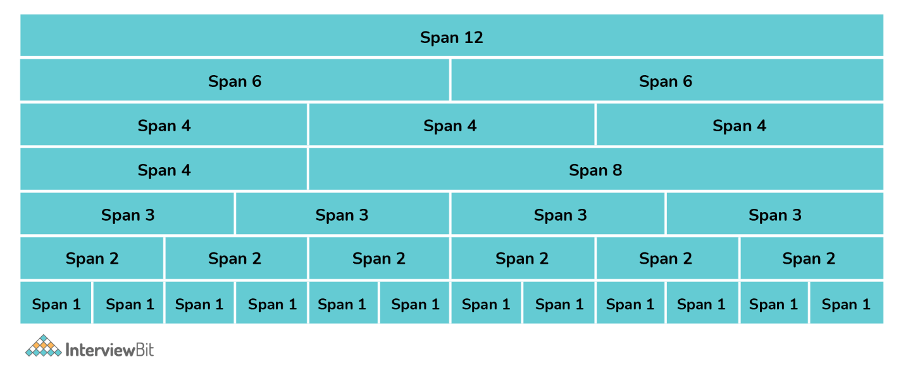

5. What is the difference between Bootstrap 4 and Bootstrap 5?
  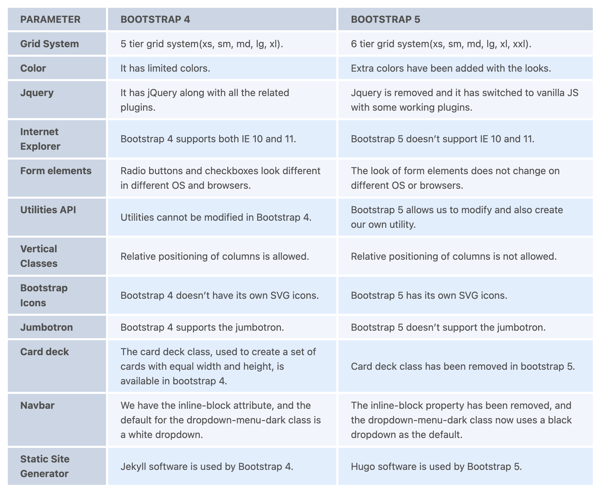

6. What is the difference between Bootstrap 3 and Bootstrap 4?
  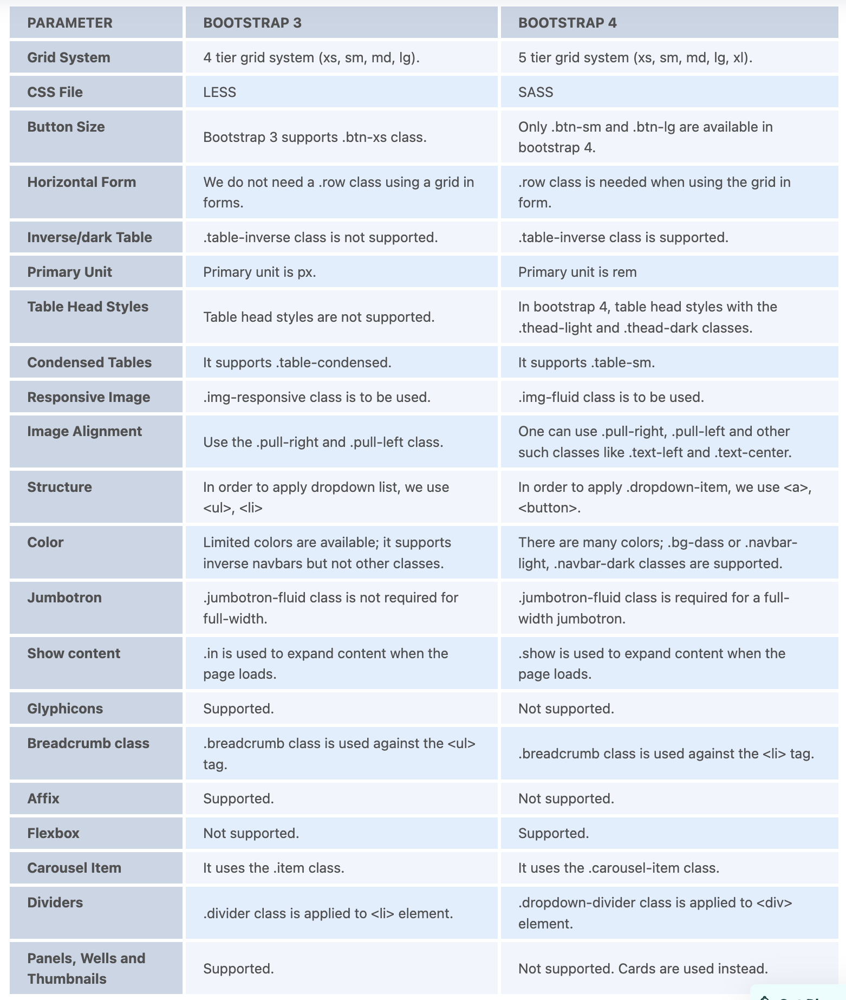

7. What is a Button Group, and what is the class for a basic Button Group?
   + Multiple buttons can be placed together on a single line using button groups. You can use this to group objects together, such as alignment buttons.
   + The .btn-group class is used for basic button groups. You can use the class .btn to wrap a set of buttons in .btn-group.
     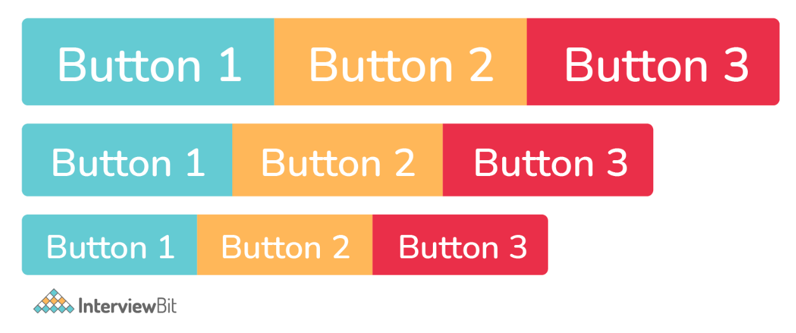

8. What is a breadcrumb in Bootstrap?
   + `Breadcrumbs`: a wonderful way to display a site's hierarchy-based information. Breadcrumbs can show the dates of publication, categories, and tags in the case of blogs. They show where the current page is in the navigational hierarchy.
     + In Bootstrap, a breadcrumb is essentially an unordered list with the class .breadcrumb. CSS adds the separator for you automatically.

9.  How can you use Bootstrap to make thumbnails?
    + To make thumbnails with Bootstrap, go through the steps below:
      + Wrap an image in an `<a>` tag with the class .thumbnail. It will add a grey border and four pixels of padding. An animated light will now outline the image when it has hovered over.

10. In Bootstrap, what are the two codes for displaying code?
    + In Bootstrap, there are two straightforward ways to display code:
      + The `<code>` element is used to showcase a piece of inline code.
      + You can use the `<pre>` tag to display a code that has multiple lines or even a block element.

11. What is a lead?
    + `Lead`: adds some emphasis to a paragraph. The .lead class is used to achieve this and it makes the font larger, taller, and lighter in weight.
    + `<p class= "lead" > Paragraph </p>`
      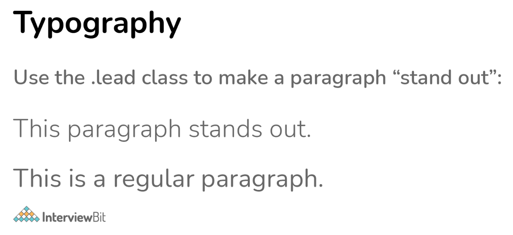

12. In Bootstrap 4, what is flexbox?
    + `Flexbox`: is a layout module for flexible boxes. Without using float or positioning, you can quickly create a flexible layout design with flexbox.

13. In Bootstrap, how do you make navigation elements?
    + The navigation elements in Bootstrap can be styled in a variety of ways. The markup and base class are the same in all of these .nav. To build tabular navigation or tabs, execute the following steps:
      + Begin by creating an unordered list using the base class of .nav. The .nav-tabs class should be added.

14. What contextual classes can be used to style the panels?
    + To make a panel more meaningful to a specific context, use contextual state classes like panel-primary, panel-success, panel-info, panel-warning, and panel-danger.

15. How can one create an alert in Bootstrap?
    + Create a wrapper `<div>` and add a class of .alert and one of the contextual classes to create a basic alert (e.g., .alert-success, .alert-info, .alert-warning, .alert-danger, .alert-primary, .alert-secondary, .alert-light or .alert-dark).
      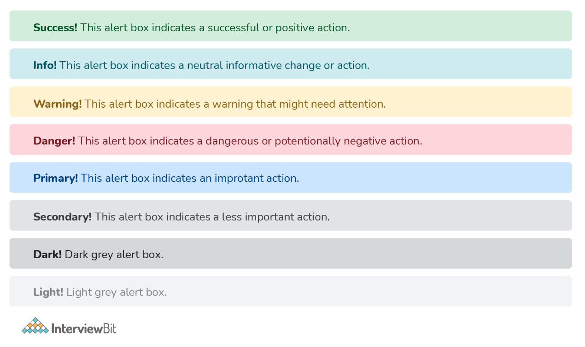

16. What is a bootstrap card and how would you create one?
    + In Bootstrap 4, a card is a bordered box with padding surrounding its content. It has options for headers, footers, content, and colors, among other things.
      ```
      <div class="card">
      <div class="card-header">Header</div>
      <div class="card-body">Body</div>
      <div class="card-footer">Footer</div>
      </div>
      ```
      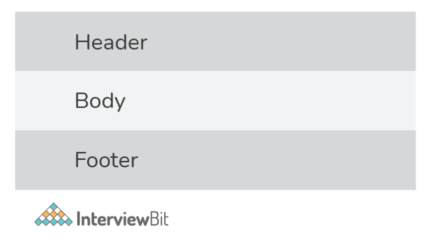
      ```
      <div class="card" style="width:400px">
      
      <div class="card-body">
        <h4 class="card-title">Richard Taylor</h4>
        <p class="card-text">Some example text.</p>
        <a href="#" class="btn btn-primary">See Profile</a>
      </div>
      </div>
      ```
      

17. What are the two types of spinners that you can create using Bootstrap?
    + Use the `.spinner-border` class to make a spinner/loader.
      + `<div class= "spinner-border" ></div>`
    + If you want the spinner/loader to grow instead of "spin", use the `.spinner-grow` class.
      + `<div class= "spinner-grow" ></div>`

18. Explain input groups in Bootstrap.
    + The `.input-group` class is a container for enhancing an input by adding a "help text" icon, text, or button in front or behind the input field.
    + To add the help text in front of the input, use `.input-group-prepend`, and to add it behind the input, use `.input-group-append`.
    + Finally, style the provided help text with the `.input-group-text` class.

19. Discuss Bootstrap table and various classes that can change the appearance of the table.
    + A basic Bootstrap 4 table features horizontal divisions and light padding.
    + The `.table` class gives a table some basic styling.
    + The `.table-striped` class gives zebra stripes to the table.
    + The `.table-bordered` class adds borders to the table and cells on all sides.
    + On table rows, the `.table-hover` class adds a hover effect (grey background color).
    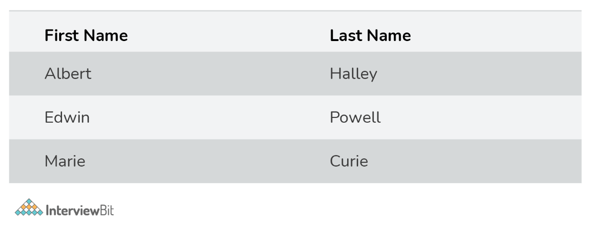

20. Write the HTML code to create a basic toast.
    + When something happens, the toast component acts as an alert box that only appears for a few seconds (i.e. when the user clicks on a button, submits a form, etc.).
      ```
      <div class= "toast" >
      <div class= "toast-header" >
        Toast Header
      </div>
      <div class="toast-body">
        Toast Body Text
      </div>
      </div>
      ```

21. What is the media object in Bootstrap and what are their types?
    + `Bootstrap's media objects`: allow you to position media objects such as images, videos, and audio to the left or right of content blocks. Media elements can be constructed using the class .media and the source is specified by using the class .media-object. There are two types of media objects:
      + `.media`
      + `.media-list`

22. How would you implement a carousel in bootstrap?
    ```
    <div id="myCarousel" class="carousel slide" data-ride="carousel">
    <!-- Indicators -->
    <ul class="carousel-indicators">
      <li data-target="#myCarousel" data-slide-to="0" class="active"></li>
      <li data-target="#myCarousel" data-slide-to="1"></li>
      <li data-target="#myCarousel" data-slide-to="2"></li>
    </ul>
    <!-- Wrapper -->
    <div class="carousel-inner">
      <div class="carousel-item active">
        
        <div class="carousel-caption">
          <h3>APPLE</h3>
        </div>
      </div>

          <div class="carousel-item">
        
        <div class="carousel-caption">
          <h3>ORANGE</h3>
        </div>
      </div>

      <div class="carousel-item">
          
          <div class="carousel-caption">
            <h3>KIWI</h3>
          </div>
        </div>
    </div>

    <!-- Left and Right Controls -->
    <a class="carousel-control-prev" href="#myCarousel" data-slide="prev">
      <span class="carousel-control-prev-icon"></span>
    </a>
    <a class="carousel-control-next" href="#myCarousel" data-slide="next">
      <span class="carousel-control-next-icon"></span>
    </a>
    </div>
    ```
    + `The outermost <div> is as follows`:
      + For carousel controls to work properly, they must have an id (in this case, `id="myCarousel"`).
      + This `<div>` has the class="carousel" to indicate that it contains a carousel.
      + When a new item is displayed, the `.slide` class adds a CSS transition and animation effect that causes the objects to slide. If you don't want this effect, leave this class out.
      + When the page loads, the `data-ride= "carousel"` attribute tells Bootstrap to start animating the carousel right away.
    + `The section on "Indicators" is as follows`:
      + Each slide's indicators are the small dots at the bottom (which indicates how many slides there are in the carousel, and which slide the user is currently viewing).
      + With the class `.carousel-indications`, the indicators are supplied in an ordered list.
      + The data-target attribute refers to the carousel's id.
      + When a user clicks on a given dot, the `data-slide-to` attribute defines the slide they should go to.
    + `The "Wrapper" section is as follows`:
      + A div with the class `.carousel-inner` specifies the slides.
      + Each slide's content is defined by a `div` with the class `.item`. This can be in the form of text or visuals.
      + One of the slides must have the `.active` class applied to it. The carousel will not be viewable otherwise.
      + To generate a caption for each slide, a `<div class="carousel-caption">` is added within each `<div class="item">`
    + `The section on "Left and Right Controls" is as follows`:
      + This code adds "left" and "right" buttons, allowing the user to manually navigate between slides.
      + The data-slide attribute takes the keywords "prev" or "next," which change the position of the slide in relation to its current location.
      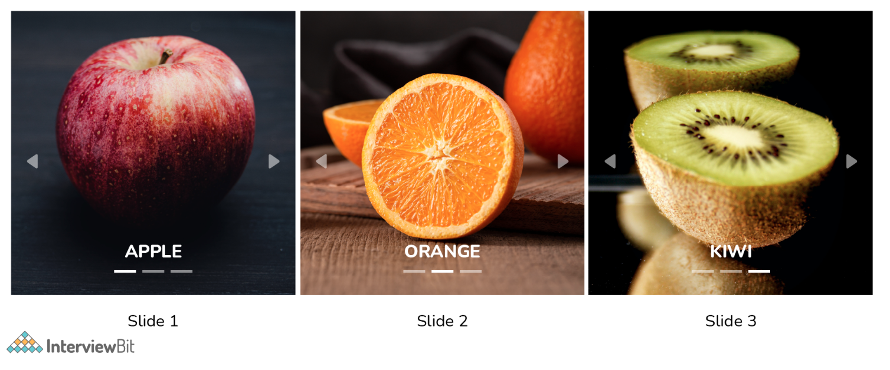

23. What do you mean by the Bootstrap well?
    + `Bootstrap well`: simply a container that makes the content appear sunken. It can also produce an inset effect on the webpage. With the aid of `<div>` and class, a developer may create a well and also wrap the content in the well. The content will be displayed according to your preferences.

24. What are glyphicons?
    + `Glyphicons`: icon fonts that you can use on your website. Their developer has made them freely available for Bootstrap projects.
    + To utilize the icons, simply copy and paste the following code anywhere in your code. To ensure adequate padding, leave a space between the icon and the text.
    + `<span class = "glyphicon glyphicon-search" ></span>`
    + Note: Bootstrap 4 lacks an icon library of its own (Glyphicons from Bootstrap 3 are not supported in BS4).

25. What is bootstrap pagination and how are they classified?
    + If your website has lots of pages, you might require adding some sort of pagination to each page.
      
        ```
        <ul class="pagination">
          <li class="page-item"><a class="page-link" href="#">Previous</a></li>
          <li class="page-item"><a class="page-link" href="#">1</a></li>
          <li class="page-item"><a class="page-link" href="#">2</a></li>
          <li class="page-item"><a class="page-link" href="#">3</a></li>
          <li class="page-item"><a class="page-link" href="#">4</a></li>
          <li class="page-item"><a class="page-link" href="#">Next</a></li>
        </ul>
        ```
    + `Pagination`: how Bootstrap handles an unordered list. The following classes are provided by bootstrap to manage pagination:
      + `.pagination`: This class is required to enable pagination on your page.
      + `.disabled, .active`: Use .disabled for unclickable links and .active to indicate the current page when customising links.
      + `.pagination-Ig and .pagination-sm`: use these to get different size items.

26. What are badges? Which class will you use to make your badge look more rounded?
    + `Badges`: used to supplement any content with additional information. To make rectangular badges, use the .badge class with a contextual class (like .badge-secondary) within `<span>` elements. It's worth noting that badges scale to fit the parent element's size (if any).
    + To make the badges more rounded, we use the .badge-pill class.
    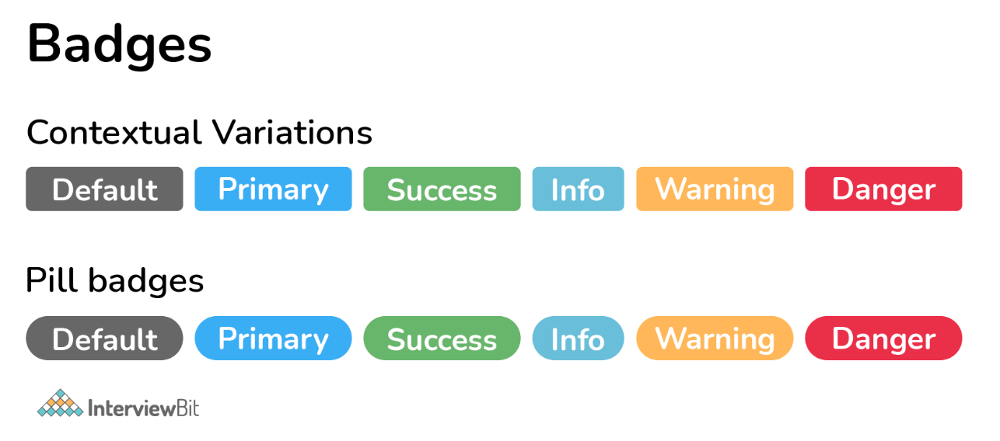

27. What do you understand by column ordering in Bootstrap?
    + One of the most intriguing properties of bootstrap is column ordering. The columns can be readily written in a specific order by utilizing relevant functions. You might alternatively put them in a different column. Use the push and pull column classes to easily rearrange or rearrange the order of the columns. These classes are used in conjunction with the `.col-xs-#`, `.col-sm-#`, `.col-md-#`, and `.col-lg-#` Bootstrap grid classes.
    + `.col-xs-push-#` and `.col-xs-pull-#` are the push and pull classes for the Bootstrap grid. This also works well for sm, md, and lg. The pull class moves columns to the left, whereas the push class moves them to the right.

28. Explain the affix plugin.
    + `Affix plugin`: allows you to affix a `<div>` to a particular location on the page. You may also use this plugin to turn on and off the pinning. Social icons are a good example of this. They'll start in one position, but when the page reaches a certain point, the `<div>` will be frozen in place and will no longer scroll with the rest of the page.

29. What are Bootstrap collapsing elements?
    + `Bootstrap collapsing elements`: You may collapse any element without creating any JavaScript code or accordion markup. To automatically delegate control of a collapsible element in bootstrap, add data-toggle= "collapse" to the controller element along with a data-target or href. You may also do the same thing with `.collapse (options)`, `.collapse (‘show')`, or `.collapse (‘hide')`.

30. In Bootstrap, what is a scrollspy?
    + `Scrollspy`: an auto-updating nav component that allows you to grab sections of the page based on where you're scrolling. Based on the scroll position, the .active class will update from one nav item to the next.

31. Why is Jumbotron used in Bootstrap?
    + `Jumbotron`: used to highlight contents. It enlarges the headline and provides a margin for the landing page's content. In order to implement Jumbotron in Bootstrap, create a container div with the `.jumbotron` class.

32. How is tooltip different from popover?
    + When the user moves the mouse pointer over an element, the Tooltip component appears as a little pop-up box. The Popover component is a pop-up box that emerges when the user clicks on an element. The popover may hold a lot more information.
    + The popover will show on the right side of the element by default whereas the tooltip will show on the top of the element by default.
      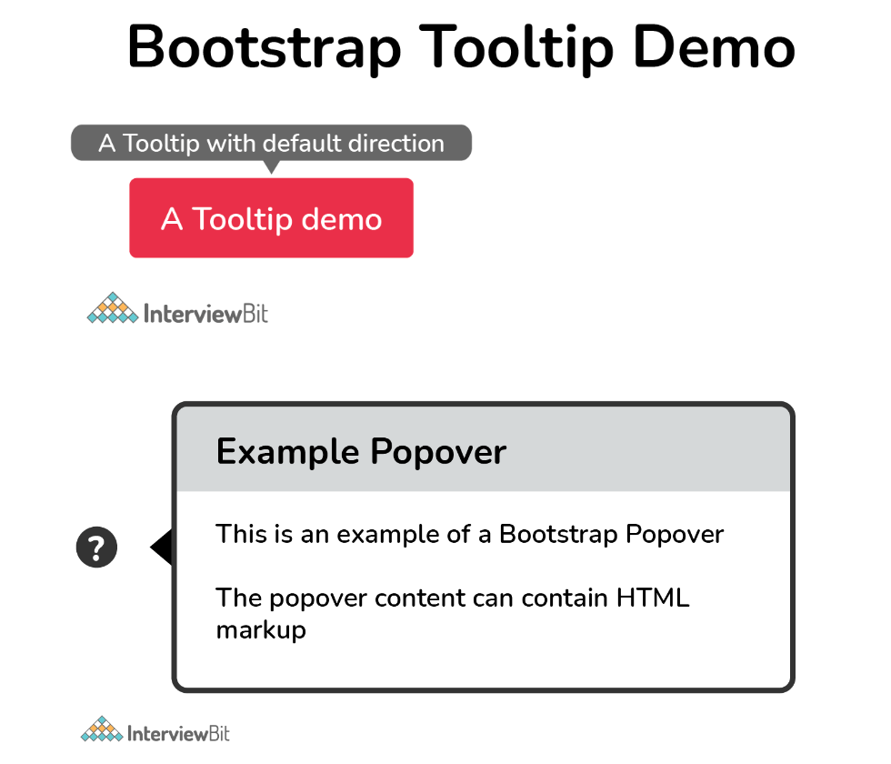

33. What classes can help you change the default settings of positioning a popover and closing a popover?
    + The popover will show on the right side of the element by default. To position the popover on the top, bottom, left, or right side of the element, use the data-placement attribute.
    + When you click on the element again, the popover closes by default. However, the data-trigger="focus" attribute can be used to close the popover when the user clicks outside the element.
    + Use the data-trigger attribute with the value "hover" if you want the popover to appear when you move the mouse cursor over the element.

34. Discuss the properties of flexbox.
    + The properties of flexbox are:
      + `Enable flex behaviors`:
        + To make a flexible container and convert direct children elements into flex items, use the "display" utility.
        + Additional flex characteristics can be used to further customize flex containers and items.
        + Default flexbox container:
          + `<div class="d-flex p-2">flexbox container</div>`
      + `Direction`:
        + You can use direction utilities to change the direction of a flex item in a flex container. It is not essential to create a horizontal class because it is set to row by default.
        + To show the flex items horizontally, use `.flex-row (side by side)`. To right-align the horizontal direction, use `.flex-row-reverse`.
        + Use `.flex-column` to display flex items vertically (on top of each other), or `.flex-column-reverse` to display them in the other direction.
      + `Justify content`:
        + To adjust the alignment of flex elements, use the `.justify-content-*` classes. Start (default), end, center, between, and around are all valid classes.
          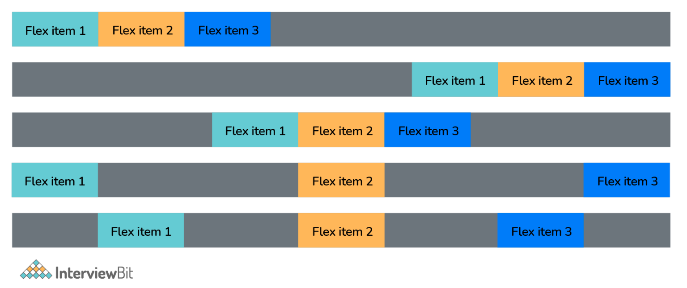
      + Align items:
        + You can change the vertical alignment of single rows of flex items with the `.align-items-* classes`. `.align-items-start`, `.align-items-end`, `.align-items-center`, `.align-items-baseline`, and `.align-items-stretch` (default) are valid classes.
      + `Align self`:
        + You can change the vertical alignment of a specific flex item with the `.align-self-*` classes. .`align-self-start`, `.align-self-end`, `.align-self-center`, `.align-self-baseline`, and `.align-self-stretch` (default) are valid classes.
      + `Auto margins`:
        + You can easily add auto margins to flex items with .mr-auto which pushes items to the right, or by using `.ml-auto` which pushes items to the left.
      + `Grow`:
        + You can use `.flex-grow-1` on a flex item to take up the unused space. In the example below, the second flex item uses all the available space since we have used the `.flex-grow-1` class with the second flex item.
          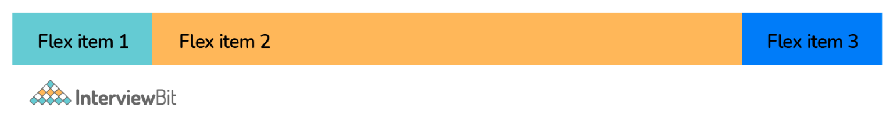
        + You can use `.flex-shrink-1` on a flex item to make it shrink if required.
      + `Fill`:
        + You can use `.flex-fill` on flex items to make them into equal widths.
      + `Wrap`:
        + flex-wrap:
          
        + flex-wrap-reverse:
          
        + flex-nowrap:
          
      + `Order`:
        + With the `.order` classes, you can change the visual order of a given flex item(s). The number of valid classes ranges from 0 to 12, with the lowest number having the highest importance (order-1 is shown before order-2, etc..).
      + `Align content`:
        + You can change the vertical alignment of gathered flex items with the `.align-content-*` classes. .`align-content-start` (default), `.align-content-end`, `.align-content-center`, `.align-content-baseline`, and `.align-content-stretch` are valid classes.

35. What are the important rules that you should follow while using Grids in Bootstrap?
      + A row's immediate child must be a Column.
      + Rows are just used to contain Columns and are not utilized for anything else.
      + Rows should be put within a container.
