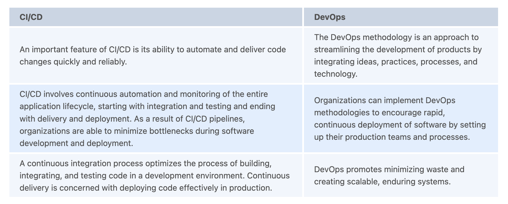
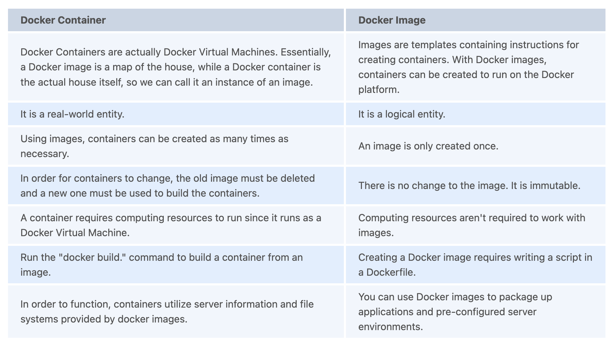
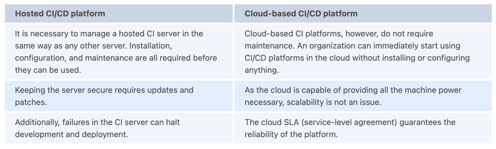

# CI/CD Interview Questions

---

1. What is CI/CD pipeline?
   + `CI/CD`: a combination of continuous integration (CI) and continuous delivery (usually) or continuous deployment (rarely) in software engineering. Modern DevOps operations are built on the foundation of continuous integration and continuous delivery, or the CI/CD pipeline. You can automate your software delivery process with a CI/CD pipeline. As part of the pipeline, code is built, tests are run (CI), and a new version of the application is safely deployed (CD). By automating pipelines, manual errors are eliminated, developers are provided with standardized feedback loops, and iterating on products is made more efficient. In DevOps, continuous integration and continuous delivery (CI/CD) are best practices that ensure that code changes are delivered regularly and reliably.

2. Explain Continuous Integration, Continuous Delivery, and Continuous Deployment.
   + `Continuous Integration (CI)`: the practice of developers regularly integrating their code changes into a repository. Integration may take place several times a day and is verified by automated tests and a build process. As a result, integration challenges can be avoided, bugs can be found early in the development cycle, fixed, and tested iteratively. Every time new commits are integrated into the main branch, continuous integration emphasizes testing automation to make sure the application is not broken.
   + `Continuous Delivery (CD)`: all code changes are automatically deployed to the test and/or production environments after the build is complete. Feature additions, configuration changes, and error fixes are some examples of changes. By automating the delivery of new code to users, CD ensures a safe, quick, sustainable process. The CD process also involves some additional checks, like performance tests in production. With Continuous Delivery, deployments are predictable and scheduled regularly.
   + `Continuous Deployment (CD)`: The most critical stage of the pipeline is continuous deployment. By following this practice, you will be able to release all changes that have passed all stages of the production pipeline to your customers on time. Code changes can be made live much more quickly at this stage because there is little human interaction. In addition, continuous deployment allows you to accelerate your feedback loop with your customers and relieve pressure on your team since "release days" are no longer needed. Minutes after finishing their work, developers see their work go live.

3. Explain the benefit of the CI/CD Pipeline.
   + CI/CD makes it possible to quickly integrate small code changes and test the changes easily.
   + With CI/CD setup, fault isolation is easier and faster. In fault isolation, the system is monitored, the fault occurrence time is determined, and the fault location is determined.
   + With CI/CD, MTTR (mean time to resolution) is reduced since changes are smaller and easier to implement. CI/CD setup increases the reliability of the unit and integration testing.
   + When CI/CD is set up, small code changes are merged very quickly and the code is ready for production very soon.
   + CI improves transparency by detecting early-stage failures like build failures, merge issues, integration test failures, etc.
   + CD facilitates the release of code to end-users.

4. What is a CI/CD Engineer?
   + `CI/CD engineers`: can improve the integration and operation of CI/CD tools as well as ensure quality end-to-end integration systems. CI/CD Engineers would keep teams motivated and lead the charge on CI/CD. It is the CI/CD engineer's responsibility to ensure that CI/CD tools and platforms are functioning correctly within an organization. CI/CD engineers understand how to optimize their teams' development and release processes.

5. State difference between CI/CD vs DevOps.
  

6. What are some popular CI/CD tools?
   + Jenkins
   + CircleCI
   + Bamboo
   + Team City
   + Codefresh

7. Does CI/CD require any programming knowledge?
   + As far as CI/CD goes, it does not require any programming language or scripting language to be used. It is not necessary to use any programming or scripting language when you use a GUI-based tool like Azure DevOps (ADO). The use of ARM templates in Azure DevOps requires scripting knowledge. Therefore, it depends on the tools and different ways of setting up CI/CD.

8. What is Version Control?
   + `Version control`: the use of a central repository where teammates can commit changes to files and sets of files. The purpose of version control is to track every line of code, and to share, review, and synchronize changes between team members. The following are some of the most popular version control tools:
     + Mercurial
     + Subversion (SVN)
     + Concurrent Version Systems (CVS)
     + Perforce
     + Bazaar
     + Bitkeeper
     + Fossil

9.  Explain Git.
    + `Git`: a distributed version control system that keeps track of changes to code repositories. As projects progress, Git uses a branch-based workflow to streamline team collaboration.

10. What do you mean by Git Repository?
    + As part of the software development process, software projects are organized through Git repositories. In the repository, developers can keep track of all the files and changes in the project, so that they can navigate to any point in its history at any time.

11. Can you explain the Git branch?
    + `Git branch`: a separate line of development that can be used for working on a particular feature, usually during development. The use of branches allows developers to code without interfering with the work of other team members.

12. What is the importance of DevOps?
    + A robust and flexible product deployment system is essential for organizations to remain competitive in today's digitized world. It is here that the DevOps concept comes into play.
    + The DevOps approach plays a crucial role in generating agility and mobility across all aspects of software development, from conception to deployment.
    + Continuously updating and improving products is more streamlined and efficient with DevOps.
    + By implementing DevOps, developers increase their focus on building only code, while automating and consolidating the remaining tasks.
    + In addition to creating better communication and collaboration, combining the engineering and operations teams increase transparency and accessibility.
    + Increasing efficiency speeds up development and reduces coding errors.
    + Programming defects are the most common cause of development failures. DevOps teams will facilitate more releases in a shorter time frame.

13. Describe the build stage.
    + `Build stage`: the first phase of the CI/CD pipeline, and it automates a lot of the steps that a typical developer goes through, such as installing tools, downloading dependencies, and compiling a project. Aside from building code, build automation involves the use of tools to verify that the code is safe and compliant with best practices. In this stage, the buildability and testability of the application are validated.

14. What does containerization mean?
    + `Containerization`: packaging together software code along with all the necessary components, such as frameworks, libraries, and other dependencies, in their own container. Among the advantages of containerization is that a container can be viewed as a fully packaged computing environment that can be transported in one piece.

15. Explain Docker.
    + `Docker`: a containerization platform that packages applications and their dependencies together in containers to ensure that the applications run seamlessly across multiple environments. Docker containers are entire file systems that contain all the components for running a piece of software: code, system tools, runtime, system libraries, etc. Any software that can be installed on a server can be packaged in a Docker container. It ensures that the software always runs the same in any environment.

16. State differences between a docker image and a container.
  

17. Explain trunk-based development.
      + `Trunk-based development`: an approach ensuring software remains up-to-date by integrating small, frequent updates into the main branch or a core "trunk". As a result of its ability to streamline merging and integration phases, it can be used to achieve CI/CD and to increase the speed and efficiency of the delivery of software and the efficiency of organizations. It is a branching model that consists of most of the work happening in a single trunk (also known as the trunk, master, or main). Each developer in the team merges their changes into the trunk on a daily basis. The reason why trunk-based development is popular is that it simplifies version control. This model minimizes merge conflicts due to the trunk's single source of truth.

18. Can a branch live for a long time?
    + Continuous integration follows trunk-based development practices, which means branches should be short-lived. Branch durations should be kept to a minimum of a few hours and a maximum of a day.

19. What is the difference between a hosted and a cloud-based CI/CD platform?
  

20. In CI/CD, does security play an important role? How does it get secured?
      + There are many factors that affect the security of CI/CD pipelines. These include:
        + The importance of unit testing cannot be overstated when it comes to the testing of multiple unit-testable distributed components. It is therefore important to unit test your code properly.
        + Static analysis security testing (SAST) scans your code for security vulnerabilities and the libraries you use. To ensure SAST scanning, all modern tools integrate well with the CD pipeline.
        + DAST (dynamic analysis security testing) is a tool for securing your application by dynamically scanning for security vulnerabilities. It simulates the actions of an attacker by performing the tests outside the application.

21. Explain some common practices of CI/CD.
    + Embrace the DevOps culture.
    + Ensure continuous integration is implemented and utilized.
    + Ensure the same deployment process is followed for every environment.
    + In the event that your pipeline fails, restart it.
    + Version control should be applied.
    + Incorporate the database into the pipeline.
    + Keep an eye on your continuous delivery pipeline.
    + Get your CD pipeline up and running.

22. In what way does testing fit into continuous integration? Is automated testing always a good idea?
    + The testing process is inextricably linked to continuous integration. Continuous feedback is the main benefit of CI for teams. Code developers test their code in the CI to ensure that it behaves as expected. Without testing, there would be no feedback loop to determine whether the application is release-ready.

23. Why is Automated Testing essential for CI/CD?
    + In order to ensure code quality, automation is an important characteristic of the CI/CD pipeline. The test automation process is used throughout the software development pipeline to identify dependencies and other issues, push changes to the different environments, and deploy applications into production. As part of its quality control role, the automation will assess everything from API usage and performance to security. In this manner, all changes made by team members are integrated comprehensively and implemented correctly.
      + With automated testing, we can run tests simultaneously across multiple servers/containers, resulting in a faster testing process.
      + Automated testing provides more consistency. Software automation eliminates human errors, and bias, and assures that it behaves as expected.
      + To meet changing demands, tools and frameworks in a CI/CD pipeline need to be adjusted quickly. Keeping up with updates and being agile is difficult with manual testing. However, most configurations are done automatically when you have automated tests. This allows you to migrate quickly to new environments.
      + Maximizing the workforce is crucial to a successful development project. Test automation frees engineers to work on other high-value tasks.
      + CI/CD pipelines require all the testing effort when small changes are made. Validating minor changes continuously is easier with automated testing.

24. What are the top testing tools in continuous testing?
    + An essential part of the CI/CD pipeline is continuous testing (CT). The developers are buffered by it, as it squashes bugs in a timely manner. This ensures that no matter how many releases take place, the end-user experience remains uncompromised. Despite accelerated processes, CT serves as a safety net that preserves the end-user experience. It must be seamlessly integrated into the software delivery pipeline since it is a continuous process. The following are the top testing tools used in continuous testing:
      + Testsigma
      + Selenium
      + IBM Rational Functional Tester
      + Tricentis Tosca
      + UFT (Unified Functional Testing)

25. How do DevOps tools work together?
    + A generic logical flow is shown below that automates it to ensure smooth delivery. Organizations may follow different flows depending on their needs.
      + Developers create code, and a version control system, such as Git, manages the source code.
      + Any modifications made to this code are committed to the Git repository by developers.
      + Jenkins extracts the code from the repository and builds it using software such as Ant or Maven using the Git plugin.
      + Puppet is used to deploy and configure test environments, and Jenkins releases this code to the test environment so that testing can be conducted using Selenium tools.
      + Jenkins deploys the code once it has been tested on the production server (even the production servers are managed by resources like a puppet).
      + Nagios, for example, continuously monitors it after deployment.
      + Using Docker containers, we can test the build features in a controlled environment.

26. What are some of the deployment strategies?
    + `Regular release/deployment`: Through a single release, the software is made available to the public.
    + `Canary releases`: These releases are intended to reduce the risk of failure by exposing a small fraction of the user base (around 1%) to the release. As part of a canary release, developers gradually transition users to the new release in a controlled manner.
    + `Blue-green releases`: involves running two instances of an application simultaneously; one is the current stable version, and the other is the most recent version. An immediate switch is made from the old version to the new one. If there is a problem, users can immediately revert to the previous version, which is safer than regular or big-bang releases.

27. Can you tell me about the serverless model?
    + There is a cloud-native approach to development known as serverless development, which allows developers to develop and run applications without requiring the management of servers. The server still exists serverless, but it is abstracted from application development.

28. Explain OpenShift Container Platform.
    + `OpenShift Container Platform`: a PAAS service offered by RedHat, formerly called OpenShift Enterprises. Additionally, Open Shift offers auto-scaling, self-healing, and highly available applications without the need to manually set them up in a traditional environment, even if they're on-premises or in the cloud. The OpenShift platform supports a wide variety of open-source programming languages, giving developers a polyglot choice.

29. What do you mean by Rolling Strategy?
    + `Rolling deployments`: update running instances of an application with new releases as they are released. The process involves replacing old versions of an application over time with new versions of the application by replacing the entire infrastructure on which the application is run.

30. Describe Chef?
    + `Chef`: is essentially an automation platform for turning infrastructure into code. A chef is a tool used to automate processes with scripts. There are three main components of Chef that can be categorized as follows:
      + `Chef Workstation`: The workstation is the computer system on which the administrator sits. This system generates code for configuring and managing infrastructure, known as recipes (written in Ruby). A cookbook consists of multiple recipes. In order to upload cookbooks to the server, the Knife command line tool is used.
      + `Chef Server`: Second, a server resides between a workstation and its nodes, which stores the cookbooks. Servers provide the tools necessary to enable node configurations, and they may be locally or remotely hosted.
      + `Chef Node`: The final component is the node, which requires configuration. You can have a number of Chef nodes that collect information about the current state of a node. The server then compares this information with the configuration files to determine if any new configuration is needed.
