# Cascading Style Sheet (CSS) Interview Questions

---

1. What is the Box model in CSS? Which CSS properties are a part of it?
   + A rectangle box is wrapped around every HTML element. The box model is used to determine the height and width of the rectangular box. The CSS Box consists of Width and height (or in the absence of that, default values and the content inside), padding, borders, margin.
    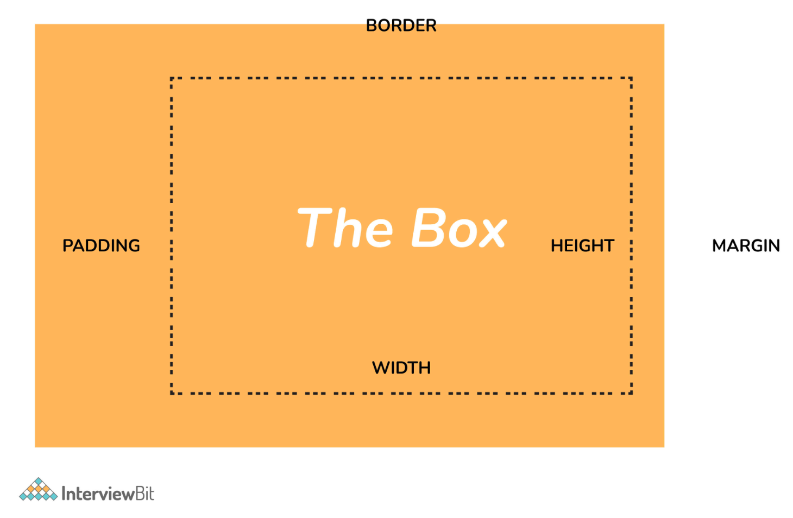
     + Content:  Actual Content of the box where the text or image is placed.
     + Padding: Area surrounding the content (Space between the border and content).
     + Border: Area surrounding the padding.
     + Margin: Area surrounding the border.

2. What are the advantages of using CSS?
   + Separation of content from presentation - CSS provides a way to present the same content in multiple presentation formats in mobile or desktop or laptop.
   + Easy to maintain - CSS, built effectively can be used to change the look and feel complete by making small changes. To make a global change, simply change the style, and all elements in all the web pages will be updated automatically.
   + Bandwidth - Used effectively, the style sheets will be stored in the browser cache and they can be used on multiple pages, without having to download again.

3. What are the limitations of CSS?
   + Browser Compatibility: Some style selectors are supported and some are not. We have to determine which style is supported or not using the `@support` selector).
   + Cross Browser issue: Some selectors behave differently in a different browser).
   + There is no parent selector: Currently, Using CSS, you can’t select a parent tag.

4. How to include CSS in the webpage?
   + External Style Sheet: An external file linked to your HTML document: Using `link` tag, we can link the style sheet to the HTML page.
     + `<link rel="stylesheet" type="text/css" href="mystyles.css" />`
   + Embed CSS with a `style` tag: A set of CSS styles included within your HTML page.
     + ```
        <style type="text/css">

        /*Add style rules here*/

        </style>
       ```
   + Add inline styles to HTML elements(CSS rules applied directly within an HTML tag.): Style can be added directly to the HTML element using a `style` tag.
     + `<h2 style="color:red;background:black">Inline Style</h2>`
   + Import a stylesheet file (An external file imported into another CSS file): Another way to add CSS is by using the `@import` rule. This is to add a new CSS file within CSS itself.
     + `@import "path/to/style.css";`

5. What are the different types of Selectors in CSS?
   + Universal Selector: The universal selector works like a wildcard character, selecting all elements on a page. In the given example, the provided styles will get applied to all the elements on the page.
     + ```
       * {
         color: "green";
         font-size: 20px;
         line-height: 25px;
       }
       ```
    + Element Type Selector: This selector matches one or more HTML elements of the same name. In the given example, the provided styles will get applied to all the ul elements on the page.
     + ```
        ul {
          line-style: none;
          border: solid 1px #ccc;
        }
       ```
    + id Selector: This selector matches any HTML element that has an `id` attribute with the same value as that of the selector. In the given example, the provided styles will get applied to all the elements having id as a container on the page.
      + ```
          #container {
            width: 960px;
            margin: 0 auto;
          }

          <div id="container"></div>
        ```
    + Class Selector: The `class` selector also matches all elements on the page that have their class attribute set to the same value as the class.  In the given example, the provided styles will get applied to all the elements having ID as the box on the page.
      + ```
          .box {
            padding: 10px;
            margin: 10px;
            width: 240px;
          }

          <div class="box"></div>
        ```
    + Descendant Combinator: The descendant selector or, more accurately, the descendant combinator lets you combine two or more selectors so you can be more specific in your selection method.
      + ```
          #container .box {
            float: left;
            padding-bottom: 15px;
          }

          <div id="container">
            <div class="box"></div>

            <div class="box-2"></div>
          </div>

          <div class=”box”></div>
        ```
      + This declaration block will apply to all elements that have a class of box that is inside an element with an ID of the container. It’s worth noting that the `.box` element doesn’t have to be an immediate child: there could be another element wrapping `.box`, and the styles would still apply.
    + Child Combinator: A selector that uses the child combinator is similar to a selector that uses a descendant combinator, except it only targets immediate child elements.
      + ```
          #container> .box {
            float: left;
            padding-bottom: 15px;
          }

          <div id="container">
            <div class="box"></div>

            <div>
              <div class="box"></div>
            </div>
          </div>
        ```
      + The selector will match all elements that have a class of box and that are immediate children of the `#container` element. That means, unlike the descendant combinator, there can’t be another element wrapping `.box` it has to be a direct child element.
    + General Sibling Combinator: A selector that uses a general sibling combinator to match elements based on sibling relationships. The selected elements are beside each other in the HTML.
      + ```
          h2 ~ p {
            margin-bottom: 20px;
          }

          <h2>Title</h2>
          <p>Paragraph example.</p>
          <p>Paragraph example.</p>
          <p>Paragraph example.</p>
          <div class=”box”>
            <p>Paragraph example.</p>
          </div>
        ```
      + In this example, all paragraph elements (`<p>`) will be styled with the specified rules, but only if they are siblings of `<h2>` elements. There could be other elements in between the `<h2>` and `<p>`, and the styles would still apply.
    + Adjacent Sibling Combinator: A selector that uses the adjacent sibling combinator uses the plus symbol (`+`), and is almost the same as the general sibling selector. The difference is that the targeted element must be an immediate sibling, not just a general sibling.
      + ```
          p + p {
            text-indent: 1.Sem;
            margin-bottom: 0;
          }

          <h2>Title</h2>
          <p>Paragraph example.</p>
          <p>Paragraph example.</p>
          <p>Paragraph example.</p>

          <div class=”box”>
            <p>Paragraph example.</p>
            <p>Paragraph example.</p>
          </div>
        ```
      + The above example will apply the specified styles only to paragraph elements that immediately follow other paragraph elements. This means the first paragraph element on a page would not receive these styles. Also, if another element appeared between two paragraphs, the second paragraph of the two wouldn’t have the styles applied.
    + Attribute Selector: The attribute selector targets elements based on the presence and/or value of HTML attributes, and is declared using square brackets.
      + ```
          input [type=”text”] {
            background-color: #444;
            width: 200px;
          }

          <input type="text">
        ```

6. What is a CSS Preprocessor? What are Sass, Less, and Stylus? Why do people use them?
   + A CSS Preprocessor is a tool used to extend the basic functionality of default vanilla CSS through its own scripting language. It helps us to use complex logical syntax like – variables, functions, mixins, code nesting, and inheritance to name a few, supercharging your vanilla CSS.
   + SASS: Sass is the acronym for “Syntactically Awesome Style Sheets”. SASS can be written in two different syntaxes using SASS or SCSS
   + SASS vs SCSS
     + SASS is based on indentation and SCSS(Sassy CSS) is not.
     + SASS uses `.sass` extension while SCSS uses `.scss` extension.
     + SASS doesn’t use curly brackets or semicolons. SCSS uses it, just like the CSS.
   + SASS Syntax
      + ```
        $font-color: #fff
        $bg-color: #00f

        #box
          color: $font-color
          background: $bg-color
        ```
    + SCSS Syntax
      + ```
          $font-color: #fff;
          $bg-color: #00f;

          #box{
            color: $font-color;
            background: $bg-color;
          }
        ```
    + LESS: LESS is an acronym for “Leaner Stylesheets”. LESS is easy to add to any javascript projects by using NPM or less.js file. It uses the extension .less. LESS syntax is the same as the SCSS with some exceptions. LESS uses `@` to define the variables.
      + ```
          @font-color: #fff;
          @bg-color: #00f

          #box{
            color: @font-color;
            background: @bg-color;
          }
        ```
    + Stylus: Stylus offers a great deal of flexibility in writing syntax, supports native CSS as well as allows omission of brackets, colons, and semicolons. It doesn’t use `@` or `$` for defining variables.
      + ```
          /* STYLUS SYNTAX WRITTEN LIKE NATIVE CSS */
          font-color= #fff;
          bg-color = #00f;

          #box {
            color: font-color;
            background: bg-color;
          }

          /* OR */

          /* STYLUS SYNTAX WITHOUT CURLY BRACES */
          font-color= #fff;
          bg-color = #00f;

          #box
            color: font-color;
            background: bg-color;
        ```

7. What is VH/VW (viewport height/ viewport width) in CSS?
   + It’s a CSS unit used to measure the height and width in percentage with respect to the viewport. It is used mainly in responsive design techniques. The measure VH is equal to 1/100 of the height of the viewport. If the height of the browser is 1000px, 1vh is equal to 10px. Similarly, if the width is 1000px, then 1 vw is equal to 10px.

8. Difference between reset vs normalize CSS?. How do they differ?
   + Reset CSS: CSS resets aim to remove all built-in browser styling. For example margins, paddings, font-sizes of all elements are reset to be the same.
   + Normalize CSS: Normalize CSS aims to make built-in browser styling consistent across browsers. It also corrects bugs for common browser dependencies.

9.  What is the difference between inline, inline-block, and block?
    + Block Element: The block elements always start on a new line. They will also take space for an entire row or width. List of block elements are `<div>`, `<p>`.
    + Inline Elements: Inline elements don't start on a new line, they appear on the same line as the content and tags beside them. Some examples of inline elements are `<a>`, `<span>`, `<strong>`, and `` tags.
    + Inline Block Elements: Inline-block elements are similar to inline elements, except they can have padding and margins and set height and width values.

10. Is it important to test the webpage in different browsers?
    + It’s most important to test a website in different browsers when you’re first designing it, or when making major changes. However, it’s also important to repeat these tests periodically, since browsers go through a lot of updates and changes.

11. What are Pseudo elements and Pseudo classes?
    + Pseudo-elements allows us to create items that do not normally exist in the document tree, for example ::after.
     + ::before
     + ::after
     + ::first-letter
     + ::first-line
     + ::selection
     + In the below example, the color will appear only on the first line of the paragraph.
      + ```
          p: :first-line {
            color: #ffOOOO;
            font-variant: small-caps;
          }
        ```
    + Pseudo-classes select regular elements but under certain conditions like when the user is hovering over the link.
     + :link
     + :visited
     + :hover
     + :active
     + :focus
     + Example of the pseudo-class, In the below example, the color applies to the anchor tag when it’s hovered.
       + ```
          /* mouse over link */
          a:hover {
            color: #FFOOFF;
          }
         ```

12. How do you specify units in the CSS?. What are the different ways to do it?
    + There are different ways to specify units in CSS like `px`, `em`, `pt`, percentage (`%`). px(`Pixel`) gives fine-grained control and maintains alignment because 1 px or multiple of 1 px is guaranteed to look sharp. px is not cascade. em maintains relative size. you can have responsive fonts. Em, will cascade 1em is equal to the current font-size of the element or the browser default. If u sent font-size to 16px then 1em = 16px. The common practice is to set default body font-size to 62.5% (equal to 10px).
    + pt(point) are traditionally used in print. 1pt = 1/72 inch and it is a fixed-size unit.
    + %(percentage) sets font-size relative to the font size of the body. Hence, you have to set the font-size of the body to a reasonable size.

13. Does margin-top or margin-bottom have an effect on inline elements?
    + No, it doesn’t affect the inline elements. Inline elements flow with the contents of the page.

14. What property is used for changing the font face?
    + We can use the `font-family` property for achieving this. The `font-family` property is used for specifying what font needs to be applied on the targeted DOM element. It can hold several font names as part of “fallback” mechanism in case the browser does not support the fonts. For example, we can use:
     + ```
        p {
          font-family: "Times New Roman", Times, serif;
        }
       ```
       + In the above piece of code, we are applying font-family property to the paragraph element.
         + It tells the browser to look for “Times New Roman” font and apply it
         + If the “Times New Roman” font is not installed or supported, then it asks the browser to use Times font.
         + If both “Times New Roman” and Times are not supported, then it asks the browser to use any supported generic font belonging to serif.
     + If you do not want the font-face of the paragraph element to be Times New Roman/Times/serif font, and you want to use the Arial/Helvetica/sans-serif font, then we can just update the CSS property of paragraph element as:
       + ```
          p {
            font-family: Arial, Helvetica, sans-serif;
          }
         ```

15. What are the differences between adaptive design and responsive design?
  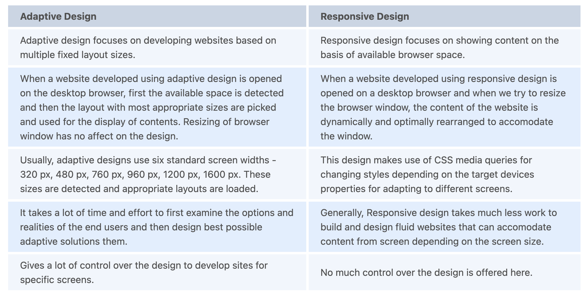

1.  How are the CSS selectors matched against the elements by the browser?
    + The order of matching selectors goes from right to left of the selector expression. The elements in the DOM are filtered by browsers based on the key selectors and are then traversed up to the parent elements for determining the matches. The speed of determining the elements depends on the length of the chain of selectors. Consider an example:
     + ```
        p span {
            color: black;
        }
       ```
      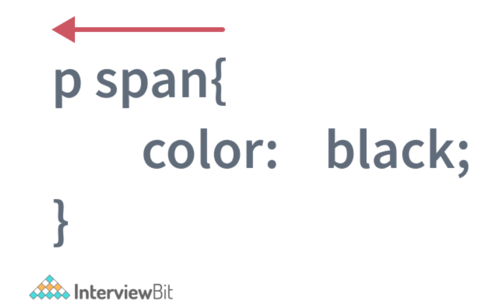
     + Here, the browser first finds all `span` elements in the DOM and then it traverses to each of its parent elements to check if they are the paragraph `p` elements.
     + Once the browser finds all matching `span` tags having paragraph elements as parent and applies the color of black to the content, the matching process is stopped.

2.  How is border-box different from content-box?
    + `content-box` is the default value box-sizing property. The height and the width properties consist only of the content by excluding the border and padding. Consider an example as shown:
     + ```
        div {
            width:300px;
            height:200px;
            padding:15px;
            border: 5px solid grey;
            margin:30px;
            -moz-box-sizing:content-box;
            -webkit-box-sizing:content-box;
            box-sizing:content-box;
        }
       ```
       + Here, the box-sizing for the `div` element is given as content-box. That means, the height and width considered for the `div` content exclude the padding and border. We will get full height and width parameters specified for the content as shown in the below image.
        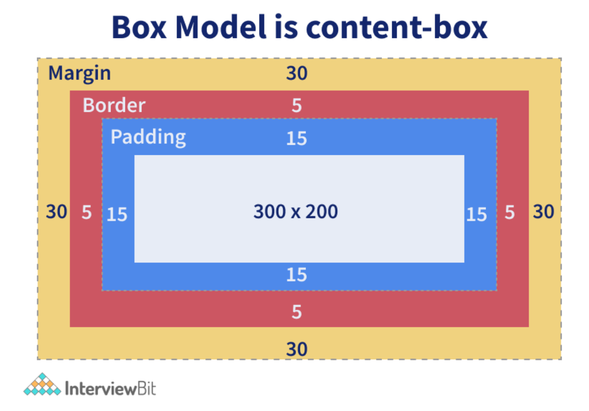
    + `border-box` property includes the content, padding and border in the height and width properties.
     + ```
        div {
            width:300px;
            height:200px;
            padding:15px;
            border: 5px solid grey;
            margin:30px;
            -moz-box-sizing:border-box;
            -webkit-box-sizing:border-box;
            box-sizing:border-box;
        }
       ```
       + Here, the box-sizing for the `div` element is given as `border-box`. That means the height and width considered for the `div` content will also include the padding and border. This means that the actual height of the div content will be:
         + ```
            actual height = height -
                            padding on top and bottom -
                            border on top and bottom
                          = 200 - (15*2) - (5*2)
                          = 160 px
           ```
           + and the actual width of the div content would be:
             + ```
                actual width  = width -
                                padding on right and left -
                                border on right and left
                              = 300 - (15*2) - (5*2)
                              = 260 px
               ```
            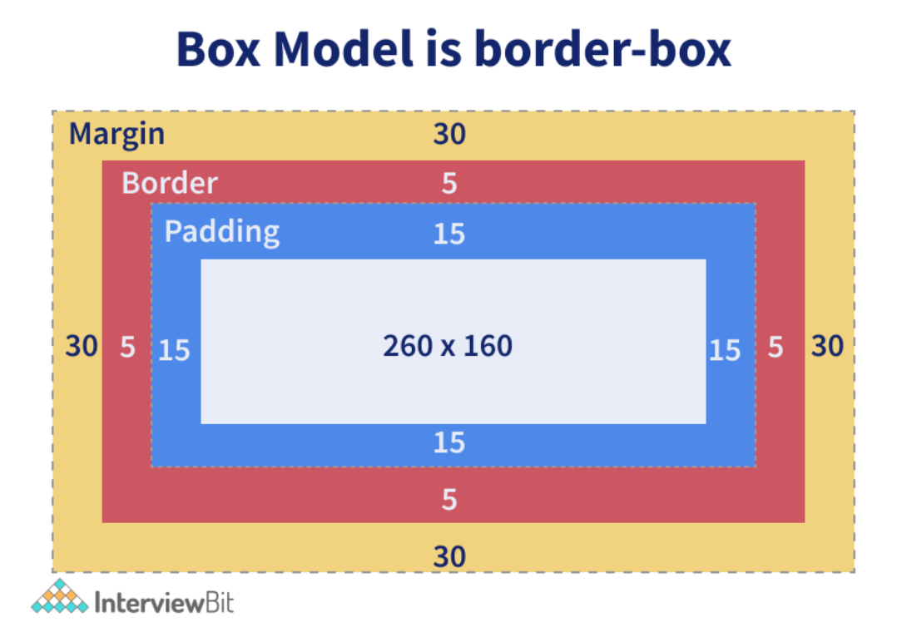

3.  How is opacity specified in CSS3?
    + Opacity refers to the degree to which the content is transparent or opaque. We can use the property named opacity which takes the values ranging from 0 to 1. 0 specifies that the element is completely transparent where 1 means that the element is completely opaque. We can use the opacity property as follows:
     + ```
        div {
            opacity: 0.6;
        }
       ```
       + In the above example, an opacity of 60% is applied to the div section. The opacity property is not supported by the internet explorer browser. To make it work there, we need to use filter property as polyfill as shown in the example below.
         + ```
            div {
                opacity: 0.6;
                filter: alpha(opacity=60);
            }
           ```
        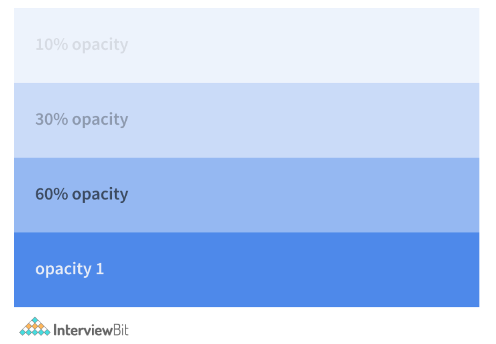

4.  Why should we use float property in CSS?
    + The float property is used for positioning the HTML elements horizontally either towards the left or right of the container. For instance,
     + ```
        float-demo {
            float: right;
        }
       ```
       + Here, the element to which the class is applied ensures that the element is positioned on the right of the container. If you specify the value of float as left, then the element will be placed on the left side of the container.

5.  What is a z-index, how does it function?
    + z-index is used for specifying the vertical stacking of the overlapping elements that occur at the time of its positioning. It specifies the vertical stack order of the elements positioned that helps to define how the display of elements should happen in cases of overlapping.
    + The default value of this property is 0 and can be either positive or negative. Apart from 0, the values of the z-index can be:
     + Auto: The stack order will be set equal to the parent.
     + Number: The number can be positive or negative. It defines the stack order.
     + Initial: The default value of 0 is set to the property.
     + Inherit: The properties are inherited from the parent.
    + The elements having a lesser value of z-index is stacked lower than the ones with a higher z-index.
      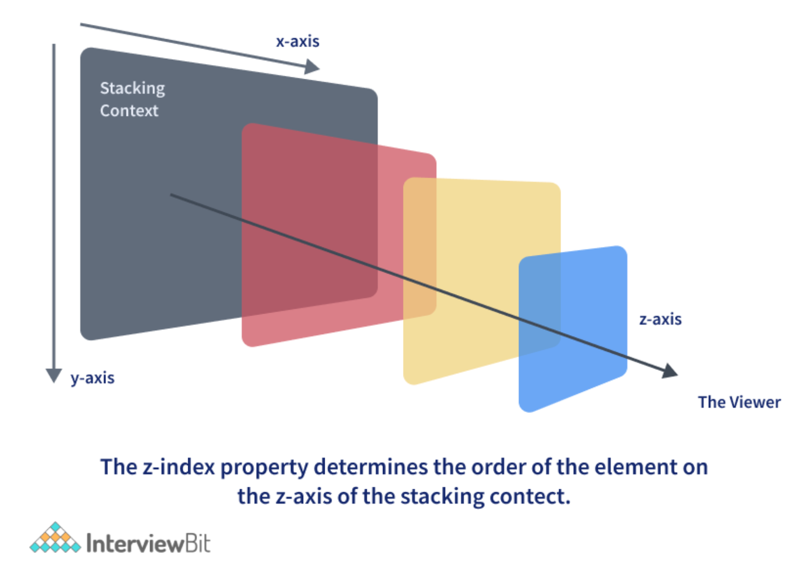
       + From the above figure, we can see that as the value of the z-index increases along the z-axis, the order of stacking would be towards the top of other elements along the vertical axis.

6.  What do the following CSS selectors mean?
    + `div, p`
     + This selector implies selecting all `div` elements and all `p` elements
     + ```
        <h1>Heading 1</h1>
          <div>
              Division 1
              <p> paragraph 1</p> <!-- Will be selected -->
          </div>
          <p> paragraph 2</p>
          <p> paragraph 3</p>
          <div>
              Division 2
          </div>
          <span> Span 1 </span>
       ```
       + Here, all the `div` elements and the `p` elements would be selected by the browser irrespective of their parents or where they are placed. The remaining tags like `h1` and `span` are ignored.
    + `div p`
     + This selector tells to select all `p` elements that are inside `div` elements.
     + ```
        <h1>Heading 1</h1>
        <div>
            Division 1
            <p> paragraph 1</p> <!-- Will be selected -->
            <div>
                <p> Inner Div Paragraph </p> <!-- Will be selected -->
            </div>
        </div>
        <p> paragraph 2</p>
        <p> paragraph 3</p>
        <div>
            Division 2
        </div>
        <span> Span 1 </span>
       ```
       + Here, `<p>paragraph 1</p>` and `<p> Inner Div Paragraph </p>` would be selected by the browser and the properties are applied. The rest of the paragraph tags are not selected.
    + `div ~ p`
     + This selector tells to select all `p` elements that have `div` elements preceeded anywhere.
     + ```
        <h1>Heading 1</h1>
        <div>
          Division 1
          <p> paragraph 1</p>
        </div>
        <p> paragraph 2</p> <!-- Will be selected -->
        <p> paragraph 3</p> <!-- Will be selected -->
        <div>
          Division 2
        </div>
        <span> Span 1 </span>
       ```
       + Here, paragraph 2 and paragraph 3 elements would be selected as marked in the code above.
    + `div + p`
     + This selector says to select all `p` elements placed immediately after the `div` element.
     + ```
        <h1>Heading 1</h1>
        <div>
            Division 1
            <p> paragraph 1</p>
        </div>
        <p> paragraph 2</p> <!-- Will be selected -->
        <p> paragraph 3</p>
        <div>
            Division 2
        </div>
        <span> Span 1 </span>
       ```
       + In this case, we have 2 `p` elements immediately after the `div` tag.
    + `div > p`
     + This selector says to select all `p` elements which has `div` as an immediate parent.
     + ```
        <h1>Heading 1</h1>
        <div>
            Division 1
            <p> paragraph 1</p> <!-- Will be selected -->
        </div>
        <p> paragraph 2</p>
        <p> paragraph 3</p>
        <div>
            Division 2
        </div>
        <span> Span 1 </span>
       ```
       + Only `<p> paragraph 1</p>` will be selected in this case because it has immediate `div` as the parent.

7.  What are the properties of flexbox?
    + Flexbox stands for flexible box and it was introduced around 2017 in CSS with the purpose of providing an efficient way to handle layouts, align elements within them and distribute spaces amongst the items in dynamic/responsive conditions. It provides an enhanced ability to alter the dimensions of the items and make use of the available space in the container efficiently. In order to achieve this, CSS3 provides some properties.
    + flex-direction: This property helps in defining the direction the container should stack the items targetted for flex. The values of this property can be
       + row: Stacks items horizontally from left to right in the flex container.
       + column: Stacks items vertically from top to bottom in the flex container.
       + row-reverse: Stacks items horizontally from right to left in the flex container.
       + column-reverse: Stacks items vertically from bottom to top in the flex container.
    + flex-wrap: This property specifies of the flex items should be wrapped or not Possible values are:
       + wrap: The flex items would be wrapped if needed.
       + nowrap: This is the default value that says the items won’t be wrapped.
       + wrap-reverse: This specifies that the items will be wrapped if needed but in reverse order.
    + flex-flow: This property is used for setting both flex-direction and flex-wrap properties in one statement.
    + justify-content: Used for aligning the flex items. Possible values are:
       + center: It means that all the flex items are present at the center of the container.
       + flex-start: This value states that the items are aligned at the start of the container. This is the default value.
       + flex-end: This value ensures the items are aligned at the end of the container.
       + space-around: This value displays the items having space between, before, around the items.
       + space-between: This value displays items with spaces between the lines.
    + align-items: This is used for aligning flex items.
    + align-content: This is used for aligning the flex lines.

8.  What is cascading in CSS?
    + “Cascading” refers to the process of going through the style declarations and defining weight or importance to the styling rules that help the browser to select what rules have to be applied in times of conflict. The conflict here refers to multiple rules that are applicable to a particular HTML element. In such cases, we need to let the browser know what style needs to be applied to the element. This is done by cascading down the list of style declarations elements.
    + ```
      p {
          color:white;
      }
      ```
    + ```
      p {
          color: black;
      }
      ```
    + We have a conflict in color property here for the paragraph elements. Here, the browser just cascades down to identify what is the most recent and most specific style and applies that. Since we have the `color:black;` as the most specific declaration, the color black is applied to the paragraph elements. Now if you want to ensure color white is applied to the paragraph, we can define weight to that style by adding `!important` as shown below:
     + ```
        p {
            color:white !important;
        }
       ```
    + `!important` ensures that the property has the maximum weight in presence of other conflicting properties.

9.  Explain CSS position property?
    + Absolute: To place an element exactly where you want to place it. absolute position is actually set relative to the element's parent. if no parent is available then the relative place to the page itself (it will default all the way back up to the element).
    + Relative: "Relative to itself". Setting position: relative; on an element and no other positioning attributes, it will no effect on its positioning. It allows the use of z-index on the element and it limits the scope of absolutely positioned child elements. Any child element will be absolutely positioned within that block.
    + Fixed: The element is positioned relative to the viewport or the browser window itself. viewport doesn't change if you scroll and hence the fixed element will stay right in the same position.
    + Static: Static default for every single page element. The only reason you would ever set an element to position: static is to forcefully remove some positioning that got applied to an element outside of your control.
    + Sticky: Sticky positioning is a hybrid of relative and fixed positioning. The element is treated as relative positioned until it crosses a specified threshold, at which point it is treated as fixed positioned.
    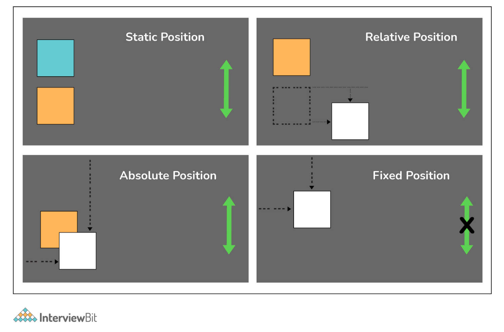

10. When does DOM reflow occur?
    + Reflow is the name of the web browser process for re-calculating the positions and geometries of elements in the document, for the purpose of re-rendering part or all of the document.
    + Reflow occurs when:
       + Insert, remove or update an element in the DOM.
       + Modify content on the page, e.g. the text in an input box.
       + Move a DOM element.
       + Animate a DOM element.
       + Take measurements of an element such as offsetHeight or getComputedStyle.
       + Change a CSS style.

11. Different Box Sizing Property?
    + The box-sizing CSS property sets how the total width and height of an element are calculated.
       + Content-box: The default width and height values apply to the element's content only. The padding and border are added to the outside of the box.
       + Padding-box: Width and height values apply to the element's content and its padding. The border is added to the outside of the box. Currently, only Firefox supports the padding-box value.
       + Border-box: Width and height values apply to the content, padding, and border.

12. How to center align a div inside another div?
    + Centering with Table:
       + HTML:
         + `<div class=”cn”><div class=”inner”>your content</div></div>`
       + CSS:
         + ```
            .cn {
              display: table-cell;
              width: 500px;
              height: 500px;
              vertical-align: middle;
              text-align: center;
            }

            .inner {
              display: inline-block;
              width: 200px; height: 200px;
            }
           ```
    + Centering with Transform
       + HTML:
         + `<div class="cn"><div class="inner">your content</div></div>`
       + CSS:
         + ```
            .cn {
              position: relative;
              width: 500px;
              height: 500px;
            }

            .inner {
              position: absolute;
              top: 50%; left: 50%;
              transform: translate(-50%,-50%);
              width: 200px;
              height: 200px;
            }
           ```
    + Centering with Flexbox
       + HTML:
         + `<div class="cn"><div class="inner">your content</div></div>`
       + CSS:
         + ```
            .cn {
              display: flex;
              justify-content: center;
              align-items: center;
            }
           ```
    + Centering with Grid
       + HTML:
         + ```
            <div class=”wrap_grid”>
              <div id=”container”>vertical aligned text<br />some more text here
              </div>
            </div>
           ```
       + CSS:
         + ```
            .wrap-grid {
              display: grid;
              place-content: center;
            }
           ```

13. Can you name the four types of @media properties?
    + All → It’s the default property. Used for all media-type devices.
    + Screen → Used for computer screen, mobile screen.
    + Print → Used for printers.
    + Speech → Used for screen readers.

14. What is the grid system?
    + CSS Grid Layout is the most powerful layout system available in CSS. It is said to be a 2-dimensional system, meaning it can handle both columns and rows, unlike flexbox which is largely a 1-dimensional system.

15. What are the different ways to hide the element using CSS?
    + Using display property(display: none). It’s not available for screen readers. The element will not exist in the DOM if display: none is used.
    + Using visibility property(visibility: hidden), will take up the space of the element. It will be available to screen reader users. The element will actually be present in the DOM, but not shown on the screen.
    + Using position property (position: absolute). Make it available outside the screen.

16. What does the `:root` pseudo-class refer to?
    + The `:root` selector allows you to target the highest-level “parent” element in the DOM, or document tree. It is defined in the CSS Selectors Level 3 specification.

17. What does Accessibility (a11y) mean?
    + Accessibility refers to how software or hardware combinations are designed to make a system accessible to persons with disabilities, such as visual impairment, hearing loss, or limited dexterity.
    + For example, a website developed with accessibility in mind might have text-to-speech capabilities. In the USA public websites have to have accessible compliance. It’s defined in 508 compliance. It gives the guidelines and best practices for all website users that should be met with key areas of accessibility.

18. How do I restore the default value of a property?
    + The keyword initial can be used to reset it to its default value.

19. Difference between CSS grid vs flexbox?
    + CSS Grid Layout is a two-dimensional system, meaning it can handle both columns and rows. Grid layout is intended for larger-scale layouts which aren’t linear in design.
    + Flexbox is largely a one-dimensional system (either in a column or a row). Flexbox layout is most appropriate to the components of an application.

20. How does Calc work?
    + The CSS3 `calc()` function allows us to perform mathematical operations on property values. Instead of declaring, for example, static pixel values for an element's width, we can use `calc()` to specify that the width is the result of the addition of two or more numeric values.
    + ```
      .foo {
        Width: calc(100px + 50px)
      }
      ```

21. What do CSS Custom properties variables mean?
    + Custom properties (sometimes referred to as CSS variables or cascading variables) are defined by users that contain specific values to be reused throughout a document. The value is set using -- notion. And the values are accessed using the `var()` function.
    + ```
      :root {
        --main-bg-color: brown
      }

      .one {
        color: white;
        background-color· var (--main-bg-color);
        margin: l0px,
        width: 50px,
        height: 5Opx;
        display: inline-block;
      }
      ```

22. What is the difference between CSS variables and preprocessor(SASS, LESS, Stylus) variables?
    + CSS variables can be used without the need for a preprocessor. Currently, all the major browsers support the CSS variables.
    + CSS variable cascade. But the preprocessor variables don’t cascade.
    + CSS variable can be accessed and manipulated in JavaScript.

23. What does `* { box-sizing: border-box; }` do? What are its advantages?
    + It makes every element in the document include the padding and border in the element’s inner dimension for the height and width computation.
    + In box-sizing: border-box, The height of an element is now calculated by the `content's height + vertical padding + vertical border width`.
    + The width of an element is now calculated by the content's `width + horizontal padding + horizontal` border width.

24. What does `!important` mean in CSS?
    + The style is having the important will have the highest precedence and it overrides the cascaded property.
    + ```
      p {
        color: red !important;
      }
      #thing {
        color: green;
      }
      <p id="thing">Will be RED.</p>
      ```

25. What is specificity? How to calculate specificity?
    + A process of determining which CSS rule will be applied to an element. It actually determines which rules will take precedence. Inline style usually wins then ID then the class value (or pseudo-class or attribute selector), the universal selector (*) has no specificity. ID selectors have a higher specificity than attribute selectors.

26. What is progressive rendering? How do you implement progressive rendering in the website?. What are the advantages of it?
    + Progressive rendering is the name given to techniques used to improve the performance of a webpage (in particular, improve perceived load time) to render content for display as quickly as possible.
    + We can implement the progressive rendering of the page by loading the lazy loading of the images.  We can use Intersection Observer API to lazy load the image. The API makes it simple to detect when an element enters the viewport and take an action when it does. Once the image enters the viewport, we will start loading the images.
    + ```
      

      document.addEventListener("DOMContentLoaded", function() {
        var lazyImages = [].slice.call(document.querySelectorAll("img.lazy"));

        if ("IntersectionObserver" in window) {
          let lazyImageObserver = new IntersectionObserver(function(entries, observer) {
            entries.forEach(function(entry) {
              if (entry.isIntersecting) {
                let lazyImage = entry.target;
                lazyImage.src = lazyImage.dataset.src;
                lazyImage.srcset = lazyImage.dataset.srcset;
                lazyImage.classList.remove("lazy");
                lazyImageObserver.unobserve(lazyImage);
              }
            });
          });

          lazyImages.forEach(function(lazyImage) {
            lazyImageObserver.observe(lazyImage);
          });
        } else {
          // Possibly fall back to event handlers here
        }
      });
      ```

27. What are the advantages of using `translate()` instead of absolute position?
    + `Translate()` does not cause the browser to trigger repaint and layout and instead only acts on the compositor. The absolute position triggers the repaint or DOM reflow. So, `translate()` gives better performance.

28. Does style1.css have to be downloaded and parsed before style2.css can be fetched?
    + No, the browsers will download the CSS in the order of its appearance on the HTML page.
    + ```
      <head>
        <link h ref=" stylel. css" rel=" stylesheet">
        <link href="style2.css" rel="stylesheet">
      </head>
      ```

29. How to determine if the browser supports a certain feature?
    + The `@support` in CSS can be very useful to scan if the current browser has support for a certain feature.
    + ```
      @supports (display: grid) {
        div {
          display: grid;
        }
      }
      ```

30. How does the absolute positioning work?
    + Absolute positioning is a very powerful positioning mechanism that allows users to place any element wherever they want in an exact location. The CSS properties right, left, top, bottom and define the exact locations where you need to place the element. In absolute positioning, the following points need to be considered:
       + The element to which the absolute positioning is applied is removed from the normal workflow of the HTML document.
         + The HTML layout does not create any space for that element in its page layout.
       + The element is positioned relative to the closest positioned ancestor. If no such ancestor is present, then the element is placed relative to the initial container block.
       + The final position of the element is determined based on values provided to the top, right, left, bottom.

31. How does this property work `overflow: hidden`?
    + The overflow property in CSS is used for specifying whether the content has to be clipped or the scrollbars have to be added to the content area when the content size exceeds the specified container size where the content is enclosed. If the value of overflow is hidden, the content gets clipped post the size of the container thereby making the content invisible.
    + ```
      div {
          width: 150px;
          height: 50px;
          overflow: hidden;
      }
      ```
      + If the content of the div is very large and exceeds the height of 50px, the content gets clipped post 50px and the rest of the content is not made visible.

32. How will you align content inside the p tag at the exact center inside the div?
    + We can add the `text-align: center` property inside the parent `div` for aligning the contents horizontally. But it will not align the contents vertically. We can align the content vertically by making the parent element have relative positioning and the child element have absolute positioning. The child element should have the values of top, bottom, right, left as 0 to center it in the middle vertically. Then we need to set the margin as auto. It is assumed that both the child and mother elements will have height and width values.
    + Consider we have a `div` element of height and width taking 20% of the screen size, and we have a paragraph element taking the height of 1.2em and width of 20%. If we want to align the paragraph element at the center (vertically and horizontally), we write the following styles:
     + ```
        div {
            position : relative;  // Make position relative
            height : 20%;
            width : 20%;
            text-align : center; //Align to center horizontally
        }
        p {
            position : absolute; // Make position absolute
            top:0;                // Give values of top, bottom,left, right to 0
            bottom:0;
            left:0;
            right:0;
            margin : auto;        // Set margin as auto
            height : 1.2 em;
            width : 20%;
        }
       ```

33. How is margin different from padding in CSS?
    + Margin property using which we can create space around the elements. We can also create space for borders defined at the exteriors. We have the following properties for defining the margin:
       + margin-top
       + margin-right
       + margin-bottom
       + margin-left
       + margin property by itself has the values as:
         + auto – The browser auto-calculates the margin while we use this.
         + length – The value of this property can be in `px`, `pt`, `cm`, `em`, etc. The values can be positive or negative.
         + % – We can also give percentage value as margin to the element.
         + inherit – Using this property, the margin properties can be inherited from the parent elements.
    + The padding property is used for generating the space around the element’s content and inside any known border. Padding does not allow negative values. The padding also has sub-properties like:
       + padding-top
       + padding-right
       + padding-bottom
       + padding-left
    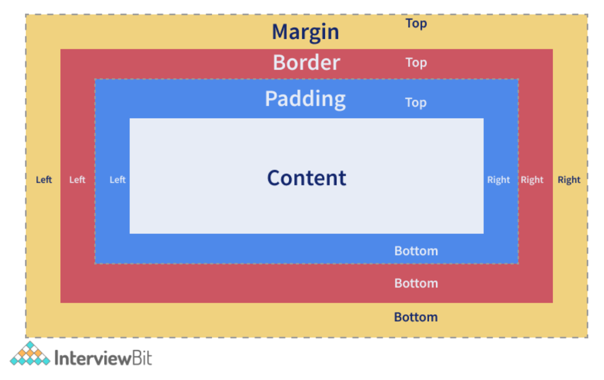

34. What do you have to do to automatically number the heading values of sections and categories?
    + We can use the concept of CSS counters. This lets us adjust the appearance of the content based on the location in a document. While using this, we need to first initialize the value of the counter-reset property which is 0 by default. The same property is also used for changing the value to any number that we need. Post initialization, the counter’s value can be incremented or decremented by using the counter-increment property. The name of the counter cannot be CSS keywords like `“none”`, `“initial”`, `“inherit”` etc. If the CSS keywords are used, then the declaration would be ignored.
    + ```
      body {
        counter-reset: header;   /* define counter named 'header' whose initial value is 0 by default */
      }

      h2::before {
        counter-increment: header;   /* The value of header counter by 1.*/
        content: "Header " counter(header) ": ";  /* To display word Header and the value of the counter with colon before it.*/
      }
      ```
     + Here, we are trying to achieve auto count increment and display feature for the `h2` tag. Wherever we use `h2` tag, the content will be prefixed by "Header 1 : " , "Header 2 : ", "Header 3 : " etc.

35. How is the `nth-child()` different from nth of type selectors?
   + Both are pseudo-classes (Pseudo-classes are those keywords that specifies the special state of the selected element). The `nth-child()` pseudo-class is used for matching elements based on the number that represents the position of an element based on the siblings. The number is used to match an element on the basis of the element’s position amongst its siblings.
   + For example, in the below piece of code, if we give `nth-child(4)` for the example class, then the 4th child of the example class is selected irrespective of the element type. Here, the fourth child of the example class is the `div` element. The element is selected and a background of black is added to it.
     + ```
        .example:nth-child(4) {
            background: black;
        }
        <div class="example">
          <p>This is a paragraph.</p>
          <p>This is a paragraph.</p>
          <p>This is a paragraph.</p>
          <div>This is a div.</div> <!-- 4th Element to select and apply style-->
          <div>This is a div.</div>
          <p>This is a paragraph.</p>
          <p>This is a paragraph.</p>
          <div>This is a div.</div>
        </div>
       ```
   + The `nth-of-type()` pseudo-class is similar to the nth-child but it helps in matching the selector based on a number that represents the position of the element within the elements that are the siblings of its same type. The number can also be given as a function or give keywords like odd or even.
     + For example, in the below piece of code, if we give `p:nth-of-type(even)` for the example class, then all the even paragraph tags are selected within the example class and the style of background black is applied to them. The selected elements are marked in comments in the below code:
       + ```
          .example p:nth-of-type(even) {
              background: black;
          }
          <div class="example">
            <p>This is a paragraph.</p>
            <p>This is a paragraph.</p> <!-- Select this and apply style-->
            <p>This is a paragraph.</p>
            <div>This is a div.</div>
            <div>This is a div.</div>
            <p>This is a paragraph.</p> <!-- Select this and apply style-->
            <p>This is a paragraph.</p>
            <div>This is a div.</div>
            <p>This is a paragraph.</p> <!-- Select this and apply style-->
            <div>This is a div.</div>
          </div>
         ```

36. What is the importance of CSS Sprites?
    + CSS sprites are used for combining multiple images in a single larger image. They are commonly used for representing icons that are used in the user interfaces. The main advantages of using sprites are:
       + It reduces the number of HTTP requests to get data of multiple images as they are acquired only by sending a single request.
       + It helps in downloading assets in advance that help display icons or images upon hover or other pseudo-states.
       + When there are multiple images, the browser makes separate calls to get the image for each of them. Using sprites, the images are combined in one and we can just call for that image using one call.
      + Consider an example where our application requires 3 images as shown below (Without Sprites Section). If we are trying to load the images independently, we require 3 different HTTP Requests to get the data. But if we have CSS Sprites where all 3 images are combines into 1 separated by some spaces, then we require only 1 HTTP Request.
       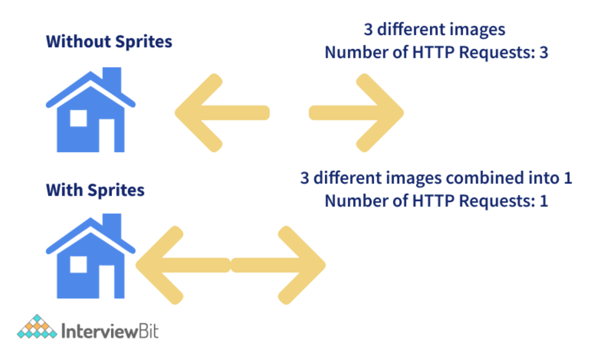
         + We can access each image from the sprite by accessing the positioning properties as shown in the below code:
           + ```
              <!DOCTYPE html>
              <html>
              <head>
              <style>
              #home-icon {
                left: 0px;
                width: 46px;
                background: url('spriteFile.gif') 0 0;
              }

              #prev-icon {
                left: 63px;
                width: 43px;
                background: url('spriteFile.gif') -47px 0;
              }

              #next-icon {
                left: 129px;
                width: 43px;
                background: url('spriteFile.gif') -91px 0;
              }
              </style>
              </head>
              <body>

                    <!-- To display home icon here -->
                    <!-- To display next icon icon here -->
                    <!-- To display previous icon icon here -->

              </body>
              </html>
             ```
              + In the above code, we are trying to access each element - house, previous and next icon - from the sprite file by using the left, width properties. The image is displayed in the img section by means of the background property. Do note that the source of the image (`src` attribute of the `img` tag) is just one file which is the spriteFile.gif and depending on the rules specified in the id selectors, the images are loaded accordingly.

37. What do you understand by tweening in CSS?
    + Tweening is the process of filling the gaps between the key sequences, i.e between the keyframes that are already created. Keyframes are those frames that represent start and end point of animation action. Tweening involves generating intermediate keyframes between two images that give the impression that the first one has evolved smoothly to the second image. For this purpose, we use properties like `transforms - matrix`, `translate`, `scale`, `rotate`, etc.
    + In the below example, we are generating intermediate frames of paragraph elements to slide through from the start to the right edge of the browser.
      + ```
          p {
            animation-duration: 2s;
            animation-name: slidethrough;
          }

          @keyframes slidethrough {
            from {
              margin-left: 100%;
              width: 300%;
            }

            to {
              margin-left: 0%;
              width: 100%;
            }
          }
        ```
         + Here, the paragraph element specifies that the animation process should take 2 seconds for execution from start to the finish. This is done by using the animation-duration property. The animation-name of the `@keyframes` is defined by using the property animation-name. The intermediate keyframes are defined by using `@keyframes` rule. In the example, we have just 2 keyframes. The first keyframe starts at 0% and runs till the left margin of 100% which is the rightmost edge of the containing element. The second keyframe starts at 100% where the left margin is set as 0% and the width to be set as 100% which results in finishing the animation flush against the left edge of the container area.

38. Why do we need to use clear property along with floats in CSS?
    + The clear property along with floats is used for specifying which side of floating elements is not supposed to float. An element having clear property ensures that the element does not move up adjacent to the float. But the element will be moved down past the float.
    + Let us understand this with the help of an example. We know that the floated objects do not add to the height of the objects where they reside. Consider we have a div element with `class “floated_div”` within another `div` element with `id “main_div”`.
      + ```
          <html>
              <head>
              <style>
                  #main_div {
                      width: 400px;
                      margin: 10px auto;
                      border: 4px solid #cccccc;
                      padding: 5px;
                  }

                  .floated_div {
                      float: left;
                      width: 50px;
                      height: 50px;
                      border: 2px solid #990000;
                      margin: 10px;
                  }
              </style>
              </head>
              <body>
                  <div id="main_div">
                      <p>Clear Float Demo</p>
                      <div class="floated_div"></div>
                      <div class="floated_div"></div>
                      <div class="floated_div"></div>
                      <div class="floated_div"></div>
                      <div class="floated_div"></div>
                  </div>
              </body>
          </html>
        ```
        + The result of this code would be as shown below. We see that the squares that are expected to be within dev are not within the main parent div. How do we fix this?
         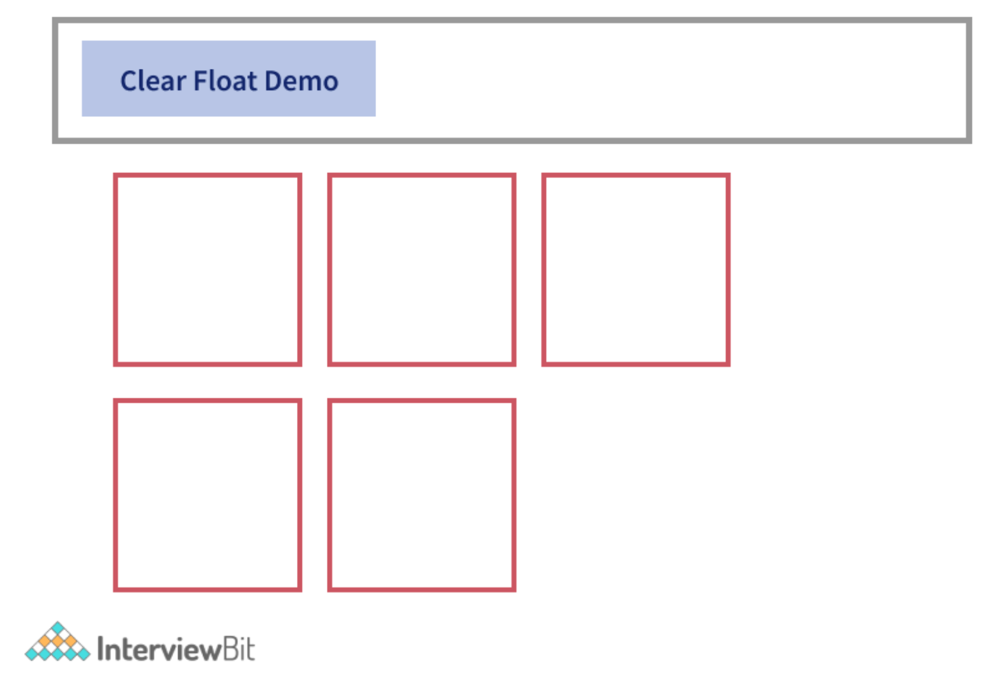
         + We can do it just by adding `<div style="clear:both"></div>` line at the end of the last floated element so that the floated elements are fit in properly within the main `div` container.
           + ```
              <html>
                  <head>
                  <style>
                      #main_div {
                          width: 400px;
                          margin: 10px auto;
                          border: 4px solid #cccccc;
                          padding: 5px;
                      }

                      .floated_div {
                          float: left;
                          width: 50px;
                          height: 50px;
                          border: 2px solid #990000;
                          margin: 10px;
                      }
                  </style>
                  </head>
                  <body>
                      <div id="main_div">
                          <p>Clear Float Demo</p>

                          <div class="floated_div"></div>
                          <div class="floated_div"></div>
                          <div class="floated_div"></div>
                          <div class="floated_div"></div>
                          <div class="floated_div"></div>
                          <div style="clear:both"></div>    <!-- Adding this fixed the issue -->
                      </div>
                  </body>
              </html>
             ```
             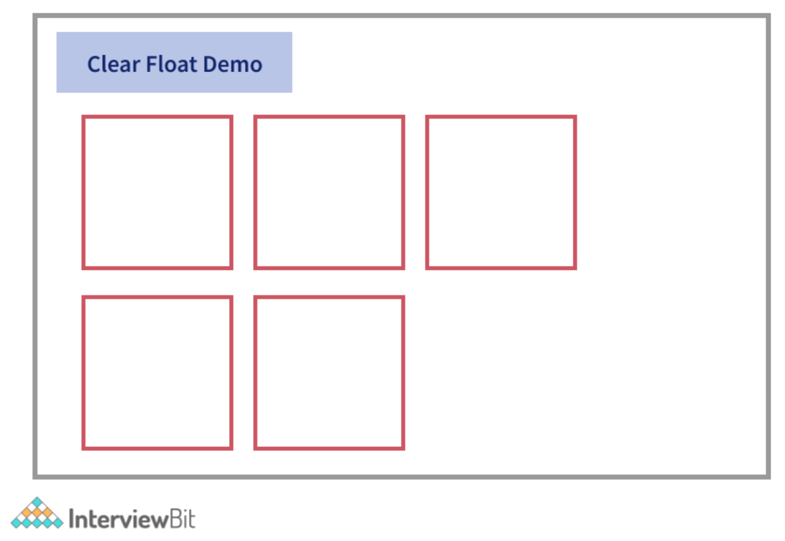

39. How will you fix browser-specific styling issues?
    + We can write browser-specific styles separately in different sheets and load that only when the specific browser is used. This makes use of the server-side rendering technique.
    + We can use auto-prefix for automatically adding vendor prefixes in the code.
    + We can also use normalize.css or reset CSS techniques.
    + Avoiding browser compatibility issues
     + Validate HTML and CSS: We know that the code will be read, interpreted and handled differently by different browsers. We need to validate our HTML and CSS files for the missing closing tags, or missing semicolons in the syntaxes because there are chances that the old browsers will throw errors while rendering the code. We can avoid those errors by:
       + Maintaining well-aligned code that helps in easy readability.
       + Inserting comments at necessary places.
       + Make use of validation tools like Jigsaw CSS validator, W3C HTML Validators to identify syntax issues in the code.
     + Maintain Cross-Browser Compatibility in the Layouts: Cross-Browser compatibility is a must while developing web applications. We expect our application to be responsive across all devices, browsers and platforms. Some of the effects of layout incompatibilities are unresponsiveness of the layouts in mobile devices, the difference in layout rendering between modern and old browsers, etc. These incompatibilities can be avoided by using:
       + CSS Multi-Column layouts - For maintaining proper layouts w.r.t columns and containers.
       + HTML viewport metatag – For ensuring content is properly spanned across mobile devices.
       + CSS Flexbox and Grids - To layout child elements depending on the content and available space.
       + CSS resets stylesheets - For reducing browser inconsistencies in default line heights, font sizes, margins etc.
     + Check JavaScript Library issues: Ensure the libraries are used judiciously and the ones used are supported by the browsers.
     + Check DOCTYPE tag keyword: The `DOCTYPE` keyword is meant for defining rules of what needs to be used in the code. Older browser versions check for `DOCTYPE` tag at the beginning and if not found, the application rendering won't be proper.
     + Test on real devices: Although applications can be tested on virtual environments, it would be more beneficial if the testing is carried out on real devices and platforms. We can use tools like Testsigma for this purpose that enables us to test in real devices parallelly.
