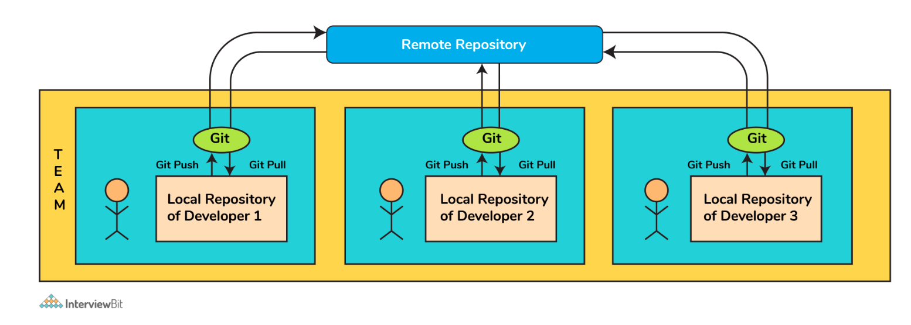
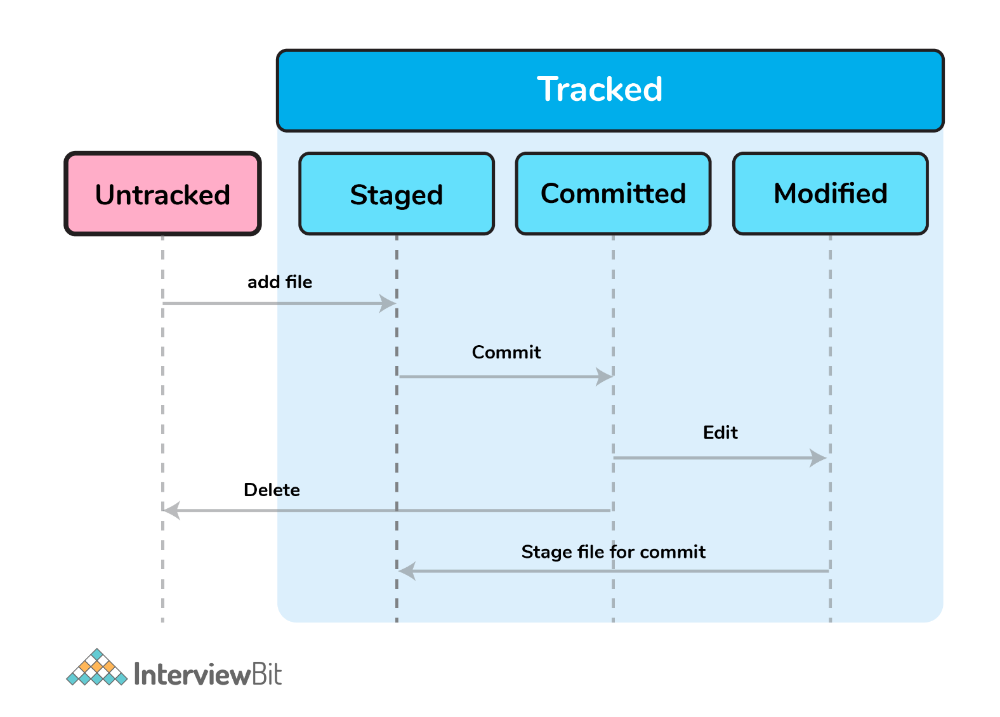
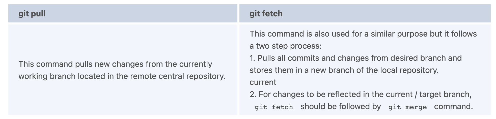
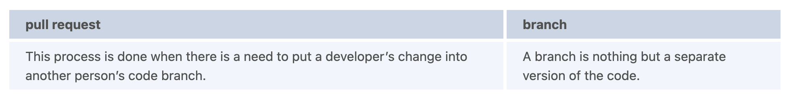
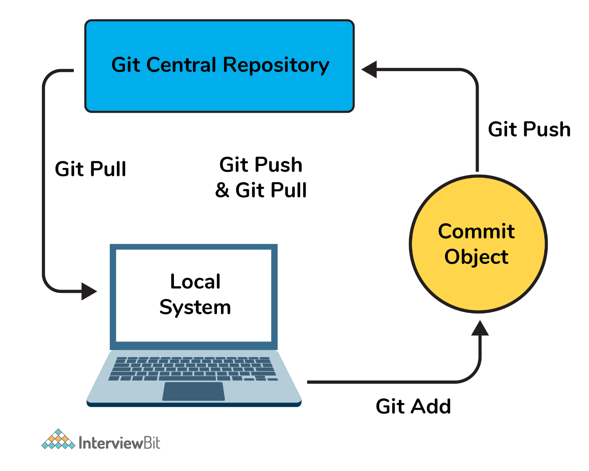
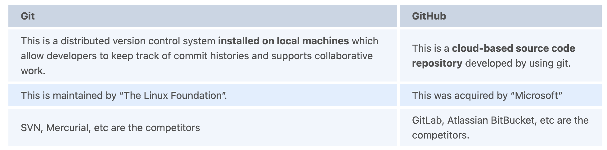
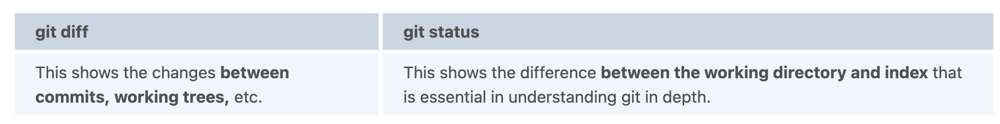
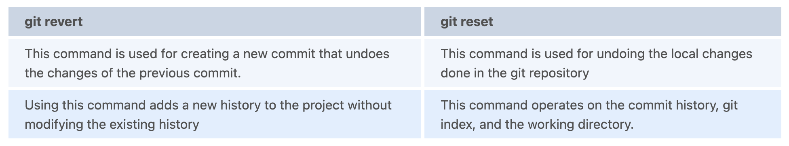

# GIT Interview Questions

---

1. What is Git and why is it used?
   + `Git`: is the most popular, open-source, widely used, and an example of distributed version control system (DVCS) used for handling the development of small and large projects in a more efficient and neat manner.
   + It is most suitable when there are multiple people working on projects as a team and is used for tracking the project changes and efficiently supports the collaboration of the development process.
   + With the help of the versioning system, the developer can identify who has made what changes and then run tests and fix bugs if any and then do necessary feature implementation. In case of any unforeseen circumstances, the code can be reverted to any of the previously working versions thereby saving huge efforts.
   

2. What is a version control system (VCS)?
   + `VCS`: keeps track of the contributions of the developers working as a team on the projects. They maintain the history of code changes done and with project evolution, it gives an upper hand to the developers to introduce new code, fixes bugs, and run tests with confidence that their previously working copy could be restored at any moment in case things go wrong.

3. What is a git repository?
   + A repository is a file structure where git stores all the project-based files. Git can either stores the files on the local or the remote repository.

4. What does git clone do?
   + The command creates a copy (or clone) of an existing git repository. Generally, it is used to get a copy of the remote repository to the local repository.

5. What does the command `git config` do?
   + The `git config` command is a convenient way to set configuration options for defining the behavior of the repository, user information and preferences, git installation-based configurations, and many such things.
       ```
       git config --global
       user.name
       “<<your_name>>”
       ```
       ```
       git config --global user.email “<<your_email>>”
       ```

6. Can you explain `head` in terms of git and also tell the number of heads that can be present in a repository?
   + A `head` is nothing but a reference to the last commit object of a branch.
   + For every repository, there will always be a default head referred to as “master” or now “main” (as per GitHub) but there is no restriction to the count of heads available. In other words, it can have any number of heads.
     + To go or checkout to 1 commit before the latest commit, we use `git checkout HEAD~1`
     + To uncommit the last 3 commits without losing the changes, we first run `git reset HEAD~3`. Then we can see the changes made in the last 3 commits and then update it manually and commit it finally.
     + In order to uncommit the last 3 commits and also remove the changes, we can run the command: `git reset --hard HEAD~3`. This command will completely remove all the changes.
     + To look into the changes made in the last 3 commits, we can run `git diff HEAD~3`
     + To make a new commit by reverting the last 3 commits, we can run the command: `git revert --no-commit HEAD~3...HEAD`

7. What is a conflict?
   + Git usually handles feature merges automatically but sometimes while working in a team environment, there might be cases of conflicts such as:
     + When two separate branches have changes to the same line in a file
     + A file is deleted in one branch but has been modified in the other.
   + These conflicts have to be solved manually after discussion with the team as git will not be able to predict what and whose changes have to be given precedence.
   

8. What is the functionality of `git ls-tree`?
   + This command returns a tree object representation of the current repository along with the mode and the name of each item and the SHA-1 value of the blob.

9.  What does `git status` command do?
    + `git status` command is used for showing the difference between the working directory and the index which is helpful for understanding git in-depth and also keep track of the tracked and non-tracked changes.

10. Define “Index”.
    + Before making commits to the changes done, the developer is given provision to format and review the files and make innovations to them. All these are done in the common area which is known as ‘Index’ or ‘Staging Area’.
    
      + In the above image, the “staged” status indicates the staging area and provides an opportunity for the people to evaluate changes before committing them.

11. What does `git add` command do?
    + This command adds files and changes to the index of the existing directory.
    + You can add all changes at once using `git add .` command.
    + You can add files one by one specifically using `git add <file_name>` command.
    + You can add contents of a particular folder by using `git add /<folder_name>/` command.

12. Why is it considered to be easy to work on Git?
    + With the help of git, developers have gained many advantages in terms of performing the development process faster and in a more efficient manner. Some of the main features of git which has made it easier to work are:
      + `Branching Capabilities`:
        + Due to its sophisticated branching capabilities, developers can easily work on multiple branches for the different features of the project.
        + It also has an easier merge option along with an efficient work-flow feature diagram for tracking it.
      + `Distributed manner of development`:
        + Git is a distributed system and due to this nature, it became easier to trace and locate data if it's lost from the main server.
        + In this system, the developer gets a repository file that is present on the server. Along with this file, a copy of this is also stored in the developer’s system which is called a local repository.
        + Due to this, the scalability of the project gets drastically improved.
      + `Pull requests feature`:
        + This feature helps in easier interaction amongst the developers of a team to coordinate merge-operations.
        + It keeps a proper track of the changes done by developers to the code.
      + `Effective release cycle`:
        + Due to the presence of a wide variety of features, git helps to increase the speed of the release cycle and helps to improve the project workflow in an efficient manner.

13. How will you create a git repository?
    + Have git installed in your system.
    + Then in order to create a git repository, create a folder for the project and then run `git init`.
    + Doing this will create a `.git` file in the project folder which indicates that the repository has been created.

14. Tell me something about `git stash`?
    + Git stash can be used in cases where we need to switch in between branches and at the same time not wanting to lose edits in the current branch. Running the `git stash` command basically pushes the current working directory state and index to the stack for future use and thereby providing a clean working directory for other tasks.

15. What is the command used to delete a branch?
    + To delete a branch we can simply use the command `git branch –d [head]`.
    + To delete a branch locally, we can simply run the command: `git branch -d <local_branch_name>`
    + To delete a branch remotely, run the command: `git push origin --delete <remote_branch_name>`
    + Deleting a branching scenario occurs for multiple reasons. One such reason is to get rid of the feature branches once it has been merged into the development branch.

16. What differentiates between the commands `git remote` and `git clone`?
    + `git remote` command creates an entry in `git config` that specifies a name for a particular URL. Whereas `git clone` creates a new git repository by copying an existing one located at the URL.

17. What does git stash apply command do?
    + `git stash apply` command is used for bringing the works back to the working directory from the stack where the changes were stashed using `git stash` command.
    + This helps the developers to resume their work where they had last left their work before switching to other branches.

18. Differentiate between `git pull` and `git fetch`.
    
    + `git pull = git fetch + git merge`

19. Can you give differences between `pull request` and `branch`?
    

20. Why do we not call git “pull request” as “push request”?
    + `Push request`: is termed so because it is done when the target repository requests us to push our changes to it.
    + `Pull request`: is named as such due to the fact that the repo requests the target repository to grab (or pull) the changes from it.
    

21. Can you tell the difference between Git and GitHub?
    
    + GitHub provides a variety of services like forking, user management, etc along with providing a central repository for collaborative work.

22. What do the git diff and git status commands do?
    
    + `git diff` works in a similar fashion to `git status` with the only difference of showing the differences between commits and also between the working directory and index.

23. What has to be run to squash multiple commits (last N) into a single commit?
    + Squashing multiple commits to a single one overwrites the history which is why it is recommended to be done using full caution. This step can be done by running the command: `git rebase -i HEAD~{{N}} where {{N}}` represents the number of commits needed to be squashed.

24. How would you recover a branch that has already pushed changes in the central repository but has been accidentally deleted from every team member’s local machines?
    + We can recover this by checking out the latest commit of this branch in the reflog and then checking it out as a new branch.

25. Can you tell something about `git reflog`?
    + This command tracks every single change made in the repository references (that can be branches or tags) and also maintains the branches/tags log history that was either created locally or checked out. Reference logs such as the commit snapshot of when the branch was created or cloned, checked-out, renamed, or any commits made on the branch are maintained by Git and listed by the ‘reflog’ command.
      + This recovery of the branch is only possible when the branch was either created locally or checked-out from a remote repository in your local repository for Git to store its reference history logs.
      + This command should be executed in the repository that had the lost branch.

26. What consists of a commit object?
    + A commit object consists of the following components:
      + A set of files that represents the state of a project at a given point in time.
      + Reference to parent commit objects.
      + A 40 character string termed as SHA-1 name uniquely identifies the commit object.

27. Explain the levels in `git config` and how can you configure values using them?
    + In order to make git work, it uses a set of configurations that are pre-defined by default by means of configuration files (or config files). We can change the default behavior of git by just modifying these files which are basically text files. In order to do this, it is important to understand how git identifies these files. It does so by following the below steps:
      + Firstly, git searches for the config values in the system-wide gitconfig file stored in `<<installation_path>>/etc/gitconfig` file that has settings defined and applied to every user of the system and all their repos.
        + In case you want git to search from this particular file and read/write on it, we can pass the option --system to git config command.
      + Next, git searches for the `~/.gitconfig` file or `~/.config/git/confi`g that has the scope specific to the user.
        + Git can be made to read/ write from this file specifically bypassing `--global` to the git config command.
      + Lastly, git searches for the config values in the git directory of the local repository that we are currently working on.
        + These config values are specific to that particular repository alone and can be accessed by passing `--local` to the `git config` command.This is the default config file that gets accessed and modified upon in case we do not specify any levels.

28. What is a detached HEAD and what causes this and how to avoid this?
    + Detached HEAD indicates that the currently checked-out repository is not a local branch. This can be caused by the following scenarios:
      + When a branch is a read-only branch and we try to create a commit to that branch, then the commits can be termed as “free-floating” commits not connected to any branch. They would be in a detached state.
      + When we checkout a tag or a specific commit and then we try to perform a new commit, then again the commits would not be connected to any branch. When we now try to checkout a branch, these new commits would be automatically placed at the top.
    + In order to ensure that detached state doesn't happen, =instead of checking out commit/tag, we can create a branch emanating from that commit and then we can switch to that newly created branch by using the command: `git checkout -b <<new_branch_name>>`. This ensures that a new branch is checkout out and not a commit/tag thereby ensuring that a detached state wouldn't happen.

29. What does `git annotate` command do?
    + This command annotates each line within the given file with information from the commit which introduced that change. This command can also optionally annotate from a given revision.
    + Syntax: `git annotate [<options>] <file> [<revision>]`

30. What is the difference between `git stash apply` vs `git stash pop` command?
    + `git stash pop` command throws away the specified stash (topmost stash by default) after applying it.
    + `git stash apply` command leaves the stash in the stash list for future reuse. In case we wanted to remove it from the list, we can use the `git stash drop` command.
    + `git stash pop = git stash apply + git stash drop`

31. What command helps us know the list of branches merged to master?
    + `git branch --merged` helps to get the list of the branches that have been merged into the current branch.
    + Note: `git branch --no-merged` lists the branches that have not been merged to the current branch.

32. How will you resolve conflict in Git?
    + Conflicts occur whenever there are multiple people working on the same file across multiple branches. In such cases, git won't be able to resolve it automatically as it is not capable of deciding what changes has to get the precedence.
      + Identify the files that have conflicts.
      + Discuss with members who have worked on the file and ensure that the required changes are done in the file.
      + Add these files to the staged section by using the `git add` command.
      + Commit these changes using the `git commit` command.
      + Finally, push the changes to the branch using the `git push` command.

33. What is best advisable step in cases of broken commit: Create an additional commit OR amend an existing commit?
    + It is always advisable to create an additional commit rather than amending the existing commit due to the following reasons:
      + Doing the amend operation destroys the previously saved state of that commit. If only the commit message gets changes or destroyed, it's acceptable but there might be cases when the contents of the commits get amended. This results in the loss of important information associated with the commit.
      + Over usage of `git commit --amend` can have severe repercussions as the small commit amend can continue to grow and gather unrelated changes over time.

34. How to revert a bad commit which is already pushed?
    + There can be cases where we want to revert from the pushed changes and go back to the previous version. To handle this, there are two possible approaches based on the situations:
      + `Approach 1`: Fix the bad changes of the files and create a new commit and push to the remote repository. This step is the simplest and most recommended approach to fix bad changes. You can use the command: `git commit -m "<message>"`
      + `Approach 2`: New commit can be created that reverts changes done in the bad commit. It can be done using `git revert <name of bad commit>`

35. What is the functionality of `git cherry-pick` command?
    + This command is used to introduce certain commits from one branch onto another branch within the repository. The most common use case is when we want to forward- or back-port commits from the maintenance branch to the development branch.

36. Explain steps involved in removing a file from git index without removing from the local file system?
    + Sometimes we end up having certain files that are not needed in the git index when we are not being careful while using the `git add` command. Using the command `git rm` will remove the file from both the index and the local working tree which is not always desirable.
    + Instead of using the `git rm` command we can use the git reset command for removing the file from the staged version and then adding that file to the .gitignore file to avoid repeating the same mistake again.
      ```
      git reset <file_name> # remove file from index
      echo filename >> .gitingore  # add file to .gitignore to avoid mistake repetition.
      ```

37. What are the factors involved in considering which command to choose among: git merge and git rebase?
    + Both these commands ensure that changes from one branch are integrated into another branch but in very different ways. Git rebasing can be thought of as saying to use another branch as a new base for the work.
    + Whenever in doubt, it is always preferred to use the `git merge` command.
    + In case our branch gets contributions from other developers outside the team as in open-source or public repositories, then rebase is not preferred.
      + This is because rebase destroys the branch and it results in broken and inconsistent repositories unless the `git pull --rebase` command is used.
    + Rebase is a very destructive operation. If not applied correctly, it results in loss of committed work which might result in breaking the consistency of other developer’s contribution to the repository.
    + If the model of having branches per feature is followed, rebasing is not a good idea there because it keeps track of related commits done by the developers. But in case the team follows having branches per developer of the team, then the branch has no additional useful information to be conveyed. In this model, rebasing has no harm and can be used.
    + If there is any chance where there might be a necessity to revert a commit to previous commits, then reverting a rebase would be almost impossible as the commit data would be destroyed. In such cases, the merge can be used.

38. How do you find a commit which broke something after a merge operation?
    + This can be a time-consuming process if we are not sure what to look at exactly. Fortunately, git provides a great search facility that works on the principle of binary search as `git-bisect` command.
      ```
      git bisect start         # initiates bisecting session
      git bisect bad           # marks current revision as bad
      git bisect good revision # marks last known commit as good revision
      ```
    + Upon running the above commands, git checks out a revision that is labeled as halfway between “good” and “bad” versions. This step can be run again by marking the commit as “good” or “bad” and the process continues until the commit which has a bug is found.

39. What are the functionalities of `git reset --mixed` and `git merge --abort`?
    + `git reset --mixed` command is used for undoing changes of the working directory and the git index.
    + `git merge --abort` command is used for stopping the merge process and returning back to the state before the merging occurred.

40. Can you tell the differences between `git revert` and `git reset`?

