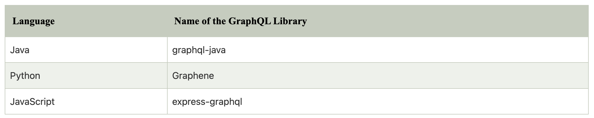

# GraphQL Interview Questions

---

1. What is GraphQL?
   + GraphQL is a new API standard designed and developed by Facebook. It is an open-source server-side technology that is now maintained by a large community of companies and individuals worldwide. It is also an execution engine that works as a data query language and used to fetch declarative data.

2. What was the reason behind the development of GraphQL?
   + GraphQL was initially developed by Facebook as an internal solution for their mobile apps. It was designed to optimize RESTful API calls and provide a flexible, robust, and efficient alternative to REST. It is not a replacement for REST. It is an alternative to writing APIs using REST.

3. What are the top companies that use GraphQL?
   + There are many big organizations such as Facebook, Github, Pinterest, Intuit, coursera, shopify, dailymotion, yelp etc. that uses GraphQL.
   + Actually GraphQL was designed and developed by Facebook itself.

4. How GraphQL utilizes the data loading process?
   + When the users fetch the data in GraphQL, it retrieves only the minimum amount of data that is required by the client. Even if the object model contains a lot of fields, the client can request only the required fields.

5. Is GraphQL a Database Technology?
   + No. GraphQL is not a Database Technology. People confuse GraphQL being a database technology, but this is not true. GraphQL is data query and manipulation language for APIs - not databases. It is also a server-side runtime for executing queries when you define a type system for your data. Unlike the REST APIs, a GraphQL server provides only a single endpoint and responds with the precise data that a client asked for.
   + You can say that GraphQL is database agnostic, and it can be used with any database. It can also be used without any database.

6. Is GraphQL only suitable for React / JavaScript Developers?
   + No. It is not right to say that GraphQL is only for React or JavaScript Developers. GraphQL is a cross-platform, open-source, data query, and manipulation language for APIs technology, so it can be used in any scenario where an API technology is required.
   + On the backend, the GraphQL servers are available for multiple languages such as Java, Python, .NET, C#, PHP, R, Haskell, JavaScript, Perl, Ruby, Scala, Go, Elixir, Erlang, and Clojure, etc. So, it can be implemented with any programming language and framework to build a web server.

7. What are the reasons behind using GraphQL while we already had an API named REST?
   + This question often comes in mind that what are the reasons behind using GraphQL while we already had an API named REST. Yes, we already had an API called REST for data communication, which follows a clear and well-structured resource-oriented approach. It also provides some great ideas such as stateless servers, structured access to resources, etc. But, REST is not so flexible to cope up with the rapidly changing requirements of the clients. In that case, when the data gets more complex, the routes get longer. Sometimes, it is challenging to fetch the data with a single request. That's why Facebook takes a step to develop a new API technology named GraphQL to cope up with the REST's limitations.

8. How GraphQL facilitate developers to choose protocols other than HTTP to implement your server?
   + The GraphQL API is usually operated over HTTP, and it is a transport layer agnostic technology, so you can choose protocols other than HTTP to implement your server.

9.  What is Authentication and Authorization in GraphQL?
    + Authentication and AuthorizationAuthorization are the processes used in services. Sometimes people get confused in these two terms and exchange their definitions for each other.
      + `Authentication`: Authentication is a process that is used to claim an identity. Authentication is done when you want to log in to a service with a username and password. Here, you have to authenticate yourself. In GraphQL, Authentication can be implemented with common patterns such as OAuth. OAuth is an open protocol that is used to allow secure AuthorizationAuthorization in a simple and standard method from web, mobile, and desktop applications.
      + `Authorization`: On the other hand, AuthorizationAuthorization is a process that is used to give permission rules that specify the access rights of individual users and user groups to certain parts of the system. For authorization implementation in GraphQL, it is recommended to delegate any data access logic to the business logic layer and not handle it directly.

10. How to do Error Handling in GraphQL?
    + It is easy to see the error in GraphQL. A successful GraphQL query is supposed to return a JSON object with a root field called "data." If your request query fails or partially fails, you will see a second root field called "errors" in the response. See the below example:
      ```
      {
        "data": { ... },
        "errors": [ ... ]
      }
      ```

11. How to do Server-side Caching in GraphQL? How is it different from REST?
    + The biggest concern with GraphQL technology is that it is difficult to maintain the server-side cache compared to the REST. In REST API, we can easily cache data for each endpoint. This is because the structure of the data does not change. On the other hand, in GraphQL API, it's not clear what the client will request next, so it does not matter to put a caching layer right behind the API. That's why doing Server-side Caching difficult in GraphQL.

12. What type of response you get after a GraphQL query?
    + In GraphQL, when a client requests a query, the server returns the JSON format response. The response returned by the server is based on the query the client uses for the request.

13. What is Over-fetching in GraphQL?
    + Over-fetching is a response where the client gets too much data or extra data for an API request. In over-fetching, you have a lot of additional data in the response you don't use. Over-fetching unnecessarily increases the payload size.

14. What is Under-fetching in GraphQL?
    + Under-fetching is a response where the client doesn't get enough data. The under-fetching response doesn't have enough data with a call to an endpoint, so you have to call a second endpoint to fulfill your request or multiple API calls to fetch the complete data.

15. How GraphQL fixes the issues of Over-Fetching or Under-fetching?
    + Over-Fetching and Under-fetching both are the performance issues that can be solved by using GraphQL. You won't see these problems if you have precisely the right endpoints to give your products exactly the correct data. These problems occur when you have to maintain multiple endpoints to get the exact right data. It has increased the data load, which finally results in a performance issue.
    + GraphQL resolves this issue because it facilitates you to request the specific data which you want from the server. Here, you can specify what you need in a single request and get the exact result that you need in just one response from the server.

16. What are the most significant advantages of using GraphQL over REST?
    + There is only one endpoint in GraphQL, but REST has multiple endpoints. That's why GraphQL is more cost-effective than REST. You don't have to use your resources for various endpoints.
    + In REST API, you have to use multiple requests to retrieve a complex data-set, but in GraphQL, you can execute a complex query easily in just a single request.
    + You can change the request data format in GraphQL, but it is not possible to do the same in REST.
    + The development speed in GraphQL is faster than REST.
    + GraphQL provides high consistency across all platforms, while In REST, it is hard to get consistency across all platforms.
    + GraphQL doesn't support an automatic caching system, while REST uses caching automatically.

17. Is REST also a query language like GraphQL?
    + No. REST is not a query language like GraphQL. It is a web service API.

18. Is it true that we can use GraphQl only with the SQL database?
    + No. GraphQL is a query language for APIs that can be used with any SQL or NoSQL databases.

19. What is SDL, and what is the use of it?
    + SDL is an acronym that stands for Schema Definition Language. It is used for writing schemas. SDL is the language that is used to write GraphQL schemas.

20. Can GraphQL API be used to handle offline usage?
    + GraphQL is a query language for web APIs that is designed only to work online. The caching abilities of some GraphQL libraries such as Relay and Apollo can be used for some cases, but there is not any proper offline solution developed or available yet.

21. What do you know about GraphiQL?
    + GraphiQL is used to provide UI representation for GraphQL. It is an in-browser IDE used to explore GraphQL and make GraphQl usage easy. GraphQL supports real-time error highlighting, so you can see and handle errors easily.

22. Does GraphQL support server-side caching like REST?
    + No. GraphQL doesn't support server-side caching like REST.

23. What are the main operations that GraphQL supports?
    + GraphQL supports three types of operations: query, mutation, and subscription. The query is used for the request, and it is a read operation, the mutation is used for write operations, and subscription is used for listening for any data changes. The server sends a notification message to the client after any data changes, if the client is subscribed to that event.

24. Can queries be used to modify data?
    + Yes. Queries can be used to modify server-side data. But according to the conventional method, it is the best practice to use mutation for any write operation.

25. What is Apollo in GraphQL?
    + Apollo is a platform for the implementation of GraphQL. As we know that GraphQL is a query language, so in order to use this query language easily, we need a platform, Apollo provides that platform.
    + Apollo provides two open-sourced libraries to create client and server. Here, the client is used to fetch data from a GraphQL server, and the server is used to create an API for GraphQL client.

26. What do you know by Mutation in GraphQL?
    + Mutation is one of the most important operations in GraphQL. It is used for write operation when you want to add delete and edit data.

27. What is subscription in GraphQL?
    + In GraphQL, the subscription is used for listening for any data changes. The server sends a notification message to the client after any data changes, if the client is subscribed to that event.

28. What do you mean by a Query in GraphQL?
    + A GraphQL query is used to read data. It is similar to the GET request we use in REST APIs. The GraphQL queries are used to retrieve data from the GraphQL server.

29. What do you know by Fields in GraphQL?
    + The keys of an object that are used in the GraphQL query are known as Fields.
      ```
      {
        employee {
          name
          salary
        }
      }
      ```
      + In the above query, 'name' and 'salary' are fields.

30. What is the use of object types in GraphQL?
    + The resources that are accessed by a client is called Objects. Objects can contain a list of GraphQL fields.

31. What is the use of an interface in GraphQL?
    + In GraphQL, an interface is used to list down the common fields of a GraphQL object. Other objects can use this interface to inherit properties.

32. What is the union in GraphQL?
    + In GraphQL, sometimes we have to represent multiple objects, that's why the union is used. The user can define more than one type as return type using a union.

33. What is the use of Enums in GraphQL?
    + The enum or enumeration type in GraphQL is a special kind of scalar used to define a type, including a list of allowed values.

34. What is the use of resolver in GraphQL?
    + In GraphQL, a resolver is used to handle queries and produce a response to the GraphQL query.

35. What do you know by arguments in GraphQL?
    + The arguments are used in GraphQL Queries and Fields when we want to request specific data.
      ```
      {
        employee(id: "001"){
          name
          salary
        }
      }
      ```
      + In the above query, the 'id' is an argument passed to return the 'name' and 'salary' of 'employee' where we want a specific data with 'id' equals to '001'.

36. What do you know by a non-null type modifier in GraphQL?
    + In GraphQL, a non-null type modifier is used to specify an argument as non-null value. If you pass null for a non-null argument, the GraphQL server will send a validation error. The exclamation mark "!" is used to mark an argument as non-null.

37. What do you mean by aliases in GraphQL?
    + In GraphQL, the alias is used to change the field name of the query. It facilitates you to rename the result of a field according to yourself.
      ```
      {
      classA : employee(id : String){
      name
      }
      classB : employee(id: String){
      name
      }
      }
      ```
      + In the above query, we have used an alias to use a different name for two 'employees.' Without alias, you will get an error in the result.

38. What do you understand by Fragment in GraphQL?
    + In GraphQL, the fragment is used when the query is very large, and your query contains the reusable units. You can create a fragment by taking the reusable part and use that fragment in the query. The fragment concept was designed to arrange the code in a simple way and avoid duplicate code.

39. What do you understand by GraphQL Voyager?
    + GraphQL Voyager is an open-sourced library used to represent any GraphQL API to an interactive graph.

40. What is the use of the validation step in GraphQL?
    + The validation step is a crucial step in GraphQL. It is used to check whether a GraphQL query is in a valid format or not. If it gets that the query is invalid, it informs on the client-side before the runtime check.

41. What is the use of the execution step in GraphQL?
    + The execution step is used to execute a query in GraphQL. This step comes and executes after the validation step.

42. What is the name of the GraphQL library for Java, Python, and JavaScript?


43.  How can you host a GraphQL server online?
     + You can use any programming language such as Node.js or Python to create a GraphQL server and host it the same as any other servers.

44. What do you know about the Remote Schemas in Apollo GraphQL?
    + The Remote schemas are used to create GraphQL schema objects that delete to a separate remote server.

45. What is the use of Schema stitching in Apollo?
    + Schema stitching is used to merge or combine multiple GraphQL APIs into a single API.
