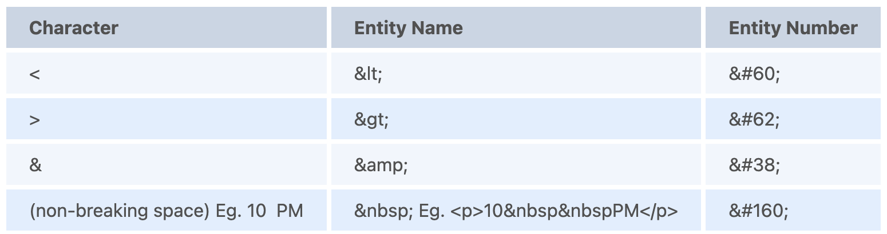
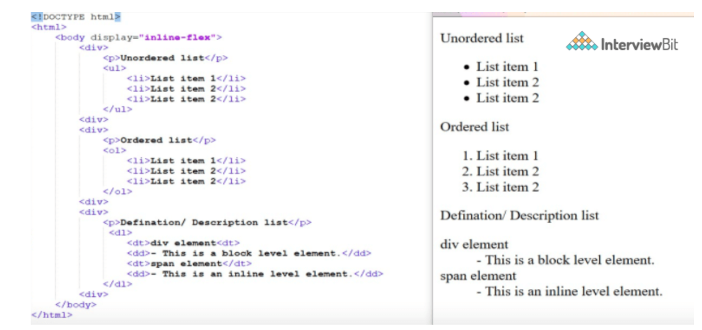
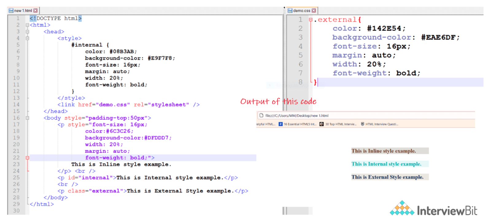
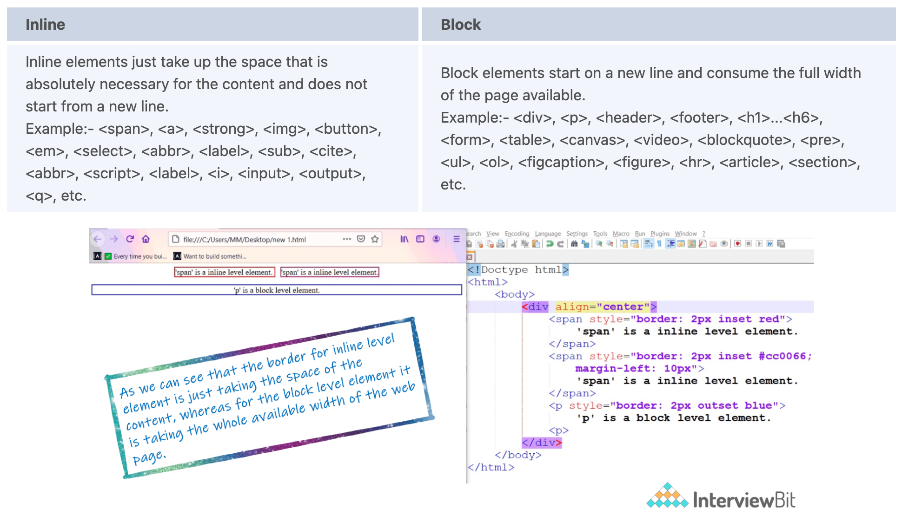
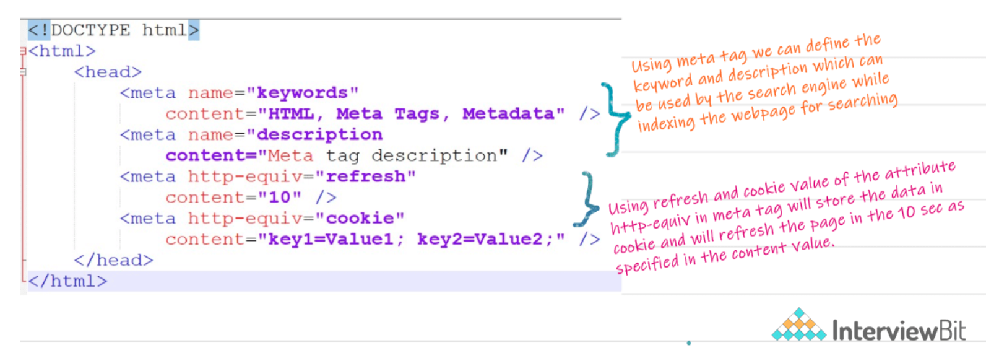
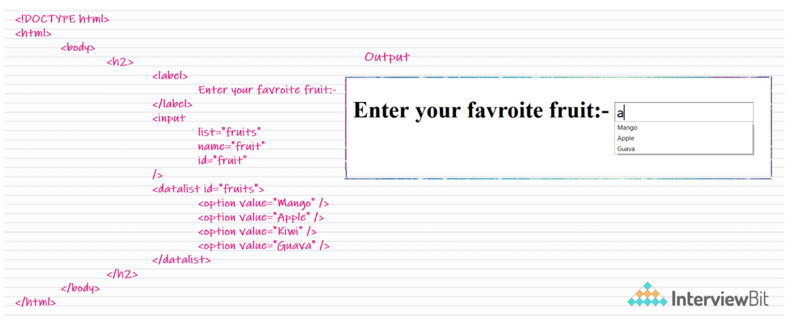
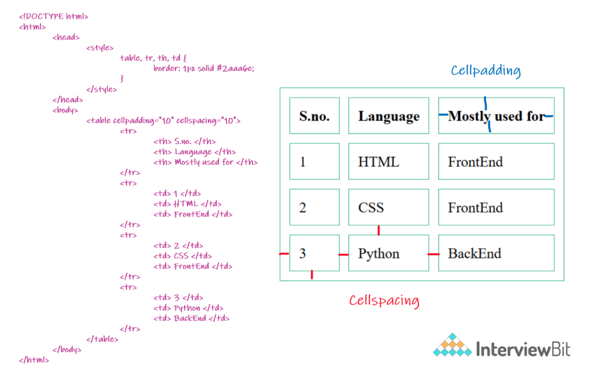
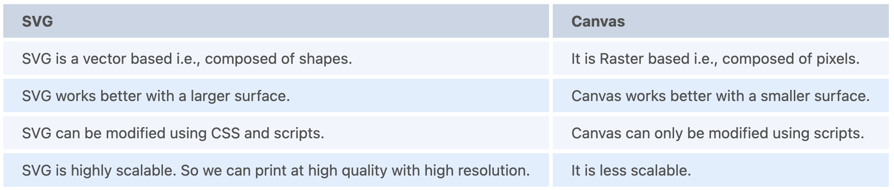
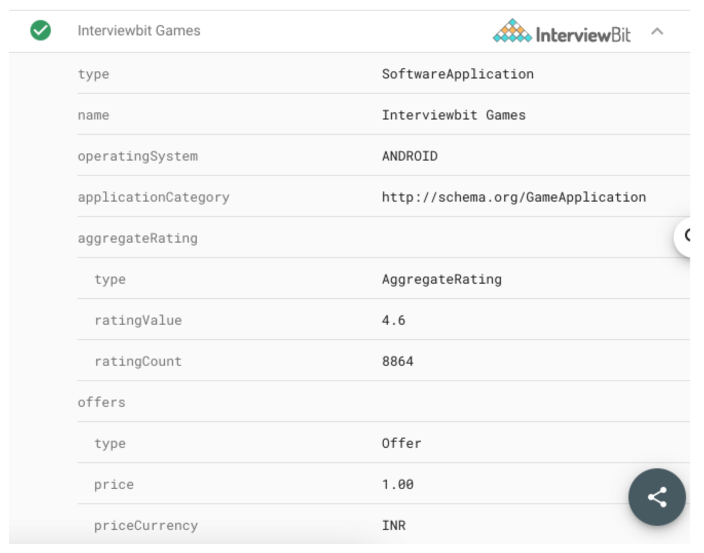
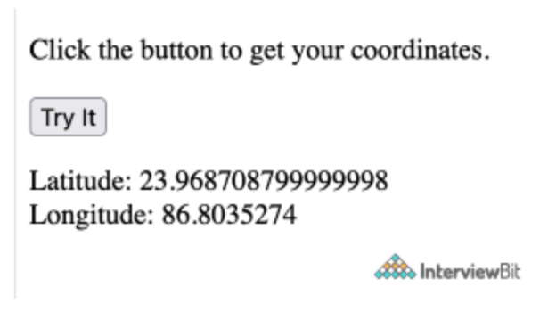

# HyperText Markup Language (HTML) Interview Questions

---

1. Are the HTML tags and elements the same thing?
   + No. HTML elements are defined by a starting tag, may contain some content and a closing tag.For example, `<h1>Heading 1</h1>` is a HTML element but just `<h1>` is a starting tag and `</h1>` is a closing tag

2. What are tags and attributes in HTML?
   + `Tags`: the primary component of the HTML that defines how the content will be structured/formatted
   + `Attributes`: used along with the HTML tags to define the characteristics of the element. For example, `<p align=” center”>Interview questions</p>`, in this the ‘align’ is the attribute using which we will align the paragraph to show in the center of the view.

3. What are void elements in HTML?
   + `Void Elements`: HTML elements which do not have closing tags or do not need to be closed. For Example `<br />`, ``, `<hr />`, etc.

4. What is the advantage of collapsing white space?
   + In HTML, a blank sequence of whitespace characters is treated as a single space character, Because the browser collapses multiple spaces into a single space character and this helps a developer to indent lines of text without worrying about multiple spaces and maintain readability and understandability of HTML codes.

5. What are HTML Entities?
   + In HTML some characters are reserved like `<`, `>`, `/`, etc. To use these characters in our webpage we need to use the character entities called HTML Entities. Below are a few mapping between the reserved character and its respective entity character to be used.
   

6. What are different types of lists in HTML?
   + `Ordered`: `<li></li>`
   + `Unordered`: `<ul></ul>`
   

7. What is the ‘class’ attribute in HTML?
   + `Class attribute`: used to specify the class name for an HTML element. Multiple elements in HTML can have the same class value. Also, it is mainly used to associate the styles written in the stylesheet with the HTML elements.

8. What is the difference between the ‘id’ attribute and the ‘class’ attribute of HTML elements?
   + `Class Value`: multiple elements in HTML can have the same class value.
   + `id`: attribute of one element cannot be associated with another HTML element.

9.  Define multipart form data?
    + `Multipart form data`: one of the values of the enctype attribute. It is used to send the file data to the server-side for processing. The other valid values of the enctype attribute are text/plain and application/x-www-form-urlencoded.

10. Describe HTML layout structure.
    + Every web page has different components to display the intended content and a specific UI. But still, there are few things which are templated and are globally accepted way to structure the web page, such as:
      + `<header>`: starting information about the web page.
      + `<footer>`: the last section of the page.
      + `<nav>`: the navigation menu of the HTML page.
      + `<article>`: a set of information.
      + `<section>`: used inside the article block to define the basic structure of a page.
      + `<aside>`: sidebar content of the page.

11.  How to optimize website assets loading?
     + `Content Delivery Network (CDN)`: geographically distributed servers to help reduce latency.
     + `File compression`: helps to reduce the size of an asset to reduce the data transfer.
     + `File concatenation`: reduces the number of HTTP calls.
     + `Minify scripts`: reduces the overall file size of js and CSS files.
     + `Parallel downloads`: Hosting assets in multiple subdomains can help to bypass the download limit of 6 assets per domain of all modern browsers. This can be configured but most general users never modify these settings.
     + `Lazy Loading`: instead of loading all the assets at once, the non-critical assets can be loaded on a need basis.

12. What are the various formatting tags in HTML?
    + `<b>`: makes text bold
    + `<i>`: makes text italic
    + `<em>`: makes text italic but with added semantics importance
    + `<big>`: increases the font size of the text by one unit
    + `<small>`: decreases the font size of the text by one unit
    + `<sub>`: makes the text a subscript
    + `<sup>`: makes the text a superscript
    + `<del>`: displays as strike out text
    + `<strong>`: marks the text as important
    + `<mark>`: highlights the text
    + `<ins>`: displays as added text

13. What are the different kinds of Doctypes available?
    + Strict Doctype
    + Transitional Doctype
    + Frameset Doctype

14. Please explain how to indicate the character set being used by a document in HTML?
    + ```
      <!DOCTYPE html>
      <html>
      <head>
        <meta charset="UTF-8">
        ...
        ...
      </head>
      ...
      </html>
      ```

15. What is the difference between `<strong>`, `<b>` tags and `<em>`, `<i>` tags?
    + The effect on a normal webpage of the tags `<strong>`, `<b>`  and `<em>`, `<i>` is the same. `<b>` and `<i>` tags stands for bold and italic. These two tags only apply font styling and bold tag `<b>`, just adds more ink to the text, these tags don't say anything about the text.
    + Whereas, `<strong>` and `<em>` tags represent that the span of text is of strong importance or more importance and emphatic stress respectively than the rest of the text. These tags have semantic meaning.

16. What is the significance of `<head>` and `<body>` tag in HTML?
    + `<head>`: provides the information about the document. It should always be enclosed in the `<html>` tag. This tag contains the metadata about the webpage and the tags which are enclosed by head tag like `<link>`, `<meta>`, `<style>`, `<script>`, etc. are not displayed on the web page. Also, there can be only 1 `<head>` tag in the entire Html document and will always be before the `<body>` tag.
    + `<body>`: defines the body of the HTML document. It should always be enclosed in the `<html>` tag. All the contents which needs to be displayed on the web page like images, text, audio, video, contents, using elements like `<p>`, ``, `<audio>`, `<heading>`, `<video>`, `<div>`, etc. will always be enclosed by the `<body>` tag. Also, there can be only 1 body element in an HTML document and will always be after the `<head>` tag.

17. Can we display a web page inside a web page or Is nesting of webpages possible?
    + Yes, we can display a web page inside another HTML web page. HTML provides a tag `<iframe>` using which we can achieve this functionality.
    + `<iframe src=”url of the web page to embed” />`

18. How is Cell Padding different from Cell Spacing?
    + `Cell Spacing`: the space or gap between two consecutive cells.
    + `Cell Padding`: the space or gap between the text/ content of the cell and the edge/ border of the cell. Please refer to the above figure example to find the difference.

19. How can we club two or more rows or columns into a single row or column in an HTML table?
    + HTML provides two table attributes “rowspan” and “colspan” to make a cell span to multiple rows and columns respectively.

20. Is it possible to change an inline element into a block level element?
    + Yes, it is possible using the “display” property with its value as “block”, to change the inline element into a block-level element.

21. In how many ways can we position an HTML element? Or what are the permissible values of the position attribute?
    + `static`: Default value. Here the element is positioned according to the normal flow of the document.
    + `absolute`: element is positioned relative to its parent element. The final position is determined by the values of left, right, top, bottom.
    + `fixed`: similar to absolute except here the elements are positioned relative to the `<html>` element.
    + `relative`: element is positioned according to the normal flow of the document and positioned relative to its original/ normal position.
    + `initial`: resets the property to its default value.
    + `inherit`: element inherits or takes the property of its parent.

22. In how many ways you can display HTML elements?
    + `inline`: display any block-level element as an inline element. The height and width attribute values of the element will not affect.
    + `block`: display any inline element as a block-level element.
    + `inline-block`: similar to inline, except by using the display as inline-block, we can actually format the element using height and width values.
    + `flex`: displays the container and element as a flexible structure. It follows flexbox property.
    + `inline-flex`: displays the flex container as an inline element while its content follows the flexbox properties.
    + `grid`: displays the HTML elements as a grid container.
    + `none`: we can hide the HTML element.

23. What is the difference between “display: none” and “visibility: hidden”, when used as attributes to the HTML element.
    + `visibility: hidden`: element will be hidden from the webpage but still takes up space.
    + `display: none`: element will be hidden, and also it won’t take up any space on the webpage.

24. How to specify the link in HTML and explain the target attribute?
    + HTML provides a hyperlink (`<a>`) tag to specify the links in a webpage.
    + `href`: attribute is used to specify the link and the ‘target’ attribute is used to specify, where do we want to open the linked document. The ‘target’ attribute can have the following values:
      + `_self`: a default value. It opens the document in the same window or tab as it was clicked.
      + `_blank`: opens the document in a new window or tab.
      + `_parent`: opens the document in a parent frame.
      + `_top`: opens the document in a full-body window.

25. In how many ways can we specify the CSS styles for the HTML element?
    + There are three ways in which we can specify the styles for HTML elements:
      + `Inline`: ‘style’ attribute inside the HTML element.
      + `Internal`: `<style>` tag inside the `<head>` tag. To apply the style we bind the elements using ‘id’ or ‘class’ attributes.
      + `External`: `<link>` tag inside `<head>` tag to reference the CSS file into our HTML code. Again the binding between elements and styles is done using ‘id’ or ‘class’ attributes.
    

26. Difference between link tag `<link>` and anchor tag `<a>`?
    + `anchor tag (<a>)`: used to create a hyperlink to another webpage or to a certain part of the webpage and these links are clickable.
    + `link tag <link>`: defines a link between a document and an external resource and these are not clickable.

27. How do you include JavaScript code in HTML?
    + HTML provides a `<script>` tag using which we can run the javascript code and make our HTML page more dynamic.
    + ```
      <!DOCTYPE html>
      <html>
        <body>
          <h1>
            <span>This is a demo for </span>
            <u><span id="demo"></span></u>
        </h1>
        <script>
            document.getElementById("demo").innerHTML = "script Tag"
        </script>
        </body>
      </html>
      ```

28. When do you use scripts in the head and when to use scripts in the body?
    + If the scripts contain some event-triggered functions or jquery library then we should use them in the head section. If the script writes the content on the page or is not inside a function then it should be placed inside the body section at the bottom. In short, follow below three points:
      + Place library scripts or event scripts in the head section.
      + Place normal scripts that do not write anything on the page, in the head section until there is any performance issue.
      + Place scripts that render something on the web page at the bottom of the body section.

29. What are forms and how to create forms in HTML?
    + `Form`: used to collect the user inputs. HTML provides a `<form>` tag to create forms. To take input from the user we use the `<input>` tag inside the form so that all collected user data can be sent to the server for processing. There are different input types like:
      + button
      + checkbox
      + number
      + text
      + password
      + submit, etc.
      + ```
          <form action="/submit_data.php">
            <label>Enter your name: </label>
            <input type="text" name="name" />
            <label>Enter Mobile number </label>
            <input type="number" name="mobile_no"/>
            <input type="submit" value="Submit">
          </form>
        ```

30. How do you handle events in HTML?
    + HTML allows event trigger actions in browsers using javascript or JQuery. There are a lot of events like ‘onclick’, ‘ondrag’, ‘onchange’, etc.
    + ```
      <!DOCTYPE html>
      <html>
        <body style="padding-top:50px">
            <h3 id="event_demo">0</h3>
            <input type="button" onclick="myFunction()" value="Click Me" />
            <input type="reset" onclick="reset()" value="Reset" />
        </body>

        <script>
            function myFunction() {
                var value = document.getElementById("event_demo").innerHTML
                value = parseInt(value) + 1;
                document.getElementById("event_demo").innerHTML = value;
            }
            function reset() {
                document.getElementById("event_demo").innerHTML = 0;
            }
        </script>
      </html>
      ```

31. What are some of the advantages of HTML5 over its previous versions?
    + Multimedia Support.
    + Capabilities to store offline data using SQL databases and application cache.
    + Javascript can be run in the background.
    + allows users to draw various shapes like rectangles, circles, triangles, etc.
    + New Semantic tags and form control tags.

32. How can we include audio or video in a webpage?
    + HTML5 provides two tags: `<audio>` and `<video>` tags using which we can add the audio or video directly in the webpage.

33. Inline and block elements in HTML5?
  

34. What is the difference between `<figure>` tag and `` tag?
    + `<figure>`: specifies the self-contained content, like diagrams, images, code snippets, etc. `<figure>` tag is used to semantically organize the contents of an image like image, image caption, etc.
    + ``: used to embed the picture in the HTML5 document.

35. How to specify the metadata in HTML5?
    + `<meta>`: to specify metadata, which is a void tag,i.e., it does not have a closing tag. Some of the attributes used with meta tags are name, content, http-equiv, etc. The below image tells how to specify the metadata.
    

36. Is the `<datalist>` tag and `<select>` tag same?
    + No. The `<datalist>` tag and `<select>` tag are different.
      + `<select>`: a user will have to choose from a list of options
      + `<datalist>`: when used along with the `<input>` tag provides a suggestion that the user selects one of the options given or can enter some entirely different value.
    

37. Define Image Map?
    + `Image Map`: lets a developer map/link different parts of images with the different web pages. It can be achieved by the `<map>` tag in HTML5, using which we can link images with clickable areas.
      + ```
          
          <map  name=”workspace”>
              <area shape=”rect”  coords=”34, 44, 270, 350” ,  href=”xyz.html” />
              <area shape=”rect”  coords=”10, 120, 250, 360” ,  href=”xyz.html” />
          </map>
        ```

38. What are Semantic Elements?
    + `Semantic Elements`: those which describe the particular meaning to the browser and the developer. Elements like `<form>`, `<table>`, `<article>`, `<figure>`, etc., are semantic elements.

39. Convert the below data into Tabular format in HTML5?
    

40. What is the difference between `<meter>` tag and `<progress>` tag?
    + `<progress>`: tag should be used when we want to show the completion progress of a task.
    + `<meter>`: if we just want a scalar measurement within a known range or fraction value. Also, we can specify multiple extra attributes for `<meter>` tags like ‘form’, ‘low’, ‘high’, ‘min’, etc.

41. Is drag and drop possible using HTML5 and how?
    + Yes, in HTML5 we can drag and drop an element. This can be achieved using the drag and drop-related events to be used with the element which we want to drag and drop.

42. Difference between SVG and Canvas HTML5 element?
    

43. What type of audio files can be played using HTML5?
    + Mp3
    + WAV
    + Ogg

44. What are the significant goals of the HTML5 specification?
    + Introduction of new element tags to better structure the web page such as `<header>` tag.
    + Forming a standard in cross-browser behavior and support for different devices and platforms
    + Backward compatible with the older version HTML web pages
    + Introduction of basic interactive elements without the dependency of plugins such as `<video>` tag instead of the flash plugin.

45. Explain the concept of web storage in HTML5.
    + `Web Storage`: helps in storing some of the static data in the local storage of the browser so that we do not need to fetch it from the server every time we need it. There is a size limit based on different browsers. This helps in decreasing the load time and a smooth user experience. There are two types of web storage that are used to store data locally in HTML5:
      + `Local Storage`: helps in storing data that will be retained even though the user reopens the browser. It is stored for each webapp on different browsers.
      + `Session Storage`: used for one session only. After the user closes the browser this gets deleted.

46. What is Microdata in HTML5?
    + `Microdata`: used to help extract data for site crawlers and search engines. It is basically a group of name-value pairs. The groups are called items, and each name-value pair is a property. Most of the search engines like Google, Microsoft, Yandex, etc follow schema.org vocabulary to extract this microdata.
      ```
      <div itemscope itemtype="http://schema.org/SoftwareApplication">
      <span itemprop="name">Interviewbit Games</span> -
      REQUIRES <span itemprop="operatingSystem">ANDROID</span><br>
      <link itemprop="applicationCategory" href="http://schema.org/GameApplication"/>
      <div itemprop="aggregateRating" itemscope itemtype="http://schema.org/AggregateRating">
      RATING:
      <span itemprop="ratingValue">4.6</span> (
      <span itemprop="ratingCount">8864</span> ratings )
      </div>
      <div itemprop="offers" itemscope itemtype="http://schema.org/Offer">
      Price: Rs.<span itemprop="price">1.00</span>
      <meta itemprop="priceCurrency" content="INR" />
      </div>
      </div>
      ```
      + `itemid`: unique, global identifier of an item.
      + `itemprop`: add properties to an item.
      + `itemref`: provides a list of element ids with additional properties.
      + `itemscope`: defines the scope of the itemtype associated with it.
      + `itemtype`: specifies the URL of the vocabulary that will be used to define itemprop.
    

47. Which tag is used for representing the result of a calculation? Explain its attributes.
    + `<output>`: tag  used for representing the result of a calculation. It has the following attributes:
      + `for`: defines the relationship between the elements used in calculation and result.
      + `form`: used to define the form the output element belongs to.
      + `name`: the name of the output element.
      ```
      <form oninput = "result.value=parseInt(n1.value)+parseInt(n2.value)">
          <input type = "number" name = "n1" value = "1" /> +
          <input type = "number" name = "n2" value = "2" /><br />
          The output is: <output name = "result"></output>
      </form>
      ```

48. What is new about the relationship between the `<header>` and `<h1>` tags in HTML5?
    + `<header>`: tag specifies the header section of the webpage. Unlike in previous version there was one `<h1>` element for the entire webpage, now this is the header for one section such as `<article>` or `<section>`. According to the HTML5 specification, each `<header>` element must at least have one `<h1>` tag.

49. Explain HTML5 Graphics.
      + `Canvas`: like drawing on a whitepaper or a blank webpage. We can add different graphic designs on web pages with available methods for drawing various geometrical shapes.
        + ```
          <!DOCTYPE HTML>
          <html>
          <head>
          </head>
          <body>
            <canvas width="300" height="100" style="border:2px solid;"></canvas>
          </body>
          </html>
          ```
      + `Scalable Vector Graphics (SVG)`: used mostly for diagrams or icons. It follows the XML format.
        + ```
          <!DOCTYPE html>
          <html>
          <body>
            <svg width="400" height="110">
              <rect width="300" height="100" style="fill:#FFF;stroke-width:2;stroke:#000" />
            </svg>
          </body>
          </html>
          ```

50. Explain new input types provided by HTML5 for forms?
    + `Date`: Only select date by using type = "date"
    + `Week`: Pick a week by using type = "week"
    + `Month`: Only select month by using type = "month"
    + `Time`: Only select time by using type = "time".
    + `Datetime`: Combination of date and time by using type = "datetime"
    + `Datetime-local`: Combination of date and time by using type = "datetime-local." but ignoring the timezone
    + `Color`: Accepts multiple colors using type = "color"
    + `Email`: Accepts one or more email addresses using type = "email"
    + `Number`: Accepts a numerical value with additional checks like min and max using type = "number"
    + `Search`: Allows searching queries by inputting text using type = "search"
    + `Tel`: Allows different phone numbers by using type = "tel"
    + `Placeholder`: To display a short hint in the input fields before entering a value using type = "placeholder"
    + `Range`: Accepts a numerical value within a specific range using type = "range"
    + `Url`: Accepts a web address using type = "url”
    + ```
        <form>
          <div>
            <label>Date:</label>
            <input type="date" id="date" />
            <br>
            <label>Week:</label>
            <input type="week" id="week" />
            <br>
            <label>Month:</label>
            <input type="month" id="month" />
            <br>
            <label>Time:</label>
            <input type="time" id="time" />
            <br>
            <label>Datetime:</label>
            <input type="datetime" id="datetime" />
            <br>
            <label>Datetime Local:</label>
            <input type="datetime-local" id="datetime-local" />
            <br>
            <label>Color:</label>
            <input type="color" id="color"/>
            <br>
            <label>Email:</label>
            <input type="email" id="email" placeholder="email address" />
            <br>
            <label>Number:</label>
            <input type="number" id="number" />
            <br>
            <label>Search:</label>
            <input type="search" id="search" />
            <br>
            <label>Phone:</label>
            <input type="tel" id="phone" placeholder="Phone Number" pattern="\d{10}$" />
            <br>
            <label>Range:</label>
            <input type="range" id="range" />
            <br>
            <label>URL:</label>
            <input type="url" id="url"/>
          </div>
        </form>
      ```

51. What are the New tags in Media Elements in HTML5?
    + `<audio>`: Used for sounds, audio streams, or music, embed audio content without any additional plug-in.
    + `<video>`: Used for video streams, embed video content etc.
    + `<source>`: Used for multiple media resources in media elements, such as audio, video, etc.
    + `<embed>`: Used for an external application or embedded content.
    + `<track>`: Used for subtitles in the media elements such as video or audio.
    + ```
      <label>
            Video:
        </label>
          <video width="320" height="240" controls>
              <source src="video.mp4" type="video/mp4">
              <track src="subtitles.vtt" kind="subtitles" srclang="en" label="English">
          </video>
          <br>
          <label>
              Embed:
          </label>
          <embed type="video/webm" src="https://www.youtube.com/embed/MpoE6s2psCw" width="400" height="300">
          <br>
          <label>
              Audio:
          </label>
          <audio controls>
              <source src="audio.mp3" type="audio/mpeg">
          </audio>
      ```

52. Why do you think the addition of drag-and-drop functionality in HTML5 is important? How will you make an image draggable in HTML5?
    + The drag and drop functionality is a very intuitive way to select local files. This is similar to what most of the OS have copy functionality thus making it very easy for the user to comprehend. Before the native drag and drop API, this was achievable by writing complex Javascript programming or external frameworks like jQuery.
    + To enable this functionality there is a draggable attribute in the `` tag and need to set ondrop and ondragover attribute to an eventhandler available in scripts.
    + ```
      <!DOCTYPE HTML>
      <html>
      <head>
        <script>
          function allowDrop(ev) {
            ev.preventDefault();
          }
          function drop(ev) {
            ...
          }
        </script>
      </head>
      <body>
        ...
        <div id="div1" ondrop="drop(event)" ondragover="allowDrop(event)" style="border: 1px solid #aaaaaa; width:350px; height: 70px;"></div>
        <br>
        
          ...
      </body>
      </html>
      ```
    

53. Why do we need the Mathematical Markup Language (MathML) element in HTML5?
    + Mathematical Markup Language (MathML): used for displaying mathematical expressions on web pages. For this `<math>` tag is used.
    + ```
      <!DOCTYPE HTML>
      <html>
      <head>
      </head>
      <body>
      <math>
        <mrow>
          <mrow>
            <msup>
              <mi> a </mi>
              <mn> 2 </mn>
            </msup>
            <mo> + </mo>
            <msup>
              <mi> b </mi>
              <mn> 2 </mn>
            </msup>
            <mo> + </mo>
            <mn> 2 </mn>
            <mn> a </mn>
            <mn> b </mn>
          </mrow>
          <mo> = </mo>
          <mn> 0 </mn>
        </mrow>
      </math>
      </body>
      </html>
      ```
      + This displays the equation `a2 + b2 + 2ab = 0`.

54. What are the server-sent events in HTML5?
    + `Server-Sent Events`: events pushed from the webserver to the browsers. DOM elements can be continuously updated using these events. This has a major advantage over straight-up polling. In polling, there is a lot of overhead since every time it is establishing an HTTP connection and tearing it down whereas, in server-sent events, there is one long-lived HTTP connection. To use a server-sent event, `<eventsource>` element is used. The src attribute of this element specifies the URL from which sends a data stream having the events.
    + `<eventsource src = "/cgi-bin/myfile.cgi" />`

55. What are Web Workers?
    + Web Workers: added to bring parallelism and async capability. It runs in the background to do the computationally expensive tasks without yielding to make the page responsive. It is achieved by starting a separate thread for such tasks. These are not meant to perform UI operations. There are three types of web workers:
      + `Dedicated Workers`: utilized by a single script.
      + `Shared Workers`: utilized by multiple scripts running in different windows, IFrames, etc.
      + `Service Workers`: proxy servers between web applications, the browser, and the network. Mostly used for push notifications and sync APIs.
    + ```
      <p>Count numbers: <output id="result"></output></p>
      <button onclick="startWorker()">Start Worker</button>
      <button onclick="stopWorker()">Stop Worker</button>
      <script>
        var w;
        function startWorker() {
            if(typeof(Worker) !== "undefined") {
            if(typeof(w) == "undefined") {
              w = new Worker("demo_workers.js");
            }
            w.onmessage = function(event) {
              document.getElementById("result").innerHTML = event.data;
            };
          }
        }
        function stopWorker() {
        w.terminate();
        w = undefined;
        }
      </script>
      ```

56. What is the usage of a novalidate attribute for the form tag that is introduced in HTML5?
    + `Novalidate attribute`: a boolean type that indicates whether or not the data being submitted by the form will be validated beforehand. By making this false, forms can be submitted without validation which helps users to resume later also.
    + ```
      <form action = "" method = "get" novalidate>
        Name:<br><input type="name" name="sname"><br>
        Doubt:<br><input type="number" name="doubt"><br>
        <input type="submit" value="Submit">
      </form>
      ```

57. What are raster images and vector images?
    + `Raster Images`: defined by the arrangement of pixels in a grid with exactly what color the pixel should be. Few raster file formats include PNG(.png), JPEG(.jpg), etc.
    + `Vector Images`: defined using algorithms with shape and path definitions that can be used to render the image on-screen written in a similar markup fashion. The file extension is .svg.

58. How do you support SVG in old browsers?
    + To support old browsers instead of defining the resource of svg in src attribute of `` tag, it should be defined in srcset attribute and in src the fallback png file should be defined.
    + ``

59. What are different approaches to make an image responsive?
    + `Art direction`: using `<picture>` element the landscape image fully shown in desktop layout can be zoomed in with the main subject in focus for a portrait layout.
    + ```
      <picture>
        <source media="(min-width: 650px)" srcset="img_cup.jpg">
        
      </picture>
      ```
    + `Resolution switching`: instead of zoom and crop the images can be scaled accordingly using vector graphics. Also, this can be further optimized to serve different pixel density screens as well.
      + ```
          <svg width="100" height="100">
            <circle cx="50" cy="50" r="40" stroke="green" stroke-width="4" fill="yellow" />
          </svg>
        ```

60. What is a manifest file in HTML5?
    + `Manifest File`: used to list down resources that can be cached. Browsers use this information to make the web page load faster than the first time. There are 3 sections in the manifest file
      + `CACHE Manifest`: Files needs to be cached
      + `Network`: File never to be cached, always need a network connection.
      + `Fallback`: Fallback files in case a page is inaccessible
    + ```
      CACHE MANIFEST
      # 2012-06-16 v1.0.0
      /style.css
      /logo.gif
      /main.js
      NETWORK:
      login.php
      FALLBACK:
      /html/ /offline.html
      ```
    + ```
      <!DOCTYPE HTML>
      <html manifest="tutorial.appcache">
      ...
      ...
      </html>
      ```

61. What is the Geolocation API in HTML5?
    + `Geolocation API`: used to share the physical location of the client with websites. This helps in serving locale-based content and a unique experience to the user, based on their location. This works with a new property of the global navigator object and most of the modern browsers support this.
    + `var geolocation = navigator.geolocation;`
    + ```
      <!DOCTYPE html>
      <html>
        <body>
          <p>Click "try it" button to get your coordinates.</p>
          <button onclick="getLocation()">Try It</button>
          <p id="demo"></p>
          <script>
              var x = document.getElementById("demo");

              function getLocation() {
                if (navigator.geolocation) {
                  navigator.geolocation.getCurrentPosition(showPosition);
                } else {
                  x.innerHTML = "Geolocation functionality is not supported by this browser.";
                }
              }

              function showPosition(position) {
                x.innerHTML = "Latitude: " + position.coords.latitude +
                "<br>Longitude: " + position.coords.longitude;
              }
          </script>
        </body>
      </html>
      ```
    
      + The above example asks for user permission for accessing the location data via geolocation API and after clicking the button the coordinates of the physical location of the client get displayed.

62. Explain Web Components and it’s usage.
    + `Web Components`: used to create reusable custom elements which are very difficult in traditional HTML. It consists of three technologies:
      + `Custom elements`: JavaScript APIs that help in defining custom elements and their behavior.
      + `Shadow DOM`: JavaScript APIs that attach an encapsulated shadow DOM tree to an element to keep the element’s features private and unaffected by other parts.
      + ```
          <!DOCTYPE html>
          <html>
          <head>
          <meta charset="utf-8">
          <title>composed and composedPath demo</title>
          <script src="main.js" defer></script>
          </head>
          <body>
          <h1><code>composed</code> and <code>composedPath</code> demo</h1>
          <open-shadow text="I have an open shadow root"></open-shadow>
          <closed-shadow text="I have a closed shadow root"></closed-shadow>
          </body>
          </html>
        ```
      + ```
        customElements.define('open-shadow',
        class extends HTMLElement {
          constructor() {
            super();
            const pElem = document.createElement('p');
            pElem.textContent = this.getAttribute('text');
            const shadowRoot = this.attachShadow({mode: 'open'});
            shadowRoot.appendChild(pElem);
          }
        }
        );
        customElements.define('closed-shadow',
        class extends HTMLElement {
          constructor() {
            super();
            const pElem = document.createElement('p');
            pElem.textContent = this.getAttribute('text');
            const shadowRoot = this.attachShadow({mode: 'closed'});
            shadowRoot.appendChild(pElem);
          }
        }
        );
        document.querySelector('html').addEventListener('click', e => {
        console.log(e.composed);
        console.log(e.composedPath());
        });
        ```
