# JavaScript Interview Questions

---

1. What are the different data types present in JavaScript?
   + To know the type of a JavaScript variable, we can use the typeof operator.
   + `Primitive types`: Primitive data types can store only a single value
     + `String`: It represents a series of characters and is written with quotes. A string can be represented using a single or a double quote.
     + `Number`: It represents a number and can be written with or without decimals.
     + `BigInt`: This data type is used to store numbers which are above the limitation of the Number data type. It can store large integers and is represented by adding “n” to an integer literal.
     + `Boolean`: It represents a logical entity and can have only two values: true or false. Booleans are generally used for conditional testing.
     + `Undefined`: When a variable is declared but not assigned, it has the value of undefined and it’s type is also undefined.
     + `Null`: It represents a non-existent or a invalid value.
     + `Symbol`: It is a new data type introduced in the ES6 version of JavaScript. It is used to store an anonymous and unique value.
   + `Non-primitive types`: To store multiple and complex values, non-primitive data types are used.
     + `Object`: Used to store collection of data.

2. Explain Hoisting in JavaScript.
   + `Hoisting`: is the default behaviour of JavaScript where all the variable and function declarations are moved on top.
   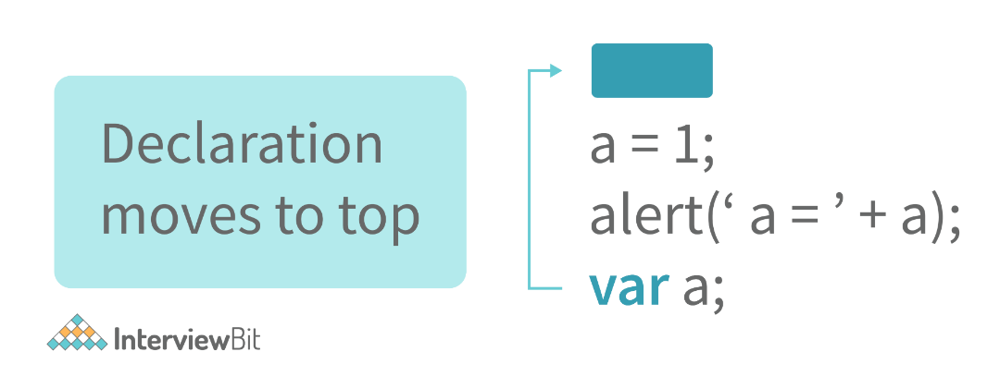
   + This means that irrespective of where the variables and functions are declared, they are moved on top of the scope. The scope can be both local and global.
     ```
     hoistedVariable = 3;
     console.log(hoistedVariable); // outputs 3 even when the variable is declared after it is initialized
     var hoistedVariable;
     ```
     ```
     hoistedFunction();  // Outputs " Hello world! " even when the function is declared after calling

     function hoistedFunction() {
       console.log(" Hello world! ");
     }
     ```

3. Why do we use the word “debugger” in JavaScript?
   + The debugger for the browser must be activated in order to debug the code. Built-in debuggers may be switched on and off, requiring the user to report faults. The remaining section of the code should stop execution before moving on to the next line while debugging.

4. Difference between  `==` and `===` operators.
   + Both are comparison operators. The difference between both the operators is that `==` is used to compare values whereas, `===` is used to compare both values and types.
     ```
     var x = 2;
     var y = "2";
     (x == y)  // Returns true since the value of both x and y is the same
     (x === y) // Returns false since the typeof x is "number" and typeof y is "string"
     ```

5. Difference between `var` and `let` keyword in JavaScript.
   + From the very beginning, the 'var' keyword was used in JavaScript programming whereas the keyword 'let' was just added in 2015.
   + The keyword 'Var' has a function scope. Anywhere in the function, the variable specified using var is accessible but in ‘let’ the scope of a variable declared with the 'let' keyword is limited to the block in which it is declared. Let's start with a Block Scope.
   + In ECMAScript 2015, let and const are hoisted but not initialized. Referencing the variable in the block before the variable declaration results in a ReferenceError because the variable is in a "temporal dead zone" from the start of the block until the declaration is processed.

6. Explain Implicit Type Coercion in JavaScript.
   + Implicit type coercion in JavaScript is the automatic conversion of value from one data type to another. It takes place when the operands of an expression are of different data types.
   + `String coercion`: String coercion takes place while using the ‘ + ‘ operator. When a number is added to a string, the number type is always converted to the string type.
       ```
       var x = 3;
       var y = "3";
       x + y // Returns "33"
       ```
     + When JavaScript sees that the operands of the expression x + y are of different types ( one being a number type and the other being a string type ), it converts the number type to the string type and then performs the operation. Since after conversion, both the variables are of string type, the ‘ + ‘ operator outputs the concatenated string “33” in the first example and “24Hello” in the second example.
     + Note - Type coercion also takes place when using the ‘ - ‘ operator, but the difference while using ‘ - ‘ operator is that, a string is converted to a number and then subtraction takes place.
   + `Boolean Coercion`: Boolean coercion takes place when using logical operators, ternary operators, if statements, and loop checks. To understand boolean coercion in if statements and operators, we need to understand truthy and falsy values.
     + Truthy values are those which will be converted (coerced) to true. Falsy values are those which will be converted to false.
     + All values except false, 0, 0n, -0, “”, null, undefined, and NaN are truthy values.
       ```
       var x = 0;
       var y = 23;

       if(x) { console.log(x) }   // The code inside this block will not run since the value of x is 0(Falsy)

       if(y) { console.log(y) }    // The code inside this block will run since the value of y is 23 (Truthy)
       ```
   + `Logical operators`: Logical operators in JavaScript, unlike operators in other programming languages, do not return true or false. They always return one of the operands.
     + `OR ( | | ) operator`: If the first value is truthy, then the first value is returned. Otherwise, always the second value gets returned.
     + `AND ( && ) operator`: If both the values are truthy, always the second value is returned. If the first value is falsy then the first value is returned or if the second value is falsy then the second value is returned.
       ```
       var x = 220;
       var y = "Hello";
       var z = undefined;

       x | | y    // Returns 220 since the first value is truthy

       x | | z   // Returns 220 since the first value is truthy

       x && y    // Returns "Hello" since both the values are truthy

       y && z   // Returns undefined since the second value is falsy

       if( x && y ){
         console.log("Code runs" ); // This block runs because x && y returns "Hello" (Truthy)
       }

       if( x || z ){
         console.log("Code runs");  // This block runs because x || y returns 220(Truthy)
       }
       ```
   + `Equality Coercion`: Equality coercion takes place when using `==` operator. As we have stated before
     + The  `==` operator compares values and not types.
     + While the above statement is a simple way to explain == operator, it’s not completely true. The reality is that while using the `==` operator, coercion takes place. The `==` operator, converts both the operands to the same type and then compares them.
       ```
       var a = 12;
       var b = "12";
       a == b // Returns true because both 'a' and 'b' are converted to the same type and then compared. Hence the operands are equal.
       ```
       + Coercion does not take place when using the `===` operator. Both operands are not converted to the same type in the case of `===` operator.
       ```
       var a = 226;
       var b = "226";

       a === b // Returns false because coercion does not take place and the  operands are of different types. Hence they are not equal.
       ```

1. Is JavaScript a statically typed or a dynamically typed language?
   + JavaScript is a dynamically typed language. In a dynamically typed language, the type of a variable is checked during run-time in contrast to a statically typed language, where the type of a variable is checked during compile-time.
   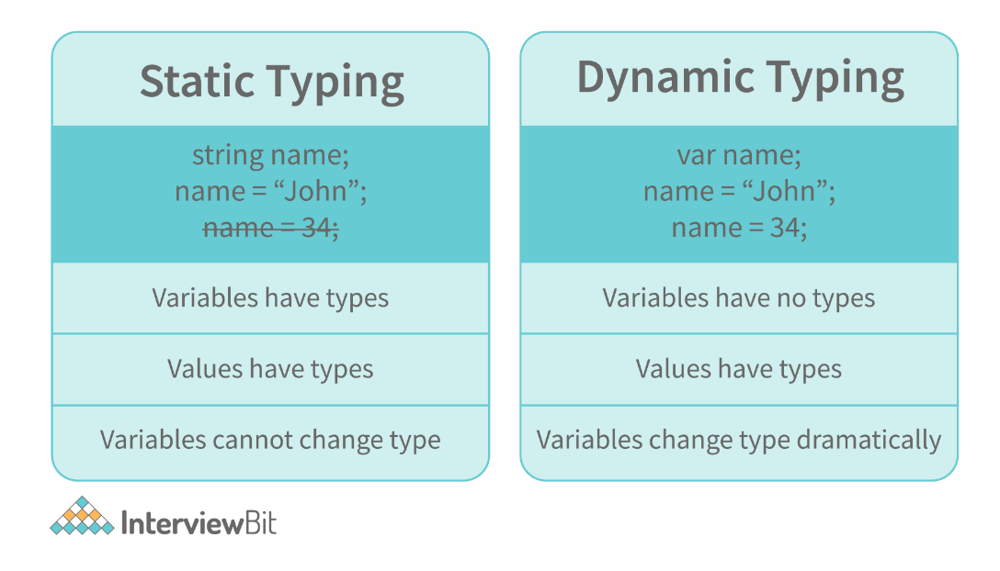
   + Since JavaScript is a loosely(dynamically) typed language, variables in JS are not associated with any type. A variable can hold the value of any data type.
   + For example, a variable that is assigned a number type can be converted to a string type:
     ```
     var a = 23;
     var a = "Hello World!";
     ```

2. What is NaN property in JavaScript?
   + NaN property represents the “Not-a-Number” value. It indicates a value that is not a legal number.
   + typeof of NaN will return a Number.
   + To check if a value is NaN, we use the isNaN() function
     + Note- isNaN() function converts the given value to a Number type, and then equates to NaN.
     ```
     isNaN("Hello")  // Returns true
     isNaN(345)   // Returns false
     isNaN('1')  // Returns false, since '1' is converted to Number type which results in 0 ( a number)
     isNaN(true) // Returns false, since true converted to Number type results in 1 ( a number)
     isNaN(false) // Returns false
     isNaN(undefined) // Returns true
     9
     ```

3.  Explain passed by value and passed by reference.
    + In JavaScript, primitive data types are passed by value and non-primitive data types are passed by reference.
    + For understanding passed by value and passed by reference, we need to understand what happens when we create a variable and assign a value to it: `var x = 2;`
      + In the above example, we created a variable x and assigned it a value of “2”. In the background, the “=” (assign operator) allocates some space in the memory, stores the value “2” and returns the location of the allocated memory space. Therefore, the variable x in the above code points to the location of the memory space instead of pointing to the value 2 directly.
    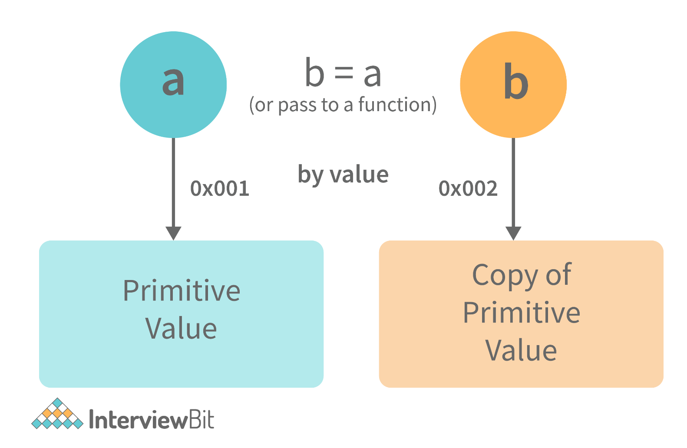
      ```
      var y = 234;
      var z = y;

      ```
      + In the above example, the assign operator knows that the value assigned to y is a primitive type (number type in this case), so when the second line code executes, where the value of y is assigned to z, the assign operator takes the value of y (234) and allocates a new space in the memory and returns the address. Therefore, variable z is not pointing to the location of variable y, instead, it is pointing to a new location in the memory.
        ```
        var y = #8454; // y pointing to address of the value 234

        var z = y;

        var z = #5411; // z pointing to a completely new address of the value 234

        // Changing the value of y
        y = 23;
        console.log(z);  // Returns 234, since z points to a new address in the memory so changes in y will not effect z
        ```
        + From the above example, we can see that primitive data types when passed to another variable, are passed by value. Instead of just assigning the same address to another variable, the value is passed and new space of memory is created.
    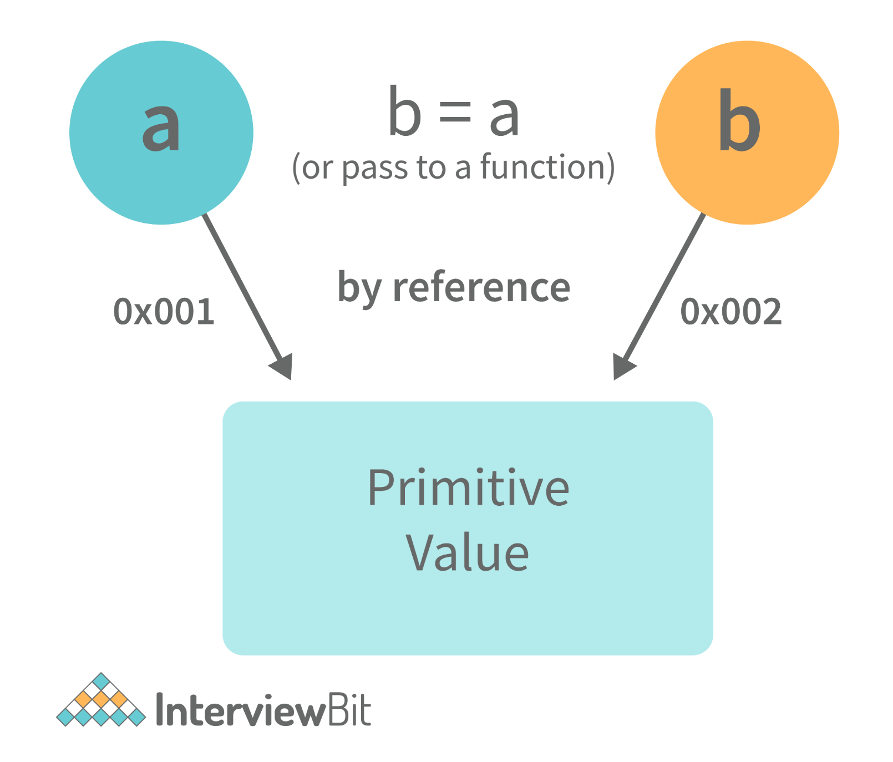
    ```
    var obj = { name: "Vivek", surname: "Bisht" };
    var obj2 = obj;
    ```
      + In the above example, the assign operator directly passes the location of the variable obj to the variable obj2. In other words, the reference of the variable obj is passed to the variable obj2.
        ```
        var obj = #8711;  // obj pointing to address of { name: "Vivek", surname: "Bisht" }
        var obj2 = obj;

        var obj2 = #8711; // obj2 pointing to the same address

        // changing the value of obj1

        obj1.name = "Akki";
        console.log(obj2);

        // Returns {name:"Akki", surname:"Bisht"} since both the variables are pointing to the same address.
        ```
        + From the above example, we can see that while passing non-primitive data types, the assign operator directly passes the address (reference).Therefore, non-primitive data types are always passed by reference.

4.  What is an Immediately Invoked Function in JavaScript?
    + An Immediately Invoked Function (known as IIFE and pronounced as IIFY) is a function that runs as soon as it is defined.
    + Syntax of IIFE:
      ```
      (function(){
        // Do something;
      })();
      ```
    + To understand IIFE, we need to understand the two sets of parentheses that are added while creating an IIFE:
      + The first set of parenthesis:
        ```
        (function (){
          //Do something;
        })
        ```
        + While executing JavaScript code, whenever the compiler sees the word “function”, it assumes that we are declaring a function in the code. Therefore, if we do not use the first set of parentheses, the compiler throws an error because it thinks we are declaring a function, and by the syntax of declaring a function, a function should always have a name.
          ```
          function() {
            //Do something;
          }
          // Compiler gives an error since the syntax of declaring a function is wrong in the code above.
          ```
          + To remove this error, we add the first set of parenthesis that tells the compiler that the function is not a function declaration, instead, it’s a function expression. The second set of parenthesis:
            ```
            (function (){
              //Do something;
            })();
            ```
            + From the definition of an IIFE, we know that our code should run as soon as it is defined. A function runs only when it is invoked. If we do not invoke the function, the function declaration is returned:
              ```
              (function (){
                // Do something;
              })

              // Returns the function declaration
              ```
              + Therefore to invoke the function, we use the second set of parenthesis.

5.  What do you mean by strict mode in JavaScript and characteristics of JavaScript strict-mode?
    + In ECMAScript 5, a new feature called JavaScript Strict Mode allows you to write a code or a function in a "strict" operational environment. In most cases, this language is 'not particularly severe' when it comes to throwing errors. In 'Strict mode,' however, all forms of errors, including silent errors, will be thrown. As a result, debugging becomes a lot simpler.  Thus programmer's chances of making an error are lowered.
    + `Characteristics of strict mode in JavaScript`:
      + Duplicate arguments are not allowed by developers.
      + In strict mode, you won't be able to use the JavaScript keyword as a parameter or function name.
      + The 'use strict' keyword is used to define strict mode at the start of the script. Strict mode is supported by all browsers.
      + Engineers will not be allowed to create global variables in 'Strict Mode.

6.  Explain Higher Order Functions in JavaScript.
    + Functions that operate on other functions, either by taking them as arguments or by returning them, are called higher-order functions.
    + Higher-order functions are a result of functions being first-class citizens in JavaScript.
      ```
      function higherOrder(fn) {
        fn();
      }

      higherOrder(function() { console.log("Hello world") });
      ```
      ```
      function higherOrder2() {
        return function() {
          return "Do something";
        }
      }
      var x = higherOrder2();
      x()   // Returns "Do something"
      ```

7.  Explain `this` keyword.
    + The “this” keyword refers to the object that the function is a property of.
    + The value of the “this” keyword will always depend on the object that is invoking the function.
      ```
      var obj = {
          name:  "vivek",
          getName: function(){
          console.log(this.name);
        }
      }
      obj.getName();
      ```
      + In the above code, at the time of invocation, the getName function is a property of the object obj , therefore, this keyword will refer to the object obj, and hence the output will be “vivek”.
      ```
      var obj = {
          name:  "vivek",
          getName: function(){
          console.log(this.name);
        }
      }

      var getName = obj.getName;

      var obj2 = {name:"akshay", getName };
      obj2.getName();
      ```
      + The output will be “akshay”. Although the getName function is declared inside the object obj, at the time of invocation, getName() is a property of obj2, therefore the “this” keyword will refer to obj2.
      + The silly way to understand the “this” keyword is, whenever the function is invoked, check the object before the dot. The value of this . keyword will always be the object before the dot.
      + If there is no object before the dot-like in example1, the value of this keyword will be the global object.
      ```
      var obj1 = {
          address : "Mumbai,India",
          getAddress: function(){
          console.log(this.address);
        }
      }

      var getAddress = obj1.getAddress;
      var obj2 = {name:"akshay"};
      obj2.getAddress();
      ```
      + The output will be an error.
      + Although in the code above, this keyword refers to the object obj2, obj2 does not have the property “address”‘, hence the getAddress function throws an error.

8.  What do you mean by Self Invoking Functions?
    + Without being requested, a self-invoking expression is automatically invoked (initiated). If a function expression is followed by (), it will execute automatically. A function declaration cannot be invoked by itself.
    + Normally, we declare a function and call it, however, anonymous functions may be used to run a function automatically when it is described and will not be called again. And there is no name for these kinds of functions.

9.  Explain call(), apply() and, bind() methods.
    + `call()`:
      + It’s a predefined method in JavaScript.
      + This method invokes a method (function) by specifying the owner object.
        ```
        function sayHello(){
          return "Hello " + this.name;
        }

        var obj = {name: "Sandy"};

        sayHello.call(obj);

        // Returns "Hello Sandy"
        ```
      + call() method allows an object to use the method (function) of another object.
        ```
        var person = {
          age: 23,
          getAge: function(){
            return this.age;
          }
        }
        var person2 = {age:  54};
        person.getAge.call(person2);
        // Returns 54
        ```
      + call() accepts arguments:
        ```
        function saySomething(message){
          return this.name + " is " + message;
        }
        var person4 = {name:  "John"};
        saySomething.call(person4, "awesome");
        // Returns "John is awesome"
        ```
    + `apply()`: The apply method is similar to the call() method. The only difference is that call() method takes arguments separately whereas, apply() method takes arguments as an array.
        ```
        function saySomething(message){
          return this.name + " is " + message;
        }
        var person4 = {name:  "John"};
        saySomething.apply(person4, ["awesome"]);
        ```
    + `bind()`: This method returns a new function, where the value of “this” keyword will be bound to the owner object, which is provided as a parameter.
        ```
        var bikeDetails = {
            displayDetails: function(registrationNumber,brandName){
            return this.name+ " , "+ "bike details: "+ registrationNumber + " , " + brandName;
          }
        }

        var person1 = {name:  "Vivek"};

        var detailsOfPerson1 = bikeDetails.displayDetails.bind(person1, "TS0122", "Bullet");

        // Binds the displayDetails function to the person1 object

        detailsOfPerson1();
        //Returns Vivek, bike details: TS0122, Bullet
        ```

1.  What is the difference between `exec()` and `test()` methods in JavaScript?
    + `test()` and `exec()` are RegExp expression methods used in JavaScript.
    + We'll use `exec()` to search a string for a specific pattern, and if it finds it, it'll return the pattern directly; else, it'll return an 'empty' result.
    + We will use a `test()` to find a string for a specific pattern. It will return the Boolean value 'true' on finding the given text otherwise, it will return 'false'.

2.  What is currying in JavaScript?
    + `Currying`: is an advanced technique to transform a function of arguments n, to n functions of one or fewer arguments.
      ```
      function multiply(a,b){
        return a*b;
      }

      function currying(fn){
        return function(a){
          return function(b){
            return fn(a,b);
          }
        }
      }

      var curriedMultiply = currying(multiply);

      multiply(4, 3); // Returns 12

      curriedMultiply(4)(3); // Also returns 12
      ```
      + As one can see in the code above, we have transformed the function multiply(a,b) to a function curriedMultiply , which takes in one parameter at a time.

3.  What are some advantages of using External JavaScript?
    + External JavaScript is the JavaScript Code (script) written in a separate file with the extension.js, and then we link that file inside the `<head>` or `<body>` element of the HTML file where the code is to be placed.
    + Some advantages of external JavaScript are
      + It allows web designers and developers to collaborate on HTML and JavaScript files.
      + We can reuse the code.
      + Code readability is simple in external JavaScript.


19. Explain Scope and Scope Chain in JavaScript.
    + Scope in JS determines the accessibility of variables and functions at various parts of one’s code.
    + In general terms, the scope will let us know at a given part of code, what are variables and functions we can or cannot access.
    + There are three types of scopes in JS:
      + `Global Scope`: Variables or functions declared in the global namespace have global scope, which means all the variables and functions having global scope can be accessed from anywhere inside the code.
        ```
        var globalVariable = "Hello world";

        function sendMessage(){
          return globalVariable; // can access globalVariable since it's written in global space
        }
        function sendMessage2(){
          return sendMessage(); // Can access sendMessage function since it's written in global space
        }
        sendMessage2();  // Returns “Hello world”
        ```
      + `Function Scope`: Any variables or functions declared inside a function have local/function scope, which means that all the variables and functions declared inside a function, can be accessed from within the function and not outside of it.
        ```
        function awesomeFunction(){
          var a = 2;

          var multiplyBy2 = function(){
            console.log(a*2); // Can access variable "a" since a and multiplyBy2 both are written inside the same function
          }
        }
        console.log(a); // Throws reference error since a is written in local scope and cannot be accessed outside

        multiplyBy2(); // Throws reference error since multiplyBy2 is written in local scope
        ```
      + `Block Scope`: Block scope is related to the variables declared using let and const. Variables declared with var do not have block scope. Block scope tells us that any variable declared inside a block { }, can be accessed only inside that block and cannot be accessed outside of it.
        ```
        {
          let x = 45;
        }

        console.log(x); // Gives reference error since x cannot be accessed outside of the block

        for(let i=0; i<2; i++){
          // do something
        }

        console.log(i); // Gives reference error since i cannot be accessed outside of the for loop block
        ```
    + `Scope Chain`: JavaScript engine also uses Scope to find variables. Let’s understand that using an example:
      ```
      var y = 24;

      function favFunction(){
        var x = 667;
        var anotherFavFunction = function(){
          console.log(x); // Does not find x inside anotherFavFunction, so looks for variable inside favFunction, outputs 667
        }

        var yetAnotherFavFunction = function(){
          console.log(y); // Does not find y inside yetAnotherFavFunction, so looks for variable inside favFunction and does not find it, so looks for variable in global scope, finds it and outputs 24
        }

        anotherFavFunction();
        yetAnotherFavFunction();
      }
      favFunction();
      ```
      + As you can see in the code above, if the JavaScript engine does not find the variable in local scope, it tries to check for the variable in the outer scope. If the variable does not exist in the outer scope, it tries to find the variable in the global scope. If the variable is not found in the global space as well, a reference error is thrown.

20. Explain Closures in JavaScript.
    + `Closures`: are an ability of a function to remember the variables and functions that are declared in its outer scope.
      ```
      function randomFunc(){
        var obj1 = {name:"Vivian", age:45};

        return function(){
          console.log(obj1.name + " is "+ "awesome"); // Has access to obj1 even when the randomFunc function is executed
        }
      }

      var initialiseClosure = randomFunc(); // Returns a function

      initialiseClosure();
      ```
      + The function randomFunc() gets executed and returns a function when we assign it to a variable:
        + `var initialiseClosure = randomFunc();`
        + The returned function is then executed when we invoke initialiseClosure:
          + `initialiseClosure();`
            + The line of code above outputs “Vivian is awesome” and this is possible because of closure.
              + `console.log(obj1.name + " is "+ "awesome");`
                + When the function randomFunc() runs, it seems that the returning function is using the variable obj1 inside it:
                  + Therefore randomFunc(), instead of destroying the value of obj1 after execution, saves the value in the memory for further reference. This is the reason why the returning function is able to use the variable declared in the outer scope even after the function is already executed.
                  + This ability of a function to store a variable for further reference even after it is executed is called Closure.

21. Mention some advantages of JavaScript.
    + Javascript is executed on the client-side as well as server-side also. There are a variety of Frontend Frameworks that you may study and utilize. However, if you want to use JavaScript on the backend, you'll need to learn NodeJS. It is currently the only JavaScript framework that may be used on the backend.
    + Javascript is a simple language to learn.
    + Web pages now have more functionality because of Javascript.
    + To the end-user, Javascript is quite quick.

22. What are object prototypes?
    + All JavaScript objects inherit properties from a prototype. For example,
      + Date objects inherit properties from the Date prototype.
      + Math objects inherit properties from the Math prototype.
      + Array objects inherit properties from the Array prototype.
      + On top of the chain is Object.prototype. Every prototype inherits properties and methods from the Object.prototype.
      + A prototype is a blueprint of an object. The prototype allows us to use properties and methods on an object even if the properties and methods do not exist on the current object.
      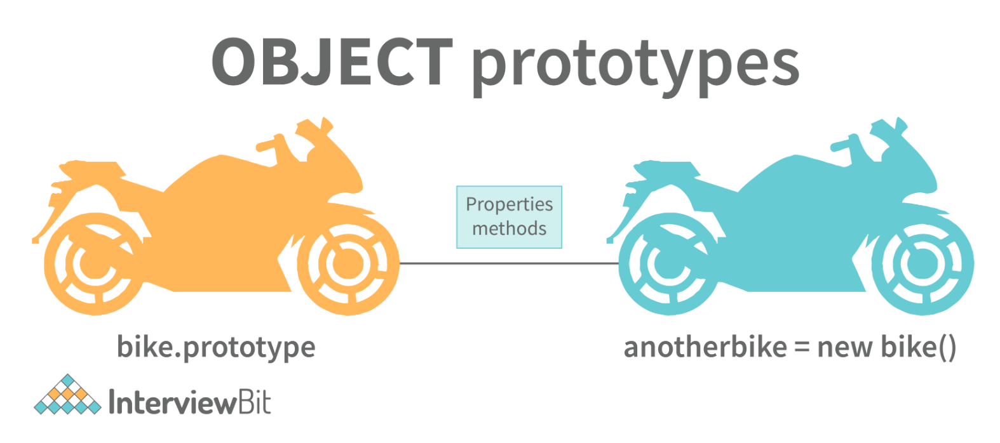
        ```
        var arr = [];
        arr.push(2);

        console.log(arr); // Outputs [2]
        ```
        + In the code above, as one can see, we have not defined any property or method called push on the array “arr” but the JavaScript engine does not throw an error.
        + The reason is the use of prototypes. As we discussed before, Array objects inherit properties from the Array prototype.
        + The JavaScript engine sees that the method push does not exist on the current array object and therefore, looks for the method push inside the Array prototype and it finds the method.
        + Whenever the property or method is not found on the current object, the JavaScript engine will always try to look in its prototype and if it still does not exist, it looks inside the prototype's prototype and so on.

23. What are callbacks?
    + A callback is a function that will be executed after another function gets executed. In JavaScript, functions are treated as first-class citizens, they can be used as an argument of another function, can be returned by another function, and can be used as a property of an object.
    + Functions that are used as an argument to another function are called callback functions.
      ```
      function divideByHalf(sum){
        console.log(Math.floor(sum / 2));
      }

      function multiplyBy2(sum){
        console.log(sum * 2);
      }

      function operationOnSum(num1,num2,operation){
        var sum = num1 + num2;
        operation(sum);
      }

      operationOnSum(3, 3, divideByHalf); // Outputs 3

      operationOnSum(5, 5, multiplyBy2); // Outputs 20
      ```
      + In the code above, we are performing mathematical operations on the sum of two numbers. The operationOnSum function takes 3 arguments, the first number, the second number, and the operation that is to be performed on their sum (callback).
      + Both divideByHalf and multiplyBy2 functions are used as callback functions in the code above.
      + These callback functions will be executed only after the function operationOnSum is executed.
      + Therefore, a callback is a function that will be executed after another function gets executed.

24. What are the types of errors in JavaScript?
    + `Syntax error`: Syntax errors are mistakes or spelling problems in the code that cause the program to not execute at all or to stop running halfway through. Error messages are usually supplied as well.
    + `Logical error`: Reasoning mistakes occur when the syntax is proper but the logic or program is incorrect. The application executes without problems in this case. However, the output findings are inaccurate. These are sometimes more difficult to correct than syntax issues since these applications do not display error signals for logic faults.

25. What is memoization?
    + `Memoization`: is a form of caching where the return value of a function is cached based on its parameters. If the parameter of that function is not changed, the cached version of the function is returned.
    + Note: Memoization is used for expensive function calls but in the following example, we are considering a simple function for understanding the concept of memoization better.
      ```
      function addTo256(num){
        return num + 256;
      }
      addTo256(20); // Returns 276
      addTo256(40); // Returns 296
      addTo256(20); // Returns 276
      ```
      + In the code above, we have written a function that adds the parameter to 256 and returns it.
      + When we are calling the function addTo256 again with the same parameter (“20” in the case above), we are computing the result again for the same parameter.
      + Computing the result with the same parameter, again and again, is not a big deal in the above case, but imagine if the function does some heavy-duty work, then, computing the result again and again with the same parameter will lead to wastage of time.
      + This is where memoization comes in, by using memoization we can store(cache) the computed results based on the parameters. If the same parameter is used again while invoking the function, instead of computing the result, we directly return the stored (cached) value.
      + Let’s convert the above function addTo256, to a memoized function:
        ```
        function memoizedAddTo256(){
          var cache = {};

          return function(num){
            if(num in cache){
              console.log("cached value");
              return cache[num]
            }
            else{
              cache[num] = num + 256;
              return cache[num];
            }
          }
        }
        var memoizedFunc = memoizedAddTo256();

        memoizedFunc(20); // Normal return
        memoizedFunc(20); // Cached return
        ```
        + In the code above, if we run the memoizedFunc function with the same parameter, instead of computing the result again, it returns the cached result.
        + Note- Although using memoization saves time, it results in larger consumption of memory since we are storing all the computed results.

26. What is recursion in a programming language?
    + `Recursion`: is a technique to iterate over an operation by having a function call itself repeatedly until it arrives at a result.
      ```
      function add(number) {
        if (number <= 0) {
          return 0;
        } else {
          return number + add(number - 1);
        }
      }
      add(3) => 3 + add(2)
                3 + 2 + add(1)
                3 + 2 + 1 + add(0)
                3 + 2 + 1 + 0 = 6
      ```
    + The following function calculates the sum of all the elements in an array by using recursion:
      ```
      function computeSum(arr){
        if(arr.length === 1){
          return arr[0];
        }
        else{
          return arr.pop() + computeSum(arr);
        }
      }
      computeSum([7, 8, 9, 99]); // Returns 123
      ```

27. What is the use of a constructor function in JavaScript?
    + Constructor functions are used to create objects in JavaScript.
    + If we want to create multiple objects having similar properties and methods, constructor functions are used.
    + Note- The name of a constructor function should always be written in Pascal Notation: every word should start with a capital letter.
      ```
      function Person(name,age,gender){
        this.name = name;
        this.age = age;
        this.gender = gender;
      }

      var person1 = new Person("Vivek", 76, "male");
      console.log(person1);

      var person2 = new Person("Courtney", 34, "female");
      console.log(person2);
      ```
      + In the code above, we have created a constructor function named Person. Whenever we want to create a new object of the type Person, We need to create it using the new keyword:
        + `var person3 = new Person("Lilly", 17, "female");`
          + The above line of code will create a new object of the type Person. Constructor functions allow us to group similar objects.

28. What is the Document Object Model (DOM)?
    + `Document Object Model (DOM)`: DOM is a programming interface for HTML and XML documents.
    + When the browser tries to render an HTML document, it creates an object based on the HTML document called DOM. Using this DOM, we can manipulate or change various elements inside the HTML document.
    + Example of how HTML code gets converted to DOM:
    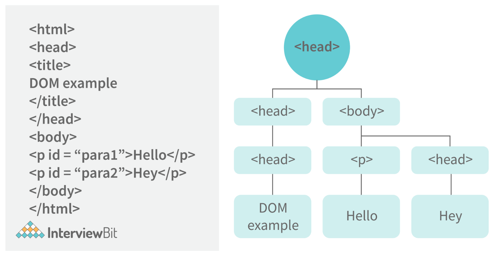

29. Which method is used to retrieve a character from a certain index?
    + The `charAt()` function of the JavaScript string finds a char element at the supplied index. The index number begins at 0 and continues up to n-1, Here n is the string length. The index value must be positive, higher than, or the same as the string length.

30. What do you mean by Browser Object Model (BOM)?
    +` Browser Object Model (BOM)`: allows users to interact with the browser. A browser's initial object is a window. As a result, you may call all of the window's functions directly or by referencing the window. The document, history, screen, navigator, location, and other attributes are available in the window object.

31. What is the distinction between client-side and server-side JavaScript?
    + Client-side JavaScript is made up of two parts, a fundamental language and predefined objects for performing JavaScript in a browser. JavaScript for the client is automatically included in the HTML pages. At runtime, the browser understands this script.
    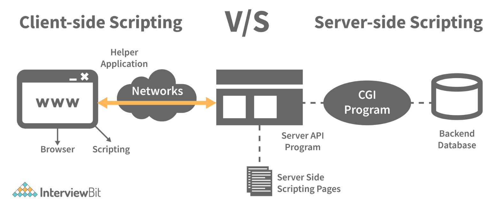
    + Client-side JavaScript is similar to server-side JavaScript. It includes JavaScript that will execute on a server. Only after processing is the server-side JavaScript deployed.

32. What are arrow functions?
    + Arrow functions were introduced in the ES6 version of JavaScript. They provide us with a new and shorter syntax for declaring functions. Arrow functions can only be used as a function expression.
      ```
      // Traditional Function Expression
      var add = function(a,b){
        return a + b;
      }

      // Arrow Function Expression
      var arrowAdd = (a,b) => a + b;
      ```
    + Arrow functions are declared without the function keyword. If there is only one returning expression then we don’t need to use the return keyword as well in an arrow function as shown in the example above. Also, for functions having just one line of code, curly braces { } can be omitted.
      ```
      // Traditional function expression
      var multiplyBy2 = function(num){
        return num * 2;
      }
      // Arrow function expression
      var arrowMultiplyBy2 = num => num * 2;
      ```
      + If the function takes in only one argument, then the parenthesis () around the parameter can be omitted as shown in the code above.
        ```
        var obj1 = {
          valueOfThis: function(){
            return this;
          }
        }
        var obj2 = {
          valueOfThis: ()=>{
            return this;
          }
        }

        obj1.valueOfThis(); // Will return the object obj1
        obj2.valueOfThis(); // Will return window/global object
        ```
    + The biggest difference between the traditional function expression and the arrow function is the handling of this keyword. By general definition, this keyword always refers to the object that is calling the function. As you can see in the code above, obj1.valueOfThis() returns obj1 since this keyword refers to the object calling the function.
    + In the arrow functions, there is no binding of this keyword. This keyword inside an arrow function does not refer to the object calling it. It rather inherits its value from the parent scope which is the window object in this case. Therefore, in the code above, obj2.valueOfThis() returns the window object.

33. What do mean by prototype design pattern?
    + The Prototype Pattern produces different objects, but instead of returning uninitialized objects, it produces objects that have values replicated from a template – or sample – object. Also known as the Properties pattern, the Prototype pattern is used to create prototypes.
    + The introduction of business objects with parameters that match the database's default settings is a good example of where the Prototype pattern comes in handy. The default settings for a newly generated business object are stored in the prototype object.
    + The Prototype pattern is hardly used in traditional languages, however, it is used in the development of new objects and templates in JavaScript, which is a prototypal language.

34. Differences between declaring variables using var, let and const.
    + Before the ES6 version of JavaScript, only the keyword var was used to declare variables. With the ES6 Version, keywords let and const were introduced to declare variables.
    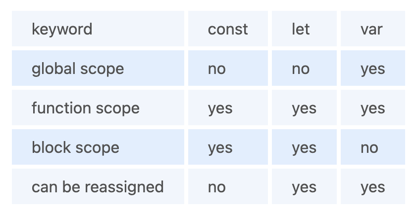
      ```
      var variable1 = 23;
      let variable2 = 89;

      function catchValues(){
        console.log(variable1);
        console.log(variable2);

        // Both the variables can be accessed anywhere since they are declared in the global scope
      }

      window.variable1; // Returns the value 23
      window.variable2; // Returns undefined
      ```
      + The variables declared with the let keyword in the global scope behave just like the variable declared with the var keyword in the global scope.
      + Variables declared in the global scope with var and let keywords can be accessed from anywhere in the code.
      + But, there is one difference! Variables that are declared with the var keyword in the global scope are added to the window/global object. Therefore, they can be accessed using window.variableName.
      + Whereas, the variables declared with the let keyword are not added to the global object, therefore, trying to access such variables using window.variableName results in an error.
    + `var vs let in functional scope`
      ```
      function varVsLetFunction(){
        let awesomeCar1 = "Audi";
        var awesomeCar2 = "Mercedes";
      }

      console.log(awesomeCar1); // Throws an error
      console.log(awesomeCar2); // Throws an error
      ```
      + Variables are declared in a functional/local scope using var and let keywords behave exactly the same, meaning, they cannot be accessed from outside of the scope.
        ```
        {
          var variable3 = [1, 2, 3, 4];
        }

        console.log(variable3); // Outputs [1,2,3,4]

        {
          let variable4 = [6, 55, -1, 2];
        }

        console.log(variable4); // Throws error

        for(let i = 0; i < 2; i++){
          //Do something
        }

        console.log(i); // Throws error

        for(var j = 0; j < 2; i++){
          // Do something
        }

        console.log(j) // Outputs 2
        ```
        + In JavaScript, a block means the code written inside the curly braces {}.
        + Variables declared with var keyword do not have block scope. It means a variable declared in block scope {} with the var keyword is the same as declaring the variable in the global scope.
        + Variables declared with let keyword inside the block scope cannot be accessed from outside of the block.
    + `Const keyword`
      + Variables with the const keyword behave exactly like a variable declared with the let keyword with only one difference, any variable declared with the const keyword cannot be reassigned.
        ```
        const x = {name:"Vivek"};
        x = {address: "India"}; // Throws an error
        x.name = "Nikhil"; // No error is thrown
        const y = 23;
        y = 44; // Throws an error
        ```
        + In the code above, although we can change the value of a property inside the variable declared with const keyword, we cannot completely reassign the variable itself.

35. What is the rest parameter and spread operator?
    + Both rest parameter and spread operator were introduced in the ES6 version of JavaScript.
      + `Rest parameter ( … )`:
        + It provides an improved way of handling the parameters of a function.
        + Using the rest parameter syntax, we can create functions that can take a variable number of arguments.
        + Any number of arguments will be converted into an array using the rest parameter.
        + It also helps in extracting all or some parts of the arguments.
        + Rest parameters can be used by applying three dots (...) before the parameters.
        ```
        function extractingArgs(...args){
          return args[1];
        }

        // extractingArgs(8,9,1); // Returns 9

        function addAllArgs(...args){
          let sumOfArgs = 0;
          let i = 0;
          while(i < args.length){
            sumOfArgs += args[i];
            i++;
          }
          return sumOfArgs;
        }

        addAllArgs(6, 5, 7, 99); // Returns 117
        addAllArgs(1, 3, 4); // Returns 8
        ```
        + **Note- Rest parameter should always be used at the last parameter of a function:
          ```
          // Incorrect way to use rest parameter
          function randomFunc(a,...args,c){
          //Do something
          }

          // Correct way to use rest parameter
          function randomFunc2(a,b,...args){
          //Do something
          }
          ```
      + `Spread operator (…)`: Although the syntax of the spread operator is exactly the same as the rest parameter, the spread operator is used to spreading an array, and object literals. We also use spread operators where one or more arguments are expected in a function call.
        ```
        function addFourNumbers(num1,num2,num3,num4){
          return num1 + num2 + num3 + num4;
        }

        let fourNumbers = [5, 6, 7, 8];


        addFourNumbers(...fourNumbers);
        // Spreads [5,6,7,8] as 5,6,7,8

        let array1 = [3, 4, 5, 6];
        let clonedArray1 = [...array1];
        // Spreads the array into 3,4,5,6
        console.log(clonedArray1); // Outputs [3,4,5,6]


        let obj1 = {x:'Hello', y:'Bye'};
        let clonedObj1 = {...obj1}; // Spreads and clones obj1
        console.log(obj1);

        let obj2 = {z:'Yes', a:'No'};
        let mergedObj = {...obj1, ...obj2}; // Spreads both the objects and merges it
        console.log(mergedObj);
        // Outputs {x:'Hello', y:'Bye',z:'Yes',a:'No'};
        ```
        + Rest parameter is used to take a variable number of arguments and turns them into an array while the spread operator takes an array or an object and spreads it.
        + Rest parameter is used in function declaration whereas the spread operator is used in function calls.

36. In JavaScript, how many different methods can you make an object?
    + In JavaScript, there are several ways to declare or construct an object.
      + Object.
      + using Class.
      + create Method.
      + Object Literals.
      + using Function.
      + Object Constructor.

37. What is the use of promises in JavaScript?
    + `Promises`: are used to handle asynchronous operations in JavaScript.
    + Before promises, callbacks were used to handle asynchronous operations. But due to the limited functionality of callbacks, using multiple callbacks to handle asynchronous code can lead to unmanageable code.
    + Promise object has four states:
      + `Pending`: Initial state of promise. This state represents that the promise has neither been fulfilled nor been rejected, it is in the pending state.
      + `Fulfilled`: This state represents that the promise has been fulfilled, meaning the async operation is completed.
      + `Rejected`: This state represents that the promise has been rejected for some reason, meaning the async operation has failed.
      + `Settled`: This state represents that the promise has been either rejected or fulfilled.
    + A promise is created using the Promise constructor which takes in a callback function with two parameters, resolve and reject respectively.
    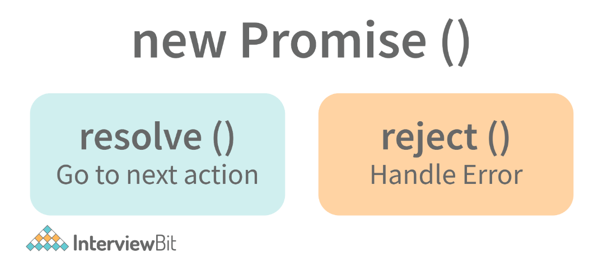
      + resolve is a function that will be called when the async operation has been successfully completed.
      + reject is a function that will be called, when the async operation fails or if some error occurs.
      + Promises are used to handle asynchronous operations like server requests, for ease of understanding, we are using an operation to calculate the sum of three elements.
        ```
        function sumOfThreeElements(...elements){
          return new Promise((resolve,reject)=>{
            if(elements.length > 3 ){
              reject("Only three elements or less are allowed");
            }
            else {
              let sum = 0;
              let i = 0;
              while(i < elements.length){
                sum += elements[i];
                i++;
              }
              resolve("Sum has been calculated: "+sum);
            }
          })
        }
        ```
        + In the code above, we are calculating the sum of three elements, if the length of the elements array is more than 3, a promise is rejected, or else the promise is resolved and the sum is returned.
        + We can consume any promise by attaching then() and catch() methods to the consumer.
        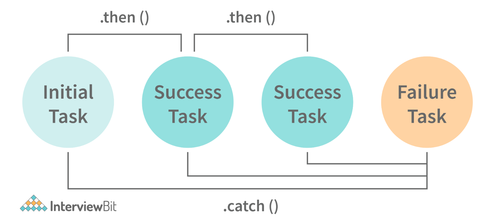
          + then() method is used to access the result when the promise is fulfilled.
          + catch() method is used to access the result/error when the promise is rejected. In the code below, we are consuming the promise:
            ```
            sumOfThreeElements(4, 5, 6)
            .then(result=> console.log(result))
            .catch(error=> console.log(error));
            // In the code above, the promise is fulfilled so the then() method gets executed

            sumOfThreeElements(7, 0, 33, 41)
            .then(result => console.log(result))
            .catch(error=> console.log(error));
            // In the code above, the promise is rejected hence the catch() method gets executed
            ```

38. What are classes in JavaScript?
    + Introduced in the ES6 version, classes are nothing but syntactic sugars for constructor functions. They provide a new way of declaring constructor functions in JavaScript.  Below are the examples of how classes are declared and used:
      ```
      // Before ES6 version, using constructor functions
      function Student(name,rollNumber,grade,section){
        this.name = name;
        this.rollNumber = rollNumber;
        this.grade = grade;
        this.section = section;
      }

      // Way to add methods to a constructor function
      Student.prototype.getDetails = function(){
        return 'Name: ${this.name}, Roll no: ${this.rollNumber}, Grade: ${this.grade}, Section:${this.section}';
      }

      let student1 = new Student("Vivek", 354, "6th", "A");
      student1.getDetails();
      // Returns Name: Vivek, Roll no:354, Grade: 6th, Section:A

      // ES6 version classes
      class Student{
        constructor(name,rollNumber,grade,section){
          this.name = name;
          this.rollNumber = rollNumber;
          this.grade = grade;
          this.section = section;
        }

        // Methods can be directly added inside the class
        getDetails(){
          return 'Name: ${this.name}, Roll no: ${this.rollNumber}, Grade:${this.grade}, Section:${this.section}';
        }
      }

      let student2 = new Student("Garry", 673, "7th", "C");
      student2.getDetails();
      // Returns Name: Garry, Roll no:673, Grade: 7th, Section:C
      ```
    + Key points to remember about classes:
      + Unlike functions, classes are not hoisted. A class cannot be used before it is declared.
      + A class can inherit properties and methods from other classes by using the extend keyword.
      + All the syntaxes inside the class must follow the strict mode(‘use strict’) of JavaScript. An error will be thrown if the strict mode rules are not followed.

39. What are generator functions?
    + Introduced in the ES6 version, generator functions are a special class of functions. They can be stopped midway and then continue from where they had stopped
    + Generator functions are declared with the function* keyword instead of the normal function keyword:
      ```
      function* genFunc(){
        // Perform operation
      }
      ```
    + In normal functions, we use the return keyword to return a value and as soon as the return statement gets executed, the function execution stops:
      ```
      function normalFunc(){
        return 22;
        console.log(2); // This line of code does not get executed
      }
      ```
    + In the case of generator functions, when called, they do not execute the code, instead, they return a generator object. This generator object handles the execution.
      ```
      function* genFunc(){
        yield 3;
        yield 4;
      }
      genFunc(); // Returns Object [Generator] {}
      ```
    + The generator object consists of a method called next(), this method when called, executes the code until the nearest yield statement, and returns the yield value. For example, if we run the next() method on the above code:
      + `genFunc().next(); // Returns {value: 3, done:false}`
        + As one can see the next method returns an object consisting of a value and done properties.  Value property represents the yielded value. Done property tells us whether the function code is finished or not. (Returns true if finished).
    + Generator functions are used to return iterators. Let’s see an example where an iterator is returned:
      ```
      function* iteratorFunc() {
        let count = 0;
        for (let i = 0; i < 2; i++) {
            count++;
            yield i;
        }
        return count;
      }

      let iterator = iteratorFunc();
      console.log(iterator.next()); // {value:0,done:false}
      console.log(iterator.next()); // {value:1,done:false}
      console.log(iterator.next()); // {value:2,done:true}
      ```
      + As you can see in the code above, the last line returns done:true, since the code reaches the return statement.

40. Explain WeakSet in JavaScript.
    + In JavaScript, a Set is a collection of unique and ordered elements. Just like Set, WeakSet is also a collection of unique and ordered elements with some key differences:
    + Weakset contains only objects and no other type.
    + An object inside the weakset is referenced weakly. This means, that if the object inside the weakset does not have a reference, it will be garbage collected.
    + Unlike Set, WeakSet only has three methods, add() , delete() and has().
      ```
      const newSet = new Set([4, 5, 6, 7]);
      console.log(newSet);// Outputs Set {4,5,6,7}

      const newSet2 = new WeakSet([3, 4, 5]); //Throws an error

      let obj1 = {message:"Hello world"};
      const newSet3 = new WeakSet([obj1]);
      console.log(newSet3.has(obj1)); // true
      ```

41. Why do we use callbacks?
    + A callback function is a method that is sent as an input to another function (now let us name this other function "thisFunction"), and it is performed inside the thisFunction after the function has completed execution.
    + JavaScript is a scripting language that is based on events. Instead of waiting for a reply before continuing, JavaScript will continue to run while monitoring for additional events. Callbacks are a technique of ensuring that a particular code does not run until another code has completed its execution.

42. Explain WeakMap in JavaScript.
    + In JavaScript, Map is used to store key-value pairs. The key-value pairs can be of both primitive and non-primitive types. WeakMap is similar to Map with key differences:
      + The keys and values in weakmap should always be an object.
      + If there are no references to the object, the object will be garbage collected.
        ```
        const map1 = new Map();
        map1.set('Value', 1);

        const map2 = new WeakMap();
        map2.set('Value', 2.3); // Throws an error

        let obj = {name:"Vivek"};
        const map3 = new WeakMap();
        map3.set(obj, {age:23});
        ```

43. What is Object Destructuring?
    + Object destructuring is a new way to extract elements from an object or an array.
    + `Object destructuring`: Before ES6 version:
      ```
      const classDetails = {
        strength: 78,
        benches: 39,
        blackBoard:1
      }

      const classStrength = classDetails.strength;
      const classBenches = classDetails.benches;
      const classBlackBoard = classDetails.blackBoard;
      ```
      + The same example using object destructuring:
        ```
        const classDetails = {
          strength: 78,
          benches: 39,
          blackBoard:1
        }

        const {strength:classStrength, benches:classBenches,blackBoard:classBlackBoard} = classDetails;

        console.log(classStrength); // Outputs 78
        console.log(classBenches); // Outputs 39
        console.log(classBlackBoard); // Outputs 1
        ```
        + As one can see, using object destructuring we have extracted all the elements inside an object in one line of code. If we want our new variable to have the same name as the property of an object we can remove the colon:
          ```
          const {strength:strength} = classDetails;
          // The above line of code can be written as:
          const {strength} = classDetails;
          ```
    + `Array destructuring`: Before ES6 version:
      ```
      const arr = [1, 2, 3, 4];
      const first = arr[0];
      const second = arr[1];
      const third = arr[2];
      const fourth = arr[3];
      ```
    + The same example using object destructuring:
      ```
      const arr = [1, 2, 3, 4];
      const [first,second,third,fourth] = arr;
      console.log(first); // Outputs 1
      console.log(second); // Outputs 2
      console.log(third); // Outputs 3
      console.log(fourth); // Outputs 4
      ```

44. Difference between prototypal and classical inheritance?
    + Programers build objects, which are representations of real-time entities, in traditional OO programming. Classes and objects are the two sorts of abstractions. A class is a generalization of an object, whereas an object is an abstraction of an actual thing. A Vehicle, for example, is a specialization of a Car. As a result, automobiles (class) are descended from vehicles (object).
    + Classical inheritance differs from prototypal inheritance in that classical inheritance is confined to classes that inherit from those remaining classes, but prototypal inheritance allows any object to be cloned via an object linking method. Despite going into too many specifics, a prototype essentially serves as a template for those other objects, whether they extend the parent object or not.

45. What is a Temporal Dead Zone?
    + Temporal Dead Zone is a behaviour that occurs with variables declared using let and const keywords. It is a behaviour where we try to access a variable before it is initialized. Examples of temporal dead zone:
      ```
      x = 23; // Gives reference error

      let x;

      function anotherRandomFunc(){
        message = "Hello"; // Throws a reference error

        let message;
      }
      anotherRandomFunc();
      ```
      + In the code above, both in the global scope and functional scope, we are trying to access variables that have not been declared yet. This is called the Temporal Dead Zone.

46. What do you mean by JavaScript Design Patterns?
    + JavaScript design patterns are repeatable approaches for errors that arise sometimes when building JavaScript browser applications. They truly assist us in making our code more stable.
      + Creational Design Pattern: The object generation mechanism is addressed by the JavaScript Creational Design Pattern. They aim to make items that are appropriate for a certain scenario.
      + Structural Design Pattern: The JavaScript Structural Design Pattern explains how the classes and objects we've generated so far can be combined to construct bigger frameworks. This pattern makes it easier to create relationships between items by defining a straightforward way to do so.
      + Behavioral Design Pattern: This design pattern highlights typical patterns of communication between objects in JavaScript. As a result, the communication may be carried out with greater freedom.

47. Is JavaScript a pass-by-reference or pass-by-value language?
    + The variable's data is always a reference for objects, hence it's always pass by value. As a result, if you supply an object and alter its members inside the method, the changes continue outside of it. It appears to be pass by reference in this case. However, if you modify the values of the object variable, the change will not last, demonstrating that it is indeed passed by value.

48. Difference between Async/Await and Generators usage to achieve the same functionality.
    + Generator functions are run by their generator yield by yield which means one output at a time, whereas Async-await functions are executed sequentially one after another.
    + Async/await provides a certain use case for Generators easier to execute.
    + The output result of the Generator function is always value: X, done: Boolean, but the return value of the Async function is always an assurance or throws an error.

49. What are the primitive data types in JavaScript?
    + A primitive is a data type that isn't composed of other data types. It's only capable of displaying one value at a time. By definition, every primitive is a built-in data type (the compiler must be knowledgeable of them) nevertheless, not all built-in datasets are primitives. In JavaScript, there are 5 different forms of basic data. The following values are available:
      + Boolean
      + Undefined
      + Null
      + Number
      + String

50. What is the role of deferred scripts in JavaScript?
    + The processing of HTML code while the page loads are disabled by nature till the script hasn't halted. Your page will be affected if your network is a bit slow, or if the script is very hefty. When you use Deferred, the script waits for the HTML parser to finish before executing it. This reduces the time it takes for web pages to load, allowing them to appear more quickly.

51. What has to be done in order to put Lexical Scoping into practice?
    + To support lexical scoping, a JavaScript function object's internal state must include not just the function's code but also a reference to the current scope chain.

52. What is the purpose of the following JavaScript code?
    ```
    var scope = "global scope";
    function check()
    {
      var scope = "local scope";
      function f()
      {
        return scope;
      }
      return f;
    }
    ```
    + Every executing function, code block, and script as a whole in JavaScript has a related object known as the Lexical Environment. The preceding code line returns the value in scope.

53. Guess the outputs of the following code:
    ```
    // Code 1:

    function func1(){
      setTimeout(()=>{
        console.log(x);
        console.log(y);
      },3000);

      var x = 2;
      let y = 12;
    }
    func1();

    // Code 2:

    function func2(){
      for(var i = 0; i < 3; i++){
        setTimeout(()=> console.log(i),2000);
    }
    }
    func2();

    // Code 3:

    (function(){
      setTimeout(()=> console.log(1),2000);
      console.log(2);
      setTimeout(()=> console.log(3),0);
      console.log(4);
    })();
    ```
    + `Code 1`: Outputs 2 and 12. Since, even though let variables are not hoisted, due to the async nature of JavaScript, the complete function code runs before the setTimeout function. Therefore, it has access to both x and y.
    + `Code 2`: Outputs 3, three times since variable declared with var keyword does not have block scope. Also, inside the for loop, the variable i is incremented first and then checked.
    + `Code 3`: Output in the following order:
      ```
      2
      4
      3
      1 // After two seconds
      ```
      + Even though the second timeout function has a waiting time of zero seconds, the JavaScript engine always evaluates the setTimeout function using the Web API, and therefore, the complete function executes before the setTimeout function can execute.

54.  Guess the outputs of the following code:
    ```
    // Code 1:

    let x= {}, y = {name:"Ronny"},z = {name:"John"};
    x[y] = {name:"Vivek"};
    x[z] = {name:"Akki"};
    console.log(x[y]);

    // Code 2:

    function runFunc(){
      console.log("1" + 1);
      console.log("A" - 1);
      console.log(2 + "-2" + "2");
      console.log("Hello" - "World" + 78);
      console.log("Hello"+ "78");
    }
    runFunc();

    // Code 3:

    let a = 0;
    let b = false;
    console.log((a == b));
    console.log((a === b));
    ```
    + Code 1 - Output will be `{name: “Akki”}`. Adding objects as properties of another object should be done carefully. Writing `x[y] = {name:”Vivek”}`, is same as writing `x[‘object Object’] = {name:”Vivek”}`. While setting a property of an object, JavaScript coerces the parameter into a string.Therefore, since y is an object, it will be converted to ‘object Object’. Both x[y] and x[z] are referencing the same property.
    + Code 2 - Outputs in the following order:
      ```
      11
      Nan
      2-22
      NaN
      Hello78
      ```
    + Code 3 - Output in the following order due to equality coercion:
      ```
      true
      false
      ```

55.  Guess the output of the following code:
    ```
    var x = 23;

    (function(){
      var x = 43;
      (function random(){
        x++;
        console.log(x);
        var x = 21;
      })();
    })();
    ```
    + Output is NaN.
    + random() function has functional scope since x is declared and hoisted in the functional scope.
    + Rewriting the random function will give a better idea about the output:
      ```
      function random(){
        var x; // x is hoisted
        x++; // x is not a number since it is not initialized yet
        console.log(x); // Outputs NaN
        x = 21; // Initialization of x
      }
      ```

56.  Guess the outputs of the following code:
    ```
    // Code 1

      let hero = {
        powerLevel: 99,
        getPower(){
          return this.powerLevel;
        }
      }

      let getPower = hero.getPower;

      let hero2 = {powerLevel:42};
      console.log(getPower());
      console.log(getPower.apply(hero2));

      // Code 2

      const a = function(){
        console.log(this);

        const b = {
          func1: function(){
            console.log(this);
          }
        }

        const c = {
          func2: ()=>{
            console.log(this);
          }
        }

        b.func1();
        c.func2();
      }

      a();

      // Code 3

      const b = {
        name:"Vivek",
        f: function(){
          var self = this;
          console.log(this.name);
          (function(){
            console.log(this.name);
            console.log(self.name);
          })();
        }
      }
      b.f();
    ```
    + Code 1 - Output in the following order:
      ```
      undefined
      42
      ```
      + Reason - The first output is undefined since when the function is invoked, it is invoked referencing the global object:
        + `window.getPower() = getPower();`
    + Code 2 - Outputs in the following order:
      ```
      global/window object
      object "b"
      global/window object
      ```
      + Since we are using the arrow function inside func2, this keyword refers to the global object.
    + Code 3 - Outputs in the following order:
      ```
      "Vivek"
      undefined
      "Vivek"
      ```
      + Only in the IIFE inside the function f, this keyword refers to the global/window object.

57.  Write a function that performs binary search on a sorted array.
    ```
    function binarySearch(arr,value,startPos,endPos){
      if(startPos > endPos) return -1;

      let middleIndex = Math.floor(startPos+endPos)/2;

      if(arr[middleIndex] === value) return middleIndex;

      elseif(arr[middleIndex > value]){
        return binarySearch(arr,value,startPos,middleIndex-1);
      }
      else{
        return binarySearch(arr,value,middleIndex+1,endPos);
      }
    }
    ```

58.  Implement a function that returns an updated array with r right rotations on an array of integers a.
     + Given the following array: [2,3,4,5,7].
       + Perform 3 right rotations:
         + First rotation : [7,2,3,4,5]
         + Second rotation : [5,7,2,3,4]
         + Third rotation: [4,5,7,2,3]
       + return [4,5,7,2,3]
         ```
         function rotateRight(arr,rotations){
           if(rotations == 0) return arr;
           for(let i = 0; i < rotations;i++){
             let element = arr.pop();
             arr.unshift(element);
           }
           return arr;
         }
         rotateRight([2, 3, 4, 5, 7], 3); // Return [4,5,7,2,3]
         rotateRight([44, 1, 22, 111], 5); // Returns [111,44,1,22]
         ```

59. Write the code for dynamically inserting new components.
    ```
    <html>
    <head>
    <title>inserting new components dynamically</title>
    <script type="text/JavaScript">
        function addNode () { var newP = document. createElement("p");
        var textNode = document.createTextNode(" This is other node");
        newP.appendChild(textNode); document.getElementById("parent1").appendChild(newP); }
    </script>
    </head>
    <body> <p id="parent1">firstP<p> </body>
    </html>
    ```

60. Write the code given If two strings are anagrams of one another, then return true.
    ```
    var firstWord = "Deepak";
    var secondWord = "Aman";

    isAnagram(wordOne, wordTwo); // true

    function isAnagram(one, two) {
      //Change both words to lowercase for case insensitivity..
      var a = one.toLowerCase();
      var b = two.toLowerCase();

      // Sort the strings, then combine the array to a string. Examine the outcomes.
      a = a.split("").sort().join("");
      b = b.split("").sort().join("");

      return a === b;
    }
    ```

61. Write the code to find the vowels
    ```
    const findVowels = str => {
      let count = 0
      const vowels = ['a', 'e', 'i', 'o', 'u']
      for(let char of str.toLowerCase()) {
        if(vowels.includes(char)) {
          count++
        }
      }
      return count
    }
    ```

62. In JavaScript, how do you turn an Object into an Array []?
    ```
    let obj = { id: "1", name: "user22", age: "26", work: "programmer" };

    //Method 1: Convert the keys to Array using - Object.keys()
    console.log(Object.keys(obj));
    // ["id", "name", "age", "work"]

    // Method 2 Converts the Values to Array using - Object.values()
    console.log(Object.values(obj));
    // ["1", "user22r", "26", "programmer"]

    // Method 3 Converts both keys and values using - Object.entries()
    console.log(Object.entries(obj));
    //[["id", "1"],["name", "user22"],["age", "26"],["work", “programmer"]]
    ```

63. What is the output of the following code?
    ```
    const b = [1, 2, 3, 4, 5, 6, 7, 8, 9, 10];

    for (let i = 0; i < 10; i++) {
      setTimeout(() => console.log(b[i]), 1000);
    }

    for (var i = 0; i < 10; i++) {
      setTimeout(() => console.log(b[i]), 1000);
    }
    ```
    + Answer
      ```
      1
      2
      3
      4
      5
      6
      7
      8
      9
      10
      undefined
      undefined
      undefined
      undefined
      undefined
      undefined
      undefined
      undefined
      undefined
      undefined
      ```

64. Mention some popular features of ES6.
    + Supports constants/immutable variables.
    + Block scope support for all variables, constants and functions.
    + Introduction to arrow functions
    + Handling extended parameter
    + Default parameters
    + Extended and template literals
    + De-structuring assignment
    + Promises
    + Classes
    + Modules
    + Collections
    + Supports Map/Set & Weak-map/Weak-Set
    + Localization, meta-programming, internationalization

65. What are the object oriented features supported in ES6.
    + The object-oriented features supported in ES6 are:
      + `Classes`: We can create classes in ES6. The class function essentially builds a template from which we may later create objects. When a new instance of the class is created, the constructor method is invoked.
      + `Methods`: Static methods can also be found in classes. A static method, unlike an object, is a function that is bound to the class. A static method can't be called from a class instance. Let's take a look at getters and setters for a moment. Encapsulation is a fundamental notion in OOP. Data (object properties) should not be directly accessed or updated from outside the object, which is a crucial aspect of encapsulation. A getter (access) or a setter (modify) are particular methods we define in our class to access or edit a property.
      + `Inheritance`: It is also possible for classes to inherit from one another. The parent is the class that is being inherited from, and the child is the class that is inheriting from the parent.

66. Give a thorough comparison between ES5 and ES6.
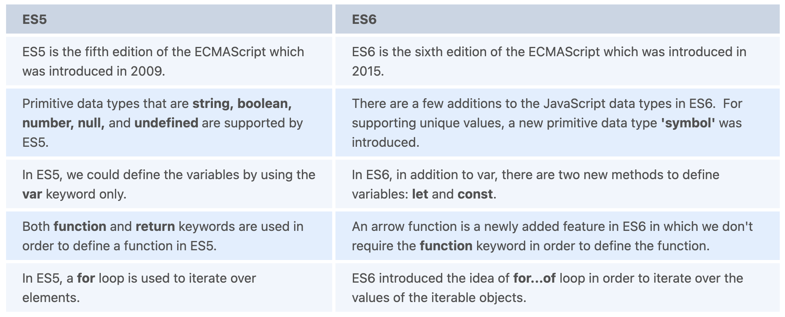

1.  What is the difference between let and const? What distinguishes both from var?
    + When declaring any variable in JavaScript, we used the var keyword. Var is a function scoped keyword. Within a function, we can access the variable. When we need to create a new scope, we wrap the code in a function.
    + Both let and const have block scope. If you use these keywords to declare a variable, it will only exist within the innermost block that surrounds them. If you declare a variable with let inside a block (for example, if a condition or a for-loop), it can only be accessed within that block.
    + The variables declared with the let keyword are mutable, which means that their values can be changed. It's akin to the var keyword, but with the added benefit of block scoping. The variables declared with the const keyword are block-scoped and immutable. When variables are declared with the const keyword, their value cannot be modified or reassigned.

2.  Discuss the arrow function.
    + In ES6, arrow functions are introduced. The shorthand syntax for writing ES6 functions is arrow functions. The arrow function's definition consists of parameters, followed by an arrow (=>), and the function's body.
    + The 'fat arrow' function is another name for the Arrow function. We won't be able to employ them as constructors.
      ```
      const function_name = (arg_1, arg_2, arg_3, ...) => {
          //body of the function
      }
      ```
    + `Few things to note`:
      + It reduces the size of the code.
      + For a single-line function, the return statement is optional.
      + Bind the context lexically.
      + For a single-line statement, functional braces are not required.
      + Doesn’t work with new

3.  When should one not use arrow functions?
    + `Function Hoisting, Named Functions`:
      + As arrow functions are anonymous, we cannot use them when we want function hoisting or when we want to use named functions.
    + `Object methods`:
      ```
      var a = {
        b: 7,
        func: () => {
          this.b--;
        }
      }
      ```
      + The value of b does not drop when you call a.func. It's because this isn't bound to anything and will inherit the value from its parent scope.
    + `Callback functions with dynamic context`:
      ```
      var btn = document.getElementById('clickMe');
      btn.addEventListener('click', () => {
        this.classList.toggle('on');
      });
      ```
      + We'd get a TypeError if we clicked the button. This is due to the fact that this is not bound to the button, but rather to its parent scope.
    + `this/arguments`:
      + Since arrow functions don’t have this/arguments of their own and they depend on their outer context, we cannot use them in cases where we need to use this/arguments in a function.

4.  What is the “spread” operator in ES6?
    + The list of parameters is obtained using the spread operator. Three dots (...) are used to represent it. The spread operator divides an iterable (such as an array or a string) into individual elements. It's mostly used in JavaScript to make shallow copies of JS. It improves the readability of your code by making it more concise.
    + The spread operator can be used to join two arrays together or to concatenate them.
      ```
      let arr1 = [4, 5, 6];

      let arr2 = [1, 2, 3, ...arr1, 7, 8, 9, 10];

      console.log(arr2);
      ```
      + Output: `[ 1 2 3 4 5 6 7 8 9 10 ]`

5.  Explain Destructuring in ES6.
    + Destructuring was introduced in ES6 as a way to extract data from arrays and objects into a single variable. It is possible to extract smaller fragments from objects and arrays using this method. The following is an example.
      ```
      let greeting =['Good','Morning'];
      let [g1, g2] = greeting;
      console.log (g1, g2);
      ```
      + Output: `Good Morning`

6.  What are Promises in ES6?
    + Asynchronous programming is a concept found in JavaScript. The processes are run separately from the main thread in asynchronous programming. Promises are the most convenient approach to deal with asynchronous programming in ES6. Depending on the outcome of the procedure, a promise can be refused or resolved. Callbacks were used to cope with asynchronous programming before promises were introduced in ES6.
    + However, it caused the problem of callback hell, which was addressed with the introduction of promises. (A callback is a function that is performed after another function has completed. When working with events in JavaScript, callback is very useful. As an argument to another function, we pass a function into another function.
    + When we use callbacks in our web applications, it's common for them to get nested. Excessive callback usage clogs up your web application and leads to callback hell.)

7.  Explain the Rest parameter in ES6.
    + It's a new feature in ES6 that enhances the ability to manage arguments. Indefinite arguments can be represented as an array using rest parameters. We can invoke a function with any number of parameters by utilizing the rest parameter.
      ```
      function display(...args) {
          let ans = 0;
          for (let i of args) {
              ans *= i;
          }
          console.log("Product = "+ans);
        }

        display(4, 2, 3);
      ```
      + Output: `Product = 24`

8.  Discuss the template literals in ES6.
    + Template literals are a brand-new feature in ES6. It makes producing multiline strings and performing string interpolation simple.
    + Template literals, also known as string literals, allow for embedded expressions.
    + Template literals were referred to as template strings prior to ES6. The backtick `(``)` character is used to enclose template literals. The dollar sign and curly brackets `(${expression})` are used to denote placeholders in template literals. If we need to use an expression within the backticks, we can put it in the `(${expression})` variable.
      ```
      let s1 = "Good";
      let s2 = "Day";

      let s = `${s1} ${s2}`;
      console.log(s);
      ```
      + Output: `Good Day`

9.  Why should one use ES6 classes?
    + Developers have discovered that ES6 classes are really handy. The following are some of the most common applications of ES6 classes:
      + The syntax of ES6 classes is simpler and less prone to errors.
      + When it comes to building up inheritance hierarchies, ES6 is the ideal option because it combines new and old syntax, reducing errors and simplifying the process.
      + ES6 classes prevent developers from making mistakes when using a new operator. If this proves to be an invalid object for the constructor, classes eliminate this issue by having the constructor throw an exception.
      + Classes can also be used to call a method from the prototype's version. With the new ES6 syntax, this version is significantly easier to use than previous versions.

10. How can you create a class in ES6?
    + The keyword class is used to create a class in ES6. We can use class expressions or class declarations to include classes in our code. Only functions and constructors are allowed in a class definition. These components are collectively referred to as the class's data members.
    + Constructors in classes are responsible for allocating memory to the class's objects. A class's functions are in charge of performing actions on the objects.
    + Syntax: In ES5
      + ` var varName = new className { }`
    + Syntax: In ES6 (Using class keyword)
      + ` class className{ }`

11. What is a class expression?
    + In ES6, one way to define a class is to use the Class expression. Class expressions, like function expressions, can be named or unnamed. If the class is named, the name is unique to the class body. Prototype-based inheritance is used in JavaScript classes.
      ```
      var Product = class {
          constructor (num1, num2) {
          this.num1 = num1;
          this.num2 = num2;
          }
          multiplication() {
          return this.num1 * this.num2;
          }
      }
      console.log(new Product(5,8).multiplication());
      // expected output: 40
      ```
      + The syntax of a class expression is similar to that of a class statement (declaration). Class expressions, on the other hand, allow you to omit the class name (“binding identifier”), which is not possible with class statements. Additionally, unlike class declarations, class expressions allow you to redefine/re-declare classes without causing any type errors. It is not required to use the constructor property. The type of classes created with this keyword will always be "function."

12. What do you understand about default parameters?
    + If no value or undefined is passed, we can use the default parameters to set default values for named parameters.
      ```
      var display = (x , y = 2) => {
          console.log(x + " " + y);
      }
      display(1);
      ```
      + Output: `1 2`

13. What do you understand about IIFE (Immediately Invoked Function Expressions)?
    +  IIFE is a JavaScript function that starts running as soon as it is defined. The Self-Executing Anonymous Function is another name for it. It is divided into two major sections, which are as follows:
       + The first part is a lexical scope (static scope) anonymous function that is enclosed by the Grouping operator ().
       + The IIFE, which is used by JavaScript, is created in the second part. The function will be directly interpreted by the engine.
          ```
          (func_()
          {
            console.log("Good Day");
          })();
          ```
          + Output: `Good Day`

14. What are the states of Promises in ES6?
    + Promises mainly possess three states as follows:
      + `Pending`: This refers to the initial state of every promise. It indicates that the result has not yet been computed.
      + `Fulfilled`: It refers to the completion of a task.
      + `Rejected`: It indicates the failure that arises during computation.
    + The promise will be immutable once it has been fulfilled or rejected. A rejected function and a resolve function are the two arguments passed into the Promise() constructor. It returns either the first or second parameter, depending on the asynchronous operation.

15. What is Export Default and Named Export in ES6?
    + With the help of the import statement, the export statement comes into picture when one needs to export functions, objects, and variables to other JavaScript modules. There are two methods for exporting:
      + Named Export: Named exports are useful when one has to export multiple values. The name of the imported module must match that of the exported module.
        ```
        //file rectangle.js
        function perimeter(x, y) {
          return 2 * (x + y);
        }
        function area(x, y) {
          return x * y;
        }
        export { perimeter, area };

        //while importing the functions in test.js
        import { perimeter, area } from './rectangle;
        console.log(perimeter(4, 6)) //20
        console.log(area(4, 6)) //24
        ```
        + Output:
          ```
          20
          24
          ```
      + Default Export: There is only one default export per module when it comes to default exports. A function, a class, an object, or anything else can be used as a default export. In default export, the naming of imports is fully autonomous, and we can choose any name we like.
        ```
        // file module.js
        var a = 6;
        export default a;

        // test.js
        // while importing a in test.js
        import b from './module';
        console.log(b);
        // output will be 6
        ```
        + Output: `6`
    + Using Named and Default Exports at the same time: In the same file, you can utilise both Named and Default exports. It means they'll both be imported into the same document.
      ```
      //index.js
      var a = 3;
      const b = 8;
      function show() {
        return "This is a default export."
      }
      function product(a , b) {
        return a * b;
      }
      export { show as default, a, b, product };
      //test.js file
      import any_other_name, { a, b, product} from './index.js';
      console.log(any_other_name()); //This is a default export.
      console.log(a); //3
      ```
      + Output:
        ```
        This is a default export.
        3
        ```

16. Which keyword can be used to deploy inheritance in ES6?
    + The extend keyword is used to implement inheritance in the ES6 language. There was no idea of classes in prior versions of Javascript, but with the release of ES6, Pure Object Oriented elements were added to the language.
      ```
      class Classroom {
          constructor(students) {
              this.students = students;
          }
          room() {
              console.log('This class has  ' + this.students + ' students');
          }
      }

      class sectionA extends Classroom {
          constructor(students) {
              super(students);
          }
          sec() {
              console.log('section A');
          }
      }

      let secA = new sectionA(40);

      secA.room();
      secA.sec();
      ```

17. What is Bubbling and Capturing?
    + When an event occurs on the DOM, it does not take place completely on one element. The event bubbles up or goes to its parent, grandparents, and grandparent's parent until it reaches the window in the Bubbling Phase, whereas the event starts out from window down to the element that prompted the event or the event target in the Capturing Phase.
    + There are three stages of event propagation:
      + `Capturing Phase`: the event begins with the window and progresses through each element until it reaches the target element.
      + `Target Phase`: The event has arrived at the target element.
      + `Bubbling Phase`: The event bubbles up from the target element and then up every element until it reaches the window.

18. What is the difference between for..of and for..in?
    + `for in`: runs over an object's enumerable property names.
    + `for of`: (new in ES6) takes an object-specific iterator and loops through the data it generates.
    + Both the for..of and for..in commands iterate over lists, but the results they return are different: for..in returns a list of keys on the object being iterated, whereas for..of returns a list of values of the object's numeric attributes.
      ```
      let arr = [3, 4, 5];

      for (let i in arr) {
        console.log(i); // "0", "1", "2",
      }

      for (let i of arr) {
        console.log(i); // "3", "4", "5"
      }
      ```

19. What is the reason behind adding Symbol to ES6?
    + Symbols are a new type of object that can be used as distinct property names in objects. Using Symbols instead of strings allows separate modules to create properties that are not mutually exclusive. Symbols can also be kept private, preventing anyone who does not have direct access to the Symbol from accessing its properties.
    + Symbols are a brand-new kind of primitive. Symbols, like numbers, strings, and booleans, have a function that can be used to produce them. Symbols, unlike the other primitives, do not have a literal syntax (similar to how strings have ") and can only be created using the Symbol constructor:
      + `let symbol = Symbol();`
      + In truth, Symbols are only a little different means of attaching properties to an object; the well-known Symbols could easily be provided as standard methods, just like Object.prototype.has Own Property which appears in anything that inherits from Object.

20. What is Babel?
    + `Babel`: is an open-source JavaScript transpiler that converts ECMAScript 2015+ (ES6+) code into a backwards compatible version of JavaScript that can be run by previous JavaScript engines. Babel is a popular tool for exploiting the JavaScript programming language's latest capabilities.
    + Babel plugins are used to convert syntax that isn't widely supported into a version that is backwards compatible. Arrow functions, for example, which are defined in ES6, are translated to ordinary function declarations. It's also possible to translate non-standard JavaScript syntax, such as JSX. Babel may automatically inject core-js polyfills for support capabilities that aren't available in JavaScript environments. Static methods like Array.from and built-ins like Promise, for example, are only accessible in ES6+, but they can be utilised in previous contexts by using core-js.

21. Name some array methods that were introduced in ES6.
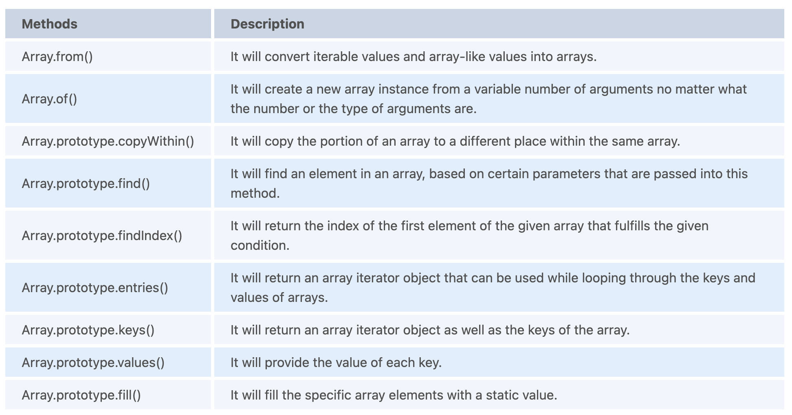

1.  Name some string functions introduced in ES6.
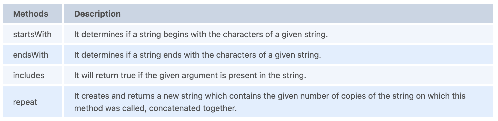

1.  Compare the ES5 and ES6 codes for object initialization and parsing returned objects.
    + `Object initialization`: Variables with the same name are frequently used to create object properties. Consider the following scenario:
      ```
      // ES5 code
      var
        x = 1, y = 2, z = 3;
        ob = {
          x : a,
          y : b,
          z : z
        };

      // ob.x = 1, ob.y = 2, ob.z = 3
      ```
      + In ES6, there's no need for tedious repetition!
        ```
        // ES6 code
        const
          x = 1, y = 2, z = 3;
          ob = {
            x
            y
            z
          };

        // ob.x = 1, ob.y = 2, ob.z = 3
        ```
    + `Parsing returned objects`: Only one value can be returned by a function, but that value could be an object with hundreds of properties and/or methods. In ES5, you must first get the returned object and then extract values from it. Consider the following scenario:
      ```
      // ES5 code
      var
        ob = getObject(),
        a = ob.a,
        b = ob.b,
        c = ob.c;
      ```
      + This is made easier by ES6 destructuring, which eliminates the need to keep the object as a variable:
        ```
        // ES6 code
        const { a , b , c } = getObject();
        ```

2.  How do you use Destructuring Assignment to swap variables?
    ```
    var a = 1, b = 2;

    [a, b] = [b, a];
    console.log(a); // 2
    console.log(b); // 1
    ```

3.  What is the result of the spread operator array shown below?
    + `[...'apple']`
    + Output: ['a', 'p', 'p', 'l', 'e']
    + Explanation: A string is an iterable type, and in an array, the spread operator transfers each character of an iterable to one element. As a result, each character in a string becomes an Array element.

4.  What is the Prototype Design Pattern?
    + The Prototype Pattern creates new objects, but instead of returning uninitialized objects, it returns objects with values copied from a prototype - or sample - object. The Properties pattern is another name for the Prototype pattern.
    + The initialization of business objects with values that match the database's default settings is an example of where the Prototype pattern comes in handy. The default values from the prototype object are replicated into a newly generated business object.
    + The Prototype pattern is rarely used in traditional languages, but JavaScript, as a prototypal language, employs it in the creation of new objects and prototypes.

5.  What is a WeakMap in ES6? How is it different from a Map?
    + The WeakMap is a collection of key/value pairs, just like the Map. The keys of WeakMap, on the other hand, must be objects, whereas the values can be anything. The object references in the keys are held weakly, which means that if there is no other reference to the object, it will be eligible for garbage collection. WeakMap, but not Map, permits the garbage collector to complete its duty. The array of keys would preserve references to key objects in manually constructed maps, prohibiting them from being garbage collected. References to key objects in native WeakMaps are held "weakly," which means they do not hinder garbage collection if there is no other reference to the object. The Map API and the WeakMap API are the same.
    + WeakMap keys, on the other hand, are not enumerable, unlike Map objects. There are also no methods that return a list of keys. If they were, the list would be non-deterministic because it would be dependent on the state of garbage collection. A Map should be used if we need a list of keys.

6.  What is the advantage of using the arrow syntax for a constructor method?
    + The main benefit of utilising an arrow function as a method within a constructor is that the value of this is set at the moment of function generation and cannot be changed later. As a result, whenever the constructor is used to create a new object, this refers to that object.
      ```
      const Shape = function(shapeName) {
        this.shapeName = shapeName;
        this.showName1 = function() { console.log(this.shapeName); };
        this.showName2 = () => { console.log(this.shapeName); };
      };

      const circle = new Shape('Circle');
      const square = new Shape('Square');

      circle.showName1(); // Circle
      circle.showName2(); // Square

      // The regular function can have its 'this' value changed, but the arrow function cannot
      circle.showName1.call(square); // Square (because "this" is now the square object)
      circle.showName2.call(square); // Circle

      circle.showName1.apply(square); // Square (because 'this' is now the square object)
      circle.showName2.apply(square); // Circle

      circle.showName1.bind(square)(); // Square (because 'this' is now the square object)
      circle.showName2.bind(square)(); // Circle

      var showNameFromPic1 = circle.showName1;
      sayNameFromPic1(); // undefined (because 'this' is now the pic object)

      var showNameFromPic2 = circle.showName2;
      showNameFromPic2(); // Circle
      ```
      + The major point here is that for a normal function, this can be modified, but for an arrow function, the context is always the same. You won't have to worry about the context changing if you pass your arrow function around to other areas of your application.

7.  What is a Temporal Dead Zone?
    + Variable Hoisting does not apply to let bindings in ES6, so let declarations do not rise to the top of the current execution context. A ReferenceError is thrown if the variable in the block is referenced before it is initialized (unlike a variable declared with var, which will just possess the undefined value). From the beginning of the block until the initialization is performed, the variable is in a "temporal dead zone."
      ```
      console.log(a); // undefined
      console.log(b); // causes ReferenceError: aLet is not defined
      var a = 1;
      let b = 2;
      ```

8.   What is the difference between Set and WeakSet in ES6?
     + `Set()`: By using the Set() class, users can define an array-like heterogeneous iterable object, which will consist of distinct values. The elements should not just be distinct by values but also by types. i.e. "2" and 2 will be considered as different.
       ```
       var set1= new Set([0, 1, 2]);

       set1.add(3); // 0, 1, 2, 3
       set1.add(2); // 0, 1, 2, 3
       set1.add({x:1, y:2}); // 0, 1, 2, {x:1, y:2}
       set1.add("Good"); // 0, 1, 2, {x:1, y:2}, 'Good'

       set1.has("Hello"); // false
       set1.has("Good");  // true
       set1.delete("Good"); // 'Good' deleted
       set1.has("Good"); // false

       set1.size; // 4
       set1.clear(); // Set Cleared
       ```
     + `WeakSet()`: A WeakSet() is a collection that is similar to a Set because it retains unique values; but it can only hold Objects. If an object in your WeakSet has no other reference variables left, it will be removed automatically.
       ```
       var weakSet1 = new WeakSet([{x:1}]);
       var ob1 = {o:1};
       var ob2 = {o:2};

       weakSet1.has(ob1); //false
       weakSet1.add(ob1);
       weakSet1.add(ob2);
       weakSet1.has(ob2); // true
       delete ob1; // you can't delete objects in this way. Use scope to execute this.
       myWeakSet.has(ob1); // false, because you deleted ob1, so WeakSet releases it automatically
       myWeakSet.delete(ob2); // ob2 deleted from the set
       myWeakSet.add(1); // ERROR, no primitive value
       ```
      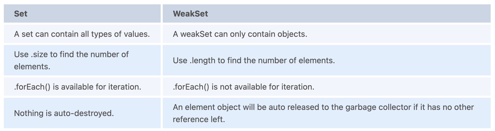

9.   What are Proxy in ES6?
     + The proxy objects are used to customize behaviour for basic operations like property lookup, assignment, enumeration, function invocation, etc.
     + For basic actions, the Proxy object is used to create custom behaviour (e.g. property lookup, assignment, enumeration, function invocation, etc).
     + We need to define three crucial terms:
       + `handler`:  a placeholder object that holds the trap(s)
       + `traps`: the method(s) that let you access a property.
       + `target`: the virtualized object by the proxy
       ```
       const handle = {
         get: function(ob, prp) {
           return prp in ob ?
             ob[prp] :
             37;
         }
       };

       const x = new Proxy({}, handle);
       x.a = 2;
       x.b = undefined;

       console.log(x.a, x.b);
       //  2, undefined

       console.log('c' in x, x.c);
       //  false, 37
       ```
     + Proxies have a wide range of real-world applications.
       + validation
       + correction in value
       + extensions for property lookup
       + property accesses are being tracked
       + references that can be revoked
       + implementation of the DOM in JavaScript

10.  What is the difference between const and Object.freeze()?
     + Const is a property that applies to bindings ("variables"). It creates an immutable binding, which means you can't change its value.
       ```
       const a = {
           b: "apple"
       };
       let c = {
           d: "mango"
       };
       a = c; // ERROR "a" is read-only
       ```
     + Object.freeze() is a function that works with values, primarily object values. It makes an object immutable, meaning that its properties cannot be changed.
     + freeze() returns the same object that was supplied to it as a parameter. It does not make a frozen copy. If the parameter to this method is not an object (a primitive) in ES5, a TypeError will occur. A non-object argument in ES6 will be treated as if it were a frozen regular object and will be returned.
       ```
       let a = {
           b: "apple"
       };
       let c = {
           d: "mango"
       };
       Object.freeze(a);
       a.b = "kiwi"; //TypeError: Cannot assign to read only property 'name' of object
       console.log(a);
       ```

11.  Why does the following not work as an IIFE (Immediately Invoked Function Expressions) ? What needs to be modified in order for it to be classified as an IIFE?
     + `function f(){ }();`
     + The JavaScript parser interprets the function f(){ }(); as function f(){ } and (); where the former is a function declaration while the latter (a pair of brackets) is an attempt to execute a function without specifying a name, resulting in Uncaught SyntaxError: Unexpected token ).
     + (function f(){ })() and (function f(){ }()) are two ways to fix it that involve adding more brackets. These functions are not available in the global scope, and you can even omit their names if you don't need to refer to them within the body.
     + You can also use the void operator: void function f(){ }(); .However, there is a drawback in this strategy. Because the evaluation of a given expression is always undefined, you can't use your IIFE function if it returns anything. Consider the following scenario:
       ```
       // Don't add JS syntax to this code block to prevent Prettier from formatting it.
       const f = void
       function b() {
           return 'f';
       }();

       console.log(f); // undefined
       ```

12.  Explain Internationalization and Localization.
     + These are JavaScript standard APIs that assist with operations such as collation, number formatting, currency formatting, and date and time formatting.
       + `Collation`: It is a method for searching and sorting strings within a collection. It has a locale argument and is Unicode-aware.
       + `Number Formatting`: Localized separators and digit grouping can be used to format numbers. Style formatting, numeral system, percent, and precision are among the other items.
       + `Currency formatting`: Currency symbols, localized separators, and digit grouping are the most common ways to format numbers.
       + `Date and time formatting`: Localized separators and ordering are used for formatting. The format can be short or long, and other characteristics such as location and time zone can be included.


100. What is Webpack?
     + `Webpack`: is a tool for bundling JavaScript files for usage in browsers. Webpack analyses the application and generates the bundles by creating a dependency graph that maps each module of the project required. It enables you to execute the environment that was hosted by Babel. A web pack has the advantage of combining numerous modules and packs into a single JavaScript file. It includes a dev server, which aids with code updates and asset management.
       + folder_name/index.js
         ```
         import bar from './func.js';
         func();
         ```
       + folder_name/func.js
         ```
         export default function func() {
           // body of the function
         }
         ```
       + Bundle it: Either provide with custom webpack.config.js or without config:
         ```
         const path = require('path');

         module.exports = {
           entry: './folder_name/index.js',
           output: {
             path: path.resolve(__dirname, 'dict'),
             filename: 'bundle.js',
           },
         };
         ```
       + page.html
         ```
         <!DOCTYPE html>
         <html>
           <head>
             <meta charset="utf-8" />
             ...
           </head>
           <body>
             ...
             <script src="dict/bundle.js"></script>
           </body>
         </html>
         ```
         + You, then, need to run the webpack on the command-line in order to create bundle.js.
