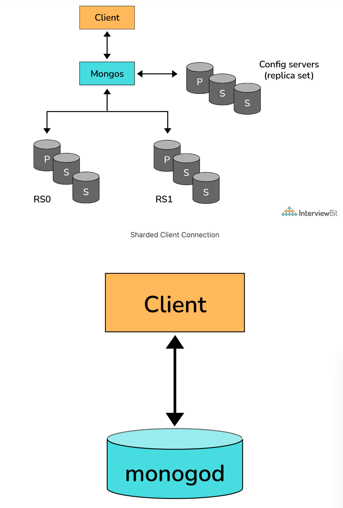
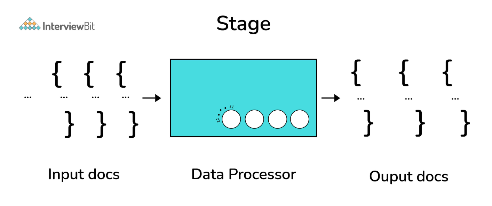

# MongoDB Interview Questions

---

1. What are some of the advantages of MongoDB?
   + supports field, range-based, string pattern matching type queries. for searching the data in the database
   + supports primary and secondary index on any fields
   + uses JavaScript objects in place of procedures
   + dynamic database schema
   + easy to scale up or down
   + inbuilt support for data partitioning (Sharding).

2. What is a Document in MongoDB?
   + `Document`: an ordered set of keys with associated values. It is represented by a map, hash, or dictionary. In JavaScript, documents are represented as objects:
     + `{"greeting" : "Hello world!"}`
   + Complex documents will contain multiple key/value pairs:
     + `{"greeting" : "Hello world!", "views" : 3}`

3. What is a Collection in MongoDB?
   + `Collection`: a group of documents. If a document is the MongoDB analog of a row in a relational database, then a collection can be thought of as the analog to a table.
     + Documents within a single collection can have any number of different “shapes.”, i.e. collections have dynamic schemas.
     + For example, both of the following documents could be stored in a single collection:
       ```
       {"greeting" : "Hello world!", "views": 3}
       {"signoff": "Good bye"}
       ```

4. What are Databases in MongoDB?
   + `Databases`: groups of collections. MongoDB can host several databases, each grouping together collections.
   + Some reserved database names are as follows:
     + admin
     + local
     + config

5. What is the Mongo Shell?
   + `Mongo Shell`: a JavaScript shell that allows interaction with a MongoDB instance from the command line. With that one can perform administrative functions, inspecting an instance, or exploring MongoDB.
   + To start the shell, run the mongo executable:
     ```
     $ mongod
     $ mongo
     MongoDB shell version: 4.2.0
     connecting to: test
     >
     ```
   + The shell is a full-featured JavaScript interpreter, capable of running arbitrary JavaScript programs. Let’s see how basic math works on this:
     ```
     > x = 100;
     200
     > x / 5;
     20
     ```

6. How does Scale-Out occur in MongoDB?
   + The document-oriented data model of MongoDB makes it easier to split data across multiple servers. Balancing and loading data across a cluster is done by MongoDB. It then redistributes documents automatically.
   + The mongos acts as a query router, providing an interface between client applications and the sharded cluster.
   + Config servers store metadata and configuration settings for the cluster. MongoDB uses the config servers to manage distributed locks. Each sharded cluster must have its own config servers.
   

7. What are some features of MongoDB?
   + `Indexing`: supports generic secondary indexes and provides unique, compound, geospatial, and full-text indexing capabilities as well.
   + `Aggregation`: provides an aggregation framework based on the concept of data processing pipelines.
   + `Special collection and index types`: supports time-to-live (TTL) collections for data that should expire at a certain time
   + `File storage`: supports an easy-to-use protocol for storing large files and file metadata.
   + `Sharding`: the process of splitting data up across machines.

8. How do you insert data in MongoDB?
   + `Insert`: the basic method for adding data to MongoDB is “inserts”. To insert a single document, use the collection’s insertOne method:
     + `> db.books.insertOne({"title" : "Start With Why"})`
   + For inserting multiple documents into a collection, we use insertMany. This method enables passing an array of documents to the database.

9.  How do you Update a Document?
    + `Update`: once a document is stored in the database, it can be changed using one of several update methods: updateOne, updateMany, and replaceOne. updateOne and updateMany each takes a filter document as their first parameter and a modifier document, which describes changes to make, as the second parameter. replaceOne also takes a filter as the first parameter, but as the second parameter replaceOne expects a document with which it will replace the document matching the filter.
    + For example, in order to replace a document:
      ```
      {
        "_id" : ObjectId("4b2b9f67a1f631733d917a7a"),
        "name" : "alice",
        "friends" : 24,
        "enemies" : 2
      }
      ```

10. How do you Delete a Document?
    + `Delete`: in MongoDB provides deleteOne and deleteMany for this purpose. Both of these methods take a filter document as their first parameter. The filter specifies a set of criteria to match against in removing documents.
      + `> db.books.deleteOne({"_id" : 3})`

11. How to perform queries in MongoDB?
    + `Find`: used to perform queries in MongoDB. Querying returns a subset of documents in a collection, from no documents at all to the entire collection. Which documents get returned is determined by the first argument to find, which is a document specifying the query criteria.
      + `> db.users.find({"age" : 24})`

12. What are the data types in MongoDB?
    + MongoDB supports a wide range of data types as values in documents. Documents in MongoDB are similar to objects in JavaScript. Along with JSON’s essential key/value–pair nature, MongoDB adds support for a number of additional data types. The common data types in MongoDB are:
      + `Null`: `{"x" : null}`
      + `Boolean`: `{"x" : true}`
      + `Number`: `{"x" : 4}`
      + `String`: `{"x" : "foobar"}`
      + `Date`: `{"x" : new Date()}`
      + `Regular Expression`: `{"x" : /foobar/i}`
      + `Array`: `{"x" : ["a", "b", "c"]}`
      + `Embedded Document`: `{"x" : {"foo" : "bar"}}`
      + `Object ID`: `{"x" : ObjectId()}`
      + `Binary Data`: Binary data is a string of arbitrary bytes.
      + `Code`: `{"x" : function() { /* ... */ }}`

13. When should you use MongoDB?
    + You should use MongoDB when you are building internet and business applications that need to evolve quickly and scale elegantly. MongoDB is popular with developers of all kinds who are building scalable applications using agile methodologies.
    + `MongoDB is a great choice if one needs to`:
      + Support a rapid iterative development.
      + Scale to high levels of read and write traffic - MongoDB supports horizontal scaling through Sharding, distributing data across several machines, and facilitating high throughput operations with large sets of data.
      + Scale your data repository to a massive size.
      + Evolve the type of deployment as the business changes.
      + Store, manage and search data with text, geospatial, or time-series dimensions.

14. How is Querying done in MongoDB?
    + `Find`: used to perform queries in MongoDB. Querying returns a subset of documents in a collection, from no documents at all to the entire collection. Which documents get returned is determined by the first argument to find, which is a document specifying the query criteria.
    + If we have a string we want to match, such as a "username" key with the value "alice", we use that key/value pair instead:
      + `> db.users.find({"username" : "alice"})`

15. Explain the term “Indexing” in MongoDB.
    + `Indexing`: help in efficiently resolving queries. What an Index does is that it stores a small part of the data set in a form that is easy to traverse. The index stores the value of the specific field or set of fields, ordered by the value of the field as specified in the index. MongoDB’s indexes work almost identically to typical relational database indexes.
    + Indexes look at an ordered list with references to the content. These in turn allow MongoDB to query orders of magnitude faster. To create an index, use the createIndex collection method.
      + `> db.users.find({"username": "user101"}).explain("executionStats")`
        + Here, executionStats mode helps us understand the effect of using an index to satisfy queries.

16. What are Geospatial Indexes in MongoDB?
    + MongoDB has two types of geospatial indexes:
      + `2dsphere`: indexes work with spherical geometries that model the surface of the earth based on the WGS84 datum. This datum model the surface of the earth as an oblate spheroid, meaning that there is some flattening at the poles. Distance calculations using 2sphere indexes, therefore, take the shape of the earth into account and provide a more accurate treatment of distance between, for example, two cities, than do 2d indexes.
      + `2d`: indexes for points stored on a two-dimensional plane.
    + 2dsphere allows you to specify geometries for points, lines, and polygons in the GeoJSON format. A point is given by a two-element array, representing [longitude, latitude]:
      ```
      {
        "name" : "New York City",
        "loc" : {
            "type" : "Point",
            "coordinates" : [50, 2]
        }
      }
      ```
    + A line is given by an array of points:
      ```
      {
        "name" : "Hudson River",
        "loc" : {
            "type" : "LineString",
            "coordinates" : [[0,1], [0,2], [1,2]]
        }
      }
      ```

17. Explain the process of Sharding.
    + `Sharding`: the process of splitting data up across machines. We also use the term “partitioning” sometimes to describe this concept. We can store more data and handle more load without requiring larger or more powerful machines, by putting a subset of data on each machine.
      + In the figure below, RS0 and RS1 are shards. MongoDB’s sharding allows you to create a cluster of many machines (shards) and break up a collection across them, putting a subset of data on each shard. This allows your application to grow beyond the resource limits of a standalone server or replica set.
        

18. Explain the SET Modifier in MongoDB?
    + `$set`: if the value of a field does not yet exist, this sets the value. This can be useful for updating schemas or adding user-defined keys.
      ```
      > db.users.findOne()
      {
        "_id" : ObjectId("4b253b067525f35f94b60a31"),
        "name" : "alice",
        "age" : 23,
        "sex" : "female",
        "location" : "India"
      }
      ```
      + To add a field to this, we use “$set”:
        ```
        > db.users.updateOne({"_id" :
        ObjectId("4b253b067525f35f94b60a31")},
        ... {"$set" : {"favorite book" : "Start with Why"}})
        ```

19. What do you mean by Transactions?
    + `Transactions`: a logical unit of processing in a database that includes one or more database operations, which can be read or write operations. Transactions provide a useful feature in MongoDB to ensure consistency.
    + MongoDB provides two APIs to use transactions:
      + `Core API`: a similar syntax to relational databases (e.g., start_transaction and commit_transaction)
      + `Call-back API`: he recommended approach to using transactions. It starts a transaction, executes the specified operations, and commits (or aborts on the error). It also automatically incorporates error handling logic for "TransientTransactionError" and "UnknownTransactionCommitResult".

20. What are MongoDB Charts?
    + `MongoDB Charts`: a new, integrated tool in MongoDB for data visualization.
      + Offers the best way to create visualizations using data from a MongoDB database.
      + It allows users to perform quick data representation from a database without writing code in a programming language such as Java or Python.
    + The two different implementations of MongoDB Charts are:
      + MongoDB Charts PaaS (Platform as a Service)
      + MongoDB Charts Server

21. What is the Aggregation Framework in MongoDB?
    + `Aggregation Framework`: a set of analytics tools within MongoDB that allow you to do analytics on documents in one or more collections.
      + The aggregation framework is based on the concept of a pipeline. With an aggregation pipeline, we take input from a MongoDB collection and pass the documents from that collection through one or more stages, each of which performs a different operation on its inputs (See figure below). Each stage takes as input whatever the stage before it produced as output. The inputs and outputs for all stages are documents—a stream of documents.
      

22. Explain the concept of pipeline in the MongoDB aggregation framework.
    + `Pipeline`: an individual stage of an aggregation pipeline is a data processing unit. It takes in a stream of input documents one at a time, processes each document one at a time, and produces an output stream of documents one at a time (see figure below).
      

23. What is a Replica Set in MongoDB?
    + `Replica Set`: to keep identical copies of your data on multiple servers, we use replication. It is recommended for all production deployments. Use replication to keep your application running and your data safe, even if something happens to one or more of your servers.
    + Such replication can be created by a replica set with MongoDB. A replica set is a group of servers with one primary, the server taking writes, and multiple secondaries, servers that keep copies of the primary’s data. If the primary crashes, the secondaries can elect a new primary from amongst themselves.

24. Explain the Replication Architecture in MongoDB.
    + The following diagram depicts the architecture diagram of a simple replica set cluster with only three server nodes  one primary node and two secondary nodes:
      
        + In the preceding model, the PRIMARY database is the only active replica set member that receives write operations from database clients. The PRIMARY database saves data changes in the Oplog. Changes saved in the Oplog are sequential—that is, saved in the order that they are received and executed.
        + The SECONDARY database is querying the PRIMARY database for new changes in the Oplog. If there are any changes, then Oplog entries are copied from PRIMARY to SECONDARY as soon as they are created on the PRIMARY node.
        + Then, the SECONDARY database applies changes from the Oplog to its own datafiles. Oplog entries are applied in the same order they were inserted in the log. As a result, datafiles on SECONDARY are kept in sync with changes on PRIMARY.
        + Usually, SECONDARY databases copy data changes directly from PRIMARY. Sometimes a SECONDARY database can replicate data from another SECONDARY. This type of replication is called Chained Replication because it is a two-step replication process. Chained replication is useful in certain replication topologies, and it is enabled by default in MongoDB.

25. What are some utilities for backup and restore in MongoDB?
    + The mongo shell does not include functions for exporting, importing, backup, or restore. However, MongoDB has created methods for accomplishing this, so that no scripting work or complex GUIs are needed. For this, several utility scripts are provided that can be used to get data in or out of the database in bulk. These utility scripts are:
      + mongoimport
      + mongoexport
      + mongodump
      + mongorestore
