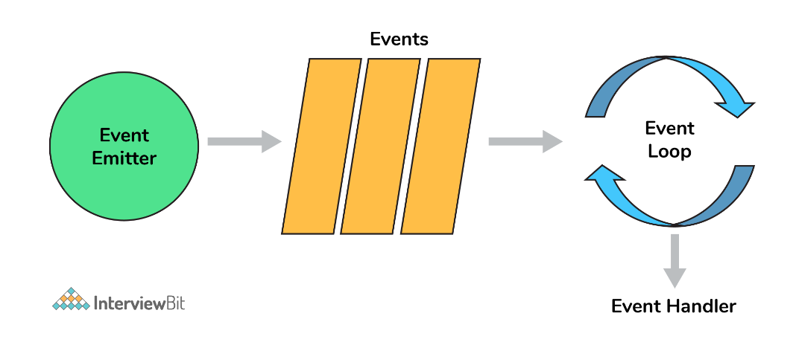
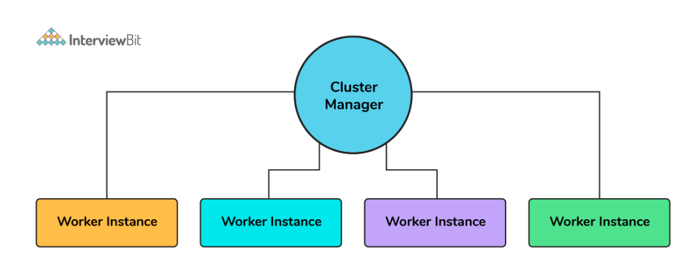
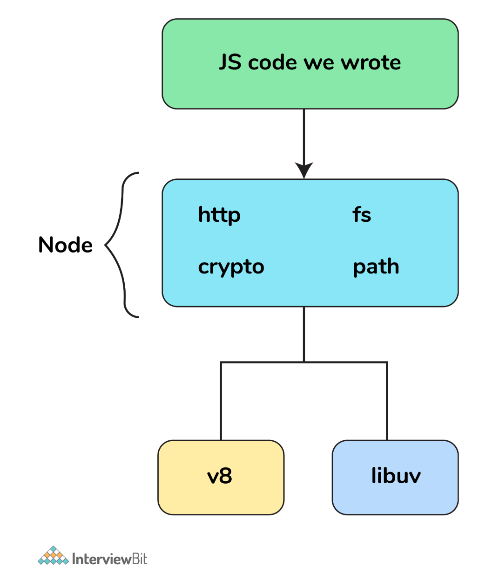

# Node.js Interview Questions

---

1. What is a first class function in Javascript?
   + When functions can be treated like any other variable then those functions are first-class functions. There are many other programming languages, for example, scala, Haskell, etc which follow this including JS. Now because of this function can be passed as a param to another function(callback) or a function can return another function(higher-order function). map() and filter() are higher-order functions that are popularly used.

2. What is Node.js and how it works?
   + Node.js is a virtual machine that uses JavaScript as its scripting language and runs Chrome’s V8 JavaScript engine. Basically, Node.js is based on an event-driven architecture where I/O runs asynchronously making it lightweight and efficient. It is being used in developing desktop applications as well with a popular framework called electron as it provides API to access OS-level features such as file system, network, etc.

3. How do you manage packages in your node.js project?
   + It can be managed by a number of package installers and their configuration file accordingly. Out of them mostly use npm or yarn. Both provide almost all libraries of javascript with extended features of controlling environment-specific configurations. To maintain versions of libs being installed in a project we use package.json and package-lock.json so that there is no issue in porting that app to a different environment.

4. How is Node.js better than other frameworks most popularly used?
   + Node.js provides simplicity in development because of its non-blocking I/O and even-based model results in short response time and concurrent processing, unlike other frameworks where developers have to use thread management.
   + It runs on a chrome v8 engine which is written in c++ and is highly performant with constant improvement.
   + Also since we will use Javascript in both the frontend and backend the development will be much faster.
   + There are ample libraries so that we don’t need to reinvent the wheel.

5. Explain the steps how “Control Flow” controls the functions calls?
   + Control the order of execution
   + Collect data
   + Limit concurrency
   + Call the following step in the program.

6. What are some commonly used timing features of Node.js?
   + `setTimeout/clearTimeout`: This is used to implement delays in code execution.
   + `setInterval/clearInterval`: This is used to run a code block multiple times.
   + `setImmediate/clearImmediate`: Any function passed as the setImmediate() argument is a callback that's executed in the next iteration of the event loop.
   + `process.nextTick`: Both setImmediate and process.nextTick appear to be doing the same thing; however, you may prefer one over the other depending on your callback’s urgency.

7. What are the advantages of using promises instead of callbacks?
   + The main advantage of using promise is you get an object to decide the action that needs to be taken after the async task completes. This gives more manageable code and avoids callback hell.

8. What is fork in node JS?
   + A fork in general is used to spawn child processes. In node it is used to create a new instance of v8 engine to run multiple workers to execute the code.

9.  Why is Node.js single-threaded?
    + Node.js was created explicitly as an experiment in async processing. This was to try a new theory of doing async processing on a single thread over the existing thread-based implementation of scaling via different frameworks.

10. How do you create a simple server in Node.js that returns Hello World?
    ```
    var http = require("http");
    http.createServer(function (request, response) {
      response.writeHead(200, {'Content-Type': 'text/plain'});
      response.end('Hello World\n');
    }).listen(3000);

    ```

11. How many types of API functions are there in Node.js?
    + There are two types of API functions:
      + `Asynchronous, non-blocking functions` - mostly I/O operations which can be fork out of the main loop.
      + `Synchronous, blocking functions` - mostly operations that influence the process running in the main loop.

12. What is REPL?
    + `REPL`: in Node.js stands for Read, Eval, Print, and Loop, which further means evaluating code on the go.

13. List down the two arguments that async.queue takes as input?
    + Task Function
    + Concurrency Value

14. What is the purpose of module.exports?
    + This is used to expose functions of a particular module or file to be used elsewhere in the project. This can be used to encapsulate all similar functions in a file which further improves the project structure.
      + For example, you have a file for all utils functions with util to get solutions in a different programming language of a problem statement.
        ```
        const getSolutionInJavaScript = async ({
          problem_id
        }) => {
        ...
        };
        const getSolutionInPython = async ({
          problem_id
        }) => {
        ...
        };
        module.exports = { getSolutionInJavaScript, getSolutionInPython }
        ```
        + Thus using module.exports we can use these functions in some other file:
          + `const { getSolutionInJavaScript, getSolutionInPython} = require("./utils")`

15. What tools can be used to assure consistent code style?
    + ESLint can be used with any IDE to ensure a consistent coding style which further helps in maintaining the codebase.

16. What do you understand by callback hell?
      ```
      async_A(function(){
        async_B(function(){
            async_C(function(){
                async_D(function(){
                ....
                });
            });
        });
      });
      ```
      + For the above example, we are passing callback functions and it makes the code unreadable and not maintainable, thus we should change the async logic to avoid this.

17.  What is an event-loop in Node JS?
     + Whatever that is async is managed by event-loop using a queue and listener.  We can get the idea using the following diagram:
       
     + So when an async function needs to be executed(or I/O) the main thread sends it to a different thread allowing v8 to keep executing the main code. Event loop involves different phases with specific tasks such as timers, pending callbacks, idle or prepare, poll, check, close callbacks with different FIFO queues. Also in between iterations it checks for async I/O or timers and shuts down cleanly if there aren't any.

18. If Node.js is single threaded then how does it handle concurrency?
    + The main loop is single-threaded and all async calls are managed by libuv library.
      + For example:
        ```
        const crypto = require("crypto");
        const start = Date.now();
        function logHashTime() {
          crypto.pbkdf2("a", "b", 100000, 512, "sha512", () => {
          console.log("Hash: ", Date.now() - start);
        });
        }
        logHashTime();
        logHashTime();
        logHashTime();
        logHashTime();
        ```
        + Output:
          ```
          Hash: 1213
          Hash: 1225
          Hash: 1212
          Hash: 1222
          ```
          + This is because libuv sets up a thread pool to handle such concurrency. How many threads will be there in the thread pool depends upon the number of cores but you can override this.

19. Differentiate between process.nextTick() and setImmediate()?
    + Both can be used to switch to an asynchronous mode of operation by listener functions.
    + `process.nextTick()` sets the callback to execute but setImmediate pushes the callback in the queue to be executed. So the event loop runs in the following manner
      + `timers–>pending callbacks–>idle,prepare–>connections(poll,data,etc)–>check–>close callbacks`
        + In this process.nextTick() method adds the callback function to the start of the next event queue and setImmediate() method to place the function in the check phase of the next event queue.

20. How does Node.js overcome the problem of blocking of I/O operations?
    + Since the node has an event loop that can be used to handle all the I/O operations in an asynchronous manner without blocking the main function.
    + So for example, if some network call needs to happen it will be scheduled in the event loop instead of the main thread(single thread). And if there are multiple such I/O calls each one will be queued accordingly to be executed separately(other than the main thread).
      + Thus even though we have single-threaded JS, I/O ops are handled in a nonblocking way.

21. How can we use async/await in node.js?
    ```
    // this code is to retry with exponential backoff
    function wait (timeout) {
      return new Promise((resolve) => {
        setTimeout(() => {
          resolve()
        }, timeout);
      });
    }
    async function requestWithRetry (url) {
      const MAX_RETRIES = 10;
      for (let i = 0; i <= MAX_RETRIES; i++) {
        try {
          return await request(url);
        } catch (err) {
          const timeout = Math.pow(2, i);
          console.log('Waiting', timeout, 'ms');
          await wait(timeout);
          console.log('Retrying', err.message, i);
        }
      }
    }
    ```

22. What is node.js streams?
    + Streams are instances of EventEmitter which can be used to work with streaming data in Node.js. They can be used for handling and manipulating streaming large files(videos, mp3, etc) over the network. They use buffers as their temporary storage.
    + There are mainly four types of the stream:
      + `Writable`: streams to which data can be written (for example, fs.createWriteStream()).
      + `Readable`: streams from which data can be read (for example, fs.createReadStream()).
      + `Duplex`: streams that are both Readable and Writable (for example, net.Socket).
      + `Transform`: Duplex streams that can modify or transform the data as it is written and read (for example, zlib.createDeflate()).

23. What are node.js buffers?
    + In general, buffers is a temporary memory that is mainly used by stream to hold on to some data until consumed. Buffers are introduced with additional use cases than JavaScript’s Unit8Array and are mainly used to represent a fixed-length sequence of bytes. This also supports legacy encodings like ASCII, utf-8, etc. It is a fixed(non-resizable) allocated memory outside the v8.

24. What is middleware?
    + `Middleware`: comes in between your request and business logic. It is mainly used to capture logs and enable rate limit, routing, authentication, basically whatever that is not a part of business logic. There are third-party middleware also such as body-parser and you can write your own middleware for a specific use case.

25. Explain what a Reactor Pattern in Node.js?
    + Reactor pattern again a pattern for nonblocking I/O operations. But in general, this is used in any event-driven architecture.
    + There are two components in this:
      + `Reactor`: Its job is to dispatch the I/O event to appropriate handlers
      + `Handler`: Its job is to actually work on those events

26. Why should you separate Express app and server?
    + The server is responsible for initializing the routes, middleware, and other application logic whereas the app has all the business logic which will be served by the routes initiated by the server. This ensures that the business logic is encapsulated and decoupled from the application logic which makes the project more readable and maintainable.

27. For Node.js, why Google uses V8 engine?
    + Well, are there any other options available? Yes, of course, we have Spidermonkey from Firefox, Chakra from Edge but Google’s v8 is the most evolved(since it’s open-source so there’s a huge community helping in developing features and fixing bugs) and fastest(since it’s written in c++) we got till now as a JavaScript and WebAssembly engine. And it is portable to almost every machine known.

28. Describe the exit codes of Node.js?
    + Exit codes give us an idea of how a process got terminated/the reason behind termination.
      + `Uncaught fatal exception - (code - 1)`: There has been an exception that is not handled
      + `Unused - (code - 2)`: This is reserved by bash
      + `Fatal Error - (code - 5)`: There has been an error in V8 with stderr output of the description
      + `Internal Exception handler Run-time failure - (code - 7)`: There has been an exception when bootstrapping function was called
      + `Internal JavaScript Evaluation Failure - (code - 4)`: There has been an exception when the bootstrapping process failed to return function value when evaluated.

29. Explain the concept of stub in Node.js?
    + Stubs are used in writing tests which are an important part of development. It replaces the whole function which is getting tested.
      + This helps in scenarios where we need to test:
        + External calls which make tests slow and difficult to write (e.g HTTP calls/ DB calls)
        + Triggering different outcomes for a piece of code (e.g. what happens if an error is thrown/ if it passes)
      ```
      const request = require('request');
      const getPhotosByAlbumId = (id) => {
      const requestUrl = `https://jsonplaceholder.typicode.com/albums/${id}/photos?_limit=3`;
      return new Promise((resolve, reject) => {
          request.get(requestUrl, (err, res, body) => {
              if (err) {
                  return reject(err);
              }
              resolve(JSON.parse(body));
          });
      });
      };
      module.exports = getPhotosByAlbumId;
      To test this function this is the stub
      const expect = require('chai').expect;
      const request = require('request');
      const sinon = require('sinon');
      const getPhotosByAlbumId = require('./index');
      describe('with Stub: getPhotosByAlbumId', () => {
      before(() => {
          sinon.stub(request, 'get')
              .yields(null, null, JSON.stringify([
                  {
                      "albumId": 1,
                      "id": 1,
                      "title": "A real photo 1",
                      "url": "https://via.placeholder.com/600/92c952",
                      "thumbnailUrl": "https://via.placeholder.com/150/92c952"
                  },
                  {
                      "albumId": 1,
                      "id": 2,
                      "title": "A real photo 2",
                      "url": "https://via.placeholder.com/600/771796",
                      "thumbnailUrl": "https://via.placeholder.com/150/771796"
                  },
                  {
                      "albumId": 1,
                      "id": 3,
                      "title": "A real photo 3",
                      "url": "https://via.placeholder.com/600/24f355",
                      "thumbnailUrl": "https://via.placeholder.com/150/24f355"
                  }
              ]));
      });
      after(() => {
          request.get.restore();
      });
      it('should getPhotosByAlbumId', (done) => {
          getPhotosByAlbumId(1).then((photos) => {
              expect(photos.length).to.equal(3);
              photos.forEach(photo => {
                  expect(photo).to.have.property('id');
                  expect(photo).to.have.property('title');
                  expect(photo).to.have.property('url');
              });
              done();
          });
      });
      });
      ```

30. What is an Event Emitter in Node.js?
    + `EventEmitter`: is a Node.js class that includes all the objects that are basically capable of emitting events. This can be done by attaching named events that are emitted by the object using an eventEmitter.on() function. Thus whenever this object throws an even the attached functions are invoked synchronously.
      ```
      const EventEmitter = require('events');
      class MyEmitter extends EventEmitter {}
      const myEmitter = new MyEmitter();
      myEmitter.on('event', () => {
        console.log('an event occurred!');
      });
      myEmitter.emit('event');
      ```

31. Enhancing Node.js performance through clustering.
    + Node.js applications run on a single processor, which means that by default they don’t take advantage of a multiple-core system. Cluster mode is used to start up multiple node.js processes thereby having multiple instances of the event loop. When we start using cluster in a nodejs app behind the scene multiple node.js processes are created but there is also a parent process called the cluster manager which is responsible for monitoring the health of the individual instances of our application.
    

32. What is a thread pool and which library handles it in Node.js?
    + The Thread pool is handled by the libuv library. libuv is a multi-platform C library that provides support for asynchronous I/O-based operations such as file systems, networking, and concurrency.
    

33. What is WASI and why is it being introduced?
    + Web assembly provides an implementation of WebAssembly System Interface specification through WASI API in node.js implemented using WASI class. The introduction of WASI was done by keeping in mind its possible to use the underlying operating system via a collection of POSIX-like functions thus further enabling the application to use resources more efficiently and features that require system-level access.

34. How are worker threads different from clusters?
    + `Cluster`:
      + There is one process on each CPU with an IPC to communicate.
      + In case we want to have multiple servers accepting HTTP requests via a single port, clusters can be helpful.
      + The processes are spawned in each CPU thus will have separate memory and node instance which further will lead to memory issues.
    + `Worker threads`:
      + There is only one process in total with multiple threads.
      + Each thread has one Node instance (one event loop, one JS engine) with most of the APIs accessible.
      + Shares memory with other threads (e.g. SharedArrayBuffer)
      + This can be used for CPU-intensive tasks like processing data or accessing the file system since NodeJS is single-threaded, synchronous tasks can be made more efficient leveraging the worker's threads.

35. How to measure the duration of async operations?
    + Performance API provides us with tools to figure out the necessary performance metrics. A simple example would be using async_hooks and perf_hooks.
      ```
      'use strict';
      const async_hooks = require('async_hooks');
      const {
        performance,
        PerformanceObserver
      } = require('perf_hooks');
      const set = new Set();
      const hook = async_hooks.createHook({
      init(id, type) {
        if (type === 'Timeout') {
          performance.mark(`Timeout-${id}-Init`);
          set.add(id);
        }
      },
      destroy(id) {
        if (set.has(id)) {
          set.delete(id);
          performance.mark(`Timeout-${id}-Destroy`);
          performance.measure(
            `Timeout-${id}`,
            `Timeout-${id}-Init`,
            `Timeout-${id}-Destroy`
          );
        }
      }
      });
      hook.enable();
      const obs = new PerformanceObserver((list, observer) => {
        console.log(list.getEntries()[0]);
        performance.clearMarks();
        observer.disconnect();
      });
      obs.observe({ entryTypes: ['measure'], buffered: true });
      setTimeout(() => {}, 1000);
      ```
      + This would give us the exact time it took to execute the callback.

36. How to measure the performance of async operations?
    + Performance API provides us with tools to figure out the necessary performance metrics.
      ```
      const { PerformanceObserver, performance } = require('perf_hooks');
      const obs = new PerformanceObserver((items) => {
        console.log(items.getEntries()[0].duration);
        performance.clearMarks();
      });
      obs.observe({ entryTypes: ['measure'] });
      performance.measure('Start to Now');
      performance.mark('A');
      doSomeLongRunningProcess(() => {
        performance.measure('A to Now', 'A');
        performance.mark('B');
        performance.measure('A to B', 'A', 'B');
      });
      ```
