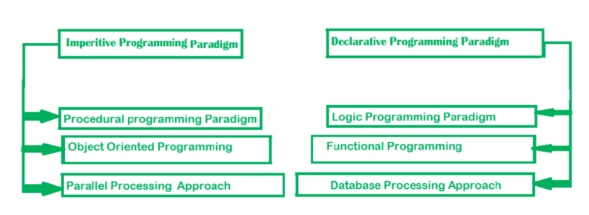
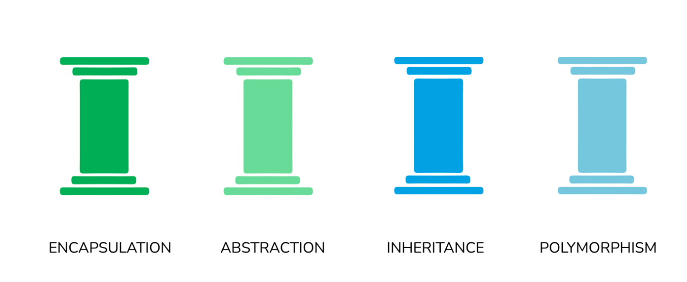
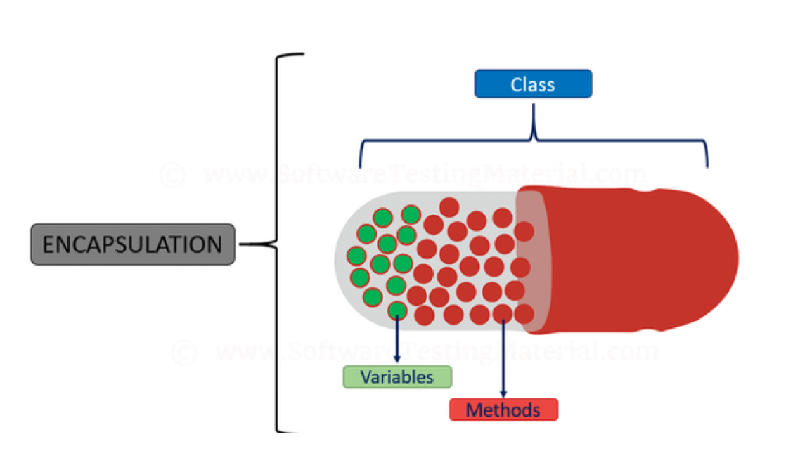
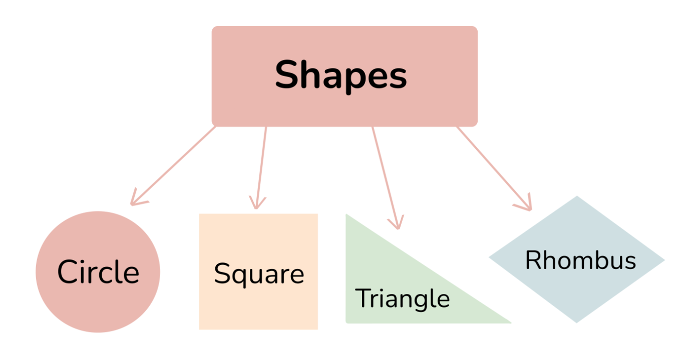
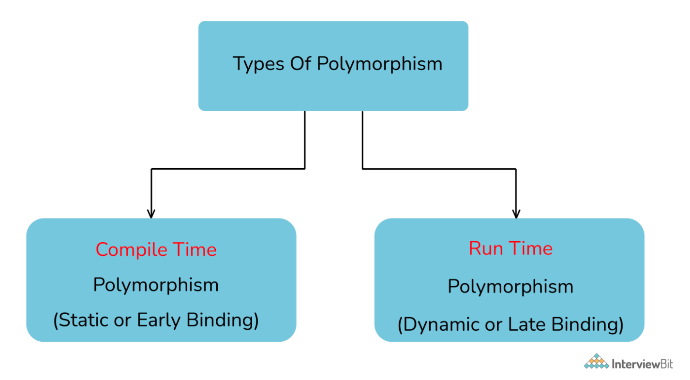
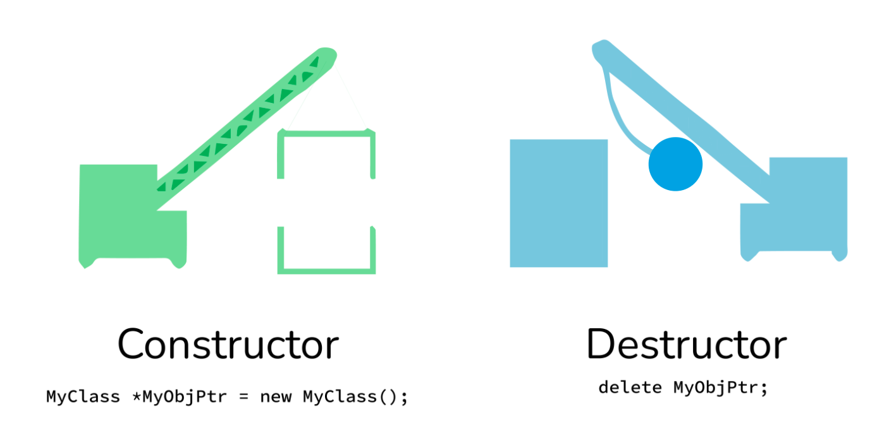
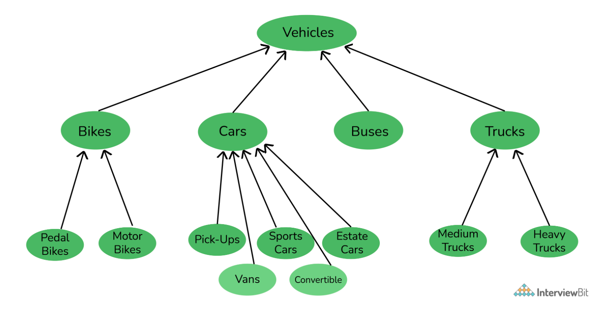
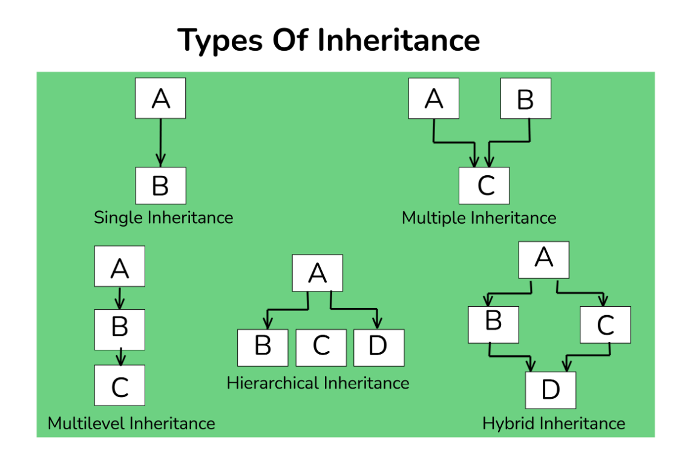
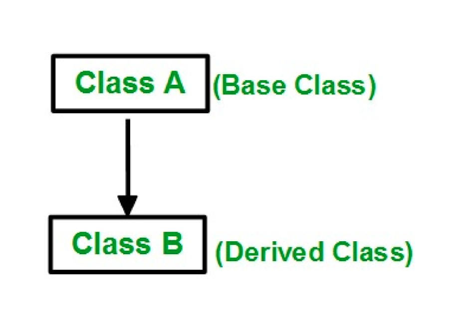

# Object Oriented Programming (OOPs) Interview Questions

---

## Background
OOPs, or Object-Oriented Programming is a programming model or paradigm which revolves around the concept of “OBJECTS”. Objects can be considered as real-world instances of entities like class, that contain some characteristics and behaviors specified in the class template.

In simple language, a class can be considered as the blueprint or template, based on which objects can be created. So the Objects are considered the instance of a class, and are therefore sometimes called “instances”. The term “characteristics” refers to the “what” about the Object, and the term “behavior” refers to the “how” about the Object.

For example, if we consider a car, then based on the OOPs model:

Class = A specific car model, such as Audi A4, BMW I8, Maruti Suzuki Vitara Brezza, etc.
Object = A specific car of any model, like the car you own
Characteristics = What is the color of your car? What is the Chassis number of your car? etc
Behavior = How to start the car? How to change the gear of the car? etc.
Characteristics are also known as data, attributes, or properties, and Behaviours are also known as the functions, procedures or methods, in the programming language.

The concept of “objects” allows the OOPs model to easily access, use and modify the instance data and methods, interact with other objects, and define methods in runtime (during the execution of the program). This gives the OOPs model significance and makes it diverse in its implementation.

In fact, the OOPs model is so popular, that many of the most widely used programming languages support and use this Object Oriented Programming or OOPs model, such as Java, C++, Python, C#, etc.

---

1. What is meant by the term Object-Oriented Programming (OOPs)?
   + `Object-Oriented Programming (OOPs)`: programming paradigm that is defined using objects. Objects can be considered as real-world instances of entities like class, that have some characteristics and behaviors.

2. What is the need for OOPs?
   + Helps users to understand the software easily, although they don’t know the actual implementation.
   + The readability, understandability, and maintainability of the code increase multifold.
   + Even very big software can be easily written and managed easily using OOPs.

3. What are some major Object Oriented Programming languages?
   + The programming languages that use and follow the Object-Oriented Programming paradigm or OOPs, are known as Object-Oriented Programming languages. Some of the major Object-Oriented Programming languages include:
     + Java
     + C++
     + JavaScript
     + Python
     + PHP
     + Many more!

4. What are some other programming paradigms other than OOPs?
   + `Programming paradigms`: method of classification of programming languages based on their features. There are mainly two types of Programming Paradigms:
     + `Imperative Programming Paradigm`: focuses on HOW to execute program logic and defines control flow as statements that change a program state. This can be further classified as:
       + `Procedural Programming Paradigm`: specifies the steps a program must take to reach the desired state, usually read in order from top to bottom.
       + `Object-Oriented Programming or OOP`: organizes programs as objects, that contain some data and have some behavior.
       + `Parallel Programming`: breaks a task into subtasks and focuses on executing them simultaneously at the same time.
     + `Declarative Programming Paradigm`: focuses on WHAT to execute and defines program logic, but not a detailed control flow. Declarative paradigm can be further classified into:
       + `Logical Programming Paradigm`: based on formal logic, which refers to a set of sentences expressing facts and rules about how to solve a problem
       + `Functional Programming Paradigm`: programs are constructed by applying and composing functions.
       + `Database Programming Paradigm`: used to manage data and information structured as fields, records, and files.
     

5. What is meant by Structured Programming?
   + `Structured Programming`: refers to the method of programming which consists of a completely structured control flow. Here structure refers to a block, which contains a set of rules, and has a definitive control flow, such as (if/then/else), (while and for), block structures, and subroutines.
     + Nearly all programming paradigms include Structured programming, including the OOPs model.

6. What are the main features of OOPs?
   + Inheritance
   + Encapsulation
   + Polymorphism
   + Data Abstraction
   

7. What are some advantages of using OOPs?
   + very helpful in solving very complex level of problems.
   + Highly complex programs can be created, handled, and maintained easily using object-oriented programming.
   + promotes code reuse, thereby reducing redundancy.
   + helps to hide the unnecessary details with the help of Data Abstraction.
   + based on a bottom-up approach, unlike the Structural programming paradigm, which uses a top-down approach.
   + Polymorphism offers a lot of flexibility in OOPs.

8. Why is OOPs so popular?
   + OOPs programming paradigm is considered as a better style of programming. Not only it helps in writing a complex piece of code easily, but it also allows users to handle and maintain them easily as well. Not only that, the main pillar of OOPs - Data Abstraction, Encapsulation, Inheritance, and Polymorphism, makes it easy for programmers to solve complex scenarios. As a result of these, OOPs is so popular.

9.  What is a class?
    + `Class`: a template or a blueprint, which contains some values, known as member data or member, and some set of rules, known as behaviors or functions. So when an object is created, it automatically takes the data and functions that are defined in the class.
    + Therefore the class is basically a template or blueprint for objects. Also one can create as many objects as they want based on a class.
      + For example, first, a car’s template is created. Then multiple units of car are created based on that template.

10. What is an object?
    + `Object`: the instance of the class, which contains the instance of the members and behaviors defined in the class template. In the real world, an object is an actual entity to which a user interacts, whereas class is just the blueprint for that object. So the objects consume space and have some characteristic behavior.
      + For example, a specific car.

11. What is encapsulation?
  
  + `Encapsulation`: the method of putting everything that is required to do the job, inside a capsule and presenting that capsule to the user. What it means is that by Encapsulation, all the necessary data and methods are bind together and all the unnecessary details are hidden to the normal user. So Encapsulation is the process of binding data members and methods of a program together to do a specific job, without revealing unnecessary details.
  + Encapsulation can also be defined in two different ways:
    + `Data hiding`: the process of hiding unwanted information, such as restricting access to any member of an object.
    + `Data binding`: the process of binding the data members and the methods together as a whole, as a class.

12. What is Polymorphism?
    + `Polymorphism`: Polymorphism refers to something that has many shapes. Composed of two words - “poly” which means “many”, and “morph” which means “shapes”.
      
    + In OOPs, Polymorphism refers to the process by which some code, data, method, or object behaves differently under different circumstances or contexts. Compile-time polymorphism and Run time polymorphism are the two types of polymorphisms in OOPs languages.

13. What is Compile time Polymorphism and how is it different from Runtime Polymorphism?
  
  + `Compile Time Polymorphism`: also known as Static Polymorphism, refers to the type of Polymorphism that happens at compile time. What it means is that the compiler decides what shape or value has to be taken by the entity in the picture.
    ```
    // In this program, we will see how multiple functions are created with the same name,
    // but the compiler decides which function to call easily at the compile time itself.
    class CompileTimePolymorphism{
      // 1st method with name add
      public int add(int x, int y){
      return x+y;
      }
      // 2nd method with name add
      public int add(int x, int y, int z){
      return x+y+z;
      }
      // 3rd method with name add
      public int add(double x, int y){
      return (int)x+y;
      }
      // 4th method with name add
      public int add(int x, double y){
      return x+(int)y;
      }
    }

    class Test{
      public static void main(String[] args){
      CompileTimePolymorphism demo=new CompileTimePolymorphism();
      // In the below statement, the Compiler looks at the argument types and decides to call method 1
      System.out.println(demo.add(2,3));
      // Similarly, in the below statement, the compiler calls method 2
      System.out.println(demo.add(2,3,4));
      // Similarly, in the below statement, the compiler calls method 4
      System.out.println(demo.add(2,3.4));
      // Similarly, in the below statement, the compiler calls method 3
      System.out.println(demo.add(2.5,3));
      }
    }
    ```
    + In the above example, there are four versions of add methods. The first method takes two parameters while the second one takes three. For the third and fourth methods, there is a change of order of parameters. The compiler looks at the method signature and decides which method to invoke for a particular method call at compile time.
  + `Runtime Polymorphism`: also known as Dynamic Polymorphism, refers to the type of Polymorphism that happens at the run time. What it means is it can't be decided by the compiler. Therefore what shape or value has to be taken depends upon the execution. Hence the name Runtime Polymorphism.
    ```
    class AnyVehicle{
      public void move(){
      System.out.println(“Any vehicle should move!!”);
      }
    }
    class Bike extends AnyVehicle{
      public void move(){
      System.out.println(“Bike can move too!!”);
      }
    }
    class Test{
      public static void main(String[] args){
      AnyVehicle vehicle = new Bike();
      // In the above statement, as you can see, the object vehicle is of type AnyVehicle
      // But the output of the below statement will be “Bike can move too!!”,
      // because the actual implementation of object ‘vehicle’ is decided during runtime vehicle.move();
      vehicle = new AnyVehicle();
      // Now, the output of the below statement will be “Any vehicle should move!!”,
      vehicle.move();
      }
    }
    ```
    + As the method to call is determined at runtime, as shown in the above code, this is called runtime polymorphism.

14. How does C++ support Polymorphism?
    + `Compile Time Polymorphism`: C++ supports compile-time polymorphism with the help of features like templates, function overloading, and default arguments.
    + `Runtime Polymorphism`: C++ supports Runtime polymorphism with the help of features like virtual functions. Virtual functions take the shape of the functions based on the type of object in reference and are resolved at runtime.

15. What is meant by Inheritance?
    + `Inheritance`: “receiving some quality or behavior from a parent to an offspring.” In object-oriented programming, inheritance is the mechanism by which an object or class (referred to as a child) is created using the definition of another object or class (referred to as a parent). Inheritance not only helps to keep the implementation simpler but also helps to facilitate code reuse.

16. What is Abstraction?
    + `Abstraction`: the method of hiding unnecessary details from the necessary ones. It is one of the main features of OOPs. If you are a user, and you have a problem statement, you don't want to know how the components of the software work, or how it's made. You only want to know how the software solves your problem.
      + For example, consider a car. You only need to know how to run a car, and not how the wires are connected inside it. This is obtained using Abstraction.

17. How much memory does a class occupy?
    + Classes do not consume any memory. They are just a blueprint based on which objects are created. Now when objects are created, they actually initialize the class members and methods and therefore consume memory.

18. Is it always necessary to create objects from class?
    + No. An object is necessary to be created if the base class has non-static methods. But if the class has static methods, then objects don’t need to be created. You can call the class method directly in this case, using the class name.

19. What is a constructor?
    + `Constructors`: special methods whose name is the same as the class name. The constructors serve the special purpose of initializing the objects.
      + For example, suppose there is a class with the name “MyClass”, then when you instantiate this class, you pass the syntax:
        + `MyClass myClassObject = new MyClass();`
      
        + Now here, the method called after “new” keyword - MyClass(), is the constructor of this class. This will help to instantiate the member data and methods and assign them to the object myClassObject.

20. What are the various types of constructors in C++?
    + `Default constructor`: the constructor which doesn’t take any argument. It has no parameters.
      ```
      class ABC
      {
        int x;

        ABC()
        {
            x = 0;
        }
      }
      ```
    + `Parameterized constructor`: take some arguments are known as parameterized constructors.
      ```
      class ABC
      {
        int x;

        ABC(int y)
        {
            x = y;
        }
      }
      ```
    + `Copy constructor`: a member function that initializes an object using another object of the same class.
      ```
      class ABC
      {
        int x;

        ABC(int y)
        {
            x = y;
        }
        // Copy constructor
        ABC(ABC abc)
        {
            x = abc.x;
        }
      }
      ```

21. What is a copy constructor?
    + `Copy Constructor`: a type of constructor, whose purpose is to copy an object to another. What it means is that a copy constructor will clone an object and its values, into another object, is provided that both the objects are of the same class.

22. What is a destructor?
    + `Destructors`: free up the resources and memory occupied by an object. Destructors are automatically called when an object is being destroyed. Contrary to constructors, which initialize objects and specify space for them, Destructors are also special methods.

23. Are class and structure the same? If not, what's the difference between a class and a structure?
    + No, class and structure are not the same. Though they appear to be similar, they have differences that make them apart. For example, the structure is saved in the stack memory, whereas the class is saved in the heap memory. Also, Data Abstraction cannot be achieved with the help of structure, but with class, Abstraction is majorly used.

24. Explain Inheritance with an example?
    + `Inheritance`: one of the major features of object-oriented programming, by which an entity inherits some characteristics and behaviors of some other entity and makes them their own. Inheritance helps to improve and facilitate code reuse.
      + Let me explain to you with a common example. Let's take three different vehicles - a car, truck, or bus. These three are entirely different from one another with their own specific characteristics and behavior. But. in all three, you will find some common elements, like steering wheel, accelerator, clutch, brakes, etc. Though these elements are used in different vehicles, still they have their own features which are common among all vehicles. This is achieved with inheritance. The car, the truck, and the bus have all inherited the features like steering wheel, accelerator, clutch, brakes, etc, and used them as their own. Due to this, they did not have to create these components from scratch, thereby facilitating code reuse.
      

25. Are there any limitations of inheritance?
    + Yes, with more powers comes more complications. Inheritance is a very powerful feature in OOPs, but it has some limitations too. Inheritance needs more time to process, as it needs to navigate through multiple classes for its implementation. Also, the classes involved in Inheritance - the base class and the child class, are very tightly coupled together. So if one needs to make some changes, they might need to do nested changes in both classes. Inheritance might be complex for implementation, as well. So if not correctly implemented, this might lead to unexpected errors or incorrect outputs.

26. What are the various types of inheritance?
    + Single inheritance
    + Multiple inheritances
    + Multi-level inheritance
    + Hierarchical inheritance
    + Hybrid inheritance
    

27. What is a subclass?
    + `Subclass`: a part of Inheritance. The subclass is an entity, which inherits from another class. It is also known as the child class.

28. Define a superclass?
    + `Superclass`: a part of Inheritance. The superclass is an entity, which allows subclasses or child classes to inherit from itself.
      

29. What is an interface?
    + `Interface`: refers to a special type of class, which contains methods, but not their definition. Only the declaration of methods is allowed inside an interface. To use an interface, you cannot create objects. Instead, you need to implement that interface and define the methods for their implementation.

30. What is meant by static polymorphism?
    + `Static Polymorphism`: commonly known as the Compile time polymorphism. Static polymorphism is the feature by which an object is linked with the respective function or operator based on the values during the compile time. Static or Compile time Polymorphism can be achieved through Method overloading or operator overloading.

31. What is meant by dynamic polymorphism?
    + `Dynamic Polymorphism`: the actual implementation of the function is decided during the runtime or execution. The dynamic or runtime polymorphism can be achieved with the help of method overriding.

32. What is the difference between overloading and overriding?
    + `Overloading`: a compile-time polymorphism feature in which an entity has multiple implementations with the same name. For example, Method overloading and Operator overloading.
    + `Overriding`: a runtime polymorphism feature in which an entity has the same name, but its implementation changes during execution. For example, Method overriding.

33. How is data abstraction accomplished?
    + Data abstraction is accomplished with the help of abstract methods or abstract classes.

34. What is an abstract class?
    + `Abstract Class`: a special class containing abstract methods. The significance of abstract class is that the abstract methods inside it are not implemented and only declared. So as a result, when a subclass inherits the abstract class and needs to use its abstract methods, they need to define and implement them.

35. How is an abstract class different from an interface?
    + Interface and abstract class both are special types of classes that contain only the methods declaration and not their implementation. But the interface is entirely different from an abstract class. The main difference between the two is that, when an interface is implemented, the subclass must define all its methods and provide its implementation. Whereas when an abstract class is inherited, the subclass does not need to provide the definition of its abstract method, until and unless the subclass is using it.
    + Also, an abstract class can contain abstract methods as well as non-abstract methods.

36. What are access specifiers and what is their significance?
    + `Access specifiers`: as the name suggests, are a special type of keywords, which are used to control or specify the accessibility of entities like classes, methods, etc. Some of the access specifiers or access modifiers include “private”, “public”, etc. These access specifiers also play a very vital role in achieving Encapsulation - one of the major features of OOPs.

37. What is an exception?
    + `Exception`: can be considered as a special event, which is raised during the execution of a program at runtime, that brings the execution to a halt. The reason for the exception is mainly due to a position in the program, where the user wants to do something for which the program is not specified, like undesirable input.

38. What is meant by exception handling?
    + `Exception Handling`: exceptions can be handled in the program beforehand and prevent the execution from stoppingNo one wants its software to fail or crash. Exceptions are the major reason for software failure.
      + So exception handling is the mechanism for identifying the undesirable states that the program can reach and specifying the desirable outcomes of such states.
      + Try-catch is the most common method used for handling exceptions in the program.

39. What is meant by Garbage Collection in OOPs world?
    + `Garbage collection`: mechanism of handling the memory in the program. Through garbage collection, the unwanted memory is freed up by removing the objects that are no longer needed.
    + Object-oriented programming revolves around entities like objects. Each object consumes memory and there can be multiple objects of a class. So if these objects and their memories are not handled properly, then it might lead to certain memory-related errors and the system might fail.

40. Can we run a Java application without implementing the OOPs concept?
    + No. Java applications are based on Object-oriented programming models or OOPs concept, and hence they cannot be implemented without it.
    + However, on the other hand, C++ can be implemented without OOPs, as it also supports the C-like structural programming mode

41. What is the output of the below code?
    ```
    #include<iostream>

    using namespace std;
    class BaseClass1 {
    public:
        BaseClass1()
        { cout << " BaseClass1 constructor called" << endl;  }
    };

    class BaseClass2 {
    public:
        BaseClass2()
        { cout << "BaseClass2 constructor called" << endl;  }
    };

    class DerivedClass: public BaseClass1, public BaseClass2 {
      public:
      DerivedClass()
        {  cout << "DerivedClass constructor called" << endl;  }
    };

    int main()
    {
      DerivedClass derived_class;
      return 0;
    }
    ```
    + `Output`:
      ```
      BaseClass1 constructor called
      BaseClass2 constructor called
      DerivedClass constructor called
      ```
    + `Reason`: The above program demonstrates Multiple inheritances. So when the Derived class’s constructor is called, it automatically calls the Base class's constructors from left to right order of inheritance.

42.  What will be the output of the below code?
    ```
    class Scaler
    {
      static int i;

      static
      {
          System.out.println(“a”);

          i = 100;
      }
    }

    public class StaticBlock
    {
      static
      {
          System.out.println(“b”);
      }

      public static void main(String[] args)
      {
          System.out.println(“c”);

          System.out.println(Scaler.i);
      }
    }
    ```
    + `Output`:
      ```
      b
      c
      a
      100
      ```
    + `Reason`: Firstly the static block inside the main-method calling class will be implemented. Hence ‘b’ will be printed first. Then the main method is called, and now the sequence is kept as expected.

43.  What will be the output of the below code?
    ```
    #include<iostream>
    using namespace std;

    class ClassA {
    public:
      ClassA(int ii = 0) : i(ii) {}
      void show() { cout << "i = " << i << endl;}
    private:
      int i;
    };

    class ClassB {
    public:
      ClassB(int xx) : x(xx) {}
      operator ClassA() const { return ClassA(x); }
    private:
      int x;
    };

    void g(ClassA a)
    {  a.show(); }

    int main() {
    ClassB b(10);
    g(b);
    g(20);
    getchar();
    return 0;
    }
    ```
    + `Output`:
      ```
      i=10
      i=20
      ```
    + `Reason`: ClassA contains a conversion constructor. Due to this, the objects of ClassA can have integer values. So the statement g(20) works. Also, ClassB has a conversion operator overloaded. So the statement g(b) also works.

44. What will be the output in below code?
    ```
    public class Demo{
      public static void main(String[] arr){
            System.out.println(“Main1”);
      }
      public static void main(String arr){
            System.out.println(“Main2”);
      }
    }
    ```
    + `Output`:
      ```
      Main1
      ```
    + `Reason`: Here the main() method is overloaded. But JVM only understands the main method which has a String[] argument in its definition. Hence Main1 is printed and the overloaded main method is ignored.

45. Predict the output?
    ```
    #include<iostream>
    using namespace std;

    class BaseClass{
      int arr[10];
    };

    class DerivedBaseClass1: public BaseClass { };

    class DerivedBaseClass2: public BaseClass { };

    class DerivedClass: public DerivedBaseClass1, public DerivedBaseClass2{};

    int main(void)
    {
    cout<<sizeof(DerivedClass);
    return 0;
    }
    ```
    + `Output`:
      ```
      If the size of the integer is 4 bytes, then the output will be 80.
      ```
    + `Reason`: Since DerivedBaseClass1 and DerivedBaseClass2 both inherit from class BaseClass, DerivedClass contains two copies of BaseClass. Hence it results in wastage of space and a large size output. It can be reduced with the help of a virtual base class.

46. What is the output of the below program?
    ```
    #include<iostream>

    using namespace std;
    class A {
    public:
      void print()
      { cout <<" Inside A::"; }
    };

    class B : public A {
    public:
      void print()
      { cout <<" Inside B"; }
    };

    class C: public B {
    };

    int main(void)
    {
    C c;

    c.print();
    return 0;
    }
    ```
    + `Output`:
      ```
      Inside B
      ```
    + `Reason`: The above program implements a Multi-level hierarchy. So the program is linearly searched up until a matching function is found. Here, it is present in both classes A and B. So class B’s print() method is called.
