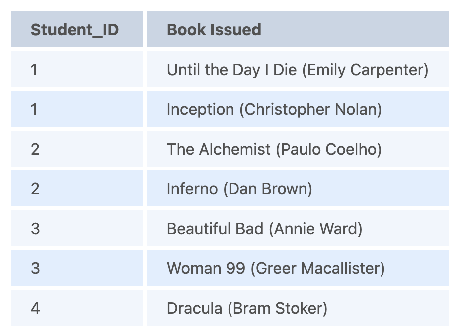
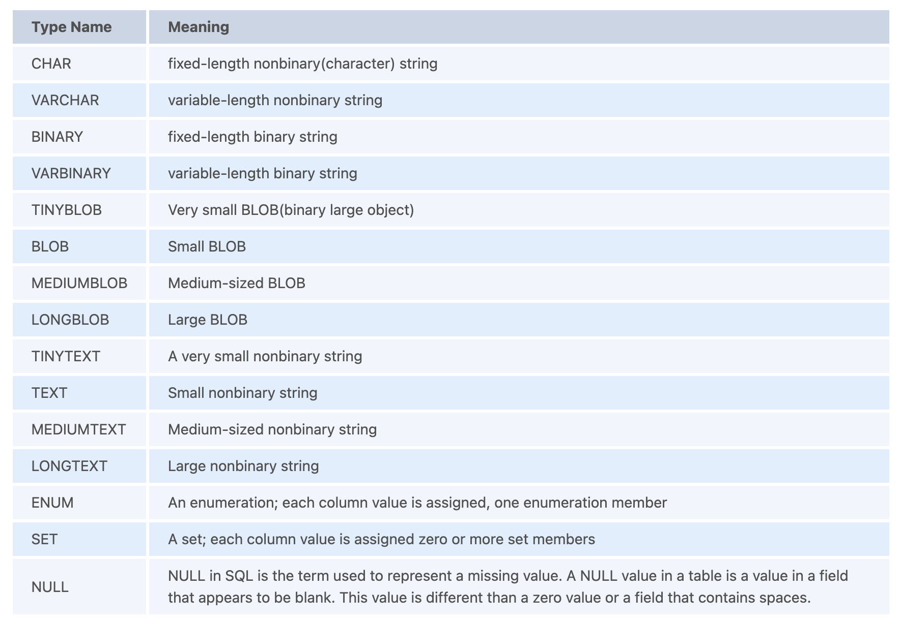

# SQL Interview Questions

---

1. What is Database?
   + `Database`: an organized collection of data, stored and retrieved digitally from a remote or local computer system. Databases can be vast and complex, and such databases are developed using fixed design and modeling approaches.

2. What is Database Management System (DBMS)?
   + `Database Management System (DBMS)`: a system software responsible for the creation, retrieval, updation, and management of the database. It ensures that our data is consistent, organized, and is easily accessible by serving as an interface between the database and its end-users or application software.

3. What is Relational Database Management System (RDBMS)? How is it different from DBMS?
   + `Relational Database Management System (RDBMS)`: the key difference here, compared to DBMS, is that RDBMS stores data in the form of a collection of tables, and relations can be defined between the common fields of these tables. Most modern database management systems like MySQL, Microsoft SQL Server, Oracle, IBM DB2, and Amazon Redshift are based on RDBMS.

4. What is Structured Query Language (SQL)?
   + `Structured Query Language (SQL)`: the standard language for relational database management systems. It is especially useful in handling organized data comprised of entities (variables) and relations between different entities of the data.

5. What is the difference between SQL and MySQL?
   + `SQL`: a standard language for retrieving and manipulating structured databases.
   + `MySQL`: a relational database management system, like SQL Server, Oracle or IBM DB2, that is used to manage SQL databases.

6. What are Tables and Fields?
   + `Tables`: an organized collection of data stored in the form of rows and columns. Columns can be categorized as vertical and rows as horizontal.
   + Fields: the columns in a table are called fields while the rows can be referred to as records.

7. What are Constraints in SQL?
   + `Constraints`: used to specify the rules concerning data in the table. It can be applied for single or multiple fields in an SQL table during the creation of the table or after creating using the ALTER TABLE command. The constraints are:
     + `NOT NULL`: Restricts NULL value from being inserted into a column.
     + `CHECK`: Verifies that all values in a field satisfy a condition.
     + `DEFAULT`: Automatically assigns a default value if no value has been specified for the field.
     + `UNIQUE`: Ensures unique values to be inserted into the field.
     + `INDEX`: Indexes a field providing faster retrieval of records.
     + `PRIMARY KEY`: Uniquely identifies each record in a table.
     + `FOREIGN KEY`: Ensures referential integrity for a record in another table.

8. What is a Primary Key?
   + `PRIMARY KEY`: uniquely identifies each row in a table. It must contain UNIQUE values and has an implicit NOT NULL constraint. A table in SQL is strictly restricted to have one and only one primary key, which is comprised of single or multiple fields (columns).
     ```
     CREATE TABLE Students (   /* Create table with a single field as primary key */
       ID INT NOT NULL
       Name VARCHAR(255)
       PRIMARY KEY (ID)
     );

     CREATE TABLE Students (   /* Create table with multiple fields as primary key */
       ID INT NOT NULL
       LastName VARCHAR(255)
       FirstName VARCHAR(255) NOT NULL,
       CONSTRAINT PK_Student
       PRIMARY KEY (ID, FirstName)
     );

     ALTER TABLE Students   /* Set a column as primary key */
     ADD PRIMARY KEY (ID);
     ALTER TABLE Students   /* Set multiple columns as primary key */
     ADD CONSTRAINT PK_Student   /*Naming a Primary Key*/
     PRIMARY KEY (ID, FirstName);
     ```

9.  What is a UNIQUE constraint?
    + `UNIQUE`: ensures that all values in a column are different. This provides uniqueness for the column(s) and helps identify each row uniquely. Unlike primary key, there can be multiple unique constraints defined per table. The code syntax for UNIQUE is quite similar to that of PRIMARY KEY and can be used interchangeably.
      ```
      CREATE TABLE Students (   /* Create table with a single field as unique */
        ID INT NOT NULL UNIQUE
        Name VARCHAR(255)
      );

      CREATE TABLE Students (   /* Create table with multiple fields as unique */
        ID INT NOT NULL
        LastName VARCHAR(255)
        FirstName VARCHAR(255) NOT NULL
        CONSTRAINT PK_Student
        UNIQUE (ID, FirstName)
      );

      ALTER TABLE Students   /* Set a column as unique */
      ADD UNIQUE (ID);
      ALTER TABLE Students   /* Set multiple columns as unique */
      ADD CONSTRAINT PK_Student   /* Naming a unique constraint */
      UNIQUE (ID, FirstName);
      ```

10. What is a Foreign Key?
    + `FOREIGN KEY`: comprises of single or collection of fields in a table that essentially refers to the PRIMARY KEY in another table. Foreign key constraint ensures referential integrity in the relation between two tables.
    + The table with the foreign key constraint is labeled as the child table, and the table containing the candidate key is labeled as the referenced or parent table.
      ```
      CREATE TABLE Students (   /* Create table with foreign key - Way 1 */
        ID INT NOT NULL
        Name VARCHAR(255)
        LibraryID INT
        PRIMARY KEY (ID)
        FOREIGN KEY (Library_ID) REFERENCES Library(LibraryID)
      );

      CREATE TABLE Students (   /* Create table with foreign key - Way 2 */
        ID INT NOT NULL PRIMARY KEY
        Name VARCHAR(255)
        LibraryID INT FOREIGN KEY (Library_ID) REFERENCES Library(LibraryID)
      );

      ALTER TABLE Students   /* Add a new foreign key */
      ADD FOREIGN KEY (LibraryID)
      REFERENCES Library (LibraryID);
      ```

11. What is a Join? List its different types.
    + `SQL Join clause`: used to combine records (rows) from two or more tables in a SQL database based on a related column between the two.
      
    + There are four different types of JOINs in SQL:
      + `(INNER) JOIN`: Retrieves records that have matching values in both tables involved in the join. This is the widely used join for queries.
        ```
        SELECT *
        FROM Table_A
        JOIN Table_B;
        SELECT *
        FROM Table_A
        INNER JOIN Table_B;
        ```
      + `LEFT (OUTER) JOIN`: Retrieves all the records/rows from the left and the matched records/rows from the right table.
        ```
        SELECT *
        FROM Table_A A
        LEFT JOIN Table_B B
        ON A.col = B.col;
        ```
      + `RIGHT (OUTER) JOIN`: Retrieves all the records/rows from the right and the matched records/rows from the left table.
        ```
        SELECT *
        FROM Table_A A
        RIGHT JOIN Table_B B
        ON A.col = B.col;
        ```
      + `FULL (OUTER) JOIN`: Retrieves all the records where there is a match in either the left or right table.
        ```
        SELECT *
        FROM Table_A A
        FULL JOIN Table_B B
        ON A.col = B.col;
        ```

12. What is a Self-Join?
    + `SELF JOIN`: a case of regular join where a table is joined to itself based on some relation between its own column(s). Self-join uses the INNER JOIN or LEFT JOIN clause and a table alias is used to assign different names to the table within the query.
      ```
      SELECT A.emp_id AS "Emp_ID",A.emp_name AS "Employee",
      B.emp_id AS "Sup_ID",B.emp_name AS "Supervisor"
      FROM employee A, employee B
      WHERE A.emp_sup = B.emp_id;
      ```

13. What is a Cross-Join?
    + `Cross Join`: can be defined as a cartesian product of the two tables included in the join. The table after join contains the same number of rows as in the cross-product of the number of rows in the two tables. If a WHERE clause is used in cross join then the query will work like an INNER JOIN.
      ```
      SELECT stu.name, sub.subject
      FROM students AS stu
      CROSS JOIN subjects AS sub;
      ```
    

14. What is an Index? Explain its different types.
    + `Index`: a data structure that provides a quick lookup of data in a column or columns of a table. It enhances the speed of operations accessing data from a database table at the cost of additional writes and memory to maintain the index data structure.
      ```
      CREATE INDEX index_name   /* Create Index */
      ON table_name (column_1, column_2);
      DROP INDEX index_name;   /* Drop Index */
      ```
    + There are different types of indexes that can be created for different purposes:
      +` Unique and Non-Unique Index`: indexes that help maintain data integrity by ensuring that no two rows of data in a table have identical key values. Once a unique index has been defined for a table, uniqueness is enforced whenever keys are added or changed within the index.
          ```
          CREATE UNIQUE INDEX myIndex
          ON students (enroll_no);
          ```
        + Non-unique indexes, on the other hand, are not used to enforce constraints on the tables with which they are associated. Instead, non-unique indexes are used solely to improve query performance by maintaining a sorted order of data values that are used frequently.
      + `Clustered and Non-Clustered Index`: clustered indexes are indexes whose order of the rows in the database corresponds to the order of the rows in the index. This is why only one clustered index can exist in a given table, whereas, multiple non-clustered indexes can exist in the table.
        + The only difference between clustered and non-clustered indexes is that the database manager attempts to keep the data in the database in the same order as the corresponding keys appear in the clustered index.
        + Clustering indexes can improve the performance of most query operations because they provide a linear-access path to data stored in the database.

15.  What is the difference between Clustered and Non-clustered index?
     + `Clustered index`: modifies the way records are stored in a database based on the indexed column. 
     + `Non-clustered index`: creates a separate entity within the table which references the original table.
     + Clustered index is used for easy and speedy retrieval of data from the database, whereas, fetching records from the non-clustered index is relatively slower.
     + In SQL, a table can have a single clustered index whereas it can have multiple non-clustered indexes.

16. What is Data Integrity?
    + `Data Integrity`: the assurance of accuracy and consistency of data over its entire life-cycle and is a critical aspect of the design, implementation, and usage of any system which stores, processes, or retrieves data. It also defines integrity constraints to enforce business rules on the data when it is entered into an application or a database.

17. What is a Query?
    + `Query`: a request for data or information from a database table or combination of tables. A database query can be either a select query or an action query.
      ```
      SELECT fname, lname    /* select query */
      FROM myDb.students
      WHERE student_id = 1;
      ```
      ```
      UPDATE myDB.students    /* action query */
      SET fname = 'Captain', lname = 'America'
      WHERE student_id = 1;
      ```

18. What is a Subquery? What are its types?
    + `Subquery`: a query within another query, also known as a nested query or inner query. It is used to restrict or enhance the data to be queried by the main query, thus restricting or enhancing the output of the main query respectively. For example, here we fetch the contact information for students who have enrolled for the maths subject:
      ```
      SELECT name, email, mob, address
      FROM myDb.contacts
      WHERE roll_no IN (
      SELECT roll_no
      FROM myDb.students
      WHERE subject = 'Maths');
      ```
    + There are two types of subqueries:
      + `Correlated`: cannot be considered as an independent query, but it can refer to the column in a table listed in the FROM of the main query.
      + `Non-Correlated`: can be considered as an independent query and the output of the subquery is substituted in the main query.

19. What is the SELECT statement?
    + `SELECT`: operator in SQL is used to select data from a database. The data returned is stored in a result table, called the result-set.
      + `SELECT * FROM myDB.students;`

20. What are some common clauses used with SELECT query in SQL?
    + `WHERE`: used to filter records that are necessary, based on specific conditions.
    + `ORDER BY`: used to sort the records based on some field(s) in ascending (ASC) or descending order (DESC).
      ```
      SELECT *
      FROM myDB.students
      WHERE graduation_year = 2019
      ORDER BY studentID DESC;
      ```
    + `GROUP BY`: used to group records with identical data and can be used in conjunction with some aggregation functions to produce summarized results from the database.
    + `HAVING`: used to filter records in combination with the GROUP BY clause. It is different from WHERE, since the WHERE clause cannot filter aggregated records.
      ```
      SELECT COUNT(studentId), country
      FROM myDB.students
      WHERE country != "INDIA"
      GROUP BY country
      HAVING COUNT(studentID) > 5;
      ```

21. What are UNION, MINUS and INTERSECT commands?
    + `UNION`: combines and returns the result-set retrieved by two or more SELECT statements.
    + `MINUS`: used to remove duplicates from the result-set obtained by the second SELECT query from the result-set obtained by the first SELECT query and then return the filtered results from the first.
    + `INTERSECT`: combines the result-set fetched by the two SELECT statements where records from one match the other and then returns this intersection of result-sets.
    + Certain conditions need to be met before executing either of the above statements in SQL
      + Each SELECT statement within the clause must have the same number of columns
      + The columns must also have similar data types
      + The columns in each SELECT statement should necessarily have the same order
        ```
        SELECT name FROM Students   /* Fetch the union of queries */
        UNION
        SELECT name FROM Contacts;
        SELECT name FROM Students   /* Fetch the union of queries with duplicates*/
        UNION ALL
        SELECT name FROM Contacts;
        ```
        ```
        SELECT name FROM Students   /* Fetch names from students */
        MINUS     /* that aren't present in contacts */
        SELECT name FROM Contacts;
        ```
        ```
        SELECT name FROM Students   /* Fetch names from students */
        INTERSECT    /* that are present in contacts as well */
        SELECT name FROM Contacts;
        ```

22. What is Cursor? How do you use a Cursor?
    + `Database Cursor`: a control structure that allows for the traversal of records in a database. Cursors, in addition, facilitates processing after traversal, such as retrieval, addition, and deletion of database records. They can be viewed as a pointer to one row in a set of rows.
    + Working with SQL Cursor:
      + DECLARE a cursor after any variable declaration. The cursor declaration must always be associated with a SELECT Statement.
      + Open cursor to initialize the result set. The OPEN statement must be called before fetching rows from the result set.
      + FETCH statement to retrieve and move to the next row in the result set.
      + Call the CLOSE statement to deactivate the cursor.
      + Finally use the DEALLOCATE statement to delete the cursor definition and release the associated resources.
        ```
        DECLARE @name VARCHAR(50)   /* Declare All Required Variables */
        DECLARE db_cursor CURSOR FOR   /* Declare Cursor Name*/
        SELECT name
        FROM myDB.students
        WHERE parent_name IN ('Sara', 'Ansh')
        OPEN db_cursor   /* Open cursor and Fetch data into @name */
        FETCH next
        FROM db_cursor
        INTO @name
        CLOSE db_cursor   /* Close the cursor and deallocate the resources */
        DEALLOCATE db_cursor
        ```

23. What are Entities and Relationships?
    + `Entity`: can be a real-world object, either tangible or intangible, that can be easily identifiable. For example, in a college database, students, professors, workers, departments, and projects can be referred to as entities. Each entity has some associated properties that provide it an identity.
    + `Relationships`: links between entities that have something to do with each other. For example - The employee's table in a company's database can be associated with the salary table in the same database.
    

24. List the different types of relationships in SQL.
    + `One-to-One`: the relationship between two tables where each record in one table is associated with the maximum of one record in the other table.
    + `One-to-Many & Many-to-One`: the most commonly used relationship where a record in a table is associated with multiple records in the other table.
    + `Many-to-Many`: used in cases when multiple instances on both sides are needed for defining a relationship.
    + `Self-Referencing Relationships`: used when a table needs to define a relationship with itself.

25. What is an Alias in SQL?
    + `Alias`: feature of SQL that is supported by most, if not all, RDBMSs. It is a temporary name assigned to the table or table column for the purpose of a particular SQL query. In addition, aliasing can be employed as an obfuscation technique to secure the real names of database fields. A table alias is also called a correlation name.
    + An alias is represented explicitly by the AS keyword but in some cases, the same can be performed without it as well. Nevertheless, using the AS keyword is always a good practice.
      ```
      SELECT A.emp_name AS "Employee"  /* Alias using AS keyword */
      B.emp_name AS "Supervisor"
      FROM employee A, employee B   /* Alias without AS keyword */
      WHERE A.emp_sup = B.emp_id;
      ```

26. What is a View?
    + `View`: a virtual table based on the result-set of an SQL statement. A view contains rows and columns, just like a real table. The fields in a view are fields from one or more real tables in the database.
    

27. What is Normalization?
    + `Normalization`: the way of organizing structured data in the database efficiently. It includes the creation of tables, establishing relationships between them, and defining rules for those relationships. Inconsistency and redundancy can be kept in check based on these rules, hence, adding flexibility to the database.

28. What is Denormalization?
    + `Denormalization`: the inverse process of normalization, where the normalized schema is converted into a schema that has redundant information. The performance is improved by using redundancy and keeping the redundant data consistent. The reason for performing denormalization is the overheads produced in the query processor by an over-normalized structure.

29. What are the various forms of Normalization?
    + `Normal Forms`: used to eliminate or reduce redundancy in database tables. The different forms are as follows:
      + `First Normal Form`: a relation is in first normal form if every attribute in that relation is a single-valued attribute. If a relation contains a composite or multi-valued attribute, it violates the first normal form. Let's consider the following students table. Each student in the table, has a name, his/her address, and the books they issued from the public library.
        
          + As we can observe, the Books Issued field has more than one value per record, and to convert it into 1NF, this has to be resolved into separate individual records for each book issued. Check the following table in 1NF form
          
      + `Second Normal Form`: a relation is in second normal form if it satisfies the conditions for the first normal form and does not contain any partial dependency. A relation in 2NF has no partial dependency, i.e., it has no non-prime attribute that depends on any proper subset of any candidate key of the table. Often, specifying a single column Primary Key is the solution to the problem.
        + Example 1: Consider the above example. As we can observe, the Students Table in the 1NF form has a candidate key in the form of [Student, Address] that can uniquely identify all records in the table. The field Books Issued (non-prime attribute) depends partially on the Student field. Hence, the table is not in 2NF. To convert it into the 2nd Normal Form, we will partition the tables into two while specifying a new Primary Key attribute to identify the individual records in the Students table. The Foreign Key constraint will be set on the other table to ensure referential integrity.
        
        
        + Example 2: Consider the following dependencies in relation to R(W,X,Y,Z)
          ```
          WX -> Y    [W and X together determine Y]
          XY -> Z    [X and Y together determine Z]
          ```
          + Here, WX is the only candidate key and there is no partial dependency, i.e., any proper subset of WX doesn’t determine any non-prime attribute in the relation.
      + `Third Normal Form`: a relation is said to be in the third normal form, if it satisfies the conditions for the second normal form and there is no transitive dependency between the non-prime attributes, i.e., all non-prime attributes are determined only by the candidate keys of the relation and not by any other non-prime attribute.
        + Example 1: Consider the Students Table in the above example. As we can observe, the Students Table in the 2NF form has a single candidate key Student_ID (primary key) that can uniquely identify all records in the table. The field Salutation (non-prime attribute), however, depends on the Student Field rather than the candidate key. Hence, the table is not in 3NF. To convert it into the 3rd Normal Form, we will once again partition the tables into two while specifying a new Foreign Key constraint to identify the salutations for individual records in the Students table. The Primary Key constraint for the same will be set on the Salutations table to identify each record uniquely.
        
        
        
        + Example 2: Consider the following dependencies in relation to R(P,Q,R,S,T)
          ```
          P -> QR     [P together determine C]
          RS -> T     [B and C together determine D]
          Q -> S
          T -> P
          ```
          + For the above relation to exist in 3NF, all possible candidate keys in the above relation should be {P, RS, QR, T}.
      + `Boyce-Codd Normal Form`: a relation is in Boyce-Codd Normal Form if satisfies the conditions for third normal form and for every functional dependency, Left-Hand-Side is super key. In other words, a relation in BCNF has non-trivial functional dependencies in form X –> Y, such that X is always a super key. For example - In the above example, Student_ID serves as the sole unique identifier for the Students Table and Salutation_ID for the Salutations Table, thus these tables exist in BCNF. The same cannot be said for the Books Table and there can be several books with common Book Names and the same Student_ID.

30. What are the TRUNCATE, DELETE and DROP statements?
    + `DELETE`: statement used to delete rows from a table.
      ```
      DELETE FROM Candidates
      WHERE CandidateId > 1000;
      ```
    + `TRUNCATE`: command used to delete all the rows from the table and free the space containing the table.
      + `TRUNCATE TABLE Candidates;`
    + `DROP`: command used to remove an object from the database. If you drop a table, all the rows in the table are deleted and the table structure is removed from the database.
      + `DROP TABLE Candidates;`

31. What is the difference between DROP and TRUNCATE statements?
    + `DROP`: all things associated with the tables are dropped as well. This includes - the relationships defined on the table with other tables, the integrity checks and constraints, access privileges and other grants that the table has. To create and use the table again in its original form, all these relations, checks, constraints, privileges and relationships need to be redefined.
    + `TRUNCATE`: none of the above problems exist and the table retains its original structure.

32. What is the difference between DELETE and TRUNCATE statements?
    + `TRUNCATE`: used to delete all the rows from the table and free the space containing the table.
    + `DELETE`: deletes only the rows from the table based on the condition given in the where clause or deletes all the rows from the table if no condition is specified. But it does not free the space containing the table.

33. What are Aggregate and Scalar functions?
    + `Aggregate function`: performs operations on a collection of values to return a single scalar value. Aggregate functions are often used with the GROUP BY and HAVING clauses of the SELECT statement. Following are the widely used SQL aggregate functions:
      + `AVG()`: Calculates the mean of a collection of values.
      + `COUNT()`: Counts the total number of records in a specific table or view.
      + `MIN()`: Calculates the minimum of a collection of values.
      + `MAX()`: Calculates the maximum of a collection of values.
      + `SUM()`: Calculates the sum of a collection of values.
      + `FIRST()`: Fetches the first element in a collection of values.
      + `LAST()`: Fetches the last element in a collection of values.
      + `Note`: All aggregate functions described above ignore NULL values except for the COUNT function.
    + `Scalar function`: returns a single value based on the input value. Following are the widely used SQL scalar functions:
      + `LEN()`: Calculates the total length of the given field (column).
      + `UCASE()`: Converts a collection of string values to uppercase characters.
      + `LCASE()`: Converts a collection of string values to lowercase characters.
      + `MID()`: Extracts substrings from a collection of string values in a table.
      + `CONCAT()`: Concatenates two or more strings.
      + `RAND()`: Generates a random collection of numbers of a given length.
      + `ROUND()`: Calculates the round-off integer value for a numeric field (or decimal point values).
      + `NOW()`: Returns the current date & time.
      + `FORMAT()`: Sets the format to display a collection of values.

34. What is User-defined function? What are its various types?
    + `User-defined functions`: similar to functions in any other programming language that accept parameters, perform complex calculations, and return a value. They are written to use the logic repetitively whenever required. There are two types of SQL user-defined functions:
      + `Scalar Function`: return a single scalar value.
      + `Table-Valued Functions`: return a table as output.
        + `Inline`: returns a table data type based on a single SELECT statement.
        + `Multi-statement`: returns a tabular result-set but, unlike inline, multiple SELECT statements can be used inside the function body.

35. What is Online Transaction Processing (OLTP)?
    + `Online Transaction Processing (OLTP)`: a class of software applications capable of supporting transaction-oriented programs. An essential attribute of an OLTP system is its ability to maintain concurrency. To avoid single points of failure, OLTP systems are often decentralized. These systems are usually designed for a large number of users who conduct short transactions. Database queries are usually simple, require sub-second response times, and return relatively few records. Here is an insight into the working of an OLTP system.
    

36. What are the differences between Online Transaction Processing (OLTP) and Online Analytical Processing (OLAP)?
    + `Online Transaction Processing (OLTP)`: a class of software applications capable of supporting transaction-oriented programs. An important attribute of an OLTP system is its ability to maintain concurrency. OLTP systems often follow a decentralized architecture to avoid single points of failure. These systems are generally designed for a large audience of end-users who conduct short transactions. Queries involved in such databases are generally simple, need fast response times, and return relatively few records. A number of transactions per second acts as an effective measure for such systems.
    + `Online Analytical Processing (OLAP)`: a class of software programs that are characterized by the relatively low frequency of online transactions. Queries are often too complex and involve a bunch of aggregations. For OLAP systems, the effectiveness measure relies highly on response time. Such systems are widely used for data mining or maintaining aggregated, historical data, usually in multi-dimensional schemas.
    

37. What is Collation? What are the different types of Collation Sensitivity?
    + `Collation`: a set of rules that determine how data is sorted and compared. Rules defining the correct character sequence are used to sort the character data. It incorporates options for specifying case sensitivity, accent marks, kana character types, and character width. Below are the different types of collation sensitivity:
      + `Case sensitivity`: A and a are treated differently.
      + `Accent sensitivity`: a and á are treated differently.
      + `Kana sensitivity`: Japanese kana characters Hiragana and Katakana are treated differently.
      + `Width sensitivity`: Same character represented in single-byte (half-width) and double-byte (full-width) are treated differently.

38. What is a Stored Procedure?
    + `Stored Procedure`: a subroutine available to applications that access a relational database management system (RDBMS). Such procedures are stored in the database data dictionary. The sole disadvantage of stored procedure is that it can be executed nowhere except in the database and occupies more memory in the database server. It also provides a sense of security and functionality as users who can't access the data directly can be granted access via stored procedures.
      ```
      DELIMITER $$
      CREATE PROCEDURE FetchAllStudents()
      BEGIN
      SELECT *  FROM myDB.students;
      END $$
      DELIMITER;
      ```
    

39. What is a Recursive Stored Procedure?
    + `Recursive Stored Procedure`: a stored procedure that calls itself until a boundary condition is reached, is called a recursive stored procedure. This recursive function helps the programmers to deploy the same set of code several times as and when required. Some SQL programming languages limit the recursion depth to prevent an infinite loop of procedure calls from causing a stack overflow, which slows down the system and may lead to system crashes.
      ```
      DELIMITER $$     /* Set a new delimiter => $$ */
      CREATE PROCEDURE calctotal( /* Create the procedure */
        IN number INT,   /* Set Input and Ouput variables */
        OUT total INT
      ) BEGIN
      DECLARE score INT DEFAULT NULL;   /* Set the default value => "score" */
      SELECT awards FROM achievements   /* Update "score" via SELECT query */
      WHERE id = number INTO score;
      IF score IS NULL THEN SET total = 0;   /* Termination condition */
      ELSE
      CALL calctotal(number+1);   /* Recursive call */
      SET total = total + score;   /* Action after recursion */
      END IF;
      END $$     /* End of procedure */
      DELIMITER ;     /* Reset the delimiter */
      ```

40. How do you create empty tables with the same structure as another table?
    + Creating empty tables with the same structure can be done smartly by fetching the records of one table into a new table using the INTO operator while fixing a WHERE clause to be false for all records. Hence, SQL prepares the new table with a duplicate structure to accept the fetched records but since no records get fetched due to the WHERE clause in action, nothing is inserted into the new table.
      ```
      SELECT * INTO Students_copy
      FROM Students WHERE 1 = 2;
      ```

41. What is Pattern Matching in SQL?
    + `SQL pattern matching`: provides for pattern search in data if you have no clue as to what that word should be. This kind of SQL query uses wildcards to match a string pattern, rather than writing the exact word. The LIKE operator is used in conjunction with SQL Wildcards to fetch the required information.
      + `Using the % wildcard to perform a simple search`: The % wildcard matches zero or more characters of any type and can be used to define wildcards both before and after the pattern. Search a student in your database with first name beginning with the letter K:
          ```
          SELECT *
          FROM students
          WHERE first_name LIKE 'K%'
          ```
      + `Omitting the patterns using the NOT keyword`: Use the NOT keyword to select records that don't match the pattern. This query returns all students whose first name does not begin with K.
          ```
          SELECT *
          FROM students
          WHERE first_name NOT LIKE 'K%'
          ```
      + `Matching a pattern anywhere using the % wildcard twice`: Search for a student in the database where he/she has a K in his/her first name.
          ```
          SELECT *
          FROM students
          WHERE first_name LIKE '%Q%'
          ```
      + `Using the _ wildcard to match pattern at a specific position`: The _ wildcard matches exactly one character of any type. It can be used in conjunction with % wildcard. This query fetches all students with letter K at the third position in their first name.
          ```
          SELECT *
          FROM students
          WHERE first_name LIKE '__K%'
          ```
      + `Matching patterns for a specific length`: The _ wildcard plays an important role as a limitation when it matches exactly one character. It limits the length and position of the matched results.
          ```
          SELECT *   /* Matches first names with three or more letters */
          FROM students
          WHERE first_name LIKE '___%'

          SELECT *   /* Matches first names with exactly four characters */
          FROM students
          WHERE first_name LIKE '____'
          ```

42. What is PostgreSQL?
    + `PostgreSQL`: first called Postgres and was developed by a team led by Computer Science Professor Michael Stonebraker in 1986. It was developed to help developers build enterprise-level applications by upholding data integrity by making systems fault-tolerant. PostgreSQL is therefore an enterprise-level, flexible, robust, open-source, and object-relational DBMS that supports flexible workloads along with handling concurrent users. It has been consistently supported by the global developer community. Due to its fault-tolerant nature, PostgreSQL has gained widespread popularity among developers.

43. How do you define Indexes in PostgreSQL?
    + `Indexes`: inbuilt functions in PostgreSQL which are used by the queries to perform search more efficiently on a table in the database. Consider that you have a table with thousands of records and you have the below query that only a few records can satisfy the condition, then it will take a lot of time to search and return those rows that abide by this condition as the engine has to perform the search operation on every single to check this condition. This is undoubtedly inefficient for a system dealing with huge data. Now if this system had an index on the column where we are applying search, it can use an efficient method for identifying matching rows by walking through only a few levels. This is called indexing.
    + `Select * from some_table where table_col=120`

44. How will you change the datatype of a column?
    + This can be done by using the ALTER TABLE statement as shown below:
      ```
      ALTER TABLE tname
      ALTER COLUMN col_name [SET DATA] TYPE new_data_type;
      ```

45. What is the command used for creating a database in PostgreSQL?
    + The first step of using PostgreSQL is to create a database. This is done by using the createdb command as shown below: `createdb db_name`
      + After running the above command, if the database creation was successful, then the below message is shown:
        + `CREATE DATABASE`

46. How can we start, restart and stop the PostgreSQL server?
    + To start the PostgreSQL server, we run:
      + `service postgresql start`
      + Once the server is successfully started, we get the below message:
        + `Starting PostgreSQL: ok`
    + To restart the PostgreSQL server, we run:
      + `service postgresql restart`
      + Once the server is successfully restarted, we get the message:
        + `Restarting PostgreSQL: server stopped ok`
    + To stop the server, we run the command:
      + `service postgresql stop`
      + Once stopped successfully, we get the message:
        + `Stopping PostgreSQL: server stopped ok`

47. What are partitioned tables called in PostgreSQL?
    + `Partitioned tables`: logical structures that are used for dividing large tables into smaller structures that are called partitions. This approach is used for effectively increasing the query performance while dealing with large database tables. To create a partition, a key called partition key which is usually a table column or an expression, and a partitioning method needs to be defined. There are three types of inbuilt partitioning methods provided by Postgres
      + `Range Partitioning`: done by partitioning based on a range of values. This method is most commonly used upon date fields to get monthly, weekly or yearly data. In the case of corner cases like value belonging to the end of the range, for example: if the range of partition 1 is 10-20 and the range of partition 2 is 20-30, and the given value is 10, then 10 belongs to the second partition and not the first.
      + `List Partitioning`: used to partition based on a list of known values. Most commonly used when we have a key with a categorical value. For example, getting sales data based on regions divided as countries, cities, or states.
      + `Hash Partitioning`: utilizes a hash function upon the partition key. This is done when there are no specific requirements for data division and is used to access data individually. For example, you want to access data based on a specific product, then using hash partition would result in the dataset that we require.
    + The type of partition key and the type of method used for partitioning determines how positive the performance and the level of manageability of the partitioned table are.

48. Define tokens in PostgreSQL?
    + `PostgreSQL Tokens`: either a keyword, identifier, literal, constant, quotes identifier, or any symbol that has a distinctive personality. They may or may not be separated using a space, newline or a tab. If the tokens are keywords, they are usually commands with useful meanings. Tokens are known as building blocks of any PostgreSQL code.

49. What is the importance of the TRUNCATE statement?
    + `TRUNCATE TABLE name_of_table` statement removes the data efficiently and quickly from the table. The truncate statement can also be used to reset values of the identity columns along with data cleanup as shown below:
      ```
      TRUNCATE TABLE name_of_table
      RESTART IDENTITY;
      ```
    + We can also use the statement for removing data from multiple tables all at once by mentioning the table names separated by comma as shown below:
      ```
      TRUNCATE TABLE
        table_1,
        table_2,
        table_3;
      ```

50. What is the capacity of a table in PostgreSQL?
    + The maximum size of PostgreSQL is 32TB.

51. Define sequence.
    + `Sequence`: a schema-bound, user-defined object which aids to generate a sequence of integers. This is most commonly used to generate values to identity columns in a table. We can create a sequence by using the `CREATE SEQUENCE` statement as shown below:
      + `CREATE SEQUENCE serial_num START 100;`
      + To get the next number 101 from the sequence, we use the nextval() method as shown below:
        + `SELECT nextval('serial_num')`
      + We can also use this sequence while inserting new records using the INSERT command:
        + `INSERT INTO ib_table_name VALUES (nextval('serial_num'), 'interviewbit');`

52. What are string constants in PostgreSQL?
    + `String Constants`: they are character sequences bound within single quotes. These are using during data insertion or updation to characters in the database.
    There are special string constants that are quoted in dollars. Syntax: `$tag$<string_constant>$tag$` The tag in the constant is optional and when we are not specifying the tag, the constant is called a double-dollar string literal.

53. How can you get a list of all databases in PostgreSQL?
    + This can be done by using the command `\l -> backslash followed by the lower-case letter L`.

54. How can you delete a database in PostgreSQL?
    + This can be done by using the DROP DATABASE command as shown in the syntax below:
      + `DROP DATABASE database_name;`
      + If the database has been deleted successfully, then the following message would be shown:
        + `DROP DATABASE`

55. What are Atomicity, Consistency, Isolation, Durability (ACID) properties? Is PostgreSQL compliant with ACID?
    + `Atomicity, Consistency, Isolation, Durability (ACID)` database transaction properties which are used for guaranteeing data validity in case of errors and failures.
      + `Atomicity`: ensures that the transaction is completed in all-or-nothing way.
      + `Consistency`: ensures that updates made to the database is valid and follows rules and restrictions.
      + `Isolation`: ensures integrity of transaction that are visible to all other transactions.
      + `Durability`: ensures that the committed transactions are stored permanently in the database.
    + PostgreSQL is compliant with ACID properties.

56. Can you explain the architecture of PostgreSQL?
    + The architecture of PostgreSQL follows the client-server model.
    + The server side comprises of background process manager, query processer, utilities and shared memory space which work together to build PostgreSQL’s instance that has access to the data. The client application does the task of connecting to this instance and requests data processing to the services. The client can either be GUI (Graphical User Interface) or a web application. The most commonly used client for PostgreSQL is pgAdmin.
    

57. What do you understand by multi-version concurrency (MVCC) control?
    + `Multi-version Concurrency Control (MVCC)`: used for avoiding unnecessary database locks when 2 or more requests tries to access or modify the data at the same time. This ensures that the time lag for a user to log in to the database is avoided. The transactions are recorded when anyone tries to access the content.

58. What do you understand by the command enable-debug?
    + `enable-debug`: used for enabling the compilation of all libraries and applications. When this is enabled, the system processes get hindered and generally also increases the size of the binary file. Hence, it is not recommended to switch this on in the production environment. This is most commonly used by developers to debug the bugs in their scripts and help them spot the issues.

59. How do you check the rows affected as part of previous transactions?
    + SQL standards state that the following three phenomena should be prevented whilst concurrent transactions. SQL standards define 4 levels of transaction isolations to deal with these phenomena.
      + `Dirty reads`: if a transaction reads data that is written due to concurrent uncommitted transaction, these reads are called dirty reads.
      + `Phantom reads`: occurs when two same queries when executed separately return different rows. For example, if transaction A retrieves some set of rows matching search criteria. Assume another transaction B retrieves new rows in addition to the rows obtained earlier for the same search criteria. The results are different.
      + `Non-repeatable reads`: occurs when a transaction tries to read the same row multiple times and gets different values each time due to concurrency. This happens when another transaction updates that data and our current transaction fetches that updated data, resulting in different values.
    + To tackle these, there are 4 standard isolation levels defined by SQL standards. They are as follows:
      + `Read Uncommitted`: the lowest level of the isolations. Here, the transactions are not isolated and can read data that are not committed by other transactions resulting in dirty reads.
      + `Read Committed`: ensures that the data read is committed at any instant of read time. Hence, dirty reads are avoided here. This level makes use of read/write lock on the current rows which prevents read/write/update/delete of that row when the current transaction is being operated on.
      + `Repeatable Read`: the most restrictive level of isolation. This holds read and write locks for all rows it operates on. Due to this, non-repeatable reads are avoided as other transactions cannot read, write, update or delete the rows.
      + `Serializable`: the highest of all isolation levels. This guarantees that the execution is serializable where execution of any concurrent operations are guaranteed to be appeared as executing serially.
    + The following table clearly explains which type of unwanted reads the levels avoid:
      

60. What can you tell about WAL (Write Ahead Logging)?
    + `Write Ahead Logging (WAL)`: a feature that increases the database reliability by logging changes before any changes are done to the database. This ensures that we have enough information when a database crash occurs by helping to pinpoint to what point the work has been complete and gives a starting point from the point where it was discontinued.

61. What is the main disadvantage of deleting data from an existing table using the DROP TABLE command?
    + `DROP TABLE`: deletes complete data from the table along with removing the complete table structure too. In case our requirement entails just remove the data, then we would need to recreate the table to store data in it. In such cases, it is advised to use the TRUNCATE command.

62. How do you perform case-insensitive searches using regular expressions in PostgreSQL?
    + To perform case insensitive matches using a regular expression, we can use POSIX (~*) expression from pattern matching operators. For example:
      + `'interviewbit' ~* '.*INTervIewBit.*'`

63. How will you take backup of the database in PostgreSQL?
    + We can achieve this by using the pg_dump tool for dumping all object contents in the database into a single file. The steps are as follows:
      + `Step 1`: Navigate to the bin folder of the PostgreSQL installation path.
        + `C:\>cd C:\Program Files\PostgreSQL\10.0\bin`
      + `Step 2`: Execute pg_dump program to take the dump of data to a .tar folder as shown below:
        + `pg_dump -U postgres -W -F t sample_data > C:\Users\admin\pgbackup\sample_data.tar`
        + The database dump will be stored in the sample_data.tar file on the location specified.

64. Does PostgreSQL support full text search?
    + `Full-Text Search`: the method of searching single or collection of documents stored on a computer in a full-text based database. This is mostly supported in advanced database systems like SOLR or ElasticSearch. However, the feature is present but is pretty basic in PostgreSQL.

65. What are parallel queries in PostgreSQL?
    + `Parallel Queries`: support is a feature provided in PostgreSQL for devising query plans capable of exploiting multiple CPU processors to execute the queries faster.
    

66. Differentiate between commit and checkpoint.
    + `Commit`: action ensures that the data consistency of the transaction is maintained and it ends the current transaction in the section. Commit adds a new record in the log that describes the COMMIT to the memory.
    + `Checkpoint`: used for writing all changes that were committed to disk up to SCN which would be kept in datafile headers and control files.

67. What is MySQL?
    + `MySQL`: a database management system for web servers. It can grow with the website as it is highly scalable. Most of the websites today are powered by MySQL.

68. What are some of the advantages of using MySQL?
    + `Flexibility`: runs on all operating systems
    + `Power`: focuses on performance
    + `Enterprise-Level SQL Features`: MySQL had for some time been lacking in advanced features such as subqueries, views, and stored procedures.
    + `Full-Text Indexing and Searching`
    + `Query Caching`: helps enhance the speed of MySQL greatly
    + `Replication`: One MySQL server can be duplicated on another, providing numerous advantages
    + `Configuration and Security`

69. What do you mean by ‘databases’?
    + `Database`: a structured collection of data stored in a computer system and organized in a way to be quickly searched. With databases, information can be rapidly retrieved.

70. What does SQL in MySQL stand for?
    + The SQL in MySQL stands for Structured Query Language. This language is also used in other databases such as Oracle and Microsoft SQL Server.  One can use commands such as the following to send requests from a database:
      + `SELECT title FROM publications WHERE author = ' J. K. Rowling’;`

71. What does a MySQL database contain?
    + A MySQL database contains one or more tables, each of which contains records or rows. Within these rows are various columns or fields that contain the data itself.

72. How can you interact with MySQL?
    + There are three main ways you can interact with MySQL:
      + using a command line
      + via a web interface
      + through a programming language

73. What are MySQL Database Queries?
    + `Queries`: a specific request or a question. One can query a database for specific information and have a record returned.

74. What are some of the common MySQL commands?
  

75.  How do you create a database in MySQL?
     + Use the following command to create a new database called ‘books’
       + `CREATE DATABASE books;`

76. How do you create a table using MySQL?
    ```
    CREATE TABLE history (
    author VARCHAR(128),
    title VARCHAR(128),
    type VARCHAR(16),
    year CHAR(4)) ENGINE InnoDB;
    ```

77. How do you Insert Data Into MySQL?
    + The INSERT INTO statement is used to add new records to a MySQL table:
      ```
      INSERT INTO table_name (column1, column2, column3,...)
      VALUES (value1, value2, value3,...)
      ```
    + If we want to add values for all the columns of the table, we do not need to specify the column names in the SQL query. However, the order of the values should be in the same order as the columns in the table. The INSERT INTO syntax would be as follows:
      ```
      INSERT INTO table_name
      VALUES (value1, value2, value3, ...);
      ```

78. How do you remove a column from a database?
    + You can remove a column by using the DROP keyword:
      + `ALTER TABLE classics DROP pages;`

79. How do you create an Index in MySQL?
    + In MySQL, there are different index types, such as a regular INDEX, a PRIMARY KEY, or a FULLTEXT index. You can achieve fast searches with the help of an index. Indexes speed up performance by either ordering the data on disk so it's quicker to find your result or, telling the SQL engine where to go to find your data.
      ```
      ALTER TABLE history ADD INDEX(author(10));
      ALTER TABLE history ADD INDEX(title(10));
      ALTER TABLE history ADD INDEX(category(5));
      ALTER TABLE history ADD INDEX(year);
      DESCRIBE history;
      ```

80. How do you Delete Data From a MySQL Table?
    + In MySQL, the DELETE statement is used to delete records from a table:
      ```
      DELETE FROM table_name
      WHERE column_name = value_name
      ```

81. How do you view a database in MySQL?
    + One can view all the databases on the MySQL server host using the following command:
      + `mysql> SHOW DATABASES;`

82. What are the Numeric Data Types in MySQL?
    + MySQL has numeric data types for integer, fixed-point, floating-point, and bit values, as shown in the table below. Numeric types can be signed or unsigned, except BIT. A special attribute enables the automatic generation of sequential integer or floating-point column values, which is useful for applications that require a series of unique identification numbers.
    

83. What are the String Data Types in MySQL?
  

84. What are the Temporal Data Types in MySQL?
  

85.  What is Binary Large Object (BLOB) in MySQL?
     + `Binary Large Object (BLOB)`: used to hold a variable amount of data.
     + `There are four types of BLOB`:
      + TINYBLOB
      + BLOB
      + MEDIUMBLOB
      + LONGBLOB
     + A BLOB can hold a very large amount of data. For example - documents, images, and even videos. You could store your complete novel as a file in a BLOB if needed.

86. How do you add users in MySQL?
    + You can add a User by using the CREATE command and specifying the necessary credentials. For example:
      + `CREATE USER ‘testuser’ IDENTIFIED BY ‘sample password’;`

87. What are MySQL “Views”?
    + `“Views”`: consists of a set of rows that is returned if a particular query is executed. This is also known as a ‘virtual table’. Views make it easy to retrieve the way of making the query available via an alias. The advantages of views are:
      + Simplicity
      + Security
      + Maintainability

88. How do you create and execute views in MySQL?
    + Creating a view is accomplished with the CREATE VIEW statement. As an example:
      ```
      CREATE
        [OR REPLACE]
        [ALGORITHM = {MERGE | TEMPTABLE | UNDEFINED }]
        [DEFINER = { user | CURRENT_USER }]
        [SQL SECURITY { DEFINER | INVOKER }]
        VIEW view_name [(column_list)]
        AS select_statement
        [WITH [CASCADED | LOCAL] CHECK OPTION]
      ```

89. What are MySQL Triggers?
    + `Triggers`: a task that executes in response to some predefined database event, such as after a new row is added to a particular table. Specifically, this event involves inserting, modifying, or deleting table data, and the task can occur either prior to or immediately following any such event.
    + Triggers have many purposes, including:
      + Audit Trails
      + Validation
      + Referential integrity enforcement

90. How many Triggers are possible in MySQL?
    + There are six Triggers allowed to use in the MySQL database:
      + Before Insert
      + After Insert
      + Before Update
      + After Update
      + Before Delete
      + After Delete

91. What is the MySQL server?
    + The server, mysqld, is the hub of a MySQL installation; it performs all manipulation of databases and tables.

92. What are the MySQL clients and utilities?
    + Several MySQL programs are available to help you communicate with the server. For administrative tasks, some of the most important ones are listed here:
      + `mysql—An`: interactive program that enables you to send SQL statements to the server and to view the results. You can also use mysql to execute batch scripts (text files containing SQL statements).
      + `mysqladmin—An`: administrative program for performing tasks such as shutting down the server, checking its configuration, or monitoring its status if it appears not to be functioning properly.
      + `mysqldump—A`: tool for backing up your databases or copying databases to another server.
      + `mysqlcheck`: and `myisamchk—Programs` that help you perform table checking, analysis, and optimization, as well as repairs if tables become damaged. mysqlcheck works with MyISAM tables and to some extent with tables for other storage engines. myisamchk is for use only with MyISAM tables.

93. What are the types of relationships used in MySQL?
    + There are three categories of relationships in MySQL:
      + `One-to-One`: when two items have a one-to-one relationship, you just include them as columns in the same table.
      + `One-to-Many`: occur when one row in one table is linked to many rows in another table.
      + `Many-to-Many`: many rows in one table are linked to many rows in another table. To create this relationship, add a third table containing the same key column from each of

94. Can you explain the logical architecture of MySQL?
    + `top layer`: contains the services most network-based client/server tools or servers need such as connection handling, authentication, security, and so forth.
    + `second layer`: contains much of MySQL’s brains. This has the code for query parsing, analysis, optimization, caching, and all the built-in functions.
    + `third layer`: contains the storage engines that are responsible for storing and retrieving the data stored in MySQL.
    

95. What is Scaling in MySQL?
    + `Scaling`: the ability to handle the load, and it’s useful to think of load from several different angles such as:
      + Quantity of data
      + Number of users
      + User activity
      + Size of related datasets

96. What is Sharding in SQL?
    + `Sharding`: the process of breaking up large tables into smaller chunks (called shards) that are spread across multiple servers is called Sharding.
    + The advantage of Sharding is that since the sharded database is generally much smaller than the original; queries, maintenance, and all other tasks are much faster.

97. What are Transaction Storage Engines in MySQL?
    + `Transaction Storage Engines`: to be able to use MySQL’s transaction facility, you have to be using MySQL’s InnoDB storage engine (which is the default from version 5.5 onward). If you are not sure which version of MySQL your code will be running on, rather than assuming InnoDB is the default engine you can force its use when creating a table, as follows.
