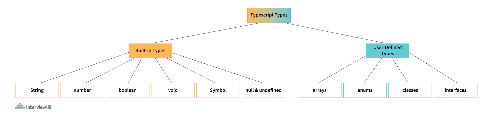
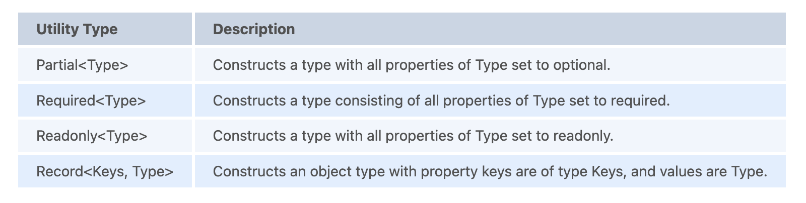

# TypeScript Interview Questions

---

1. What are the primitive types in TypeScript?
   + TypeScript has three primitive types that are frequently used: string, number, and boolean. These correspond to the similarly named types in JavaScript.
     + string: represents text values such as “javascript”, “typescript”, etc.
     + number: represents numeric values like 1, 2, 32, 43, etc.
     + boolean: represents a variable that can have either a ‘true’ or ‘false’ value.
   

2. Explain how the arrays work in TypeScript.
   + We use arrays to store values of the same type. Arrays are ordered and indexed collections of values. The indexing starts at 0, i.e., the first element has index 0, the second has index 1, and so on. Here is the syntax to declare and initialize an array in TypeScript.
     ```
     let values: number[] = [];
     values[0] = 10;
     values[1] = 20;
     values[2] = 30;
     ```
   + You can also create an array using the short-hand syntax as follows:
     + `let values: number[] = [15, 20, 25, 30];`
   + TypeScript provides an alternate syntax to specify the Array type.
     + `let values: Array<number> = [15, 20, 25, 30];`

3. What is any type, and when to use it?
   + There are times when you want to store a value in a variable but don’t know the type of that variable in advance. For example, the value is coming from an API call or the user input. The ‘any’ type allows you to assign a value of any type to the variable of type any.
     + `let person: any = "Foo";`
     + Here is an example that demonstrates the usage of any type.
       ```
       // json may come from a third-party API
       const employeeData: string = `{"name": "John Doe", "salary": 60000}`;

       // parse JSON to build employee object
       const employee: any = JSON.parse(employeeData);

       console.log(employee.name);
       console.log(employee.salary);
       ```
   + TypeScript assumes a variable is of type any when you don’t explicitly provide the type, and the compiler cannot infer the type from the surrounding context.

4. What is void, and when to use the void type?
   + The void indicates the absence of type on a variable. It acts as the opposite type to any. It is especially useful in functions that don’t return a value.
     ```
     function notify(): void {
       alert("The user has been notified.");
     }
     ```
   + If a variable is of type void, you can only assign the null or undefined values to that variable.

5. What is an unknown type, and when to use it in TypeScript?
   + The unknown type is the type-safe counterpart of any type. You can assign anything to the unknown, but the unknown isn’t assignable to anything but itself and any, without performing a type assertion of a control-flow-based narrowing. You cannot perform any operations on a variable of an unknown type without first asserting or narrowing it to a more specific type.
   + Consider the following example. We create the foo variable of unknown type and assign a string value to it. If we try to assign that unknown variable to a string variable bar, the compiler gives an error.
     ```
     let foo: unknown = "Akshay";
     let bar: string = foo; // Type 'unknown' is not assignable to type 'string'.(2322)
     ```
     + You can narrow down a variable of an unknown type to something specific by doing typeof checks or comparison checks or using type guards. For example, we can get rid of the above error by
       ```
       let foo: unknown = "Akshay";
       let bar: string = foo as string;
       ```

6. What are the different keywords to declare variables in TypeScript?
   + var: Declares a function-scoped or global variable. You can optionally set its value during the declaration. Its behavior and scoping rules are similar to the var keyword in JavaScript. For example:
     + `var foo = "bar";`
   + let: Declares a block-scoped local variable. Similar to var, you can optionally set the value of a variable during the declaration. For example:
     ```
     let a = 5;

     if (true) {
       let a = 10;
       console.log(a);  // 10
     }
     console.log(a);  // 5
     ```
   + const: Declares a block-scoped constant value that cannot be changed after it’s initialized.  For example:
     ```
     const a = 5;

     if (true) {
       a = 10; // Error: Cannot assign to 'a' because it is a constant.(2588)
     }
     ```

7. Provide the syntax of a function with the type annotations.
   + Functions are blocks of code to perform a specific code. Functions can optionally take one or more arguments, process them, and optionally return a value.
     ```
     function greet(name: string): string {
       return `Hello, ${name}`;
     }

     let greeting = greet("Anders");
     console.log(greeting);  // "Hello, Anders"
     ```

8. How to create objects in TypeScript?
   + Objects are dictionary-like collections of keys and values. The keys have to be unique. They are similar to arrays and are also sometimes called associative arrays. However, an array uses numbers to index the values, whereas an object allows you to use any other type as the key.
   + In TypeScript, an Object type refers to any value with properties. It can be defined by simply listing the properties and their types. For example:
     ```
     let pt: { x: number; y: number } = {
       x: 10,
       y: 20
     };
     ```

9.  How to specify optional properties in TypeScript?
    + An object type can have zero or more optional properties by adding a ‘?’ after the property name.
      ```
      let pt: { x: number; y: number; z?: number } = {
        x: 10,
        y: 20
      };
      console.log(pt);
      ```
      + In the example above, because the property ‘z’ is marked as optional, the compiler won’t complain if we don’t provide it during the initialization.

10. Explain the concept of null and its use in TypeScript.
    + In programming, a null value indicates an absence of value. A null variable doesn’t point to any object. Hence you cannot access any properties on the variable or call a method on it.
    + In TypeScript, the null value is indicated by the ‘null’ keyword. You can check if a value is null as follows:
      ```
      function greet(name: string | null) {
      if (name === null) {
        console.log("Name is not provided");
      } else {
        console.log("Good morning, " + name.toUpperCase());
      }
      }

      var foo = null;
      greet(foo); // "Name is not provided"

      foo = "Anders";
      greet(foo);  // "Good morning, ANDERS"
      ```

11. What is undefined in TypeScript?
    + When a variable is declared without initialization, it’s assigned the undefined value. It’s not very useful on its own. A variable is undefined if it’s declared, but no value has been assigned to it. In contrast, null is assigned to a variable, and it represents no value.
      ```
      console.log(null == null); // true
      console.log(undefined == undefined); // true
      console.log(null == undefined); // true, with type-conversion
      console.log(null === undefined); // false, without type-conversion
      console.log(0 == undefined); // false
      console.log('' == undefined); // false
      console.log(false == undefined); // false
      ```

12. Explain the purpose of the never type in TypeScript.
    + As the name suggests, the never type represents the type of values that never occur. For example, a function that never returns a value or that always throws an exception can mark its return type as never.
      ```
      function error(message: string): never {
      throw new Error(message);
      }
      ```
    + You might wonder why we need a ‘never’ type when we already have ‘void’. Though both types look similar, they represent two very different concepts.
    + A function that doesn't return a value implicitly returns the value undefined in JavaScript. Hence, even though we are saying it’s not returning anything, it’s returning ‘undefined’. We usually ignore the return value in these cases. Such a function is inferred to have a void return type in TypeScript.
      ```
      // This function returns undefined
      function greet(name: string) {
      console.log(`Hello, ${name}`);
      }

      let greeting = greet("David");
      console.log(greeting);  // undefined
      ```
    + In contrast, a function that has a never return type never returns. It doesn't return undefined, either. There are 2 cases where functions should return never type:
      + In an unending loop e.g a while(true){} type loop.
      + A function that throws an error e.g function foo(){throw new Exception('Error message')}

13. Explain how enums work in TypeScript?
    + Enums allow us to create named constants. It is a simple way to give more friendly names to numeric constant values. An enum is defined by the keyword enum, followed by its name and the members.
    + Consider the following example that defines an enum Team with four values in it.
      ```
      enum Team {
      Alpha,
      Beta,
      Gamma,
      Delta
      }
      let t: Team = Team.Delta;
      ```
      + By default, the enums start the numbering at 0. You can override the default numbering by explicitly assigning the values to its members.
      + TypeScript also lets you create enums with string values as follows:
        ```
        enum Author {
          Anders = "Anders",
          Hejlsberg = "Hejlsberg"
        };
        ```

14. What is the typeof operator? How is it used in TypeScript?
    + Similar to JavaScript, the typeof operator in TypeScript returns the type of the operand as a string.
      ```
      console.log(typeof 10);  // "number"

      console.log(typeof 'foo');  // "string"

      console.log(typeof false);  // "boolean"

      console.log(typeof bar);  // "undefined"
      ```
    + In TypeScript, you can use the typeof operator in a type context to refer to the type of a property or a variable.
      ```
      let greeting = "hello";
      let typeOfGreeting: typeof greeting;  // similar to let typeOfGreeting: string
      ```

15. What are the rest parameters and arguments in TypeScript?
    + A rest parameter allows a function to accept an indefinite number of arguments as an array. It is denoted by the ‘…’ syntax and indicates that the function can accept one or more arguments.
      ```
      function add(...values: number[]) {
      let sum = 0;
      values.forEach(val => sum += val);
      return sum;
      }
      const sum = add(5, 10, 15, 20);
      console.log(sum);  // 50
      ```
      + In contrast, the rest arguments allow a function caller to provide a variable number of arguments from an array. Consider the following example.
        ```
        const first = [1, 2, 3];
        const second = [4, 5, 6];

        first.push(...second);
        console.log(first);  // [1, 2, 3, 4, 5, 6]
        ```

16. What is parameter destructuring?
    + Parameter destructing allows a function to unpack the object provided as an argument into one or more local variables.
      ```
      function multiply({ a, b, c }: { a: number; b: number; c: number }) {
      console.log(a * b * c);
      }

      multiply({ a: 1, b: 2, c: 3 });

      You can simplify the above code by using an interface or a named type, as follows:
      type ABC = { a: number; b: number; c: number };

      function multiply({ a, b, c }: ABC) {
      console.log(a * b * c);
      }

      multiply({ a: 1, b: 2, c: 3 });
      ```

17. Explain the TypeScript class syntax.
    + TypeScript fully supports classes. The TypeScript syntax for class declaration is similar to that of JavaScript, with the added type support for the member declarations.
    + Here is a simple class that defines an Employee type.
      ```
      class Employee {
        name: string;
        salary: number;

        constructor(name: string, salary: number) {
                this.name = name;
                this.salary = salary;
        }
        promote() : void {
          this.salary += 10000;
        }
      }
      ```
      + You can create an instance (or object) of a class by using the new keyword.
        ```
        // Create a new employee
        let john = new Employee("John", 60000);

        console.log(john.salary);  // 60000
        john.promote();
        console.log(john.salary);  // 70000
        ```

18. Explain the arrow function syntax in TypeScript.
    + Arrow functions provide a short and convenient syntax to declare functions. They are also called lambdas in other programming languages.
    + Consider a regular function that adds two numbers and returns a number.
      ```
      function add(x: number, y: number): number {
        let sum = x + y;
        return sum;
      }
      ```
      + Using arrow functions syntax, the same function can be defined as:
        ```
        let add = (x: number, y: number): number => {
          let sum = x + y;
          return sum;
        }
        ```
        + You can further simplify the syntax by getting rid of the brackets and the return statement. This is allowed when the function body consists of only one statement. For example, if we remove the temporary sum variable, we can rewrite the above function as:
          + `let add = (x: number, y: number): number => x + y; `
    + Arrow functions are often used to create anonymous callback functions in TypeScript. Consider the example below that loops over and filters an array of numbers and returns an array containing multiples of five. The filter function takes an arrow function.
      ```
      let numbers = [3, 5, 9, 15, 34, 35];

      let fiveMultiples = numbers.filter(num => (num % 5) == 0);

      console.log(fiveMultiples);  // [5, 15, 35]
      ```

19. Provide the syntax for optional parameters in TypeScript.
    + A function can mark one or more of its parameters as optional by suffixing its name with ‘?’. In the example below, the parameter greeting is marked optional.
      ```
      function greet(name: string, greeting?: string) {
      if (!greeting)
        greeting = "Hello";

      console.log(`${greeting}, ${name}`);
      }

      greet("John", "Hi");  // Hi, John
      greet("Mary", "Hola");  // Hola, Mary
      greet("Jane");  // Hello, Jane
      ```

20. What is the purpose of the tsconfig.json file?
    + A tsconfig.json file in a directory marks that directory as the root of a TypeScript project. It provides the compiler options to compile the project.
      ```
      {
      "compilerOptions": {
        "module": "system",
        "noImplicitAny": true,
        "removeComments": true,
        "outFile": "../../built/local/tsc.js",
        "sourceMap": true
      },
      "include": ["src/**/*"],
      "exclude": ["node_modules", "**/*.spec.ts"]
      }
      ```

21. Explain the different variants of the for loop in TypeScript.
    + TypeScript provides the following three ways to loop over collections.
      + ‘for’ loop:
        ```
        let values = [10, "foo", true];

        for(let i=0; i<values.length; i++) {
          console.log(values[i]);  // 10, "foo", true
        }
        ```
      + ‘forEach’ function:
        ```
        let values = [10, "foo", true];
        values.forEach(val => {
            console.log(val);  // 10, "foo", true
        })
        ```
      + ‘for..of’ statement:
        ```
        let values = [10, "foo", true];
        for (let val of values) {
        console.log(val); // 10, "foo", true
        }
        ```

22. Explain the symbol type in TypeScript.
    + Symbols were introduced in ES6 and are supported by TypeScript. Similar to numbers and strings, symbols are primitive types. You can use Symbols to create unique properties for objects.
      + You can create symbol values by calling the Symbol() constructor, optionally providing a string key.
        ```
        let foo = Symbol();
        let bar = Symbol("bar"); // optional string key
        ```
      + A key characteristic of symbols is that they are unique and immutable.
        ```
        let foo = Symbol("foo");
        let newFoo = Symbol("foo");

        let areEqual = foo === newFoo;
        console.log(areEqual);  // false, symbols are unique
        ```

23. Explain how optional chaining works in TypeScript.
    + Optional chaining allows you to access properties and call methods on them in a chain-like fashion. You can do this using the ‘?.’ operator.
    + TypeScript immediately stops running some expression if it runs into a ‘null’ or ‘undefined’ value and returns ‘undefined’ for the entire expression chain.
    + Using optional chaining, the following expression
      + `let x = foo === null || foo === undefined ? undefined : foo.bar.baz();`
      + can be expressed as:
        + `let x = foo?.bar.baz();`

24. Provide the TypeScript syntax to create function overloads.
    + Function overloading allows us to define multiple functions with the same name, as long as their number of parameters or the types of parameters are different.
    + The following example defines two overloads for the function buildDate. The first overload takes a number as a parameter, whereas the second takes three numbers as parameters. These are called overload signatures.
    + The body of the function also called an implementation signature, follows the overload signatures. You can’t call this signature directly, as it’s not visible from the outside. It should be compatible with the overload signatures.
      ```
      function buildDate(timestamp: number): Date;
      function buildDate(m: number, d: number, y: number): Date;
      function buildDate(mOrTimestamp: number, d?: number, y?: number): Date {
      if (d !== undefined && y !== undefined) {
        return new Date(y, mOrTimestamp, d);
      } else {
        return new Date(mOrTimestamp);
      }
      }

      const d1 = buildDate(87654321);
      const d2 = buildDate(2, 2, 2);
      ```

25. What is meant by type inference?
    + TypeScript can infer the type of a variable when you don’t provide an explicit type. This is known as type inference. This is usually done when the variables or parameters are initialized during the declaration.
    + For example, TypeScript knows that the variable foo is a string, even though we don’t mention string as a type.
      ```
      let foo = "this is a string";
      console.log(typeof foo);  // "string"
      ```

26. What is meant by contextual typing?
    + When the TypeScript compiler uses the location (or context) of a variable to infer its type, it’s called contextual typing.
    + In the following example, TypeScript uses the Window.onmousedown function type information to infer the type of the function expression on the right-hand side of the assignment. This allows it to infer the type of the e parameter, which does have a button property but not a property named foo.
      ```
      window.onmousedown = function (e) {
        console.log(e.button); //<- OK
        console.log(e.foo); //<- Error!
      };
      ```

27. What is the purpose of noImplicitAny?
    + Usually, when we don’t provide any type on a variable, TypeScript assumes ‘any’ type. For example, TypeScript compiles the following code, assuming the parameter ‘s’ is of any type. It works as long as the caller passes a string.
      ```
      function parse(s) {
      console.log(s.split(' '));
      }
      parse("Hello world");  // ["Hello", "world"]
      ```
      + However, the code breaks down as soon as we pass a number or other type than a string that doesn’t have a split() method on it. For example,
        ```
        function parse(s) {
        console.log(s.split(' '));  // [ERR]: s.split is not a function
        }
        parse(10);
        ```
    + noImplicitAny is a compiler option that you set in the tsconfig.json file. It forces the TypeScript compiler to raise an error whenever it infers a variable is of any type. This prevents us from accidentally causing similar errors.
      ```
      Parameter 's' implicitly has an 'any' type.(7006)
      function parse(s) {
      console.log(s.split(' '));  // [ERR]: s.split is not a function
      }
      ```

28. What is an interface?
    + An interface defines a contract by specifying the type of data an object can have and its operations. In TypeScript, you can specify an object’s shape by creating an interface and using it as its type. It’s also called “duck typing”.
    + In TypeScript, you can create and use an interface as follows:
      ```
      interface Employee {
      name: string;
      salary: number;
      }

      function process(employee: Employee) {
      console.log(`${employee.name}'s salary = ${employee.salary}`);
      }

      let john: Employee = {
      name: "John Doe",
      salary: 150000
      }

      process(john);  // "John Doe's salary = 150000"
      ```
    + Interfaces are an effective way to specify contracts within your code as well as outside your code.

29. Explain the various ways to control member visibility in TypeScript.
    + TypeScript provides three keywords to control the visibility of class members, such as properties or methods.
      + public: You can access a public member anywhere outside the class. All class members are public by default.
      + protected: A protected member is visible only to the subclasses of the class containing that member. Outside code that doesn’t extend the container class can’t access a protected member.
      + private: A private member is only visible inside the class. No outside code can access the private members of a class.

30. Does TypeScript support static classes? If not, why?
    + TypeScript doesn’t support static classes, unlike the popular object-oriented programming languages like C# and Java.
    + These languages need static classes because all code, i.e., data and functions, need to be inside a class and cannot exist independently. Static classes provide a way to allow these functions without associating them with any objects.
    + In TypeScript, you can create any data and functions as simple objects without creating a containing class. Hence TypeScript doesn’t need static classes. A singleton class is just a simple object in TypeScript.

31. What are abstract classes? When should you use one?
    + Abstract classes are similar to interfaces in that they specify a contract for the objects, and you cannot instantiate them directly. However, unlike interfaces, an abstract class may provide implementation details for one or more of its members.
    + An abstract class marks one or more of its members as abstract. Any classes that extend an abstract class have to provide an implementation for the abstract members of the superclass.
    + Here is an example of an abstract class Writer with two member functions. The write() method is marked as abstract, whereas the greet() method has an implementation. Both the FictionWriter and RomanceWriter classes that extend from Writer have to provide their specific implementation for the write method.
      ```
      abstract class Writer {
      abstract write(): void;

      greet(): void {
        console.log("Hello, there. I am a writer.");
      }
      }

      class FictionWriter extends Writer {
      write(): void {
        console.log("Writing a fiction.");
      }
      }

      class RomanceWriter extends Writer {
      write(): void {
        console.log("Writing a romance novel.");
      }
      }

      const john = new FictionWriter();
      john.greet();  // "Hello, there. I am a writer."
      john.write();  // "Writing a fiction."

      const mary = new RomanceWriter();
      mary.greet();  // "Hello, there. I am a writer."
      mary.write();  // "Writing a romance novel."
      ```

32. What are anonymous functions? Provide their syntax in TypeScript.
    + An anonymous function is a function without a name. Anonymous functions are typically used as callback functions, i.e., they are passed around to other functions, only to be invoked by the other function at a later point in time. For example:
      ```
      setTimeout(function () {
        console.log('Run after 2 seconds')
      }, 2000);

      You can invoke an anonymous function as soon as it’s created. It’s called ‘immediately invoked function execution (IIFE)’, For example:
      (function() {
        console.log('Invoked immediately after creation');
      })();
      ```

33. What are union types in TypeScript?
    + A union type is a special construct in TypeScript that indicates that a value can be one of several types. A vertical bar (|) separates these types.
    + Consider the following example where the variable value belongs to a union type consisting of strings and numbers. The value is initialized to string “Foo”. Because it can only be a string or a number, we can change it to a number later, and the TypeScript compiler doesn’t complain.
      ```
      let value: string | number = "Foo";
      value = 10;  // Okay
      ```
      + However, if we try to set the value to a type not included in the union types, we get the following error.
        + `value = true;  // Type 'boolean' is not assignable to type 'string | number'.(2322)`
    + Union types allow you to create new types out of existing types. This removes a lot of boilerplate code as you don’t have to create new classes and type hierarchies.

34. What are intersection types?
    + Intersection types let you combine the members of two or more types by using the ‘&’ operator. This allows you to combine existing types to get a single type with all the features you need.
    + The following example creates a new type Supervisor that has the members of types Employee and Manager.
      ```
      interface Employee {
      work: () => string;
      }

      interface Manager {
      manage: () => string;
      }

      type Supervisor = Employee & Manager;

      // john can both work and manage
      let john: Supervisor;
      ```

35. What are type aliases? How do you create one?
    + Type aliases give a new, meaningful name for a type. They don’t create new types but create new names that refer to that type.
    + For example, you can alias a union type to avoid typing all the types everywhere that value is being used.
      ```
      type alphanumeric = string | number;
      let value: alphanumeric = "";
      value = 10;
      ```

36. Explain the tuple types in TypeScript.
    + Tuples are a special type in TypeScript. They are similar to arrays with a fixed number of elements with a known type. However, the types need not be the same.
      ```
      // Declare a tuple type and initialize it
      let values: [string, number] = ["Foo", 15];

      // Type 'boolean' is not assignable to type 'string'.(2322)
      // Type 'string' is not assignable to type 'number'.(2322)
      let wrongValues: [string, number] = [true, "hello"]; // Error
      ```
    + Since TypeScript 3.0, a tuple can specify one or more optional types using the ? as shown below.
      + `let values: [string, number, boolean?] = ["Foo", 15];`

37. Explain how tuple destructuring works in TypeScript.
    + You can destructure tuple elements by using the assignment operator (=). The destructuring variables get the types of the corresponding tuple elements.
      ```
      let employeeRecord: [string, number] = ["John Doe", 50000];
      let [emp_name, emp_salary] = employeeRecord;
      console.log(`Name: ${emp_name}`);  // "Name: John Doe"
      console.log(`Salary: ${emp_salary}`);  // "Salary: 50000"
      ```
      + After destructuring, you can’t assign a value of a different type to the destructured variable. For example:
        + `emp_name = true;  // Type 'boolean' is not assignable to type 'string'.(2322)`

38. What are type assertions in TypeScript?
    + Sometimes, you as a programmer might know more about the type of a variable than TypeScript can infer. Usually, this happens when you know the type of an object is more specific than its current type. In such cases, you can tell the TypeScript compiler not to infer the type of the variable by using type assertions.
    + TypeScript provides two forms to assert the types.
      + as syntax:
        ```
        let value: unknown = "Foo";
        let len: number = (value as string).length;
        ```
      + <> syntax:
        ```
        let value: unknown = "Foo";
        let len: number = (<string>value).length;
        ```
    + Type assertions are similar to typecasting in other programming languages such as C# or Java. However, unlike those languages, there’s no runtime penalty of boxing and unboxing variables to fit the types. Type assertions simply let the TypeScript compiler know the type of the variable.

39. How to enforce strict null checks in TypeScript?
    + Null pointers are one of the most common sources of unexpected runtime errors in programming. TypeScript helps you avoid them to a large degree by enforcing strict null checks.
    + You can enforce strict null checks in two ways:
      + providing the --strictNullChecks flag to the TypeScript (tsc) compiler
      + setting the strictNullChecks property to true in the tsconfig.json configuration file.
    + When the flag is false, TypeScript ignores null and undefined values in the code. When it is true, null and undefined have their distinct types. The compiler throws a type error if you try to use them where a concrete value is expected.

40. How to make object properties immutable in TypeScript? (hint: readonly)
    + You can mark object properties as immutable by using the readonly keyword before the property name. For example:
      ```
      interface Coordinate {
      readonly x: number;
      readonly y: number;
      }
      ```
    + When you mark a property as readonly, it can only be set when you initialize the object. Once the object is created, you cannot change it.
      ```
      let c: Coordinate = { x: 5, y: 15 };
      c.x = 20; // Cannot assign to 'x' because it is a read-only property.(2540)
      ```

41. What is a type declaration file?
    + A typical TypeScript project references other third-party TypeScript libraries such as JQuery to perform routine tasks. Having type information for the library code helps you in coding by providing detailed information about the types, method signatures, etc., and provides IntelliSense.
    + A type declaration file is a text file ending with a .d.ts extension providing a way to declare the existence of some types or values without actually providing implementations for those values. It contains the type declarations but doesn’t have any source code. It doesn’t produce a .js file after compilation.

42. What are triple-slash directives?
    + Triple-slash directives are single-line comments that contain a single XML tag. TypeScript uses this XML tag as a compiler directive.
    + You can only place a triple-slash directive at the top of the containing file. Only single or multi-line comments can come before a triple-slash directive. TypeScript treats them as regular comments if it occurs in the middle of a code block, after a statement.
    + The primary use of triple-slash directives is to include other files in the compilation process. For example, the following directive instructs the compiler to include a file specified by the path in the containing TypeScript file.
      + `/// <reference path="..." />`
    + Triple-slash directives also order the output when using --out or --outFile. The output files are produced to the output file location in the same order as the input files.

43. Explain the purpose of the ‘in’ operator.
    + The in operator is used to find if a property is in the specified object. It returns true if the property belongs to the object. Otherwise, it returns false.
      ```
      const car = { make: 'Hyundai', model: 'Elantra', year: 2017 };
      console.log('model' in car);  // true
      console.log('test' in car);  // false
      ```

44. What are the ‘implements’ clauses in TypeScript?
    + An implements clause is used to check that a class satisfies the contract specified by an interface. If a class implements an interface and doesn’t implement that interface, the TypeScript compiler issues an error.
      ```
      interface Runnable {
      run(): void;
      }

      class Job implements Runnable {
      run() {
        console.log("running the scheduled job!");
      }
      }

      // Class 'Task' incorrectly implements interface 'Runnable'.
      // Property 'run' is missing in type 'Task' but required in type 'Runnable'.(2420)
      class Task implements Runnable {
      perform() {
        console.log("pong!");
      }
      }
      ```
      + A class can implement more than one interface. In this case, the class has to specify all the contracts of those interfaces.

45. What are string literal types?
    + In TypeScript, you can refer to specific strings and numbers as types.
      ```
      let foo: "bar" = "bar";

      // OK
      foo = "bar";

      // Error: Type '"baz"' is not assignable to type '"bar"'.(2322)
      foo = "baz";
      ```
    + String literal types on their own are not that useful. However, you can combine them into unions. This allows you to specify all the string values that a variable can take, in turn acting like enums. This can be useful for function parameters.
      ```
      function greet(name: string, greeting: "hi" | "hello" | "hola") {
      // ...
      }

      greet("John", "hello");

      // Error: Argument of type '"Howdy?"' is not assignable to parameter of type '"hi" | "hello" | "hola"'.(2345)
      greet("Mary", "Howdy?");
      ```
    + String literal types can help us spell-check the string values.

46. What are template literal types?
    + Template literal types are similar to the string literal types. You can combine them with concrete, literal types to produce a new string literal type. Template literal types allow us to use the string literal types as building blocks to create new string literal types.
      ```
      type Point = "GraphPoint";

      // type Shape = "Grid GraphPoint"
      type Shape = `Grid ${Point}`;
      ```
    + Template literal types can also expand into multiple strings via unions. It helps us create the set of every possible string literal that each union member can represent.
      ```
      type Color = "green" | "yellow";
      type Quantity = "five" | "six";

      // type ItemTwo = "five item" | "six item" | "green item" | "yellow item"
      type ItemOne = `${Quantity | Color} item`;
      ```

47. Explain the concept of inheritance in TypeScript.
    + Inheritance allows a class to extend another class and reuse and modify the behavior defined in the other class. The class which inherits another class is called the derived class, and the class getting inherited is called the base class.
    + In TypeScript, a class can only extend one class. TypeScript uses the keyword ‘extends’ to specify the relationship between the base class and the derived classes.
      ```
      class Rectangle {
      length: number;
      breadth: number

      constructor(length: number, breadth: number) {
        this.length = length;
        this.breadth = breadth
      }

      area(): number {
        return this.length * this.breadth;
      }
      }

      class Square extends Rectangle {
      constructor(side: number) {
        super(side, side);
      }

      volume() {
        return "Square doesn't have a volume!"
      }
      }

      const sq = new Square(10);

      console.log(sq.area());  // 100
      console.log(sq.volume());  // "Square doesn't have a volume!"
      ```
      + In the above example, because the class Square extends functionality from Rectangle, we can create an instance of square and call both the area() and volume() methods.

48. What are conditional types? How do you create them?
    + A conditional type allows you to dynamically select one of two possible types based on a condition. The condition is expressed as a type relationship test.
      + `C extends B ? TypeX : TypeY`
        + Here, if type C extends B, the value of the above type is TypeX. Otherwise, it is TypeY.

49. What is the Function type in TypeScript?
    + Function is a global type in TypeScript. It has properties like bind, call, and apply, along with the other properties present on all function values.
      ```
      function perform(fn: Function) {
        fn(10);
      }
      ```
    + You can always call a value of the Function type, and it returns a value of ‘any’ type.

50. List some of the utility types provided by TypeScript and explain their usage.
    + TypeScript provides various utility types that make common type transformations easy. These utility types are available globally. Here are some of the essential utility types included in TypeScript.
      
