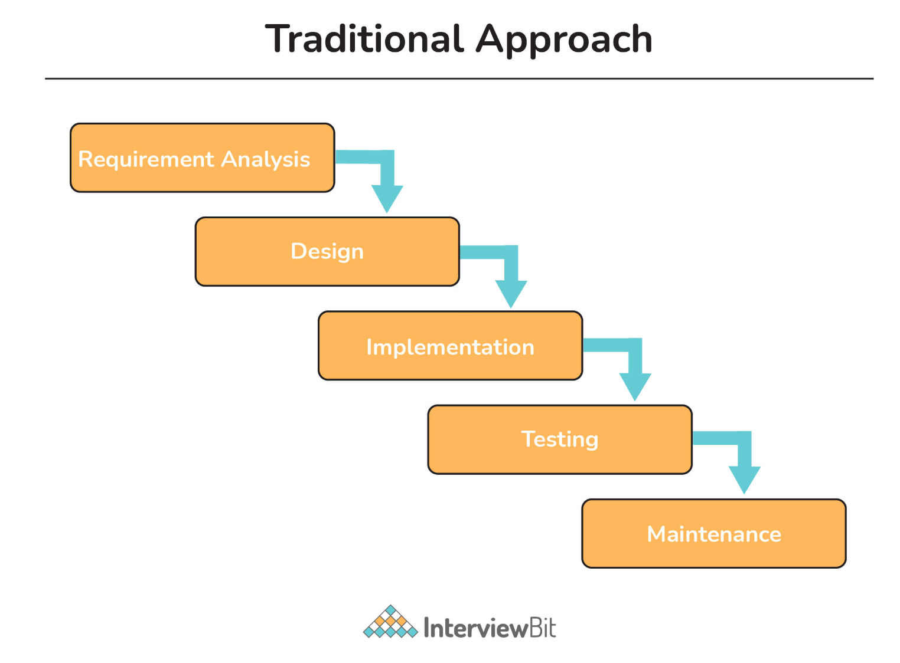
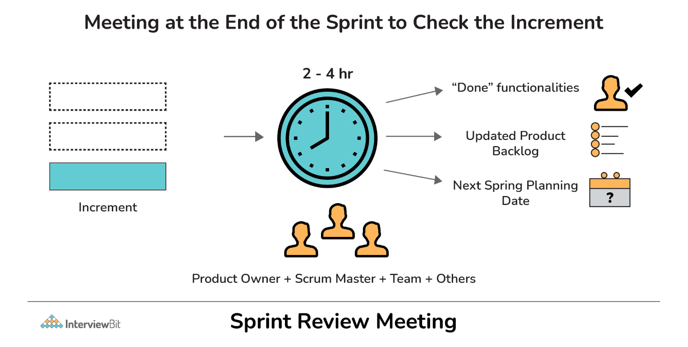

# Agile Interview Questions

---

1. What are different types of Agile Methodology?
   + `Scrum`: It is used to establish hypotheses, test them, reflect on the experience, and also make adjustments. It heavily depends on feedback, self-management, small teams, and work broken out into sprints. It relies on incremental development.
   + `FDD (Feature-Driven Development)`: It generally involves creating software models every two weeks and also needs development and design for each and every model feature. It is basically a lightweight iterative and incremental software development process whose main purpose is to deliver stable and working software on time.
   + `Lean Software Development`: It is basically a way of minimizing waste and maximizing value. It is more focused on process efficiency for optimum results in customer value. It is totally based on two guiding principles i.e., respect for people and continuous improvement.
   + `XP (Extreme Programming)`: Its main purpose is to produce higher-quality software and higher quality of life for the development team. It is considered low-risk, flexible and a way to develop software and ensures that clients get what they require. In this methodology, the software is tested right from day one, collecting feedback so as to improve the development process.
   + `DSDM (Dynamic Software Development Method)`: It generally focuses on the full project lifecycle and the main aim is to ensure good governance as the foundation for project management. It is user-driven and believes that modifications to the project are always expected. It also provides a full roadmap to deliver products on time and within budget.
   + `ASD (Adaptive System Development)`: It represents the idea that projects should always be in a state of continuous adaptation, and has a cycle of three repeating series i.e., speculate, collaborate, and learn.
   + `Crystal Methodology`: It mainly focuses on individuals and their interactions rather than processes. It is considered one of the most lightweight and flexible approaches to developing software. It is a family of agile methodologies that include different variants such as crystal clear, crystal yellow, crystal orange, and crystal red.
   + `Kanban`: Kanban projects are generally managed through a board or table (Kanban Board). This Kanban board is a tool that helps team members to keep an eye on workflow for measuring its progress and includes all the information that is needed to be done on the product at each stage along with its path of completion. Its main purpose is flexibility in task management, continuous improvement, and enhanced workflow.

2. What are advantages and disadvantages of Agile Process?
   + `Advantages`:
     + Adapt well with changing requirements
     + Face-to-face conversation with team members and customers
     + Focuses on technical excellence and good design
     + Fast and continuous development
     + Enables collaboration and interaction between client and project team
     + Ensure and promote customer satisfaction
     + Faster feedback from customers or end-users
     + Quick identification and elimination of errors found in the code
     + Division of agile project into sprints or iterations i.e., short and repeatable phases typically 1-4 weeks long
     + Quick delivery of products
     + Easy to manage with more flexibility
     + The end goal can be unknown: Agile is beneficial for projects where the goal is not defined and as the project progresses, the goal becomes more evident.
   + `Disadvatages`:
     + Lack of formal documentation and designing
     + Difficult to estimate resource requirement and effort
     + Not good for small development projects
     + Costly as compared to other development methodologies
     + Requires more time and energy from everyone
     + Risk of ever-lasting project
     + Difficult to scale large projects
     + Difficulty in testing and test construction.

3. Explain Agile Testing? What are the principles of Agile Testing?
   + `Agile testing`: as the name suggests, is a software testing process where software is tested for any defects, errors, or other issues. It is considered a core part of the development process as it enables testers and developers to work together as a team that in turn improves overall performance. It also helps in ensuring the successful delivery of high-quality products. Testing is usually performed so that testers can identify and resolve the problems early and at every point in the development process.
     
     + Principles of Agile Testing
       + `Continuous Testing`: Testing should be conducted continuously by the Agile team to ensure continuous development progress.
       + `Continuous Feedback`: This process generally encourages taking feedback from clients to make sure that the product meets the requirements of the client or customer.
       + `Team Work or collective work`: Not only testers but developers, business analysts can also perform software testing or application testing.
       + `Clean Code`: Quality of software is maintained as the team tests the software to ensure that the code is clean, simple, and tight. All errors and defects that are found during the testing phase are fixed quickly within the same iteration by the Agile Team.
       + `Less Documentation`: This process usually involves the usage of reusable checklists instead of lengthy documentation.
       + `Test-Driven`: In other conventional methods, testing is only performed after the implementation but in agile testing, testing is done during the implementation so that errors or any issues can be removed on time.
       + `Customer Satisfaction`: During the agile testing process, development progress is being shown to clients or customers so that they can adapt and update their requirements. This is done to ensure customer satisfaction.

4. What good qualities an Agile Tester should have?
   + Positive attitude and solution-oriented
   + Focused towards goal
   + Excellent communication skills
   + Understand and fulfill customer requirements
   + Basic knowledge about the Agile process and its principles
   + Critical and creative thinking
   + Share ideas effectively
   + Plan and prioritize work on the basis of requirements
   + Cope up with change

5. What do you mean by refactoring?
   + `Re-factoring`: an activity that involves alteration or modification of the internal structure of software without any change in its external behaviors or functionality. In this, developers make some changes or tinker with code to enhance and improve the internal structure of software. One of the most popular and widely used refactoring techniques in the agile software development process is Red-Green. The refactoring process makes the code more readable, understandable, and clean. The continuous habit of refactoring helps to make it easier to extend and maintain code.
     

6. What's the difference between sprint backlog and product backlog?
   + `Sprint Backlog`: generally owned by the development team. It only contains those features and requirements that are related to the specific sprint only. It is considered a subset of the product backlog. It is compiled of everything that must be done to complete a particular sprint. It only includes items that can be completed during each agile sprint. It is specific to the sprint goal only in a particular sprint.
   + `Product Backlog`: generally owned and maintained by the project owner. It usually contains each and every feature of the product as well as the requirements of the product. It is compiled to everything that must be done to complete the whole process. It just breaks down every item into a series of steps. It is more specific to the end goal of the product.
   

7. What is Spike and Zero Sprint in Agile?
   + `Spike`: refers to a too large and complex user story in software development that cannot be estimated until the development team runs a timeboxed investigation. These stories can be used for various activities like research, design, exploration, prototyping, etc. Spikes are usually created to resolve some technical issues and design problems in the project.
   + `Zero Sprint`: refers to the first step or pre-preparation step that comes just before the first sprint. It includes all activities such as setting a development environment, preparing backlog, etc.

8. What’s the difference between Agile methodology and Traditional methodology of Software Development?
   + `Agile Software Development`: an iterative approach that is used to design complicated software. In this method, project teams are allowed to be more flexible and ensure that the final is fulfilling the customer’s requirements. It develops customer-centric products and delivers in shorter sprints.
     
   + `Traditional Software Development`: a linear approach that is used to design simple software. In this method, all the phases of the process usually occur in sequence. It is more suitable for projects where the possibility of changes is negligible in the scope.
     
   

9.  What do you mean by the term “velocity” in Agile?
    + `Velocity`: a measurement unit that measures or calculates how much work an agile development team can successfully complete in a single sprint and how much time will be required to finish a project. It is widely used as a calibration tool that helps development teams to create accurate and efficient timelines. It is also used to identify problems and measure the improvements that occur with time.
      

10. What do you mean by Daily Stand-Up meeting?
    + `Daily stand-up meeting`: a day-to-day meeting among all the members of the agile team. Its main purpose is to know the current progress and performance of every team member that works on Scrum tasks. The meetings take place mostly in the morning and usually involves product owners, developers, and the scrum master.
      + These meetings usually take place for the following reasons:
        + To know what was done yesterday and what is the plan for today.
        + To provide a better understanding of goals.
        + To make sure that every team member is working toward the same goal.
        + To bring problems of team members into focus so that problems can be addressed quickly.
        + To bring everyone up to date on the information and help the team to stay organized.

11. What is Incremental and Iterative Development?
    + `Iterative Development`: a software development process where software development cycles (sprint and releases) are repeated until the final product is obtained. On the basis of feedback from customers or users, the product is again developed in cycles or releases and sprints i.e., adding new functionality in a repetitive manner.
    + `Incremental Development`: software development process where development works are sliced into increments or pieces or portions. In this, the software is developed and delivered in pieces or increments and each piece has a complete set of functionalities. The increment can either be small or large, and each increment is coded and tested fully. After testing each increment, they all are integrated so that they work as a whole.

12. What is a Product Roadmap?
    + `Product Roadmap`: as the name suggests, is a powerful tool that describes how a product is likely to grow over time. It is a holistic view of product features that create the product vision. It also indicates what development is building, business goals that the new product will achieve, problems that the product will solve, etc. A product roadmap is owned by the product manager. It also encourages the development team to work together to achieve the desired goal for the successful delivery of the product.

13. What are different project management tools that are mostly used in Agile?
    + Icescrum
    + Rally Software
    + Agilent
    + Version One
    + Agilo
    + X-planner

14. What is the difference between Agile and Scrum?
    + `Agile`: an approach mainly used for software development. In this methodology, complex projects are broken down into smaller units that are achievable in a specific time frame. It always involves customers in the development process.
    + `Scrum`: There are different agile methodologies, and Scrum is one of them. It promotes accountability, function, and teamwork similar to Agile. In simple words, it is an improved way of Agile methodology and shares the same principles and values of Agile with adding some of its own unique features.
    + Agile and Scrum both provide a flawless experience to customers in the software development cycle and share similar methods like collaborative iterations. But still, both of them cannot be substituted for each other. It mainly depends upon the type of project, budget, time, and feasibility to choose any one of them for project development.  There are several differences between them as given below:
      

15. What do you mean by Pair Programming? Write its advantages.
    + `Pair Programming`: as the name suggests, is a type of programming where two people write code together and work side-by-side on one machine or computer. It is basically a technique mostly used in agile software development. In this type of programming, one person writes code and another person checks and reviews each line of code. Both of them also switch their roles while doing work.
      
      + Advantages of Pair Programming:
        + Develop higher-quality code
        + Reduce the risk of errors
        + An effective way to share knowledge
        + Enhanced productivity
        + Improved team collaboration

16. What is Agile Manifesto? What are its values and principles?
    + Agile Manifesto: a document consisting of values and principles that are expressed in Agile. It was created in early 2001. It simply consists of 4 values and 12 key principles. This manifesto helps the development team to work more efficiently and provides a clear and measurable structure that promotes team collaboration, iterative development, etc. It is specially designed to improve development methodologies.
      + The 4 Agile Values:
        + `Individuals and Interactions over Processes and Tools`: It focuses on giving more attention and importance to communication with clients.
        + `Working Software over Comprehensive Documentation`: It focuses on the completion of the project and making sure that the project is completing the final deliverables.
        + `Customer Collaboration over Contract Negotiation`: It focuses on involving customers in all phases of the project so that the final product doesn’t lack any requirement that the client needs. It is done to ensure 100% customer satisfaction.
        + `Responding to Change over Following a Plan`: It focuses on changes and motivates the team to adopt the change quickly so that higher quality products can be delivered. Therefore, agile works in short sprints so that changes can be utilized for good.
      + The 12 Agile Principles:
        + `Customer Satisfaction`: First priority is to fulfill customer demands to ensure 100% customer satisfaction.
        + `Welcome Change`: Changes are important for improvement therefore even late in the development process, changes can be introduced and addressed throughout the development period.
        + `Deliver Frequently`: Products have to be delivered as soon as possible therefore focus on a shorter timescale.
        + `Work Together`: Both business stakeholders and team members work together through the development process for better collaboration.
        + `Motivated Team`: For delivering high-quality products, team members are motivated and encouraged. Team members are given the environment and support they need to perform effectively.
        + `Face-to-Face`:  Agile emphasizes Face-to-face communication which is the most effective and efficient way of conveying information. It helps the team to communicate simple and complex information in an effective way.
        + `Working Software`: Delivering working software to the customer is the major concern of Agile. Working software or product is the primary measure of progress towards the final product.
        + `Constant Pace`: Agile promotes sustainable development. All teams, sponsors, developers, and users that are involved in the agile process should maintain a constant speed to deliver working software in a short timescale.
        + `Good Design`: Focuses on good design and technical details to improve quality and agility (quick and graceful).
        + `Simplicity`: Team focuses on tasks and features that are essential and reduces the amount of work and time spent on complex features and tasks that are not essential. It is done to keep things simple.
        + `Self-Organization`: Agile team should be cross-functional and self-organized. It should not depend on the manager to assign work, instead should find their own work and manage the responsibilities and timelines. Such teams not only help to deliver good quality software but also provide the best designs, requirements, and architectures.
        + `Reflect and Adjust`: To improve the effectiveness of a team, the team reflects on how to become more effective and assess their working style at regular intervals. This is done so that one can learn from their mistakes and take some steps to improve their performance in the next iterations.

17. What are Burn-up and Burn-down charts in Agile?
    + `Burn-up Chart`: chart that is used to display or represent the amount of work that has been completed and the total amount of work for a sprint or iteration.
    + `Burn-down Chart`: chart that is used to display or represent the amount of work that is remaining to be completed in the project. These charts are very simple and easy to understand.

18. What are different types of Burn-Down charts?
    + `Product Burndown Chart`: chart that is used to show story points of each completed sprint so that it depicts the completion of requirements over time. It mainly shows how many of the product goals are being achieved by the team and how much work is remaining.
    + `Sprint Burndown Chart`: chart that is used to show the remaining works for the scrum team of a particular sprint. It makes the work of the team visible and shows the rate at which work is completed and how much is remaining to be completed.
    + `Release Burndown Chart`: chart that is used to show how a team is progressing against the work for a release. This chart is updated by the scrum team at the end of each sprint. It is very essential to see what process is being made during each sprint.
    + `Defect Burndown Chart`: chart that is used to show the total number of defects that are being identified and fixed or removed.

19. Name three main Agile frameworks other than Scrum for product development.
    + Kanban
    + Test-Driven Development (TDD)
    + Feature Driven Development (FDD)

20. What is “Planning Poker” technique?
    + `Planning Poker`: also known as Scrum Poker, is a consensus-based technique that not only helps agile teams to estimate the time and effort that is required to complete each initiative on their product backlog but also identifies issues before time and within the course of a user story. It makes the meeting more short, productive and creates estimates with the involvement of the whole team. It is mainly used to avoid the influence of other participants, and force each person to think independently and give their opinion.

21. What is a Sprint Planning Meeting, Sprint Review Meeting and Sprint Retrospective Meeting?
    + `Sprint Planning Meeting`: the discussion takes place about features and product backlog items (user stories) that are important to the team. This meeting is usually attended by the product owner, Scrum Master and Scrum Team. It is a weekly meeting and usually lasts for about an hour.
    + `Sprint Review Meeting`: the Scrum team gives a demonstration of the product. After this, the product owner determines which items completed and which are not completed. He also adds some additional items to the product backlog on the basis of feedback from customers or stakeholders. Its main aim is to inspect the product being created in the sprint and modify it if required.
      
    + `Sprint Retrospective Meeting`: This meeting takes place after the Sprint planning meeting. In this meeting, the Scrum team meets again to inspect itself and discuss the past mistakes, potential issues and methods to resolve them. Main aim of this meeting is to improve the development process. This meeting lasts for about 2-3 hours.
      

22. What do you mean by the term “increment”?
    + `Increment`: is simply the sum or total of all the product backlog items that were completed during a sprint and the value of increments of all previous sprints. It is the total work completed within the current and previous sprints.

23. What are standard or common metrics for Agile? Explain.
    + `Agile Metrics`: standard metrics that are used to measure the work of the team. These metrics are used to determine the quality of work, productivity, progress, team health, etc. Its main focus is on value delivered to customers and how much end-users were impacted by it.
    + Standard Metrics for the Agile project:
      + `Velocity`: It measures the amount of work done by the development team during a sprint. It gives ideas about progress, capacity, etc.
      + `Cumulative Flow Diagram`: It is a flow diagram used to measure the current status of work in progress of the team. It is simply used to track the progress of agile teams and manage flow stability.
      + `Defect Removal Awareness`: It is used to measure the ability of the development team to remove defects prior to release. It helps to maintain the quality of products by a working team.
      + `Work Category Allocation`: It is used to measure where we are spending or investing our time so that we can adjust our priorities.
      + `Sprint Burndown Metric`: It is used to measure the total number of sprints or tasks that are completed as compared to estimated scrum tasks. It usually tracks the progress being made on tasks during a Sprint.
      + `Defect Resolution Time`: It is used to measure the time taken by the team to identify and fix the defects or bugs in the software. There are several processes involved in fixing bugs.
      + `Time Coverage or Code Coverage`: It is used to measure the time that is given to code during testing. It helps one to understand how much code is tested and also helps in assessing the test performance.
      + Business Value Delivered: It is used to measure the efficiency of the working team.

24. What is Scrum? Write its advantages.
    + `Scrum`: a lightweight process framework that helps scrum teams to work together and manage product development to deliver products in the shortest time. The product provided by the scrum team in the shortest period is known as a sprint. Its main aim is to manage tasks within a team-based development environment. It is especially used to manage project development for software products and can also be used in business-related contexts.
      + `Advantages of Scrum`:
        + Releases product quickly to users and customers
        + Ensures effective use of time and money and therefore saves cost
        + Best suited for fast-moving development projects
        + Ability to incorporates changes as they occur
        + Emphasizes creativity and innovation to increase business value
        + Large and complex projects are divided into small and easily manageable sprints

25. What are different roles in Scrum?
    + There are three different roles in Scrum as given below:
      
      + `Scrum Master`: Scrum Master is basically a team leader or supervisor of a team who is responsible for ensuring that the scrum team executes committed tasks properly.
      + `Product Owner`: The product owner is basically a stakeholder of the project who is responsible for managing the product backlog. He/She is also responsible for defining a vision of what to build for the team.
      + `Development Team`: It involves an individual person and each person is responsible for working collectively to complete a particular project. It is the team that is responsible for developing actual product increments and meeting sprint goals.

26. What do you mean by Scrum Master? What are the responsibilities of Scrum Master?
    + `Scrum Master`: also referred to as servant leaders, is a person who is a master of Scrum i.e., the person who is responsible for managing and facilitating an agile development team and makes sure that the scrum framework is followed. Scrum master is also referred to as coach of the team that helps team members to do and give their best as much as possible.
      
      + `Responsibilities of Scrum Master`:
        + Protect the team from distractions
        + Motivate and guide the team to achieve the sprint goal
        + Build a self-organized and motivated team
        + Increase efficiency and productivity of the team
        + Ensures that the team delivers expected value during the sprint
        + Ensures that the team follows values, practices, and principles of Scrum
        + Eliminate external blockers and manage internal roadblocks
        + Lead the meetings and resolve any kind of issues

27. What are the main artifacts of Scrum Framework?
    + There are three main artifacts of Scrum Framework:
      
      + `Product Backlog`: It is a list of all requirements from clients or stakeholders that are needed in the product and should be accomplished before the end of the project.
      + `Sprint Backlog`: It is a list of all finalized user stories, bug fixes, work items, etc., that are completed and selected by scrum to be completed during the current sprint.
      + `Product Increment`: It is the version of the end product derived from the completion of each Sprint.

28. Explain the terms User story, Epic, and Tasks in Scrum?
      
      + `Epic`: It is basically a large story that cannot be completed in a single sprint. Therefore, epics are sub-divided into multiple, smaller user stories before they can be worked on.
      + `User story`: These are the smallest units that can be fitted and completed in one sprint. User stories are further broken down into different tasks.
      + `Tasks`: These are detailed pieces of work that are necessary to turn user stories into workable components.

29. What are the important tools that are mostly used in a Scrum Project?
    + Version One
    + Sprintster
    + Atlassian JIRA
    + RTC Jazz, etc.

30. Explain TimeBoxing in Scrum.
    + `Timeboxing`: an important time management technique or tool that is used to limit the amount of time that is being spent to complete a task. It simply allows a fixed unit of time for each and every task and this unit is known as a time box. The maximum length of the time box is 15 minutes. It not only helps to improve focus but also results in an increase in productivity. There are some events in Scrum and all these events are timeboxed which means all these events are allotted with a maximum and fixed unit of time for the task. The events that are time-boxed are listed below:
      + Sprint
      + Sprint Planning
      + Daily Scrum
      + Sprint Review
      + Sprint retrospective
    

31. Explain the term “impediments” in Scrum.
    + `Impediments`: are something that blocks or stops the progress of teamwork. It causes the team not able to perform their task in a better way and on time that in turn also slows down the velocity. It’s the responsibility of the Scrum master to remove or resolve impediments. Impediments can be anything as listed below:
      + Missing resource
      + Strict boss or team member
      + Technical or operational issue
      + Power outage
      + Lack of understanding about agile or scrum
      + External issues such as war, weather, etc.
      + Business problems

32. What is the main role of Sashimi in Scrum?
    + `Sashimi`: a Japanese word whose meaning is pierced body. In scrum, Sashimi is a technique that is simply used to check whether all functions (every phase of the software development cycle) are completed or not after the product is displayed. Functions include requirement analysis, planning, design, development, testing, and documentation.

33. Explain the term “story point” in Scrum.
    + `Story point`: a unit to estimate total efforts that are required to complete or to do a particular task or user story. It gives more accurate measures, reduces planning time, predicts releases date more accurately.

34. What do you mean by Scrum of Scrums (SoS)?
    + `Scrum of Scrums (SoS)`: as the name suggests, is an Agile technique that involves meeting more than one scrum team and integrating the work of each team working on the same project. In simple words, it coordinates the work of multiple teams who need to work together to deliver complex solutions. In this meeting, members or representatives of individual teams share their high-level updates about their respective team’s work. Its main is to ensure coordination and integration of output from multiple teams by eliminating impediments if present.
      
