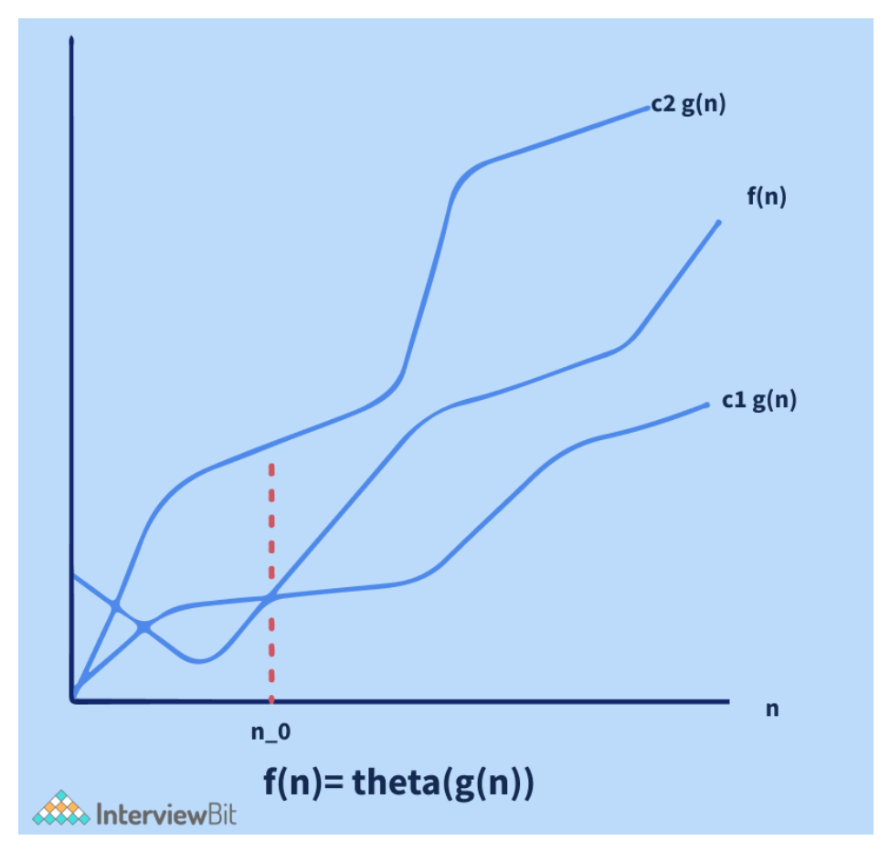

# Algorithm Interview Questions

---

## Background
Algorithms and Data Structures are a crucial component of any technical coding interview. It does not matter if you are a C++ programmer, a Java programmer, or a Web developer using JavaScript, Angular, React, JQuery, or any other programming language.


A programmer should have a thorough understanding of both basic data structures, such as arrays, linked lists, trees, hash tables, stacks, and queues, etc. and conventional algorithms, such as Binary Search, Dynamic Programming, and so on. Therefore, in this article we would be mostly focussing on Algorithms - an introduction to algorithms, a lot of algorithms interview questions which are being asked in the coding interviews of various companies and also a few Algorithms MCQs which we think everyone should practice in order to have a better understanding of algorithms.

Now, the very first question which must be popping in your head must be "What is an algorithm?" Well, the answer to this question is: An algorithm is a finite sequence of well-defined instructions used to solve a class of problems or conduct a computation in mathematics and computer science.

Algorithms are used to specify how calculations, data processing, automated reasoning, automated decision making, and other tasks should be done. An algorithm is a method for calculating a function that can be represented in a finite amount of space and time and in a well defined formal language. The instructions describe a computation that, when run, continues through a finite number of well defined subsequent stages, finally creating "output" and terminating at a final ending state, starting from an initial state and initial input (possibly empty). The shift from one state to the next is not always predictable; some algorithms, known as randomised algorithms, take random input into account.


### The Need For Algorithms (Advantages of Algorithms):
Before diving deep into algorithm interview questions, let us first understand the need for Algorithms in today's world. The following are some of the benefits of using algorithms in real-world problems.

+ Algorithms boost the effectiveness of an existing method.
+ It is easy to compare an algorithm's performance to those of other approaches using various methods (Time Complexity, Space Complexity, etc.).
+ Algorithms provide the designers with a detailed description of the criteria and goals of the problems.
+ They also enable a reasonable comprehension of the program's flow.
+ Algorithms evaluate how well the approaches work in various scenarios (Best cases, worst cases, average cases).
+ An algorithm also determines which resources (input/output, memory) cycles are necessary.
+ We can quantify and assess the problem's complexity in terms of time and space using an algorithm.
+ The cost of design is also reduced if proper algorithms are used.


---

1. How can we compare between two algorithms written for the same problem?
   + The complexity of an algorithm is a technique that is used to categorise how efficient it is in comparison to other algorithms. It focuses on how the size of the data set to be processed affects execution time. In computing, the algorithm's computational complexity is critical. It is a good idea to categorise algorithms according to how much time or space they take up and to describe how much time or space they take up as a function of input size.
     + `Complexity of Time`: the running time of a program as a function of the size of the input is known as time complexity.
     + `Complexity of Space`: examines algorithms based on how much space they require to fulfil their tasks. In the early days of computers, space complexity analysis was crucial (when storage space on the computer was limited).
   + `Note`: Nowadays, a lack of space is rarely an issue because computer storage is plentiful. Therefore, it is mostly the Time Complexity that is given more importance while evaluating an Algorithm.

2. What do you understand by the best case, worst case and average case scenario of an algorithm?
   + The mathematical foundation/framing of an algorithm's run time performance is defined by asymptotic analysis. We can easily determine the best case, average case, and worst-case scenarios of an algorithm using asymptotic analysis.
     + `Best Case Scenario of an Algorithm`: the data arrangement in which the algorithm performs the best. Take a binary search, for example, where the best-case scenario is if the target value is in the very centre of the data we are looking for. The best-case scenario for binary search would have a time complexity of O(1) or constant time complexity.
     + `Worst Case Scenario of an Algorithm`: The worst collection of input for a given algorithm is referred to as the worst-case scenario of an Algorithm. For example, quicksort can perform poorly if the pivot value is set to the largest or smallest element of a sublist. Quicksort will degenerate into an algorithm with a time complexity of O(n^2), where n is the size of the list to be sorted.
     + `Average Case Scenario of an Algorithm`: the amount of some computational resource (usually time) used by the process, averaged over all possible inputs, according to computational complexity theory. For example, the average-case complexity of the randomised quicksort algorithm is O(n*log(n)), where n is the size of the list to be sorted.

3. What do you understand by the Asymptotic Notations?
   + `Asymptotic analysis`: a technique that is used for determining the efficiency of an algorithm that does not rely on machine-specific constants and avoids the algorithm from comparing itself to the time-consuming approach. For asymptotic analysis, asymptotic notation is a mathematical technique that is used to indicate the temporal complexity of algorithms.
   + The following are the three most common asymptotic notations:
     + `Big Theta Notation: (θ Notation)`: the exact asymptotic behaviour is defined using the theta (θ) Notation. It binds functions from above and below to define behaviour. Dropping low order terms and ignoring leading constants is a convenient approach to get Theta notation for an expression.
       
     + `Big O Notation`: defines an upper bound for an algorithm by bounding a function from above. Consider the situation of insertion sort: in the best case scenario, it takes linear time, and in the worst case, it takes quadratic time. Insertion sort has a time complexity O(n^2). It is useful when we just have an upper constraint on an algorithm's time complexity.
       
     + `Big Omega (Ω) Notation`: provides an asymptotic lower bound on a function, just like Big O notation does. It is useful when we have a lower bound on an algorithm's time complexity.
       

4. Write an algorithm to swap two given numbers in Java without using a temporary variable.
   + It is a trick question that is frequently asked in the interviews of various companies. This problem can be solved in a variety of ways. However, while solving the problem, we must solve it without using a temporary variable, which is an essential condition. For this problem, if we can consider the possibility of integer overflow in our solution while coming up with an approach to solving it, we can make a great impression on interviewers.
   + Let us say that we have two integers a and b, with a's value equal to 5 and b's value equal to 6, and we want to swap them without needing a third variable. We will need to use Java programming constructs to solve this problem. Mathematical procedures such as addition, subtraction, multiplication, and division can be used to swap numbers. However, it is possible that it will cause an integer overflow problem.
   + `Using Addition and subtraction`:
     ```
     a = a + b;
     b = a - b; // this will act like (a+b) - b, and now b equals a.
     a = a - b; // this will act like (a+b) - a, and now an equals b.
     ```
     + It is a clever trick. However, if the addition exceeds the maximum value of the int primitive type as defined by Integer.MAX_VALUE in Java, or if the subtraction is less than the minimum value of the int primitive type as defined by Integer.MIN_VALUE in Java, there will be an integer overflow.
   + `Using the XOR method`: Another way to swap two integers without needing a third variable (temporary variable) is using the XOR method. This is often regarded as the best approach because it works in languages that do not handle integer overflows, such as Java, C, and C++. Java has a number of bitwise operators. XOR (denoted by ^) is one of them.
     ```
     x = x ^ y;
     y = x ^ y;
     x = x ^ y;
    ```

5. Explain the Divide and Conquer Algorithmic Paradigm. Also list a few algorithms which use this paradigm.
   + `Divide and Conquer`: an algorithm paradigm, not an algorithm itself. It is set up in such a way that it can handle a large amount of data, split it down into smaller chunks, and determine the solution to the problem for each of the smaller chunks. It combines all of the piecewise solutions of the smaller chunks to form a single global solution. This is known as the divide and conquer technique. The Divide and Conquer algorithmic paradigm employ the steps given below:
     + `Divide`: separates the original problem into a set of subproblems in this step.
     + `Conquer`: solves each subproblem individually in this step.
     + `Combine`: the algorithm combines the solutions to the subproblems to obtain the overall solution.
     
     + Some of the algorithms which use the Divide and Conquer Algorithmic paradigm are as follows:
       + Binary Search
       + Merge Sort
       + Strassen's Matrix Multiplication
       + Quick Sort
       + Closest pair of points.

6. What do you understand about Greedy algorithms? List a few examples of greedy algorithms.
   + `Greedy Algorithm`: an algorithmic method that aims to choose the best optimal decision at each sub-step, eventually leading to a globally optimal solution. This means that the algorithm chooses the best answer available at the time, regardless of the consequences. In other words, when looking for an answer, an algorithm always selects the best immediate, or local, option. Greedy algorithms may identify less than perfect answers for some cases of other problems while finding the overall, ideal solution for some idealistic problems.
   + The Greedy algorithm is used in the following algorithms to find their solutions:
     + Prim's Minimal Spanning Tree Algorithm
     + Kruskal's Minimal Spanning Tree Algorithm
     + Travelling Salesman Problem
     + Fractional Knapsack Problem
     + Dijkstra's Algorithm
     + Job Scheduling Problem
     + Graph Map Coloring
     + Graph Vertex Cover.

7. What do you understand by a searching algorithm? List a few types of searching algorithms.
   + `Searching Algorithms`: used to look for an element or get it from a data structure (usually a list of elements). These algorithms are divided into two categories based on the type of search operation:
     + `Sequential Search`: traverses the list of elements consecutively, checking each element and reporting if the element to be searched is found. Linear Search is an example of a Sequential Search Algorithm.
     + `Interval Search`: created specifically for searching sorted data structures. Because they continually target the centre of the search structure and divide the search space in half, these types of search algorithms are far more efficient than Sequential Search algorithms. Binary Search is an example of an Interval Search Algorithm.

8. Describe the Linear Search Algorithm.
   + `Linear Search Algorithm`: used to find an element in a group of elements. It works by traversing the list of elements from the beginning to the end and inspecting the properties of all the elements encountered along the way. Let us consider the case of an array containing some integer elements. We want to find out and print all of the elements' positions that match a particular value (also known as the "key" for the linear search). The linear search works in a flow here, matching each element with the number from the beginning to the end of the list, and then printing the element's location if the element at that position is equal to the key.
   + Given below is an algorithm describing Linear Search:
     + `Step 1`: Using a loop, traverse the list of elements given.
     + `Step 2`: In each iteration, compare the target value (or key-value) to the list's current value.
     + `Step 3`: If the values match, print the array's current index.
     + `Step 4`: Move on to the next array element if the values do not match.
     + `Step 5`: Repeat Steps 1 to 4 till the end of the list of elements is reached.
     
   + `Note`: The time complexity of the Linear Search Algorithm is O(n) where n is the size of the list of elements and its space complexity is constant, that is, O(1).

9. Describe the Binary Search Algorithm.
   + To apply binary search on a list of elements, the prerequisite is that the list of elements should be sorted. It is based on the Divide and Conquers Algorithmic paradigm. In the Binary Search Algorithm, we divide the search interval in half periodically to search the sorted list. We begin by creating an interval that spans the entire list. If the search key's value is less than the item in the interval's midpoint, the interval should be narrowed to the lower half. Otherwise, we limit it to the upper half of the page. We check for the value until it is discovered or the interval is empty. Given below is an algorithm describing Binary Search: (Let us assume that the element to be searched is x and the array of elements is sorted in ascending order).
     + `Step 1`: x should be firstly compared to the middle element.
     + `Step 2`: We return the middle element's index if x matches the middle element.
     + `Step 3`: Else If x is greater than the middle element, x can only be found after the middle element in the right half subarray since the array is sorted in the ascending order. As a result, we repeat the process for the right half.
     + `Step 4`: Otherwise, we repeat for the left half (x is smaller).
     + `Step 5`: If the interval is empty, we terminate the binary search.
   + `Note`: The time complexity of the Binary Search Algorithm is O(log(n)) where n is the size of the list of elements and its space complexity is constant, that is, O(1).

10. Write down an algorithm for adding a node to a linked list sorted in ascending order(maintaining the sorting property).
    + An algorithm for adding a node to a link list sorted in ascending order (maintaining the sorting property) is given below:
      + `Step 1`: Check if the linked list has no value (or is empty). If yes, then set the new node as the head and return it.
      + `Step 2`: Check if the value of the node to be inserted is smaller than the value of the head node. If yes, place it at the beginning and make it the head node.
      + `Step 3`: Find the suitable node after which the input node should be added in a loop. To discover the required node, begin at the head and work your way forward until you reach a node whose value exceeds the input node. The preceding node is the correct node.
      + `Step 4`: After the correct node is found in step 3, insert the node.

11. Write an algorithm for counting the number of leaf nodes in a binary tree.
    + An algorithm for counting the number of leaf nodes in a binary tree is given below:
      + `Step 1`: If the current node is null, return a value 0.
      + `Step 2`: If a leaf node is encountered, that is, if the current node's left and right nodes are both null, then return 1.
      + `Step 3`: Calculate the number of leaf nodes recursively by adding the number of leaf nodes in the left subtree by the number of leaf nodes in the right subtree.

12. What do you understand about the Dynamic Programming (DP) Algorithmic Paradigm? List a few problems which can be solved using the same.
    + `Dynamic Programming (DP)`: primarily a recursion optimization. We can use Dynamic Programming to optimise any recursive solution that involves repeated calls for the same inputs. The goal is to simply save the results of subproblems so that we do not have to recalculate them later. The time complexity of this simple optimization is reduced from exponential to polynomial. For example, if we create a simple recursive solution for Fibonacci Numbers, the time complexity is exponential, but if we optimise it by storing subproblem answers using Dynamic Programming, the time complexity is linear.
      + `With Recursion (no DP)`: The time complexity of the given code will be exponential.
        ```
        /*Sample C++ code for finding nth fibonacci number without DP*/
        int nFibonacci(int n){
          if(n == 0 || n == 1) return n;
          else return nFibonacci(n - 1) + nFibonacci(n - 2);
        }
        ```
      +` With DP`: The time complexity of the given code will be linear because of Dynamic Programming.
        ```
        /*Sample C++ code for finding nth fibonacci number with DP*/
        int nFibonacci(int n){
          vector<int> fib(n + 1);
            fib[0] = 0;
            fib[1] = 1;
            for(int i = 2;i <= n;i ++){
                fib[i] = fib[i - 1] + fib[i - 2];
            }
            return fib[n];
        }
        ```
    + A few problems which can be solved using the Dynamic Programming (DP) Algorithmic Paradigm are as follows:
      + Finding the nth Fibonacci number
      + Finding the Longest Common Subsequence between two strings.
      + Finding the Longest Palindromic Substring in a string.
      + The discrete (or 0-1) Knapsack Problem.
      + Shortest Path between any two nodes in a graph (Floyd Warshall Algorithm)

13. Write down a string reversal algorithm. If the given string is "kitiR," for example, the output should be "Ritik".
    + `Step 1`: Start.
    + `Step 2`: We take two variables l and r.
    + `Step 3`: We set the values of l as 0 and r as (length of the string  - 1).
    + `Step 4`: We interchange the values of the characters at positions l and r in the string.
    + `Step 5`: We increment the value of l by one.
    + `Step 6`: We decrement the value of r by one.
    + `Step 7`: If the value of r is greater than the value of l, we go to step 4
    + `Step 8`: Stop.

14. What do you understand about the Breadth First Search (BFS) algorithm.
    + `Breadth First Search (BFS)`: a graph traversal technique. It begins by traversing the graph from the root node and explores all of the nodes in the immediate vicinity. It chooses the closest node and then visits all of the nodes that have yet to be visited. Until it reaches the objective node, the algorithm repeats the same method for each of the closest nodes.
    + The BFS Algorithm is given below:
      + `Step 1`: Set status = 1 as the first step for all the nodes(ready state).
      + `Step 2`: Set the status of the initial node A to 2, that is, waiting state.
      + `Step 3`: Repeat steps 4 and 5 until the queue is not empty.
      + `Step 4`: Dequeue and process node N from the queue, setting its status to 3, that is, the processed state.
      + `Step 5`: Put all of N's neighbours in the ready state (status = 1) in the queue and set their status to 2 (waiting state)
      + `Step 6`: Exit.

15. What do you understand about the Depth First Search (DFS) algorithm.
    + `Depth First Search (DFS)`: a technique for traversing or exploring data structures such as trees and graphs. The algorithm starts at the root node (in the case of a graph, any random node can be used as the root node) and examines each branch as far as feasible before retracing. So the basic idea is to start at the root or any arbitrary node and mark it, then advance to the next unmarked node and repeat until there are no more unmarked nodes. After that, go back and check for any more unmarked nodes to cross. Finally, print the path's nodes. The DFS algorithm is given below:
      + `Step 1`: Create a recursive function that takes the node's index and a visited array as input.
      + `Step 2`: Make the current node a visited node and print it.
      + `Step 3`: Call the recursive function with the index of the adjacent node after traversing all nearby and unmarked nodes.

16. How do the encryption algorithms work?
    + `Encryption`: the process of transforming plaintext into a secret code format known as "Ciphertext''. For calculations, this technique uses a string of bits known as "keys" to convert the text. The larger the key, the more potential patterns for producing ciphertext there are. The majority of encryption algorithms use fixed blocks of input with lengths ranging from 64 to 128 bits, while others use the stream technique.

17. What are few of the most widely used cryptographic algorithms?
    + IDEA
    + CAST
    + CMEA
    + 3-way
    + Blowfish
    + GOST
    + LOKI
    + DES and Triple DES.

18. Describe the merge sort algorithm.
    + `Merge sort (also known as mergesort)`: a general-purpose, comparison-based sorting algorithm developed in computer science. The majority of its implementations result in a stable sort, which indicates that the order of equal elements in the input and output is the same. In 1945, John von Neumann devised the merge sort method, which is a divide and conquer algorithm. The following is how a merge sort works conceptually:
      + Separate the unsorted list into n sublists, each with one element (a list of one element is considered sorted).
      + Merge sublists repeatedly to create new sorted sublists until only one sublist remains. The sorted list will be displayed then.
    + The time complexity of the Merge Sort Algorithm is O(nlog(n)) where n is the size of the list of the elements to be sorted while the space complexity of the Merge Sort Algorithm is O(n), that is, linear space complexity.
    

19. Describe the quick sort algorithm.
    + `Quicksort`: a sorting algorithm that is in place (in-place algorithm is an algorithm that transforms input using no auxiliary data structure). It was created by the British computer scientist Tony Hoare in 1959 and was published in 1961, and it is still a popular sorting algorithm. It can be somewhat quicker than merge sort and two or three times faster than heapsort when properly done.
    + Quicksort is based on the divide and conquer algorithmic paradigm. It operates by picking a 'pivot' element from the array and separating the other elements into two subarrays based on whether they are greater or less than the pivot. As a result, it is also known as partition exchange sort. The subarrays are then recursively sorted. This can be done in place, with only a little amount of additional RAM (Random Access Memory) required for sorting.
    + Quicksort is a comparison sorting algorithm, which means it can sort objects of any type that have a "less-than" relation (technically, a total order) declared for them. Quicksort is not a stable sort, which means that the relative order of equal sort items is not retained in efficient implementations. Quicksort (like the partition method) must be written in such a way that it can be called for a range within a bigger array, even if the end purpose is to sort the entire array, due to its recursive nature.
    + The following are the steps for in-place quicksort:
      + If there are less than two elements in the range, return immediately because there is nothing else to do. A special-purpose sorting algorithm may be used for other very small lengths, and the rest of these stages may be avoided.
      + Otherwise, choose a pivot value, which is a value that occurs in the range (the precise manner of choice depends on the partition routine, and can involve randomness).
      + Partition the range by reordering its elements while determining a point of division so that all elements with values less than the pivot appear before the division and all elements with values greater than the pivot appear after it; elements with values equal to the pivot can appear in either direction. Most partition procedures ensure that the value that ends up at the point of division is equal to the pivot, and is now in its ultimate location because at least one instance of the pivot is present (but termination of quicksort does not depend on this, as long as sub-ranges strictly smaller than the original are produced).
      + Apply the quicksort recursively to the sub-range up to the point of division and the sub-range after it, optionally removing the element equal to the pivot at the point of division from both ranges. (If the partition creates a potentially bigger sub-range near the boundary with all elements known to be equal to the pivot, these can also be omitted.)
    + Quicksort's mathematical analysis reveals that, on average, it takes O(nlog (n) time complexity to sort n items. In the worst-case scenario, it performs in time complexity of O(n^2).
    + `Note`: The algorithm's performance can be influenced by the partition routine (including the pivot selection) and other details not fully defined above, possibly to a large extent for specific input arrays. It is therefore crucial to define these alternatives before discussing quicksort's efficiency.

20. Describe the bubble sort algorithm with the help of an example.
    + `Bubble sort`: also known as sinking sort, is a basic sorting algorithm that iterates through a list, comparing neighbouring elements and swapping them if they are out of order. The list is sent through again and again until it is sorted. The comparison sort method is named from the manner that smaller or larger components "bubble" to the top of the list. This simplistic method performs badly in real-world situations and is mostly used as a teaching aid. Let us take an example to understand how bubble sort works:
    + Let us assume that the array to be sorted is (50 10 40 20 80). The various passes or rounds of bubble sort are given below:
      + `First Pass`:
        + (50 10 40 20 80) –> ( 10 50 40 20 80 ), Since 50 > 10, the algorithm compares the first two elements and swaps them.
        + ( 10 50 40 20 80 ) –>  ( 10 40 50 20 80 ), Since 50 > 40, the algorithm swaps the values at the second and third positions.
        + (10 40 50 20 80) –> (10 40 20 50 80), Since 50 > 3, the algorithm swaps the third and fourth elements.
        + (10 40 20 50 80) -> ( 10 40 20 50 80 ), The method does not swap the fourth and fifth elements because they are already in order (80 > 50).
      + `Second Pass`:
        + ( 10 40 20 50 80 ) –> ( 10 40 20 50 80 ) , Elements at first and second position are in order so now swapping.
        + ( 10 40 20 50 80 ) –> ( 10 20 40 50 80 ), Since 40 > 20, the algorithm swaps the values at the second and third positions.
        + ( 10 20 40 50 80 ) –> ( 10 20 40 50 80 ), Elements at the third and fourth position are in order so now swapping.
        + ( 10 20 40 50 80 ) –>  ( 10 20 40 50 80 ), Elements at fourth and fifth position are in order so now swapping.
        + The array is now sorted, but our algorithm is unsure whether it is complete. To know if the algorithm is sorted, it must complete one complete pass without any swaps.
      + `Third Pass`:
        + ( 10 20 40 50 80 ) –> ( 10 20 40 50 80 ), Elements at the first and second position are in order so now swapping.
        + ( 10 20 40 50 80 ) –> ( 10 20 40 50 80 ), Elements at the second and third position are in order so now swapping.
        + ( 10 20 40 50 80 ) –> ( 10 20 40 50 80 ), Elements at the third and fourth position are in order so now swapping.
        + ( 10 20 40 50 80 ) –> ( 10 20 40 5 80 ), Elements at the fourth and fifth position are in order so now swapping.

21. Write an algorithm to find the maximum subarray sum for a given array. In other words, find the maximum sum that can be achieved by taking contiguous elements from a given array of integers.
    + `Kadane's algorithm`: can be used to find the maximum subarray sum for a given array. From left to right, Kadane's algorithm searches the provided array. It then computes the subarray with the largest sum ending at position j in the jth step, and this sum is stored in the variable "currentSum". Furthermore, it computes the subarray with the biggest sum anywhere in the subarray starting from the first position to the jth position, that is, in A[1...j], and stores it in the variable "bestSum". This is done by taking the maximum value of the variable "currentSum" till now and then storing it in the variable "bestSum".  In the end, the value of "bestSum" is returned as the final answer to our problem.
    + Formally, Kadane's algorithm can be stated as follows:
      + `Step 1`: Initialize the following variables:
        + bestSum = INT_MIN
        + currentSum = 0 // for empty subarray, it is initialized as value 0
      + `Step 2`: Loop for each element of the array A
        + (a) currentSum  = currentSum  + A[i]
        + (b) if(bestSum < currentSum)
              bestSum = currentSum
        + (c) if(currentSum  < 0)
              currentSum = 0
      + Step 3: return bestSum

22. Explain the Dijkstra's Algorithm to find the shortest path between a given node in a graph to any other node in the graph.
    + `Dijkstra's Algorithm`: a method for determining the shortest pathways between nodes in a graph, which might be used to depict road networks. Edsger W. Dijkstra, a computer scientist, conceived it in 1956 and published it three years later. There are numerous variations of the algorithm. The original Dijkstra algorithm discovered the shortest path between two nodes, but a more frequent form fixes a single node as the "source" node and finds the shortest pathways from the source to all other nodes in the network, resulting in a shortest-path tree. Let us take a look at Dijkstra's Algorithm to find the shortest path between a given node in a graph to any other node in the graph:
      + Let us call the node where we are starting the process as the initial node. Let the distance from the initial node to Y be the distance of node Y. Dijkstra's algorithm will begin with unlimited distances and attempt to improve them incrementally.
        + `Step 1`: Mark all nodes that have not been visited yet. The unvisited set is a collection of all the nodes that have not been visited yet.
        + `Step 2`: Assign a tentative distance value to each node: set it to zero for our first node and infinity for all others. The length of the shortest path discovered so far between the node v and the initial node is the tentative distance of a node v. Because no other vertex other than the source (which is a path of length zero) is known at the start, all other tentative distances are set to infinity. Set the current node to the beginning node.
        + `Step 3`: Consider all of the current node's unvisited neighbours and determine their approximate distances through the current node. Compare the newly calculated tentative distance to the current assigned value and choose the one that is less. If the present node A has a distance of 5 and the edge linking it to a neighbour B has a length of 3, the distance to B through A will be 5 +3 = 8. Change B to 8 if it was previously marked with a distance greater than 8. If this is not the case, the current value will be retained.
        + `Step 4`: Mark the current node as visited and remove it from the unvisited set once we have considered all of the current node's unvisited neighbours. A node that has been visited will never be checked again.
          + Stop if the destination node has been marked visited (when planning a route between two specific nodes) or if the smallest tentative distance between the nodes in the unvisited set is infinity (when planning a complete traversal; occurs when there is no connection between the initial node and the remaining unvisited nodes). The algorithm is now complete.
        + `Step 5`: Otherwise, return to step 3 and select the unvisited node indicated with the shortest tentative distance as the new current node.
        
     + It is not required to wait until the target node is "visited" as described above while constructing a route: the algorithm can end once the destination node has the least tentative distance among all "unvisited" nodes (and thus could be selected as the next "current"). For arbitrary directed graphs with unbounded non-negative weights, Dijkstra's algorithm is asymptotically the fastest known single-source shortest path algorithm with time complexity of O(|E| + |V|log(|V|)), where  |V| is the number of nodes and|E| is the number of edges in the graph.

23. Can we use the binary search algorithm for linked lists? Justify your answer.
    + No, we cannot use the binary search algorithm for linked lists. 
    + `Explanation`: Because random access is not allowed in linked lists, reaching the middle element in constant or O(1) time is impossible. As a result, the usage of a binary search algorithm on a linked list is not possible.

24. What are recursive algorithms? State the important rules which every recursive algorithm must follow.
    + `Recursive algorithm`: a way of tackling a difficult problem by breaking it down into smaller and smaller subproblems until the problem is small enough to be solved quickly. It usually involves a function that calls itself (property of recursive functions).
    + The three laws which must be followed by all recursive algorithms are as follows:
      + There should be a base case.
      + It is necessary for a recursive algorithm to call itself.
      + The state of a recursive algorithm must be changed in order for it to return to the base case.

25. Devise an algorithm to insert a node in a Binary Search Tree.
    + Assign the current node to the root node.
    + If the root node's value is greater than the value that has to be added:
      + If the root node has a left child, go to the left.
      + Insert node here if it does not have a left child.
    + If the root node's value is less than the value that has to be added:
      + If the root node has a right child, go to the right.
      + Insert node here if it does not have the right child.

26. Define insertion sort and selection sort.
    + `Insertion sort`: separates the list into sorted and unsorted sub-lists. It inserts one element at a time into the proper spot in the sorted sub-list. After insertion, the output is a sorted sub-list. It iteratively works on all the elements of an unsorted sub-list and inserts them into a sorted sub-list in order.
    + `Selection sort`: an in-place sorting technique. It separates the data collection into sorted and unsorted sub-lists. The minimum element from the unsorted sub-list is then selected and placed in the sorted list. This loops until all of the elements in the unsorted sub-list have been consumed by the sorted sub-list.
    + `Note`: Both sorting strategies keep two sub-lists, sorted and unsorted, and place one element at a time into the sorted sub-list. Insertion sort takes the currently selected element and places it in the sorted array at the right point while keeping the insertion sort attributes. Selection sort, on the other hand, looks for the smallest element in an unsorted sub-list and replaces it with the current element.

27. Define tree traversal and list some of the algorithms to traverse a binary tree.
    + `Tree Traversal`: the process of visiting all the nodes of a tree .
    + Some of the algorithms to traverse a binary tree are as follows:
      + Pre-order Traversal.
      + In order Traversal.
      + Post order Traversal.
      + Breadth First Search
      + ZigZag Traversal.

28. Describe the heap sort algorithm.
    + `Heap sort`: a comparison-based sorting algorithm. Heapsort is similar to selection sort in that it separates its input into a sorted and an unsorted region, then successively decreases the unsorted part by taking the largest element from it and putting it into the sorted region. Unlike selection sort, heapsort does not waste time scanning the unsorted region in linear time; instead, heap sort keeps the unsorted region in a heap data structure to identify the largest element in each step more rapidly. Let us take a look at the heap sort algorithm:
    + The Heapsort algorithm starts by converting the list to a max heap. The algorithm then swaps the first and last values in the list, reducing the range of values considered in the heap operation by one, and filters the new first value into its heap place. This process is repeated until the range of values considered is only one value long.
      + On the list, use the buildMaxHeap() function. This function, also known as heapify(), creates a heap from a list in O(n) operations.
      + Change the order of the list's first and last elements. Reduce the list's considered range by one.
      + To sift the new initial member to its appropriate index in the heap, use the siftDown() function on the list.
      + Unless the list's considered range is one element, proceed to step 2.
    + `Note`: The buildMaxHeap() operation runs only one time with a linear time complexity or O(n) time complexity. The siftDown() function works in O(log n) time complexity, and is called n times. Therefore, the overall time complexity of the heap sort algorithm is O(n + n log (n)) = O(n log n).

29. What is the space complexity of the insertion sort algorithm?
    + `Insertion sort`: an in-place sorting method, which implies it does not require any additional or minimal data storage. In insertion sort, only a single list element must be stored outside of the starting data, resulting in a constant space complexity or O(1) space complexity.

30. What is the space complexity of the selection sort algorithm?
    + `Selection sort`: an in-place sorting method, which implies it does not require any additional or minimal data storage. Therefore, the selection sort algorithm has a constant space complexity or O(1) space complexity.
