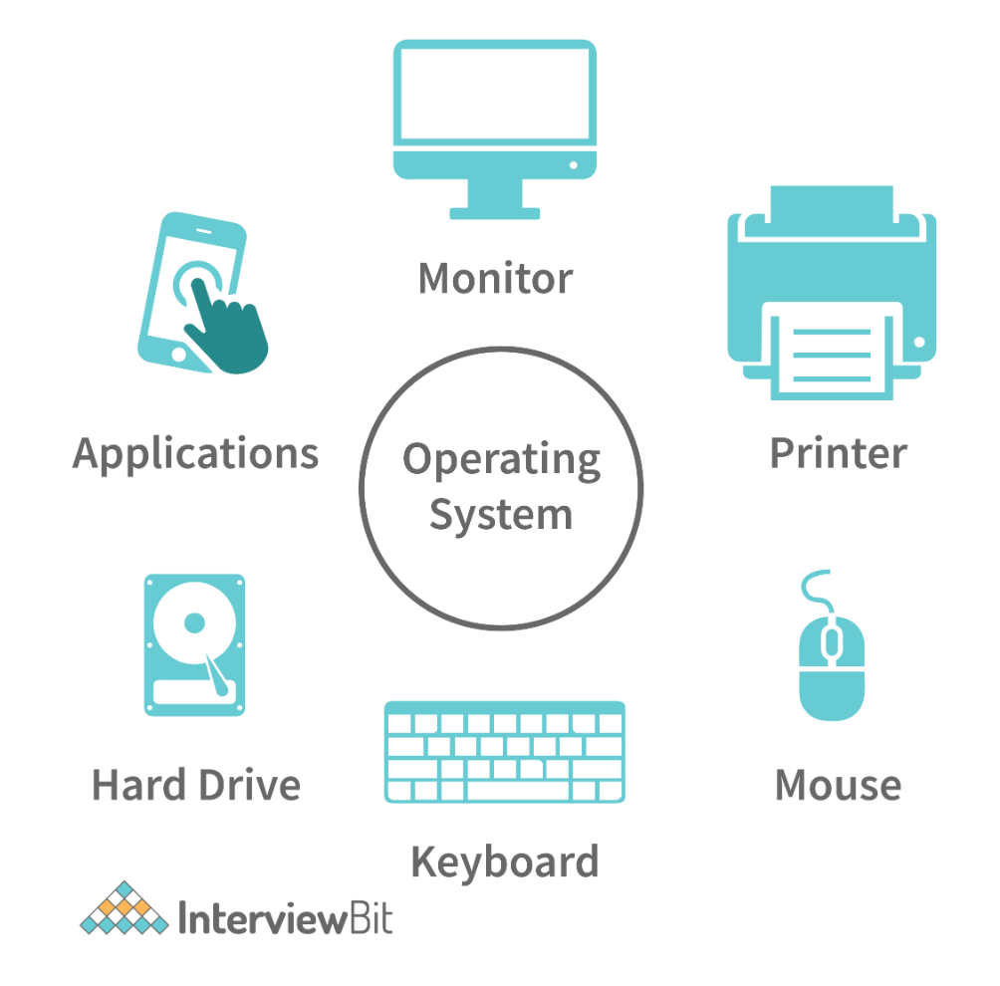
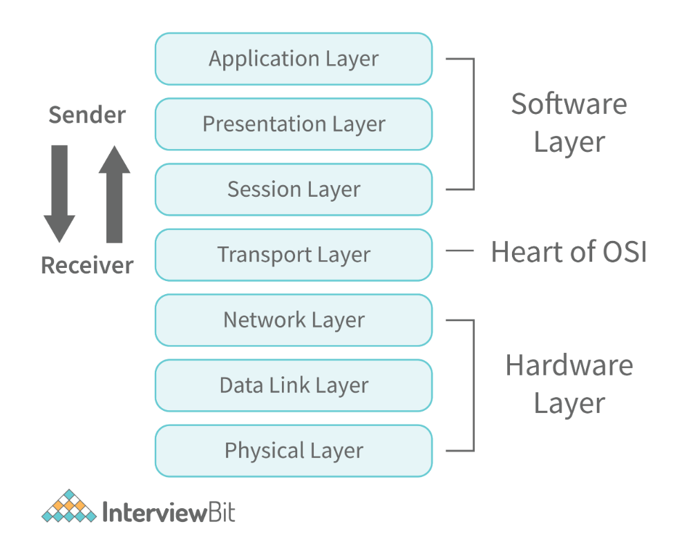
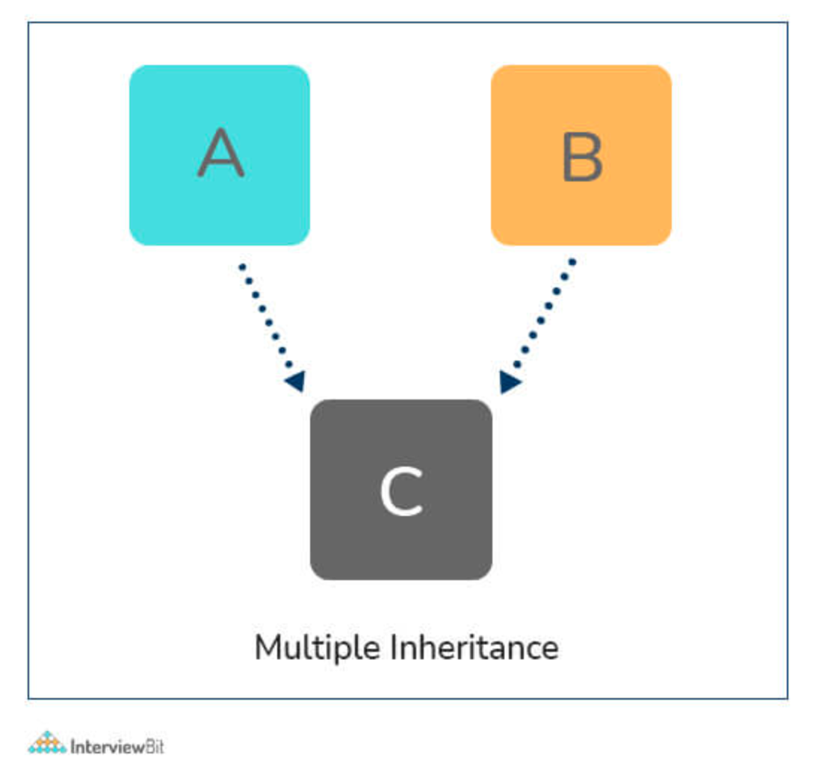

# Computer Science Interview Questions

## Background

Computer science is a broad field of study that deals with the design, analysis, and implementation of computer systems. It is a subfield of computer engineering, that deals with the design and construction of computers and computer systems.

Computer science is a growing field, with new technologies and applications being developed every day. As a result, there is a need for new education programs that can prepare students for the future. In order to be successful in this field, students need to be well-versed in mathematics and computer science concepts. They also need to be familiar with software development techniques and be able to troubleshoot problems when they arise. Finally, they need to be able to think critically and be able to problem-solve.

Computer science is a fast-growing field that has many opportunities for career growth. A Computer Science interview is a type of interview that is designed to assess a candidate's knowledge of computer science. The purpose of the interview is to evaluate the candidate's knowledge and understanding of computer science concepts, including programming and data structures & algorithms. The interview may also assess the candidate's communication skills, such as the ability to present complex information in a clear and concise manner.

The Interview is typically conducted by a hiring manager or recruiter who has experience in the field. The interviewer will typically ask a series of questions about the candidate's background and experience. The interviewer will also ask about the candidate's strengths and weaknesses.

---

1. Explain the computer system?
   + `Computer System`: the collection of hardware and software that makes up a computer. It consists of the processor, memory, storage devices, input/output devices, and other components.
     + The processor is the central processing unit (CPU) that processes information and controls the computer’s operations.
     + The memory is the computer’s temporary storage area.
     + The storage devices are used to store data and programs.
     + The input/output devices are used to connect the computer to external devices such as printers, keyboards, and mice.
     + The computer system is a complex device that has many functions. It is used to store and process information, communicate with other computers and other devices, and perform calculations.
     

2. What is a file?
   + `File`: a collection of data that is stored on a computer or other device. Files can be text, images, sounds, or any combination of these. They can be stored on a computer, a hard drive, or some other device. When you open a file, you are actually opening a copy of the data inside the file. This copy is called the “file” and it is what you see when you open the file. The file can be opened in many different ways. For example, you can open it by clicking on it or by double-clicking on it. The file can also be opened by dragging and dropping it onto the screen or by using other methods. When you open a file, you are actually opening a copy of the data inside the file.

3. What is inheritance?
   + `Inheritance`: a way of structuring code so that it can be shared between different classes. Inheritance allows code to be shared between different classes and allows the same class to have different implementations in different contexts. Inheritance is a powerful tool that can make your code more maintainable and easier to understand. Inheritance is a fundamental concept in programming. It’s a way of structuring code so that it can be shared between different classes.
     

4. What is a chipset?
   + `Chipset`: a collection of circuit boards and other components that are used to connect a computer to the rest of the world. Chipsets are typically used to connect computers to the internet, printers, scanners, and other peripherals. Chipsets are also used to provide a way for computers to communicate with each other. For example, a chipset might be used to connect a computer to a printer or scanner. A chipset might also be used to communicate with other computers over the internet. Sockets are the most common type of chipset.

5. What is an operating system?
      + `Operating System`: a collection of software that runs on a computer and provides the basic functions of storing and managing information, such as memory, storage devices, and network access. The operating system controls how the computer works and how it interacts with other software and hardware. For example, an operating system can control the way a computer stores and accesses data, such as files and printers. In addition to controlling how the computer works and operating system can also provide many other functions, such as security, communication, and user interface. An operating system can also be used to develop new software applications.
     

6. How many popular operating systems are in use today?
   + Operating systems are the software that controls the way a computer works. There are many different operating systems out there, and they all have different features and benefits. The most popular operating systems today are Windows, Mac OS, and Linux. Windows is the most popular because it is the most widely used operating system. It is also the most expensive, but it is also the most secure. Mac OS is another popular operating system that is easy to use and has a lot of features. Linux is a very popular operating system that is free and open-source, which means that anyone can use it. Linux is also very easy to use, so it is great for beginners.

7. What is a microprocessor?
   + `Microprocessor`: a computerized device that is small enough to fit in a computer’s memory. Microprocessors are used in many different kinds of devices, including computers, cell phones, and industrial robots. Microprocessors are very important because they allow computers to perform many different tasks. For example, microprocessors are used to control the flow of electricity in a computer. They also help computers store and retrieve information. Microprocessors are also used to create new products. For example, microprocessors are used to create new types of computers. They are also used to create new types of robots.

8. What is a class variable?
   + `Class Variable`: a variable that is defined in a class and shared by all instances of the class. Class variables can be used to store information about an object, such as its name, its location in memory, and its state at any given time. Class variables are often used to store information that is shared by objects in the same class. For example, a class might have a variable called name that is shared by all instances of the class. Class variables are often created with the special keyword class.

9.  What is a Software Development Life Cycle (SDLC)?
    + `Software Development Life Cycle (SDLC)`: a process used to plan and manage the development of software. The SDLC is a set of activities that are performed over a period of time to ensure that the software is developed in a way that is efficient and effective. The SDLC can be divided into three phases: planning, design, and implementation. During the planning phase, the organization identifies the goals and objectives that need to be achieved. During the design phase, the organization identifies the requirements for the software that will be developed. During the implementation phase, the organization prepares the software for production and tests it to ensure that it meets all of its requirements. The SDLC is an important part of any software development process because it ensures that the software is developed in a way that is efficient and effective.
      

10. What is a programming language?
    + `Programming language`: a computer language designed to facilitate the creation of software. It is a set of rules and guidelines that govern the structure and format of computer programs. A programming language is typically a high-level language that abstracts away the complexities of programming in order to make it easier for programmers to understand and write code. There are many different programming languages, including C, C++, Java, and Python. The most popular programming languages today are C++ and Java. C++ is a high-level language that abstracts away the complexities of programming in order to make it easier for programmers to understand and write code.

11. What is Integrated Development Environment (IDE)?
    + `Integrated Development Environment (IDE)`: is a software tool that allows developers to create, edit, and debug their software in a single interface. IDEs are typically used by software developers who work on large projects. IDEs are typically used to create and edit source code, as well as to debug and test programs. IDEs are also used to create documentation, as well as to share code between different teams. IDEs are typically used to create and edit source code, as well as to debug and test programs. IDEs also allow developers to create and edit documentation.
      

12. Explain the framework in software development?
    + `Framework`: a collection of reusable components that can be used to build software. Frameworks are often used to structure large projects and to help teams work together. Frameworks are usually built using a set of reusable components. These components can be used to build different types of software, such as web applications, desktop applications, and mobile apps. A framework can be used to structure large projects and to help teams work together. A framework can also be used to help teams understand the different stages of software development. For example, a framework can help teams understand the different stages of software development when building web applications.
      

13. What is an Interface?
    + `Interface`: a way of communicating between two objects. The objects can be software or hardware. An interface can be defined in many different ways, but the most common definition is that it is a way for one object to talk to another object. This communication can take many different forms, such as sending data to the other object, receiving data from the other object, or both. An interface can be implemented in many different ways, but the most common way is to use a software class. This class defines the interface and then other classes can use this class to implement the interface. When an object uses an interface, it is saying that it understands how the interface works and can use it to communicate with other objects.

14. What is an abstract class?
    + `Abstract Class`: a class that is not defined in the source code. Instead, it is defined in a file that contains a definition of the class. The file defines the class by defining all of the properties and methods of the class. However, the class does not have to be defined in the source code. Instead, it can be defined in a separate file that is included in the source code. The file can then be referenced by the source code. This allows the class to be abstract and still be defined in the source code. The main advantage of an abstract class is that it allows other classes to use the class without having to know all of its properties and methods. This makes it possible for other classes to use a class without knowing all of its properties and methods.

15. What is an array?
    + `Array`: a data structure that can hold a lot of data. Arrays are used in a lot of different applications, such as databases, spreadsheets, and games. Arrays are made up of different data types, such as numbers, strings, and characters. Arrays are also called indexed structures because they can be accessed by indexing. Arrays are one of the most important data structures in programming. They are used to store data in a way that is easy to access and to organize it in a way that makes sense. Arrays are also used in many different applications, such as databases, spreadsheets, and games. An array is a data structure that can hold a lot of data. Arrays are used in a lot of different applications, such as databases, spreadsheets, and games.

16. What is a constructor?
    + `Constructor`: a function that is called when an object is created. A constructor is a function that takes a few arguments the type of object to be created, the initial state of the object, and the name of the class that will contain the object. When an object is created, it is passed to the constructor of the class that contains the object. A constructor can be used in many different ways. For example, a constructor can be used to initialize an array of objects or to initialize a variable that will be used by multiple objects. In these cases, it is important to use a constructor that takes only a few arguments.
      

17. Define Cin and Cout in C++?
    + `Cin and cout`: two important functions in C++ that you should know about. Cin and cout are functions that allow you to read and write data to a stream. The basic syntax of cin and cout is as follows:
      + `cin(stream)`: Read data from the stream.
      + `cin(stream, value)`: Read data from the stream and assign a value to the variable.
      + `cout(stream)`: Write data to the stream.
      + `cout(stream, value)`: Write data to the stream and assign a value to the variable.
    + The first function cin takes a stream as an argument and reads data from the stream. The second function cout takes a stream as an argument and writes data to the stream. You can use cin and cout to read and write data from a file, a database, or any other source of data.

18. What is Artificial intelligence (AI)?
    + `Artificial intelligence (AI)`: a branch of computer science that deals with the development of machines that can learn and process information. AI has applications in a wide range of fields, including robotics, machine learning, and artificial intelligence. In robotics, AI is used to build robots that can perform tasks that would be too difficult or dangerous for humans to perform. For example, AI could be used to build robots that can navigate through dangerous environments, such as mines or oil rigs. In machine learning, AI is used to train machines to recognize patterns and make decisions based on those patterns.
      

19. What is Machine Learning (ML)?
    + `Machine Learning (ML)`: a field of computer science that deals with the identification and analysis of patterns in data. Machine learning algorithms can be used to identify patterns in data, such as relationships between variables, or to make predictions based on those relationships. Machine learning algorithms can be divided into two broad categories: supervised and unsupervised. Supervised machine learning algorithms, such as classification and regression, are used to identify patterns in data. Unsupervised machine learning algorithms, such as clustering and association analysis, are used to identify associations between variables. The most common supervised machine learning algorithms are classification and regression.
      

20. What is deep learning?
    + `Deep learning`: a field of computer science that focuses on building artificial neural networks that can learn from data. These networks can be used to perform tasks such as image recognition, speech recognition, and translation. Deep learning is a field of computer science that focuses on building artificial neural networks that can learn from data. These networks can be used to perform tasks such as image recognition, speech recognition, and translation. Deep learning has become a hot topic in recent years due to its potential applications in fields such as artificial intelligence, machine learning, and computer vision. In order to train a deep learning network, it is first necessary to create a model. A model is a representation of the data that the network is expected to learn from.

21. What are the different OOPS principles?
    + `OOPS principles`: a set of rules and guidelines that organizations can use to ensure that their software is as bug-free as possible. The OOPS principles are:
      + `Open source`: All software should be released under an open-source license, such as the GNU General Public License (GPL) or the Apache License.
      + `Patent`: All software should be released with a patent waiver, such as the USPTO's Patent Promise or the EU's EPO.
      + `Quality`: All software should be developed using quality-assured tools and practices, such as unit testing and code reviews.
      + `Simplicity`: All software should be easy to understand and maintain, and should not require complex configuration or customization.
      + `Reuse`: All software should be reusable so that it can be adapted to new needs without requiring a complete rewrite.
      + `Simplicity`: All software should be easy to understand and maintain, and should not require complex configuration or customization.

22. Explain the access modifiers?
    + `Access modifiers`: a way of specifying which users have access to a resource. Access modifiers are often used to control access to data, files, or other resources. For example, a database might allow only certain users to see the data. Or, a file might be locked down so that only the owner can see it.

23. What do you mean by destructor?
    + `Destructor`: a function that is called when an object is destroyed. A destructor is a way to clean up after an object has been destroyed. When an object is destroyed, the memory associated with the object is released. When an object is created, the memory associated with the object is allocated. The destructor is called when the memory associated with the object is no longer needed. The destructor frees up the memory associated with the object and releases it into the environment. When an object is destroyed, it can be very difficult to find out why an object was destroyed.

24. What are the Layers of the OSI Model?
    + `OSI model`: a system-level networking model that describes the topology of a network. The model consists of seven layers: Physical, Data Link, Transport, Network, Application, and Management. Each layer is responsible for providing a specific function. For example, the Physical layer provides connectivity between devices and the Data Link layer is responsible for data transmission. The Transport layer is responsible for routing data and the Network layer is responsible for managing the network. The Application layer is responsible for providing services to the devices on the network and the Management layer is responsible for managing the network. Each layer in the OSI model has a specific purpose and each layer in the OSI model has a specific role to play in the overall system.
      

25. What is the thread in programming?
    + `Thread`: a fundamental concept in programming. It is a way of organizing and managing code so that it can run in parallel. The thread is a way of keeping code running in the background while the main program is running. Threads are used to parallelize tasks and to share resources among multiple threads. When the main program runs, it sends instructions to the thread that is running the task. When the task is done, the thread that was running the task sends instructions to the main program that is waiting for instructions. This process continues until all tasks are done or until one of them crashes or gets interrupted. Threads are a fundamental concept in programming because they allow programs to run in parallel and to share resources. They are also useful for managing memory and CPU usage.

26. What is the primary memory in programming?
    + `Primary Memory`: in programming is the data structure that is used to store the information that is used by the program to control the execution of the program. The primary memory is composed of variables, constants, and data types. The variables are used to store information about the current state of the program. The constants are used to store values that are known at compile-time and are needed by the program when it is run. The data types are used to store values that are known at runtime and are needed by the program when it is run.
      + The primary memory in programming is composed of three different types of data structures:
        + `Variables`: These are used to store information about the current state of the program. Variables can be used to store values such as numbers, strings, and booleans.
        + `Constants`: These are used to store values that are known at compile-time and are needed by the program when it is run. Constants can be used to store values such as integers, floating-point numbers, and booleans.
        + `Data types`: These are used to store values that are known at runtime and are needed by the program when it is run. Data types can be used to store values such as arrays, lists, and dictionaries.

27. What is the internet?
    + `Internet`: a worldwide network of computers and devices that enables people to share information, ideas, and products. It is made up of many different types of networks, such as the internet, mobile networks, and satellite networks. The internet is used for a variety of purposes, including communication, learning, and entertainment. The internet was originally created to allow people to share information and ideas. Today, it is used for a variety of other purposes, including communication, learning, and entertainment. The internet is also an important part of the economy by connecting people around the world.

28. What is the World Wide Web (WWW)?
    + `World Wide Web (WWW)`: a collection of interconnected data networks that enable people to share information, documents, and programs across the Internet. The web is made up of hundreds of different websites, each of which contains information about a particular topic or subject. These websites are organized into a hierarchy called a “web page” that describes the content of the page and links to other pages. Web pages can be written in many different languages, and they can be organized in many different ways, including using tabs and links. The web is a powerful tool for sharing information because it enables people to easily access information from anywhere on the planet. For example, you can access information about any topic you want from any computer or device that has Internet access. You can also use the web to share documents and programs with other people who have access to the same devices as you do.

29. What is an Algorithm?
    + `Algorithm`: a set of steps that are used to solve a problem. Algorithms are used in a variety of fields, including computer science, mathematics, and engineering. An algorithm is a set of instructions that tells a computer how to perform a task. Algorithms are used to solve problems such as sorting data, searching for patterns in data, and performing calculations. Algorithms are used in many different fields, including computer science, mathematics, and engineering. An algorithm is a set of instructions that tells a computer how to perform a task.
      

30. What is cryptography?
    + `Cryptography`: the science and art of creating and using codes and ciphers to protect sensitive information from unauthorized access, disclosure, or destruction. Cryptography is used to protect data from unauthorized access, modification, or disclosure. Cryptography can also be used to secure data transmissions, such as e-mail and web browsing. Cryptography also plays an important role in the security of computer networks, such as the Internet. Codes and ciphers are used to encode and decode information. For example, when you type in a password on a computer, the computer uses a code to encrypt the password. When you send an e-mail, you use a code to encrypt the message.
      

31. What is a singleton class?
    + `Singleton Class`: a class that is defined once and only once. This can be used to reduce the number of classes you need to define in your application, and it can also be used to reduce the complexity of your code. When you define a singleton class, you are declaring that the class is only ever going to be created once. This can be useful if you want to reduce the number of instances that your class will have to create, and it can also be useful if you want to reduce the complexity of your code. Singleton classes are often used when you need to create a single instance of a class, but you don't want that instance to be shared across multiple objects. For example, if you want to create a single instance of a class that represents an image, you might create a singleton class that represents that image.

32. Is string class final?
    + Yes. The string class is final. This means that you cannot subclass it, and you cannot override its methods. This is a good thing because it means that you can use the string class without worrying about its internal state. There are a few things that you can do to subclass the string class, though. First, you can use StringBuilder to create a subclass of the string class. This class can then override the methods that you need to override to create your own subclass of the string class. Second, you can use StringBuffer to create a subclass of the string class. This class can then override the methods that you need to override to create your own subclass of the string class. Finally, you can use StringBuilder and StringBuffer together to create a subclass of the string class.

33. What is a wrapper class?
    + `Wrapper Class`: a class that inherits from another class and then provides a set of methods and/or properties that are specific to its own purpose. Wrappers are typically used to hide implementation details from the user, allowing the developer to concentrate on the business logic. A wrapper class can be used to hide implementation details from the user, allowing the developer to concentrate on the business logic. Wrappers can also be used to provide a set of methods and/or properties that are specific to their own purpose. The main advantage of wrappers is that they allow you to hide implementation details from the user, allowing you to concentrate on the business logic. The main disadvantage of wrappers is that they can be difficult to maintain.

34. What are multiple inheritances in Java?
    + `Multiple inheritances`: a way of passing on multiple copies of a particular class or interface to a child's class. This can be useful when you want to make sure that some code is always available to your child's classes. One way to do this is to create a subclass of the parent class, and then provide the child with a copy of the parent class. Another way is to create multiple inheritances in your Java code, and then provide the child with a reference to the parent class. Multiple inheritances are useful for situations where you need to make sure that some code is always available to your child's classes. In Java, multiple inheritances are implemented using the public and private modifiers on a class or interface. When multiple inheritances are present, the public modifier indicates that the class or interface is publically accessible. The private modifier indicates that the class or interface is privately accessible. Multiple inheritances can be useful when you want to make sure that some code is always available to your child's classes.
      

35. What is Cache?
    + `Cache`: a temporary storage location for frequently accessed data. Caches are useful for organizations that need to store large amounts of data in a short amount of time. They can also be used to improve performance by reducing the amount of data that needs to be retrieved from the network. Caches can be used to store data in several different ways. They can be used to store data that is frequently accessed, such as documents or images. They can also be used to store data that is rarely accessed, such as log files or application states. They can also be used to store data that is needed only occasionally, such as temporary files or cookies.
      

36. What is Deadlock?
    + `Deadlock`: a situation where two or more processes are waiting for each other to finish. Deadlock occurs when one process is waiting for another process to finish before it can continue. The process that is waiting will not finish until the other process finishes. This can be a problem if you need to wait for a long time, as this can lead to your system becoming unresponsive.
      

37. What is a Critical Section?
    + `Critical Section`: a section of code that is crucial to the operation of a program. By accessing critical sections, a program can make changes to the overall functionality of the program without affecting other sections of code. Critical sections are often accessed through functions, methods, and variables. The purpose of a critical section is to ensure that all parts of the program are working properly.
      

38. What is Multithreading?
    + `Multithreading`: a technique that allows multiple threads to run in parallel on a single processor. This allows multiple tasks to be run in parallel without the need for synchronization. In addition, multithreading can improve performance by allowing tasks to run in parallel without having to wait for each other to finish. For example, it is not appropriate for applications that require high performance or when the processor cannot support more than one thread at a time. Multithreading also has its own set of risks and pitfalls. For example, multithreading can lead to increased system load and increased system resource consumption.

39. What is normalization in a Database?
    + `Normalization`: is a process of abstracting and simplifying data. It is a way of making data easier to understand and easier to work with. For example, if you have a data set that contains a lot of numbers, you can normalize it by taking the numbers and breaking them down into smaller pieces, such as by dividing by 10. This makes it easier to work with the data and makes it easier to see trends and patterns. You can also normalize your data by making it more consistent.

40. What is Indexing in DBMS?
    + `Indexing`: the process of organizing data in a way that makes it easier to find and access. In a database, the index is a collection of data organized in a way that makes it easy to search and find data. The index consists of a set of key-value pairs that can be used to reference data in the database. The indexing process can involve many different techniques, including the use of indexes, data structures, and algorithms. In a database, the index is a collection of data organized in a way that makes it easy to search and find data.

41. Explain firewalls?
    + `Firewalls`: software programs that are used to protect your computer from viruses and other malware. They are also used to protect your privacy and to keep unauthorized people from accessing your computer. Firewalls are often used in conjunction with antivirus software. They can help to block malicious programs from entering your computer, while also protecting you from unknown programs. In order to use a firewall, you will need to install it on your computer. It is important that you do this correctly since it can prevent your computer from being infected with malware. Firewalls can also be used in conjunction with antivirus software. They can help to block malicious programs from entering your computer, while also protecting you from unknown programs.

42. What is Transmission Control Protocol (TCP)?
    + `Transmission Control Protocol (TCP)`: a networking protocol that is used to transfer data between computers. TCP is a connection-oriented protocol that allows two computers to establish a connection with each other. TCP also allows two computers to send and receive data. The main purpose of TCP is to keep the data transferred between two computers connected. This is done by ensuring that data packets are sent and received in a timely manner. TCP also provides several other functions, such as error detection and recovery, congestion control, and reliability.
      

43. Explain Domain Name System (DNS)?
    + `Domain Name System (DNS)`: a way of mapping domain names to IP addresses. The IP address is a number that's assigned to each device that connects to the Internet. When you type in a domain name, your computer sends a request to the DNS server, which looks up the corresponding IP address. The DNS server then returns a response that includes the domain name and an associated IP address. This process is called name resolution. DNS is used by most websites and services that use the Internet. It's also used by email services like Gmail and Yahoo Mail, as well as by many online services like shopping sites and online banking services.
      

44. What are the Application layer protocols?
    + `Application layer protocols`: protocols that are used to connect applications to the network. These protocols are responsible for transferring data between applications and the network, such as TCP/IP, HTTP, and FTP. The Application layer protocols are also responsible for handling security and privacy. For example, the HTTP protocol is used to transfer data between web pages and the network. The HTTP protocol is also used to protect privacy by encrypting data before it is sent over the network.
      

45. What are the keys in DBMS?
    + There are four main keys to a database management system (DBMS):
      + `Data`: information stored in the database.
      + `Integrity`: the ability of the database to prevent the corruption of data.
      + `Availability`: the ability of the database to provide access to data when needed.
      + `Management`: the ability of the database to provide tools for administrators and users. 
      + In addition, there are many other factors that are important in choosing a DBMS, such as a price, performance, and ease of use.
      
