# Data Modeling Interview Questions

---

## Background
Data Modeling is the process of creating data models for storing data in the database. It represents the rules and relationships between various data objects. It helps in efficiently creating, organizing, maintaining, retrieving and visualizing the data for enforcing the business rules, policies and compliances on the data.

---

1. What is Data Modeling?
   + `Data Modeling`: the process of creating a model that represents the data and the relationship between different data to store it in a database. It can also be called database modeling and this skill is useful across all domains like data engineering, data science, software development etc to prepare, analyse and process the data by continuously reorganizing, restructuring and optimizing it for fitting the needs of the company/organization.

2. What are the benefits of data modeling?
   + Data modeling helps professionals from different domains like software development, business analytics, data science, etc to view the data, understand the relationship between the data objects in a data warehouse or a database. Following are the main benefits of this process:
     + Reduce errors during the software development
     + Improve the performance of the application and the database.
     + Ease the process of mapping data between the different processes in an organization.
     + Helps to improve communication between the business intelligence and the developer teams.
     + Enhances the speed of database design at conceptual, logical and physical levels.
     + Proper data modeling process helps to reduce the cost of maintenance when the system grows at a large scale.
     + It also supports the reusability of the data models when the requirements are repetitive
     + Improves the quality of data and enhances the robustness of the application.

3. What is a data model? What are its types?
   + `Data model`: an information schema that sorts and normalizes different information components and establishes relations between them. These models subsequently become tables in the database which can be retrieved and processed based on the organization’s requirements. There are three types of data models, they are:
     + `Conceptual data model`: focuses on high-level, abstract and users view of data representation. It defines what the system contains and is created by data architects and business stakeholders. The main purpose of this model is data organization and defining the scope and business rules. Following are the characteristics of the conceptual data model:
       + This provides an overall overview of data structure in terms of business context.
       + Contains some concepts that are not required for database implementation but are required for a business for understanding the need for features in the applications.
       + Represents data needed for performing business processes and operations.
     + `Physical data model`: we define the database schema and how the data is stored in the database physically. Following are the characteristics of the physical data model:
       + It describes the data required for the application. It can be integrated with different physical models depending on the scope of the application.
       + This defines relationships between different tables which addresses cardinality and nullability of relationships.
       + This model is developed for specific DBMS versions, data storage, locations or technologies used in the application.
       + This model also consists of exact data types, constraints, lengths and default values.
       + It also defines primary and foreign key references, indexes, views, profiles and authorizations.
     + `Logical data models`: lies between the conceptual and physical model and describes the logical representation of data. Following are the characteristics of the model:
       + It describes the data needs of a project and can also be integrated with other logical models depending on the scope of the application which in turn guides the physical model.
       + This data model is designed and developed independently from DBMS.
       + It also consists of attributes like data types and exact length and precisions.
       + It contains normalization processes of the model and is applied till it achieves 3NF.

4. What do you understand by dimension in data?
   + `Dimensions`: represent the set of unique values that are useful for identifying and categorizing the data from the data warehouse.

5. What is granularity?
   + `Granularity`: represents the information level stored in a database table. It can be high or low level with tables that contain transaction-level or fact table respectively. Granularity is also a measure of smallest set of data which can be independently processed by any component/task/application.

6. What do you mean by data sparsity?
   + `Data sparsity`: refers to the number of empty cells in the database. It represents how much data is available for a particular dimension in a data model. Inadequate information leads to large space consumption for saving aggregations.

7. What is hashing?
   + `Hashing`: a technique that helps to search index values to retrieve required data. It is used for calculating the direct location of data using indexing.

8. What is a database management system?
   + `Database Management System (DBMS)`: software consisting of a group of programs that manipulates the database for storing and retrieving the user data.

9.  What is Online Transaction Processing (OLTP)?
    + `Online Transaction Processing (OLTP)`: operational system supporting transaction-oriented applications in 3-tier architecture. It focuses on query processing, data integrity maintenance, transaction effectiveness per second in multi-access environments.
      + Some of the examples of OLTP systems are:
        + Sending text messages.
        + Online banking.
        + Online airline ticket booking.
        + Order entry.
        + Adding items to the shopping cart.

10. What is On-Line Analytical Processing (OLAP)?
    + `On-Line Analytical Processing (OLAP)`: a type of technology that authorizes managers, executives and analysts for gaining insights in a faster, secure, consistent and interactive manner. OLAP is used in Intelligent solutions involving Planning, Budgeting, Analysis, Forecasting, Simulation Models etc. OLAP helps clients to perform analysis considering multiple dimensions and helps in providing insights that help in better decision making.

11. What is a data mart?
    + `Data Mart`: a condensed data warehouse version (a subset of a data warehouse) designed for a specific unit or a department like Marketing, Sales, HR, finance etc in an organization. There can be different data marts specific to individual departments which can interact with the data warehouse for information processing as shown in the image below:
      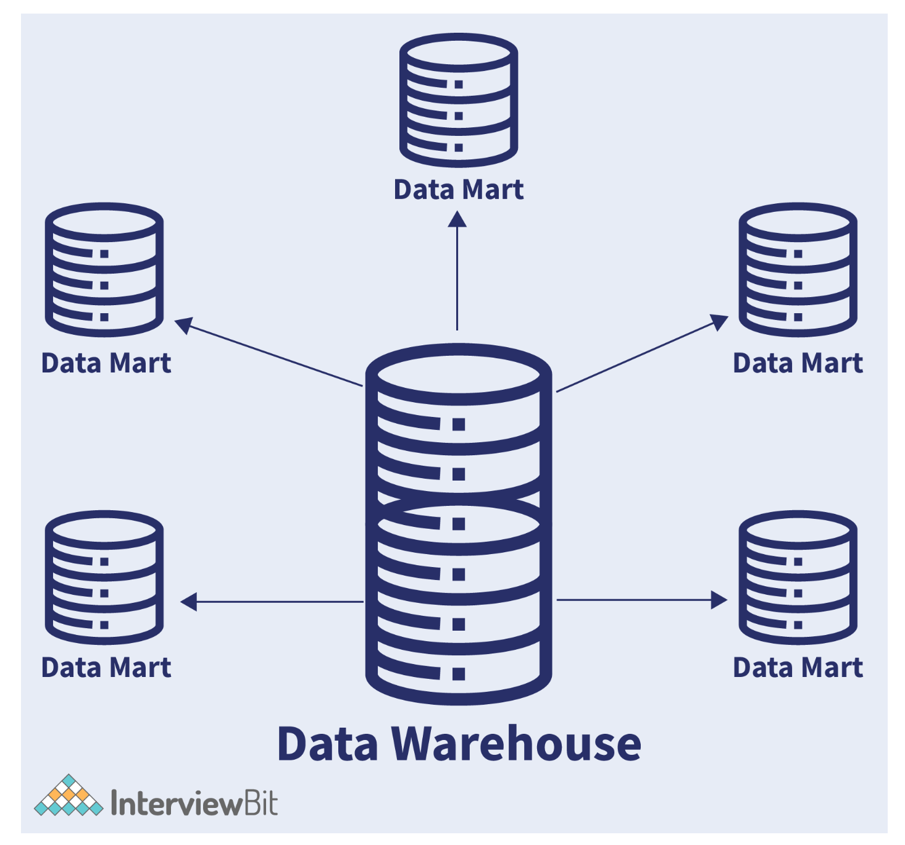

12. What is the significance of metadata?
    + `Metadata`: the information about data that tells what data kind is stored in the system, what is the purpose and to whom it is intended. There are different types of metadata depending on the purpose, they are:
      + `Technical Metadata`: defines names of the database system and tables, size of tables, values, attributes, data types etc. It also includes constraint information like primary keys, foreign keys, indexes etc.
      + `Business Metadata`: specific to business and defines the data ownership, business regulations and rules, policies etc.
      + `Descriptive Metadata`: gives information about folder, file, image, book or video. Information can be title, date, size, author, published on etc.
      + `Operational Metadata`: includes information related to any business operation and is used by managers or executives for performing any task.

13. What is a Relational Database?
    + `Relational database`: a digital database system that is based on a relational data model and is useful for storing data in tables. Oracle, Teradata, MySQL, PostgreSQL, SQLite etc are types of relational databases. The data is transformed into rows and columns which is standardized and can be queried with SQL. RDBMS helps to add/ alter tables and column data into the database systematically by maintaining data integrity.

14. What is cardinality?
    + `Cardinality`: represents the level of uniqueness of data values present in a column. The high value of cardinality tells us that the column has a large percentage of unique values. Low cardinality indicates that the data is repeated (duplicated) in the column.

15. What is Normalization?
    + `Normalization`: The process of structuring a relational database based on a series of normal forms for reducing data redundancy and increasing data integrity is called Normalization. It divides larger tables into smaller ones and links them using references/relationships. This helps in reducing data repetition and ensuring it is stored logically. The following image represents the process of normalization:
      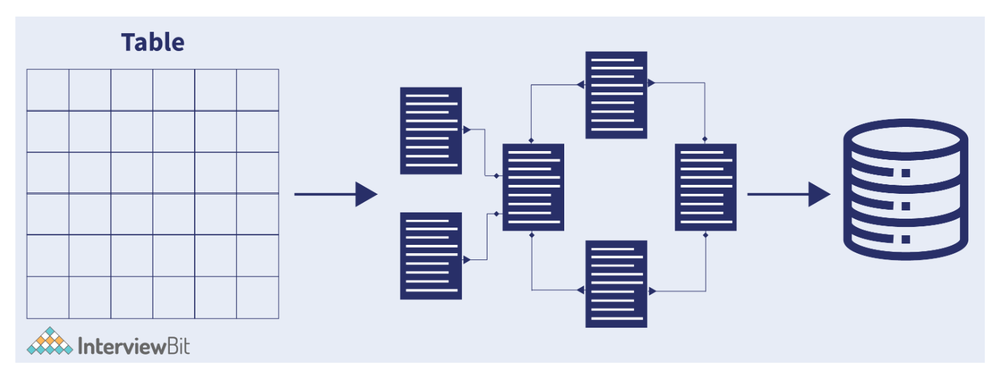

16. What is Denormalization?
    + `Denormalization`: the opposite of normalization which helps in improving the read performance by compensating the write performance by adding redundant data copies. It has duplicate data entries in the database for increasing the performance of read-heavy loads.

17. What is a NoSQL database?
    + `NoSQL database`: a type of database that does not require a fixed schema. It is non-relational and non-relational and usually avoids joins in preference of schema variation for achieving better performance. It is also very easy to scale based on the application’s needs. NoSQL is used for storing huge data in a distributed manner. NoSQL Databases are of four types:
      + `Column-based`: These organize data in columns instead of rows. The rows in these databases have many columns associated with them. These are useful in fraud detection systems, catalogues, recommendation engines etc. Example: Cassandra, Hypertable, Hbase, Amazon DynamoDB etc.
      + `Graph-based`: These organize data into nodes and edges. The edges show connections between different nodes. It is multi-relational. These are mostly used in social networks, Logistic domain etc. Example: Neo4J, OrientDB, Infinite Graph, FlockDB etc
      + `Document-based`: These types store semi-structured data in the form of documents. These are similar to key-value type databases and the difference is that the values in this type store values in the form of JSON, BSON, XML etc. Example: MongoDB, RavenDB, Terrastore etc
      + `Key-value`: Simple NoSQL data model consisting of unique keys and values linked with it. It performs efficiently and is highly scalable. Redis and Memcached are some examples of this database type and is mostly used in caching applications, session management.
    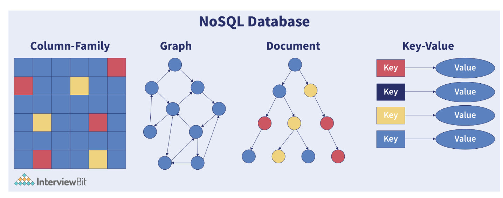

18. What are the differences between OLTP and OLAP?
  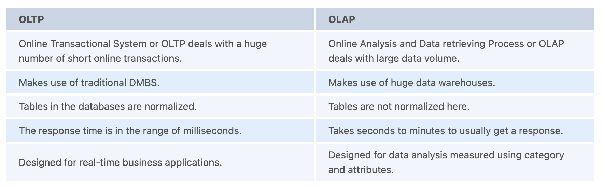

19.   How is SQL different from NoSQL?
  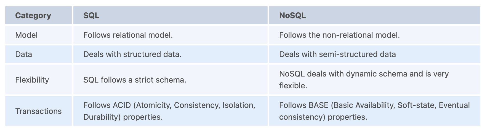

20. What will happen if we try inserting two nulls in a column having a unique constraint on it?
     + Since a null value is not equal to another null value, inserting two null values on a column with a unique constraint does not throw any error. It simply inserts the data.

21. What are the phases in the data modeling development cycle?
  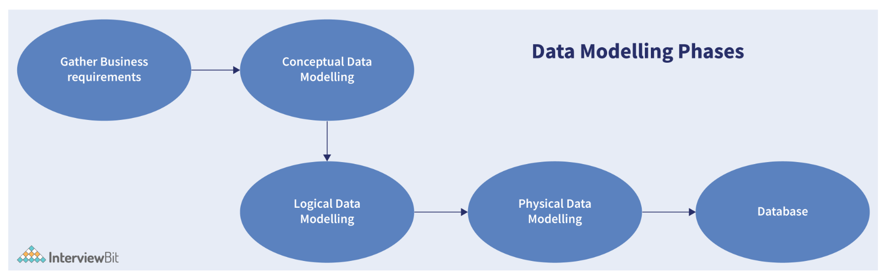
  + `Gather Business Requirements`: The first phase is to gather the functional requirements and what are the reporting needs from the business analysts and the end-users.
  + `Conceptual Data Modeling (CDM)`: Then depending on the requirements, come up with a conceptual data model that includes major entities and relationships between them. This model will be used in the Initial Planning Phase.
  + `Logical Data Modeling (LDM)`: Post the creation of a conceptual model, create a logical data model that describes the logical representation of the business requirements in the organization.
  + `Physical Data Modeling (PDM)`: Here, we create a complete data model which includes required tables, columns in them, relationships between different entities and properties for the implementation of the database.
  + `Database`: Based on the physical data model created, the SQL codes would be generated with the help of the data modeling tools and these codes (queries) are then executed on the server for creating the database entities.

22. What do you understand by Star schema?
     + A schema usually represents the data structure illustration and relationships between different structures. A star schema constitutes a central fact table and different dimension tables connected to it. The primary key of the dimension tables is a foreign key in the central fact table.
     + This schema is called a star schema because the entity-relationship diagram can be visualized as a star whose points diverge from the central fact table as shown below:
       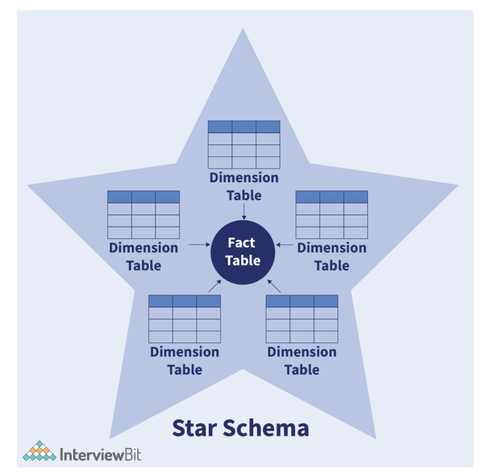
     + The central fact table has two column sets- one set belongs to the fact table and the others are foreign keys to the dimension tables. Dimensions symbolize one or more attributes/hierarchies that categorize data. If there are no hierarchies, they are called lists or flat dimensions. The dimensional tables are smaller in size when compared to the fact table.
     + For example, The fact tables can store the entire sales information and the dimension tables store data about clients, products, geographic regions, channels etc that are linked as foreign key references to the Sales information fact table.

23. Explain snowflake schema database design.
    + `Snowflake schema`: a schema that has one or more dimension tables that do not connect directly to the fact table but should be interacting with it via other dimension tables.
    + The process of normalizing dimension tables in STAR schema to resemble a snowflake-like structure with the fact table at the centre is called snowflaking. It is represented in the image below:
      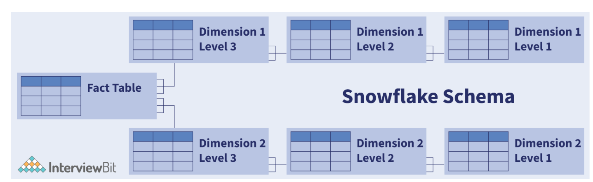
      + The tables in the snowflake schema are normalized to 3NF form and each dimension level in the schema represents one level in the hierarchy. The central fact table is linked to multiple dimension tables that can be linked to other dimension tables via many-to-many or many-to-one relationships. The schema is useful for enhancing the query performance as there are minimum disk requirements and the joining of smaller lookup tables.

24. What are the critical relationship types in a Data Model?
    + A relationship is normally used for connecting parent and child tables. There are 3 types of critical relationships in a data model, they are:
      + `Identifying`: a reference column of a child’s table these are connected by a thick line is part of the primary key of the parent table which helps in identifying the records. This relationship is usually replaced by a thick line. These are called identifying because the foreign key can never change as it becomes part of the primary key. A child object cannot exist if there is no parent object.
      + `Non-identifying`: the reference column of a child table is not part of the primary key of the parent. This relationship is represented by a dotted line. This relationship can be optional or mandatory depending on the requirements. It means that the foreign key columns can (if optional) or cannot allow (if mandatory) NULL.
      + `Self-recursive`: a standalone column is connected to a primary key in the same table. This relationship is between different column instances of the same entity type.

25. What are the types of visual data modeling techniques?
    + `Entity-Relationship (ER) Model`: a data modeling methodology that designs traditional databases and aids in performing data normalization by reducing data redundancy. It helps in database schema visualization of top-level data view. The data modeling architect identifies the following:
      + Entities and their attributes that represent objects/tables in the relational databases.
      + Relationships between the entities.
    + `UML (Unified Modeling Language)`: a general-purpose language used in database modeling, development and visualization in software engineering. It consists of different diagrams for representing the software systems and one of them is Class Diagram. Class diagrams are close similar to ER diagrams and define the following:
      + `Classes`: equivalent to an entity in the relational world.
      + `Class Attributes`: that represent the properties.
      + `Class Methods`: that represents the behaviour of a class.
      + `Relationships`: between class instances (Association/Composition/Aggregation) or between classes (Inheritance/Realization/Generalization).

26. How can you relate Consistency-Availability-Partition Tolerance (CAP) Theorem to database design?
    + `Consistency-Availability-Partition Tolerance (CAP)`: theorem says that a distributed system cannot guarantee C, A and P simultaneously. It can at max provide any 2 of the 3 guarantees.
      + `Consistency`: the data has to remain consistent after the execution of an operation in the database. For example, post database updation, all queries should retrieve the same result.
      + `Availability`: The databases cannot have downtime and should be available and responsive always.
      + `Partition Tolerance`: The database system should be functioning despite the communication becoming unstable.
    + The following image represents what databases guarantee what aspects of the CAP Theorem simultaneously. We see that RDBMS databases guarantee consistency and Availability simultaneously. Redis, MongoDB, Hbase databases guarantee Consistency and Partition Tolerance. Cassandra, CouchDB guarantees Availability and Partition Tolerance.
      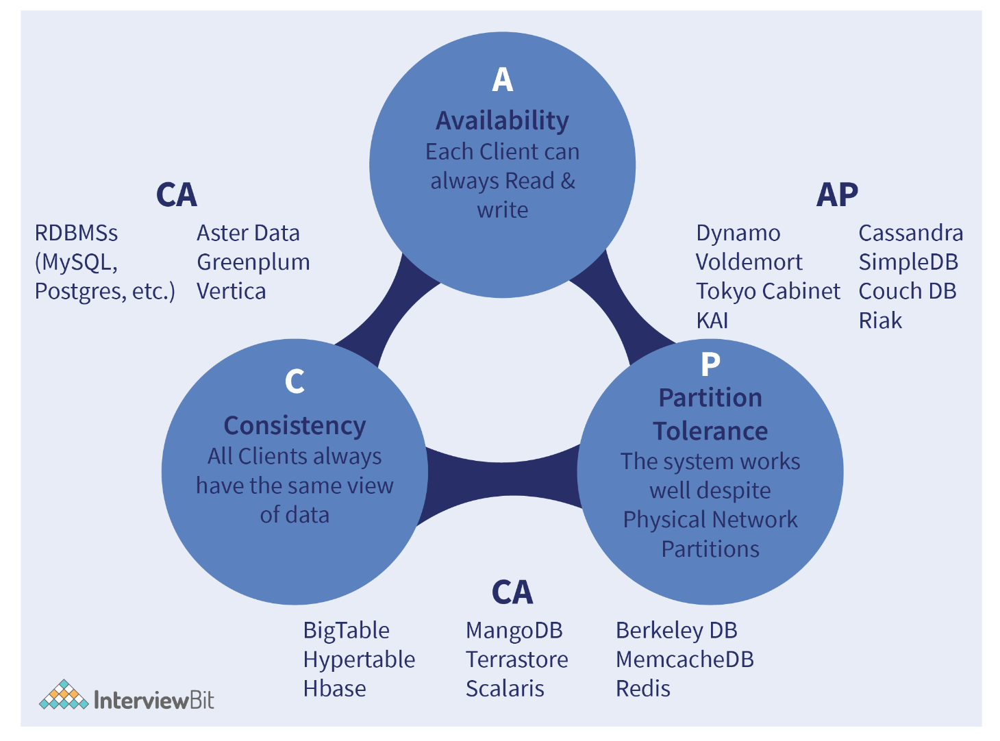

27. What Are Recursive Relationships?
    + `Recursive relationships`: occur when there is a relationship between an entity and itself. These relationships are complex and would require more complex approaches of mapping the data to a schema. Consider an instance where a doctor is marked as a care provider in the health care database. Now if the doctor himself falls sick, he needs to go to another doctor as a patient which results in recursive relationships. To accommodate this, we add a foreign key to the health centre’s number in every patient’s record. Care needs to be taken for ensuring that the recursion has an exit path in such entity relations.

28. What is dimensional modeling?
    + `Dimensional Modeling`: a technique of data structuring performed for optimizing the data storage and faster data retrieval in the data warehouse. It consists of 2 types of tables - fact tables and dimension tables. The fact tables are used for storing different transactional data along with the foreign keys from the dimension tables qualifying the data.
      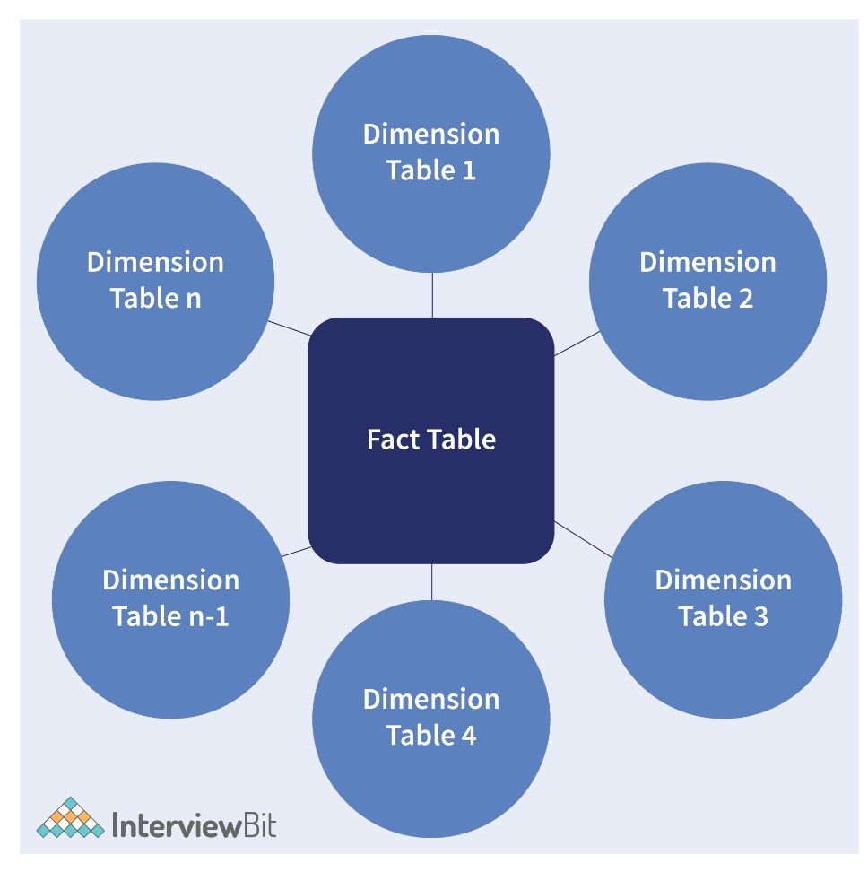
      + The purpose of Dimensional modeling is to achieve faster data retrieval and not the highest degree of normalization.

29. What are the types of dimensions in data modeling?
    + `Conformed dimension`: the dimensions that are used in multiple tables in a database by allowing measures and facts to be categorized and described consistently across other facts or data marts.
    + `Junk dimension`: the attributes do not belong to the fact table or any existing dimension table. They are usually text or are like flags indicating ‘Y’ or ‘N’ (yes or no) or true or false.
    + `Role-playing dimension`: there are multiple relationships valid between itself and other tables. It is used for deciding how the roles can be used with other facts which do not share the same concepts.
    + `Slowly changing dimension`: have attributes that change over time and also include dimensions where data is preserved or replaced in history.
    + `Degenerated dimension`: dimensions do not have their dimension tables but are part of the primary key in the fact table.

30. How can you perform reverse engineering in data modeling?
    + `Reverse engineering`: the process of building a data model from an existing database. This is more beneficial in cases when an organization has an existing outdated database solution, then while performing tech modernization, instead of developing solutions from scratch, it becomes more efficient to reconstruct the data model from an existing system and make tweaks to that data model as per the vision and apply that tweak to the current system. The steps in reverse engineering are summarised as follows:
      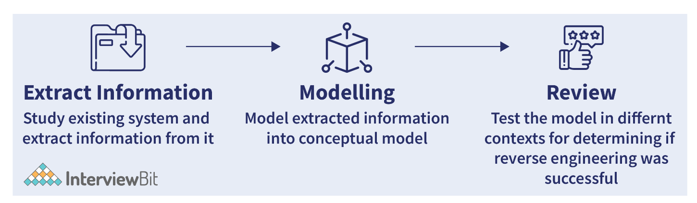

31. What is the importance of the third normal form?
    + `The third normal form (3NF)`: used for preventing data duplication and data abnormalities. A relation is said to have met the third normal form when there are no transitive dependencies for non-prime attributes as present in the second normal form. A 3NF relation is said to have achieved if any one of the below conditions are met for every non-trivial functional dependency A->B:
      + `A`: super key
      + `B`: prime attribute where every attribute is a part of candidate key
    + For a table to achieve 3NF form, it should first be in 1NF (First Normal Form) and achieve 2NF (Second Normal Form). The rows in the table should be dependent only on the keys. If the contents of fields apply to more than 1 primary key, then they should be put in another table.
    + For instance, if a patient’s records have a doctor’s phone number stored with the patient’s details, it doesn’t meet the 3NF standards. Because the doctor’s number should be part of the doctor table for avoiding duplication in the patient table because a doctor can have more than one patient.

32. What are some of the common mistakes encountered in data modeling?
    + `Building massive data models`: As good practices, a data model is recommended to have <=200 tables. This is because large data models are more likely to have design faults.
    + `Lack of purpose`: When the purpose of the business solution is not clear, then the data model generated would be incorrect as there is no means of validating the correctness of the model against the organization objectives.
    + `Unnecessary de-normalization`: Denormalization should not be done unless we have a solid business reason as it contributes to data redundancy which might increase the cost of maintenance.
    + `Unnecessary surrogate keys`: Surrogate keys are generated artificially for identifying the records. Too much use of these keys is not recommended when the natural keys can serve the purpose.
