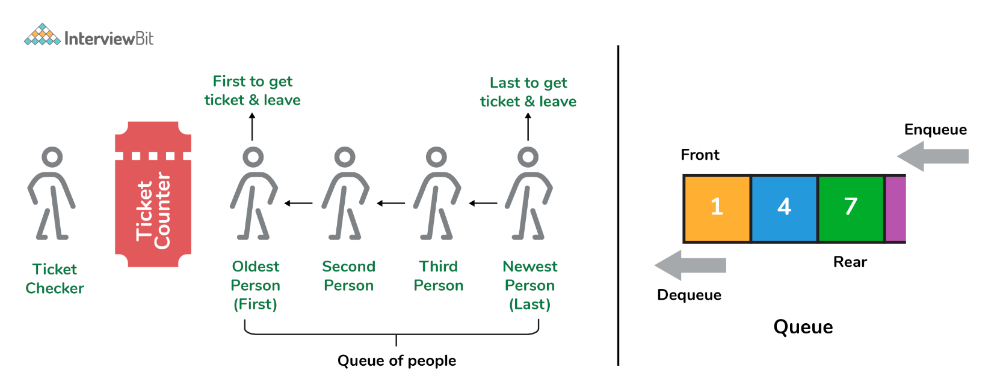
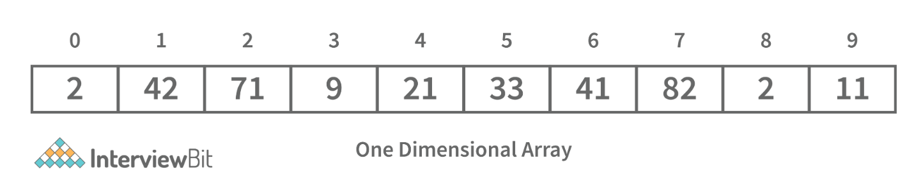
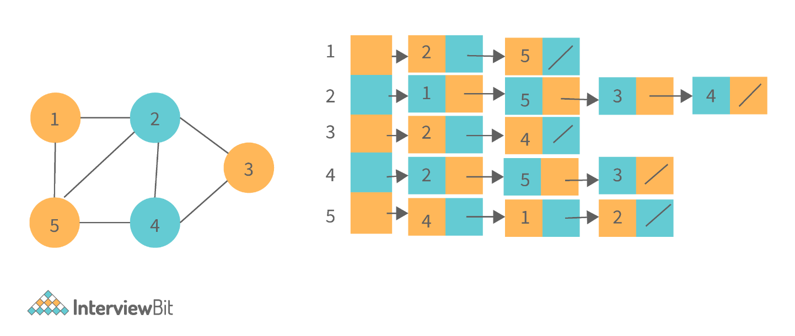

# Web API Interview Questions

---

## Background
Data structures are the building blocks of any computer program as they help in organizing and manipulating data in an efficient manner. Without data structures, the computer would be unable to understand how to follow a program's instructions properly. It also defines their relationship with one another. 

Arrays, Linked Lists, Stacks, Queues, and others are examples of Data Structure. Data structures also provide clarity, organization and structure to the program's code while also helping the programmer ensure that each line of code performs its function correctly.

---

1. What are Data Structures?
+ Data structure: is a mechanical or logical way that data is organized within a program. The organization of data is what determines how a program performs. There are many types of data structures, each with its own uses. When designing code, we need to pay particular attention to the way data is structured. If data isn't stored efficiently or correctly structured, then the overall performance of the code will be reduced.

2. Why Create Data Structures?
+ Data structures serve a number of important functions in a program. They ensure that each line of code performs its function correctly and efficiently, they help the programmer identify and fix problems with his/her code, and they help to create a clear and organized code base.

3. What are some applications of Data structures?

+ Decision Making
+ Genetics
+ Image Processing
+ Blockchain
+ Numerical and Statistical Analysis
+ Compiler Design
+ Database Design and many more

1. Explain the process behind storing a variable in memory.
+ A variable is stored in memory based on the amount of memory that is needed. Following are the steps followed to store a variable:
  + The required amount of memory is assigned first.
  + Then, it is stored based on the data structure being used.
+ Using concepts like dynamic allocation ensures high efficiency and that the storage units can be accessed based on requirements in real-time.

1. Can you explain the difference between file structure and storage structure?
+ File Structure: Representation of data into secondary or auxiliary memory say any device such as a hard disk or pen drives that stores data which remains intact until manually deleted is known as a file structure representation.
+ Storage Structure: In this type, data is stored in the main memory i.e RAM, and is deleted once the function that uses this data gets completely executed.
+ The difference is that the storage structure has data stored in the memory of the computer system, whereas the file structure has the data stored in the auxiliary memory.

6. Describe the types of Data Structures?

+ Linear Data Structure: A data structure that includes data elements arranged sequentially or linearly, where each element is connected to its previous and next nearest elements, is referred to as a linear data structure. Arrays and linked lists are two examples of linear data structures.
+ Non-Linear Data Structure: Non-linear data structures are data structures in which data elements are not arranged linearly or sequentially. We cannot walk through all elements in one pass in a non-linear data structure, as in a linear data structure. Trees and graphs are two examples of non-linear data structures.

7. What is a stack data structure? What are the applications of stack?
+ Stack: is a data structure that is used to represent the state of an application at a particular point in time. The stack consists of a series of items that are added to the top of the stack and then removed from the top. It is a linear data structure that follows a particular order in which operations are performed. LIFO (Last In First Out) or FILO (First In Last Out) are two possible orders. A stack consists of a sequence of items. The element that's added last will come out first, a real-life example might be a stack of clothes on top of each other. When we remove the cloth that was previously on top, we can say that the cloth that was added last comes out first.
  
  + Following are some applications for stack data structure:
    + It acts as temporary storage during recursive operations
    + Redo and Undo operations in doc editors
    + Reversing a string
    + Parenthesis matching
    + Postfix to Infix Expressions
    + Function calls order

1. What are different operations available in stack data structure?
+ push: This adds an item to the top of the stack. The overflow condition occurs if the stack is full.
+ pop: This removes the top item of the stack. Underflow condition occurs if the stack is empty.
+ top: This returns the top item from the stack.
+ isEmpty: This returns true if the stack is empty else false.
+ size:  This returns the size of the stack.

9. What is a queue data structure? What are the applications of queue?
+ Queue: is a linear data structure that allows users to store items in a list in a systematic manner. The items are added to the queue at the rear end until they are full, at which point they are removed from the queue from the front. Queues are commonly used in situations where the users want to hold items for a long period of time, such as during a checkout process. A good example of a queue is any queue of customers for a resource where the first consumer is served first.
  
  + Following are some applications of queue data structure:
    + Breadth-first search algorithm in graphs
    + Operating system: job scheduling operations, Disk scheduling, CPU scheduling etc.
    + Call management in call centres

1.  What are different operations available in queue data structure?
+ enqueue: This adds an element to the rear end of the queue.  Overflow conditions occur if the queue is full.
+ dequeue: This removes an element from the front end of the queue. Underflow conditions occur if the queue is empty.
+ isEmpty: This returns true if the queue is empty or else false.
+ rear: This returns the rear end element without removing it.
+ front: This returns the front-end element without removing it.
+ size: This returns the size of the queue.

11. Differentiate between stack and queue data structure.
  
  

12. How to implement a queue using stack?
+ A queue can be implemented using two stacks. Let q be the queue andstack1 and stack2 be the 2 stacks for implementing q. We know that stack supports push, pop, and peek operations and using these operations, we need to emulate the operations of the queue - enqueue and dequeue. Hence, queue q can be implemented in two methods (Both the methods use auxillary space complexity of O(n)):
  + By making enqueue operation costly:
    + Here, the oldest element is always at the top of stack1 which ensures dequeue operation occurs in O(1) time complexity.
    + To place the element at top of stack1, stack2 is used.
    + Pseudocode:
      + Enqueue: Here time complexity will be O(n)
        ```
        enqueue(q, data):
        While stack1 is not empty:
            Push everything from stack1 to stack2.
              Push data to stack1
              Push everything back to stack1.
        ```
      + Dequeue: Here time complexity will be O(1)
        ```
        deQueue(q):
        If stack1 is empty then error  else
        Pop an item from stack1 and return it
        ```
  + By making the dequeue operation costly:
    + Here, for enqueue operation, the new element is pushed at the top of stack1. Here, the enqueue operation time complexity is O(1).
    + In dequeue, if stack2 is empty, all elements from stack1 are moved to stack2 and top of stack2 is the result. Basically, reversing the list by pushing to a stack and returning the first enqueued element. This operation of pushing all elements to a new stack takes O(n) complexity.
    + Pseudocode:
      + Enqueue: Time complexity: O(1)
        ```
        enqueue(q, data):
        Push data to stack1
        ```
      + Dequeue: Time complexity: O(n)
        ```
        dequeue(q):
        If both stacks are empty then raise error.
        If stack2 is empty:
        While stack1 is not empty:
        push everything from stack1 to stack2.
          Pop the element from stack2 and return it.
        ```

1.  How do you implement stack using queues?
+ A stack can be implemented using two queues. We know that a queue supports enqueue and dequeue operations. Using these operations, we need to develop push, pop operations.
+ Let stack be ‘s’ and queues used to implement be ‘q1’ and ‘q2’. Then, stack ‘s’ can be implemented in two ways:
  + By making push operation costly:
    + This method ensures that the newly entered element is always at the front of ‘q1’ so that pop operation just dequeues from ‘q1’.
    + ‘q2’ is used as auxillary queue to put every new element in front of ‘q1’ while ensuring pop happens in O(1) complexity.
    + Pseudocode: Push element to stack s: Here push takes O(n) time complexity.
      ```
      push(s, data):
          Enqueue data to q2
          Dequeue elements one by one from q1 and enqueue to q2.
          Swap the names of q1 and q2
      ```
    + Pop element from stack s: Takes O(1) time complexity.
      ```
      pop(s):
      dequeue from q1 and return it.
      ```
  + By making pop operation costly:
    + In push operation, the element is enqueued to q1.
    + In pop operation, all the elements from q1 except the last remaining element, are pushed to q2 if it is empty. That last element remaining of q1 is dequeued and returned.
    + Pseudocode: Push element to stack s: Here push takes O(1) time complexity.
      ```
      push(s,data):
      Enqueue data to q1
      ```
    + Pop element from stack s: Takes O(n) time complexity.
      ```
      pop(s):
        Step1: Dequeue every elements except the last element from q1 and enqueue to q2.
        Step2: Dequeue the last item of q1, the dequeued item is stored in result variable.
        Step3: Swap the names of q1 and q2 (for getting updated data after dequeue) 
        Step4: Return the result.
      ```

1.  What is array data structure? What are the applications of arrays?
+ Array: data structure is a data structure that is used to store data in a way that is efficient and easy to access. It is similar to a list in that it stores data in a sequence. However, an array data structure differs from a list in that it can hold much more data than a list can. An array data structure is created by combining several arrays together. Each array is then given a unique identifier, and each array’s data is stored in the order in which they are created.
  
+ Array data structures are commonly used in databases and other computer systems to store large amounts of data efficiently. They are also useful for storing information that is frequently accessed, such as large amounts of text or images.

15. Elaborate on different types of array data structure
+ One-dimensional array: A one-dimensional array stores its elements in contiguous memory locations, accessing them using a single index value. It is a linear data structure holding all the elements in a sequence.
  
+ Two-dimensional array: A two-dimensional array is a tabular array that includes rows and columns and stores data. An M × N two-dimensional array is created by grouping M rows and N columns into N columns and rows.
  
+ Three-dimensional array: A three-dimensional array is a grid that has rows, columns, and depth as a third dimension. It comprises a cube with rows, columns, and depth as a third dimension. The three-dimensional array has three subscripts for a position in a particular row, column, and depth. Depth (dimension or layer) is the first index, row index is the second index, and column index is the third index.
  

1.  What is a linked list data structure? What are the applications for the Linked list?
+ Linked List: can be thought of as a series of linked nodes (or items) that are connected by links (or paths). Each link represents an entry into the linked list, and each entry points to the next node in the sequence. The order in which nodes are added to the list is determined by the order in which they are created.
  
  + Following are some applications of linked list data structure:
    + Stack, Queue, binary trees, and graphs are implemented using linked lists.
    + Dynamic management for Operating System memory.
    + Round robin scheduling for operating system tasks.
    + Forward and backward operation in the browser.

1.  Elaborate on different types of Linked List data structures?
+ Singly Linked List: A singly linked list is a data structure that is used to store multiple items. The items are linked together using the key. The key is used to identify the item and is usually a unique identifier. In a singly linked list, each item is stored in a separate node. The node can be a single object or it can be a collection of objects. When an item is added to the list, the node is updated and the new item is added to the end of the list. When an item is removed from the list, the node that contains the removed item is deleted and its place is taken by another node. The key of a singly linked list can be any type of data structure that can be used to identify an object. For example, it could be an integer, a string, or even another singly linked list. Singly-linked lists are useful for storing many different types of data. For example, they are commonly used to store lists of items such as grocery lists or patient records. They are also useful for storing data that is time sensitive such as stock market prices or flight schedules.
  
+ Doubly Linked List: A doubly linked list is a data structure that allows for two-way data access such that each node in the list points to the next node in the list and also points back to its previous node. In a doubly linked list, each node can be accessed by its address, and the contents of the node can be accessed by its index. It's ideal for applications that need to access large amounts of data in a fast manner. A disadvantage of a doubly linked list is that it is more difficult to maintain than a single-linked list. In addition, it is more difficult to add and remove nodes than in a single-linked list.
  
+ Circular Linked List: A circular linked list is a unidirectional linked list where each node points to its next node and the last node points back to the first node, which makes it circular.
  
+ Doubly Circular Linked List: A doubly circular linked list is a linked list where each node points to its next node and its previous node and the last node points back to the first node and first node’s previous points to the last node.
  
+ Header List: A list that contains the header node at the beginning of the list, is called the header-linked list. This is helpful in calculating some repetitive operations like the number of elements in the list etc.

1. Difference between Array and Linked List.
  
  
  

2.  What is an asymptotic analysis of an algorithm?
+ Asymptotic analysis: defines the run-time performance as per its mathematical boundations. Asymptotic analysis helps us articulate the best case(Omega Notation, Ω), average case(Theta Notation, θ), and worst case(Big Oh Notation, Ο) performance of an algorithm.

1.  What is hashmap in data structure?
+ Hashmap: is a data structure that uses an implementation of a hash table data structure which allows access to data in constant time (O(1)) complexity if you have the key.

21. What is the requirement for an object to be used as key or value in HashMap?
+ The key or value object that gets used in the hashmap must implement equals() and hashcode() method.
+ The hash code is used when inserting the key object into the map and the equals method is used when trying to retrieve a value from the map.

22. How does HashMap handle collisions in Java?
+ The java.util.HashMap class in Java uses the approach of chaining to handle collisions. In chaining, if the new values with the same key are attempted to be pushed, then these values are stored in a linked list stored in a bucket of the key as a chain along with the existing value.
+ In the worst-case scenario, it can happen that all keys might have the same hashcode, which will result in the hash table turning into a linked list. In this case, searching a value will take O(n) complexity as opposed to O(1) time due to the nature of the linked list. Hence, care has to be taken while selecting hashing algorithm.

23. What is the time complexity of basic operations get() and put() in HashMap class?
+ The time complexity is O(1) assuming that the hash function used in the hash map distributes elements uniformly among the buckets.

24. What is binary tree data structure? What are the applications for binary trees?
+ Binary Tree: is a data structure that is used to organize data in a way that allows for efficient retrieval and manipulation. It is a data structure that uses two nodes, called leaves and nodes, to represent the data. The leaves represent the data and the nodes represent the relationships between the leaves. Each node has two children, called siblings, and each child has one parent. The parent is the node that is closest to the root of the tree. When a node is deleted from the tree, it is deleted from both its child and its parent.
  + Following are some applications for binary tree data structure:
    + It's widely used in computer networks for storing routing table information.
    + Decision Trees.
    + Expression Evaluation.
    + Database indices.
  

1.  What is binary search tree data structure? What are the applications for binary search trees?
+ Binary Search Tree: is a data structure that stores items in sorted order. In a binary search tree, each node stores a key and a value. The key is used to access the item and the value is used to determine whether the item is present or not. The key can be any type of value such as an integer, floating point number, character string, or even a combination of these types. The value can be any type of items such as an integer, floating point number, character string, or even a combination of these types. When a node is added to the tree, its key is used to access the item stored at that node. When a node is removed from the tree, its key is used to access the item stored at that node.
  + A binary search tree is a special type of binary tree that has a specific order of elements in it. It has three basic qualities:
    + All elements in the left subtree of a node should have a value less than or equal to the parent node's value
    + All elements in the right subtree of a node should have a value greater than or equal to the parent node's value.
    + Both the left and right subtrees must be binary search trees too.
  
  + Following are some applications for binary tree data structure:
    + It is used for indexing and multi-level indexing.
    + It is used for implementing various search algorithms.
    + It is helpful in organizing a sorted stream of data.

1.  What are tree traversals?
+ Tree traversal: is the process of visiting all the nodes of a tree. Since the root (head) is the first node and all nodes are connected via edges (or links) we always start with that node. There are three ways which we use to traverse a tree:
  + Inorder Traversal:
    + Algorithm:
      + Step 1. Traverse the left subtree, i.e., call Inorder(root.left)
      + Step 2. Visit the root.
      + Step 3. Traverse the right subtree, i.e., call Inorder(root.right)
    + Inorder traversal in Java:
      ```
      // Print inorder traversal of given tree.
      void printInorderTraversal(Node root)
      {
          if (root == null)
              return;
          //first traverse to the left subtree
          printInorderTraversal(root.left);
          //then print the data of node
          System.out.print(root.data + " ");
          //then traverse to the right subtree
          printInorderTraversal(root.right);
      }
      ```
    + Uses: In binary search trees (BST), inorder traversal gives nodes in ascending order.
  + Preorder Traversal:
    + Algorithm:
      + Step 1. Visit the root.
      + Step 2. Traverse the left subtree, i.e., call Preorder(root.left)
      + Step 3. Traverse the right subtree, i.e., call Preorder(root.right)
    + Preorder traversal in Java:
      ```
      // Print preorder traversal of given tree.
        void printPreorderTraversal(Node root)
        {
            if (root == null)
                return;
            //first print the data of node
            System.out.print(root.data + " ");
            //then traverse to the left subtree
            printPreorderTraversal(root.left);
            //then traverse to the right subtree
            printPreorderTraversal(root.right);
        }
      ```
    + Uses:
      + Preorder traversal is commonly used to create a copy of the tree.
      + It is also used to get prefix expression of an expression tree.
  + Postorder Traversal:
    + Algorithm:
      + Step 1. Traverse the left subtree, i.e., call Postorder(root.left)
      + Step 2. Traverse the right subtree, i.e., call Postorder(root.right)
      + Step 3. Visit the root.
    + Postorder traversal in Java:
      ```
      // Print postorder traversal of given tree.
      void printPostorderTraversal(Node root)
      {
      if (root == null)
          return;
      //first traverse to the left subtree
      printPostorderTraversal(root.left);
      //then traverse to the right subtree
      printPostorderTraversal(root.right);
      //then print the data of node
      System.out.print(root.data + " ");
      }
      ```
    + Uses:
      + Postorder traversal is commonly used to delete the tree.
      + It is also useful to get the postfix expression of an expression tree.
  + Consider the following tree as an example, then:
      
      + Inorder Traversal => Left, Root, Right : [4, 2, 5, 1, 3]
      + Preorder Traversal => Root, Left, Right : [1, 2, 4, 5, 3]
      + Postorder Traversal => Left, Right, Root : [4, 5, 2, 3, 1]

1.  What is a deque data structure and its types? What are the applications for deque?
+ Deque: can be thought of as an array of items, but with one important difference: Instead of pushing and popping items off the end to make room, deques are designed to allow items to be inserted at either end. This property makes deques well-suited for performing tasks such as keeping track of inventory, scheduling tasks, or handling large amounts of data.
  
  + There are two types of deque:
    + Input Restricted Deque: Insertion operations are performed at only one end while deletion is performed at both ends in the input restricted queue.
      
    + Output Restricted Deque: Deletion operations are performed at only one end while insertion is performed at both ends in the output restricted queue.
      
  + Following are some real-time applications for deque data structure:
    + It can be used as both stack and queue, as it supports all the operations for both data structures.
    + Web browser’s history can be stored in a deque.
    + Operating systems job scheduling algorithm.

1. What are some key operations performed on the Deque data structure?
+ insertFront(): This adds an element to the front of the Deque.
+ insertLast(): This adds an element to the rear of the Deque.
+ deleteFront(): This deletes an element from the front of the Deque.
+ deleteLast():This deletes an element from the front of the Deque.
+ getFront(): This gets an element from the front of the Deque.
+ getRear(): This gets an element from the rear of the Deque.
+ isEmpty(): This checks whether Deque is empty or not.
+ isFull(): This checks whether Deque is full or not.

29. What is a priority queue? What are the applications for priority queue?
+ Priority Queue: an abstract data type that is similar to a queue in that each element is assigned a priority value. The order in which elements in a priority queue are served is determined by their priority (i.e., the order in which they are removed). If the elements have the same priority, they are served in the order they appear in the queue.
  
  + Following are some real-time applications for priority queue:
    + Used in graph algorithms like Dijkstra, Prim’s Minimum spanning tree etc.
    + Huffman code for data compression
    + Finding Kth Largest/Smallest element

1.  Compare different implementations of priority queue
  

2.  What is graph data structure and its representations? What are the applications for graphs?
+ Graph: is a type of non-linear data structure made up of nodes and edges. The nodes are also known as vertices, and edges are lines or arcs that connect any two nodes in the graph.
  
  + The following are the two most common graph representations:
    + Adjacency Matrix: Adjacency Matrix is a two-dimensional array with the dimensions V x V, where V is the number of vertices in a graph. Representation is simpler to implement and adhere to. It takes O(1) time to remove an edge. Queries such as whether there is an edge from vertex 'u' to vertex 'v' are efficient and can be completed in O(1).
      
      + One of the cons of this representation is that even if the graph is sparse (has fewer edges), it takes up the same amount of space. Adding a vertex takes O(V^2). It also takes O(V) time to compute all of a vertex's neighbours, which is not very efficient.
    + Adjacency List: In this method, each Node holds a list of Nodes that are directly connected to that vertex. Each node at the end of the list is connected with null values to indicate that it is the last node in the list. This saves space O(|V|+|E|). In the worst-case scenario, a graph can have C(V, 2) edges, consuming O(V^2) space. It is simpler to add a vertex. It takes the least amount of time to compute all of a vertex's neighbours.
      
      + One of the cons of this representation is that ​queries such as "is there an edge from vertex u to vertex v?" are inefficient and take O (V) in the worst case.

1.  What is the difference between the Breadth First Search (BFS) and Depth First Search (DFS)?
  
  

2.  What is AVL tree data structure, its operations, and its rotations? What are the applications for AVL trees?
+ AVL trees: are height balancing binary search trees named after their inventors Adelson, Velski, and Landis. The AVL tree compares the heights of the left and right subtrees and ensures that the difference is less than one. This distinction is known as the Balance Factor.
  + `BalanceFactor = height(left-subtree) − height(right-subtree)`
  
  + We can perform the following two operations on AVL tree:
    + Insertion: Insertion in an AVL tree is done in the same way that it is done in a binary search tree. However, it may cause a violation in the AVL tree property, requiring the tree to be balanced. Rotations can be used to balance the tree.
    + Deletion: Deletion can also be performed in the same manner as in a binary search tree. Because deletion can disrupt the tree's balance, various types of rotations are used to rebalance it.
  + An AVL tree can balance itself by performing the four rotations listed below:
    + Left rotation: When a node is inserted into the right subtree of the right subtree and the tree becomes unbalanced, we perform a single left rotation.
    + Right rotation: If a node is inserted in the left subtree of the left subtree, the AVL tree may become unbalanced. The tree then requires right rotation.
    + Left-Right rotation: The RR rotation is performed first on the subtree, followed by the LL rotation on the entire tree.
    + Right-Left rotation: The LL rotation is performed first on the subtree, followed by the RR rotation on the entire tree.
  + Following are some real-time applications for AVL tree data structure:
    + AVL trees are typically used for in-memory sets and dictionaries.
    + AVL trees are also widely used in database applications where there are fewer insertions and deletions but frequent data lookups are required.
    + Apart from database applications, it is used in applications that require improved searching.

1.  What is a B-tree data structure? What are the applications for B-trees?
+ B-tree: is a type of m-way tree that is commonly used for disc access. A B-Tree with order m can only have m-1 keys and m children. One of the primary reasons for using a B tree is its ability to store a large number of keys in a single node as well as large key values while keeping the tree's height relatively small.
  + B-tree order 4:
    
  + Following are the key properties of a B-tree data structure:
    + All of the leaves are at the same height.
    + The term minimum degree 't' describes a B-Tree. The value of t is determined by the size of the disc block.
    + Except for root, every node must have at least t-1 keys. The root must contain at least one key.
    + All nodes (including root) can have no more than 2*t - 1 keys.
    + The number of children of a node is equal to its key count plus one.
    + A node's keys are sorted in ascending order. The child of two keys k1 and k2 contains all keys between k1 and k2.
    + In contrast to Binary Search Tree, B-Tree grows and shrinks from the root.
  + Following are real-time applications of a B-Tree data structure:
    + It is used to access data stored on discs in large databases.
    + Using a B tree, you can search for data in a data set in significantly less time.
    + The indexing feature allows for multilevel indexing.
    + The B-tree approach is also used by the majority of servers.

1.  Define Segment Tree data structure and its applications.
+ Segment Tree: is a binary tree that is used to store intervals or segments. The Segment Tree is made up of nodes that represent intervals. Segment Tree is used when there are multiple range queries on an array and changes to array elements.
  + The segment tree of array `A[7]` will look like this:
    
  + Following are key operations performed on the Segment tree data structure:
    + Building Tree: In this step, we create the structure and initialize the segment tree variable.
    + Updating the Tree: In this step, we change the tree by updating the array value at a point or over an interval.
    + Querying Tree: This operation can be used to run a range query on the array.
  + Following are real-time applications for Segment Tree:
    + Used to efficiently list all pairs of intersecting rectangles from a list of rectangles in the plane.
    + The segment tree has become popular for use in pattern recognition and image processing.
    + Finding range sum/product, range max/min, prefix sum/product, etc
    + Computational geometry
    + Geographic information systems
    + Static and Dynamic RMQ (Range Minimum Query)
    + Storing segments in an arbitrary manner

1.  Define Trie data structure and its applications
+ Trie: is a data structure that stores a set of strings as a sorted tree.The word "Trie" is an abbreviation for "retrieval."  Each node has the same number of pointers as the number of alphabet characters. It can look up a word in the dictionary by using its prefix. Assuming that all strings are formed from the letters 'a' to 'z' in the English alphabet, each trie node can have a maximum of 26 points.
+ Trie is also referred to as the digital tree or the prefix tree. The key to which a node is connected is determined by its position in the Trie. Trie allows us to insert and find strings in O(L) time, where L is the length of a single word. This is clearly faster than BST. Because of how it is implemented, this is also faster than Hashing. There is no need to compute a hash function. There is no need to handle collisions (like we do in open addressing and separate chaining)
+ Another benefit of Trie is that we can easily print all words in alphabetical order, which is not easy with hashing. Trie can also perform prefix search (or auto-complete) efficiently.

  + The main disadvantage of tries is that they require a large amount of memory to store the strings. We have an excessive number of node pointers for each node.
  + Following are some real-time applications for Trie data structure:
    + Auto-Complete and Search for Search Engines
    + Genome Analysis
    + Data Analytics
    + Browser History
    + Spell Checker

1.  Define Red-Black Tree and its applications
+ Red-Black Trees: are a type of self-balancing binary search tree. Rudolf Bayer invented it in 1972 and dubbed it "symmetric binary B-trees."
+ A red-black tree is a Binary tree in which each node has a colour attribute, either red or black. By comparing the node colours on any simple path from the root to a leaf, red-black trees ensure that no path is more than twice as long as any other, ensuring that the tree is generally balanced.
+ Red-black trees are similar to binary trees in that they both store their data in two's complementary binary formats. However, red-black trees have one important advantage over binary trees: they are faster to access. Because red-black trees are so fast to access, they are often used to store large amounts of data.
+ Red-black trees can be used to store any type of data that can be represented as a set of values.

  + Every Red-Black Tree Obeys the Following Rules:
    + Every node is either red or black.
    + The tree's root is always black.
    + There are no two red nodes that are adjacent.
    + There is the same number of black nodes on every path from a node to any of its descendant's NULL nodes.
    + All of the leaf nodes are black.
  + Following are some real-time applications for the Red-Black Tree data structure:
    + The majority of self-balancing BST library functions in C++ or Java use Red-Black Trees.
    + It is used to implement Linux CPU Scheduling.
    + It is also used to reduce time complexity in the K-mean clustering algorithm in machine learning.
    + MySQL also employs the Red-Black tree for table indexes in order to reduce searching and insertion time.

1.  Which data structures are used for implementing Least Recently Used (LRU) cache?
+ Least Recently Used Cache (LRU): allows quick identification of an element that hasn’t been put to use for the longest time by organizing items in order of use. In order to achieve this, two data structures are used:
  + Queue: This is implemented using a doubly-linked list. The maximum size of the queue is determined by the cache size, i.e by the total number of available frames. The least recently used pages will be near the front end of the queue whereas the most recently used pages will be towards the rear end of the queue.
  + Hashmap: Hashmap stores the page number as the key along with the address of the corresponding queue node as the value.
  

1.  What is a heap data structure?
+ Heap: is a special tree-based non-linear data structure in which the tree is a complete binary tree. A binary tree is said to be complete if all levels are completely filled except possibly the last level and the last level has all elements as left as possible. Heaps are of two types:
  + Max-Heap:
    + In a Max-Heap the data element present at the root node must be the greatest among all the data elements present in the tree.
    + This property should be recursively true for all sub-trees of that binary tree.
  + Min-Heap:
    + In a Min-Heap the data element present at the root node must be the smallest (or minimum) among all the data elements present in the tree.
    + This property should be recursively true for all sub-trees of that binary tree.

1.  Write a program to remove duplicates from a sorted array in place?
+ Input: {1, 1, 1, 2, 3, 3, 6, 6, 7}
+ Output: {1, 2, 3, 6, 7}
+ Explanation: The given input has only 1,2,3,6, and 7 as unique elements, hence the output only lists them out.
+ Time Complexity: O(n)
+ Space Complexity: O(1)
  ```
  #include <bits/stdc++.h>
  using namespace std;

  class Solution{
  public:
      //function that takes an array and its size as arguments
      int removeDuplicates(int a[],int n){
          int index=0;
          for(int i=1;i<n;i++) {

              if(a[i]!=a[index]) { //change index
                  index++; //swap next line
                  a[index]=a[i];
              }
            }
            return index+1;
      }
  };

  int main()
  {
      int T;
      //taking the number of test cases from user
      cin>>T;
      //running the loop for all test cases
      while(T--)
      {
          int N;
          //taking size input from user
          cin>>N;
          int a[N];
          //taking array input from user
          for(int i=0;i<N;i++)
          {
              cin>>a[i];
          }
          Solution ob;
          //calling the removeDuplicates in the Solution class
          int n = ob.removeDuplicates(a,N);
          //printing the array after removing duplicates
          for(int i=0;i<n;i++)
              cout<<a[i]<<" ";
              cout<<endl;
          }
  }
  ```

1.  Write a function for zigzag traversal in a binary tree.
+ Input:
+ Output: [1, 3, 2, 4, 5, 6, 8, 7]
+ Explanation: Zigzag Traversal first iterates the given level of the tree from left to right and then the next level as the right to the level.
+ Time Complexity: O(n)
+ Space Complexity: O(n)
  ```
  // Tree Node
  struct Node {
      int data;
      Node* left;
      Node* right;
  };

  //Function to store the zigzag order traversal of a tree in a list.
      vector <int> zigZagTraversal(Node* root)
      {
      //creating two stacks for level traversals in both order
        stack<Node*> st1;
        stack<Node*> st2;
      //vector to store the zigzag traversal
        vector<int> result;

      //Initialize the first stack with the root element
        st1.push(root);

      //Iterate until either of the stack is not empty
        while(!st1.empty() || !st2.empty()){
          //iterate until the first stack is not empty
            while(!st1.empty()){
                Node* temp=st1.top();
                st1.pop();
                result.push_back(temp->data);

                if(temp->left)
                    st2.push(temp->left);
                if(temp->right)
                    st2.push(temp->right);
            }
          //Iterate until the second stack is not empty
            while(!st2.empty()){
                Node* temp=st2.top();
                st2.pop();
                result.push_back(temp->data);

                if(temp->right)
                    st1.push(temp->right);
                if(temp->left)
                    st1.push(temp->left);

            }
        }
        return result;
      }
  ```

1.  Write a function to sort a linked list of 0s, 1s and 2s.
+ Input: 0->1->0->2->1->0->2->1
+ Output: 0->0->0->1->1->1->2->2
+ Explanation: All 0’s will come first then 1s and then 2s. This can be done in O(n) time by counting the occurrences of all three and rearranging them in the linked list.
+ Time Complexity: O(n)
+ Space Complexity: O(1)
  ```
  //structure of the linked list
  struct Node {
    int data;
    Node *left;
    Node *right;
  }
  //function take the head of the linked list as a parameter
  void sortList(Node *head)
  {
    //if linked list is empty then return back
    if(head==NULL)
        return;
    else
    {
        Node *temp=head;
        Node *temp1=head;
        //to store count of 0s, 1s, and 2s
        int count0=0,count1=0,count2=0;
        //calculating the count of 0s, 1s, and 2s
        while(temp!=NULL)
        {
            if(temp->data==0)
                count0++;
            else if(temp->data==1)
                count1++;
            else
                count2++;
            temp=temp->next;
        }
        //iterating over count of 0s and filling the linked list
        while(count0!=0)
        {
            temp1->data=0;
            temp1=temp1->next;
            count0--;
        }
      //iterating over count of 1s and filling the linked list
        while(count1!=0)
        {
            temp1->data=1;
            temp1=temp1->next;
            count1--;
        }
      //iterating over count of 2s and filling the linked list
        while(count2!=0)
        {
            temp1->data=2;
            temp1=temp1->next;
            count2--;
        }
    }
  }
  ```

43. Write a function to detect cycle in an undirected graph.
+ Input: n = 4, e = 4 , 0 1, 1 2, 2 3, 3 1
+ Output: Yes
+ Explanation: The graph is represented as follows in adjacency list representation:
  + 0->1
  + 1->2
  + 2->3
  + 3->1
  + From the above representation, we can see that there exists a cycle: 1→2→3→1
+ Time Complexity: O(V+E)
+ Space Complexity: O(V)
  ```
  //function to run dfs for a given node in the graph
    int dfs(int v,vector<int> adj[],vector<int> &visited,vector<int> &rec,int i,int parent){
          int ans=0;
          visited[i]=1;
          rec[i]=1;
          for(auto x : adj[i]){
              if(x!=parent) {
                  if(rec[x])
                      return 1;
                  ans=dfs(v,adj,visited,rec,x,i);
                  if(ans)
                    return 1;
              }
          }
          rec[i]=0;
          return 0;
      }
      // Function to detect cycle in an undirected graph.
      // it takes adjacency list representation as an argument
      bool isCycle(int v, vector<int> adj[]) {
          vector<int> visited(v,0),rec(v,0);
          int ans=0;
          for(int i=0;i<v;i++){
              if(visited[i]==0)
                  ans=dfs(v,adj,visited,rec,i,-1);
              if(ans)
                  return 1;
          }
          return 0;
      }
  ```

1.  Write a function to convert an infix expression to postfix expression.
+ Input: a+b*(c^d)
+ Output: abcd^*+
+ Time Complexity: O(n)
+ Space Complexity: O(n)
  ```
  int prec(char c)
  {
      if (c == '^')
          return 3;
      else if (c == '/' || c == '*')
          return 2;
      else if (c == '+' || c == '-')
          return 1;
      else
          return -1;
  }
    public:
      // Function to convert an infix expression to a postfix expression.
      string infixToPostfix(string s) {
          stack<char> st; // For stack operations, we are using C++ built in stack
          string result;

          for (int i = 0; i < s.length(); i++) {
              char c = s[i];

              // If the scanned character is
              // an operand, add it to the output string.
              if ((c >= 'a' && c <= 'z') || (c >= 'A' && c <= 'Z')
              || (c >= '0' && c <= '9'))
                  result += c;

              // If the scanned character is an
              // '(', push it to the stack.
              else if (c == '(')
                  st.push('(');

              // If the scanned character is an ')',
              // pop and to output string from the stack
              // until an '(' is encountered.
              else if (c == ')') {
                  while (st.top() != '(') {
                      result += st.top();
                      st.pop();
                  }
                  st.pop();
              }

              // If an operator is scanned
              else {
                  while (!st.empty()
                    && prec(s[i]) <= prec(st.top())) {
                      if (c == '^' && st.top() == '^')
                          break;
                      else {
                          result += st.top();
                          st.pop();
                      }
                  }
                  st.push(c);
              }
          }

          // Pop all the remaining elements from the stack
          while (!st.empty()) {
              result += st.top();
              st.pop();
          }

          return result;
      }
  ```

45. Write a function to find the maximum for each and every contiguous subarray of size k.
+ Input: N = 9, K = 3 arr[] = {1, 2, 3, 1, 4, 5, 2, 3, 6}
+ Output: {3, 3, 4, 5, 5, 5, 6}
+ Explanation: In the first subarray of size 3: {1,2,3}, the value 3 is maximum, similarly for all such subarrays for size 3.
+ Time Complexity: O(n)
+ Space Complexity: O(k)
  ```
  //function to find maximum in each subarray using sliding window approach
  vector<int> max_of_subarrays(vector<int> arr, int n, int k){
          int i=0,j=0;
          deque<int> dq;
          dq.push_front(i++);
          while(i<k)
          {
              while(!dq.empty()&&arr[dq.back()]<=arr[i])
              dq.pop_back();
              dq.push_back(i++);
          }
          vector<int> ans;
          while(i<n)
          {
              ans.push_back(arr[dq.front()]);
              while(!dq.empty()&&j>=dq.front())
              {
                  dq.pop_front();

              }
              j++;
              while(!dq.empty()&&arr[dq.back()]<=arr[i])
              dq.pop_back();
              dq.push_back(i++);
          }
          ans.push_back(arr[dq.front()]);
          return ans;

      }
  ```

1.  Write a function to merge two sorted binary search tree.
+ Input:
  ```
  First BST

        7

      /     \

    5       9

  Second BST

      4

    /   \

  3       12
  ```
+ Output: 3 4 5 6 7 9 12
+ Time Complexity: O(m+n)
+ Space Complexity: O(height of the first tree + height of the second tree)
  ```
  //Function to return a list of integers denoting the node
  //values of both the BST in a sorted order.
      void inorder(Node*root,vector<int>&v){
          if(root==NULL)
              return;
          inorder(root->left,v);
          v.push_back(root->data);
          inorder(root->right,v);
      }
      vector<int> merge(vector<int>v1,vector<int>v2){
          vector<int>v;
          int n1=v1.size(),n2=v2.size(),i=0,j=0;
          while(i<n1&&j<n2){
              if(v1[i]>v2[j]){
                  v.push_back(v2[j]);
                  j++;
              }
              else{
                  v.push_back(v1[i]);
                  i++;
              }
          }
          while(i<n1){
              v.push_back(v1[i]);
              i++;
          }
          while(j<n2){
              v.push_back(v2[j]);
              j++;
          }
          return v;
      }
      vector<int> merge(Node *root1, Node *root2)
      {
        vector<int>v1,v2;
        inorder(root1,v1);
        inorder(root2,v2);
        return merge(v1,v2);
      }
  ```

47. Write a function to print all unique rows of the given matrix.
+ Input:
  + {{1, 1, 1, 0, 0},
  + {0, 1, 0, 0, 1},
  + {1, 0, 1, 1, 0},
  + {0, 1, 0, 0, 1},
  + {1, 1, 1, 0, 0}}
Output:
  + {{1, 1, 1, 0, 0},
  + {0, 1, 0, 0, 1},
  + {1, 0, 1, 1, 0}}
+ Time Complexity: O( ROW x COL )
+ Space Complexity: O( ROW )
+ Time Complexity: O(n)
+ Space Complexity: O(1)
  ```
  vector<vector<int>> uniqueRow(int M[MAX][MAX],int row,int col)
  {
  set<vector<int>> st;
  vector<vector<int>> v;

  for(int i=0; i<row; i++) {
      vector<int> v1;
      for(int j=0; j<col; j++) {
          v1.push_back(M[i][j]);
      }
      if(st.count(v1) == 0) {
          v.push_back(v1);
          st.insert(v1);
      }
  }

  return v;
  }
  ```

1.  Write a function to find number of subarrays with product less than K.
+ Input: arr = [1, 6, 2, 3, 2, 1], k = 12
+ Output: 11
  ```
  int numSubarrayProductLessThanK(vector<int>& nums, int k) {
          int ans=0;
          int pdt=1;
          int left=0,right=0;
          while(right<=nums.size()-1){

              pdt*=nums[right];
              while(pdt>=k and left<nums.size()){
                  pdt/=nums[left];
                  left++;

              }
              if(right-left>=0)
              ans+=right-left+1;//since on adding a new element new subarrays formed is r-i+1;
              right++;

          }
          return ans;
      }
  ```

49. Find the subsequence of length 3 with the highest product from a sequence of non-negative integers, with the elements in increasing order.
+ Input: n = 8 arr[ ] = {6, 7, 10, 1, 2, 3, 11, 12}
+ Output: {10, 11, 12}
+ Explanation: The three increasing elements of the given arrays are 10, 11, and 12, which form a three-size subsequence with the highest product.
+ Time Complexity: O(nlog(n))
+ Space Complexity: O(n)
  ```
  vector<int> maxProductSubsequence(int *a , int n)
    {
        set<int> s;
        long long largestOnLeft[n];
        for(int i=0;i<n;i++)
        {
            s.insert(a[i]);
            auto it=s.lower_bound(a[i]);
            if(it==s.begin())
            {
                largestOnLeft[i]=-1;
                continue;
            }
            it--;
            largestOnLeft[i]=*it;
        }
        int m=0;
        long long p=INT_MIN;
        vector<int> result(3);
        result[0]=-1;
        for(int i=n-1;i>=0;i--)
        {
          if(a[i]>=m){
          m=a[i];}
          else
          {
              if(largestOnLeft[i] !=-1)
              {
                  if(largestOnLeft[i]*a[i]*m >p)
                  {
                      p=largestOnLeft[i]*a[i]*m;
                      result[0]=largestOnLeft[i];
                      result[1]=a[i];
                      result[2]=m;
                  }
              }
          }
        }
        return v;
    }
  ```

50. Write a function to implement Quicksort on Doubly Linked List.
+ Input: 8<->10<->1<->7<->6
+ Output: 1<->6<->7<->8<->10
+ Time Complexity: O(n^2) in the worst case when the list is already sorted. O(nlog(n)) in the best and average case.
+ Space Complexity: O(n)
  ```
  class Solution{
  public:
      Node* partition(Node *l, Node *h){
          //Your code goes here
          Node*temp = h;
          Node*tt = l;
          Node*first = l;

          while(tt != h){
                if(tt->data <= temp->data){
                    swap(first->data, tt->data);
                    first = first->next;
                }
                tt = tt -> next;
          }
          swap(first-> data, h->data);
          return first;

      }
  };

  void _quickSort(struct Node* l, struct Node *h)
  {
      if (h != NULL && l != h && l != h->next)
      {
          Solution ob;
          struct Node *p = ob.partition(l, h);
          _quickSort(l, p->prev);
          _quickSort(p->next, h);
      }
  }

  void quickSort(struct Node *head)
  {
      struct Node *h = lastNode(head);
      _quickSort(head, h);
  }
  ```

51. Write a function to connect nodes at the same level of a binary tree.
+ Input:
  ```
            100

          /     \

      13      15

      /  \         \

  14    1         20
  ```
+ Output:
  ```
        100-> NULL

          /      \

    13   ->  15   -> NULL

    /      \           \

  14  ->  1   -> 20 -> NULL
  ```
+ Time Complexity: O(n)
+ Space Complexity: O(n)
  ```
  class Solution
  {
      public:
      //Function to connect nodes at the same level.
      void connect(Node *p)
      {
        map<int,vector<Node *> > m;
        queue<Node *> q;
        queue<int> l;
        q.push(p);
        l.push(0);
        while(!q.empty())
        {
            Node *temp=q.front();
            int level=l.front();
            q.pop();
            l.pop();
            m[level].push_back(temp);
            if(temp->left!=NULL)
            {
                q.push(temp->left);
                l.push(level+1);
            }
            if(temp->right!=NULL)
            {
                q.push(temp->right);
                l.push(level+1);
            }
        }
        for(map<int,vector<Node *> > ::iterator it=m.begin();it!=m.end();it++)
        {
            vector<Node *> temp1=it->second;
            for(int i=0;i<temp1.size()-1;i++)
            {
                temp1[i]->nextRight=temp1[i+1];
            }
            temp1[temp1.size()-1]->nextRight=NULL;
        }
      }
  };
  ```

1.  Write a function to find number of structurally unique binary trees are possible.
+ Input: N = 3
+ Output: 5 for N = 3, there are 5 possible BSTs:
  ```
  1           3      3        2 1

    \         /      /          /  \   \

      3     2      1      1    3     2

    /      /          \                     \

  2      1         2                       3
  ```
+ Time Complexity: O(n)
+ Space Complexity: O(1)
  ```
  class Solution
  {
      public:
      //function to calculate binomial coefficient C(n,k)
      long long int binomialCoefficient(long long int n, long long int k)
      {
          long long int res = 1;
          if (k > n - k)
              k = n - k;

          for (long long int i = 0; i < k; ++i)
          {
              res *= (n - i);
              res /= (i + 1);
          }

          return res;
      }

    //function to calculate Nth Catalan Number
      long long int catalanNumber(long long in n)
      {
          // Calculate value of 2nCn
          long long int C = binomialCoefficient(2*n, n);

          // return 2nCn/(n+1)
          return C/(n+1);
      }

      //Function to return the total number of possible unique BST.
      long long int numOfUniqueBinarySearchTrees(int n)
      {
          // find nth catalan number
          long long int countOfUniqueBinarySearchTrees = catalanNumber(n);

          // return nth catalan number
          return countOfUniqueBinarySearchTrees;
      }
  };
  ```

1.  Implement LRU (Least Recently Used) Cache.
+ Time Complexity: O(1) to get an element
+ Space Complexity: O(n)
  ```
  class LRUCache
  {
      private:
      class node_t {
          public:
          int key;
          int value;
          node_t * next;
          node_t * prev;
      };

      int cap;
      node_t head;
      unordered_map<int, node_t*> tbl;

      void remove_node(node_t * node) {
          node->next->prev = node->prev;
          node->prev->next = node->next;
      }
      void add_node(node_t * node) {
          node->next = head.next;
          node->prev = &head;
          head.next = node;
          node->next->prev = node;
      }
      public:
      //Constructor for initializing the cache capacity with the given value.
      LRUCache(int cap): cap(cap)
      {
          // code here
          head.prev = &head;
          head.next = &head;
      }

      //Function to return value corresponding to the key.
      int get(int key)
      {
          // your code here
          unordered_map<int, node_t*>::iterator it = tbl.find(key);
          if(it==tbl.end())
              return -1;
          remove_node(it->second);
          add_node(it->second);
          return it->second->value;
      }

      //Function for storing key-value pair.
      void set(int key, int value)
      {
          // your code here
          unordered_map<int, node_t*>::iterator it = tbl.find(key);
          if(it!=tbl.end())
          {
              remove_node(it->second);
              add_node(it->second);
              it->second->value = value;
          }
          else {
              node_t * node = new node_t;
              node->key = key;
              node->value = value;
              add_node(node);
              tbl[key] = node;
              if(tbl.size()>cap) {
                  auto * old_node = head.prev;
                  tbl.erase(old_node->key);
                  remove_node(old_node);
                  delete old_node;
              }
          }
      }
  };
  ```

54. Write a function to determine whether duplicate elements in a given array are within a given distance of each other.
+ Input: arr[] = {1, 2, 3, 4, 2, 1, 2} range=3
+ Output: True
+ Time Complexity: O(n)
+ Space Complexity: O(n)
  ```
  class Solution {
      public:

      bool checkDuplicatesWithinRange(vector<int> arr, int range)
      {
          // Creating an empty hashset
          unordered_set<int> myset;

          // Traversing the input array
          for (int i = 0; i < arr.size(); i++)
          {
              // If already present in hashset, then we found a duplicate within range distance
              if (myset.find(arr[i]) != myset.end())
                  return true;

              // Add this item to hashset
              myset.insert(arr[i]);

              // Remove the range+1 distant item from the hashset
              if (i >= range)
                  myset.erase(arr[i-range]);
          }
          return false;
      }
  };
  ```

55. Write a recursive function to calculate the height of a binary tree in Java.
+ Consider that every node of a tree represents a class called Node as given below:
  ```
  public class Node{
      int data;
      Node left;
      Node right;
  }
  ```
+ Then the height of the binary tree can be found as follows:
  ```
  int heightOfBinaryTree(Node node)
  {
      if (node == null)
          return 0; // If node is null then height is 0 for that node.
      else
      {
          // compute the height of each subtree
          int leftHeight = heightOfBinaryTree(node.left);
          int rightHeight = heightOfBinaryTree(node.right);
          //use the larger among the left and right height and plus 1 (for the root)
          return Math.max(leftHeight, rightHeight) + 1;
      }
  }
  ```

1.  Write Java code to count number of nodes in a binary tree.
    ```
    int countNodes(Node root)
    {
        int count =  1;             //Root itself should be counted
        if (root ==null)
            return 0;
        else
        {
            count += countNodes(root.left);
            count += countNodes(root.right);
            return count;
        }
    }
    ```

57. Print Left view of any binary trees.
+ The main idea to solve this problem is to traverse the tree in pre order manner and pass the level information along with it. If the level is visited for the first time, then we store the information of the current node and the current level in the hashmap. Basically, we are getting the left view by noting the first node of every level.
+ At the end of traversal, we can get the solution by just traversing the map.
+ Consider the following tree as example for finding the left view:
+ Left view of a binary tree in Java:
  ```
  import java.util.HashMap;

  //to store a Binary Tree node
  class Node
  {
      int data;
      Node left = null, right = null;

      Node(int data) {
          this.data = data;
      }
  }
  public class InterviewBit
  {
      // traverse nodes in pre-order way
      public static void leftViewUtil(Node root, int level, HashMap<Integer, Integer> map)
      {
          if (root == null) {
              return;
          }

          // if you are visiting the level for the first time
          // insert the current node and level info to the map
          if (!map.containsKey(level)) {
              map.put(level, root.data);
          }

          leftViewUtil(root.left, level + 1, map);
          leftViewUtil(root.right, level + 1, map);
      }

      // to print left view of binary tree
      public static void leftView(Node root)
      {
          // create an empty HashMap to store first node of each level
          HashMap<Integer, Integer> map = new HashMap<>();

          // traverse the tree and find out the first nodes of each level
          leftViewUtil(root, 1, map);

          // iterate through the HashMap and print the left view
          for (int i = 0; i <map.size(); i++) {
              System.out.print(map.get(i) + " ");
          }
      }

      public static void main(String[] args)
      {
          Node root = new Node(4);
          root.left = new Node(2);
          root.right = new Node(6);
          root.left.left = new Node(1);
          root.left.left = new Node(3);
          root.right.left = new Node(5);
          root.right.right = new Node(7);
          root.right.left.left = new Node(9);

          leftView(root);
      }
  }
  ```

1.  Given an m x n 2D grid map of '1’s which represents land and '0’s that represents water return the number of islands (surrounded by water and formed by connecting adjacent lands in 2 directions - vertically or horizontally).
+ Constraints are:
  + `m == grid.length`
  + `n == grid[i].length`
  + `1 <= m, n <= 300`
  + `grid[i][j] can only be ‘0’ or ‘1’.`
Example:
  + Input: grid = [
    [“1” , “1” , “1” , “0” , “0”],
    [“1” , “1” , “0” , “0” , “0”],
    [“0” , “0” , “1” , “0” , “1”],
    [“0” , “0” , “0” , “1” , “1”]
  ]
  + Output: 3
  ```
  class InterviewBit {
      public int numberOfIslands(char[][] grid) {
          if(grid==null || grid.length==0||grid[0].length==0)
              return 0;

          int m = grid.length;
          int n = grid[0].length;

          int count=0;
          for(int i=0; i<m; i++){
              for(int j=0; j<n; j++){
                  if(grid[i][j]=='1'){
                      count++;
                      mergeIslands(grid, i, j);
                  }
              }
          }

          return count;
      }

      public void mergeIslands(char[][] grid, int i, int j){
          int m=grid.length;
          int n=grid[0].length;

          if(i<0||i>=m||j<0||j>=n||grid[i][j]!='1')
              return;

          grid[i][j]='X';

          mergeIslands(grid, i-1, j);
          mergeIslands(grid, i+1, j);
          mergeIslands(grid, i, j-1);
          mergeIslands(grid, i, j+1);
      }
  }
  ```

1.  What is topological sorting in a graph?
+ Topological sorting is a linear ordering of vertices such that for every directed edge ij, vertex i comes before j in the ordering.
+ Topological sorting is only possible for Directed Acyclic Graph (DAG).
+ Applications:
  + jobs scheduling from the given dependencies among jobs.
  + ordering of formula cell evaluation in spreadsheets
  + ordering of compilation tasks to be performed in make files,
  + data serialization
  + resolving symbol dependencies in linkers.
+ Topological Sort Code in Java:
  ```
  // V - total vertices
      // visited - boolean array to keep track of visited nodes
      // graph - adjacency list.
      // Main Topological Sort Function.
      void topologicalSort()
      {
          Stack<Integer> stack = new Stack<Integer>();

          // Mark all the vertices as not visited
          boolean visited[] = new boolean[V];
          for (int j = 0; j < V; j++){
              visited[j] = false;
          }
          // Call the util function starting from all vertices one by one
          for (int i = 0; i < V; i++)
              if (visited[i] == false)
                  topologicalSortUtil(i, visited, stack);

          // Print contents of stack -> result of topological sort
          while (stack.empty() == false)
              System.out.print(stack.pop() + " ");
      }

      // A helper function used by topologicalSort
      void topologicalSortUtil(int v, boolean visited[],
                              Stack<Integer> stack)
      {
          // Mark the current node as visited.
          visited[v] = true;
          Integer i;

          // Recur for all the vertices adjacent to the current vertex
          Iterator<Integer> it = graph.get(v).iterator();
          while (it.hasNext()) {
              i = it.next();
              if (!visited[i])
                  topologicalSortUtil(i, visited, stack);
          }

          // Push current vertex to stack that saves result
          stack.push(new Integer(v));
      }
  ```
