# Design Patterns Interview Questions

---

1. What are design patterns?
   + Design patterns are the reusable solutions that solve common problems of software development. These problems include repetitive code, redundant functions and logic etc. These help to save considerable effort and time required for the developers while developing software. Design patterns are commonly used in object-oriented software products by incorporating best practices and promoting reusability for developing robust code.
     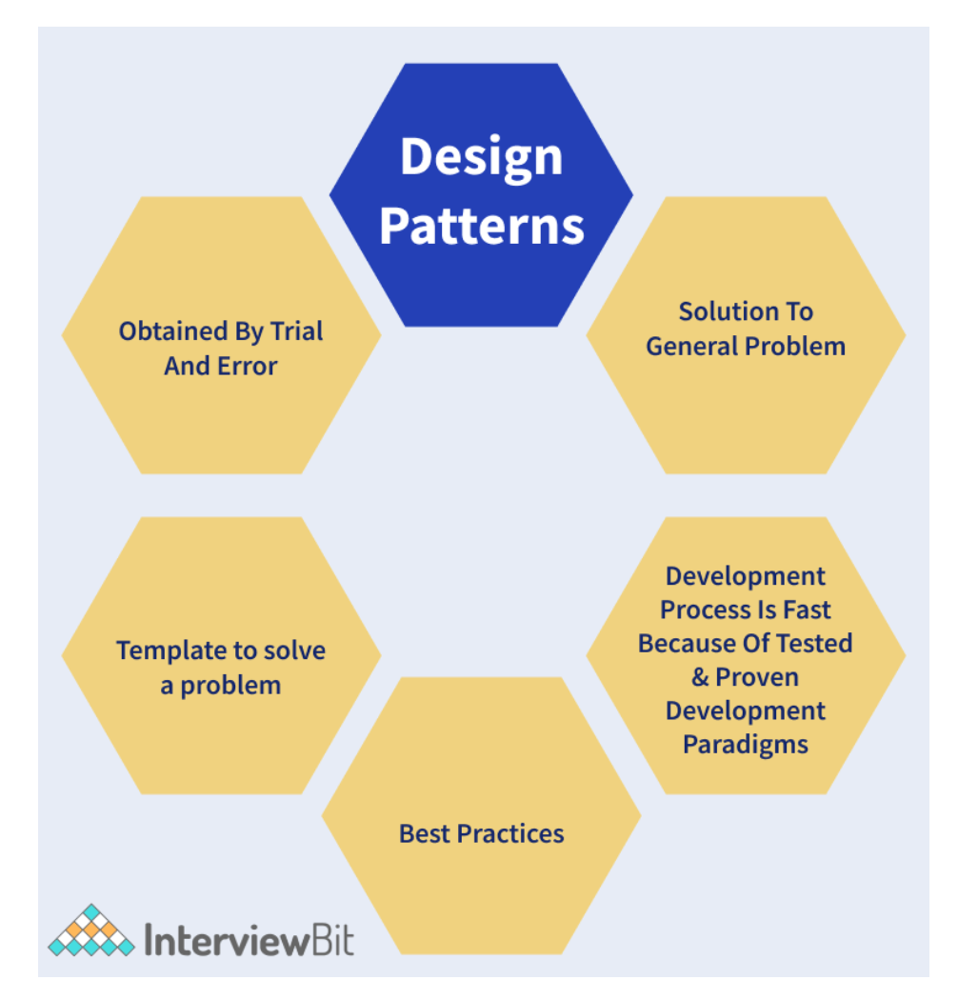

2. What are the advantages of Java Design Patterns?
   + Design patterns are template-based reusable solutions to help developers work effortlessly in multiple projects. In Java, the design patterns are flexible and help to identify unwanted repetitive code easily. The architecture of the software can be customised as per the requirements. Some of the advantages of using design patterns in Java are:
     + They are reusable and can be used in multiple projects.
     + They provide template solutions for defining system architecture.
     + They provide transparency to software design.
     + They are well-tested and proven means of developing robust solutions effortlessly.

3. How can you describe a design pattern?
   + Define a pattern name and what classification of design pattern the pattern would fall to.
   + Define a Problem and what is the corresponding solution
   + What are the variations and language-dependent alternatives for the problem that needs to be addressed?
   + What are the real-time use cases and the efficiency of the software that uses these patterns?

4. What are the types of design patterns in Java?
   + `Creational Patterns`: These patterns provide freedom of choice between creating objects by hiding the logic. The objects constructed are decoupled from the implemented system. Some of the examples of creational patterns are - Factory design pattern, Builder design, Prototype design, Singleton design, Abstract Factory design.
   + `Structural Patterns`: These patterns help in defining how the structures of classes and objects should be like for defining the composition between classes, interfaces and objects. Some of the examples of structural patterns are - Adaptor design, Facade design, Decorator design, proxy design etc.
   + `Behavioural Patterns`: These patterns help to define how the objects should communicate and interact with one another. Some of the examples of behavioural patterns are - Command pattern, Iterator pattern, Observer pattern, Strategy pattern, etc.
   + The following diagram represents the summary of the types of design patterns.
     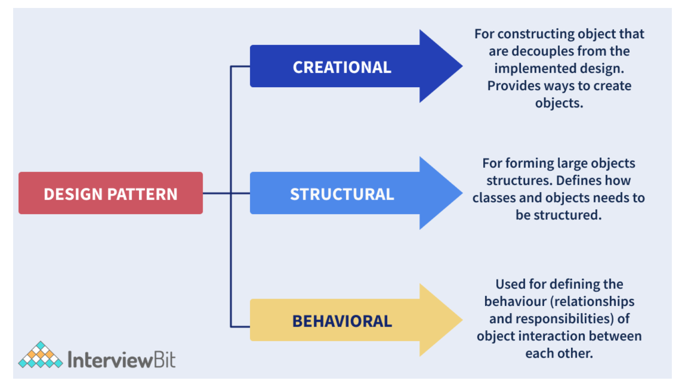

5. What is Inversion of Control?
   + Inversion of control is a pattern used to decouple the dependencies between layers and components in the system. The Dependency-Injection (DI) pattern is an example of an IoC pattern that helps in removing dependencies in the code.
     + Let us understand this with the help of an example. Consider we have a class A that makes use of class B as shown below:
       ```
       public class A{
         private B b;

         public A(){
             this.b = new B();
         }
       }
       ```
     + Here, we have a dependency between classes A and B. If we had the IoC pattern implemented, we would not have used the new operator to assign value to the dependent variable. It would have been something as shown below:
       ```
       public class A {
         private IocB b;
         public A(IocB b) {
             this.b = b;
         }
       }
       ```
       + We have inverted the control of handing the dependency of instantiating the object of class B to the IoC class IocB.

6. What Is Gang of Four (GOF) in Design Patterns?
   + Gang of Four (GOF) are the 4 superheroes who invented the concept of design patterns. These heroes are Erich Gamma, Ralph Johnson, Richard Hel and John Vlissides. These people documented the design patterns in a book called “Design Patterns: Elements of Reusable Object-Oriented Software” in 1995. If not for these people, the software developers would have wasted time-solving problems of recurring nature instead of focussing on business requirements.

7. What are the SOLID Principles?
   + SOLID principles were the Object-Oriented principles introduced by Robert C. Martin in his paperwork “Design Principles and Design patterns” in the year 2000. The acronym for SOLID goes as follows:
     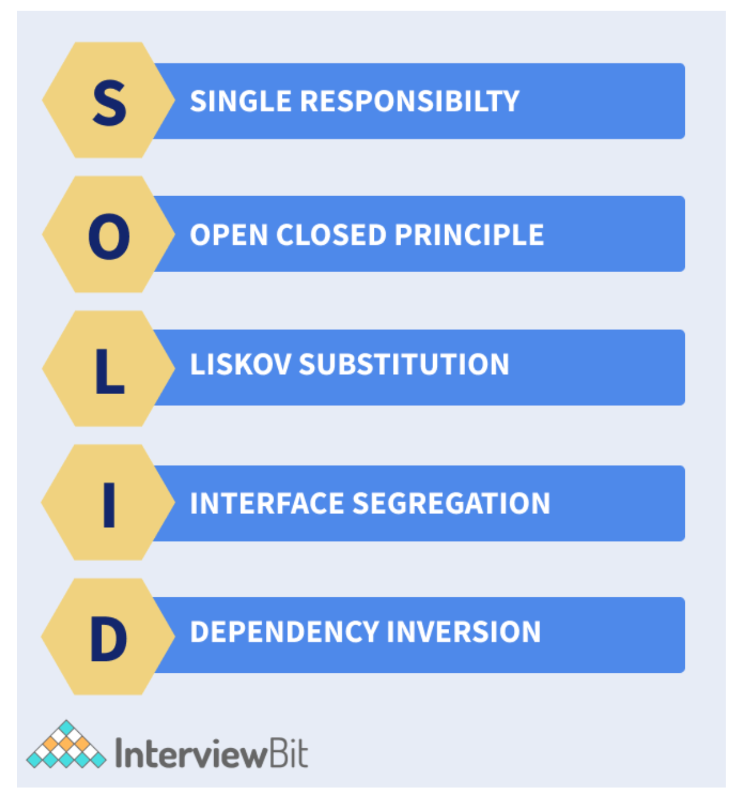
     + `S`: Single Responsibility Principle (SRP): The single responsibility principle ensures that every class or module should be accountable and responsible for only one functionality. There should be one and only one reason for changing any class.
     + `O`: Open Closed Principle (OCP): Every class is open for extension but closed for modification. Here, we are allowed to extend the entities behaviour by not modifying anything in the existing source code.
     + `L`: Liskov Substitution Principle(LSP): LSP principle states that the objects can be replaced by the subtype instances without affecting the correctness of the program.
     + `I`: Interface Segregation Principle (ISP): The ISP principle states that we can use as many interfaces specific to the client’s requirements instead of creating only one general interface. Clients should not be forced to implement the functionalities that they do not require.
     + `D`: Dependency Inversion Principle: Here, the high-level modules should not be dependent on the lower level modules or concrete implementations. Instead, they should be dependent on the abstractions.

8. What do you understand by the Open-Closed Principle (OCP)?
   + The Open close principle states that any class, component or entity should be open for extension but closed for modification. A class can be extended via Inheritance, Interfaces, Composition whenever required instead of modifying the code of the class. Consider an instance where we have a class that calculates the area of a square. Later, we get the requirement of calculating the area of a rectangle. Here, instead of modifying the original class, we can create one base class and this base class can be extended by the new class rectangle.

9.  What are some of the design patterns used in Java’s JDK library?
    + Decorator pattern are used by the Wrapper classes.
    + Singleton pattern is used in classes like Calendar and Runtime.
    + Factory pattern is used for methods like Integer.valueOf methods in wrapper classes.
    + Observer pattern is used for handling event frameworks like awt, swing etc.

10. How are design principles different from design patterns?
    + Design principles are those principles that are followed while designing software systems for any platform by making use of any programming language. SOLID principles are the design principles that we follow as guidelines to develop robust, extensible and scalable software systems. These apply to all aspects of programming.
    + Design Patterns are the reusable template solutions for commonly occurring problems that can be customized as per the problem requirements. These are well-implemented solutions that are tested properly and are safe to use. Factory Design Pattern, Singleton pattern, Strategy patterns are a few of the examples of design patterns.

11. How are design patterns different from algorithms?
    + Both Design Patterns and Algorithms describe typical solutions to any given problem. But the main difference is that the algorithm defines a clear set of actions for achieving a goal and a design pattern provides a high-level description of any solution. Design patterns applied to two different problems might be the same but the logic of implementation would be different and is based on the requirements.

12. What is a Factory Design Pattern?
    + Factory design pattern belongs to the category of Creational Design Patterns. Here, the objects are created without exposing the logic of creation to the client. The objects refer to the common interface.
    + Let’s consider 3 classes Square, Rectangle and Triangle. We will be using factory patterns to create objects of these three classes without exposing the creation logic by making use of ShapeFactory class. The Driver class would be passing the information like RECTANGLE/SQUARE/TRIANGLE for getting the required object. The following UML diagram represents the scenario.
      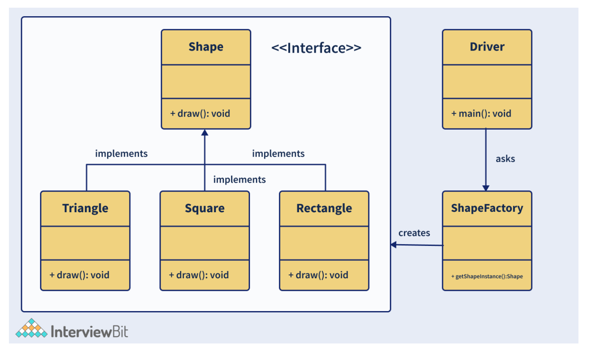
      + Now to implement the factory design pattern for the above example, let us follow the below steps:
        + Step 1: Create a Shape interface.
          ```
          //Shape.java
          public interface Shape {
            void draw();
          }
          ```
        + Step 2: Create concrete classes Rectangle, Square, Triangle that implements the Shape interface.
          ```
          //Rectangle.java
          public class Rectangle implements Shape {
            @Override
            public void draw() {
                System.out.println("Rectangle Drawn");
            }
          }

          //Square.java
          public class Square implements Shape {
            @Override
            public void draw() {
                System.out.println("Square Drawn");
            }
          }

          //Triangle.java
          public class Triangle implements Shape {
            @Override
            public void draw() {
                System.out.println("Triangle Drawn");
            }
          }
          ```
        + Step 3: Create ShapeFactory class and create a method called getShapeInstance() for generating objects of the concrete classes defined above.
          ```
          //ShapeFactory.java
          public class ShapeFactory {
            //the method will be used to get object of required shape
            public Shape getShapeInstance(String type){
                if(type == null){
                  return null;
                }
                if(type.equalsIgnoreCase("TRIANGLE")){
                  return new Triangle();
                } else if(type.equalsIgnoreCase("SQUARE")){
                  return new Square();
                } else if(type.equalsIgnoreCase("RECTANGLE")){
                  return new Rectangle();
                }
                return null;
            }
          }
          ```
        + Step 4: Implement the Driver class and utilise the factory class for getting the object of the required type.
          ```
          //Driver.java
          public class Driver {
            public static void main(String[] args) {
                ShapeFactory shapeFactory = new ShapeFactory();
                //get Triangle object and call draw()
                Shape triangle = shapeFactory.getShape("Triangle");
                triangle.draw();
                //get Rectangle object and call draw()
                Shape rectangle = shapeFactory.getShape("RECTANGLE");
                rectangle.draw();
                //get Square object and call draw()
                Shape square = shapeFactory.getShape("SQUARE");
                square.draw();
            }
          }
          ```
        + Validate the output:
          ```
          Triangle Drawn
          Rectangle Drawn
          Square Drawn
          ```
      + The advantages of a factory design pattern are:
        + This pattern allows hiding the creation logic of the application by using interfaces and factory classes.
        + It lets to test the seamlessness of the application by using mock or stubs.
        + Introduces loose coupling in the application by allowing flexibility in the implementation of methods when new classes are introduced.

13. What is an Adapter Design Pattern?
    + The adapter design pattern falls under the category of a structural design pattern that lets incompatible objects collaborate. It acts as a wrapper between 2 different objects. The adapter catches the call for one object and transforms them to be recognizable by the second object.
    + Let us understand this with the help of an example of a USB to Ethernet adapter that is used when we have an ethernet interface at one end and the USB interface on the other end. The USB and ethernet are incompatible with each other which is why we require an adapter. The adapter class has a Client class that expects some object type and it has an Adaptee class that offers the same feature but by exposing a different interface. Now to make these both communicate, we have an Adapter class. The client requests the Adapter by using the target interface. The Adapter class translates the request using the Adaptee Interface on the adaptee. The Client receives the results unaware of the adapter’s role. This has been described in the class diagram as shown below:
      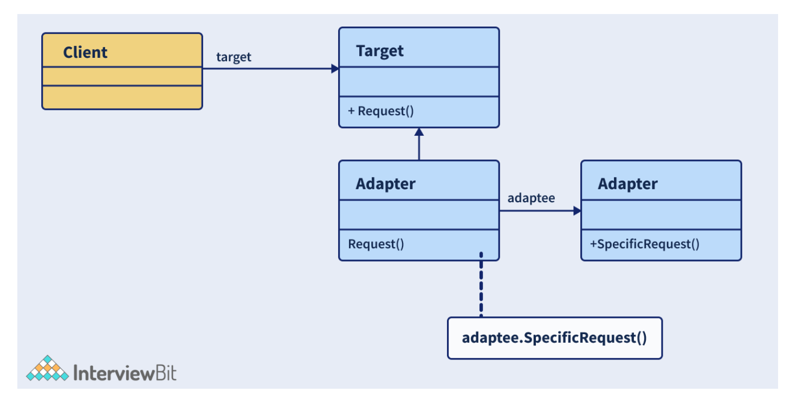
    + Let us consider that we have a MediaPlayer Interface which is implemented by the AudioPlayer class. The AudioPlayer can play mp3 format by default. Consider another interface AdvancedPlayer that is being implemented by MP4Player class that plays mp4 formats and WAVPlayer that plays wav formats. If we want to make AudioPlayer class play other formats, then we make use of the MediaAdapter class that implements the MediaPlayer Interface and uses the AdvancedPlayer objects for playing the required format. The code implementation of this scenario is as follows:
      ```
      // MediaPlayer.java
      public interface MediaPlayer {
        public void play(String format, String file);
      }

      //AdvancedPlayer.java
      public interface AdvancedPlayer {
        public void playMp4(String file);
        public void playWav(String file);
      }

      //Mp4Player.java
      public class Mp4Player implements AdvancedPlayer{
        @Override
        public void playMp4(String file) {
          System.out.println("MP4 File "+ file + " Playing....");
        }

        @Override
        public void playWav(String file) {
          //do nothing
        }
      }

      //WAVPlayer.java
      public class WAVPlayer implements AdvancedPlayer{
        @Override
        public void playMp4(String file) {
          //do nothing
        }

        @Override
        public void playWav(String file) {
          System.out.println("WAV File "+ file + " Playing....");
        }
      }

      //MediaAdapter.java
      public class MediaAdapter implements MediaPlayer {
        AdvancedPlayer advancedPlayer;
        public MediaAdapter(String format){
          if(format.equalsIgnoreCase("mp4") ){
              advancedPlayer = new Mp4Player();
          }else if(format.equalsIgnoreCase("wav") ){
              advancedPlayer = new WAVPlayer();
          }
        }
        @Override
        public void play(String format, String file) {

          if(format.equalsIgnoreCase("mp4")){
              advancedPlayer.playMp4(file);
          }
          else if(format.equalsIgnoreCase("wav")){
              advancedPlayer.playWav(file);
          }
        }
      }

      //AudioPlayer.java
      public class AudioPlayer implements MediaPlayer {
        MediaAdapter mediaAdapter;
        @Override
        public void play(String format, String file) {
          //inbuilt support to play mp3 music files
          if(format.equalsIgnoreCase("mp3")){
              System.out.println("MP3 file " + file +" Playing...");
          }
          //Make use of Adapter to support different formats
          else if(format.equalsIgnoreCase("wav") || format.equalsIgnoreCase("mp4")){
              mediaAdapter = new MediaAdapter(format);
              mediaAdapter.play(format, file);
          }
          else{
              System.out.println("Format not supported");
          }
        }
      }

      //Driver.java
      public class Driver {
        public static void main(String[] args) {
          AudioPlayer audioPlayer = new AudioPlayer();
          audioPlayer.play("mp3", "music1.mp3");
          audioPlayer.play("wav", "music2.wav");
          audioPlayer.play("mp4", "music3.mp4");
          audioPlayer.play("avi", "music4.avi");
        }
      }

      // Output
      MP3 file music1.mp3 Playing...
      WAV File music2.wav Playing...
      MP4 File music3.mp4 Playing...
      Format not supported
      ```

14. What is a Proxy Design Pattern?
    + Proxy design pattern falls under the category of structural design that represents the functionality of other classes. This pattern lets the developers provide a substitute for another object. This is called a proxy object. This helps to control the access to the original object and allows us to perform many tasks before or after the request reaches the original object.
      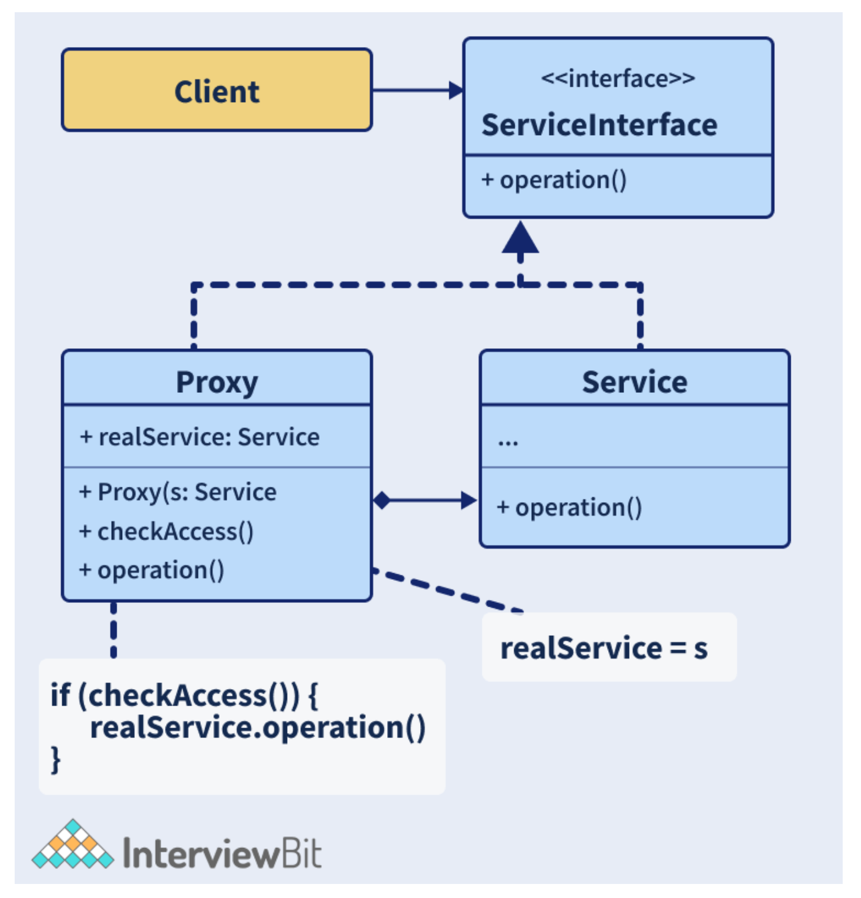
        + As shown in the figure above, in this pattern, we have a ServiceInterface interface that has some operation. This interface is being implemented by a Service class and a Proxy class. The Service class has useful business logic and the Proxy class has a reference field pointing to the service object. Once the proxy finishes processing lazy initialization, logging, caching etc, the request will be passed to the service object. And finally, we have a client that works with the services and the proxies by using the interface. This helps to pass proxy objects to any piece of code.

15. What is a Bridge Design Pattern?
    + The bridge pattern is a type of structural design pattern that lets to split large class or closely related classes into 2 hierarchies - abstraction and implementation. These hierarchies are independent of each other and are used whenever we need to decouple an abstraction from implementation. This is called a Bridge pattern because it acts as a bridge between the abstract class and the implementation class. In this pattern, the abstract classes and the implementation classes can be altered or modified independently without affecting the other one.
      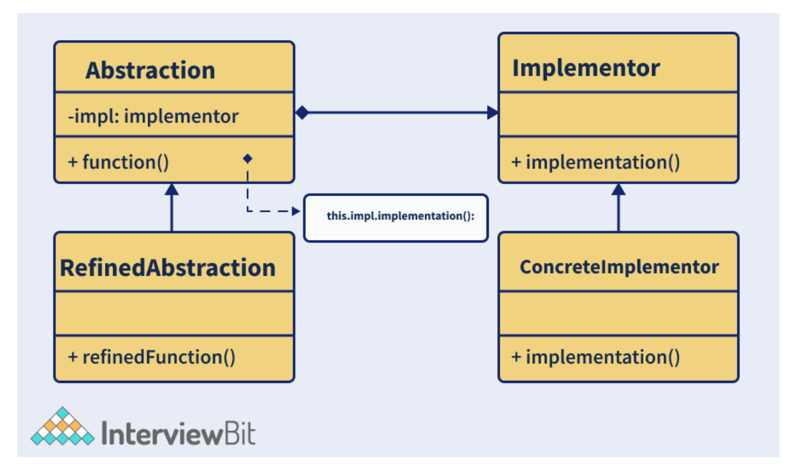
      + The above image is the UML representation of the Bridge Pattern. There are 4 main elements of Bridge Pattern. They are:
        + `Abstraction`: This is the core of the pattern and it defines its crux. This contains a reference to the implementer.
        + `Refined Abstraction`: This extends the abstraction and takes refined details of the requirements and hides it from the implementors.
        + `Implementer`: This is the interface for the implementation classes.
        + `Concrete Implementation`: These are the concrete implementation classes that implement the Implementer interface.

16. What are some instances where we prefer abstract classes over interfaces in Java?
    + Both Abstract classes and interfaces in Java follow the principle of writing code for interface rather than the implementation. This principle ensures that flexibility is added to the code to tackle dynamic requirements. Some of the pointers for deciding what to prefer over what are as follows:
      + Java lets to extend only one class and let’s implement multiple interfaces. If we extend one class then we cannot extend other classes. In such cases, it is better to implement the interfaces wherever possible and reserve the inheritance of classes to only important ones.
      + Interfaces are used for representing the behaviour of the class. Java lets to implement multiple interfaces which is why we can take the help of interfaces to help classes have multiple behaviours at the same time.
      + Abstract classes are slightly faster than interfaces. It can be used for time-critical applications.
      + In cases where there are common behaviours across the inheritance hierarchy, these can be coded at one place in abstract classes. Interfaces and abstract classes can also be used together to define a function in interface and functionality in abstract class.

17. What is a Chain of Responsibility pattern? In what scenarios to apply this pattern?
    + Chain of Responsibility belongs to the category of a behavioural design pattern that passes requests via a chain of handlers. Whenever a request is received, the handler decides whether to process the request or pass it to the next handler of the chain. It is used for achieving loose coupling where the client request is passed through an object chain to process them.
      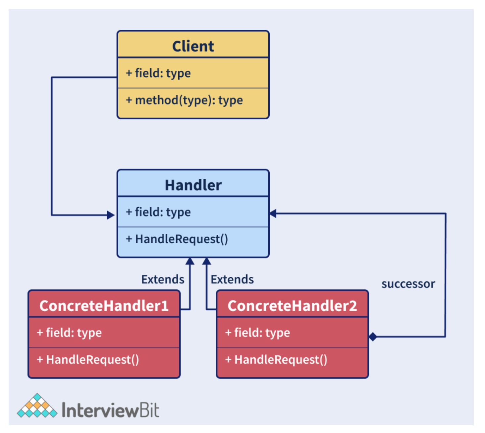
      + The above image represents the UML diagram of this pattern. There are 3 components of this design, they are:
        + `Client`: This is the point of request origination and the component that accesses the handler for handling the request.
        + `Handler`: Handler can either be a class or an interface that received the request primarily and dispatches it to the chain of handlers. This Handler knows only the first handler of the chain.
        + `Concrete Handlers`: These are the actual request handlers in sequential order.
      + This pattern can be used in the following cases:
        + Whenever we want to decouple the sender and the receiver of the request.
        + Whenever we want multiple objects to handle a request at runtime.
        + Whenever we do not want to explicitly specify handlers in the code.
        + Whenever we want to issue a request to several objects without explicitly specifying handlers.

18. What is Decorator Design Pattern?
    + Decorator design pattern belongs to the category of structural pattern that lets users add new features to an existing object without modifying the structure. This pattern creates a class called decorator class that acts as a wrapper to the existing class by keeping the signatures of class methods intact. This pattern makes use of abstract classes and interfaces with composition for implementing the wrapper. They are mostly used to apply SRP (Single Responsibility Principle) as we divide functionalities into classes with unique concerns. This pattern is structurally similar to the chain of responsibility pattern. Following are the steps to implement decorator design pattern:
      + Create an interface and concrete classes that implement this interface.
      + Create an abstract decorator class that implements the above interface.
      + Create a concrete decorator class that extends the above abstract class.
      + Use the concrete decorator class to decorate the interface objects and verify the output.
    + Let us understand this with the help of an example. Here, we will be creating a Shape Interface and concrete classes- Rectangle and Triangle that implement this Shape interface. We will be creating an abstract decorator class “ShapeDecorator” that implements the Shape interface. We will create RedColorDecorator that extends ShapeDecorator. We will be then using this decorator to implement the functionalities.
      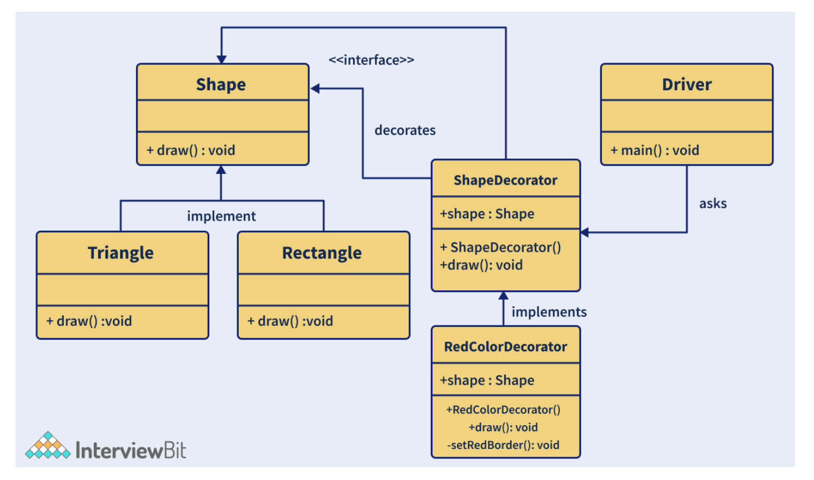
      + Creating “Shape” Interface:
        ```
        // Shape.java
        public interface Shape {
            void draw();
        }
        ```
      + Create concrete classes Rectangle.java and Triangle.java that implement Shape Interface.
        ```
        // Rectangle.java
        public class Rectangle implements Shape {
            // Overriding the draw method
            @Override public void draw()
            {
                System.out.println("Rectangle Drawn...");
            }
        }

        // Triangle.java
        public class Triangle implements Shape {
            // Overriding the draw method
            @Override public void draw()
            {
                System.out.println("Triangle Drawn...");
            }
        }
        ```
      + Create ShapeDecorator abstract class that implements the Shape interface.
        ```
        // ShapeDecorator.java
        public abstract class ShapeDecorator implements Shape {
            protected Shape shapeDecorated;
            public ShapeDecorator(Shape shapeDecorated)
            {
                this.shapeDecorated = shapeDecorated;
            }
            public void draw() {
                shapeDecorated.draw();
            }
        }
        ```
      + Create the RedColorDecorator.java class that extends the ShapeDecorator class.
        ```
        public class RedColorDecorator extends ShapeDecorator {
            public RedColorDecorator(Shape shapeDecorated)
            {
                super(shapeDecorated);
            }
            @Override
            public void draw()
            {
                shapeDecorated.draw();
                setRedBorder(shapeDecorated);
            }
            private void setRedBorder(Shape shapeDecorated)
            {
                System.out.println("Red color border added...");
            }
        }
        ```
      + Implement the Driver class to demo the decorator class.
        ```
        // Driver.java
        public class Driver {
            // Main driver method
            public static void main(String[] args)
            {

              Shape triangle = new Triangle();
              Shape redTriangle
                  = new RedColorDecorator(new Triangle());
              Shape redRectangle = new RedColorDecorator(new Rectangle());
              // Draw normal triangle
              triangle.draw();
              System.out.println(".........");
              // make the triangle red
              redTriangle.draw();
              System.out.println(".........");
              // make the rectangle red
              redRectangle.draw();
              System.out.println(".........");
            }
        }
        ```
      + Validate the output. The output of the above code would be:
        ```
        Triangle Drawn...
        .........
        Triangle Drawn...
        Red color border added...
        .........
        Rectangle Drawn...
        Red color border added...
        .........
        ```

19. What is a Command pattern?
    + The command pattern is a type of behavioural design pattern that transforms a request into a stand-alone object containing all the details about the request. This pattern is a data-driven pattern because we make use of the information about the request by wrapping it as an object and is passed to the invoker object as a command. The invoker object checks for the object that can handle the command and passes it to that object to execute the command. The following diagram is the UML diagram that represents the command design pattern.
      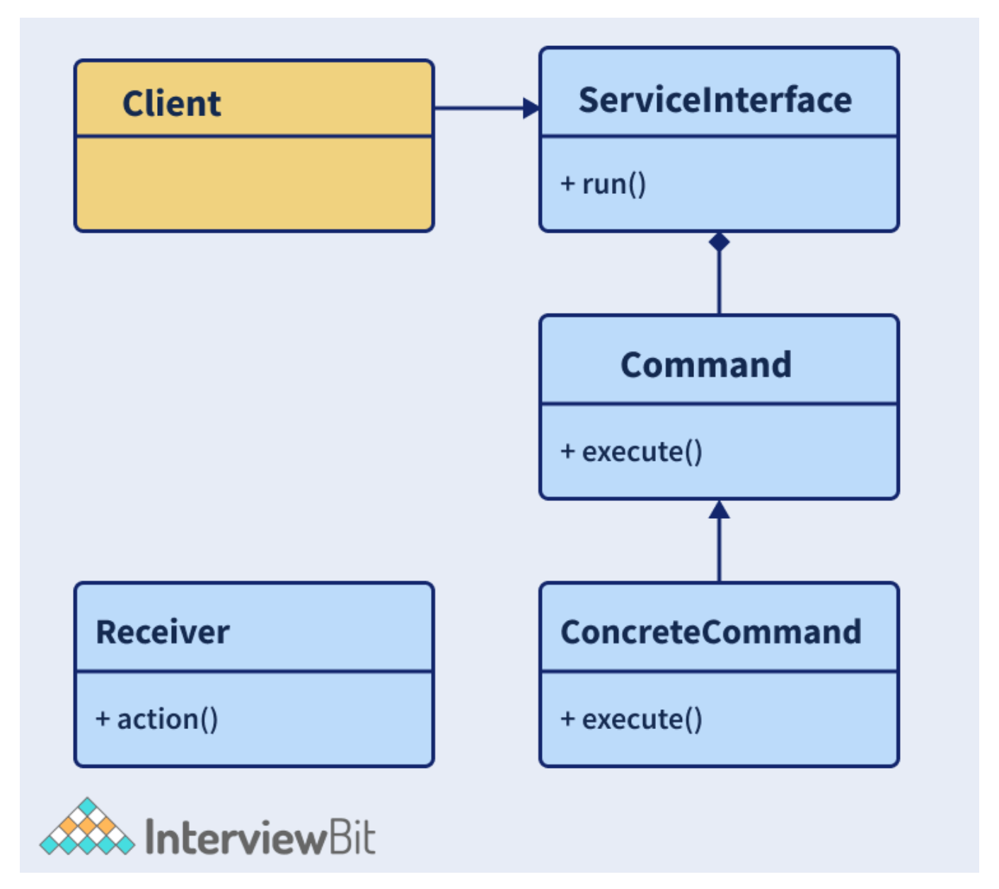
      + We have a client that calls the invoker to run a command. We have a Command interface that acts as an abstraction to the underlying concrete classes. Let us understand this with the help of an example of remote control that has only one button. Using this button, we will be controlling the behaviour of two objects tubelight and a radio. The command to control the objects will be implemented using the command design pattern.
        + Create Command interface:
          ```
          // Command Interface
          interface Command
          {
              public void execute();
          }
          ```
        + Create Tubelight class and its command classes that extend the above interface to control the tubelight.
          ```
          // Tubelight class
          class TubeLight
          {
              public void lightOn(){
                  System.out.println("TubeLight on...");
              }
              public void lightOff(){
                  System.out.println("TubeLight off...");
              }
          }

          // Command class to turn on the tubelight
          class TubeLightOnCommand implements Command
          {
              TubeLight tubeLight;
              // The constructor is passed the light it
              // is going to control.
              public TubeLightOnCommand(TubeLight tubeLight){
                this.tubeLight = tubeLight;
              }
              public void execute(){
                tubeLight.lightOn();
              }
          }

          // Command class to turn off the tubelight
          class TubeLightOffCommand implements Command
          {
              TubeLight tubeLight;
              public TubeLightOffCommand(TubeLight tubeLight) {
                  this.tubeLight = tubeLight;
              }
              public void execute() {
                  tubeLight.lightOff();
              }
          }
          ```
        + Create a Radio class and its command classes that extend the above interface to control the radio.
          ```
          // Radio class
          class Radio
          {
              public void radioOn()
              {
                  System.out.println("Radio on ...");
              }
              public void radioOff()
              {
                  System.out.println("Radio off...");
              }
              public void setVolume(int volumeLevel)
              {
                // code to set the volume
                System.out.println("Radio volume set to " + volumeLevel);
              }
          }

          // Command class to turn on the radio
          class RadioOnCommand implements Command
          {
              Radio radio;
              public RadioOnCommand(Radio radio)
              {
                  this.radio = radio;
              }
              public void execute()
              {
                radio.radioOn();
              }
          }

          // Command class to set the volume of the radio
          class RadioVolumeCommand implements Command
          {
              Radio radio;
              int volumeLevel;
              public RadioVolumeCommand(Radio radio, int volumeLevel)
              {
                  this.radio = radio;
                  this.volumeLevel=volumeLevel;
              }
              public void execute()
              {
                radio.setVolume(volumeLevel);
              }
          }
          ```
        + Create a remote control class that has only one button and on click of the button, execute the command functionality:
          ```
          // remote control with one button
          class RemoteControl{
              Command button; // only one button
              public RemoteControl(){}
              public void setCommand(Command command){
                  // set the command the remote will
                  // execute
                  button = command;
              }
              public void pressButton(){
                // execute the command on click (call) of the button
                  button.execute();
              }
          }
          ```
        + Create a Driver class to implement the pattern. Here we will be first turning on the tubelight on the first click of the button, on next click, we will be turning on the radio, then we will be setting the volume of the radio to 4 and then we will be turning off the tubelight.
          ```
          // Driver class
          public class Driver
          {
              public static void main(String[] args)
              {
                      RemoteControl remote = new RemoteControl();
                      TubeLight tubeLight = new TubeLight();
                      Radio radio = new Radio();
                      // Turn on Tubelight
                      remote.setCommand(new TubeLightOnCommand(tubeLight));
                      remote.pressButton();
                      //Turn on Radio
                      remote.setCommand(new RadioOnCommand(radio));
                      remote.pressButton();
                      //Turn off Radio
                      remote.setCommand(new RadioVolumeCommand(radio,4));
                      remote.pressButton();
                      // Turn off Tubelight
                      remote.setCommand(new TubeLightOffCommand(tubeLight));
                      remote.pressButton();
              }
          }
          ```
        + Validate the result of this pattern to see if it’s working fine. The result of this code would be:
          ```
          TubeLight on...
          Radio on ...
          Radio volume set to 4
          TubeLight off...
          ```

20. What is an Observer Design Pattern?
    + An observer design pattern is a type of behavioural design pattern that is used for defining the one to many dependencies between the objects. It is most useful when we want to get notified about any change in the state of an object. In this pattern, when the state of one object changes, all the dependent objects are notified automatically. The object whose state is monitored is called the Subject whereas the dependents are called the Observers. In Java, we can implement this pattern by making use of the java.util.Observable class and the java.util.Observer interface. The following UML diagram represents the observer design pattern clearly:
      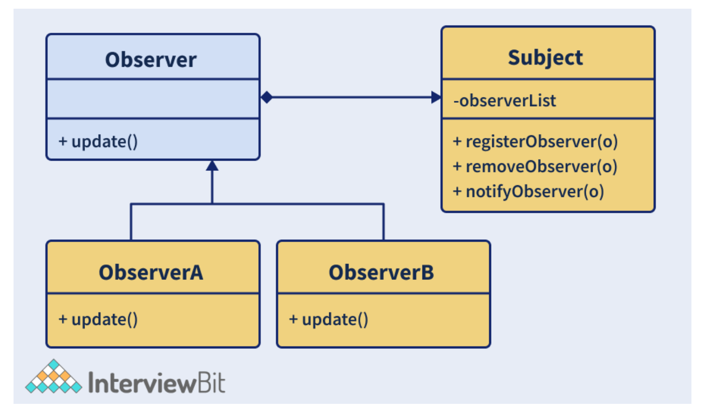
    + This design pattern has 3 main components:
      + `Subject`: This can be an interface or an abstract class that defines operations for attaching (registerObserver()) and detaching the observers (removeObserver()) to the subject.
      + `Concrete Subject`: This is a concrete class of the Subject. This maintains the object state and whenever any change occurs in that state, the observers are notified about it using notifyObservers() method.
      + `Observer`: This is an interface or an abstract class that defines the operations for notifying this object (update()). One real work example of this pattern is Facebook or Twitter. Whenever a person updates the status, all the followers would get a notification about his update. An observer can get the notification of the subject as long as it is subscribed or keeping track of it.

21. What problem does Builder Pattern try to solve?
    + A builder pattern is a type of creational design pattern that lets to construct complex objects in a step by step manner. The pattern lets to produce different representations of an object using the same construction logic. It helps in creating immutable classes having a large set of attributes. In the Factory and Abstract Factory Design Patterns, we encounter the following issues if the object contains a lot of attributes:
      + When the arguments are too many, the program will be error-prone while passing from the client to the Factory Class in a specific order. It becomes tedious to maintain the order of arguments when the types are the same.
      + There might be some optional attributes of the object and yet we would be forced to send all parameters and optional attributes as Null.
      + When the object creation becomes complex due to heavy attributes, the complexity of this class would become confusing.
    + The above problems can also be solved by using constructors of required parameters alone. But this causes an issue when there would be new parameters that are added as part of new requirements. This would result in inconsistency. That’s where Builder comes into the picture. This pattern solves the issue of a large number of optional attributes and the inconsistent state by providing means to build an object in a step-by-step way and return the final object utilizing another method.
    + Builder pattern can be implemented by following the below steps:
      + Create a static nested class, copy all arguments from the outer class. This nested class would be called the Builder class.
      + Proper naming convention has to be followed while naming this builder class. For example, if the name of the class is Interviewbit, then the name of the builder would be InterviewbitBuilder.
      + The builder class should have a public constructor with all required attributes sent as parameters.
      + The builder class should have methods for setting optional parameters and return the same builder object post setting these values.
      + The last step is to have a build() method inside the builder class that returns the Object needed by the client. This would require a private constructor in the class that takes the Builder class as the parameter.
    + Following is the sample example of the builder pattern implementation. We have a User class and we will be building UserBuilder class to build the objects of the User class.
      ```
      class User
      {
        //All final attributes
        private final String firstName; // required
        private final String lastName; // required
        private final int age; // required
        private final String phoneNbr; // optional
        private final String address; // optional
        private final String nationality; //optional

        private User(UserBuilder builder) {
            this.firstName = builder.firstName;
            this.lastName = builder.lastName;
            this.age = builder.age;
            this.phoneNbr = builder.phoneNbr;
            this.address = builder.address;
            this.nationality = builder.nationality;
        }

        //Setters are not provided to make it immutable
        public String getFirstName() {
            return firstName;
        }
        public String getLastName() {
            return lastName;
        }
        public int getAge() {
            return age;
        }
        public String getPhoneNbr() {
            return phoneNbr;
        }
        public String getAddress() {
            return address;
        }
        public String getNationality() {
            return nationality;
        }

        @Override
        public String toString() {
            return "User: "+this.firstName+" "+this.lastName+", "+this.age+", "+this.nationality+", "+this.phoneNbr+", "+this.address;
        }

        public static class UserBuilder
        {
            private final String firstName;
            private final String lastName;
            private int age;
            private String phoneNbr;
            private String address;
            private String nationality;

            public UserBuilder(String firstName, String lastName) {
                this.firstName = firstName;
                this.lastName = lastName;
            }
            public UserBuilder age(int age) {
                this.age = age;
                return this;
            }
            public UserBuilder phoneNbr(String phoneNbr) {
                this.phoneNbr = phoneNbr;
                return this;
            }
            public UserBuilder address(String address) {
                this.address = address;
                return this;
            }
            public UserBuilder nationality(String nationality) {
                this.nationality = nationality;
                return this;
            }
            // method to return the constructed object
            public User build() {
                User user =  new User(this);
                validateUserObject(user);
                return user;
            }
            private void validateUserObject(User user) {
                //Validate of the object does not break anything
            }
        }
      }

      public class Driver{
        public static void main(String[] args) {
            User firstUser = new User.UserBuilder("Harry", "Potter")
            .age(30)
            .phoneNbr("1234567")
            .address("221B Baker Street - London")
            .build();

            System.out.println(firstUser);

            User secondUser = new User.UserBuilder("Ron", "Weasley")
            .age(32)
            .phoneNbr("5655")
            //no address
            .build();

            System.out.println(secondUser);

            User thirdUser = new User.UserBuilder("Hermoine", "Granger").age(20).nationality("English")
            //No age
            //No phone
            //no address
            .build();

            System.out.println(thirdUser);
        }
      }
      ```
      + Output:
        ```
        User: Harry Potter, 30, null, 1234567, 221B Baker Street - London
        User: Ron Weasley, 32, null, 5655, null
        User: Hermoine Granger, 20, English, null, null
        ```

22. Consider a scenario where you are writing classes for providing market data and we have the flexibility to switch to different vendors or we can be directed to the Direct Exchange Feed. How will you approach this problem to design the system?
    + We can do this by having an interface called “MarketData” which will consist of the methods required by the Client. The MarketData should have the MarketDataProvider as the dependency by employing Dependency Injection. This ensures that even if the provider changes, the market data will not be impacted.

23. What do you understand by the Null Object pattern?
    + In this pattern, a null object is used for replacing the check of validating if the object instance is null or not. This Null Object has a “do nothing” relationship and these can be used for providing default behaviour if the data is unavailable.

24. What is the MVC design pattern?
    + MVC stands for Model-View-Controller. This pattern is used for separating the application’s concerns as listed below:
      + `Model`: This represents the object (Java POJO) that carries the data. It can also consist of the logic of updating the controller in case the data changes.
      + `View`: This represents the data visualization of the model.
      + `Controller`: This is an interface between the Model and the View by controlling the flow of data into the model and updating the view whenever the model gets updated. This ensures that the model and the views are kept separate.
      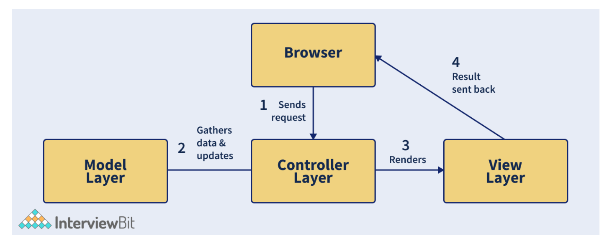
        + The above image represents how the request flow happens in the MVC Pattern. First, the Browser (client) sends request for a page to the controller of the server. The controller invokes the model, retrieves the data and sends the response. The response is then sent to the view for rendering. The view will be rendered and it is sent back to the client for display.

25. What are the components of the Composite Entity pattern?
    + This pattern is used in EJB (Enterprise Java Beans) persistence mechanism. A composite entity represents the object graph and is an EJB entity. Whenever a composite entity is updated, the object beans that are internally dependent on this bean are updated automatically. There are 4 main components of the Composite Entity Pattern:
      + `Composite Entity`: Primary entity bean that can have a coarse-grained object that is meant for persistence.
      + `Coarse-Grained Object`: This contains the dependent objects which have their life cycle and in turn manages the lifecycle of dependent objects.
      + `Dependent Object`: This object is dependent on the coarse-grained object throughout the persistence lifecycle.
      + `Strategies`: These represent how to implement the composite entity.

26. What is the main advantage of using a prototype design pattern over object creation using a new keyword?
    + Prototype design pattern is used for creating duplicate objects based on the prototype of the already existing object using cloning. Doing this has a positive impact on the performance of object creation. Creating objects using the new keyword requires a lot of resources and is a heavyweight process that impacts performance. Hence, the prototype design pattern is more advantageous than the object created using a new keyword.

27. How can you achieve thread-safe singleton patterns in Java?
    + A thread-safe singleton class is created which helps in object initialization in the presence of multiple threads. It can be done using multiple ways:
      + `Using Enums`: Enums are the simplest means of creating a thread-safe singleton class in Java because the synchronization support is inherently done by Java itself. Enums are by default final and this also helps in preventing multiple initializations at the time of serialization.
        ```
        public enum ThreadSafeSingleton{
          SINGLETON_INSTANCE;
          public void display(){
              System.out.println("Thread-safe singleton Display");
          }
        }
        // The Singleton class methods can be invoked as below
        ThreadSafeSingleton.SINGLETON_INSTANCE.show();
        ```
      + `Using Static Field Initialization`: Thread-safe singleton can also be created by creating the instance at the time of class loading. This is achieved by making use of static fields as the Classloader guarantees that the instances are initialized during class loading and the instance is not visible until that has been fully created.
        ```
        public class ThreadSafeSingleton{
          private static final ThreadSafeSingleton INSTANCE = new ThreadSafeSingleton();
          private ThreadSafeSingleton(){ }
          public static ThreadSafeSingleton getInstance(){
              return INSTANCE;
          }
          public void display(){
              System.out.println("Thread-safe Singleon");
          }
        }
        ThreadSafeSingleton.getInstance().display();
        ```
        + But the disadvantage of this way is that the initialization cannot be done lazily and the getInstance() method is called even before any client can call.
      + `Using synchronized keyword`: We can make use of the synchronized keyword upon the getInstance method as shown below:
        + In this method, we can achieve lazy initialization, and also since we use synchronized keywords, the object initialization is thread-safe.
        + The only problem is that since the whole method is synchronized, the performance is impacted in the presence of multiple threads.
        ```
        public class ThreadSafeSingleton
        {
        // Creating private instance to make it accessible only by getInstance() method
        private static ThreadSafeSingleton instance;
        private ThreadSafeSingleton()
        {
          // Making constructor private so that objects cant be initialized outside the class
        }
        //synchronized getInstance method
        synchronized public static ThreadSafeSingleton getInstance(){
          if (this.instance == null)
          {
            // if instance is null, initialize
            this.instance = new ThreadSafeSingleton();
          }
          return this.instance;
        }
        }
        ```
      + `Double-check locking`: Here, we will be using a synchronized block of code within the getInstance method instead of making the whole method synchronized. This ensures that only a handful of threads have to wait only for the first time thereby not impacting the performance.
        ```
        public class ThreadSafeSingleton {
        // Creating private instance to make it accessible only by getInstance() method
        private static ThreadSafeSingleton instance;
        private ThreadSafeSingleton(){
          // Making constructor private so that objects cant be initialized outside the class
        }
        public static ThreadSafeSingleton getInstance(){
          if (instance == null){
            //synchronized block of code
            synchronized (ThreadSafeSingleton.class){
              if(instance==null)
              {
                // initialize only if instance is null
                instance = new ThreadSafeSingleton();
              }
            }
          }
          return instance;
        }
        }
        ```

28. What would happen if we do not have a synchronized method for returning Singleton instance in a multi-threaded environment?
    + In a multi-threaded environment, if we have a non-synchronized method for returning instances, there are chances that the method can create more than one instance. Consider that we have 2 threads and both enter the condition for checking if the instance already exists. Both threads will find that the instance has not been created and hence both will create the class instances. This goes against the principle of the Singleton pattern. Hence, in a multi-threaded environment, it is recommended to use synchronized checks.

29. Write a Java Program to display the pyramid as per the below design.
    ```
        *
       * *
      * * *
     * * * *
    * * * * *
    ```
    + This can be achieved by using nested loops and calculatingly adding spaces and stars as shown in the logic below:
      ```
      public class InterviewBitPyramid{
        public static void printPyramid(int n) {
            for (int i=0; i<n; i++){  // for number of rows
                for (int j=n-i; j>1; j--) {
                    System.out.print(" "); //print space
                }
                //for number of columns
                for (int j=0; j<=i; j++ ) {
                    System.out.print("* "); // print star
                }
                //end-line after every row
                System.out.println();
            }
        }

        public static void main(String args[]){
            printPyramid(5); //Print Pyramid stars of 5 rows
        }
      }
      ```

30. Write a Java Program to display the left triangle star pattern on the system console.
    + This can be again be achieved by using nested loops and calculatingly adding spaces and stars as shown in the logic below:
      ```
      public class InterviewBitLeftPyramid{
        public static void printLeftTriangleStars(int n) {
            int j;
            for(int i=0; i<n; i++){  // outer loop for number of rows(n)
                for(j=2*(n-i); j>=0; j--){   // for spaces
                    System.out.print(" "); // to print space
                }
                for(j=0; j<=i; j++){ // for columns
                    System.out.print("* "); // Print star and give space
                }
                System.out.println(); // Go to next line after every row
            }
        }
        public static void main(String args[]){
            printLeftTriangleStars(5); //print stars of 5 rows in left triangle fashion
        }
      }
      ```
      + Output:
        ```
                *
              * *
            * * *
          * * * *
        * * * * *
        ```

31. Write a Java program to print Diamond Number Pattern.
    ```
    public class InterviewBitDiamondNumber{
      public static void diamondNumberDisplay(int maxNum){
        for (int i = 1; i <= maxNum; i++){
              int n = maxNum;
              for (int j = 1; j<= n - i; j++) {
                  System.out.print(" ");
              }
              for (int k = i; k >= 1; k--) {
                  System.out.print(k);
              }
              for (int l = 2; l <= i; l++) {
                  System.out.print(l);
              }
              System.out.println();
          }
          for (int i = maxNum-1; i >= 1; i--){
              int n = maxNum-1;
              for (int j = 0; j<= n - i; j++) {
                  System.out.print(" ");
              }
              for (int k = i; k >= 1; k--){
                  System.out.print(k);
              }
              for (int l = 2; l <= i; l++){
                  System.out.print(l);
              }
              System.out.println();
          }
      }
      public static void main(String[] args) {
        int n = 5;
        diamondNumberDisplay(n);

      }
    }
    ```
    + Output:
      ```
           1
          212
         32123
        4321234
       543212345
        4321234
         32123
          212
           1
      ```

32. Write a Java program that takes a String as an input and prints the pattern in the increasing order of odd numbers as shown in the example below.
    ```
    If String input is PATTERN, then the pattern will be:
          P        (First Character Once)
        AAA       (Second Character thrice)
        TTTTT      (Third Character 5 times)
      TTTTTTT            :
      EEEEEEEEE          :
    RRRRRRRRRRR          :
    NNNNNNNNNNNNN        :
    ```
    + Solution
      ```
      import java.util.Scanner;
      public class InterviewBitStringPattern{
        public static void printStringPattern(String input){
          for (int i = 1; i <= input.length(); i++) {
                for (int j = input.length(); j > i; j--){
                  System.out.print(" ");
                }
                for (int k = i * 2 - 1; k >= 1; k--){
                  System.out.print(input.charAt(i - 1));
                }
                System.out.println("");
            }
        }
        public static void main(String[] args) {
            // to create a new Scanner object
            Scanner scanner = new Scanner(System.in);
            // to get the String from the user
            System.out.println("Enter Input String: ");
            String input = scanner.nextLine();
            System.out.println("Printing Pattern.....");
            printStringPattern(input);
        }
      }
      ```
      + Output:
        ```
        Enter Input String:
        PATTERN
        Printing Pattern.....
            P
            AAA
          TTTTT
          TTTTTTT
        EEEEEEEEE
        RRRRRRRRRRR
        NNNNNNNNNNNNN
        ```

33. Write a Java program to print Pascal’s Triangle Pattern.
    ```
    public class Main {
      public static void printPascalsTriangle(int n){
          for (int i = 0; i < n; i++) {
                int number = 1;
                System.out.printf("%" + (n - i) * 2 + "s", "");
                for (int j = 0; j <= i; j++) {
                    System.out.printf("%4d", number);
                    number = number * (i - j) / (j + 1);
                }
                System.out.println();
            }
      }
      public static void main(String[] args) {
          int n = 8;
          printPascalsTriangle(n);
      }
    }
    ```
    + Output:
      ```
                    1
                  1   1
                1   2   1
              1   3   3   1
            1   4   6   4   1
          1   5  10  10   5   1
        1   6  15  20  15   6   1
      1   7  21  35  35  21   7   1
      ```
