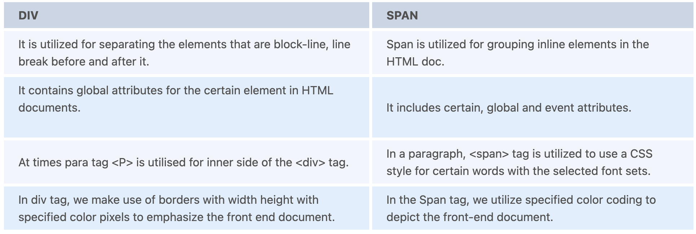

# Front End Interview Questions
1. What are meta tags in HTML?
   + Meta tags are those tags which go inside the Head tag of the HTML page
   + Meta tags are not for the interface they are important for the browser.
   + Meta Tags are always in name or value pairs.
   + Meta tags consist of character encoding, title, or even description.

2. What are some basic design elements?
   + Line - a line mark made with any pen or brush or even any edge created when two shape meets
   + Size - it is the area occupied by one shape with the other
   + Texture- the surface of the shape - Smooth, soft, hard, glossy, and such
   + Color - The light reflected from the objects. The three characteristics of color are hue, value, and the intensity.

3. What is load balancing?
   + Load balancing is distribution of all the incoming network traffic all across the backend servers.

4. What npm stands for?
   + Npm stands for Node Package Manager.

5. What is scope in JavaScript?
   + In JavaScript every function has its own scope. It is basically a collection of rules for how variables are accessed and variables itself.

6. How are JavaScript and jQuery different?
   + JQuery is a library built with the JavaScript language, and JavaScript is the language itself.

7. What is Content Security Policy (CSP)?
   + Content security Policy also known as CSP, is a header in HTML which lets the soite operators  gain the whole control over the resources which are loading on the site.

8. What is Cross-Site Scripting (XSS)?
   + XSS, Cross-Site Scripting is an attack which takes place when any attacker uses a web application to send any malicious code, in the form of browser side script, to another user.

9.  What is User Centered Design?
    + User-centered designs are those designs the designer solely focuses on which are according to the needs of users and them in every phase of designing.

10. What is callback hell?
    + JavaScript which uses callbacks and is hard to get the right intuitively. The callbacks which are stacked in the form of pyramid structure.

11. What is Polymorphism?
    + The word Polymorphism means having many different forms. If we talk in object-oriented form, polymorphism refers to one interface, multiple functions.

12. What is Strict Mode?
    + A new feature of ECMAScript 5 is Strict mode which lets you place a function, or a program in a “strict” context of operating.

13. What is meant by the KISS principle?
    + KISS, a backronym of “Keep it simple, stupid”. Which was the principal design in the US Navy in 1960. The KISS principle states that the simpler the system the better it works.

14. What does SOLID stand for?
    + S.O.L.I.D is an acronym of object-oriented design principles.
    + S - single responsibility principle
    + O - open-closed principle
    + L - Liskov Substitution principle
    + I - interface segregation principle
    + D - dependency

15. What is ClickJacking?
    + ClickJacking is an attack which lets the developer fool the users into thinking that they are clicking one thing but actually they are clicking the other one.

16. What is Coercion in JavaScript?
    + The conversion of two different build-in Types of JavaScript is called Coercion. It comes in two forms, Explicit and implicit.

17. What is IIFEs?
    + IIFEs stands for Immediately-Invoked Function Expression. This executes immediately after you create it.

18. What is a grid system in CSS?
    + A structure which lets the content be placed both horizontally and vertically in a consistent and manageable way. There are two key components of the Grid system; Rows and Columns.

19. What is Mixin?
    + A Mixin is a code block that lets the group of CSS declarations which we can reuse in our site.

20. What are ways to descrease page load time?
    + Image optimization - It is always advised to scale your videos and pictures before uploading them to a page.
    + Browser cache - The utilization of cache will boost speed for pages that you have visited already.
    + Compress and optimize content - Compressing the content of a website decreases the load time of a page to a great extent.
    + StyleSheet Reference on Top - Setting stylesheet reference to the header of a doc allows your page to load quickly.

21. What is Stringify?
    + To transform a JavaScript object to a string Stringify is used.

22. What are the elements of the CSS Box Model?
    + Content - Displays the main content and the text of the web page.
    + Padding - This area encircles the content.
    + Border - The border is the padding's outer layer.
    + Margin - Margin is the area outside the border.

23. What is the benefit of Srcset?
    + When we want to generate many new solutions of exact images on several devices, Srcset is used. This helps improve the UI.

24. What is MySQL?
    + MySQL is a relational Database Management System which uses SQL as its standard language to manage its database. MySQL just like other databases uses a Table-like structure.

25. What is MongoDB?
    + MongoDB is a NoSQL database which shows the data elements using JSON-like Structure. To make changes in MongoDB the programmer has to use MongoBD Query Language.

26. What Skills does a front-end devloper need?
    + Frontend developers utilize different web technologies to change coded data into user-friendly interfaces. Many among these are Cascading Style Sheets (CSS), JavaScript, HyperText Markup Language (HTML), etc. Mentioned below are brief explanations of these technologies that frontend developers must be acquainted with.
    + HTML: HyperText Markup Language depicts the content on the page like buttons, links, headings, paragraphs, and lists. It is the building block of websites and is utilized to define and mark content, so a browser shows it correctly. For instance, on a blog post, an image can be seen as an `` in HTML code, so browsers will understand that they have to display an image.
    + CSS: CSS stands for Cascading Style Sheets and is accountable for the style of your web pages such as animations., colours, and layouts. CSS appears more like a group of instructions that gives structure and style to a webpage than a programming language. It enables programmers to control a web application or website's layout, formatting, and presentation. While HTML depicts elements on a page, CSS is accountable for how users see the content. For instance, it handles the border, alignment, size, of an image in a blog post.
    + JavaScript: JavaScript is one of three main elements, in front-end web development, that is required to end up with a web page that can be rendered accurately. It is now challenging to visualize websites without JavaScript as it allows programmers to make the sites interactive. This programming language can transform website content on the basis of a user’s action. For instance, at the top of the page, when you click on the Menu button, it will display a dropdown list of options or when you click on a button, it will toggle back and forth between closing and opening the Menu. JavaScript is great at figuring out the kind of browser being utilised, and then rendering the page in such a way that it is not only compatible with that page, but that it works the way it is designed. Using plugins is made easier by JavaScript. When complicated dynamic interactions are required for a site, JavaScript can be implemented to design its framework instead of simply depending only on HTML.
    + CSS Frameworks, Libraries, and Preprocessors: Once you understand the fundamentals of CSS, then you can begin to work with various libraries and frameworks. These tools were designed as a way to help hasten the development process. Frameworks like Tailwind CSS, and Bootstrap let you incorporate the catalogue of classes into your webpage. Hence, you end up with mobile-friendly and professional designs. There are ample choices on the market and you don't require to know them all. It's often useful to look at related jobs and check what technologies they're employing. Then you can concentrate on the most in-demand skills.
    + Testing and Debugging skills: As you are creating your application, there will be mistakes in your code that require to be fixed. Debugging is the act of recognizing those bugs and resolving them. Another essential skill to know is debugging. Documenting tests for your code is a way to assure that your code is accomplishing what it is meant to do.
    + Version control: The way of tracking and the modifications to the project's code is version control. Git is regarded as a popular software that is utilized to track your code. If your code gets messed up, you can utilize Git to go back to an earlier version of your code rather than manually rewriting everything. Learning Git also lets you cooperate with others on a team and make modifications to the same code base from various locations. It is advised that you should start to learn Git and use a service like GitHub to host your projects.

27. What is the difference between div and span?


28. What are the advantages of REST web services?
    + The curve of learning is simple since it works on the HTTP protocol.
    + No contract clears between server and client, so roughly coupled application.
    + REST approaches can be effortlessly tested on the browser.
    + It also backs multiple technologies for the transfer of, for instance, image, JSON, XML, text, etc.
    + It is a lightweight protocol.

29. What is React JS?
    + An open-source front-end JavaScript library, ReactJS is used primarily for building user interfaces, especially for one-page applications. Also, it is utilized for handling the view layer for web and mobile apps. React lets programmers build large web applications that can modify data, without the need to reload the page. The main objective of React is to be quick, scalable, and easy. It functions only on user interfaces in the application and corresponds to the view in the MVC template. It can be utilized with a combination of other JavaScript frameworks or libraries, like Angular JS in MVC.

30. How do browsers render the UI?
    + The primary responsibility of the rendering engine is to highlight the requested page on the browser’s screen. Rendering engines can show XML and HTML images and documents. If you’re utilising additional plugins, the engines can also exhibit various documents like PDF.
    + Receives the requested document: The contents of the requested document is obtained by the rendering engine from HTML’s networking layer.
    + Construct the DOM tree: Parsed the HTML to the parsed tree and then set up the DOM tree, making use of it.
    + Construct the CSSOM: CSSOM stands for CSS Object Model. Post the construction of the DOM tree, it identifies a link tag in the head section, which references the external style.css CSS style sheet. So, it parsed the CSS file in CSSOM tree, something which the Browser can comprehend as the DOM tree.
    + Construct the Render tree: Utilise the HTML DOM tree coupled with the styling data of the CSSOM tree to set up a render tree. Render tree is the graphical depiction of the HTML, with the corresponding CSS. This tree enables painting the contents in their right order. Every node in the Render Tree is regarded as a renderer. The Render tree looks like this:
      + Layout: When the renderer is developed and incorporated into the tree, it does not have a size or position. Computing these values is defined as layout. We use the coordinates system to position the element, such as the position of the root renderer is 0,0. The layout continues recursively via a part of the entire renderer hierarchy, calculating geometric info for every renderer that needs it. Beginning the layout process implies allowing every node the exact coordinates where it should show up on the screen.
      + Painting of the Render Tree: The renderer tree is traversed in this stage and the renderer’s paint() method is hailed to exhibit the content on the screen. For good UX, the rendering engine will aim to exhibit the contents on the screen as soon as possible. It will not stand by until all the HTML is parsed to develop and layout the render tree.

31.  What is the distinction between Class and Prototypal inheritance in Javascript?
     + From most other programming languages, Inheritance in JavaScript is different. JavaScript's object system is prototype-based, not class-based. Objects in JavaScript are just a set of value pairs and a name (key). Talking about inheritance, JavaScript just has one construct: objects. Each object has a private property that includes a link to another object named its prototype.

32.  Tell me when and why should I make use of Webpack?
     + While creating a complicated front-end application with tons of non-code static possessions, for instance, CSS, fonts, images, etc, then, of course, you should make use of Webpack since it has a lot of amazing benefits.

33.  What is user-centered design?
     + An iterative design procedure, User-centred design lets the designers focus on the clients and their needs in every design process phase. The user-centered design calls for linking users in the design process via a variability of design and research techniques to make usable and highly accessible products. User-centered design demands that designers should utilize a combination of generative (such as brainstorming) and investigative (interviews and surveys) methods and instruments to create an understanding of user requirements.

34.  How does the server hanger the page in which content is present in several languages?
     + When an HTTP request is sent to the server by the user, the user browser also sends a chunk of additional information regarding the language preference as the Accept-Language header. Then the server reads the HTTP request with the Accept-Language header and sends the document version back along with the right language and declares the language attribute Lang in the HTML tag.
     + `<html lang="en">...</html>`

35.  Why did we utilize the data - the attribute in HTML and why it is now advised not to use?
     + Generally, Data-* attributes of HTML are utilized to accumulate the custom data, which is private to the web application or page. This custom data is for personalizing the JavaScript of the user as per the user action on the web page. These days, Data-*attributes are not advised to utilize as the user can change the attribute easily just by utilizing the browser inspect console.
     + ```
        <ul>
          <li data-car-type="GTC">Ferrari</li>
          <li data-car-type="X5">BMW</li>
          <li data-car-type="Benz E-Class">Mercedes</li>
        </ul>
        ```

36.  What are the benefits of CoffeeScript over JavaScript?
     + Write less do more − For a huge code in JavaScript, we require comparatively a very less number of lines of CoffeeScript.
     + Easily understandable − The shorthand form of JavaScript is CoffeeScript, its syntax is quite simple as compared to JavaScript. Making use of CoffeeScript, we can document clean, clear, and easily discernible codes.
     + Reliable − CoffeeScript is a secure and reliable programming language to create dynamic programs.
     + Readable and maintainable − CoffeeScript offers aliases for most of the operators, making the code readable. Also maintaining the programs written in CoffeeScript is effortless.
     + Class-based inheritance − JavaScript does not have classes, in place of them, it offers powerful but complicated prototypes. Unlike JavaScript, in CoffeeScript, we can make classes and inherit them. Additionally, it also provides instant and static properties along with mixins. It utilizes JavaScript's native prototype to construct classes.
     + No var keyword − There is no requirement to utilize the var keyword to form a variable in CoffeeScript, hence we can evade accidental or undesirable scope deceleration.
     + Avoids problematic symbols − There is no requirement to utilize the problematic parenthesis and semicolons in CoffeeScript. In place of curly braces, we can utilize whitespaces to distinguish the block codes such as functions, loops, etc.
     + Extensive library support − In CoffeeScript, we can utilize the JavaScript libraries and vice versa. Thus, we have access to a myriad set of libraries while operating with CoffeeScript.

37.  What is Progressive Rendering?
     + Progressive rendering is a process that is utilized generally to boost the web page's rendering content process. Now the rendering process is utilized in modern web development to enhance the mobile data uses of the user, async HTML fragments, prioritizing visible content, and lazy loading of images.


38.  What is the the Anonymous function in JS?
     + Generally, the function name is defined when we define the function itself, in normal user-defined functions, but in the case of an anonymous function, the function name is not defined. Here we make use of an assignment operator and variable to stow the function as an object, then utilizing that variable, we will be capable to invoke the function itself.
     + `var add = function(a,b) { console.log(a+b) }`

39.  What are some ways on how to fix the browser-specific styling issues?
     + We can make a distinctive stylesheet for various browsers making use of server-side rendering.
     + Another method is utilizing a library such as Bootstrap, which already has the code to manage the browser-specific styling issue.
     + Reset or Normalize CSS can also be utilized. Multiple 3rd party plugins equip libraries for browser styling issues.

40.  What are the pitfalls for using a CSS Preprocessor like Syntactically Awesome Style Sheets (Sass)?
     + An extra tool for the preprocessor is required.
     + Preprocessor files can not be performed directly on the browser.
     + Slow re-compilation of the preprocessor.
     + For the preprocessor, you ought to know extra tools, which improve the learning curve of CSS.

41.  How can we optimize our front-end page.
     + The consumption of resources can be reduced by the pages by enhancing the server response.
     + Utilize JavaScript and External CSS instead of internal or in-line.
     + Utilize the framework to ensure the front-end becomes more responsive to different devices.
     + Open-source libraries can be used to manage the browser-specific styling issue.
     + Make use of progressive loading like Lazy Loading to enhance the rendering of heavy elements, like videos and images.
     + Connect the style sheet in the header and script at the top of the HTML's body tag.
     + Utilize browser storage to keep user-specific private data.

42.  What is the difference between attribute and property?
     + Attributes are an element of an HTML document while properties are a part of the Document Object Model (DOM).
     + `<input type="text" value="Tech">`
     + Here, value and type are the attributes of HTML, but when the statement is read by the browser and parses this code it will make a DOM with different properties, like accept, autofocus, accessKey, baseURI, checked, childElementCount, align, alt, childNodes, children, classList, className, attributes, and clientHeight.
     + ```
         var data = document.querySelector(input);  // here we created a document object of input tag
         console.log(input.getAttribute('value')); // tech  // getting the attribute value
         console.log(input.value); // tech   // getting the property of the input object
       ```

43.  What is the difference between == and ===?
     +  == denotes abstract equality operator, and it inspects if two values are equal or not apart from their data types. Automatically, it transforms the type of both the operands and compares them.
        +  ```
           1=='1';    //true
           1==1;   // true
           ```
     + === denotes identity equality operator, and it inspects the values of both the operands and their data type. The outcome of the operation will be true considering both the operands are equal and have the same data type, or else it returns false.
       + ```
           1===1   //true
           1==='1'   // false
         ```

44.  What the major HTTP requests?


45.  What do you know about the CSS image sprites and why it is utilized?
     + CSS image sprites assist to render numerous images in a single line image. In a nutshell, the CSS sprites merge numerous photos into a single large image. If a web page comprises different images, then it would raise its loading time as for every image the browser has to send a distinct HTTP request, but with the help of sprites, we have a single image to request.

46. What is Ajax?
    + AJAX stands for Asynchronous JavaScript And XML. In a nutshell, it is the use of the XMLHttpRequest object to communicate with servers. It can send and receive information in various formats, including JSON, XML, HTML, and text files. AJAX's most appealing characteristic is its "asynchronous" nature, which means it can communicate with the server, exchange data, and update the page without having to refresh the page.
    + The two major features of AJAX allow you to do the following:
      + Make requests to the server without reloading the page
      + Receive and work with data from the server

47. What is Babel?
    + Babel is a toolchain that is mainly used to convert ECMAScript 2015+ code into a backwards compatible version of JavaScript in current and older browsers or environments. Here are the main things Babel can do for you:
      + Transform syntax
      + Polyfill features that are missing in your target environment (through a third-party polyfill such as core-js)
      + Source code transformations (codemods)
      + ```
        // Babel Input: ES2015 arrow function
        [1, 2, 3].map(n => n + 1);

        // Babel Output: ES5 equivalent
        [1, 2, 3].map(function(n) {
          return n + 1;
        });
        ```

48. What is Yarn?
    + Yarn is a package manager for your code. It allows you to use and share (e.g. JavaScript) code with other developers from around the world. Yarn does this quickly, securely, and reliably so you don't ever have to worry.

49. What is a Progressive Web App (PWA)?
    + A progressive web application, or progressive web app, is a type of application software delivered through the web, built using common web technologies including HTML, CSS, JavaScript, and WebAssembly. It is intended to work on any platform with a standards-compliant browser, including desktop and mobile devices.

50. What is the difference between a PWA and a regular app?
    + While native apps are written to run on mobile devices, PWAs are written to run inside a web browser. Native apps are developed with the programming languages of each platform (Objective-C and Swift for iOS and Java for Android), whereas, PWA uses HTML, CSS, and JavaScript.

51. What is GraphQL?
    + GraphQL is a query language for APIs and a runtime for fulfilling those queries with your existing data. GraphQL provides a complete and understandable description of the data in your API, gives clients the power to ask for exactly what they need and nothing more, makes it easier to evolve APIs over time, and enables powerful developer tools.

52. What is the difference between RESTful APIs and GraphQL?
    + GraphQL is an application layer server-side technology which is developed by Facebook for executing queries with existing data. REST is a software architectural style that defines a set of constraints for creating Web services.

53. Why and when should I Use Babel and Webpack?
    + Makes the code compatible with all web browsers. Bundles up the assets and minifies the components, making it easier for the browsers to load content. Improves the maintainability. Generates a dependency graph based on the dependencies of the assets.

54. What are the difference between defer and async attributes in script tag?
    + Async allows your script to run as soon as it's loaded, without blocking other elements on the page. Defer means your script will only execute after the page has finished loading.

55. What is the difference between package.json and package-lock.json?
    + In Node.js, package.json is a versioning file used to install multiple packages in your project. As you initialize your node application, you will see three files installed in your app that is node_modules, package.json, and package.lock.json.
    + package.lock.json is created for locking the dependency with the installed version. It will install the exact latest version of that package in your application and save it in package.json. Let’s say if the current version of the package is 1.3.2 then it will save the version with (^) sign. Here carot(^) means, it will support any higher version with major version 1 for eg. 1.2.2.
    

1.  What is difference between apply, call and bind?
    + The call and apply methods set this to a function and call the function.
    + The bind method will only set this to a function. We will need to separately invoke the function.
    + call() and apply() are identical in functionality, the only difference is that call() accepts a list of arguments; whereas, apply() accepts a single array of arguments.
    + call: binds the this value, invokes the function, and allows you to pass a list of arguments.
    + apply: binds the this value, invokes the function, and allows you to pass arguments as an array.
    + bind: binds the this value, returns a new function, and allows you to pass in a list of arguments.
    + call
      + The call method binds the this value to the function and executes the function. It takes the this value and a list of arguments as parameters. Then, it returns the value returned by the function, which is called using the call method.
      + ```
        function test(arg1, arg2){
          console.log(this.num, arg1, arg2); // 100, 10, 20
        }

        test.call({num: 100}, 10, 20);
        ```
      + In the code above, we have called the test function using the call method. The call method will invoke the test function with the this value as the object passed to the call method.
    + apply
      + The apply method binds the this value to the function and executes the function. It takes the this value and a single array object as parameters, and it returns the value returned by the function, which is called using the apply method.
      + ```
        function test(...arguments){
          console.log(this.num, arguments);//100, [1,2,3]
        }

        test.apply({num: 100}, [1,2,3]); 
        ```
      + In the code above, we have called the test function using the apply method and with the this value as the object passed to the apply method.
    + bind
      + The bind method binds the this value to the function and returns a new function. However, we still need to separately invoke the returned function.
      + ```
        function test(arg){
        console.log(this.number, arg);
        }

        let bindedFn = test.bind({number: 99}, "argument");

        bindedFn(); // 99, "argument"
        ```
      + In the above code, we bind the this value for the test function and invoke the returned function from the bind method.


57. What is the difference between internal and external JavaScript?
    + Directly write our program in an HTML file within `<script>` tags. This is called Internal JavaScript. Write a JavaScript program in a file having a . js extension and then link the file inside the `<head>` or `<body>` tag of our HTML file. This way of writing code in JavaScript is called External JavaScript.

58. What is the difference between visibility:hidden and display:none?
    + display:none , visibility:hidden , and opacity:0 can be used to hide elements visually but: display:none turns off the layout of the elements, so they are not rendered. visibility:hidden hides the elements without changing their layouts.

59. What is the difference between local storage session storage and cookies?
    + Local storage is useful for storing data that the user will need to access later, such as offline data. Session storage is a great way to improve the performance of your web applications. Cookies are a good choice for storing data that should not be persisted for a long time, such as session IDs.

60. What is the difference between responsive and adaptive web-design?
    + The responsive design will reconfigure all design elements whether it's viewed on a desktop, laptop, tablet, or mobile phone. With adaptive design, different fixed layouts are created that adapt to the users screen size.

61. What is a CDN and what is the benefit of using CDN?
    + Stands for Content Delivery Network
    + CDNs cache content like web pages, images, and video in proxy servers near to your physical location. This allows you to do things like watch a movie, download software, check your bank balance, post on social media, or make purchases, without having to wait for content to load. You could think of a CDN like an ATM.

62. What is domain pre-fetching and how does it help with performance?
    + A DNS prefetch is a resource hint to make a DNS lookup for a domain the browser has not yet determined needs to be made. This can improve performance because when the browser does need to make a request for a resource, the DNS lookup for that domain has already occurred.

63. What is the difference between a unit test and a functional test?
    + Functional Testing is carried out to ensure that the application's overall functionality meets the business requirements. Unit Testing is performed on every individual element of an application to ensure that the element works as expected.

64. What security measures would you take while developing a frontend app?
    + Preventing cross-site scripting (XSS) attacks
      + XSS attacks are one of the largest and most dangerous forms of attack. They're crafted in such a way that they inject code into a web application, which ends up performing malicious actions when accessed by an end user.
    + DoS (denial of service) attacks
      + DoS attacks and DDoS attacks on web applications are common. They're also difficult to deal with, as they use a swarm of compromised systems to make requests to your web application.DoS attacks, which originate from a single system or small number of them, can often be tackled by simply blocking the end system's IP address.
    + Preventing cross-site request forgery (CSRF)
      + CSRF attacks are aimed at tricking users into submitting forms which end up performing a different action from the one the user wishes to perform.
    + Using Content Security Policy (CSP)
      + Using Content Security Policy is an effective form of XSS attack prevention. It calls for an HTTP flag which informs your browser about the sources that can be trusted, and included as iFrames within your web application.
    + Using modern frameworks
      + Often, web application front ends are built using commonly available frameworks. These frameworks make up the core of your web application's front end, and any security vulnerability within this framework can lead to a compromise of your web application as a whole.
    + Auditing of 3rd-party libraries in use
      + 3rd-party libraries are in use everywhere. They help speed up coding time and make implementation of new features into your web application that much easier—but any possible vulnerability in these 3rd-party libraries can impact your web application's overall security as well.
    + Incorporating security from the start
      + Web application development generally runs for months if not years. Developers come, developers go, budgets change, ideas change and projects change direction
    + Avoiding iFrames where possible
      + While iFrames make your development process easier by allowing you to incorporate/load other pages/frames in your existing view, iFrames usage is often used without appropriate X-Frame-Options. Unfortunately, this allows for clickjacking attacks and the compromise of your web application's integrity.
    + Restricting available Feature Policy
      + By default, your web application can access or request any feature from your end user's device—while this may be a nice-to-have during the development stage, if left enabled it can lead to attackers exploiting your web application and using these unrestricted feature flags/policies to ask end users' devices to enable certain features that appear legitimately offered by your web application itself. Using the Feature-Policy HTTP header is ideal for preventing such requests from originating from your web application.
      + `"Feature-Policy": camera 'none'; microphone 'none';`
    + Ensuring CDN-pulled libraries undergo subresource integrity checks
      + Also critical is checking whether libraries loaded via 3rd-party CDNs are intact and untouched. Many web applications load libraries off 3rd-party CDNs for quicker loading of pages and better overall performance, but if these libraries are compromised via MITM attacks or if the CDN itself is compromised, it's possible to load bad code into your web application on the user side, leading to a poor experience.
      + `<link href="https://cdn.jsdelivr.net/npm/bootstrap@5.0.0-beta2/dist/css/bootstrap.min.css" rel="stylesheet" integrity="sha384-BmbxuPwQa2lc/FVzBcNJ7UAyJxM6wuqIj61tLrc4wSX0szH/Ev+nYRRuWlolflfl" crossorigin="anonymous">`

65. What is the advantage of using a code style linting tool?
    + They help you write more maintainable, more secure, more robust and more efficient code. They help experienced programmers transfer their knowledge of good practices to the entire team.

66. What SEO best practices or techniques do you use in your frontend app?
    + Isomorphic React Apps
      + somorphic React applications can be worked on both the server-side and client-side applications. With isomorphic JavaScript, you can work with React JS application and fetch the rendered HTML file which is generally rendered by the browser. This very HTML file is being executed for everyone who tries to search for the particular app, along with Google bots. When it comes to client-side scripting, the application can use this HTML file and continue to operate the same on the browser. The data is added using JavaScript if required, the isomorphic app still remains dynamic. Isomorphic applications ensure that the client is able to operate the scripts or not. While JavaScript is not active, the code is rendered on the server, and the browser can fetch all the meta tags and text in HTML and CSS files. However, developing real-time isomorphic applications is such a challenging and complex task. But, here these two frameworks can make the process of the same pretty quicker and simpler: Gatsby and Next.js. Gatsby is an open-source compiler that allows developers to create robust and scalable web applications. But, its biggest issue is that it does not offer server-side rendering. It generates a static website and then creates HTML files to store it in the cloud.
    + Server-side rendering with Next.js
      + If a single-page application is what you have decided to go with, then server-side rendering is the best way to improve page ranking in search results. As Google bots easily index and rank pages that are rendered on the server. For server-side rendering, the ideal choice for implementing it is Next.js: a react framework.
      
    + Best Practices:
      + Building static or dynamic web applications
        + As we have discussed before, SPA (single-page applications) are often difficult to be fetched by Google when it comes to SEO. Static or dynamic web apps come to rescue you as they use server-side rendering which helps Google pods crawl your website smoothly.
      + URL case
        + Google bots always consider some pages separate when their URLs have lowercase or uppercase (/Invision and /invision). Now, these two URLs will be considered different due to the difference in their case. For avoiding these common blunders, always try to generate your URL in lowercase.
      + 404 code
        + Be it any page with an error in the data, they all run a 404 code. So, try to set up files in server.js and route.js as soon as you can. Updating the files with server.js or route.js can relatively augment traffic on your web app or website.
      + Try not to use hashed URLs
        + Well, this is not the major issue but the Google bot does not see anything after the hash in URLs.
      + Use `<a href>` only if required
        + A general error with SPAs is using a `<div>` or a `<button>` to change the URL. This is not a problem with React itself, but how the library is used. But the issue is about the search engines, Google bots process a URL, and they search for more URLs to crawl within `<a href>` elements. If the `<a href>` element is not being found, Google bots will not crawl the URLs and pass PageRank. What we can do is we can define links with `<a href>` for the Google bot to see the fetch the other pages and go through them.
    + Best Tools:
      + React Helmet
        + React helmet is a library that allows you to deal with Google bots and social media crawlers seamlessly. It adds meta tags to your pages on React so your web app helps with more important information to the crawlers.
        + ```
          import React from 'react';
          import {Helmet} from "react-helmet/es/Helmet";
          ‍import ProductList from '../components/ProductList';
          ‍‍const Home = () => {
          return (
                  <React.Fragment>
                      <Helmet>
                          <title>title</title>
                          <link rel="icon" href={"path"}/>
                          <meta name="description" content={"description"}/>
                          <meta name="keywords" content={"keyword"}/>
                          <meta property="og:title" content={"og:title"}/>
                          <meta property="og:description" content={"og:description"}/>
                      </Helmet>
                      <ProductList />
                  </React.Fragment>
          )‍};
          ‍export default Home;
          ```
      + React Router
        + The problem to optimize the react web apps is the React SPAs. Single-page applications are a great source of comfort for the users. However, you can make great utilization of the SPA model with certain SEO rules and elements in your pages. Hence, we should create URLs in a way that opens in separate pages by using React Router hooks in URLs.

67. What is CORS?
  + CORS (Cross-Origin Resource Sharing) is a system, consisting of transmitting HTTP headers, that determines whether browsers block frontend JavaScript code from accessing responses for cross-origin requests. The same-origin security policy forbids cross-origin access to resources.


