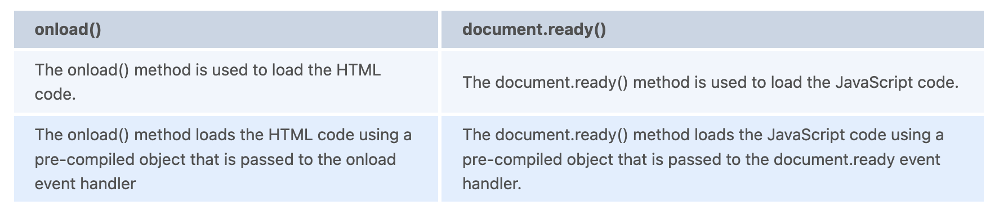

# jQuery Interview Questions

---

1. What are the advantages of jQuery?
   + Most popular and open source
   + Very fast and easily extensible
   + Used to develop cross-browser compatible web applications as jQuery works in almost the same manner for different kinds of browsers.
   + Improves the performance of an application when using the minimised version of the jQuery library. The size of the minimized js file is almost 50% less than the normal js file. A reduction in the file size makes the web page load and work faster.
   + Commonly implemented UI-related functionalities are written using minimal lines of code.

2. How is jQuery different from other javascript frameworks?
   + jQuery is much smaller than other libraries.
   + jQuery does not have any dependencies on other libraries or frameworks. (Like babel).
   + jQuery is not as complex as other libraries. This makes it easier to use and understand.
   + jQuery is not as heavy as other frameworks, It only uses the predefined javascript to make web apps interactive.

3. List some Features of jQuery.
   + DOM element choices utilizing the multi-browser open source selector engine Sizzle, a jQuery project spin-off.
   + DOM manipulation is based on CSS selectors that employ element names and characteristics, such as id and class, as criteria to pick nodes in the DOM.
   + Events
   + Animations and effects.
   + AJAX.
   + Deferred and Promise objects are used to govern asynchronous processing.
   + JSON parsing
   + Extensibility through plugins
   + Utilities such as feature detection
   + Compatibility methods that are natively present in newer browsers but require fallbacks for older ones, such as inArray() and each ().
   + Support for many browsers (not cross-browser). jQuery 1.x and 2.x both support "current-1 versions" (that is, the current stable version of the browser and the version that came before it) of Firefox, Google Chrome, Safari, and Opera. Version 1.x also works with Internet Explorer 6 and above. However, jQuery version 2.x abandoned support for Internet Explorer 6-8 (which accounts for less than 2% of all browsers in use) and now only supports IE 9 and subsequent versions.

4. Is jQuery a JavaScript or JSON library file?
   + jQuery is said to be a library of single JavaScript files which consists of DOM/CSS manipulations, event effects or animations, AJAX functions and various commonly used plugins.

5. Does jQuery work for both HTML and XML documents?
   + No. jQuery works only for HTML documents.

6. What is jQuery Mobile?
   + Query Mobile is a JavaScript library that enables developers to create mobile-first applications. It is a lightweight framework that allows developers to create rich, touch-first interfaces that are optimized for touch devices.
   + jQuery Mobile is a mobile-first JavaScript library that aims to provide a modern and easy-to-use framework for developing mobile apps. It was originally developed by Facebook to improve the performance of its iOS and Android apps. Since then, it has been adopted by many other companies, including Google, Yahoo, and Mozilla.
   + When using jQuery Mobile, you can use the library to create a mobile-first app that is faster and easier to maintain than traditional web apps. It also makes it easier to add new features to your app without having to rewrite your code.
   + JQuery Mobile is built on top of the jQuery JavaScript library. It works by using the same techniques that are used when you are developing a traditional web app. However, instead of using JavaScript, jQuery Mobile uses HTML5 and CSS3 to create a modern and easy-to-use framework for developing mobile apps.

7. What is the `$()` function in the jQuery library?
   + The `$()` function is used to access the properties of elements in the DOM (Document Object Model). $() is similar to javascript’s selector functions, but it is more powerful and has more options.
   + `$()` can be used to access attributes, classes, id, data-* attributes, and more.
   + Example - Suppose you want to change the colour of all the heading1 (h1) to green, then you can do this with the help of jQuery as:
     ```
     $(document).ready(function() {
       $("h1").css("background-color", "green");
     });
     ```

8. Explain $(document).ready() function?
   + The $(document).ready() function is a jQuery extension that allows you to immediately run code when the document is ready. It's most commonly used to initialize a new page or to load scripts or styles into the document. However, it can also be used to load a script or style into the document at any time.
   + The $(document).ready() function is useful for loading scripts or styles into the document at any time. It's not useful for loading scripts or styles into the document when the document is already loaded.

9.  What is the exact difference between the methods onload() and document.ready()?
    + The onload() and document.ready() methods are used to load and render the HTML and JavaScript code that is needed to display the page.  However, they are different methods in that they use different approaches to loading the HTML and JavaScript code. The exact differences are:
      

10. Describe jQuery Connect in brief. Also, list its uses.
    + JQuery connect is a JavaScript library that provides a declarative API for binding data to elements. It allows you to specify the data source, the element that should be bound to the data, and the callback function that will be invoked when the element is bound.
    + The most common use case for jQuery connect is binding data to an element using an attribute or value. However, it can also be used to bind data to elements dynamically or to bind data to an element based on a condition.

11. What are the jQuery functions used to provide effects?
    + Some of the methods are listed below which provide the effect:
      + toggle()
        + This function is used to check the visibility of selected elements to toggle between hide() and show() for the selected elements where:
          + show() is run when the element is hidden.
          + hide() is run when the element is visible.
          + Syntax: $(selector).toggle(speed, easing, callback)
      + slideDown()
        + This function is used to either check the visibility of selected elements or to show the hidden elements. We can use this function on the following types of hidden elements:
          + Elements that are hidden using jQuery methods.
          + Elements that are hidden using display: none in the element’s CSS properties.
          + Syntax: $(selector).slideDown( speed, easing, callback )
      + fadeOut()
        + This function is used to change the level of opacity for element of choice from visible to hidden. When used, the fadded element will not occupy any space in DOM.
        + Syntax: $(selector).fadeOut( speed, easing, callback )
      + fadeToggle()
        + This is used for toggling between the fadeIn() and fadeOut() methods.
          + If elements are faded in state, fadeToggle() will fade out those elements.
          + If elements are faded out, fadeToggle() will fade in those elements.
          + Syntax: $(selector).fadeToggle(speed, easing, callback)
      + animate()
        + The method performs custom animation of a set of CSS properties. This method changes an element from one state to another with CSS styles.
        + The CSS property value is changed gradually, to create an animated effect.
        + Syntax: (selector).animate({styles},speed,easing,callback) where “styles” is a required field that specifies one or more CSS properties/values to animate. The properties need to be mentioned in camel casing style.
        + The parameters “speed”, “easing” and “callback” in the syntaxes of the above methods represent:
          + speed: Optional parameter and used for specifying the speed of the effect. The default value is 400 milliseconds. The possible value of speed are “slow”, “fast” or some number in milliseconds.
          + easing: Again optional parameter is used for specifying the speed of elements to different types of animation. The default value is “swing”. The possible value of easing are “swing” and “linear”.
          + callback: Optional parameter. The callback function specified here is executed after the effect method is completed.

12. What is the use of css() method in jQuery?
    + The css() method is used to change the style property of the selected element.

13. Which jquery method is used to hide selected elements?
    + The hide() function in jQuery is used to try and hide the chosen element.
    + For Example - Suppose we need to hide a division tag, that consists of `id = “ib”`. Then the jQuery code will be - `$(“#ib”).hide()`;

14. What are events in jQuery?
    + User actions on a webpage are called events and handling responses to those is called event handling. jQuery provides simple methods for attaching event handlers to selected elements. When an event occurs, the provided function is executed.

15. How to iterate/loop through all p elements in jquery.
    + $.each() is an object iterator tool provided by jQuery, as is.each(), a jQuery collection iterator(). So for traversing all the p elements, the sample code is
      ```
      $("p").each(function() {
        console.log( $(this).attr('id'));
      });
      ```

16. What is the significance of jQuery.length?
    + `jQuery.length` property is used to count the number of the elements of the jQuery object.

17. What is jQuery click event?
    + jQuery click event happens when we click on an HTML element.
    + jQuery provides a method click() method that aids to trigger the click event.
    + For example, $(“p”).click() will trigger the click event whenever the elements with paragraph tag are clicked on a browser page.
      ```
      $(selector).click(function(){
      //code that runs when the click event is triggered
      });
      ```

18. What is the purpose of JQuery's delay() method? Can you use this for different types of browsers like (Internet Explorer)?
    + The delay() method is used to set the delay between two events, such as a click or a change in state. The delay can be set to a number of different values, including milliseconds, seconds, and even hours. This can be useful when you want to wait for an event to occur before doing something else.
      + For example - you could use a delay of 5 minutes to wait for a user to click on your button before moving on to the next step in your workflow.
      + Although the delay() method is not available in all browsers. In order to use it in Internet Explorer, you will need to add the following line of code:
        + `window.addEventListener('click', function() { delay(5000); });`
        + But the latest Microsoft browser (Microsoft Edge) that replaces the internet explorer has support for the jQuery delay() method.
        + In addition, the delay() method is not available in some browsers, such as Firefox and Safari. To work around this issue, you can use the setTimeout() method instead.

19. Can you explain about ajaxStart() functions?
    + The ajaxStart() event is a global event that occurs when an Ajax request begins, assuming no other Ajax requests are presently active. The ajaxStart() event can also be used to cancel a previously called Ajax callback or to start a new one.
    + For example, suppose you have an online shopping cart application that allows customers to add items to their shopping cart when they are ready to checkout. An ajaxStart() event could be used to trigger a shopping cart initialization routine when the user first visits the application, or any time a new shopping cart is about to be initialized.
    + Similarly, a shopping cart termination routine could be triggered when the user is finished shopping, or whenever a shopping cart is no longer needed.

20. Can you explain about ajaxComplete() function?
    + The ajaxComplete() is called regardless of whether the request is successful or fails, and a complete callback is returned, even for synchronous queries.
    + This is very useful for error handling. If a request fails but the result is not needed immediately, it is transferred to a cache, and then called later. This is especially useful if you want to keep track of failed requests and retry those that were not successful. A typical scenario is the case of an AJAX request but no data is returned, or the data is returned but not as intended. In this case, you can call ajaxComplete() to get a new set of data and continue with your business logic. A successful AJAX request is not necessarily a reason to call ajaxComplete(). you can still do other stuff while the data is being transferred from the server to the browser. For example, you can scroll, pause the video, or show a loading indicator.

21. Describe the benefits of jQuery Ajax techniques.
    + With the aid of DOM and JavaScript, There is a great advantage of AJAX. Ajax can request and receive data from the server without requiring a page reload. jQuery Ajax methods are a powerful way to make your web applications more responsive. They enable you to take advantage of the power of Ajax by using JavaScript to make your web pages load faster and more efficiently.
    + By using jQuery Ajax methods, you can take advantage of the power of Ajax by using JavaScript to make your web pages load faster and more efficiently. The following advantages of the AJAX Methods are:
      + It allows us to eliminate the complete page reload and instead load only a portion of the page.
      + API that is simple.
      + Cross-browser compatibility.
      + POST and GET are supported.
      + Upload a JSON, XML, HTML, or script file.

22. Can you tell something about jQuery each() method?
    + The each() method in jQuery allows us to loop through different datasets such as arrays or objects (even DOM objects).
    + It can be used to loop through a number of DOM objects from the same selectors.
    + For example, if you want to add a width=“600” to all the images in a page then we select all images and loop through each of them and add width = "600" to each tag. We can write the code as below:
      ```
      $("img").each(function(im){
          $(this).attr("width","600")
      });
      ```
    + $ is a jQuery object definer. In the above syntax, “this” is a DOM object and we can apply jQuery functions to only jQuery objects which is why we convert the DOM object to jQuery object by wrapping it inside the $ definer.
    + We can also use each() to loop through the arrays of data and get the index and the value of the position of data inside the array.
      ```
      var list = ["InterviewBit", "jQuery", "Questions"];
      $.each(list, function(index, value){
          console.log(index + " "+ value);
      })
      ```
      + The above code prints:
        ```
        0 InterviewBit
        1 jQuery
        2 Questions
        ```
    + You can also use each() to loop through objects.
      ```
      var obj = {"name":"InterviewBit","type": "jQuery"};
      $.each(obj, function(key,value){
        console.log(key + " - " + value);
      })
      ```
      + The above code prints:
        ```
        name - InterviewBit
        type - jQuery
        ```

23. What is CDN?
    + CDN is an acronym that stands for Content Delivery Network or Content Distribution Network. It is a big distributed system of servers spread throughout the internet in many data centres. It downloads content from servers at a greater bandwidth, resulting in speedier loading times. Several firms offer free public CDNs, including Google, Amazon, Microsoft, Yahoo, etc.

24. What is the difference between javascript and jQuery?
    + JavaScript is an interpreted language written in C and is a combination of ECMAScript and DOM whereas jQuery is a JavaScript library developed to run things faster and make things simplified for JavaScript. jQuery doesn't have the ECMAScript.
    + JavaScript requires long lines of code to code a functionality whereas in the case of jQuery, just import the library and call the functions which would reduce the programmer’s effort in coding.
    + JavaScript doesn't have cross-browser compatible functionality which is why a developer has to write code manually to implement the functionality. Whereas the cross-browser code compatibility is inbuilt in jQuery.

25. In jQuery, what is the difference between the `$(window).load` and `$(document)`.ready functions?


26. What exactly is a jQuery Data Table plug-in? Also, explain the uses with examples.
    + A data table plug-in is a jQuery plugin that can be used to create custom tables. It allows you to create a table with a custom layout, without having to write any code. It can be used to create tables with different layouts, or even to create tables with custom columns. The data table plug-in is a great way to add extra functionality to your websites, especially if you want to add a table to your website that is not included in the default layout.
    + Some of the uses for data tables are listed below:
      + Data tables are great for displaying a lot of data at once. For example, you could display a list of products on your website. You could also display the same data in a table in your blog.
      + Data tables are also great for displaying information that you want your visitors to see. For example, you could display a list of products that you're selling on your website. You could also display the same information in a table in your blog.
      + Data tables are great for showing a lot of information in one place. For example, you could display a list. of products on your website and then add additional information about each product in the table.

27. What is the purpose of JQuery's serialize() method?
    + The serialize() method is a utility method of the jQuery library that allows you to serialize data from a DOM element and return it in a format that can be used by other libraries.
    + This is useful when you want to pass data between different libraries or frameworks, or if you want to create a custom API that can be used by other developers. For example - if you want to pass JSON data from your application to a third-party API, you can use the serialize() method to serialize the data and then pass it to the API. This way, the API knows how to handle the data, and you don't have to worry about the format of the data.
    + The serialize() method is also useful when you need to send data between different browsers. For example - if you want to send JSON data from one browser to another, you can use the serialize() method to serialize the data and then send it using a custom HTTP request.
    + If you're not sure what data you need to serialize, there's an easy way to find out: Just type "serialize" into the console. You'll see a list of all the methods that are available on your element. ul> li>serialize/li> li>unserialize/li> /ul> div id="example"> ul> li>serialize/li> li>unserialize/li> /ul> /div>

28. What are the selectors in jQuery? How many types of selectors in jQuery?
    + In order to work with any element on the web page, we would first need to find it. Selectors find the HTML elements in jQuery. Some of the most commonly used and basic selectors are:
      + Name: Used to select all elements which match the given element Name.
      + #ID: Used to select a single element which matches with the given ID
      + .Class: Used to select all elements which match with the given Class.
      + Universal (*): Used to select all elements available in a DOM.
      + Multiple Elements E, F, G: Used to select the combined results of all the specified selectors E, F or G.
      + Attribute Selector: Used to select elements based on their attribute value.

29. Explain how CSS classes can be manipulated in HTML using jQuery.
    + Query provides several methods to manipulate the CSS classes assigned to HTML elements. The most important methods are addClass(), removeClass() and toggleClass().
      + addClass():
        + This method adds one or more classes to the selected elements.
        + Syntax: $(selector).addClass(className);
        + You can also add multiple classes to the selector. Syntax:$(selector).addClass(class1, class2);
      + removeClass():
        + Similar to adding class, you can also remove the classes from the elements by using this method.
        + Syntax:
          + For removing one class: $(selector).removeClass(class1);
          + For removing multiple class: $(selector).removeClass(class1, class2, class 3);
          + For removing all classes at once: $(selector).removeClass()
      + toggleClass():
        + This method is used for adding or removing one or more classes from the selected elements in such a way that if the selected element already has the class, then it is removed. Else if an element does not have the specified class, then it is added i.e. it toggles the application of classes.
        + Syntax: $(selector).toggleClass(className);

30. State some different types of jQuery Methods.
    + jQuery provides a variety of methods for doing various tasks, such as manipulating the DOM, events, and ajax. The table below covers many technique categories.
      

31. Explain jQuery no-conflict.
    + jQuery no-conflict is a jQuery option that allows you to avoid conflicts between various javascript frameworks or libraries. When you utilize jQuery's no-conflict mode, you substitute the `$` variable with a new variable and assign jQuery to other JavaScript libraries. In addition, the $ symbol is utilized as a function or variable name in jQuery.
    + When no conflict is enabled, the `$` symbol in jQuery becomes the global function name and not the library name. For example, you may use the `$` function to access other libraries' data, but not their code. You can also use this option to avoid conflicts between various jQuery plugins.

32. In jQuery, distinguish between the bind(), live(), and delegate() functions.
    + The bind() function does not connect events to items added after loading the DOM. In contrast, the live() and delegate() methods also attach events to future items.
    + The distinction between live() and delegate() methods is that live() does not support chaining. It will only function on a selection or an element. However, the delegate() function supports chaining.
    + The bind() method works only within a dom element. If you want to bind events to items in a different element, you can use the delegate() function. The bind() method is not recommended for use in JavaScript. It is a best practice to call event handlers on items as they are added to the DOM. The bind() method is only used to control the order in which items are displayed. If you need to add items to a different order, you can use the delegate() function. The bind() method is not intended to be used in a production environment. It does not offer the same performance benefits as the delegate() method.
    + For Example - Consider the below code:
      ```
      $(document).ready(function(){
          $("#interviewbit").find("p").live("click", function(){
            alert("Welcome to InterviewBit jQuery Interview Questions");
          });
      });
      ```
      + The live() method does not work in the given code, but we can easily do this using the delegate() function. So the code will be like this:
        ```
        $(document).ready(function(){
            $(".interviewbit")children("p").delegate("a","click", function(){
              alert("you clicked on a link to jQuery interview questions.");
            });
        });
        ```

33. Explain the operation of the jQuery connect() method.
    + The connect() method of jQuery is a utility function that allows you to create a new jQuery object and pass it to the jQuery object's constructor. This allows you to create a new object with the same functionality as the original object, but without having to manually set up the object's properties. For example, you can pass in an existing jQuery object and it will be automatically set up to use the same properties as the original object.
    + When using connect() method, you can pass in a callback function that will be called when the new object is ready. The callback function can be used to perform any additional setup that needs to be done before the new object can be used.
    + For example - you can set up a data source using the data() method of jQuery. When using connect() method, you can pass in a callback function that will be called when the new object is ready.

34. Distinguish between jquery.min.js and jquery.js.
    + The functionality of jquery.min.js and jquery.js is the same. However, If you are serving a page that contains a lot of JavaScript, it is a good idea to minify it. Minifying JavaScript (jquery.min.js) reduces the size of your file and makes it faster to load on all platforms. Minifying your code also reduces the chances that erroneous code will be rendered as a malicious attack because it makes it more difficult to test. With minified JavaScript, you will get better page performance, faster loading, and shorter wait times for your visitors.
    + There are also some of the major advantages of the jquery.min.js.:
      + When JS files are minified in a production environment, they load faster and provide faster and better page performance.
      + Minifying a script also reduces the size of the file in the server’s temporary directory and browser cache, which results in a faster download and a smaller server response.
      + Another advantage of using minified JS is that it removes the need to include any external JS files in the HTML document. This makes it easier to structure the code and easier to edit the code.

35. Explain the benefits of using a CDN for the jQuery files.
    + Hosting jQuery on a Content Delivery Network (CDN) improves availability and performance at a reduced cost and with less network traffic, improves latency (the time it takes to send and receive a data packet from the server), and provides a device-specific version of the contents.
    + CDNs are a great way to host your JavaScript and CSS files. By caching these files, you can reduce the amount of time it takes for your site to load, making it faster and more responsive. This is especially important for sites that serve large amounts of content, such as blogs or e-commerce sites. By using a CDN, you can also reduce the number of load times that occur when visitors access your site. In addition, by hosting your JavaScript and CSS files on a CDN, you can also reduce the amount of bandwidth that is consumed by your site.
    + Example - It makes it simple to maintain responsiveness for mobile screen sizes, as well as safe storage space for important data or files.
    + Caching JavaScript and CSS files on a CDN is an important optimization that should be considered when building a site with a lot of JavaScript and CSS files.

36. In jQuery, what is the difference between $(this) and this.
    + `$(this)` is a jQuery object, whereas this is a JavaScript global object reference. We may refer to DOM elements in HTML documents using this.
    + `$(this)` refers to the parent object, whereas this is a DOM element that, in the case of an array, represents an object with the .each() method, which shows the current iteration.
    + We use this as an alternative to this.parent() to refer to the parent object in JavaScript. This is more convenient than using this.parent(). We can also use this to refer to other elements in HTML, as in an ul element:
      ```
      var myElement = $('ul').each(function() {
          var childElement = this.parent().nextSibling();
      });
      ```
      + This is useful when you need to iterate over a list of elements and their children, but you do not want to reference the parent object.

37. Can you describe the various methods for extracting a query text using regular expressions?
    + There are two methods for obtaining a query string using regular expressions.
      + String-based approach: This method aids in the generation of Strings by comparing similar regular expressions using the.replace() function.
      + Regular Express Based Approach: When compared to strings in JavaScript, the regular expression technique is the most powerful method for extracting a query string and pattern. Using the.exec() and.test() methods to compare against patterns. Other String methods include match(), matchAll(), replace(), search(), and split().

38. Explain the use of event.preventDefault() method.
    + Event.PreventDefault is a jQuery event that stops an event from firing when the user clicks on a link or other trigger. It basically stops the default behaviour of the triggers and allows any other event to occur. It is useful for preventing unwanted events from firing when a user clicks on a link or other trigger. This can be useful when you want to prevent users from accidentally clicking on links that open up new windows or tabs.
    + When you use an event like click or keypress, you can prevent the event from firing by adding the event.preventDefault() method to the event object. When you use event.preventDefault(), the event will not fire unless the user clicks on a link or other trigger.
    + Event.preventDefault() is only available in jQuery 1.7 and later versions of jQuery.
    + Example - Assume you're developing an AJAX-based application in which you need to submit form data through AJAX when a button in the form is clicked. So, if you click on a button without preventing it, the button behaves normally and the website reloads. As a result, the other event will not occur when you click the button. So, if we use prevent default there, we can skip the button's default behaviour and instead perform the AJAX event and alter the HTML DOM accordingly.

39. What Are the Benefits of Using Jquery Instead of Javascript in an Asp.net Web Application?
    + Below are some of the benefits of using jQuery instead of javascript in ASP.net Web Application:
      + Jquery is well-written optimized javascript code, thus it will execute quicker until we create the same standard optimized javascript code.
      + Jquery is javascript code that is succinct, which implies that it requires the least amount of code to do the same functionality as javascript.
      + Jquery makes Javascript development faster since much of the functionality is already provided in the library and we only need to access it.
      + Because Jquery supports cross-browser compatibility, we save time on supporting all browsers.

40. What is event.stopPropagation()?
    + event.stopPropagation() stops the event from propagating up the DOM tree, preventing any parent handlers from being notified of the event. For example, if a link with a click method is linked inside of a DIV or FORM that also has a click method attached, the DIV or FORM click method will not fire.

41. Is it possible to pause or postpone the execution of the document.ready for a period of time?
    + Yes, that is possible. With the release of jQuery 1.6, a new method called "jQuery.holdReady(hold)" was added. This function allows you to postpone the execution of the document.ready() event. The document.ready() event is triggered as soon as your DOM is ready, however, there may be occasions when you wish to load extra JavaScript or plugins that you have referenced.

42. Would you still favor jQuery in a case when things can be done simply using javascript?
    + No. If we can accomplish our goals using simple JavaScript, then we should avoid using jQuery. It is because the jQuery library is always xx kilobytes in size, thus there is no use in wasting bandwidth. And because jQuery is built on top of javascript, it has numerous functions that are more complicated than the simple job you can accomplish with javascript. jQuery will also load all dependencies. It will have some speed issues as compared to the javascript code.

43. How to perform jQuery AJAX requests?
    + jQuery provides the ajax() method to perform an AJAX (asynchronous HTTP) request.
    + Syntax:
      + $.ajax({name:value, name:value, ... }). The parameters specify one or more values of name-value pairs.
        + url: this name specifies the URL to send the request to. Default is the current page.
        + success(result,status,xhr): success callback function which runs when the request succeeds
        + error(xhr,status,error): A function to run if the request fails.
        + async: Boolean value that indicates whether the request should be handled asynchronous or not. The default value is true.
        + complete(xhr,status): A function to run when the request is completed (after success and error functions are handled)
        + xhr: A function used for creating the XMLHttpRequest object
    + Example:
      ```
      $.ajax({
        url: "resourceURL",
        async: false,
        success: function(result){
          $("div").html(result);
        },
        error: function(xhr){
          alert("An error occured: " + xhr.status + " " + xhr.statusText);
        }
      });
      ```

44. What does the following code do?
    + `$( "div#firstDiv, div.firstDiv, ol#items > [name$='firstDiv']" )`
      + The given code is an example of getting elements that satisfy multiple selectors at once. The function returns a jQuery object having the results of the query.
      + The given code does a query to retrieve those `<div>` element with the id value firstDiv along with all `<div>` elements that has the class value firstDiv and all elements that are children of the `<ol id="items">` element and whose name attribute ends with the string firstDiv.

45. Write a jQuery code to create and delete cookies from the browser.
    + There is no direct way to access the cookies using jquery. We can easily do this with the help of pure javascript. To work with cookies in jQuery, you must install the Dough cookie plugin or any other cookies plugins. The dough is simple to use and offers a number of useful capabilities.
      + Creating cookies - $.dough("cookieName", "cookieValue");
      + Reading cookies - $.dough("cookieName");
      + Deleting cookies - $.dough("cookieName", "remove");

46. Consider the following code that exists in following HTML with the CSS:
    ```
    <div id="expand"></div>

    <style>
      div#expand{
        width: 50px;
        height: 50px;
        background-color: gray;
      }
    </style>
    ```
    + Write jQuery code to animate the #expand div, expanding it from 50 * 50 pixels to 300 * 300 pixels within five seconds.
      + We can do this by using the animate() function. We first need to have access to the div element which has id value of expand and then apply animate function on the element as follows:
        ```
        $("#expand").animate(
        {
          width: "300px",
          height: "300px",
        },
        5000
        );
        ```

47.  What does the following code do?
    ```
    $( "div" ).css( "width", "500px" )
              .add( "p" )
              .css( "background-color", "yellow" );
    ```
    + The given code first selects all the `<div>` elements and applies width of 500px to them and adds all the `<p>` elements to the elements selection after which the code can finally change the background color to yellow for all the `<div>` and `<p>` elements
    + The given code is an example of method chaining in jQuery which is used to accomplish a couple of things in one single instruction.

48.  Can you explain the difference between jQuery.get() and jQuery.ajax()?
     + jQuery.ajax() allows the creation of highly-customized AJAX requests, with options for how long to wait for a response, what to do once the request is successful, how to handle a failure scenarios, whether the request to be sent is blocking (synchronous) or non-blocking (asynchronous), what format to expect as the response, and many more customizable options.
     + jQuery.get() is uses jQuery.ajax() underneath to create an AJAX request typically meant for simple retrieval of information.
       + There are various other pre-built AJAX requests given by jQuery such as:
         + jQuery.post() for performing post requests
         + jQuery.getScript() meant for loading and then executing a JavaScript file from the server using GET request.
         + jQuery.getJSON() for loading JSON-encoded data from the server using a GET HTTP request.

49. Write a code snippet for preventing the default behavior of the submit button for performing another event.
    ```
    <script>
        $(document).ready(function(){
            $("#submitButton").click(function(event){
              event.preventDefault();
            });
        });
    </script>
    ```

50.  Which of the two lines of code below is more efficient and why?
     + `document.getElementById("interviewBit");`
     + `$("#interviewBit");`
       + The code document.getElementById( "interviewBit" ); is more efficient because its the pure JavaScript version.
       + The reason being jQuery is built on top of JavaScript and internally uses its methods to make DOM manipulation easier. This introduces some performance overhead. We need to remember that jQuery is not always better than pure JavaScript and we need to use it only if it adds advantage to our project.

51. How do you disable elements in Jquery Using "attr"?
    + `$('class_or_id_of_element_to_disable').attr('disabled', true);`
    + `$('class_or_id_of_element_to_disable').attr('disabled', false);`

52. Can you write a jQuery code selector that needs to be used for querying all elements whose ID ends with string “IB”?
    + We can use the following selector:
      + `$("[id$='IB']")`

53. Explain the .promise() method in jQuery.
    + The .promise() method returns a dynamically generated promise that is resolved when all actions of a certain type bound to the collection, queued or not, have ended.
    + The method takes two optional arguments:
      + type - The default type is “fx” which indicates that the returned promise is resolved only when all animations of the selected elements have been completed.
      + target - If a target object is specified, .promise() will attach to promise to that specified object and then return it rather than creating a new one.

54. Write A Jquery Code Snippet To Sort A String Array?
    ```
    $(document).ready(function(){
        var arr = [ "jQuery","Interview","Questions","By","InterviewBit"];
        sortedArr = arr.sort();
        $("#elementId").html(sortedArr.join(""));
    });
    ```
    + Output:
      + `["By","InterviewBit","Interview","jQuery","Questions"]`

55.  Consider the below code snippet and assume that there are 5 `<div>` elements on the page. What is the difference between the start and end times displayed?
    ```
    function getMinsSeconds() {
      var dt = new Date();
      return dt.getMinutes()+":"+dt.getSeconds();
    }

    $( "input" ).on( "click", function() {
      $( "p" ).append( "Start: " + getMinsSeconds() + "<br />" );
      $( "div" ).each(function( i ) {
            $( this ).fadeOut( 1000 * ( i * 2 ) );
      });
      $( "div" ).promise().done(function() {
            $( "p" ).append( "End: " + getMinsSeconds() + "<br />" );
      });
    });
    ```
    + For the above code, the difference between the start and end times will be 10 seconds.
    + This is because .promise() will wait for all `<div>` animations (here, all fadeOut() calls) to complete, the last one will complete 10 seconds (i.e. 5 * 2 = 10 seconds) after the fadeOut() starts.

56.  Can you provide an example of chaining using a code snippet?
     + Old Code:
       ```
       $(document).ready(function(){
           $('#id').addClass('ib);
           $('#id').css('color', 'blue);
           $('#id').fadeIn('slow');
       });
       ```
     + New Code after Chaining:
       ```
       $(document).ready(function(){
           $('#id').addClass('ib)
           .css('color', 'blue')
           .fadeIn('slow);
       });
       ```

57. Can you tell the difference between prop() and attr()s?
    + Both prop() and attr() can be used to get or set the value of the specified property of an element attribute.
    + The attr() gives the default value of a property whereas prop() returns its current value.
