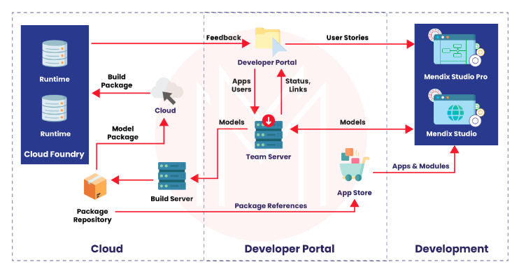

# Mendix Interview Questions

---

1. What are some facts about Mendix?
   + Mendix bagged first place in the Computable Awards Software/SaaS category-2021.
   + Mendix was also named as the leader in the 2019 and 2021 Magic Quadrant for Multi-experience Development Platforms by Gartner.
   + Around 3400 organizations across the globe use Mendix for their operations.
   + Junior Mendix developers can expect an average salary of about $70,000 per annum. And the average expected salary of senior developers is $120,000 per annum.

2. What are the features available in Mendix Studio?
   + Microflow creation
   + Drag-and-drop page creation as well as page editing
   + The ability to create as well as edit domain model
   + Collaboration with developers who use Mendix studio pro
   + Easy tracing via Navigation document.

3. What features are available in Mendix Studio Pro?
   + Access to version control
   + Ability to run Java Actions
   + Ability to run the workflow debugger for fixing and testing workflows
   + Ability to review the changelogs
   + Ability to configure security settings

4. What is meant by a workflow in Mendix?
   + Workflow is a visual language in Mendix Studio pro as well as Mendix Studio that enables building extendable processes for the business. There is complete integration available with the page editor and microflow editor as well.
   

5. What basic functions can be performed with workflows?
   + Allow workflow functionality
   + Open a workflow
   + Create a workflow
   + Copy as well as paste a workflow
   + Duplicate a workflow
   + Add elements to a workflow

6. What are the main documents available in the workflows category?
   + `Workflow context parameter`: The workflow context, the business-related data, and the properties are described in this document.
   + `Workflow properties`: Workflow properties are described in this document.
   + `User task`: Properties of a user task are described in this document.

7. What is Mendix Cloud?
   + When we start with the Mendix platform, the default deployment is available in the Mendix cloud. Multiple backups, environments, high availability, and monitoring are included in a licensed node on the Mendix cloud as an integrated solution.
   + The cloud notes available in the Mendix cloud can be viewed within the Mendix studio pro. Also, a deployment package can be created in the developer portal, and from there, it can be transported to start running the application.
   

8. Which options are available in the control center dashboard of the Mendix platform?
   + Mendix versions
   + Apps created
   + External members
   + Certification level
   + Company feed

9. What is the function of a microflow in Mendix?
   + Microflows enable expressing the logic of the application. We can create objects, update objects, show pages, and make choices using a microflow. It is a visual representation of the traditional textual program code. Microflows can't be used in offline apps as they run on a run-time server.
   

10. What is the function of a nanoflow in Mendix?
    + Nanoflows are somewhat similar to microflows in the context that they enable expressing the logic of the application. But we can use them in an offline app as well because they directly run on the device/browser. Also, there is a speed benefit for logic for which access to the server is not needed because of the actions being run directly on the device.
      

11. Which widgets are available in the ListView controls?
    + We can filter and search a list view with the XPath data sources and the database by using ListView Controls. The widgets available in the list view are given below:
      + Drop-down filter
      + Check box filter
      + Header sort
      + Drop-down sort
      + Text box search
      + Pagination

12. What are the features of the check box filter widget?
    + We can filter a list view at the runtime with various restrictions. Its features are given below:
      + Filtering items by XPath
      + Filtering items by attribute
      + Setting as default a checked check box
      + Configuring filter actions when the widget is unchecked or checked
      + Multiple filters are supporting on the same list view.
      

13. What are the features of the drop-down filter widget?
    + We can filter a list view at runtime with various options when the drop-down widget is placed above a list view. Its feature are given below:
      + Filtering items by XPath
      + Filtering items by an attribute
      + Setting a default filter option
      + Selecting a filter from an options list

14. Explain what is Mendix Marketplace?
    + The Mendix Marketplace is an advanced and vibrant marketplace containing a list of sample apps that are capable of being used right away. It also contains several components such as widgets, connectors, and modules to customize apps in quick time. At this marketplace, we can get what we need, browse the content, and share the content that we have created.
      

15. Mention some cloud vendors supported by Mendix.
    + Most of the public cloud vendors are supported by the Mendix platform, such as:
      + Mendix cloud
      + IBM cloud
      + SAP cloud platform
      + Amazon web services
      + Microsoft Azure
      + Google

16. What are the elements of the toolbox on a page?
    + The Toolbox, as the name suggests, shows the available tools on a page. The following are contained in this tab:
      + Widgets
      + Building Blocks
        

17. What is the function of the company brand page?
    + The company logo that will be appeared on the company page can be added and edited on this page. We can avail the company page in the control center’s future iteration.
    + We can also add and set a cover image as the background header of our company page through this feature. And if we don’t set an image by clicking upload, it will use the primary color set in the Brand colors section.

18. Mention the steps which need to be followed to create a new page in Studio.
    + Click on ‘Pages.’
    + Select the module to which you would like to add a new page. Click on ‘+’ next to this module.
    + A ‘Create new page’ dialog box will appear. Here, give the page its title, layout, and page template.
    + Click on ‘Create.’
      

19. List the building blocks available in the pages of Studio.
    + Lists
    + Headers
    + Charts
    + Cards
    + Forms
    + Master-detail
    + Breadcrumbs
    + List controls
    + Wizards
    + Timeline
    + Alignments
    + Notifications

20. Mention the steps that need to be followed to create a workflow using the Wizard.
    + In the left menu bar, click on ‘Workflow.’ Click on ‘+’ next to the module to which you would like to add a workflow.
    + A 'Create workflow' dialog box will appear on the screen. Set the title as 'Travel Approval.' Click on the 'Start Wizard' option.
    + A ‘Create request form’ will appear on the screen. Now define the input field which will be used when submitting a request. Name, date, cost, destination, and a travel document will have to be filled by the employee.
    + Click on ‘Create.’

21. How can a workflow be triggered via a microflow?
    + Open a microflow to trigger the workflow.
    + Ensure it has a necessary parameter and the workflow context identity.
    + Drag and drop the ‘Call workflow’ to the microflow from the toolbox.
    + Open activity properties option.
    + Set the desired workflow.
    + Set ‘Workflow object’ as the workflow context.
    + Set the ‘Workflow name.’

22. Why are microflows needed?
    + For adding custom logic to our application,
    + For extending/changing the standard behavior of the buttons,
    + For integrating with other databases, systems, web services, etc.

23. Explain the functions of a loop.
    + When building microflows, we can use a loop for iterating over a list of objects and performing actions on each list item as well. For instance, a list of orders can be retrieved from the database, the list can be looped over, and orders can be marked as processed.
      

24. Explain the use of a break event and a continuing event in loops.
    + We use a break event in loops to stop it from iterating over the list of objects and continue with the rest of the flow in our microflow. In contrast, we use a continuing event in loops for stopping the current iteration and starting the next object iteration.

25. What options does the Workflow activities section contain?
    + Various activities to interact with workflows are contained in the Workflow activities section, such as:
      + Call workflow
      + Complete task
      + Retrieve workflow data
      + Show user task page

26. Explain the elements of the general section in the toolbox of workflows.
    + `Start event`: This is used to open the workflow properties.
    + `Decision`:  A choice is made based on a condition. And only one of the outgoing paths is used.
    + `Jump activity:` It is used to jump on other activities in the workflow.
    + `Parallel split`:  It is used for adding two or more parallel paths to the workflow.
    + `End activity`:  It is used for ending the path of our workflow.

27. Mention the steps to upload a company logo.
    + Open the 'Theme customizer' by clicking on the paintbrush icon in the left menu bar.
    + Click on ‘Select file’ in the ‘Upload Logo’ section.
    + Select the image you want to upload a logo in the dialog box.
    + Check the preview
    + Set the logo height and logo width to 40PX in the ‘UI customization section.’
    + Now select page view from the upper-right corner.
      

28. Mention the various panels available in Studio Pro.
    + Changes
    + Stories
    + Console
    + Errors
    + MxAssist performance bot
    + Advanced
    + Properties
    + Data hub
    + Connector
    + Toolbox

29. What is the function of a connector panel in Studio Pro?
    + A connector panel is used to link the data with pages quickly. An entity could be dragged onto a data grid or data view for displaying the app’s data quickly on a page using the connector.
      

30. What is a domain model in Studio pro?
    + The information used by our application abstractly is described by the domain model. It is an integral part of the architecture of any application. There is a specific domain module attached to each module describing its data. The data from all the domains can be used by all modules in an application.
    + In each domain model, ‘associations’ represent the relationship of its ‘entities’ with other entities. ‘Annotations’ can also be added for further explanation.
      

31. What are the three main characteristics of the progressive web apps in studio pro?
    + Reliable
    + Installable
    + Capable

32. Why are low-code development platforms in demand these days?
    + Low-code as well as No-code platforms are considered the future of software development. This is because these platforms enable us to build applications and perform edits without complications in a quick time. There is no need to write, research, and test new codes. Hence these services are time-saving along with being highly efficient.

33. Mention some of the competitors of Mendix.
    + Appian, OutSystems, Quickbase, Salesforce, ServiceNow, Kissflow, Zoho Corporation, Oracle Application Express, Claris, and Oracle Corporation are some of the competitors of Mendix.

34. Which major companies use Mendix in their operations?
    + Massachusetts Institute of Technology
    + Nine United Denmark A/S
    + Crowe Horwath LLP
    + Ryerson
    + Parker Hannifin
    + eXp World Holdings
    + TuSimple

35. What can different functions be performed with Mendix?
    + Automate processes as well as workflows
    + Application Development
    + Digitize customer experiences
    + Modernize systems
    + More use cases

36. List some features of Mendix.
    + Enterprise Integration
    + App Governance
    + Multi-channel
    + Multi-device
    + Drag and drop Forms builder
    + Public/private application stores
    + Model-driven development

37. With which services is Mendix integrated?
    + Lync Online
    + Skype
    + GitHub
    + Tableau Software
    + Microsoft Excel
    + SAP CRM on-demand
    + Salesforce app cloud

38. Which two environments are provided by Mendix to edit and create applications?
    + Mendix Studio
    + Mendix Studio Pro
      

39. Tell us something about Mendix studio.
    + It is a no-code application development platform. Mendix studio is specially designed for people who do not know much code, such as citizen developers and business users. The user doesn't even have to install software to use it.
    + The intuitive design and the drag-and-drop environment allow a non-IT professional to build a no-code application. This is highly beneficial because the in-depth knowledge of the business needs mostly rests with business users.

40. Tell us something about Mendix Studio Pro.
    + It is a low-code application development platform. The Mendix applications can be created, viewed, and edited in this environment. Developers with different experience levels can use Mendix studio pro to develop mobile and web apps through complex logic.
    + A wider set of features are available in Mendix studio pro than in Mendix studio. The code can be edited and customized with the in-built editors as well in Mendix studio pro. Also, it allows the users to control integration, build extensions, manage security, and manage branch lines. It is not provided in Mendix studio. Domain-specific languages are available in studio pro. The developer can also access the page editor, domain model, integrations, debugger, microflow editor, and security configuration within studio pro.

41. Which great apps have been built with Mendix so far?
    + Solomon group’s RFID wristband event access application
    + AntTail’s app to track medicine
    + Smart building management app based on Heijman’s IoT
    + Equipment tracking app of KLM’s IoT
