# Snowflake Interview Questions

---

## Background
Snowflake is basically a SaaS (Software as a service is a cloud-based method of providing software to users.) based data warehouse (DWH) platform that is built on the top of AWS (Amazon Web Services), Microsoft Azure, and Google Cloud infrastructures to provide companies with flexible, scalable storage solutions while also hosting BI (Business Intelligence) solutions. It serves as a centralized platform for data management, data lakes, data engineering, data applications development, data science, and secure sharing and consumption of real-time and shared data. Providing a centralized system to consolidate all data, Snowflake revolutionized the data warehousing industry. With Snowflake, you can simplify data warehouse management without sacrificing features.

To satisfy the demanding needs of growing enterprises, Snowflake includes out-of-the-box features such as storage and compute separation, on-the-fly scalable computing, data sharing, data cloning, and third-party tool support, etc. In comparison to traditional solutions, Snowflake delivers fast, easy-to-use, and flexible data storage, processing, and analytics.  A number of programming languages are supported by Snowflake, including Go, C, .NET, Java, Python, Node.js, etc.

---

1. What are the essential features of Snowflake?
   + With Snowflake, you can interact with the data cloud through a web interface. Users can navigate the web GUI to control their accounts, monitor resources, and monitor resources and system usage queries data, etc.
   + Users can connect to Snowflake's data cloud using a wide range of client connectors and drivers. Among these connectors are Python Connector (an interface for writing Python applications to connect to Snowflake), Spark connector, NodeJS driver, .NET driver, JBDC driver for Java development, ODBC driver for C or C++ programming, etc.
   + The core architecture of Snowflake enables it to operate on the public cloud, where it uses virtualized computing instances and efficient storage buckets for processing huge amounts of big data cost-effectively and scalable.
   + Snowflake integrates with a number of big data tools, including business intelligence, machine learning, data integration, security, and governance tools.
   + With advanced features such as simplicity, increased performance, high concurrency, and profitability,
   + Snowflake is incomparable to other traditional data warehouse solutions.
   + Snowflake supports the storage of both structured and semi-structured data (such as JSON, Avro, ORC, Parquet, and XML data).
   + Snowflake automates cloud data management, security, governance, availability, and data resilience, resulting in reduced costs, no downtime, and better operational efficiency.
   + With it, users can rapidly query data from a database, without having an impact on the underlying dataset. This allows them to receive data closer to real-time.
   + Most DDL (Data Definition Language) and DML (Data Manipulation Language) commands in SQL are supported by the Snowflake data warehouse. Additionally, advanced DML, lateral views, transactions, stored procedures, etc., are also supported.

2. Explain Snowflake Architecture.
   + `Snowflake architecture`: a hybrid of shared-disk (A common disk or storage device is shared by all computing nodes) and shared-nothing (Each computing node has a private memory and storage space) database architecture in order to combine the best of both. Snowflake utilizes a central data repository for persistent data, which is available to all compute nodes similar to a shared-disk architecture. But, equally, as with shared-nothing architectures, Snowflake uses massively parallel computing (MPP) clusters for query processing, in which each node stores part of the whole data set locally.
     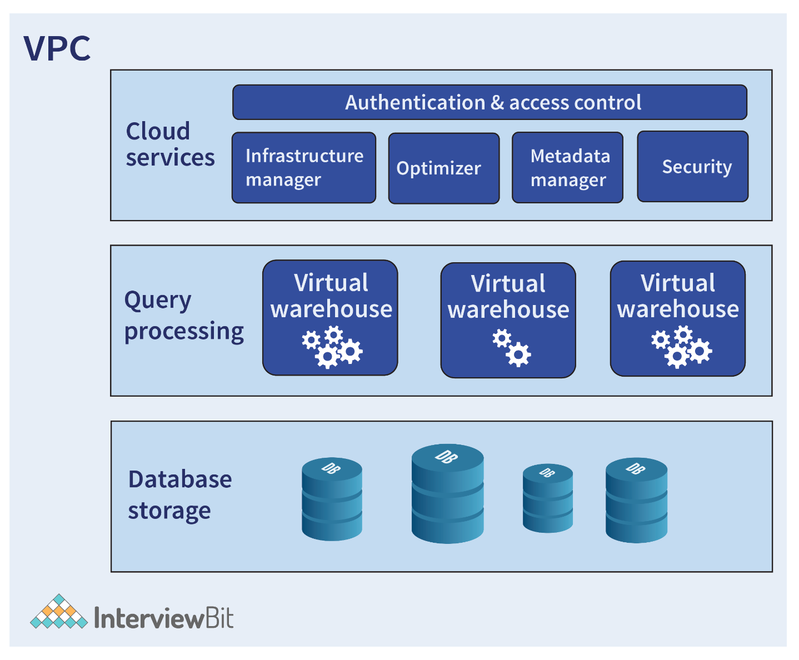
     + The Snowflake architecture is divided into three key layers as shown below:
       + `Database Storage Layer`: Once data has been loaded into Snowflake, this layer reorganizes that data into a specific format like columnar, compressed, and optimized format. The optimized data is stored in cloud storage.
       + `Query Processing Layer`: queries are executed using virtual warehouses. Virtual warehouses are independent MPP (Massively Parallel Processing) compute clusters comprised of multiple compute nodes that Snowflake allocates from cloud providers. Due to the fact that virtual warehouses do not share their compute resources with each other, their performance is independent of each other.
       + `Cloud Services Layer`: provides services to administer and manage a Snowflake data cloud, such as access control, authentication, metadata management, infrastructure management, query parsing, optimization, and many more.

3. What do you mean by virtual warehouse?
   + `Virtual Warehouse`: basically a collection of computing resources (like CPU, memory, Solid state drive, etc.) that customers can access to run queries, load data, and perform other DML (Data Manipulation Language) and SQL (Structured Query Language) operations.
   + For example, it provides memory, temporary storage, and CPU resources that can be used for DML operations and SQL execution. You can use this independent compute cluster at any time and then turn it off when not needed. You are charged (paid) for each virtual warehouse you run, their size, and how long they run. Virtual warehouses do not share their compute resources with each other, and therefore, their performance is independent of each other.
     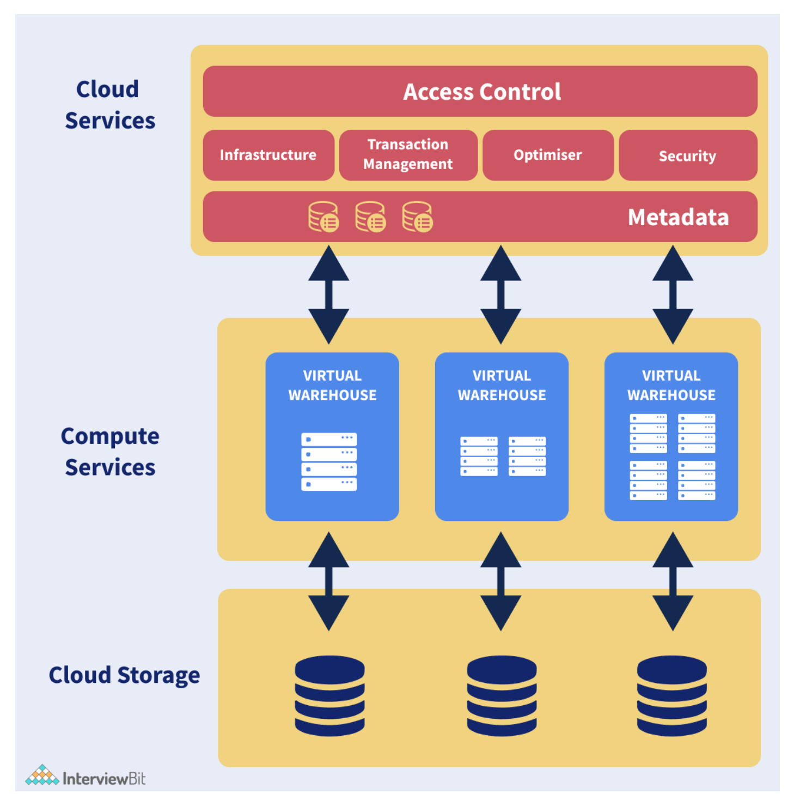
     + As shown in the following diagram, different groups of users can be assigned separate and dedicated virtual warehouses. Therefore, ETL processes can continuously load and execute complex transformation procedures on separate warehouses, ensuring no impact on data scientists or finance reports.
       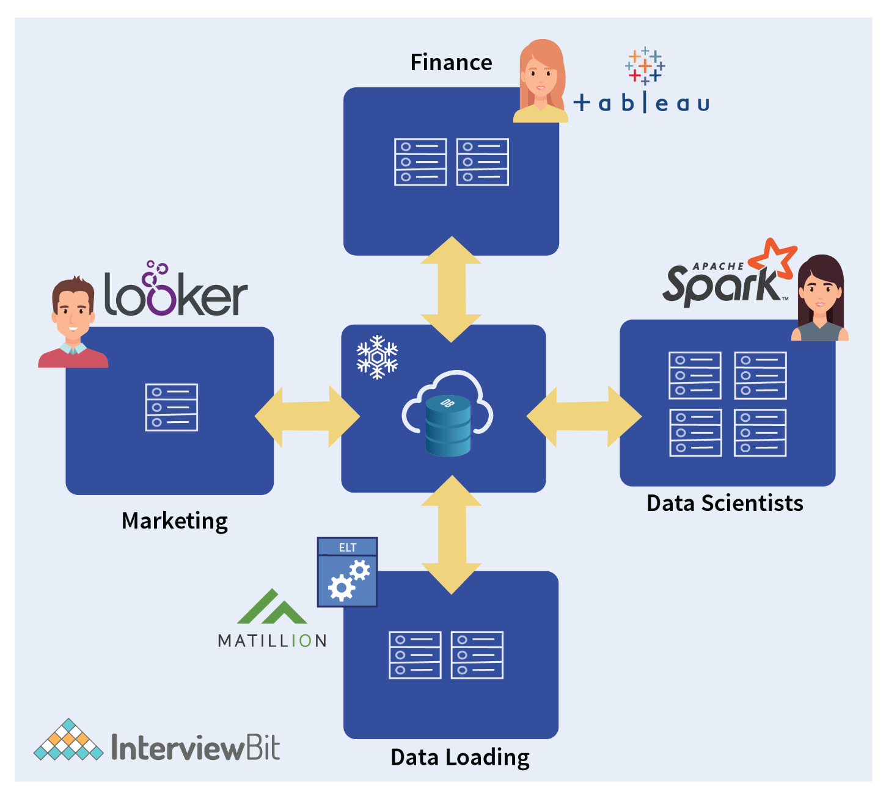

4. Can you tell me how to access the Snowflake Cloud data warehouse?
   + ODBC Drivers (a driver for connecting to Snowflake).
   + JDBC Drivers (a driver enabling a Java application to interact with a database).
   + Python Libraries (for creating Python applications that connect to Snowflake and perform standard operations).
   + Web User Interface (can be used for almost any task you can accomplish with SQL and the command line, such as:
     + Creating and managing users and other account-level objects).
   + SnowSQL Command-line Client (Python-based command-line interface to connect to Snowflake from Windows, Linux, and MacOS).

5. What is the difference between Snowflake and Redshift?
   + Cloud-based data warehouses are becoming increasingly popular, with Redshift and Snowflake being two of the biggest players. These are large data analytics databases capable of analyzing and reading vast amounts of data.
     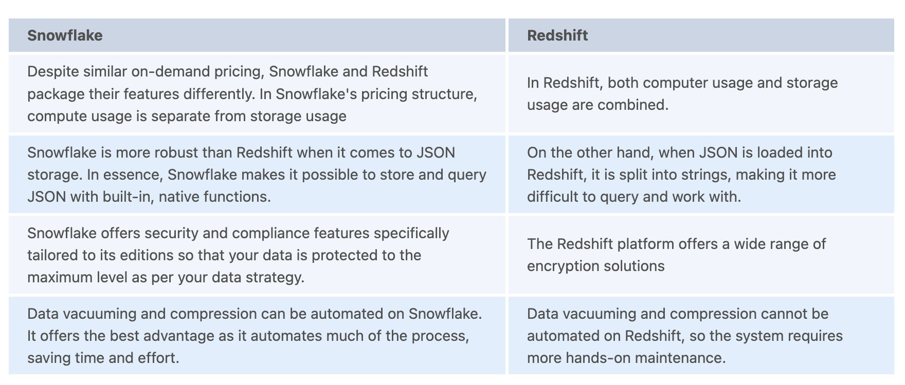

6. Explain stages in Snowflake.
   + `Stages`: locations in Snowflake where data is stored, and staging is the process of uploading data into a stage. Data that needs to be loaded or stored within Snowflake is stored either elsewhere in the other cloud regions like in AWS (Amazon Web Service) S3, GCP (Google Cloud Platform), or Azure, or is stored internally within Snowflake. When data is stored in another cloud region, this is known as an external stage; when it is stored inside a snowflake, it is known as an internal stage. Internal stages can be further categorized as follows:
     + `User stages`: pertains to a specific user, so they'll be assigned to every user by default for storing files.
     + `Table stages`: pertains to a specific database table, so they'll be assigned to every table by default.
     + `Internal named stages`: Compared to the user or table stages, these stages offer a greater degree of flexibility. As these are some of the Snowflake objects, all operations that can be performed on objects can also be performed on internally named stages. These stages must be created manually and we can specify file formats when creating these stages.

7. Explain Snowpipe.
   + `Snowpipe`: a continuous data ingestion service provided by Snowflake that loads files within minutes as soon as they are added to a stage and submitted for ingestion. Therefore, you can load data from files in micro-batches (organizing data into small groups/matches), allowing users to access the data within minutes (very less response time), rather than manually running COPY statements on a schedule to load large batches. By loading the data into micro-batches, Snowpipe makes it easier to analyze it. Snowpipe uses a combination of filenames and file checksums to ensure that only new data is processed.
     + `Advantages of Snowpipe`:
       + By eliminating roadblocks, Snowpipe facilitates real-time analytics.
       + It is cost-effective.
       + It is simple to use.
       + There is no management required.
       + It provides flexibility, resilience, and so on.

8. What do you mean by Snowflake Computing?
   + `Snowflake Computing`: refers to Snowflake's ability to provide instant, secure, and governed access to all data networks, along with its core architecture that enables multiple types of data workloads and offers a unified platform for modern data applications.  In contrast to other data warehouses, Snowflake does not use a database or "big data" software platform such as Hadoop. Snowflake, however, combines an entirely new SQL query engine with a natively cloud-based architecture.

9.  Which cloud platforms does Snowflake currently support?
    + Amazon Web Services (AWS)
    + Google Cloud Platform (GCP)
    + Microsoft Azure (Azure).

10. In Snowflake, how are data and information secured?
    + Every organization considers data security to be one of its top priorities. The Snowflake platform adheres to the best security standards in the industry to encrypt and safeguard customer data. The platform provides the best key management features at no additional charge. To protect client data, Snowflake employs the following security measures:
      + Snowflake automatically encrypts the data that it contains using a managed key.
      + Snowflake is based on Transport Layer Security (TLS) to ensure data security between customers and servers.
      + Depending on your cloud region, you can select a geographic location to store your data.

11. Is Snowflake an ETL (Extract, Transform, and Load) tool?
    + Yes, Snowflake is an ETL (Extract, Transform, and Load) tool, since it is performed in three steps, including:
      + The data is extracted from the source and saved in data files in a variety of formats including JSON, CSV, XML, and more.
      + Loads data into a stage, either internal (Snowflake managed location) or external (Microsoft Azure, Amazon S3 bucket, Google Cloud).
      + The COPY INTO command is used to copy data into the Snowflake database.
      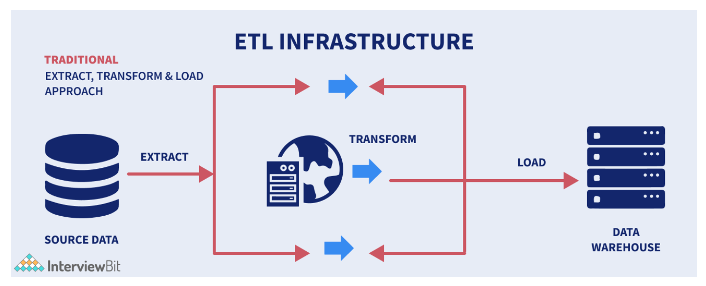

12. Which ETL tools are compatible with Snowflake?
    + Matillion
    + Blendo
    + Hevo Data
    + StreamSets
    + Etleap
    + Apache Airflow, etc.

13. What do you mean by Horizontal and Vertical Scaling?
    + `Horizontal Scaling`: increases concurrency by scaling horizontally. As your customer base grows, you can use auto-scaling to increase the number of virtual warehouses, enabling you to respond instantly to additional queries.
    + `Vertical Scaling`: involves increasing the processing power (e.g. CPU, RAM) of an existing machine. It generally involves scaling that can reduce processing time. Consider choosing a larger virtual warehouse-size if you want to optimize your workload and make it run faster.
      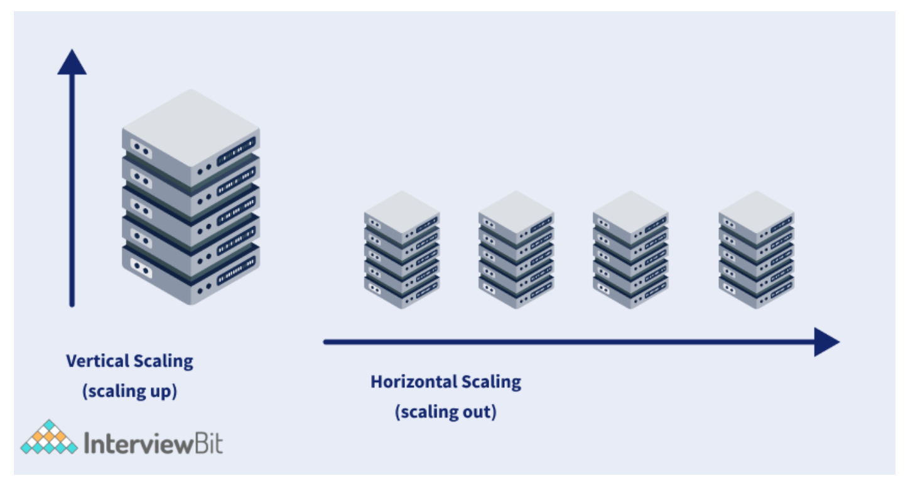

14. Is Snowflake OLTP (Online Transactional Processing) or OLAP (Online Analytical Processing)?
    + Snowflake is developed as an OLAP (Online Analytical Processing) database system, not as an OLTP (Online Transaction Processing) database system. In OLTP (Online Transaction Processing), data is collected, stored, and processed from real-time transactions, but in OLAP (Online Analytical Processing), complex queries are used to evaluate aggregated historical data from OLTP systems. Snowflake is not designed to handle much updating and inserting of small amounts of data like a transactional database would. Snowflake, for instance, cannot handle referential integrity because, even though it supports integrity and other constraints, they are not enforced except the NOT NULL constraint that is always enforced. Other constraints than NOT NULL are created as disabled constraints. However, depending on the use, we may also use it for online transaction processing (OLTP).

15. Snowflake is what kind of database?
    + All Snowflake's features are built on top of SQL (Structured Query Language) databases. The data in this relational database system is stored in columns and it is compatible with other tools, including Excel and Tableau. As a SQL database, Snowflake contains a query tool, supports multi-statement transactions, provides role-based security, etc.

16. Explain in short about Snowflake Clustering.
    + `Snowflake Clustering`: a type of data partitioning, where unique cluster keys are specified for each table. Cluster keys are subsets of a table's columns that are used to co-locate data within the table. These keys are appropriate for comprehensive tables. The process of managing clustered data in a table is known as re-clustering.

17. How is data stored in Snowflake? Explain Columnar Database.
    + After data is loaded into Snowflake, it automatically reorganizes the data into a compressed, optimized, columnar format (micro-partitions). The optimized data is then stored in the cloud storage. Snowflake manages all aspects of storing these data, including file structure, size, statistics, compression, metadata, etc. Snowflake data objects aren't visible to customers or users. Users can only access data by performing SQL queries on Snowflake. Snowflake uses a columnar format to optimize and store data within the storage layer. With it, data is stored in columns instead of rows, allowing for an analytical querying method and improving database performance. With Columnar databases, business intelligence will be easier and more accurate. Compared to row-level operations, column-level operations are faster and use fewer resources than row-level operations.
      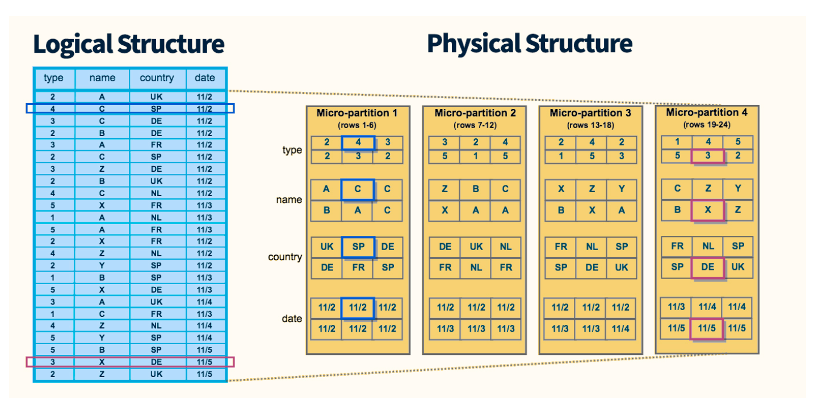
      + Above is an example of a table with 24 rows divided into four micro-partitions, arranged and sorted by column. As the data is divided into micro-partitions, Snowflake can first remove those micro-partitions not relevant to the query, followed by pruning the remaining micro-partitions by column. The result is fewer records traversed, resulting in significantly faster response times.

18. Explain Schema in Snowflake.
    + `Snowflake Schema`: describes how data is organized in Snowflake. Schemas are basically a logical grouping of database objects (such as tables, views, etc.). Snowflake schemas consist of one fact table linked to many dimension tables, which link to other dimension tables via many-to-one relationships. A fact table (stores quantitative data for analysis) is surrounded by its associated dimensions, which are related to other dimensions, forming a snowflake pattern. Measurements and facts of a business process are contained in a Fact Table, which is a key to a Dimension Table, while attributes of measurements are stored in a Dimension Table. Snowflake offers a complete set of DDL (Data Definition Language) commands for creating and maintaining databases and schemas.
      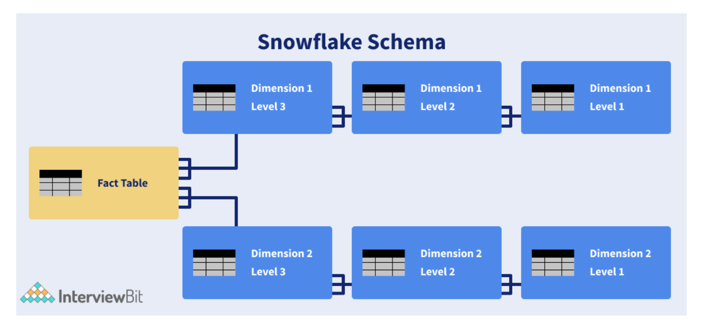
      + As shown in the above diagram, the snowflake schema has one fact table and two-dimension tables, each with three levels. Snowflake schemas can have an unlimited number of dimensions, and each dimension can have an infinite number of levels.

19. State difference between Star Schema and Snowflake Schema.
    + `Star Schema`: consists of one fact table and several associated dimension tables. The star schema is so named because the structure has the appearance of a star. Dimensions of the star schema have been denormalized. When the same values are repeated within a table, it is considered denormalization.
      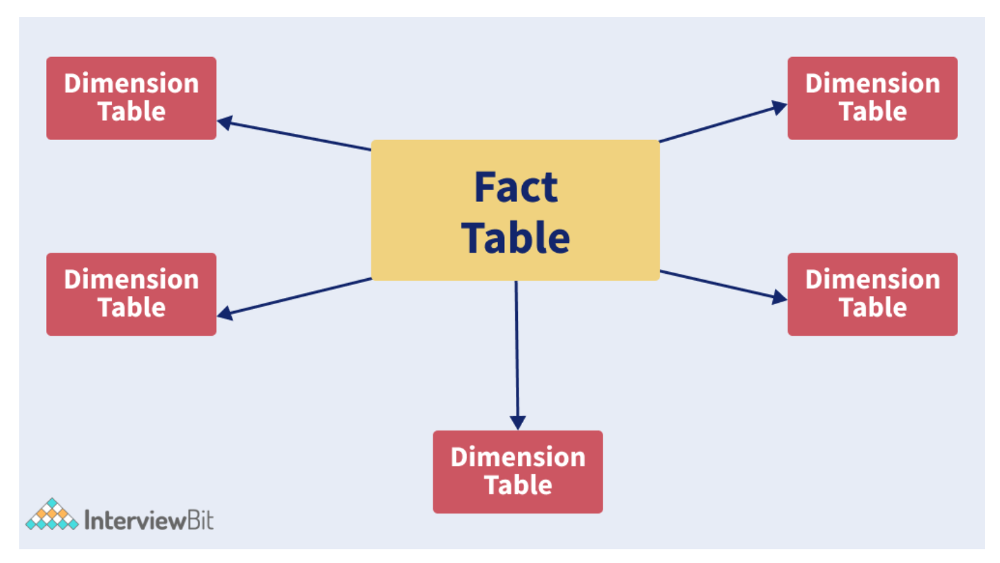
    + `Snowflake Schema`: the center has a fact table, which is associated with a number of dimension tables. Those dimension tables are in turn associated with other dimension tables. Snowflake schemas provide fully normalized data structures. Separate dimensional tables are used for the various levels of hierarchy (city > country > region).
      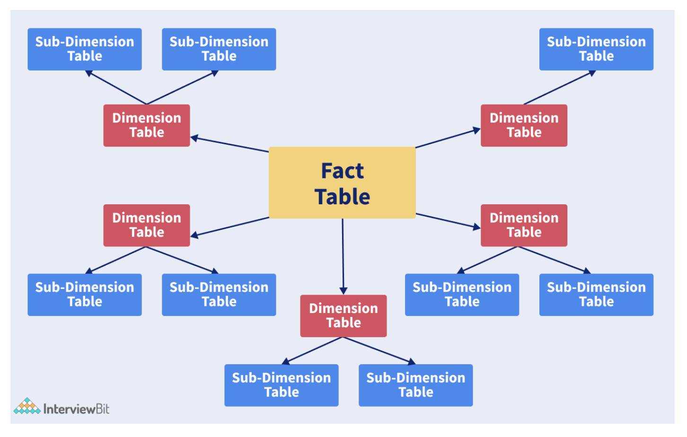

20. Explain what is Snowflake Time travel and Data Retention Period.
    + `Snowflake Time travel`: gives you access to historical data present in the Snowflake data warehouse. For example, suppose you accidentally delete a table named Employee. Using time travel, it is possible to go back five minutes in time to retrieve the data you lost. Data that has been altered or deleted can be accessed via Snowflake Time Travel at any point within a defined period. It is capable of performing the following tasks within a specific/defined period of time:
      + Analyzing data manipulations and usage over a specified period of time.
      + Restoring data-related objects (tables, schemas, and databases) that are accidentally lost (dropped)/
      + Backup and duplication of data (clones) at or before specific points in the past.
    + `Data Retention Period`: as soon as the defined/specific period of time expires, the data moves into Snowflake Fail-safe and these actions/tasks cannot be performed.

21. What is Data Retention Period in Snowflake?
    + `Data Retention Period`: a critical component of Snowflake Time Travel. When data in a table is modified, such as when data is deleted or objects containing data are removed, Snowflake preserves the state of that data before it was updated. Data retention specifies how many days historical data will be preserved, enabling Time Travel operations (SELECT, CREATE, CLONE, UNDROP, etc.) to be performed on it.
    + All Snowflake accounts have a default retention period of 1 day (24 hours). By default, the data retention period for standard objectives is 1 day, while for enterprise editions and higher accounts, it is 0 to 90 days.

22. Explain what is fail-safe.
    + `Fail-Safe`: Snowflake offers a default 7-day period during which historical data can be retrieved as a feature. Following the expiration of the Time Travel data retention period, the fail-safe default period begins. Data recovery through fail-safe is performed under best-effort conditions, and only after all other recovery options have been exhausted. Snowflake may use it to recover data that has been lost or damaged due to extreme operational failures. It may take several hours to several days for Fail-safe to complete data recovery.

23. Can you explain how Snowflake differs from AWS (Amazon Web Service)?
    + Cloud-based data warehouse platforms like Snowflake and Amazon Redshift provide excellent performance, scalability, and business intelligence tools. In terms of core functionality, both platforms provide similar capabilities, such as relational management, security, scalability, cost efficiency, etc. There are, however, several differences between them, such as pricing, user experience and deployment options.
      + There is no maintenance required with Snowflake as it is a complete SaaS (Software as a Service) offering. In contrast, AWS Redshift clusters require manual maintenance.
      + The Snowflake security model uses always-on encryption to enforce strict security checks, while Redshift uses a flexible, customizable approach.
      + Storage and computation in Snowflake are completely independent, meaning the storage costs are approximately the same as those in S3. In contrast, AWS bypasses this problem with a Red Shift spectrum and lets you query data that is directly available in S3. Despite this, it is not flawless like Snowflake.

24. Could AWS glue connect to Snowflake?
    + Yes, you can connect the Snowflake to AWS glue. AWS glue fits seamlessly into Snowflake as a data warehouse service and presents a comprehensive managed environment. Combining these two solutions makes data ingestion and transformation easier and more flexible.

25. Explain how data compression works in Snowflake and write its advantages.
    + An important aspect of data compression is the encoding, restructuring, or other modifications necessary to minimize its size. As soon as we input data into Snowflake, it is systematically compacted (compressed). Compressing and storing the data in Snowflake is achieved through modern data compression algorithms. What makes snowflake so great is that it charges customers by the size of their data after compression, not by the exact data.
      + Snowflake Compression has the following advantages:
        + Compression lowers storage costs compared with original cloud storage.
        + On-disk caches do not incur storage costs.
        + In general, data sharing and cloning involve no storage expenses.

26. Explain Snowflake caching and write its type.
    + Consider an example where a query takes 15 minutes to run or execute. Now, if you were to repeat the same query with the same frequently used data, later on, you would be doing the same work and wasting resources.
    Alternatively, Snowflake caches (stores) the results of each query you run, so whenever a new query is submitted, it checks if a matching query already exists, and if it did, it uses the cached results rather than running the new query again. Due to Snowflake's ability to fetch the results directly from the cache, query times are greatly reduced.
      + Types of Caching in Snowflake:
        + `Query Results Caching`: stores the results of all queries executed in the past 24 hours.
        + `Local Disk Caching`: used to store data used or required for performing SQL queries.  It is often referred to as
        + `Remote Disk Cache`: holds results for long-term use.
      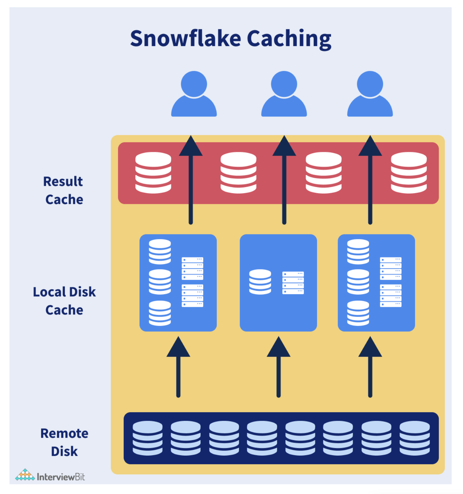

27. What are different snowflake editions?
    + Snowflake offers multiple editions to meet your organization's specific needs. In every subsequent edition, either new features are introduced or a higher level of service is provided. It's easy to switch editions as your organization's needs change.
      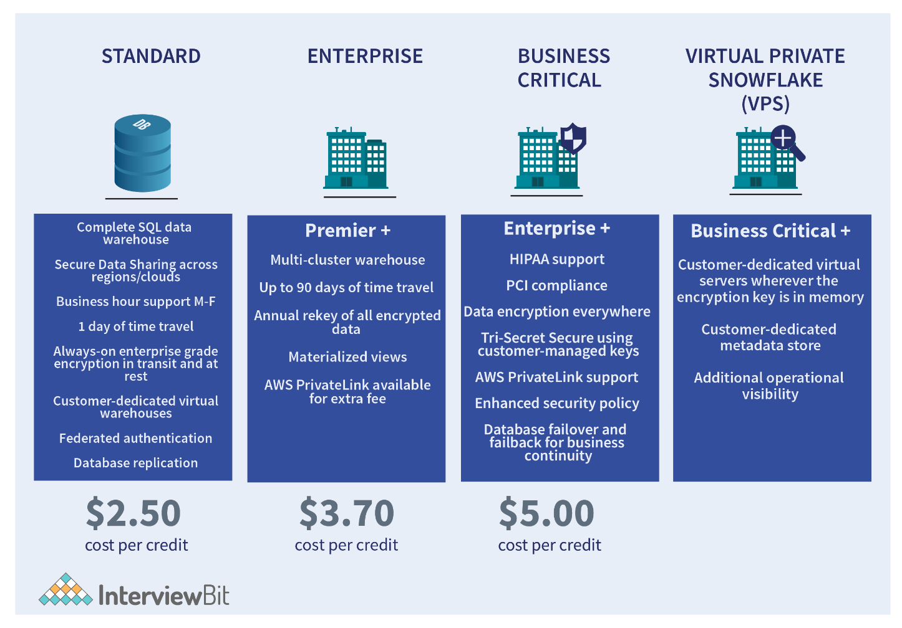
      + `Standard Edition`: Snowflake's entry-level offering, which allows full access to all of Snowflake's standard features. This edition strikes a good balance between features, level of support, and price.
      + `Enterprise Edition`: all the features and services of Standard Edition, but with some extra features designed to meet the needs of large-scale enterprises.
      + `Business-critical Edition`: previously known as Enterprise for Sensitive Data (ESD), Business Critical Edition offers even more advanced levels of data security for organizations that deal with highly sensitive data. This edition includes all the features and services of the Enterprise Edition, plus enhanced security and data protection.
      + `Virtual Private Snowflake (VPS)`: organizations with strict security requirements, like financial institutions and companies that collect, analyze, and share highly sensitive data, can get the highest level of security.

28. What do you mean by zero-copy cloning in Snowflake?
    + `Zero-copy cloning`: one of the great features of Snowflake. It basically allows you to duplicate the source object without making a physical copy of it or adding additional storage costs to it. A snapshot of the data in a source object is taken when a clone (cloned object) is created, and it is made available to the cloned object. Cloned objects are independent of the source object and are therefore writable, and any changes made to either object are not reflected in the other. The keyword CLONE allows you to copy tables, schemas, databases without actually copying any data.
      + Zero copy cloning syntax in Snowflake:
        + In order to clone an entire production database for development purposes:
          + `CREATE DATABASE Dev CLONE Prod;`
        + In order to clone a schema
          + `CREATE SCHEMA Dev.DataSchema1 CLONE Prod.DataSchema1;`
        + In order to clone a single table:
          + `CREATE TABLE C CLONE Dev.public.C;`

29. Explain what do you mean by data shares in Snowflake?
    + `Data sharing`: via Snowflake allows organizations to share data quickly and securely between Snowflake accounts. Database objects that are shared between snowflake accounts are only readable and can't be changed or modified. The three types of sharing are as follows:
      + Data sharing between management units
      + Data sharing between functional units
      + Sharing data between geographically dispersed areas.

30. What is the best way to remove a string that is an anagram of an earlier string from an array?
    + For instance, an array of strings arr is given. The task is to remove all strings that are anagrams of an earlier string, then print the remaining array in sorted order.
      + Examples:
        + Input: arr[] = { “Scaler”, “Lacers”, “Accdemy”, “Academy” }, N = 4
        + Output: [“Scaler”, “Academy”,]
        + Explanation: “Listen” and “Silent” are anagrams, so we remove “Silent”. Similarly, “Scaler” and “Lacers” are anagrams, so we remove “Lacers”.
        + Code Implementation:
          ```
          import java.util.*;
          class InterviewBit{
          // Function to remove the anagram String
          static void removeAnagrams(String arr[], int N)
          {
            // vector to store the final result
              Vector ans = new Vector();
            // A data structure to keep track of previously encountered Strings
            HashSet found = new HashSet ();
            for (int i = 0; i < N; i++) {
                String word = arr[i];
                // Sort the characters of the current String
                word = sort(word);
                // Check if the current String is not present in the hashmap
                // Then, push it into the resultant vector and insert it into the hashmap
                if (!found.contains(word)) {
                    ans.add(arr[i]);
                    found.add(word);
                }
            }
            // Sort the resultant vector of Strings
            Collections.sort(ans);
            // Print the required array
            for (int i = 0; i < ans.size(); ++i) {
                System.out.print(ans.get(i)+ " ");
            }
          }
          static String sort(String inputString)
          {
            // convert input string to char array
            char tempArray[] = inputString.toCharArray();
            // sort tempArray
            Arrays.sort(tempArray);
            // return new sorted string
            return new String(tempArray);
          }
          // Driver code
          public static void main(String[] args)
            {
            String arr[]= { "Scaler", "Lacers", "Accdemy", "Academy" };
            int N = 4;
            removeAnagrams(arr, N);
            }
          }
          ```
          + Output: `Scaler Academy`

31. What do we need to do to create temporary tables?
    + In the CREATE TABLE DDL, specify the TEMPORARY keyword (or the TEMP abbreviation) to create a temporary table. The following syntax must be used to create temporary tables:
      + `Create temporary table mytable (id number, creation_date date);`
