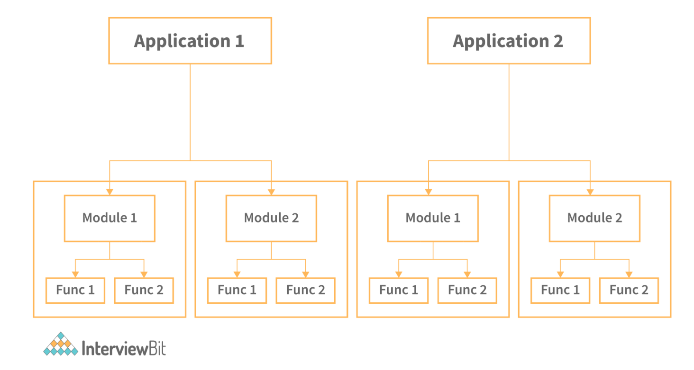

# Software Engineering Interview Questions

---

1. What are the various categories of software?
   + `System software`: Softwares like operating systems, compilers, drivers, etc. fall into this category.
   + Networking and web development software: Computer networking software offers the necessary functionality for computers to communicate with one another and with data storage facilities.
   + `Embedded Software`: Software used in instrumentation and control applications such as washing machines, satellites, microwaves, TVs, etc.
   + `Artificial Intelligence Software`: Expert systems, decision support systems, pattern recognition software, artificial neural networks, and other types of software are included in this category.
   + `Scientific software`: These support a scientific or engineering user's requirements for performing enterprise-specific tasks. Examples include MATLAB, AUTOCAD, etc.

2. What are the characteristics of software?
   + There are six major characteristics of software:
     + `Functionality`: The things that software is intended to do are called functionality. For example, a calculator's functionality is to perform mathematical operations.
     + `Efficiency`: It is the ability of the software to use the provided resources in the best way possible. Increasing the efficiency of software increases resource utilization and reduces cost.
     + `Reliability`: Reliability is the probability of failure-free operational software in an environment. It is an important characteristic of software.
     + `Usability`: It refers to the user’s experience while using the software. Usability determines the satisfaction of the user.
     + `Maintainability`: The ease with which you can repair, improve, and comprehend software code is referred to as maintainability. After the customer receives the product, a phase in the software development cycle called software maintenance begins.
     + `Portability`: It refers to the ease with which the software product can be transferred from one environment to another.
   + Apart from the above-mentioned characteristics, the software also has the following characteristics:
     + Software is engineered, it is not developed or manufactured like hardware. Development is an aspect of the hardware manufacturing process. Manufacturing does not exist in the case of software.
     + The software doesn't wear out.
     + The software is custom-built.

3. What is a framework?
   + `Framework`: is a well-known method of developing and deploying software. It is a set of tools that allows developing software by providing information on how to make it on an abstract level, rather than giving exact details. The Software Process Framework is the basis of the entire software development process. The umbrella activities are also included in the software process structure.

4. What is the main difference between a computer program and computer software?
   + The key difference between software is a collection of several programs used to complete tasks, whereas a program is a set of instructions expressed in a programming language. A program can be software, but software the vice versa is not true.

5. Describe the Software Development Process in Brief.
   + The Software Development Life Cycle (SDLC) is a number of fundamental phases that teams must follow in order to produce and deliver high-quality software. Software typically goes through the following phases:
     + `Requirements Gathering`: The team identifies, collects, and defines core issues, requirements, requests, and customer expectations related to the software application or service during this stage of the project. Generating software specifications, creating a thorough strategy, documentation, issue tracking, and project or product planning, including allocating the resources, are some tasks done during this phase.
     + `Software Design`: The team makes software design decisions regarding the architecture and make of the software solution throughout this design phase of development.
     + `Software Development`: Teams develop software solutions based on the design decisions made during earlier stages of the project
     + `Testing and Integration`: Software is packaged and tested to ensure quality. Quality assurance, often known as testing, ensures that the solutions deployed fulfil the specified quality and performance criteria.
     + `Deployment`: The software is installed in a production setting. The gathered, designed, built, and tested work is shared with the software service's customers and users.
     + `Operation and Maintenance`: The software is installed in a production setting. The work is shared with the software service's customers and users.
       

6. What are different SDLC models available?
   + Waterfall model
   + Spiral model
   + Incremental model
   + Agile Model
   + Big bang model
   + Iterative model

7. Which SDLC model is the best?
   + According to the annual State of Agile report, Agile is the best SDLC methodology and also one of the most widely used SDLC in the IT industry. The reason is that it is a hybrid of incremental and iterative approaches and works well in a flexible environment. That being said, select the model that suits your requirements.

8. What is Debugging?
   + `Debugging`: is the process of finding a software bug, in the context of software engineering. To put it another way, it refers to the process of finding, evaluating, and correcting problems. Debugging is essential once the software fails to run properly.

9.  What does a software project manager do?
    + A software product manager leads and manages the software product management department. They are in charge of the software product's specialization, goals, structure, and expectations. They also head the planning, backlog grooming, stakeholder management, and providing roadmap necessary to create the best software.

10. What is the waterfall method and what are its use cases?
    + The waterfall is the easiest and most straightforward SDLC approach in software development. In this approach, the development process is linear, and each step is finished one by one. As the name implies, development progresses downwards, much like a waterfall. The software has to cover the following phases in a waterfall model:
      + Requirements
      + Design
      + Implementation
      + Testing and integration
      + Deployment
      + Maintenance
    + `Use cases`:
      + When requirements are well-defined and unchangeable.
      + There are no ambiguous requirements or conditions.
      + When the technology is well understood
      + The project is brief, and the cast is small.
      + The risk is negligible.
    

11. What is Software scope?
    + The scope of a software project is a well-defined boundary that incorporates all the activities involved in developing and delivering a software product.  The scope defines what the product will and will not do, as well as what the final product will and will not contain. All capabilities and objects to be delivered as part of the software are explicitly defined in the software scope.

12. What are the merits of the incremental model?
    + It can deliver iteration faster, in the first iteration itself.
    + Development takes place in parallel to each other.
    + We can reduce the first delivery cost by using this method.
    + The user or client can provide feedback at each level and unexpected changes in the requirement can be avoided.
    + Risks can be identified and managed on a module-by-module basis.

13. What is Software prototyping and POC?
    + `Software prototype`: is a working model with limited functionality. The prototype may or may not contain the exact logic used in the final software program, and therefore is an additional work that should be considered in the calculation. Users can review developer proposals and try them out before they are implemented through prototyping. It also helps in comprehending user-specific details that may have been missed by the developer during product development.
    + `POC (Proof of Concept)`: is a method used by organizations to validate an idea or concept's practicality. The stage exists prior to the start of the software development process. On the basis of technical capability and business model, a mini project is built to see if a concept can be executed.

14. What are the drawbacks of the spiral model?
    + The spiral model is a hybrid of the iterative development process and the waterfall model, with a focus on risk analysis. In the SDLC Spiral model, the development process begins with a limited set of requirements and progresses through each development phase.  Until the application is ready for production, the software engineering team adds functionality for the increased requirement in ever-increasing spirals.
    + Drawbacks of the spiral model are:
      + It's significantly more complicated than other SDLC models. The procedure is intricate.
      + Due to its high cost, it is not recommended for small projects.
      + Risk Analysis is overly reliant, and it necessitates a high level of skill.
      + Time estimation is challenging
      + The spiral could continue endlessly.
    

15. What is baseline in Software Development?
    + `Baseline`: is a software development milestone and reference point marked by the completion or delivery of one or more software deliverables. The main objective of the baseline is to decrease and regulate vulnerability, or project weaknesses that can easily damage the project and lead to uncontrollable changes.

16. What is SRS?
    + `SRS`: is a formal report that serves as a representation of software that allows customers to assess whether it meets their needs. It is a list of requirements for a certain software product, program, or set of apps that execute specific tasks in a specific environment. It also includes user needs for a system, as well as precise system requirements specifications. Depending on who is writing it, it fulfils a variety of purposes.

17. What are CASE tools?
    + `CASE tools`: are a collection of software application programs that automate SDLC tasks. Analysis tools, Design tools, Project management tools, Database Management tools, and Documentation tools are a few of the CASE tools available to simplify various stages of the Software Development Life Cycle.

18. What are Verification and Validation?
    + `Verification`: The process of ensuring that software accomplishes its objectives without defects is known as verification. It's the procedure for determining whether the product being developed is correct or not. It determines whether the resulting product meets our specifications. It is mainly focused on functionality.
    + `Validation`: Validation is the process of determining whether a software product meets the required standards, or in other words, whether it meets the product's quality criteria. It is the process of verifying product validation or ensuring that the product we are building is correct. Validation focuses on the quality of the software.

19. What do you mean by Software Re-engineering?
    + The process of updating software is known as software reengineering. This procedure entails adding new features and functionalities to the software in order to make it better and more efficient.

20. What is the feasibility study?
    + As the name implies, a feasibility study is a measurement of a software product in terms of how useful product development will be for the business from a practical standpoint. Feasibility studies are conducted for a variety of reasons, including determining whether a software product is appropriate in terms of development, implementation, and project value to the business. The feasibility study concentrates on the following areas:
      + Economic feasibility
      + Technical feasibility
      + Operational feasibility
      + Legal feasibility
      + Schedule feasibility

21. Define black box testing and white box testing?
    + Black box testing is a type of high-level testing in which the primary goal is to evaluate functionalities from a behavioural standpoint. In black-box testing, the tester does not test the code; instead, they utilize the program to see if it works as expected.
    + When you have insight into the code or broad information about the architecture of the software in question, you can perform white box testing, also known as clear box testing. It falls under the category of low-level testing and is mostly concerned with integration and unit testing.  White box testing requires programming expertise or at the very least a thorough grasp of the code that implements a particular functionality.

22. What is Concurrency?
    + In software engineering, concurrency refers to a set of techniques and mechanisms that allow the software to do many tasks at the same time. Concurrency can be achieved by using languages like C++ or Java because these languages support the concept of thread. New hardware and software features are required to achieve concurrency.

23. What are Software Metrics?
    + A software metric is a quantitative measure of program properties. Software metrics can be used for a range of things, such as analyzing software performance, planning, estimating productivity, and so on. Load testing, stress testing, average failure rate, code complexities, lines of code, etc. are some software metrics. The benefits of software metrics are many, some of them being:
      + It reduces cost.
      + It increases ROI (return on investment).
      + Reduces workload.
      + Highlights areas for improvement.

24. What is the difference between cohesion and coupling?

25. What is Data Flow Diagram?
      + `Data Flow Diagram (DFD)`: shows the flow of information flows through a system. It shows data inputs, outputs, storage sites, and paths between each destination using symbols such as rectangles, circles, and arrows, as well as short text labels. Data flowcharts can range from simple to in-depth DFDs that go deeper into how data is processed. They can be used to evaluate a current system or to create a new system. A DFD can effortlessly express things that are difficult to describe in words, and it can be used by both technical and non-technical audiences.
       

26. Explain the concept of modularization.
    + `Modularization`: is ‌breaking down a program's functionality into separate, independent modules, each of which includes just the information needed to carry out one part of the intended capability. In simple terms, it is the practice of dividing the program into smaller modules so that we can deal with them separately. We can simply add independent and smaller modules to a program using modularization without being hampered by the complexity of the program's other functionalities. Modularization is based on the notion of designing applications that are easier to develop and maintain, self-contained components. In monolithic design, on the other hand, there's always the risk of a simple change knocking the entire application down. The final step would be to combine these independent modules.
      
        + In the above diagram, both the applications have been divided into smaller modules. These modules can then be dealt with separately.

27. What is Software Configuration Management (SCM)?
    + When a piece of software is created, there is always room for improvement. To modify or improve an existing solution or to establish a new solution for a problem, changes may be required. Changes to the existing system should be examined before being implemented, recorded before being implemented, documented with details of before and after, and controlled in a way that improves quality and reduces error. This is where System Configuration Management is required.
    + During the Software Development Life Cycle, Software Configuration Management (SCM) is a technique for systematically managing, organizing, and controlling changes in documents, codes, and other entities. The main goal is to enhance production while making as few mistakes as possible.

28. What are functional and non-functional requirements?

29. What is the difference between Quality Assurance and Quality control?

