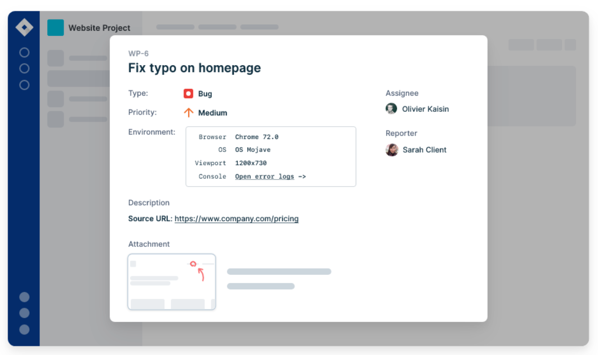

# Software Testing Interview Questions

---

## Background
Software testing is an activity conducted in the software development life-cycle to verify that the software is accurate and works according to the requirements. Testing plays an integral part in any software development project.

In its essence, software testing aims to answer the question: How does one ensure that the software does what it is supposed to do and doesn’t do what it is not supposed to do? The primary goal behind software testing is to get enough confidence that the software under testing produces the correct output for a given input.

An important thing to keep in mind when learning about software testing is that testing does not improve software quality by itself. Or that a high amount of testing doesn’t mean that the software is high quality. Testing is an indicator of quality, providing crucial feedback to the developers who created the software to take necessary action to fix the problems found in testing.

This article provides the frequently asked interview questions by the interviewer for a Software Tester or Quality Assurance (QA) position. It’s divided into three sections based on the skill set of the applicant. The fresher’s section includes software testing questions you might get asked for a junior-level position if you are recently graduated from college.

The experienced section assumes basic familiarity with the testing process and explores the advanced topics in testing. This section is suitable for someone with a few years of experience as a tester. In the end, multiple-choice questions are provided to test your understanding of testing.

---

1. What is Software testing?
   + `Software testing`: involves evaluating and verifying a software product's functionality. Basically, it checks whether the software product matches anticipated requirements and makes sure it is defect-free. It can be said that testing enhances the quality of the product by preventing bugs, reducing development costs, and reducing performance issues.

2. What are the different types of testing?
   + You can test the software in many different ways. Some types of testing are conducted by software developers and some by specialized quality assurance staff. Here are a few different kinds of software testing, along with a brief description of each.
     
     

3. What are the principles of software testing?
   +` Absence of errors fallacy`: Even if the software is 99% bug-free, it is unusable if it does not conform to the user's requirements. Software needs to be bug-free 99% of the time, and it must also meet all customer requirements.
   + `Testing shows the presence of errors`: Testing can verify the presence of defects in software, but it cannot guarantee that the software is defect-free. Testing can minimize the number of defects, but it can't remove them all.
   + `Exhaustive testing is not possible`: The software cannot be tested exhaustively, which means all possible test cases cannot be covered. Testing can only be done with a select few test cases, and it's assumed that the software will produce the right output in all cases. Taking the software through every test case will cost more, take more effort, etc., which makes it impractical.
   + `Defect clustering`: The majority of defects are typically found in a small number of modules in a project. According to the Pareto Principle, 80% of software defects arise from 20% of modules.
   + `Pesticide Paradox`: It is impossible to find new bugs by re-running the same test cases over and over again. Thus, updating or adding new test cases is necessary in order to find new bugs.
   + `Early testing`: Early testing is crucial to finding the defect in the software. In the early stages of SDLC, defects will be detected more easily and at a lower cost. Software testing should start at the initial phase of software development, which is the requirement analysis phase.
   + `Testing is context-dependent`: The testing approach varies depending on the software development context. Software needs to be tested differently depending on its type. For instance, an ed-tech site is tested differently than an Android app.

4. What is regression testing in software testing?
   + The dictionary definition of regression is the act of going back to a previous place or state. In software, regression implies that a feature that used to work suddenly stopped working after a developer added a new code or functionality to the software.
   + Regression problems are pervasive in the software industry, as new features are getting added all the time. Developers don't build these features in isolation, separate from the existing code. Instead, the new code interacts with the legacy code and modifies it in various ways, introducing side effects, whether intended or not.
   + As a result, there is always a chance that introducing new changes may negatively impact a working feature. It's important to keep in mind that even a small change has the potential to cause regression.
   + Regression testing helps ensure that the new code or modifications to the existing code don't break the present behaviour. It allows the tester to verify that the new code plays well with the legacy code.

5. What is exploratory testing?
   + Imagine a tourist in a foreign city. There are two ways in which they can explore the city.
     + Follow a map, itinerary, or a list of places they should visit
     + Explore randomly, following the streets as they lead them to new places
   + With the first approach, the tourist follows a predetermined plan and executes it. Though they may visit famous spots, they might miss out on hidden, more exciting places in the city. With the second approach, the tourist wanders around the city and might encounter strange and exotic places that the itinerary would have missed.
   + Both approaches have their pros and cons.
   + A tester is similar to a tourist when they are testing software. They can follow a strict set of test cases and test the software according to them, with the provided inputs and outputs, or they can explore the software.
   + When a tester doesn't use the test scripts or a predefined test plan and randomly tests the software, it is called exploratory testing. As the name suggests, the tester is exploring the software as an end-user would. It's a form of black-box testing.
   + In exploratory testing, the tester interacts with the software in whatever manner they want and follows the software's instructions to navigate various paths and functionality. They don't have a strict plan at hand.
   + Exploratory testing primarily focuses on behavioural testing. It is effective for getting familiar with new software features. It also provides a high-level overview of the system that helps evaluate and quickly learn the software.
   + Though it seems random, exploratory testing can be powerful in an experienced and skilled tester's hands. As it's performed without any preconceived notions of what software should and shouldn't do, it allows greater flexibility for the tester to discover hidden paths and problems along those paths.

6. What is end-to-end testing?
   + `End-to-End testing`: is the process of testing a software system from start to finish. The tester tests the software just like an end-user would. For example, to test a desktop software, the tester would install the software as the user would, open it, use the application as intended, and verify the behavior. Same for a web application.
   + There is an important difference between end-to-end testing vs. other forms of testing that are more isolated, such as unit testing. In end-to-end testing, the software is tested along with all its dependencies and integrations, such as databases, networks, file systems, and other external services.

7. What is unit testing?
   + `Unit testing`: the process of testing a single unit of code in an isolated manner. The unit of code can be a method, a class, or a module. Unit testing aims to focus on the smallest building blocks of code to get confidence to combine them later to produce fully functioning software.
   + A unit test invokes the code and verifies the result with the expected result. If the expected and actual outcomes match, then the unit test passes. Otherwise, it fails.
   + A good unit test has the following characteristics:
     + It should test a single piece of functionality.
     + It is fully automated and repeatable.
     + It should run quickly and provide immediate feedback.
     + It should be isolated and shouldn’t interact with external dependencies such as network, database, or file system unless needed. You can use the mocking technique to simulate the external dependencies and isolate the code under test.

8. What is an Application Programming Interface (API)?
   + `Application Programming Interface (API)`: It is a means of communication between two software components. An API abstracts the internal workings and complexity of a software program and allows the user of that API to solely focus on the inputs and outputs required to use it.
     
   + When building software, developers rarely write software from scratch and make use of other third-party libraries. An API allows two software components to talk to each other by providing an interface that they can understand.
   + Another use of an API is to provide data required by an application. Let's say you are building a weather application that displays the temperature. Instead of building the technology to collect the temperature yourself, you'd access the API provided by the meteorological institute.

9. What is a test environment?
   + `Test environment`: consists of a server/computer on which a tester runs their tests. It is different from a development machine and tries to represent the actual hardware on which the software will run; once it’s in production.
   + Whenever a new build of the software is released, the tester updates the test environment with the latest build and runs the regression tests suite. Once it passes, the tester moves on to testing new functionality. 

10. Explain how does a test coverage tool work?
    + When software is being tested, the code coverage measures how much of the program's source code is covered by the test plan. Code coverage testing runs in parallel with actual product testing. Using the code coverage tool, you can monitor the execution of statements in your source code. A complete report of the pending statements, along with the coverage percentage, is provided at the end of the final testing.

11. Can you describe the different types of test coverage techniques?
    + `Statement/Block Coverage`: Measures how many statements in the source code have been successfully executed and tested.
    + `Decision/Branch Coverage`: This metric measures how many decision control structures were successfully executed and tested.
    + `Path Coverage`: This ensures that the tests are conducted on every possible route through a section of the code.
    + `Function coverage`: It measures how many functions in the source code have been executed and tested at least once.

12. Explain black-box testing, white-box testing, and grey-box testing.
    + `Black-box testing`: In black-box testing, the system is tested only in terms of its external behaviour; it does not consider how the software functions on the inside. This is the only limitation of the black-box test. It is used in Acceptance Testing and System Testing.
    + `White-box testing`: A white-box test is a method of testing a program that takes into account its internal workings as part of its review. It is used in integration testing and unit testing.
    + `Grey-box testing`: A Gray Box Testing technique can be characterized as a combination of a black box as well as a white box testing technique used in the software testing process. Using this technique, you can test a software product or application with a partial understanding of its internal structure.

13. Is Automation testing in agile methodology useful?
    + It is extremely beneficial to use automation testing when using the agile model in software testing. It helps in achieving maximum test coverage in a lesser time of the sprint.

14. Explain test scenarios, test scripts, and test cases in software testing.
    + `Test Case`: Test Cases are a series of actions executed during software development to verify a particular feature or function. A test case consists of test steps, test data, preconditions, and postconditions designed to verify a specific requirement.
    + `Test Scenario`: Usually, a test scenario consists of a set of test cases covering the end-to-end functionality of a software application. A test scenario provides a high-level overview of what needs to be tested.
    + `Test Scripts`: When it comes to software testing, a test script refers to the set of instructions that will be followed in order to verify that the system under test performs as expected. The document outlines each step to be taken and the expected results.

15. What is a bug in software testing?
    + `Software bug`: is an error in the software that produces wrong results. A software tester tests the software to find bugs in it.
    + There are many causes for the bugs—for example, poor design, sloppy programming, lack of version control, or miscommunication. Throughout development, developers introduce hundreds or thousands of bugs in the system. The goal of the tester is to uncover those bugs.
    + You can find a bug in many different ways, regardless of your role. When building the software, the software developer might notice the bug in another module, written by another developer or by themselves. The tester actively tries to find the bugs as part of a routine testing process. Finally, the users could see the bugs when the software is in production.
    + All bugs, no matter how they are found, are recorded into a bug-tracking system. A triage team triages the bugs and assigns a priority to the bug, and assigns the bug to a software developer to fix it. Once the developer resolves the problem, they check in the code and mark that bug as ready for testing. Once a bug is ready for testing, it goes to the tester, who tests the software to verify if it’s indeed fixed. If it is, then it’s closed. If not, they assign it to the same developer with a description of the exact steps to reproduce the bug. Some examples of popular bug-tracking systems include BugZilla, FogBugz, etc.
    + `Trivia`: The first software bug was discovered by Admiral Grace Hopper, on September 9, 1947. After they opened a malfunctioning piece of hardware, they found an insect stuck in the relay.
      

16. State the difference between bugs and errors
  

17. What is a Test Plan? What does it include?
    + `Test Plan`: is basically a dynamic document monitored and controlled by the testing manager. The success of a testing project totally depends upon a well-written test plan document that describes software testing scope and activities. It basically serves as a blueprint that outlines the what, when, how, and more of the entire test process.
      
      + A test plan must include the following details:
        + Test Strategy
        + Test Objective
        + Test Scope
        + Reason for Testing
        + Exit/Suspension Criteria
        + Resource Planning
        + Test Deliverables.

18. What is a Test Report? What does it include?
    + `Test report`: basically a document that includes a total summary of testing objectives, activities, and results. It is very much required to reflect testing results and gives an opportunity to estimate testing results quickly. It helps us to decide whether the product is ready for release or not. It also helps us determine the current status of the project and the quality of the product. A test report must include the following details:
      + Test Objective
      + Project Information
      + Defect
      + Test Summary

19. What do you mean by Test Deliverables?
    + `Test deliverables`: also known as test artifacts, are basically a list of all of the documents, tools, and other components that are given to the stakeholders of a software project during the SDLC. Test deliverables are maintained and developed in support of the test. At every phase of SDLC, there are different deliverables as given below:
      
      + `Before Testing Phase`:
        + Test plans document.
        + Test cases documents
        + Test Design specifications.
      + `During Testing Phase`:
        + Test Scripts
        + Simulators.
        + Test Data
        + Test Traceability Matrix
        + Error logs and execution logs
      + `After testing Phase`:
        + Test Results/reports
        + Defect Report
        + Installation/ Test procedures guidelines
        + Release notes

20. What are different categories of debugging?
    + Brute force debugging
    + Backtracking
    + Cause elimination
    + Program slicing
    + Fault tree analysis

21. Write some common mistakes that lead to major issues.
    + Poor Scheduling
    + Underestimating
    + Ignoring small issues
    + Not following the exact process
    + Improper resource allocation

22. What is a user story?
    + All software has a target user. A user story describes the user's motivations and what they are trying to accomplish by using the software. Finally, it shows how the user uses the application. It ignores the design and implementation details.
    + A user story aims to focus on the value provided to the end-user instead of the exact inputs they might enter and the expected output.
    + In a user story, the tester creates user personas with real names and characteristics and tries to simulate a real-life interaction with the software. A user story often helps fish out hidden problems that are often not revealed by more formal testing processes.

23. List some of the popular software testing tools/frameworks, providing a brief description of each.
    + `Selenium`: a web browser automation tool that automates the test suites you need to run on a web browser.
    + `Protractor`: An end-to-end test framework for Angular and AngularJS applications. Protractor runs tests against your application running in a real browser, interacting with it as a user would.
    + `Cypress`: A modern front-end testing tool built for the modern web. Though it’s similar to Selenium and Protractor, it’s architecturally different from them.
    + `Jasmine`: This is an open-source JavaScript testing framework that allows you to write behaviour-driven tests.
    + `JUnit and NUnit`: These are unit testing frameworks for Java and C# programming languages, respectively.

24. What is A/B testing?
    + `A/B testing`: is the process of testing two or more different versions of your software with users to assess which performs better. It is a low-risk way of testing variations of a new or existing functionality.
    + You can choose a part of your users to use feature A. The other group uses feature B. Then user feedback and response are evaluated using statistical testing to decide the final version of the feature.
     
     + Typically, A/B testing is used to test the user experience of different interfaces. This allows the team to quickly gather feedback and test their initial hypothesis.

25. What is defects in software testing?
    + `Defect`: refers to a system error that prevents the intended action from being accomplished. Testing is most important when it comes to finding defects. Testing needs to begin early in the development process since defects can be found throughout. As shown in the following figure, defects are divided into three main categories:
      + `Wrong`: It implies incorrect implementation of requirements. There is a variance between the specifications and what was expected, resulting in this defect.
      + `Missing`: This indicates that a specification has not been implemented, or a requirement of the customer has not been properly noted.
      + `Extra`: In this case, the defect is caused by a requirement incorporated into the product that was not provided by the end-user.

26. What is Software Process Improvement and Capability Determination (SPICE) in software testing?
    + `Software Process Improvement and Capability Determination (SPICE)`: SPICE is a standard framework for assessing the efficiency and effectiveness of the development process. IEC (International Electrotechnical Commission) and ISO (International Organization for Standardization) jointly developed SPICE.

27. What do you mean by latent defect and masked defect?
    + `Latent Defect`: Latent defects are defects that exist but have not yet been invoked because the conditions required to invoke them have not been met. As a systematic flaw, it encompasses the entire production process of the software, including all pre-production testing and extended testing. When users perform a particular task in an unusual or rare situation or without the presence of usual scenarios, latent defects are revealed.
    + `Masked Defect`: These are the defects that have not yet resulted in a failure since another defect hides that portion of the code from being executed. It can only be discovered when the defect hiding it is exposed by the user through a specific operation. There are defects that are hidden or marked by another defect and remain hidden until the other defect is detected.

28. Can you explain sanity testing in software testing?
    + `Sanity testing`: refers to a subset of regression testing. The sanity testing ensures that the changes made to the code do not adversely affect the system's performance. After the software build is received, a sanity test is conducted to ensure that the changes made to the code are working correctly. As a checkpoint, this testing is used to determine whether the build can proceed with further testing. Sanity testing focuses on validating the functionality of the application rather than detailed testing.
    + `Features`:
      + It focuses on a smaller section of the application and is a subset of regression testing.
      + The process is undocumented.
      + Sanity testing is often unscripted.
      + In this approach, limited functionalities are deeply tested.
      + A tester is usually responsible for performing this task.

29. What is the purpose of TestNG?
    + `TestNG`: framework for Java is an open-source advanced test automation framework that is designed to benefit both testers and developers. The purpose of TestNG is to provide an easy-to-use, readable, structured, maintainable, and user-friendly environment for automated tests. NG stands for 'Next Generation' in TestNG. The high-end annotations, such as data providers, make cross-browser testing easier since you can test across multiple devices and browsers. Furthermore, the framework has an inbuilt mechanism for handling exceptions that prevent the program from terminating unexpectedly.

30. Is it possible to skip a method or a code block in TestNG?
    + Yes, you can skip a particular test method or code by setting the 'enabled' parameter to ‘false’ in test annotations.
      + `@Test(enabled = false)`.

31. What is the best way to set priority for test cases in TestNG?
    + Prioritizing the order of your test methods can be accomplished by defining a priority order. Consequently, the test will execute in accordance with the priority set.
    + `Syntax`: @Test(priority=2)
    + `Example`: The following code demonstrates how to set the priority of a test case in TestNG.
      ```
      package TestNG;
      import org.testng.annotations.*;
      public class SettingPriority {
      @Test(priority=0)
      public void scalermethod1() {
      }
      @Test(priority=1)
      public void scalermethod2() {
      }
      @Test(priority=2)
      public void scalermethod3() {
      }
      }
      ```
      + Test Execution Sequence:
        + ScalerMethod1
        + ScalerMethod2
        + ScalerMethod3

32. What is Object Repository?
    + `Object Repository`: is a collection of web elements and their locators that belong to the Application Under Test (AUT). The QAs maintain all element locators in a separate file known as the property file (. properties) in Selenium. During execution, it serves as a means of identifying objects between the test script and the application.

33. What are the valuable steps to resolve issues while testing?
    + `Record`: Keep track of any problems that arise and resolve them.
    + `Report`: Inform higher-level managers of the issues.
    + `Control`: Establish a process for managing issues.

34. What qualities a software tester should have?
    + Any software tester's goal is to find out as many bugs and problems in the system so that the customers don't have to. Hence, a good software tester should have a keen eye for detail. They should know the ins and outs of the software they are testing and push every aspect of the software to its limits, to identify bugs that are hard to find with the software's regular use.
    + Having the domain knowledge of the application is essential. If a tester doesn't understand the specific problems the software is trying to solve, they won't be able to test it thoroughly.
    + A good tester should keep the end-user in mind when they are testing. Having empathy with the end-user helps the tester ensure that the software is accessible and usable. Simultaneously, the tester should possess basic programming skills to think from a developer's perspective, which allows them to notice common programming errors such as null-references, out-of-memory errors, etc.
    + Communication, both written and verbal, is an essential skill for a tester. A tester will frequently have to interact with both the developers and the management. They should be able to explain the bugs and problems found during testing to the developers. For each bug found, a good tester should provide a detailed bug report consisting of all the information a developer would need to fix that problem. They should be able to make a good case to the management if they are uncomfortable releasing the software if it contains unresolved issues.

35. Explain Boundary Value Analysis (BVA) in software testing.
    + `Boundary Value Analysis (BVA)`: is a black box software testing technique that uses boundary values to create test cases. Input values near the boundary have a higher probability of error, so BVA is used to test boundary values. BVA includes values at the boundaries in the test cases. If the input falls within the boundary range, then the test is positive; if it falls outside, then it is negative. There are several types of values, including maximum or minimum, inside or outside edge, and typical or error values.

36. Explain the role of testing in software development?
    + Software testing comes into play at different times in different software development methodologies. There are two main methodologies in software development, namely Waterfall and Agile.
    + In a traditional waterfall software development model, requirements are gathered first. Then a specification document is created based on the document, which drives the design and development of the software. Finally, the testers conduct the testing at the end of the software development life cycle once the complete software system is built.
      
    + An agile software development model works in small iterations. You test the software in parallel as it is getting built. The developers build a small functionality according to the requirements. The testers test it and get customer feedback, which drives future development.
      

37. How much testing is sufficient? Or, is it possible to do exhaustive testing of the software?
    + It is impossible to exhaustively test software or prove the absence of errors, no matter how specific your test strategy is.
    + An extensive test that finds hundreds of errors doesn’t imply that it has discovered them all. There could be many more errors that the test might have missed. The absence of errors doesn’t mean there are no errors, and the software is perfect. It could easily mean ineffective or incomplete tests. To prove that a program works, you’d have to test all possible inputs and their combinations.
    + Consider a simple program that takes a string as an input that is ten characters long. To test it with each possible input, you’d have to enter 2610 names, which is impossible. Since exhaustive testing is not practical, your best strategy as a tester is to pick the test cases that are most likely to find errors. Testing is sufficient when you have enough confidence to release the software and assume it will work as expected.

38. Why developers shouldn’t test the software they wrote?
    + They try to test the code to make sure that it works, rather than testing all the ways in which it doesn't work.
    + Since they wrote it themselves, developers tend to be very optimistic about the software and don't have the correct attitude needed for testing: to break software.
    + Developers skip the more sophisticated tests that an experienced tester would perform to break the software. They follow the happy path to execute the code from start to finish with proper inputs, often not enough to get the confidence to ship software in production.
    + However, it doesn't mean that developers shouldn't test the software before sending it to the tester. Developer testing helps find many bugs that are caused by programming errors. These are hard to find for a tester because they don't always have access to the source code.

39. What is Software Development Life Cycle (SDLC) in software testing?
    + `Software Development Life Cycle (SDLC)`: enables the development of high-quality, low-cost software with the shortest possible development time. A major objective of the SDLC is to produce high-quality software that meets and exceeds the expectations of customers. SDLC provides a detailed plan with a series of stages, or phases, that encompass their own processes and deliverables. By adhering to the SDLC, developers can enhance the speed of their projects and minimize risks and costs.

40. What is the software testing life cycle?
    + Similar to software development, testing has its life cycle. During the testing, a tester goes through the following activities.
      
      + `Understand the requirements`: Before testing software or a feature, the tester must first understand what it is supposed to do. If they don’t know how the software is supposed to work, they can’t test it effectively.
      + `Test Planning and Case Development`: Once the tester has a clear understanding of the requirements, they can create a test plan. It includes the scope of testing, i.e., part of software under test and objectives for testing. Various activities are involved in planning the test, such as creating documentation, estimating the time and efforts involved, deciding the tools and platforms, and the individuals who will be conducting the tests.
      + `Prepare a test environment`: The development happens in a development environment, i.e., on a developer’s computer that might not represent the actual environment that the software will run in production. A tester prepares an environment with the test data that mimics the end user’s environment. It assists with realistic testing of the software.
      + `Generate the test data`: Though it is impossible to do exhaustive testing of the software, the tester tries to use realistic test data to give them the confidence that the software will survive the real world if it passes the tests.
      + `Test Execution`: Once the tester has a complete understanding of the software and has a test environment set up with the test data, they execute the test. Here, execution means that the tester runs the software or the feature under test and verifies the output with the expected outcome.
      + `Test Closure`: At the end of the test execution, there can be two possible outcomes. First, the tester finds a bug in the part of the software under test. In this case, they create a test record/bug report. Second, the software works as expected. Both these events indicate the end of the test cycle.

41. What is functional testing?
    + `Functional testing`: is a form of black-box testing. As the name suggests, it focuses on the software's functional requirements rather than its internal implementation. A functional requirement refers to required behavior in the system, in terms of its input and output. It validates the software against the functional requirements or the specification, ignoring the non-functional attributes such as performance, usability, and reliability.
    + Functional testing aims to answer the following questions, in particular:
      + Does the software fulfill its functional requirements?
      + Does it solve its intended users' problems?

42. What is non-functional testing?
    + `Non-functional testing`: tests the system's non-functional requirements, which refer to an attribute or quality of the system explicitly requested by the client. These include performance, security, scalability, and usability. Non-functional testing comes after functional testing. It tests the general characteristics unrelated to the functional requirements of the software. Non-functional testing ensures that the software is secure, scalable, high-performance, and won't crash under heavy load.

43. What is a bug report?
    + During testing, a tester records their observations, findings, and other information useful to the developers or the management. All this data belongs to a test record, also called a bug report.
    + A detailed bug report is an important artifact produced during testing. It helps the team members with:
      + Understand the problem,
      + Steps to reproduce the problem,
      + The environment and the specific conditions under which it happens, and
      + The resolution if/when the developers fix the problem.
      
      + For example, here is a picture of a bug reported on Jira, a popular bug-tracking software.
        

44. What are some important testing metrics?
    + Testing metrics provide a high-level overview to the management or the developers on how the project is going and the next action steps.
      
      + Total number of defects found, ordered by their severity
      + Total number of bugs fixed
      + Total number of problems caused by an error in the source code vs. configuration or external environmental factors
      + Bug find and fix rate over time
      + Bugs by produce/feature area
      + The average time is taken by a bug since it’s found and fixed. 
      + Total time spent on new feature development vs. time spent on resolving bugs and failures
      + Number of outstanding bugs before a release
      + Bugs/failures reported by the customers vs. those found by the testers

45. What is Test-Driven-Development (TDD)?
    + `Test-Driven-Development (TDD)`: is a popular software development technique, first introduced by Kent Beck in his book with the same name, published in 1999.
    + In TDD, a developer working on a feature first writes a failing test, then writes just enough code to make that test pass. Once they have a passing test, they add another failing test and then write just enough code to pass the failing test. This cycle repeats until the developer has the fully working feature. If the code under the test has external dependencies such as database, files, or network, you can mock them to isolate the code.
      
      + `Benefits of TDD`:
        + Writing tests first forces you to think about the feature you are trying to build, helping you produce better code.
        + As you always have a working set of tests at hand, a failing test indicates that the problem is with the code you just added, reducing the time spent in debugging.
        + Writing tests help the developer to clarify the requirements and specification. It’s challenging to write good tests for a poor set of requirements.
        + It’s tough to produce high-quality software unless you can test the software after each new change. You can never be sure that your new code didn’t break the working software. TDD gives you the confidence to add new code, as you already have a test in place.

46. What is Selenium? What are its benefits?
    + `Selenium`: is a web browser automation tool that automates the test suits you need to run on a web browser.
      + Some of the benefits of Selenium include:
        + It is open-source software, eliminating licensing costs.
        + It supports all the major languages, such as Java, C#, Python, Ruby, etc.
        + It supports all the major web browsers, e.g., Google Chrome, Firefox, Safari, etc.
        + You can integrate it with other testing frameworks and tools to build a comprehensive test suite for your software.

47. What are the various components of Selenium?
    + Selenium Remote Control (RC).
    + Selenium Integrated Development Environment (IDE).
    + Selenium WebDriver.
    + Selenium Grid.

48. What is cross-browser testing?
    + All web applications run in browsers such as Google Chrome, Mozilla Firefox, Internet Explorer, Safari, etc. Though they all work primarily the same in implementing the web standards, there are subtle differences in all of them. When building the software, it’s not always possible for the software developer to meticulously test the feature on multiple browsers, noticing the subtle inconsistencies.
      
    + In cross-browser testing, a software tester launches the web application in all the supported browsers and tries to test the same functionality on all of them. They note any unexpected behavior in a browser that doesn’t work as expected or looks different; note the behavior and the browser name and version in the test report. This helps the programmer to fix the behavior in all the browsers where it doesn't work as intended. 

49. What are the different HTTP status codes that a server can return?
    + An HTTP status code is a three-digit number that indicates the status of an incoming HTTP request, that is, if the request has been completed or not.
      
    + A server can send the following five types of responses for an HTTP request.
      + `Information (100 - 199)`: These status codes provide a temporary response. The response consists of the status line and optional headers and terminates by an empty line.
      + `Success (200 - 299)`: Indicate that the incoming HTTP request was successfully received, understood, and accepted.
      + `Redirect (300 - 399)`: These status codes indicate further actions the client should take to satisfy the HTTP request. It can mean that the requested resource may have moved temporarily or permanently. It can also redirect the client to another URL.
      + `Client error (400 - 499)`: Indicate a problem with the client who initiated the HTTP request.
      + `Server error (500 - 599)`: The 5XX status code indicates a problem on the server while processing the request.

50. What is automated testing?
    + `Automated testing`: which is also called test automation, is the programmatic execution of the tests. The tester uses an automation tool or software like Selenium to write code that performs the following tasks.
      + Automatically run the software.
      + Feed the input data to the system.
      + Examine the output with the expected outcome.
      + Fail the test if the results don’t match. Otherwise, pass the test.
    + Once a test is automated, you can run it as often as you want, to check if any new code has broken it. It enables you to spend your time on other high-value tests, such as exploratory testing that help find bugs that an automated test would miss.
    + Automated testing is beneficial for repetitive testing with inputs that don’t change frequently. Humans get tired and bored from conducting the same tests repeatedly and seeing the same results. It’s easy to make mistakes when you are testing a feature for the twentieth time. Software is much better at doing repetitive tasks without getting tired or making mistakes than a human operator would.

51. What is the most effective way to map automation testing success?
    + The success of Automation testing can be measured using the following criteria:
      + Savings on labor & other costs.
      + Defect Detection Ratio.
      + Automating the execution process and reducing the release time.

52. What are the different types of severity you can assign to a bug?
    + Though it varies depending on the size and structure of the software development teams, typically, a bug can be assigned the following types of severities, going from low to high:
      + `Low`:
        + User Interface bugs.
        + Accessibility issues.
      + `Medium`:
        + Leaky abstractions.
        + Software hangs.
        + Users unable to perform a specific action.
        + Boundary conditions.
      + `High`:
        + Crashing under high load.
        + Business logic and/or calculation errors.
        + Any user action that causes the software to crash.
        + Exposing sensitive user data.
        + Security problems.
        + Loss of data.

53. Which test cases are written first: white boxes or black boxes?
    + Test cases for the black box testing are usually written first, followed by test cases for the white box testing. An outline of the design or project plan and the requirements document is required to write black-box test cases. Documents such as these are readily available at the beginning of the project. The initial phase of a project isn't the right time to start white box testing because it requires more architecture clarification that isn't available yet. Therefore, white-box test cases are typically written after black-box test cases have been developed.

54. What is alpha testing?
    + Before you ship the software to the customers, the internal testing team performs alpha testing. Alpha testing is part of the user acceptance testing. Its goal is to identify bugs before the customers start using the software.

55. What is beta testing?
    + Once you ship the software to the customers after alpha testing, the software's actual users perform the beta testing in a real production environment. It is one of the final components of user acceptance testing. Beta testing is helpful to get feedback from real people using your software in real environments. 

56. What is meant by browser automation?
    + It’s a process of automatically testing a web application’s functionality in a browser, where a program launches the browser, navigates to the application, and interacts with the user interface by clicking buttons or links, just like an average user would.
    + The only difference is that the browser automation can test this very quickly and often, whereas the same test would take a human tester a long time. It’s part of automated testing. Some essential tools for browser testing include Selenium, protractor.js, and cypress.

57. What do you mean by Test Matrix and Traceability Matrix?
    + `Test Matrix`: It is referred to as a testing tool that is used to capture actual quality, effort, resources, plan, and time required to capture all the phases of software testing. It only covers the testing phase of the life cycle.
    + `Requirement Traceability Matrix (RTM)`: It is referred to as a document, usually present in the form table, that is used to trace and demonstrate the relationship between the requirements and other artifacts of the project right from start to end. In simple words, it maps between test cases and customer requirements.

58. What is the V model in software testing?
    + `V-models`: also known as validation or verification models, are SDLC models where the process occurs sequentially in a V-shape. This method consists of associating a testing phase with each corresponding development stage. As each development activity is accompanied by a testing activity, the next test phase occurs only after the previous phase has been completed.
      + `Validation`: It is defined as a process that involves dynamic testing of software products by executing the code. This process validates whether we are building the right software that meets that customer's requirement or not. It involves various activities like system testing, integration testing, user acceptance testing, and unit testing.
      + `Verification`: The technique involves static analysis (review) without running the code. It is defined as a process that involves analyzing the documents. This process verifies whether the software conforms to specifications or not.  Its ultimate goal is to ensure the quality of software products, design, architecture, etc.

59. State difference between verification and validation in software testing.
    + `Validation`: It is defined as a process that involves dynamic testing of software products by running it. This process validates whether we are building the right software that meets that customer requirement or not. It involves various activities like system testing, integration testing, user acceptance testing, and unit testing.
    + `Verification`: It is defined as a process that involves analyzing the documents. This process verifies whether the software conforms to specifications or not.  Its ultimate goal is to ensure the quality of software products, design, architecture, etc.
    
    

60. What is static software testing?
    + `Static testing`: is a technique in which you test the software without actually executing it. It involves doing code walkthroughs, code reviews, peer-reviews, or using sophisticated tools such as eslint, StyleCop to perform static analysis of the source code. Static testing is typically performed during software development.
     

61. What is dynamic software testing?
    + `Dynamic software testing`: tests the software when it’s executing. The tester runs the software in a test environment and goes through all the steps involved, entering the inputs and verifying the actual output with the expected result.

62. What do you mean by confirmation testing in software testing?
    + `Confirmation test`: involves retesting a software product to see if the previously reported bugs have been fixed. A bug is usually reported by testers when a test fails. A new version of the software is released after the development team fixes the defect. Now that the new software build has been released, the testing team will retest it in order to ensure that the reported bug was actually fixed. It is also referred to as retesting.

63. What is the defect life cycle?
    + `Defect life cycle`: also known as a bug life cycle, is a life cycle of various stages through which a defect goes during its whole lifetime. This life cycle starts as soon as the defect is discovered or reported by the tester and ends when the tester ensures that the defect is resolved and it won't occur again. The defect life cycle includes the steps as shown below:
      

64. What is defect cascading in Software testing?
    + `Defect cascading`: is the scenario in which one defect leads to the occurrence of several other defects in a program. If a defect goes unnoticed during testing or if it doesn't get reported, it has the potential to trigger other problems. The result is that multiple defects arise during the later stages of the production process.

65. A defect that could have been removed during the initial stage is later removed. What effect does this have on the cost?
    + If a defect is discovered during the project's initial phase, it is important that the defect is removed during that phase rather than afterwards. The cost of fixing a defect increases greatly if it is delayed until a later stage in the development cycle. Following is a diagram showing how the cost of a fixing defect increases throughout the phases.
    + It is more cost-effective to eliminate defects during the design phase, but it becomes twenty times more expensive to do so during maintenance.

66. What is meant by the workbench concept?
    + `Workbench`: a document that explains how an activity should be completed. Often, it is referred to as a step, phase, or task. Workbenches serve as platforms for building and monitoring testers' work structures. Using this method, it is possible to divide tasks into each phase and to reach the customer's expectations using the initial data.
      + Every workbench has five tasks, which are as follows:
        + Input.
        + Execute.
        + Check.
        + Production output.
        + Rework.

67. When there is neither a frame ID nor a frame name, what technique should be considered in the script?
    + When frame name and frame id are unavailable, we can use frame index instead. Suppose there are four frames on a page that don't have frame names or frame identifiers (frame ID), but we can still select them with the frame (zero-based) index attribute. For instance, the first frame would be indexed 0, the second frame would be at index 1, the third frame would be at index 2, and the fourth frame would be at index 3.
      + `driver.switchTo().frame(int arg0);`

68. How can Selenium WebDriver be used to detect broken links?
    + You might be asked this tricky question by the interviewer. As an example, he could give you a web page with 20 links, and you would have to determine which of those 20 links are working and which aren't or are broken.
    + Considering that you must verify the functionality of each link, the workaround is to send HTTP requests to each link and analyze the response. When you navigate to a URL using the driver.get() method, you will receive a 200 - OK status response. It is evident that the link has been obtained and is working. In the case of any other status, the link is broken.
      + Let’s now understand how to do that.
        + As a first step, we must determine the different hyperlinks on the webpage using anchor tags. We can obtain hyperlinks for each tag using the attribute 'href' value and analyze the response received using the driver.get() method.
