# System Design Interview Questions

---

1. What is CAP theorem?
   + CAP(Consistency-Availability-Partition Tolerance) theorem says that a distributed system cannot guarantee C, A and P simultaneously. It can at max provide any 2 of the 3 guarantees. Let us understand this with the help of a distributed database system.
     + Consistency: This states that the data has to remain consistent after the execution of an operation in the database. For example, post database updation, all queries should retrieve the same result.
     + Availability: The databases cannot have downtime and should be available and responsive always.
     + Partition Tolerance: The database system should be functioning despite the communication becoming unstable.
   + The following image represents what databases guarantee what aspects of the CAP Theorem simultaneously. We see that RDBMS databases guarantee consistency and Availability simultaneously. Redis, MongoDB, Hbase databases guarantee Consistency and Partition Tolerance. Cassandra, CouchDB guarantees Availability and Partition Tolerance.
     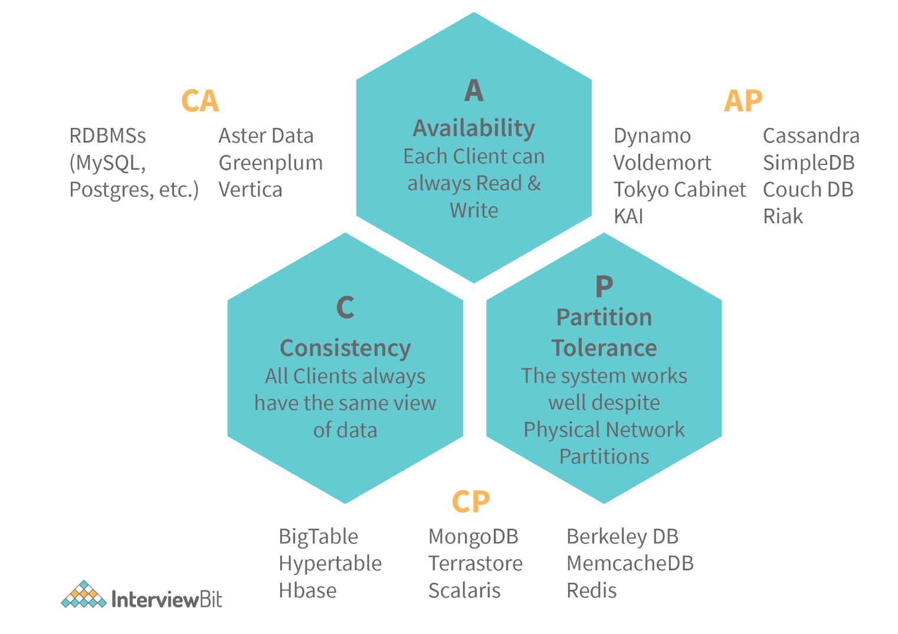

2. How is Horizontal scaling different from Vertical scaling?
   + Horizontal scaling refers to the addition of more computing machines to the network that shares the processing and memory workload across a distributed network of devices. In simple words, more instances of servers are added to the existing pool and the traffic load is distributed across these devices in an efficient manner.
   + Vertical scaling refers to the concept of upgrading the resource capacity such as increasing RAM, adding efficient processors etc of a single machine or switching to a new machine with more capacity. The capability of the server can be enhanced without the need for code manipulation.
   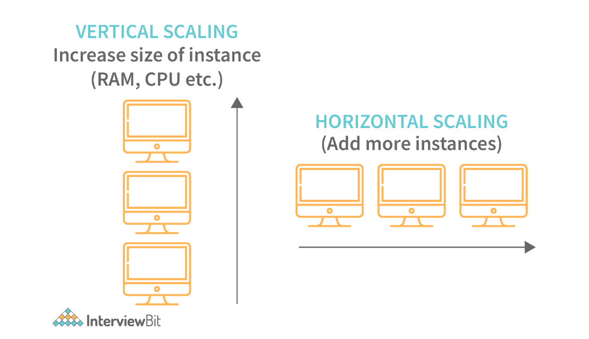
   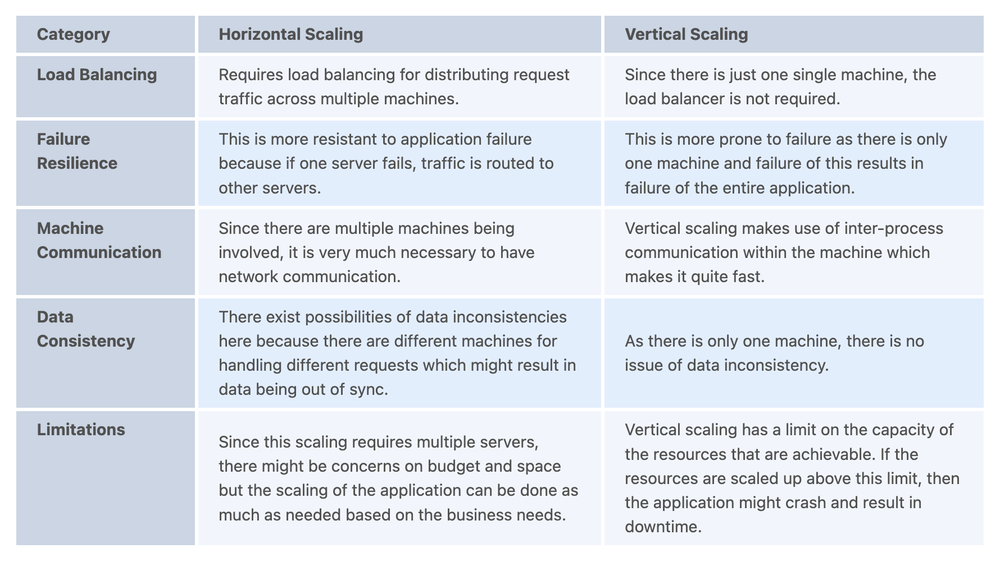

3. What do you understand by load balancing? Why is it important in system design?
   + Load balancing refers to the concept of distributing incoming traffic efficiently across a group of various backend servers. These servers are called server pools. Modern-day websites are designed to serve millions of requests from clients and return the responses in a fast and reliable manner. In order to serve these requests, the addition of more servers is required. In such a scenario, it is essential to distribute request traffic efficiently across each server so that they do not face undue loads. Load balancer acts as a traffic police cop facing the requests and routes them across the available servers in a way that not a single server is overwhelmed which could possibly degrade the application performance.
     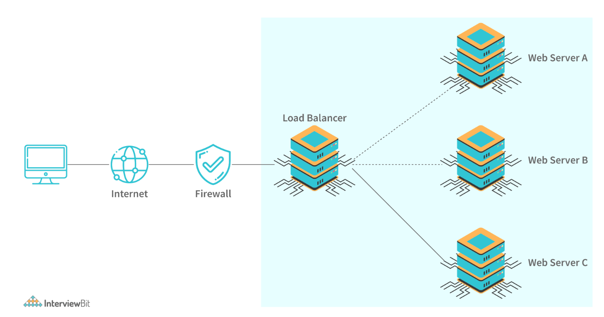
   + When a server goes down, the load balancer redirects traffic to the remaining available servers. When a new server gets added to the configuration, the requests are automatically redirected to it. Following are the benefits of load balancers:
     + They help to prevent requests from going to unhealthy or unavailable servers.
     + Helps to prevent resources overloading.
     + Helps to eliminate a single point of failure since the requests are routed to available servers whenever a server goes down.
     + Requests sent to the servers are encrypted and the responses are decrypted. It aids in SSL termination and removes the need to install X.509 certificates on every server.
     + Load balancing impacts system security and allows continuous software updates for accomodating changes in the system.

4. What do you understand by Latency, throughput, and availability of a system?
   + Performance is an important factor in system design as it helps in making our services fast and reliable. Following are the three key metrics for measuring the performance:
     + Latency: This is the time taken in milliseconds for delivering a single message.
     + Throughput: This is the amount of data successfully transmitted through a system in a given amount of time. It is measured in bits per second.
     + Availability: This determines the amount of time a system is available to respond to requests. It is calculated: System Uptime / (System Uptime+Downtime).

5. What is Sharding?
   + Sharding is a process of splitting the large logical dataset into multiple databases. It also refers to horizontal partitioning of data as it will be stored on multiple machines. By doing so, a sharded database becomes capable of handling more requests than a single large machine. Consider an example - in the following image, assume that we have around 1TB of data present in the database, when we perform sharding, we divide the large 1TB data into smaller chunks of 256GB into partitions called shards.
     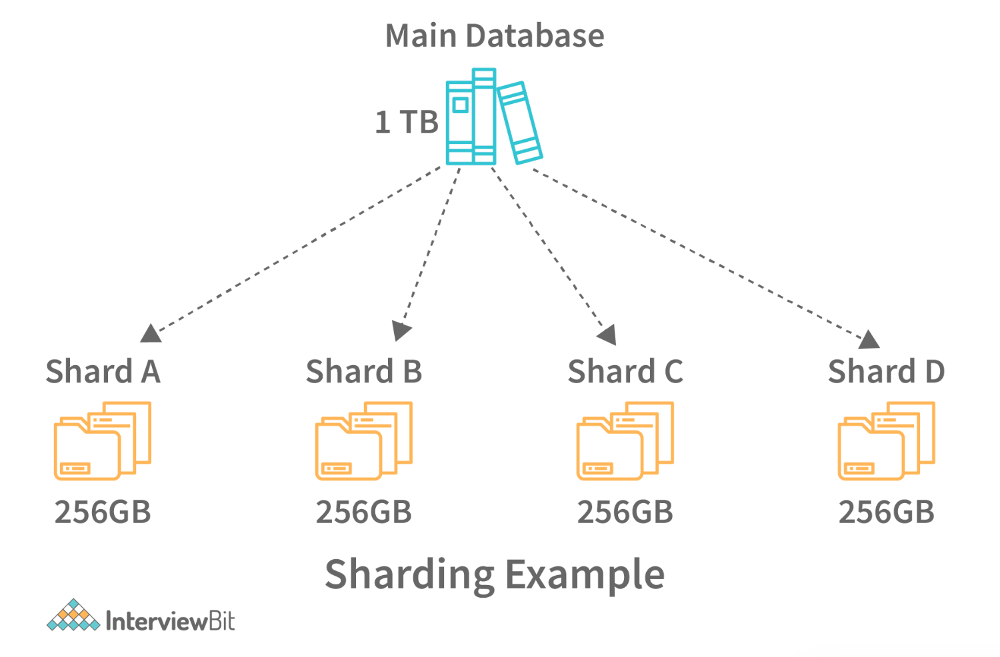
   + Sharding helps to scale databases by helping to handle the increased load by providing increased throughput, storage capacity and ensuring high availability.

6. How is NoSQL database different from SQL databases?
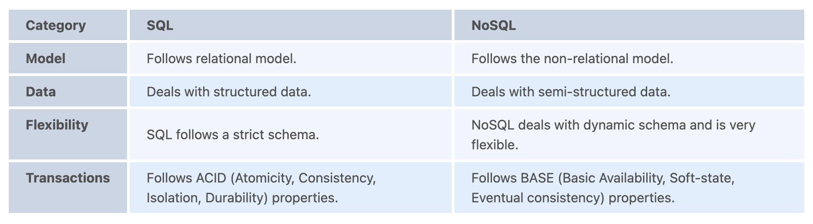

7. How is sharding different from partitioning?
   + Database Sharding - Sharding is a technique for dividing a single dataset among many databases, allowing it to be stored across multiple workstations. Larger datasets can be divided into smaller parts and stored in numerous data nodes, boosting the system’s total storage capacity. A sharded database, similarly, can accommodate more requests than a single system by dividing the data over numerous machines. Sharding, also known as horizontal scaling or scale-out, is a type of scaling in which more nodes are added to distribute the load. Horizontal scaling provides near-limitless scalability for handling large amounts of data and high-volume tasks.
   + Database Partitioning - Partitioning is the process of separating stored database objects (tables, indexes, and views) into distinct portions. Large database items are partitioned to improve controllability, performance, and availability. Partitioning can enhance performance when accessing partitioned tables in specific instances. Partitioning can act as a leading column in indexes, reducing index size and increasing the likelihood of finding the most desired indexes in memory. When a large portion of one area is used in the resultset, scanning that region is much faster than accessing data scattered throughout the entire table by index. Adding and deleting sections allows for large-scale data uploading and deletion, which improves performance. Data that are rarely used can be uploaded to more affordable data storage devices.
   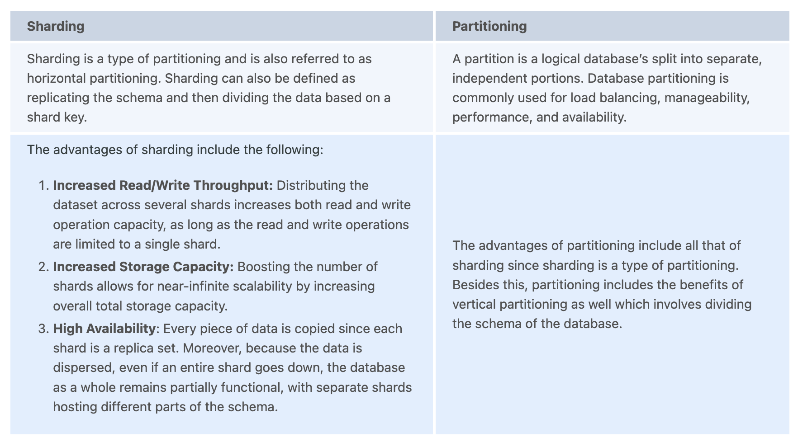

8. How is performance and scalability related to each other?
   + A system is said to be scalable if there is increased performance is proportional to the resources added. Generally, performance increase in terms of scalability refers to serving more work units. But this can also mean being able to handle larger work units when datasets grow. If there is a performance problem in the application, then the system will be slow only for a single user. But if there is a scalability problem, then the system may be fast for a single user but it can get slow under heavy user load on the application.

9.  What is Caching? What are the various cache update strategies available in caching?
    + Caching refers to the process of storing file copies in a temporary storage location called cache which helps in accessing data more quickly thereby reducing site latency. The cache can only store a limited amount of data. Due to this, it is important to determine cache update strategies that are best suited for the business requirements. Following are the various caching strategies available:
      + Cache-aside: In this strategy, our application is responsible to write and read data from the storage. Cache interaction with the storage is not direct. Here, the application looks for an entry in the cache, if the result is not found, then the entry is fetched from the database and is added to the cache for further use. Memcached is an example of using this update strategy
        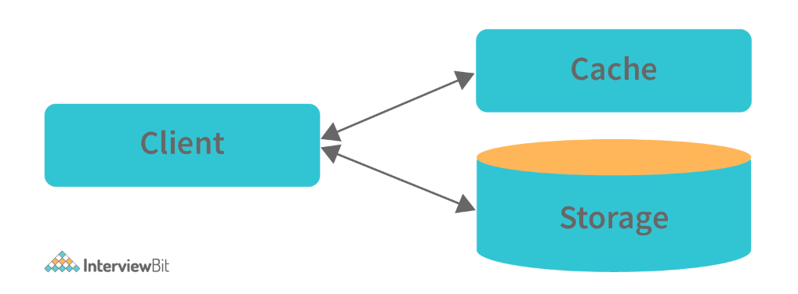
        + Cache-aside strategy is also known as lazy loading because only the requested entry will be cached thereby avoiding unnecessary caching of the data. Some of the disadvantages of this strategy are:
          + In cases of a cache miss, there would be a noticeable delay as it results in fetching data from the database and then caching it.
          + The chances of data being stale are more if it is updated in the database. This can be reduced by defining the time-to-live parameter which forces an update of the cache entry.
          + When a cache node fails, it will be replaced by a new, empty node which results in increased latency.
          + Write-through: In this strategy, the cache will be considered as the main data store by the system and the system reads and writes data into it. The cache then updates the database accordingly as shown in the database.
            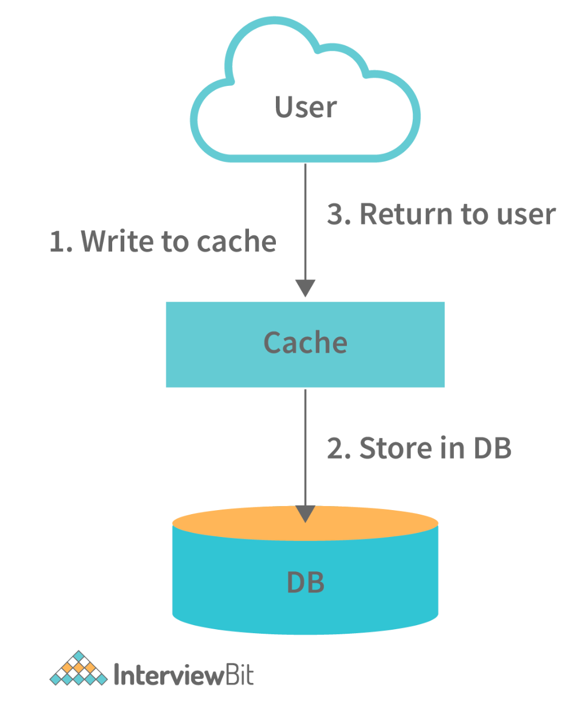
            + The system adds or updates the entry in the cache.
            + The cache synchronously writes entries to the database. This strategy is overall a slow operation because of the synchronous write operation. However, the subsequent reads of the recently written data will be very fast. This strategy also ensures that the cache is not stale. But, there are chances that the data written in the cache might never be read. This issue can be reduced by providing appropriate TTL.
          + Write-behind (write-back): In this strategy, the application does the following steps:
            + Add or update an entry in the cache
            + Write the entry into the data store asynchronously for improving the write performance. This is demonstrated in the image below:
              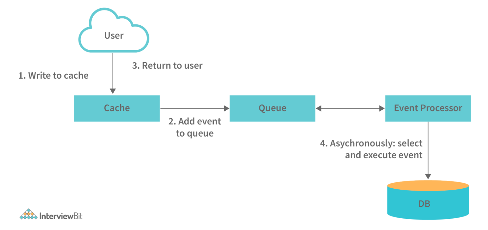
            + The main disadvantage of this method is that there are chances of data loss if the cache goes down before the contents of the cache are written into the database.
          + Refresh-ahead: Using this strategy, we can configure the cache to refresh the cache entry automatically before its expiration.
            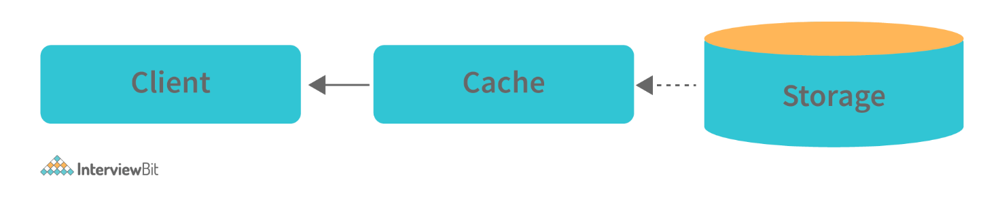
            + This cache strategy results in reduced latency if it can predict accurately what items are needed in future.

10. What are the various Consistency patterns available in system design?
    + Consistency from the CAP theorem states that every read request should get the most recently written data. When there are multiple data copies available, there arises a problem of synchronizing them so that the clients get fresh data consistently. Following are the consistency patterns available:
      + Weak consistency: After a data write, the read request may or may not be able to get the new data. This type of consistency works well in real-time use cases like VoIP, video chat, real-time multiplayer games etc. For example, when we are on a phone call, if we lose network for a few seconds, then we lose information about what was spoken during that time.
      + Eventual consistency: Post data write, the reads will eventually see the latest data within milliseconds. Here, the data is replicated asynchronously. These are seen in DNS and email systems. This works well in highly available systems.
      + Strong consistency: After a data write, the subsequent reads will see the latest data. Here, the data is replicated synchronously. This is seen in RDBMS and file systems and are suitable in systems requiring transactions of data.

11. What do you understand by Content delivery network?
    + Content delivery network or in short CDN is a globally distributed proxy server network that serves content from locations close by to the end-users. Usually, in websites, static files like HTML, CSS, JS files, images and videos are served from CDN.
    + Using CDN in delivering content helps to improve performance:
      + Since users receive data from centres close to them as shown in the image below, they don't have to wait for long.
        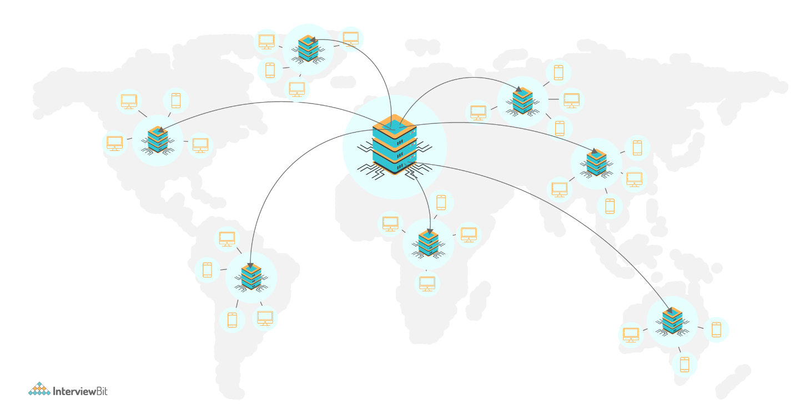
      + Load on the servers is reduced significantly as some of the responsibility is shared by CDNs. There are two types of CDNs, they are:
        + Push CDNs: Here, the content is received by the CDNs whenever changes occur on the server. The responsibility lies in us for uploading the content to CDNs. Content gets updated to the CDN only when it is modified or added which in turn maximises storage by minimising the traffic. Generally, sites with lesser traffic or content work well using push CDNs.
        + Pull CDNs: Here new content is grabbed from the server when the first user requests the content from the site. This leads to slower requests for the first time till the content gets stored/cached on the CDN. These CDNs minimizes space utilized on CDN but can lead to redundant traffic when expired files are pulled before they are changed. Websites having heavy traffic work well when used with pull CDNs.

12. What do you understand by Leader Election?
    + In a distributed environment where there are multiple servers contributing to the availability of the application, there can be situations where only one server has to take lead for updating third party APIs as different servers could cause problems while using the third party APIs. This server is called the primary server and the process of choosing this server is called leader election. The servers in the distributed environment have to detect when the leader server has failed and appoint another one to become a leader. This process is most suitable in high availability and strong consistency based applications by using a consensus algorithm.

13. How do you answer system design interview questions?
    + Ask questions to the interviewer for clarification: Since the questions are purposefully vague, it is advised to ask relevant questions to the interviewer to ensure that both you and the interviewer are on the same page. Asking questions also shows that you care about the customer requirements.
    + Gather the requirements: List all the features that are required, what are the common problems and system performance parameters that are expected by the system to handle. This step helps the interviewer to see how well you plan, expect problems and come up with solutions to each of them. Every choice matters while designing a system. For every choice, at least one pros and cons of the system needs to be listed.
    + Come up with a design: Come up with a high-level design and low-level design solutions for each of the requirements decided. Discuss the pros and cons of the design. Also, discuss how they are beneficial to the business.
    + The primary objective of system design interviews is to evaluate how well a developer can plan, prioritize, evaluate various options to choose the best possible solution for a given problem.

14. What are some of the design issues in distributed systems?
    + Heterogeneity: The Internet allows applications to run over a heterogeneous collection of computers and networks. There would be different types of networks and the differences are masked by the usage of standard Internet protocols for communicating with each other. This becomes an issue while designing distributed applications
    + Openness: Openness represents the measure by which a system can be extended and re-implemented in different ways. In distributed systems, it specifies the degree to which new sharing services can be added and made available for client usage.
    + Security: The information maintained in distributed systems need to be secure as they are valuable to the users. The confidentiality, availability and integrity of the distributed systems have to be maintained and this sometimes becomes a challenge.
    + Scalability: A system is scalable if it remains effective when there is a significant increase in the request traffic and resources. Designing a distributed system involves planning well in advance how well the system can be made scalable under varying user loads.
    + Failure Handling: In a distributed environment, the failures are partial, meaning if some components fail, others would still function. It becomes challenging to handle these failures as it involves identifying right components where the failures occur.

15. Design a global chat service like Whatsapp or a facebook messenger.
    + What are some of the required features?
      + Allow users to chat over the internet.
      + Provide support for one-on-one and group chats.
      + Messages need to be stored for better viewing.
      + Messages need to be encrypted for security purposes.
    + What are some of the common problems that can be encountered?
      + What would happen to a message if it is sent without an internet connection?
      + Will encrypting and decrypting increase the latency?
      + How are the messages sent and notified to the device?
    + Possible Tips for consideration:
      + Split database schema into multiple tables such as user table, chat table, massage table etc.
      + Make use of web sockets for bi-directional communication between the device and the server.
      + Make use of push notifications for notifying the members even if they are online.

16. How do you design a URL shortening service like TinyURL or bit.ly?
    + TinyURL or bit.ly takes a long URL and generates a new unique short URL. These systems are also capable of taking the shortened URL and returning the original full URL.
      + What are some of the Required Features?
        + Generate a short URL having a length shorter than the original URL.
        + Store the original URL and map it to the shortened one.
        + Allow redirects in the shortened URLs.
        + Support custom names for short URLs.
        + Handle multiple requests at the same time.
      + What are some of the Common Problems encountered?
        + What if two users input the same custom URL?
        + What happens if there are more user load than expected?
        + How do you regulate the database storage space?
      + Possible tips for consideration:
        + The concept of hashing can be used for linking original and new URLs.
        + REST API can be used for balancing high traffic and handling front-end communication.
        + Multithreading concept for handling multiple requests at the same time.
        + NoSQL databases for storing original URLs.

17. Design a forum-like systems like Quora, Reddit or HackerNews.
    + These sites are meant for posting questions and answering them, showing newsfeed highlighting popular questions based on tags and related topics.
      + What are some of the Required Features?
        + Users should be able to create public posts and apply tags to them.
        + Posts should be sortable based on tags.
        + Post comments in real-time by users.
        + Display posts on newsfeed based on followed tags.
      + What are some of the Common Problems encountered?
        + Should it be just a web application?
        + Where to store the uploaded images and links?
        + How can you determine the related tags?
        + How can you distribute posts across a server network?
      + Possible tips for consideration:
        + Check on using SQL database for mapping relational data between users, posts, comments, likes, tags, posts etc.
        + Incorporate multithreading and load balancer for supporting high traffic.
        + Make use of sharding for distributing the data across different systems.
        + Incorporate machine learning algorithms for finding correlations between the tags.

18. Design Facebook’s newsfeed system.
    + Facebook’s newsfeed allows users to see what is happening in their friend's circle, liked pages and groups followed.
      + What are some of the Required Features?
        + Generate newsfeed using posts from other system entities that the user follows.
        + Newsfeed posts can be of text, image, audio or video format.
        + Append new posts to the user’s newsfeed in close to real-time.
      + What are some of the Common Problems encountered?
        + What happens if the new post sees a lot of latency to get appended to the news feed?
        + Can the algorithm handle sudden user load?
        + What posts should take priority for displaying in the news feed?
      + Possible tips for consideration:
        + Evaluate the process of fanout for publishing posts to the followers
        + Check how sharding can be achieved efficiently for handling heavy user load. The feed data of a user shouldn't be put into multiple servers. Instead, sharding can be done on user ids.

19. Design a parking lot system?
    + What are some of the Required Features?
      + The parking lot can have multiple levels where each level has multiple rows for parking spots.
      + The parking lot can support parking for cars, buses, motorcycles hence spots can be of multiple sizes.
      + Consider the parking lot capacity at the time of designing the system.
      + Design appropriate pricing for each parking spot.
    + What are some of the Common Problems encountered?
      + What should happen to the parking lot system if every spot is occupied?
      + Assigning parking lot spots of smaller size to vehicles of a bigger size.
    + Possible tips for consideration:
      + Think of an algorithm for assigning an appropriate parking spot to a vehicle.
      + Think of different entities required for designing the system.

20. How do you design a recommendation system?
    + Recommendation systems are used for helping users identify what they want efficiently by assisting them by offering various choices and alternatives based on their history or interests.
      + What are some of the Required Features?
        + Discuss what kind of recommendation system is required - whether it is for movies, e-commerce websites, songs etc.
      + What are some of the common problems encountered?
        + Figure out how to recommend fresh and relevant content in real-time.
      + Possible tips for consideration:
        + Discuss how to use the Eval component for understanding the working of the system.
        + Discuss how to train a collaborative filtering approach.

21. Design an API Rate Limiter system for GitHub or Firebase sites.
    + API Rate Limiters limit the API calls that a service receives in a given time period for avoiding request overload. This question can start with the coding algorithm on a single machine to the distributed network.
      + What are some of the Required Features?
        + What is the required request count per hour or second? Let us assume that the requirement can be 10 requests per second.
        + Should the limiter notify the user if the requests are blocked?
        + The limiter should handle traffic suitable according to the scale.
      + What are some of the common problems encountered?
        + How to measure the requests per given time?
        + How to design the rate limiter for the distributed systems when compared to a local system?
      + Possible tips for consideration:
        + Evaluate the usage of sliding time windows for avoiding hourly resets.
        + Try using a counter integer instead of a request for saving space.

22. How do you design global file storage and file sharing services like Google Drive, Dropbox etc?
    + What are some of the Required Features?
      + Users should be able to upload, delete, share and download files over the web.
      + File updates should be synced across multiple devices.
    + What are some of the common problems encountered?
      + Where to store the files?
      + How can you handle updates? Should the files be re-uploaded or does just the modified version has to be updated?
      + How to handle updation of two documents at the same time?
    + Possible tips for consideration:
      + Consider using chunking for splitting files into multiple sections for supporting re-uploads of a particular section rather than the whole file.
      + Make use of cloud storage for storing the files.

23. Design a type-ahead search engine service.
    + This service partially completes the search queries by displaying n number of suggestions for completing the query that the user intended to search.
      + What are some of the Required Features?
        + Service has to match partial queries with popularly searched queries.
        + The system has to display n number of suggestions (say 5, for example) based on the written query.
        + The suggestions have to be updated based on the query updation.
      + What are some of the common problems encountered?
        + How to update the suggestions without much latency?
        + How to determine the most likely suggestion?
        + Are the suggestions adapting to the user’s search results?
        + When do the suggestions appear? Is it updated on the fly or once the user stops writing?
      + Possible tips for consideration:
        + Evaluate the usage of natural language processing for anticipating the next characters.
        + Markov chain rule for ranking the probabilities of top queries.

24. Design Netflix.
    + What are some of the Required Features?
      + Uninterrupted video streaming to be made available for the users.
      + Likes and reviews of videos.
      + Recommend new videos.
      + Support high traffic of users.
    + What are some of the common problems encountered?
      + Is it acceptable to have lags while uploading videos?
      + What happens if many users are accessing the same video concurrently?
    + Possible tips for consideration:
      + Make use of cloud technology to store and transmit video data
      + There are three components of Netflix: OC (Content Delivery Network), Backend database, Client device for accessing the application.

25. Design Tic-Tac-Toe game.
    + Tic-tac-toe game involves two players where one player chooses 0 and the other player chooses X for marking the cells. The player who fills a row/column/diagonal with their selected character wins.
      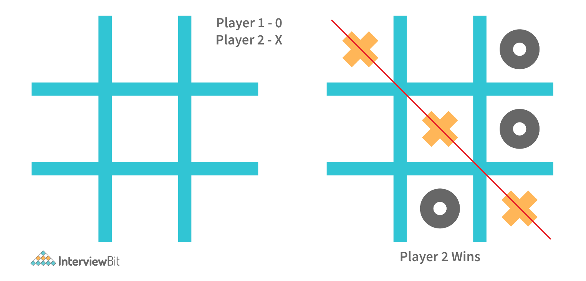
      + What are some of the Required Features?
        + Support 2 player game where one player can be a computer.
        + Design algorithm to calculate the win and loss results.
      + What are some of the common problems encountered?
        + What happens if both players play optimally?
        + How to decide the winning strategy?
      + Possible tips for consideration:
        + If one player is a computer, then make use of the rand() method for ensuring moves are completely random.

26. Design a traffic control system.
    + Generally, in a traffic control system, we see that the lights transition from RED To GREEN, GREEN to ORANGE and then to RED.
      + What are some of the Required Features?
        + Transition traffic lights based on the conventions.
      + What are some of the common problems encountered?
        + Determine the time interval for which the state of the traffic lights has to change.
        + What happens in worst-case scenarios where the state is wrongly shown?
      + Possible tips for consideration:
        + Make use of state design patterns and scheduling algorithms for the transition of the state from one colour to another.

27. Design Web Crawler.
    + The Web crawler is a search engine-related service like Google, DuckDuckGo and is used for indexing website contents over the Internet for making them available for every result.
      + What are some of the Required Features?
        + Design and develop a Scalable service for collecting information from the entire web and fetching millions of web documents.
        + Fresh data has to be fetched for every search query.
      + What are some of the common problems encountered?
        + How to handle the updates when users are typing very fast?
        + How to prioritize dynamically changing web pages?
      + Possible tips for consideration:
        + Look into URL Frontier Architecture for implementing this system.
        + Know how crawling is different from scraping.

28. Design ATM system.
    + What are some of the required features?
      + Each user should have at least one bank account that is linked to the card for performing transactions.
      + ATM to authenticate the user based on 4 digit PIN associated with the card.
      + User to perform only one transaction at a given time.
    + What are some of the common problems encountered?
      + What happens during transaction timeout?
      + What happens if the money is deducted from the bank account but the user hasn't received it from the machine?
    + Possible tips for consideration:
      + Divide the problem into different entities like Card, Card Reader etc and establish a relationship between each of the entities.

29. Design Uber, Ola or Lyft type of systems.
    + What are some of the required features?
      + Real-time service for booking rides
      + Should have the capability of assigning rides that lets the user reach the destination fast.
      + Show the ETA (Estimated Time of Arrival) of the driver after booking the ride and once the ride has been started, show the ETA of the vehicle arriving at the destination.
    + What are some of the common problems encountered?
      + How to store geographical locations for drivers always on move?
      + How to assign drivers to the customers efficiently?
      + How do you calculate the ETA of the driver arrival or the destination arrival?
    + Possible tips for consideration:
      + Make use of the microservices concept with fast databases for booking rides faster.
      + Evaluate Dispatch System for assigning drivers to the users.
