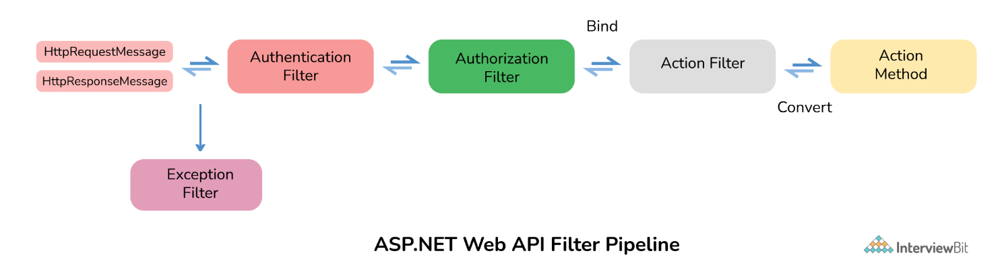
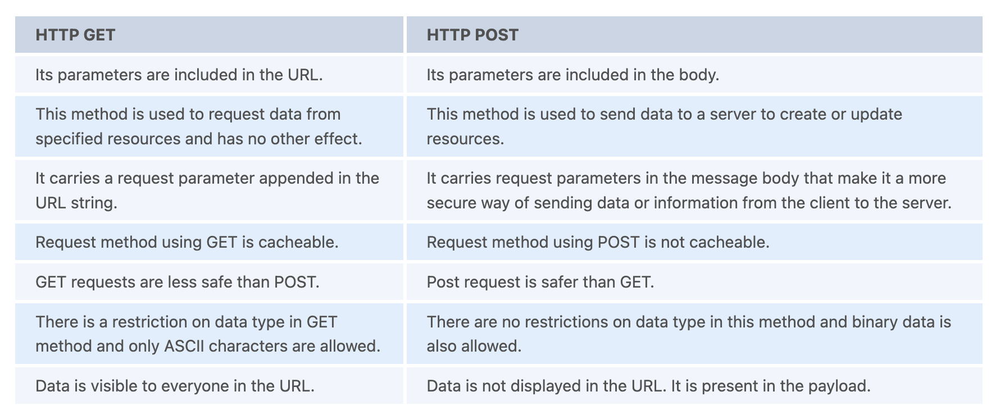

# Web API Interview Questions

---

## Background
7 Feb 2000: Web API was first introduced in the wild along with the introduction of Salesforce on 7th Feb. The Salesforce company officially launched its API at IDG Demo 2000 conference.

20 Nov 2000: eBay launched their eBay API on 20 November 2000 with eBay Developers Program.

16 July 2002: Amazon launched Amazon.com web services on 16 July 2002 that allows developers to implement content and features of amazon.com into their own websites.

Web API was first started in early e-commerce on the Internet. At present, web APIs are still recognized as a hobby by mainstream businesses.

---

1. Why is the Web API important?
   + Web API is generally considered as a service that basically provides us information or data from the server. It is very important because of the following reasons:
     + It is used to provide an interface for websites and client applications to have access to data.
     + It can also be used to access data from the database and save data back to the database.
     + It supports different text formats such as XML, JSON, etc.
     + It is suitable or compatible with any type of browser and any type of device like mobile, desktop, web, etc.
     + It uses low bandwidth such as XML or JSON data, etc., and is therefore considered good for devices that have limited bandwidth such as smartphones, etc.
     + From a business point of view, web API is more applicable for UI/UX, increases interest in the company’s product and services, increases website traffic.
   

2. What is Web API and why we use it?
   + `Web API (Application Programming Interface)`: as the name suggests, is an API that can be accessed over the Web using the HTTP protocol. It is basically considered the best platform for revealing or uncovering data and services to various different services. It is a tool that can be used to push data to a server and can be accessed by server code. It can be built or developed using various technologies like java, ASP.NET, etc.
   
   + `Web API Uses`:
     + It contains additional layers that simply standardize communications and provide different options on how to format input and output.
     + It can be used with ASP.NET MVC and different types of web applications such as ASP.NET WebForms.
     + If one wants to create resource-oriented services, then Web API services are considered the best.
     + It also helps to develop REST-ful services and SOAP-based services.

3. What are the main return types supported in Web API?
   + It does not have any specific data type. It can return data of any type depending upon the business requirement. There are many HTTP methods like GET, POST, PUT, etc., which can return data in different formats depending upon the use case.

4. What is the difference between Web API and WCF?
   + `WCF (Windows Communication Foundation)`: It is a framework used for developing SOAP (Service-oriented applications). This framework is used for developing, configuring, and deploying, or implementing network-distributed services.
   + `Web API`: It is an application programming interface for both web browsers and web servers. Browser API simply extends or increases the functionality of web browsers whereas Server API simply extends or increases the functionality of web server.
   

5. Why to choose Web API over WCF?
   + Web API is considered the best choice over WCF because of the following reasons:
     + Web API uses all features of HTTP such as URIs, request/response headers, caching, versioning, various content formats, etc.
     + One does not have to define or explain any extra config setting for different devices in Web API.
     + Web API uses different text formats including XML because of which it is faster and more preferred for lightweight services.
     + Web API also supports MVC features whereas WCF does not support MVC features.
     + Web API provides more flexibility as compared to WCF.
     + Web API uses standard security like token authentication, basic authentication, etc., to provide secure service whereas WCF uses WS-I standard to provide secure service.

6. What is different between REST API and RESTful API?
   + `REST (Representation State Transfer) API`:  It is basically an architectural style that makes productive use of existing technology and protocols of the web. It is a set of rules that developers need to follow when they develop their API or services that are scalable. It is used with HTTP protocol using its verbs such as GET, DELETE, POST, PUT.
   + `RESTful API`: It is simply referred to as web services executing such as architecture.
   

7. What are the advantages of using Rest in Web API?
   + REST is very important and beneficial in Web API because of the following reasons:
     + It allows less data transfer between client and server.
     + It is easy to use and lightweight.
     + It provides more flexibility.
     + It also handles and controls various types of calls, returning various data formats.
     + It is considered best for using it in mobile apps because it makes less data transfer between client and server.
     + It uses simple HTTP calls for inter-machine communication rather than using more complex options like CORBA, COM+, SOAP, or RPC.

8. What is REST and SOAP? What is different between them?
   + `REST (Representational State Transfer)`:  It is a new and improved form of web service. It describes the architectural style of networked systems. It does not require greater bandwidth when requests are sent to the server. It just includes JSON message. For example:
     + `{"city":"Mumbai","state":"Maharashtra"}`
   + `SOAP (Simple Object Access Protocol)`: It is a simple and lightweight protocol that is generally used for exchanging structured and typed information on the Web. It works mostly with HTTP and RPC (Remote Procedure Call). This protocol is mainly used for B2B applications one can define a data contract with it. SOAP messages are heavier in content and therefore use greater bandwidth.
     ```
     <?xml version="1.0"?>
     <SOAP-ENV:Envelope xmlns:SOAP-ENV="http://www.w3.org/2001/12/soap-envelope" SOAP-ENV:encodingStyle=" http://www.w3.org/2001/12/soap-encoding">
     <soap:Body>
     <Demo.guru99WebService xmlns="http://tempuri.org/">   <EmployeeID>int</EmployeeID>
     </Demo.guru99WebService>
     </soap:Body>
     </SOAP-ENV:Envelope>
     ```
   

9.  What is Web API 2.0?
    + It is basically an enhanced and modified feature of Web API. This new version supports various new features as given below:
      + New Routing Attribute
      + Secure ASP.NET Web API using OAuth 2.0
      + Support for Cross-Origin requests using CORS
      + IHttpActionResult return type
      + Support for `$expand`, `$select` in OData Service
    + Because of all the new features of Web API 2.0, it is considered an optimal choice and suitable development model that makes it easier to develop RESTful services interfaces to different clients running on various platforms. It also supports configuring routes in the Web API method or controller level.

10. Explain media type formatters.
    + In web API, media type formatters are classes that are responsible for serialization data. Here, serialization generally means a process of translating data into a format that can be transmitted and reconstructed later.  Because of serializing request/response data, Web API can understand request data format in a better way and send data in a format that the client expects. It simply specifies data that is being transferred among client and server in HTTP response or request.
      
      

11. Web API supports which protocol?
    + Web API generally supports only HTTP protocol.

12. Which of the following Open-source libraries is used by WEB API for JSON serialization?
    + Json.NET library is generally used by Web API for JSON serialization.

13. What is XML and JSON?
    + `XML (Extensible Markup Language)`:
      + It is especially designed to store and transport data.
      + It is similar to HTML but is more flexible than HTML because it allows users to create their own custom tags.
      + It is used for representing structured information such as documents, data, configuration, etc.
    + `JSON (JavaScript Object Notation)`:
      + It is a lightweight format designed to store and transport data.
      + It is easier to understand and is a standard text-based format used for representing structured data based on JavaScript object syntax.
      + It is faster and easier to use.

14. What are Web API filters?
    + Filters are basically used to add extra logic at different levels of Web API framework request processing.  Different types of Web API filters are available as given below:
      + `Authentication Filter`: It handles authentication and authenticates HTTP requests. It also helps to authenticate user detail. It checks the identity of the user.
      + `Authorization Filter`: It handles authorization. It runs before controller action. This filter is used to check whether or not a user is authenticated. If the user is not authenticated, then it returns an HTTP status code 401 without invoking the action.
      + `AuthorizeAttribute`: is a built-in authorization filter provided by Web API.
      + `Action Filter`: It is attributing that one can apply to controller action or entire controller. It is used to add extra logic before or after controller action executes. It is simply a way to add extra functionality to Web API services.
      + `Exception Filter`: It is used to handle exceptions that are unhandled in Web API. It is used whenever controller actions throw an unhandled exception that is not HttpResponseException. It will implement an “IExceptionFilter” interface.
      + `Override Filter`: It is used to exclude specific action methods or controllers from the global filter or controller level filter. It is simply used to modify the behavior of other filters for individual action methods.
    

15. Who can consume Web API?
    + A large range of clients such as browsers, mobile devices, iPhone, etc., include or consume web API. It is also good for using along native applications that require web services but not SOAP support. It can also be consumed by any client that supports HTTP verbs such as GET, DELETE, POST, PUT.

16. How to handle errors in Web API?
    + Web API generally provides greater flexibility in terms of handling errors. Exception handling is a technique that is used to handle run-time errors in application code. One can use HttpResponseException, HttpError, Exception filters, register exception filters, Exception handlers to handle errors. Exception filter can be used to identify unhandled exceptions on actions or controllers, exception handlers can be used to identify any type of unhandled exception application-wide, and HttpResponseException can be used when there is the possibility of an exception.

17. How to register an exception filter globally?
    + `GlobalConfiguration.Configuration.Filters.Add (new MyTestCustomerStore.NotImplExceptionFilterAttribute());`

18. What is MVC? Write difference between MVC and Web API?
    + `MVC (Model, View, and Controller)`: is basically an application design model that comprises three interconnect parts I.e., model, view, and controller. It allows coders to factor out different components of the application and update them more easily. It is mostly used for developing model user interfaces. Its main purpose is to display patterns in structure for keeping display and data separate to enable both of them to change without affecting others.
    
    

### ASP.NET Web API Interview Questions

19. What is ASP.NET Web API?
    + ASP stands for Active server pages. ASP.NET is an updated version of legacy ASP. It is a framework that is used for developing HTTP services to provide responses to client requests. It can be accessed in different applications on different platforms. It is provided by Microsoft open-source technology for developing and consuming HTTP-based services on top of .NET Framework.  It is very easy to build HTTP services using ASP.NET Web API. These services can be used by different clients as given below:
      + Desktop Applications
      + Mobile Applications
      + IOTs
      + Browsers

20. What are the advantages of using ASP.NET Web API?
    + It provides the best platform for developing RESTful applications on .NET Framework.
    + It works the same way that HTTP works with help of HTTP verbs such as GET, POST, PUT, DELETE for all crud operations.
    + It provides enough flexibility in Web API creation.
    + It completely supports routing.
    + It also supports model binding, validation, Odata (Open Data Protocol) that allows creation and consumption of RESTful APIs.
    + It has the ability to develop custom help and test pages with help of ApiExplorer.
    + One can develop non-SOAP-based services such as plain XML, JSON strings, etc.
    + It also increases the TDD (Test Data-Driven) approach in the development of RESTful services. 

21. What are new features used in ASP.NET Web API 2.0?
    + Attribute Routing
    + CORS (Cross-Origin Resource Sharing)
    + OWIN (Open Web Interface for .NET) self-hosting
    + IHttpActionResult
    + Web API OData

22. What is the use of HttpResponseMessage?
    + It is used to set response values such as header and status control. It simply allows us to work with HTTP protocol. It represents HTTP response messages that encapsulate data and status code.
      ```
      // GetEmployee action
      public HttpResponseMessage GetEmployee(int id)
      {
          Employee emp = EmployeeContext.Employees.Where(e => e.Id == id).FirstOrDefault();
          if (emp != null)
            {
                    return Request.CreateResponse<Employee>(HttpStatusCode.OK, emp);
            }     else
            {
                    return Request.CreateErrorResponse(HttpStatusCode.NotFound, "Employee Not Found");
            }
      }
      ```

23. What is the difference between ApiController and Controller?
    + `ApiController`: It is used to return data that is arranged in series and then sent to the client.
      ```
      public class TweetsController : ApiController
      {
              // GET: /Api/Tweets/
              public List<Tweet> Get()
            {
                return Twitter.GetTweets();
            }
      }
      ```
    + `Controller`: It is used to provide normal views.
      ```
      public class TweetsController : Controller 
      {
          // GET: /Tweets/  [HttpGet]  public ActionResult Index()
          {
              return Json(Twitter.GetTweets(), JsonRequestBehavior.AllowGet);
          }
      }
      ```

24. What do you mean by Caching and What are its types?
    + `Caching`: is basically a technique or process of storing data somewhere or in the cache for future requests. The cache is a temporary storage area. Caching keeps all frequently or recently accessed files or data in the cache memory and accesses them from the cache itself rather than actual address of data or files. The cache interface simply improves the storage mechanism for request/response object pairs that are being cached.
    + `Advantages of Caching`:
      + It is considered the best solution to ensure that data is served where it is needed to be served that too at a high level of efficiency which is best for both client and server.
      + It delivers web objects faster to the end-user.
      + It reduces load time on the website server.
      + It leads to faster execution of any process.
      + It decreases network costs.
    + `Types of Caching`:
      + Page Caching
      + Data Caching
      + Fragment Caching

25. WCF is replaced by ASP.NET Web API. True/False?
    + `WCF`: It is a framework used for developing SOAP (Service Oriented Applications Protocols). It also supports various transport protocols as given above.
    + `ASP.NET Web API`: It is a framework used for developing non-SOAP-based services. It is limited to HTTP-based services.
    + No, it's not true that ASP.NET Web API has replaced WCF. WCF was generally developed to develop SOAP-based services. ASP.NET Web API is a new way to develop non-SOAP-based services such as XML, JSON, etc. WCF is still considered a better choice if one has their service using HTTP as the transport and they want to move to some other transport like TCP, NetTCP, MSMQ, etc. WCF also allows one-way communication or duplex communication.

26. What are the main return types supported in ASP. Net Web API?
    + HttpResponseMessage
    + IHttpActionResult
    + Void
    + Other types such as string, int, etc.

27. What is ASP.NET Web API routing?
    + `Routing`: is the most important part of ASP.NET Web API. Routing is a way how Web API matches a URI to an action. It is basically a process that decides which action and controller should be called. The controller is basically a class that handles all HTTP requests. All public methods of controllers are basically known as action methods or just actions. Whenever a Web API framework receives any type of request, it routes that request to action.
      + `Convention-based routing`: Web API supports convention-based routing. In this type of routing, Web API uses route templates to select which controller and action method to execute.
      + `Attribute-based routing`: Web API 2 generally supports a new type of routing known as attribute routing. As the name suggests, it uses attributes to define routes. It is the ability to add routes to the route table via attributes.
    

28. How do you secure ASP.NET Web API?
    + Web API has become key to programming web-based interactions. It can be accessed by anyone who knows the URL. Therefore, they have become targets for hackers. One needs to secure Web API by controlling Web API and by deciding who can and who cannot have access to Web API. There are basically two ways or techniques that make our Web API more secure.
      + `Authentication`: It is a process that helps to identify and check users by their credentials such as password, username, etc. To have access to the web API, firstly user credentials are needed to be passed in the request header. If user credentials are not passed into the request header, then the server returns 401 status code (unauthorized). The best authentication to be used is OAuth 2.0.
      + `Authorization`: It is a process that helps to decide whether or not a user has access to perform an action. Authorization filters are used to implement authorization.

29. What are Exception filters in ASP.NET Web API?
    + `Exception filter`: is generally used to handle all unhandled exceptions that are generated in web API. It implements IExceptionFilters interface. It is the easiest and most flexible to implement. This filter is executed whenever the controller method throws any unhandled exception at any stage that is not an HttpResponseExecption exception.

30. Which .NET framework supports ASP.NET Web API?
    + .NET Framework 4.0 generally supports the first version of ASP.NET Web API. After that, .NET Framework 4.5 supports the latest version of web API i.e., ASP.NET Web API 2.

31. What is HttpConfiguration in Web API?
    + It is considered as the main class that includes different properties with help of which one can override the default behavior of Web API.
    + Some properties are given below:
      + `DependencyResolver`: It sets or gets a dependency resolver for dependency injection.
      + `Services`: It gets web API services.
      + `ParameterBindingRules`: It gets a collection of rules for how parameters should be bound.
      + `MessageHandlers`:  It sets or gets message handlers.
      + `Formatters`: It sets or gets media-type formatters.

32. Can we return View from ASP.NET Web API method?
    + No, we cannot return the view from the ASP.NET Web API method. ASP.NET web API develops HTTP services that provide raw data or information. ApiController in ASP.NET MVC application only renders data that is serialized and sent to the client. One can use a controller to provide normal views.

33. What is content negotiation in ASP.Net Web API?
    + `Content negotiation`: is basically a process of selecting the best representation from multiple representations that are available for a given response. It simply allows one to choose rather than negotiate content that one wants to get in response. It is performed at the server-side. In simple words, it chooses the best media type for matters to return a response to an incoming request.

34. Difference between HTTP GET vs HTTP Post?
    + HTTP (HyperText Transfer Protocol) simply manages request-response between client and server. It works as a request-response protocol between client and server.
      + HTTP GET: This method is used to get information or data from a respective server at a specified URL.
        + `GET/RegisterStudent.asp?user=value1&pass=value2`
      + HTTP POST: This method is used to send data or information to respective servers.
        ```
        POST/RegisterStudent.asp HTTP/1.1
        Host: www.guru99.com
        user=value1&pass=value2
        ```
    

35. What is Cross-Origin Resource Sharing (CORS) in Web API?
    + `Cross-Origin Resource Sharing (CORS)`: is basically a mechanism that allows one to make requests from one website to another website in a browser that is normally not allowed by another policy called SOP (Same Origin Policy). It supports secure cross-origin requests and data transfers among clients or browsers and servers. Here, cross-origin request means requests coming from different origins. CORS simply resolves the same-origin restriction for JavaScript. One can enable CORS for web API using the respective web API package or OWIN middleware.
      

36. Name method that validates all controls on page?
    + `Page.Validate()`

37. What parameters can be passed in the URL of API?
    + Context keys, documents keys, or anything that initiates API to hit the exact end-point are few parameters that one can pass in the URL to define the complete end-point.

38. What is the use of DelegatingHandler?
    + `DelegatingHandler`: is used to develop a custom Server-Side HTTP Message Handler in ASP.NET Web API. It is used to represent Message Handlers before routing in Web API.

39. Web API uses which library for JSON serialization?
    + Json.NET library is used by Web API for JSON serialization.

40. Explain method to handle error using HttpError in Web API?
    + `CreateErrorResponse`: is an extension method that can be used in Web API controller methods to return error codes and error messages. It creates an HttpError object and then wraps it inside an HttpResponseMessage object.

41. How to unit test Web API?
    + Using Web API tools like Fiddler, we can perform unit testing in Web API. Fiddler is basically a free debugging proxy for any browser that can be used to compose and execute various HTTP requests to Web API and check HTTP response. It is simply used for testing restful web services. It allows one to inspect and check both incoming and outgoing data to monitor and modify requests and responses before the browser receives them.  Below is given some setting that is needed to be done fiddler:
      + `Fiddler – Compose Tab -> Enter Request Headers -> Enter Request Body and then execute.`
