# Web Developer Interview Questions

---

1. What are the key responsibilities of Web Developers?
   + Build products using HTML, CSS, JavaScript, PHP (Hypertext Preprocessor), and other relevant coding languages.
   + Design, develop, test, debug, and deploy applications in a cross-platform, cross-browser environment.
   + Coordination with designers and programmers for the development of projects.
   + Develop design specifications/patterns for optimizing web programs.
   + Identifying and fixing bugs, troubleshooting, and resolving website issues.
   + Taking care of the technical aspects of the site, such as its cache and performance (which indicate how fast a site will run and how much traffic it can handle).
   + Providing support and assistance with web management best practices.
   + Keep up with the latest technology.
   + Maintain and update websites to meet modern web standards.
   + Monitor web traffic.

2. List the advantages of HTTP/2 over HTTP 1.1.
   + Hypertext Transfer Protocol (HTTP) is a set of standard protocols allowing internet users to exchange website knowledge on WWW (World Wide Web). HTTP has gone through four iterations since it was introduced in 1991 i.e., HTTP/0.9, HTTP/1.0, HTTP/1.1, and HTTP/2.0. In 2015, HTTP/2 was released as a major revision to HTTP/1.1. HTTP/2.0 has the following advantages over HTTP/1.1:
     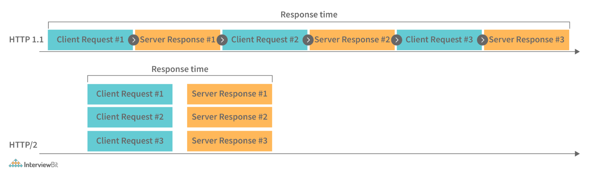
     + Increased performance: It was designed specifically to speed up page loading and reduce round-trip time (RTT) for resource-intensive websites.
     + Handle multiple resources: With HTTP 1.1, the web pages were manageable simply by using HTML markups and images. But with HTTP 2.0, there are now multiple resources available for web pages, including images, fonts, scripts, and more. HTTP 1.1 was not designed to handle such a large amount of resources today.
     + Multiplexing: Multiplexing is fully implemented in HTTP/2. It means that multiple requests are sent between browsers and servers simultaneously over a single TCP connection. Consequently, several elements of a web page can be delivered via a single TCP connection. As a result, the HTTP/1.1 head-of-line blocking problem is resolved, in which a packet at the front of the line blocks the transmission of other packets.
     + Header Compression: HTTP 2.0 has the ability to compress HTTP headers to reduce overhead. When HTML headers on web pages are compressed, they can be sent between the browser and server in one trip, over a single TCP connection.
     + Server push: HTTP/2 servers are able to push resources into a browser's cache even before they are requested. By doing this, browsers can display content without requiring additional requests.
     + Binary protocols: HTTP/2 use binary protocols, not textual. HTML/2's binary protocols consume less bandwidth, can be parsed more efficiently, and are less error-prone compared to HTTP/1.1's textual protocols.

3. Explain CORS (Cross-Origin Resource Sharing) and Write its importance.
   + CORS stands for Cross-origin resource sharing. It is basically defined as a browser mechanism that enables web pages from one domain to have controlled access to resources that are located at different domains (cross-domain request). In other words, it allows scripts running on a browser client to interact with and access resources from other origins. It provides and extends flexibility to the SOP (Same-Origin Policy). A same-origin policy restricts a website's ability to access resources outside its source domain. For example, if a JavaScript app wanted to call an API (Application Programming Interface) running on another domain, it would be blocked and prevented from doing so because of the SOP. Due to restrictions caused by the same-origin policy, CORS was introduced.
     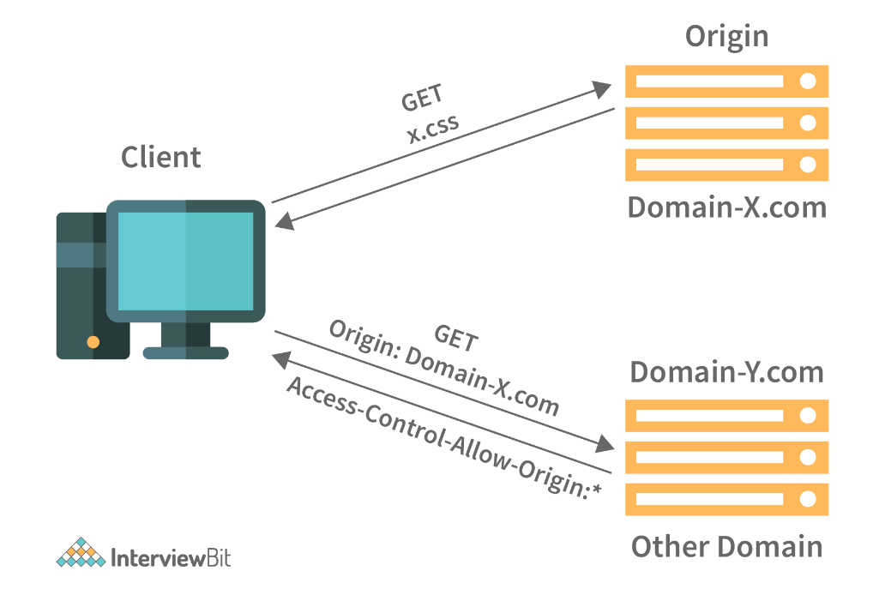
     + When a website's CORS policy is set up poorly, it also poses the risk of cross-domain attacks. As such, it cannot prevent cross-origin attacks such as  CSRF (Cross-Site Request Forgery).

4. What do you mean by ETag (Entity Tag) and how does it work?
   + The ETag (entity tag) is a part of the HTTP protocol. This is one of several mechanisms that HTTP provides to validate Web caches, which allows conditional requests to be made from a browser to resources. Moreover, Etags make sure that simultaneous updates of the same resource don't overwrite each other (mid-air collisions).
   + ETags are opaque identifiers assigned by a server to a specific version of a resource found at a specific URL. Every time the resource representation at that URL changes, an entirely new ETag is assigned. As such, ETags can be compared in the same way as fingerprints and determine if two representations of a resource are identical.
   + Syntax:
     + `ETag: W/"<etag_value>"`
     + `ETag: "<etag_value>"`

5. Explain Webpack.
   + Webpack is a tool that bundles JavaScript modules, also known as static module bundlers. Modules are reusable chunks of code that are built from the JavaScript, node_modules, images, and CSS styles of your application, and packaged so that they can be easily added to your website. If you have a large number of files, Webpack generates a single (or a few) file that runs your application.
     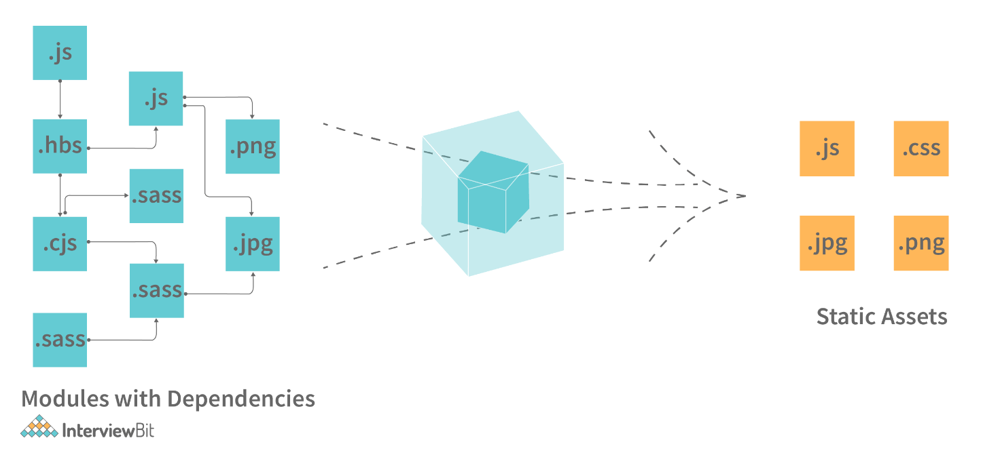
   + When Webpack processes your application or package, it generates a dependency graph, which consists of various modules that your webapp needs in order to function as expected. Based on this graph, it then creates a new package that contains only the bare minimum files required, often only one or a few bundle.js files which can be easily plugged into the HTML file and used in the application.

6. List out newly introduced input types, APIs, form elements, and elements that support media content in HTML5.
   + HTML5 has been updated repeatedly in the last few years, and the addition of input types has greatly simplified its use. Among some of these input types are:
     + `Colour`: Enable users to select or choose a colour using the colour picker.
     + `Date`: Enable users to select or choose a date from a drop-down calendar.
     + `Datetime-local`: Enable users to select or choose both local date and time.
     + `Email`: Enable users to enter an email address.
     + `Month`: Enable users to select or choose a month and year from a drop-down calendar.
     + `Week`: Enable users to select or choose week and year from a drop-down calendar.
   + HTML5 introduces the following new form elements:
     + `<datalist>`: Specifies a list of options for input controls.
     + `<keygen>`: Creates an encryption key.
     + `<output>`: Defines the result or output of an expression.
     + `<progress>`: Heads in the direction of 100% of the maximum value.
     + `<meter>`: Provides a gauge that shows a general value within a range.
   + The following are some of the new APIs introduced in HTML5:
     + `History API`: Provides programs with access to the browser's history.
     + `Page visibility API`: Enables us to determine the current visibility state of a page.
     + `Battery Status API`: Displays the current battery status of the device.
     + `User Timing API`: Provides programmers with high-precision timestamps for measuring application performance.
     + `Vibration API`: Provides access to the device's vibration functionality.
   + HTML5 includes five elements that support media as follows:
     + `<audio>`: Used to embed audio files in a web page
     + `<video>`: Used to embed video files in a web page.
     + `<source>`: Used for attaching multimedia files, including audio, video, and photos.
     + `<embed>`: Used to embed external applications, usually multimedia content such as audio or video into an HTML document.
     + `<track>`: Specifies text tracks for audio and video components.

7. State the difference between span tag and div tag in HTML5.
   + Both the div and span tags are used to indicate the part of a web page. Divs are block-level elements, whereas spans are inline elements of a web page. `<div>` tag is used to show block parts of the webpage whereas `<span>` tag is used to show inline parts of the webpage:
     + `<div>A 6-month online career accelerator program<span>Scaler Academy<span></div>`
     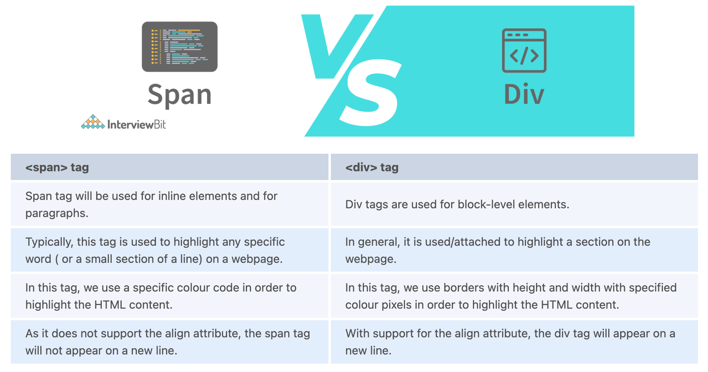

8. Explain HTML5 Web storage.
   + HTML5 has many great features, including Web Storage, which is sometimes referred to as DOM storage (Document Object Model Storage). Web applications can use Web Storage to store data locally in the browser on the user/client’s side. Data is stored in the form of a key/value pair in the user's browser. Using web storage to store data is similar to using cookies, but web storage is faster and more convenient. Web Storage should never be used to store sensitive data. It isn't "more secure" than cookies since it isn't transmitted over the wire and isn't encrypted.
   + Types of Web Storage:
     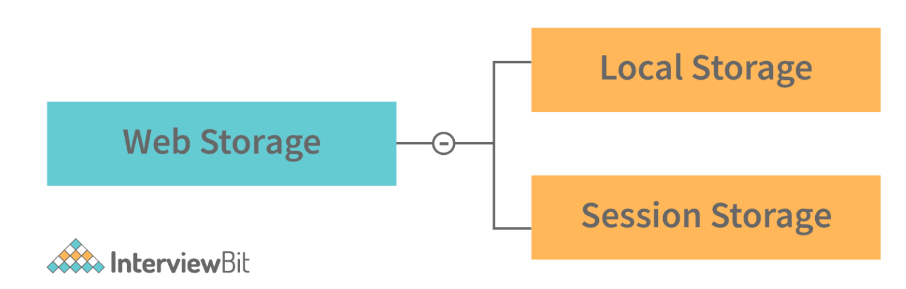
     + Local Storage: This storage uses Windows.localStorage object that stores data with no expiration date. Once stored in local storage, the data will remain available even after the user's browser is closed and reopened.
     + Session Storage: This storage uses the Windows.sessionStorage object that stores data for one or single session only. As soon as the user closes his browser, data is lost or deleted from the browser, and the session would be lost. 

9.  Explain DOM (Document Object Model)?
    + DOM stands for Document Object Model. It is basically a cross-platform, language-independent API (Application Programming Interface) for XML (Extensible Markup Language) and HTML documents. To put it simply, DOM describes the logical structure of documents and how one can access and manipulate them. For example, here is an HTML document that illustrates the DOM hierarchy.
      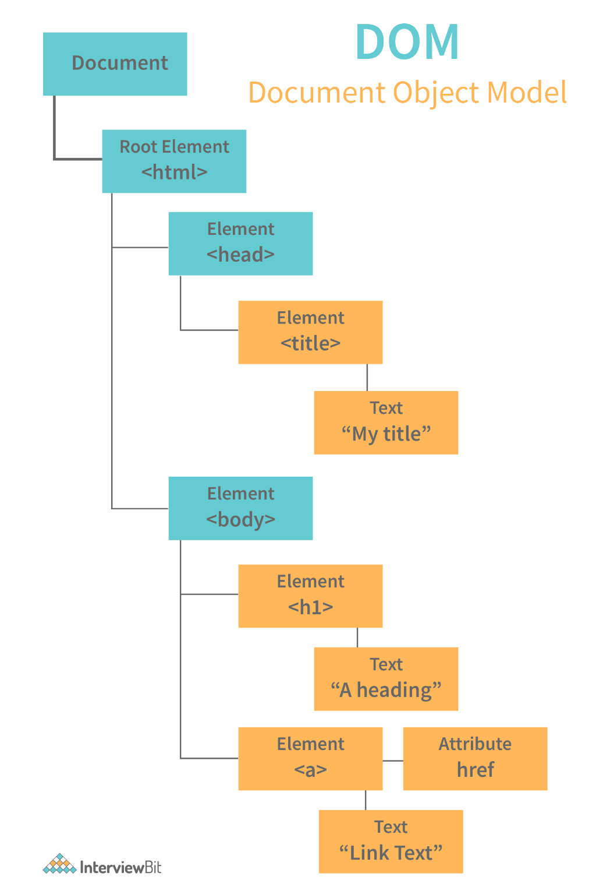
    + These documents are usually treated as a tree structure in which every node is an object that represents a specific part of the document. In a tree, each branch ends with a node, and each node contains objects. The DOM represents the webpage in a hierarchical structure in order for programmers and users to navigate it more easily.

10. What do you know about pair programming?
    + Pair programming is sometimes referred to as pairing. In pair programming, two programmers work together at one (single) workstation. Those who write code are known as drivers, and those who monitor and navigate each line of code are known as navigators. Both of them may switch roles frequently.

11. While building a web application, how do you consider SEO, maintainability, UX, performance, and security?
    + Security should be a top priority in any organization that handles vital data. On the other hand, SEO and UX should be prioritized for small and medium-sized online businesses.  You will need to pay more attention to performance and SEO if you write an online publication.

12. State difference between SVG (Scalable Vector Graphics) and Canvas.
    + HTML5 introduced two new graphical elements, Canvas (`<canvas>`) and SVG (`<svg>`), that make your web pages more interactive and more graphically attractive. Each has its own properties and can be used to create graphic elements on web pages.
      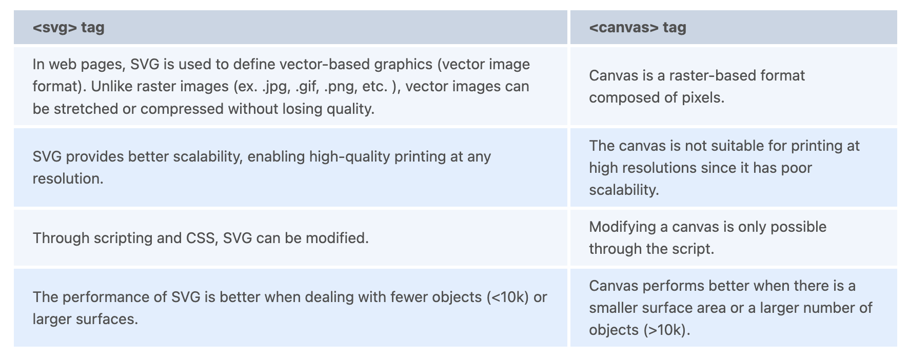

13. What is Type Coercion in JavaScript?
    + The term type coercion refers to the process of converting values from one data type to another, either automatically or implicitly. For instance, you could convert a number to a string, a string to a number, or a boolean to a number, etc.
      ```
      <script>
        // The Number 5 is converted to
        // string '5' and then '+'
        // concatenates both strings
          const value1 = 5;
          const value2 = '50';
          var x = value1 + value2;
          document.write(x);
      </script>
      ```
      + Output: `550`

14. What is the difference between `<window.onload>` and `<onDocumentReady>`?
    + It is true that both the `<window.onload>` and `<onDocumentReady>` functions perform tasks when the page has been loaded in the browser, however, the execution of the two functions differs slightly.
      + Window.onload: This event is triggered when a web page has fully loaded. In other words, it waits for the DOM and all the associated resources to load, and then executes code. DOM contains all HTML tags, like anchor tag, h1 tag, p tag, etc.
      + onDocumentReady: The "onDocumentReady" method, on the other hand, executes the code when the DOM has been loaded. It typically waits for HTML tags, anchor tags, etc., but not for images, videos, or other contents.

15. Describe the different kinds of HTTP requests supported by RESTful Web services.
    + `GET`: It is used to retrieve data or resources from the server but only allows read-only access. You cannot modify it.
    + `POST`: It is used for creating a new resource.
    + `PUT`: This is similar to POST, but used for updating an existing resource (if the resource doesn't exist, the API will decide whether a new resource should be created).
    + `DELETE`: It is used to delete the resource from the server.
    + `TRACE`: It validates the content along with the network during an HTTP request.

16. What is the best way to integrate different stylesheets into a website?
    + Typically, it depends on how your site is laid out and how users interact with it. The most efficient way, however, would be to use just a single file called styles.css (or something similar). Combining them into a single document is preferable. Loading one file is easier for a client than loading five. In order to change the style, you simply open the styles.css file, scroll down to find the appropriate section, and modify the CSS. The sheet can be linked in your HTML as follows:
      + `<link rel="stylesheet" href="styles.css">`

17. How do you optimize the loading time of your web application as a Web Developer?
    + Image compression and optimization: Using images on your website will improve the appearance and quality of your pages. However, larger images will also slow down the loading process. Compressing and optimizing images is one of the easiest ways to improve the speed of your site. The smaller your images' file sizes, the less weight they have, which, in turn, helps your pages load faster.
    + Put JavaScript and CSS in external files: When JavaScript and CSS are embedded in HTML documents, they are downloaded each time the HTML document is loaded. As a result, this does not utilize browser caching, increasing the size of HTML documents. You should always place CSS and JavaScript in external files; this is best practice and makes maintaining your site easier.
    + Reduce the number of redirects: A website with too many redirects will take a long time to load. HTTP request and response times are prolonged every time a page redirects. If you eliminate unnecessary redirects on your site, your page load time will be significantly reduced.
    + CSS and JavaScript files should be loaded asynchronously: You have CSS and JavaScript files on your website that can be loaded synchronously or asynchronously. In synchronous loading, each file is loaded one at a time, in the order in which it appears on your web page. Asynchronous loading, on the other hand, allows multiple files to be loaded simultaneously, which can speed up the performance of a website. '
    + Minify HTML, CSS, and JavaScript: Your pages will load faster if you optimize how your files to load. In a similar vein, you can minify your HTML, CSS, and JavaScript code. You can reduce the size of files by eliminating unnecessary spaces, characters, comments, and other components. As a result, web pages will load faster with cleaner code.

18. Define NPM (Node Package Manager).
    + NPM stands for Node Package Manager. It is commonly used as a default package manager for Node.js (JavaScript runtime environment). It is included in every installation of Node.js. This command-line tool installs, updates, and uninstalls Node.js packages and modules required for Node applications or projects. A package contains all files for a module, and modules are basically JavaScript libraries that can be added to a Node project as needed. It contains a number of libraries that are extremely useful to Node.js developers, speeding up the process of developing applications.
      + Installing NPM: In order to install NPM, you need to install Node.js as NPM automatically gets with Node.js.
      + Check NPM Version: The following syntax can be used to check the version of NPM that is installed on the system:
        + npm -v
      + Update NPM Version: NPM updates refer to updating the Node package manager to its latest version. One may always update the installed version if it is not the latest using the syntax given below:
        + Syntax: `npm update [-g] [<pkg>...]`
          + The -g flag is used to update npm globally since it is a global package and pkg refers to the package.
        + Use npm@update command
          + `npm install npm@latest -g`
        + Use update command
          + `npm update -g`
        + Use npm@latest command
          + `npm install npm@latest -g`

19. What are different popup boxes that are available in JavaScript?
    + Javascript uses pop-up boxes to display notifications and messages to users. Here are the different types of pop-up boxes in Javascript:
      + Alert Box: This is used to display a warning message. After the alert box appears, the user needs to press the OK button to proceed.
        + `alert("Your Alert Text")`
          ```
          <script>
            alert("This is Scaler Academy");
          </script>
          ```
      + Confirm Box: These pop-up boxes are used as a means of obtaining authorization or permission from the user. In order to proceed, the user must click the OK or Cancel button.
        + `confirm("Your query")`
          ```
          <script>
            let bool = confirm("Confirm this action");
            console.log(bool);
          </script>
          ```
      + Prompt Box: The purpose of this type of pop-up box is to gather user input for further use. After entering the necessary information, the user has to click OK to proceed to the next stage, otherwise pressing the Cancel button returns the null value.
        + `prompt("Your Prompt")`
          ```
          <script>
            let name = prompt("Enter your email");
            console.log(name);
          </script>
          ```

20. Explain the term “Scope” in JavaScript and write its different type.
    + Managing the availability of variables or objects in an application is governed by the concept of scope. In JavaScript, there are two types of scope as follows:
      + Global Scope: A variable having global scope can be accessed from anywhere in the program. These variables that are declared outside of any function can be accessed from any place in the program.
        ```
        let scalerProgram = "DataScience"
        // code here can use scalerProgram
        function myScaler() {
        // code here can also use scalerProgram
        }
        ```
      + Local Scope: Variables with a local scope can only be accessed within the same function in which they are declared. Whenever a variable is declared inside a function, it becomes local to the function. As soon as a function begins, local variables are created and deleted when the function is executed.
        ```
        // code here can NOT use scalerProgram
        function myScaler() {
        let scalerProgram = "DataScience";
        // code here CAN use scalerProgram
        }
        // code here can NOT use scalerProgram
        ```

21. State difference between HTML and XHTML.
    + Both HTML (Hypertext Markup Language) and XHTML (Extensible Hypertext Markup Language) can be used to create web-based and Android applications.
      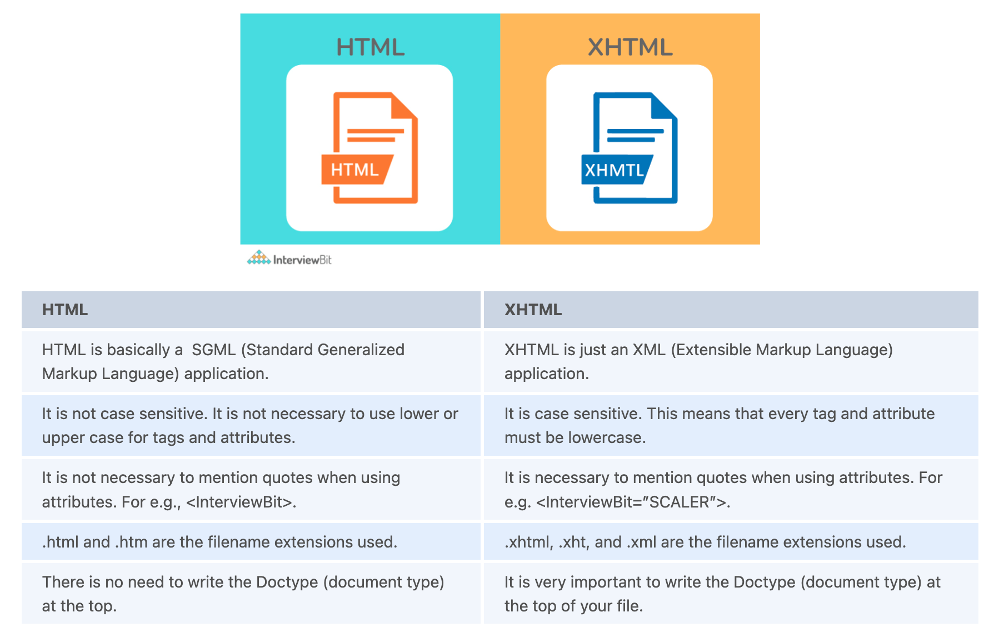

22. Can you explain what AJAX is?
    + AJAX (Asynchronous JavaScript and XML) refers to a set of technologies used for developing web applications. The purpose of AJAX is to create better, faster, and more interactive web applications using these technologies such as XML, HTML/XHTML, CSS, DOM, JavaScript, XMLHttpRequest etc. Through Ajax, web applications are able to send and receive data asynchronously from the server without hampering the display or behaviour of the existing site. Using AJAX, you can exchange information with a server and update portions of a webpage without having to reload the whole page. The term "AJAX" refers to a technique for creating dynamic, fast web pages.
      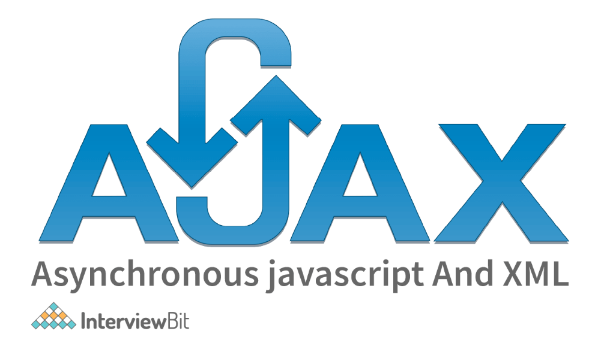

23. What do you mean by CDN (Content Delivery Network) in jQuery?
    + CDN stands for Content Delivery Network. CDNs are geographically distributed groups of servers that deliver Internet content quickly. To provide end-users with fast, secure media delivery and web content, the servers are dispersed across many physical and network locations. Using CDNs can significantly reduce load times since they deliver files at higher bandwidth from servers located closer to your visitors than your own web server.
    + For faster access and better performance, web programmers and developers can leverage CDNs to host their jQuery Libraries. Microsoft and Google have already put jQuery on their CDNs, so developers don't have to worry about that. Their only task now is to reference the hosted jQuery library.
    + Google CDN:
      ```
      <head>
        <script type="text/javascript" src="https://ajax.googleapis.com/ajax/libs/jquery/3.6.0/jquery.min.js"></script>
      </head>
      ```
    + Microsoft CDN:
      ```
      <head>
        <script type="text/javascript"   src="https://ajax.aspnetcdn.com/ajax/jQuery/jquery-3.6.0.min.js"></script>
      </head>
      ```

24. Explain W3C (World Wide Consortium).
    + W3C stands for World Wide Web Consortium. Founded in 1994, W3C is an international organization devoted to the improvement of the web. The W3C strives to help the web reach its full potential and ensure its continuous development. It sets standards (protocols) for the WWW (World Wide Web) to allow for interoperability and cooperation between all stakeholders. It develops various protocols or standards as a means of growing the web.
      + It develops and publishes web standards or protocols.
      + Furthermore, it ensures the development and growth of the web.
      + In addition, it sets the standards or protocols for web scripts, web applications, and other dynamic content.
      + While designing web protocols, W3C adheres to the principles of modularity, simplicity, and extensibility.

25. What do you mean by CSS Selectors? Name a Few.
    + CSS selectors are used by web designers to specify or select HTML elements they want to style. Following are a few of the most commonly used CSS selectors:
      + ID Selector: It selects HTML elements using specific id attributes.
        ```
        #para1 {
        text-align: left;
        color: blue;
        }
        ```
      + Class Selector: It selects HTML elements using specific class attributes.
        ```
        .scaler {
        text-align: left;
        color: blue;
        }
        ```
      + Child Selector or Combinator: It selects all HTML elements that are children of the specified element. In a child selector, there are two or more selectors separated by ">".
        ```
        div > p {
        background-color: blue;
        }
        ```

26. What are pseudo-classes?
    + A pseudo-class is basically used to define or specify a special state of an HTML element. This can be used in conjunction with an existing CSS selector to add effects to elements based on their state. For instance, changing the style of an element when a user hovers over it or using different styles for visited and unvisited links. The pseudo-class gives you the ability to do all of this.
      ```
      selector: pseudo-class{
          property: value;
      }
      ```
    + In CSS, there are many pseudo-classes, but the ones that are most frequently used are as follows:
      + :visited pseudo-class: Select the links that the user has already visited.
      + :hover pseudo-class: A special effect can be added to an element when the mouse pointer is over it.
      + :active pseudo-class: Select the element that becomes active when the user clicks on it.
      + :focus pseudo-class: Select an element that is currently focused by the user.

27. Why are media queries used in CSS?
    + Media queries are used in CSS to create responsive web designs. This means that the way a web page appears varies from one system to another based on the screen or the media type. The media query can be used to apply different styles or change the appearance (and even the behaviour) of a site or an app depending on a user's device type or specific characteristics (like browser viewport width, height, screen resolution, etc.). The following can be checked using media queries:
      + Dimensions (width and height) of the viewport
      + Dimensions (width and height) of the device
      + Orientation
      + Resolution

28. Explain long polling.
    + Long polling is generally a web application development method that is used to push information or data from the server to the client as quickly as possible. Long-polling maintains the connection between client and server after a request has been made from the client to the server. The connection is maintained until information becomes available from the server and it is ready to send it to the client.  If the server receives a request from the client, it doesn't close the connection immediately; the connection is only closed when the server sends the data back to the client or when a timeout threshold is reached (connection timeout).
      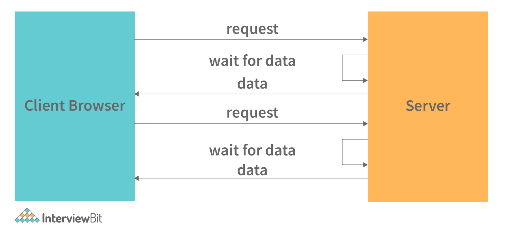

29. State difference between Local Storage and Cookies.
  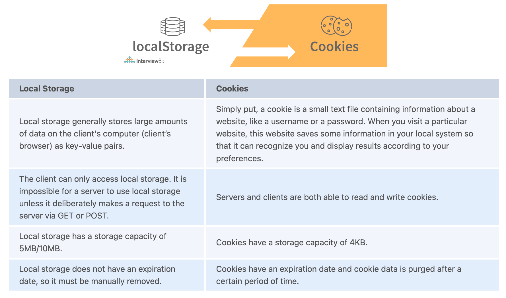

30.  What is the purpose of Canvas in HTML?
     + In simple terms, Canvas (`<canvas>` tag) is an HTML element that enables you to draw or create graphics on a web page using JavaScript. This is a new tag in HTML5. Canvas allows you to dynamically control graphics, images, and text on your web pages, adding a great deal of interactivity. You can create graphs, combine photos, and create animated elements using the CANVAS element.
       + `<canvas id = "script"> Contents... </canvas>`
       + Example
         + In this example, we have a simple *canvas> element that only has two specific attributes: width (set width of the canvas) and height (set height of the canvas), along with the HTML5 core attributes such as id, name, and class.
           ```
           <!DOCTYPE html>
           <html>
             <body>
                 <!-- canvas Tag starts here -->
                 <canvas id = "InterviewBit" width = "100"
                     height = "100" style = "border:1px solid blue">
                 </canvas>
                 <!-- canvas Tag ends here -->
             </body>
           </html>
           ```
           ```
           <!DOCTYPE HTML>
           <html>
             <head>
               <style>
                   #Interviewbit{border:1px solid blue;}
               </style>
             </head>

             <body>
               <canvas id = "Interviewbit" width = "100" height = "100"></canvas>
             </body>
           </html>
           ```
           + Output
             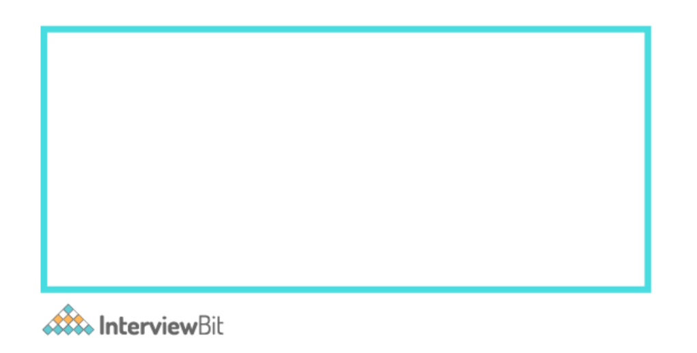

31. What is the purpose of closures in JavaScript?
    + In JavaScript, a closure is known as a JavaScript closure or JS closure. Closures allow you to access the scope (variables and parameters) of an outer function from an inner function. Every time a JavaScript function is created, a closure is created. JavaScript closures allow you to control which variables are and are not in scope in a given function, as well as which variables are shared among siblings within the same containing scope.

32. What is an event loop in Node JS?
    + Asynchronous programming in JavaScript is made possible by the event loop. With JS, all operations occur on a single thread, but we can create the illusion of multi-threading by using smart data structures. Event loop takes care of anything that's async using a queue and listener.
    + So, when an async function has to be executed (or an I/O has to be performed), the main thread sends it to another thread, allowing v8 (Javascript engine) to continue running its code. The event loop consists of different phases with specific tasks like pending callbacks, close callbacks, timers, idle or prepare, poll, check, with different FIFO (First-In-First-Out) queues.
