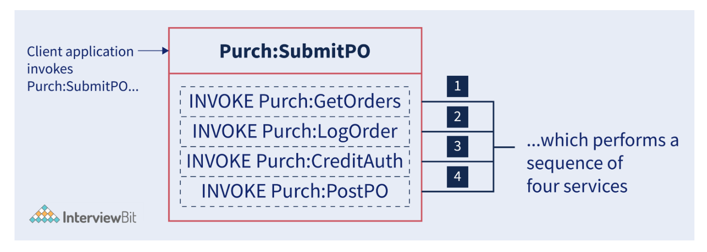
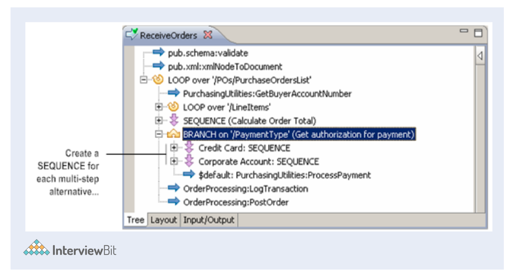
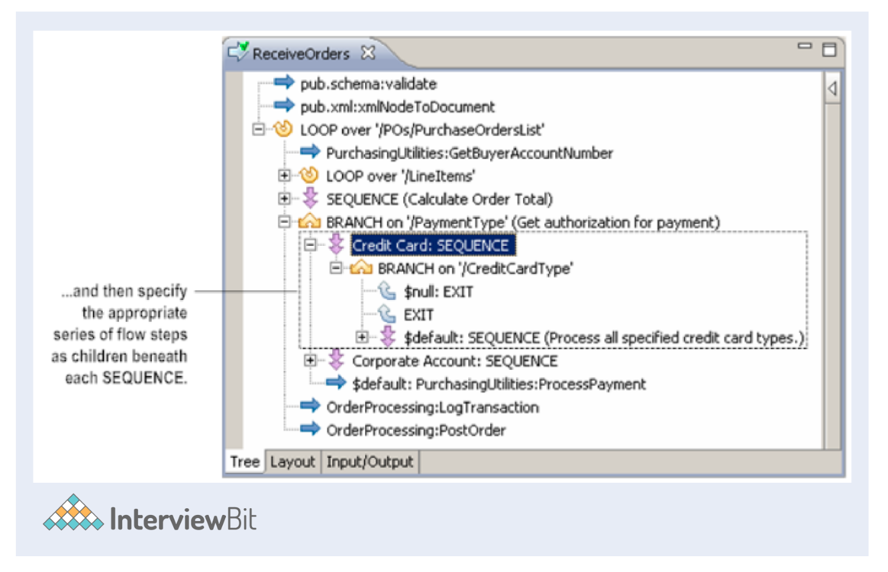

# Web Methods Interview Questions

---

1. List some Components of WebMethods.
   + WebMethods Integration platform provides components for designing, executing, and managing integration solutions. You can categorize these components as follows:
     + `Runtime components`: Run the Integration solution you developed.
     + `WebMethods Integration server`: In webMethods, it is one of the core application servers. It's a multiplatform and Java-based enterprise integration server. Integration of diverse services, such as the conversion of data between formats and communication between systems, is supported by this component.
     + `WebMethods Broker`: It is a high-performance message router. The Publish-Subscribe Model supports both synchronous and asynchronous message-based integrations.
     + `WebMethods Trading networks (TN)`: Trading networks are an essential part of the webMethods product suite that facilitates B2B transactions. This component runs on the webMethods IS (Integration server) and allows your firm to interact with external companies, generally referring to them as partners and marketplaces, etc.
     + `WebMethods Adapters`: Adapters run on webMethods IS (Integration server). These adapters connect back-end resources in the enterprise to the integration platform.
     + `Webmethods workflow`: A set of activities performed by several individuals.
     + `MywebMethods Server`: As a major component of the webMethods Suite, it plays a critical role in providing the UI (User Interface) framework so that customers can develop Web, portlet, and BPM (Business process management) applications. Moreover, my webMethods Server provides a central administration and monitoring platform for most of the webMethods Suite's products.
   + `Design-time components`: These components provide tools for designing and integrating solutions.
     + `WebMethods Developer`: This is the IDE (Integrated development environment) that allows you to open sessions on IS (Integration server) and develop your services.
     + `WebMethods workflow Designer`: It is used to develop and deploy workflows. A customized Eclipse-based tool, WebMethods Designer can be used for a wide variety of purposes, including service development, CAF (Composite Application Framework) page design and coding, and deployment to the My WebMethods Server.
     + `WebMethods Modeler`: It is a graphical tool used for designing and implementing business processes.
   + `Administrative components`: They configure the runtime environment and monitor how Integration solutions are executing on the Platform.
     + `WebMethods Administrator`: The administrator installs, configures, and maintains the WebMethods IS (Integration Server).
     + `WebMethods Monitor`: This tool allows you to view information logged by webMethods IS and webMethods Optimize.

2. What are the modules in the WebMethods Product Suite?
   + Service-Oriented Architecture.
   + Integration and B2B (Business to Business).
   + Business Activity Monitoring.
   + Business Process Management.

3. What is the Role of a WebMethods Developer?
   + This is the Java-based IDE (Integrated development environment) that allows you to open sessions on WebMethods IS (Integration server) and develop your services. It is used to develop code on WebMethods IS. In addition, it also supports the development of integration applications in WebMethods Flow. Webmethod flow is a graphical programming language specially used to simplify and speed up the development of integration applications.
   + Since version 7 of webMethods, webMethods Developer has been replaced by a new Eclipse-based IDE called webMethods Designer. As of yet, this transition has not been completed, and both products exist side by side.

4. Explain what you mean by flow service.
   + Flow services are services written in the webMethods flow language. With a flow service, you can encapsulate a sequence of services into a single service and manage the data flow between them.
     + Suppose, for example, you created a flow service that accepts purchase orders from buyers and executes the following series of services before submitting them to your internal ordering system:
       
       + Receives a purchase order submitted by the buyer.
       + Record the order in an audit trail.
       + Performs credit checks.
       + Posts the order in the ordering system.

5. What is the process for changing the order of steps in a flow service?
   + The arrows connecting the flow steps in the Layout tab show how (sequence) the steps are executed. It is possible to change the order that steps are executed in a flow service by moving or relocating steps. Also, a step can be relocated as a child of another step in the flow service.
     + Changing the sequence of steps in a flow service on the Layout tab
       + Click the Layout tab, then select the step whose execution order you wish to change
       + You can change the location of flow steps using the buttons, i.e., Cut, Copy, and Paste on the toolbar or in the context menu.
     + Changing the sequence of steps in a flow service on the editor panel
       + You can change the steps by pressing the 'Shift Up' or 'Shift Down' buttons.
       + By pressing the 'Shift Left' and 'Shift Right' buttons, you can move a service or branch in a sequence.

6. What is the Startup service and Shutdown service?
   + As part of the startup and shutdown services section of the Properties dialog box, you can specify what services webMethods Integration Server should automatically execute when packages are loaded into memory or unloaded from memory.
     + `Startup Service`: This displays the list of startup services a package can use, as well as the list of startup services assigned to a package. When a webMethods Integration Server loads a package into memory, it automatically executes a startup service. A startup service is useful to generate initialization files and prepare the environment (like setting up or cleaning up) before a package is loaded.
     + `Shutdown Service`: This displays the list of shutdown services a package can use, as well as the list of shutdown services assigned to a package. When a webMethods Integration Server unloads a package from memory, it automatically executes a shutdown service. Shutdown services are useful for performing cleanup tasks like closing files and cleaning temporary data. In addition, they can be used to capture state information or work-in-progress before a package is unloaded.

7. Explain the primary function of the built-in pub.flow:savePipeline service.
   + The pub.flow:savePipeline service is used to save the current pipeline to a specific location in memory on the Integration Server. Pipelines are stored in memory and can be retrieved later with the pub.flow:restorePipeline service. Pub.flow:restorePipeline service restores a pipeline that has previously been saved by pub.flow:savePipeline.
   + If that savePipeline is successfully invoked, a snapshot of pipeline fields will be saved under the key specified by $name. A pipeline is identified in memory by the string name "$name". If this value is not provided, an exception will be thrown.

8. Describe what happens when you invoke the pub.flow:tracePipeline service and pub.flow:clearPipeline.
   + When you invoke the pub.flow:tracePipeline service, the names, and values of all pipeline fields are written to the server log. When you invoke pub.flow:clearPipeline, all pipeline fields are removed or cleared. You can specify fields that shouldn't be removed/cleared using this service.

9.  What is the purpose of web service connectors?
    + When Integration Server creates consumer web service descriptors, it creates web service connectors which is a flow service. The web service connector usually contains logic and information/data required to invoke an operation specified in a WSDL (Web Service Description Language) document used to create the consumer web service descriptor.
    + As Integration Server creates consumer web service descriptors based on WSDL documents, it creates web service connectors for each operation the portType contains in the WSDL document. If, for example, a WSDL document contains 2 portType declarations, each of which contains 3 operations, then Integration Server creates a total of 6 web service connectors.

10. How can a service be invoked from a browser?
    + The 'Run in Browser' command enables you to run a service from a browser. Using this command, Designer prompts you for input values of service, creates the URL (Uniform Resource Locator) that is needed to invoke the service based on the input values you provide and passes the URL to your browser. If you use the 'Run in Browser' command to run a service, the browser (not Designer) triggers or invokes the service and receives the results. Open your browser and enter the following URL to invoke a service:
      + `http://servername:port/invoke/folder.subFolder.subsubFolder/serviceName`

11. Is it possible to change the JDK (Java Development Kit) used by Integration Server?
    + To switch or change the JDK used by webMethods, you must edit IntegrationServer/bin/server.sh or IntegrationServer/bin/server.bat used to start Integration Server. Save the file after changing the JDK path as follows.
      + `SET JAVA_DIR=C:\opt\j2sdk1.4.2`

12. State difference between a drop and delete pipeline variable.
    + Dropping a variable from Pipeline In or Pipeline Out will remove it from the pipeline. If pipeline variables aren't being used by subsequent services, they can be dropped. By removing unneeded variables, you reduce the size of the pipeline at run time, as well as the complexity of the Pipeline In and Pipeline Out displays. This can make the Pipeline view much more usable when you are working with a complicated flow. The term "drop pipeline" implies an explicit cleanup.
    + Delete is a design-time operation that removes a variable from the current view. It is only useful if you create a variable by mistake. When you change the view in developer after you delete a variable that was previously in the pipeline, the variable will appear again.

13. How will you check memory usage?
    + `Top command`: It provides a dynamic, real-time view of the current state of the system. You can view system information and process information, including up-time, average load, running tasks, number of logged-in users, and RAM usage. Also, you can view the processes that your users are running/using on your server.
    + `Free command`: Top command, however, can sometimes be too much for your purposes. If all you need is to see how much memory is free and used on your system, you can use the free command.

14. What are the steps to open a session on a different server?
    + Open the Integration Server and click the 'session' menu on the toolbar. Please enter the IP address and port details for the server you wish to connect to. Enter the username and password and simply click 'Connect'.

15. Explain UDDI (Universal, Description, Discovery and Integration).
    + UDDI stands for Universal, Description, Discovery, and Integration. UDDI is a platform-independent standard that describes SOA (Service Oriented Architecture) registry and its interface. By using UDDI, clients can discover registered businesses (organizations or service providers) and their web services. Furthermore, UDDI provides APIs for creating and updating registry information. UDDI defines a set of APIs that can be used to access and modify data stored in the registry. Some of these APIs are as follows:
      + `UDDI Inquiry`: Through this API, you can find registry entries and retrieve their information.
      + `UDDI Publication`: You can add new entries to the registry with this API or edit existing ones.
      + `UDDI Security`: It determines which security settings are applied to registry entities.

16. What is Integration Server in WebMethods?
    + webMethods Integration Server is one of the core application servers in the webMethods platform. It is a Java-based, multiplatform enterprise integration server. It supports the integration of diverse services, such as mapping data between formats and communication between systems.

17. What is an Enterprise Service Bus?
    + Software AG’s webMethods Integration Platform is an enterprise service bus solution that quickly connects all systems and applications no matter where they reside. This powerful solution offers a proven and pre-integrated software suite that makes it easy to quickly integrate systems, servers, processes, devices, partners and data.

18. Explain data transformation.
    + In most cases, systems do not produce data in the exact format that other systems require, so you often need to build flow services that transform the data. When applications and systems exchange documents, data transformation resolves differences in data representations. In Designer, data transformations are accomplished through mapping. Among the types of transformation you can achieve via mapping are:
      + `Name transformations`: The purpose of this transformation is to correct naming differences. By performing name transformations, the value and position of a variable remain the same in the document structure, but the variable's name is altered.
      + `Structural transformations`: These types of transformations resolve differences in the data types or structures that represent an item. The value of the variable does not change when you perform structural transformations; only its data type or position in the Document structure changes.
      + `Value transformations`: These types of transformations resolve differences in how values are expressed. A value transformation changes the data contained in the variable, but the variable's name and position remain the same.

19. Is there a way to see the Java code for the flow service?
    + Flow service is not curved or turned into Java code. It resides as XML on the disk on behalf of the flow operations. Afterwards, it parsed and transformed into a Java tree of operations. Although the flow operation is coded in Java, it is stored on a disk as XML.

20. How do we restore a session on the server?
    + In case of server failure or network problems, the developer becomes disconnected from the server. The developer should not be closed, as closing the developer prevents you from saving the changes. Upon resolving the server/network problem, the developer will get connected to the server automatically, and the session will be restored.

21. How can the existing pipeline be preserved before the restorePipeline step?
    + Pipelines are stored in memory using the pub.flow:savePipeline service, and can be retrieved later with the pub.flow:restorePipeline service. There is an input parameter in restorePipeline called $merge that indicates whether the values in the existing pipeline should be merged with those in the saved pipeline. You can set $merge to "true" or "false".
      + `False`: $merge is set to false to clear existing pipelines before restoring saved pipelines. By default, it is set to false.
      + `True`: When $merge is set to true, the existing pipeline will be merged with the saved pipeline. When a field appears in both the saved pipeline and the existing pipeline, the saved field prevails.
    + You can preserve the existing pipeline by setting the "$merge" variable in restorePipeline to true. In this way, everything in the pipeline is preserved before the restorePipeline step.

22. Can a system lock be removed from an element?
    + Locking an element prevents it from being edited by another user. Locks can be either user locks or system locks. An element that is locked by the user is a user lock. All other users can read, but not modify the element until you unlock it. A system lock occurs when the server administrator marks or sets the element's supporting files (like node.xml) as read-only on the Integration Server. To edit an element, the server administrator must remove the system lock from the element (allow the element's files to be modified). After that, you need to reload the package that contains the element.

23. Is it possible to sort using the JDBC select adapter service?
    + Even though there is no 'order by' tab, the same functionality is available in the 'SELECT' tab. It has a column titled "Sort Order" that allows you to specify which column you wish to sort by. Simply change the order of the columns selected to alter the order.

24. How will you use SEQUENCE as the Target of a BRANCH?
    + There may be times a BRANCH step is needed if you want to conditionally run/execute a series or number of multiple steps instead of just one (single step). In such cases, you can utilize or use the SEQUENCE step as the target step and group a series of flow steps below it (beneath).
      + Example: An example is given below in which a service accepts a purchase order. Based on the payment type specified in the PaymentType variable, the purchase order is processed in one of three ways. Since each PO (purchase order) requires a series of steps to be completed, the targets of the BRANCH are designated as SEQUENCE steps, and the appropriate set of flow steps is listed as a child of each SEQUENCE (children beneath each SEQUENCE).
        + Consider the SEQUENCE step as the target of a multi-step alternative
          
        + Describe a multi-step alternative in a sequence
          

25. Explain branch operation.
    + Conditional processing is supported by the branch operation. It is similar to an "if-then-else" statement that can be found in languages such as Java. To create a BRANCH operation:
      + Incorporate/Add the BRANCH step to the service.
      + Specify or set a BRANCH condition.
      + Add logic to perform the transformation once the condition is met.

26. If we want to repeat an operation as long as a repeat condition is met, how do we set the count parameter?
    + To repeat an operation as long as the specified condition is met, we need to set the count parameter to '-1'.

27. An HTTP listener is assigned by default to which port on the webMethods Integration Server?
    + webMethods Integration Server has an HTTP listener assigned by default to the 5555 port.

28. What do you mean by client groups?
    + A client group generally consists of a list of clients and configures which documents the clients can subscribe to and bring out. The WebMethods Broker administrator defines and maintains client groups. There are names for each client group.

29. How to organize connection pools?
    + There should be two separate connections if you are using adapter notifications and adapter services. If not, you may receive strange errors regarding transactions, etc. Moreover, don't share connection pools with different functional areas, even when they point to the same database. If you share connection pools with different functional areas then:
      + Tuning or changing the size of the pool can become quite challenging if you have different types of usage of the pool.
      + It is also difficult to change individual database settings without affecting the others.
    + Having separate pools for each package generally seems to work fairly well (though not a hard and fast rule), since your packages are generally divided up according to the functional area.

30. Explain what is EAI (Enterprise application integration).
    + EAI stands for Enterprise Application Integration. To overcome the lack of communication between enterprise applications, Enterprise Application Integration (EAI) technologies are implemented to facilitate communication among enterprise applications. This is a technology that makes it possible to interact and share data among connected applications and data sources across organizations and enterprises. It bridges the gap between different systems and enables data flow among heterogeneous systems.
      + Advantages:
        + Streamlines business processes and increases organizational efficiency.
        + Real-time information sharing among systems.
        + Ensures accuracy of data across multiple systems.
        + Faster transactions at a lower cost.
        + If there is a problem with one of the applications and it needs to be shut down, EAI makes it easy to "decouple" it from the rest of the system. By doing so, the rest of the systems are not affected.

31. What effect does ACLs (Access Control List) have on locking?
    + The lock feature lets you control access at the user (individual) level, whereas ACLs let you control access by groups of users. ACLs provide authorization to specific user groups. By giving ACL access to the administrator, all admin group members included in the group will have access to the specific service.

32. What is the best way to change the logging date format for WebMethods Integration Server?
    + The date format to be used in log files is specified by the watt.server.dateStampFmt parameter. It is best to edit the watt.server.dateStampFmt in the server.cnf file to change the logging date format for WebMethods Integration Server. This parameter specifies the date format to be used in the server log file as well as in the Integration Server Administrator.

33. What are the most common problems encountered when migrating a project?
    + There is a missing jar file.
    + The thread got stuck.
    + The JDBC adapter does not suspend.
    + The scheduler is missing in the internal database or either the next run time is not visible.
